# Get to know the Operational Workforce Planning Content
<!-- description --> Run through the content to get to know the standard workflow as well as the capabilities of the content. Please find the detailed documentation in [SAP Help](https://help.sap.com/docs/SAP_ANALYTICS_CLOUD/21868089d6ae4c5ab55f599c691726be/7032f23e00b34a7ab6d79af20a8792a7.html?locale=en-US) and [User Guide](https://help.sap.com/docs/SAP_ANALYTICS_CLOUD/42093f14b43c485fbe3adbbe81eff6c8/7032f23e00b34a7ab6d79af20a8792a7.html?locale=en-US). More general information around the topic xP&A as well as Videos showing the content can be found here on the [Community page](https://community.sap.com/topics/cloud-analytics/planning/content) 

## Prerequisites
 * [SAP Analytics Cloud Test or Demo Tenant](https://partneredge.sap.com/en/library/education/products/analytics/cfa/sell/e_ta_cfa_demo.html)
 * [Import the Workforce Planning Content](https://help.sap.com/docs/SAP*ANALYTICS*CLOUD/00f68c2e08b941f081002fd3691d86a7/078868f57f3346a98c3233207bd211c7.html?locale=en-US)
 * SAP Analytics Designer currently requires ***Google Chrome***.
 * Especially when showing the demo on single laptop screen there may be issues due to screen resolution. If you encounter issues, then you must test on your laptop by changing the screen resolution and / or the Chrome zoom percentage. (recommendation is 67% - 80%) 

## You will learn
 This demo showcases the SAP Analytics Cloud Content tailored for SAP HXM Workforce Planning with the following highlights:  
 1. **Application Configuration**: Set up the central parameters for the planning process, pre populate the different planning versions and pre-aggregate on specific planning levels for aggregated planning. (Step 5)
 2. **Aggregated Planning**: Planning on aggregated level for internal and external workforce. (Step 6 - 9)
 3. **Detailed Planning**: Planning on detailed level for internal workforce. (Step 10 - 12)
 4. **Publish to Integrated Financial Planning**: Transfer data to the integrated financial planning to integrate the results in the overarching planning process. (Step 13)
 5. **Reporting**: This content provides a quick view on the planners target state and can be used to compare with different versions or the actual values. (Step 14)

### (optional) Access SAP Contents

>**Note: Below steps show the location of SAC Contents. It is only needed when you want to show the individual stories. To start the demo, please jump to step 3**

| What to do                                | What to focus on        | What you should see         |
| :--------------------------------------------------|---------------------------|----------------------------|
| 1. Log on to SAC tenant in Chrome | |
| 2. Click on menu `Files` | |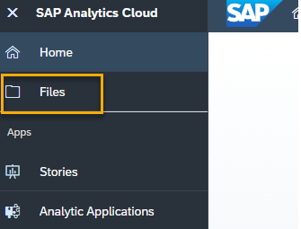   
| 3. Filter using `SAP_CONTENT`, or navigate to `Public`, `SAP_CONTENT` | |    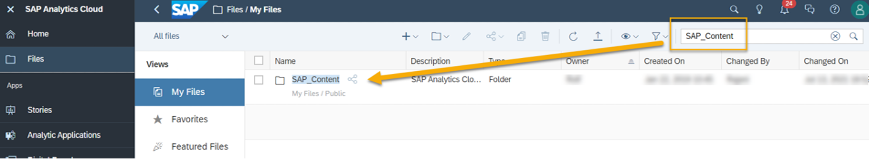   
| 4. The folder `SAP_CONTENT` contains all the objects required to run the SAC Content. | |     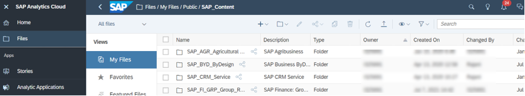   

### (optional) Access Workforce Planning Content 

| What to do                                | What to focus on        | What you should see         |
| :--------------------------------------------------|---------------------------|----------------------------|
| 1. For the SAP Human Experience Management: Workforce Planning, search for `HXM` and then click on `SAP_HXM_Workforce_Planning`. | The search result will be presented in the list. You will see the folder for the HXM Workforce Planning packages, as well as the folder for the HXM Workforce Planning Add-on (in case it was imported into the tenant). | 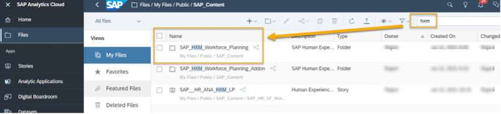
| 2. To run a SAC demo, open and run application `SAP__HR_BPL_IM_WFP_OVERVIEW_PAGE`. | The folder `SAP_HXM_Workforce_Planning` contains the applications and the reporting story. | 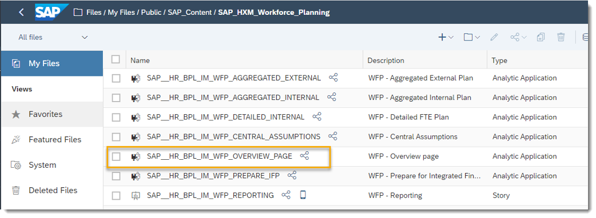   

### Workforce Planning Content Overview

| What to do                                | What to focus on        | What you should see         |
| :--------------------------------------------------|---------------------------|----------------------------|
| 1. Click on the application `SAP__HR_BPL_IM_WFP_OVERVIEW_PAGE`. | The overview application serves as the central entry point and helps to navigate through the content.   On this page a user can quickly see the number of their existing and to be hired Headcount and the amount of Total Cost budget for a given year. Below are the three different sections for different personas: Controllers, HR business partners, cost center managers and people from the Finance department.   The sections are divided as follows   - Configure the planning process and needed Parameters -> Application Configuration   - Navigate to the planning applications -> Aggregated Internal Planning, Aggregated External Planning, Detailed Internal Planning   - Reports -> Navigate to the pages of the reporting story | 
| 2. Remain on the landing page which is a dashboard. | Clicking on the house icon in the top left corner inside all the applications you can always navigate back to this overview page      | 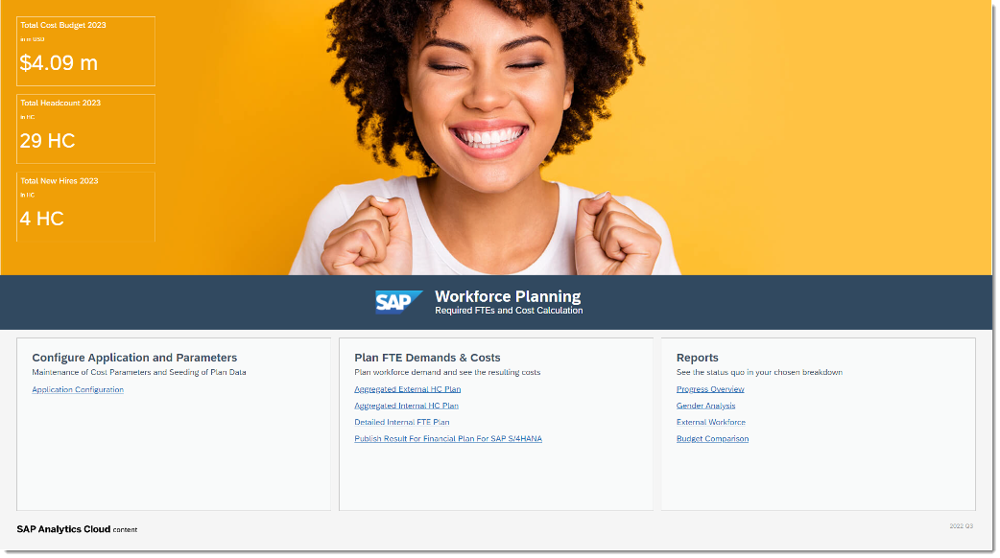

### Navigation Concepts within the content

| What to do                                | What to focus on        | What you should see         |
| :--------------------------------------------------|---------------------------|----------------------------|
| 1. Navigation concepts used in the Demand & Costs applications | **Please note** : In a former version the last link Prepare Result For Financial Plan For SAP S/4HANA was not visible by default as the application was part of Add-on package SAP Human Experience Management: Add-on for Cross Model Copy to Integrated Financial Planning (`SAP_HXM_Workforce_Planning_Addon`). Starting from the 2022 QRC02 delivery the application is part of the main workforce planning package hence it is visible by default. | 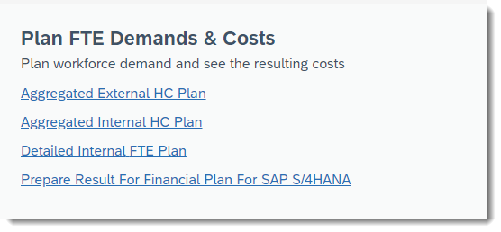
| 2. `Show adjustment` toggle switch | This switch shows or hides the adjustment section.   -	Amount (read only): contains calculated costs based on HC/FTE and cost drivers maintained in the in the central assumptions   - Adjustment (input ready): you can maintain manual adjustments to be added on top of the calculated costs   - Total Amount (read only): sum of Amount and Adjustment | 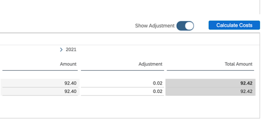
| 3. `Version` button at the comparison charts | **Please note:** Initializing plan data in aggregated planning for more than one planning level will lead to duplicate results for the `Aggregated_Plan` version in the charts | 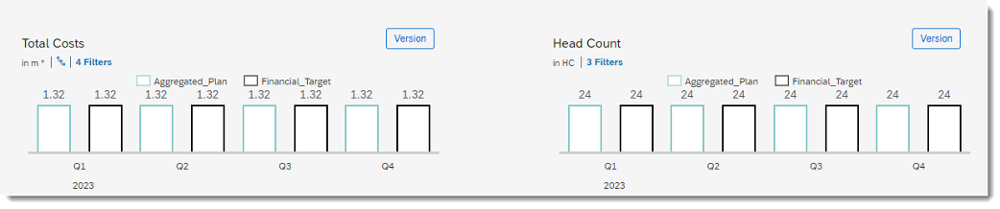        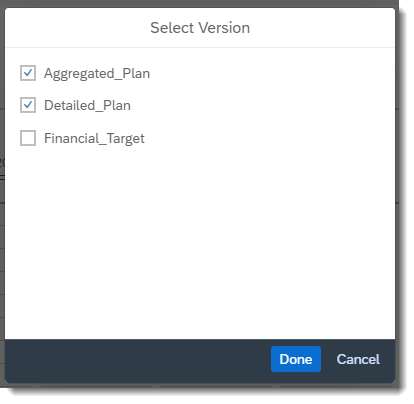
| 4. `Steps` description    Describes the workflow within the app | Clicking on the Version button will display a popup with all existing versions which can be used for a comparison. If the selected version is set up correctly (Audit) and data is existing, it will be displayed as comparison column      |  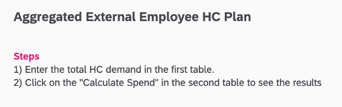  
| 5. `Home screen` Button | Clicking on the Home screen button will bring you back to the Overview Page (Application)     |    
| 6. Ask a question | Clicking the *Ask a question* More Button will open an SAC Community page and lets you post a question related to the HXM operative workforce planning. |    
| 7. `Get Involved` Button | Clicking the *Get Involved* Button will open an SAP Influence Program page and lets you post your wishes related to the HXM operative workforce planning. |    
| 8. `Learn More` Button | Clicking the Learn More Button will open an SAC Community page dedicated to planning content providing more insights on the workforce planning apps. |    
| 9. `Show/Hide` Header | Hides the header section with comparisons charts and step description to leave more room for the planning tables |        
| 10. `Show/Hide` Header | After planning you can unhide the header section again pressing the same button |    
| 11. Buttons for collapsing lanes | Clicking on the triangle icons next to the table headers will allow you to open or close a certain table to leave more room for a particular table. Tables are resized accordingly. This interacts with the `Show/Hide` Header button to allow for maximum room for a planning table when keying in data.     | 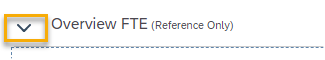             
| 12. Filter Line Button | All planning applications of the content package offer a filter line to be able filter all tables/charts for easier data entry.       | 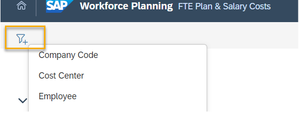   
| 13. `Confirm` Button | The confirm button lets you publish your current plan data into the public planning version.     |    
| 14. `Reset` Button | In the Aggregated Planning (Internal/External) the Reset Button can be used to reset all changes you did to the current planning version and have not published yet. In the Detailed FTE Plan application you can decide to either reset all plan data or only the plan data for an individual employee.     | 
| 15. Reset a plan version | | 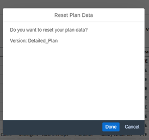
| 16. Reset a selected Employee | | 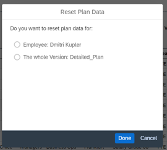

### Application Configuration: Planning Parameters and inital setup

| What to do                                | What to focus on        | What you should see         |
| :--------------------------------------------------|---------------------------|----------------------------|
| 1. Click on the ` Application Configuration ` . | This application facilitates a central place to set up planning required parameters, populate and initialize the planning process and set up different planning versions.   This is, the maintenance of the plan cost types that are leveraged during cost calculation as well as seeding of the initial plan data (Headcount data) by copying from a reference Actuals data slice. | 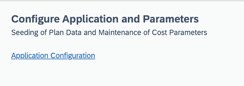   
| 2. Make yourself familiar with the application screen. | | 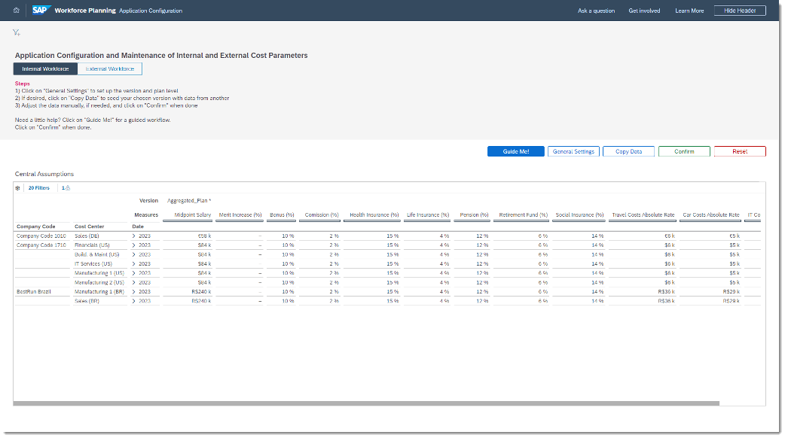   
| 3. Check the `Steps` section | The content provides a Step by step guide, with the caption Steps which helps the user for the setup process  | 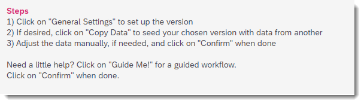   
| 4. Click on `Guide Me!` | Users can decide to be guided through the setup process pressing the Guide Me! Button. Or configure the planning data individually with the General Settings and Copy Data functions. **Press on Guide Me!** |    
| 4.1 Select version you want to plan on `Aggregated_Plan` or `Detailed_Plan` | **In Step 1**   You can decide on which version to plan. Additional versions need to be created in the data model beforehand. One of the predefined planning levels is mapped to the version based on customizing in the dimension version.     For Aggregated Planning (internal/external) Standard Version `Aggregated_Plan` the following plan levels are available:   - Company Code / Business Unit / Division (PL1)   - Company Code / Business Unit (PL2)   - Company Code / Cost Center (PL3)   - Company Code / Business Unit / Job Family (PL5)            For Detailed Planning (Standard Version `Detailed_Plan`):   - Company Code / Cost Center (`Detailed Planning`) (PL4); in the Detailed Planning, data is not being aggregated, the planning level only defines the drill down in the table with regards to the organizational structure.| 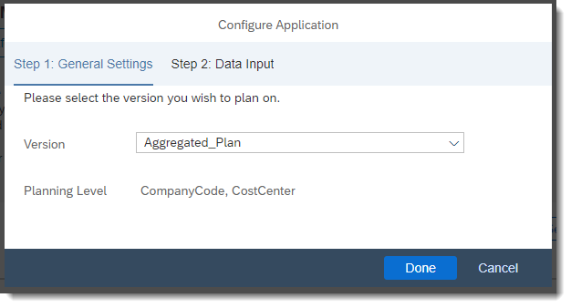
| 4.2 Level of Planning | Mapping between Version and Planning Levels is maintained via property Planning Direction (Planning Direction) in the dimensions Version and `Plan_Level`. The default values used are Aggregated and Detailed.     **Dimension Aggregation Level for Planning (`Plan_Level`)**     General availability of a planning level for selection can be toggled by property Is Available (`IsAvailable`)         **Dimension Version (Version)**     The default / selected planning level for a particular version is stored in property Plan Level (`PlanLevel`). Only one planning level can be used for a particular version.     | 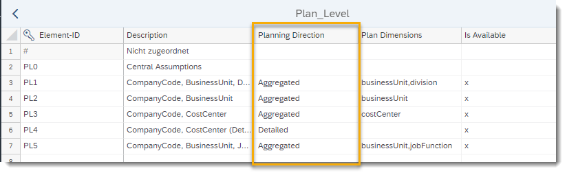  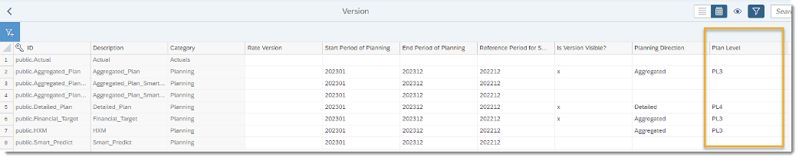   
| 4.3 How to load data | **In Step 2**     -	You can select to manually maintain initial cost parameter data (Midpoint Salary, Merit Increase (%), Bonus (%) …) or to copy the data that is already available in another version.  - Lastly you need to decide if you want to set up the plan data and parameters for Internal or External Workforce planning (for now we stick to Internal Workforce Planning) | 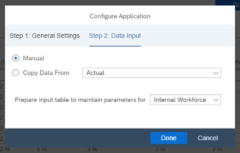
| 4.4 Click `Done` to close the dialogue | Depending on your settings for the plan level the drill down of the maintenance table will be changed automatically. The table displays the plan cost types which are relevant for costs calculations on the selected aggregated plan level dimensions. The user can now maintain adapt existing value or maintain new ones.    There are three kind of measures to be maintained:   - Midpoint Salary is the average salary for a new hire   - Percent rates like Bonus(%), Health Insurance (%) are always considered based on the monthly salary of an existing employee or the midpoint salary in case of a new hire   - Absolute Rates like Travel Costs Absolute Rate which are absolute per capita rates to be added during cost calculation |    
| 5 Click on button `External Workforce` | We now switch to the setup of parameters for external workforce. The Layout for the input table will change accordingly.     |    
| 6 Set up parameters for External Workforce | Similarly, to the plan setup for internal workforce the drill down for the table reflects the predefined plan level (plus Location dimension)   For external workforce the monthly (!) rate can be maintained on the selected organization level and location.      | 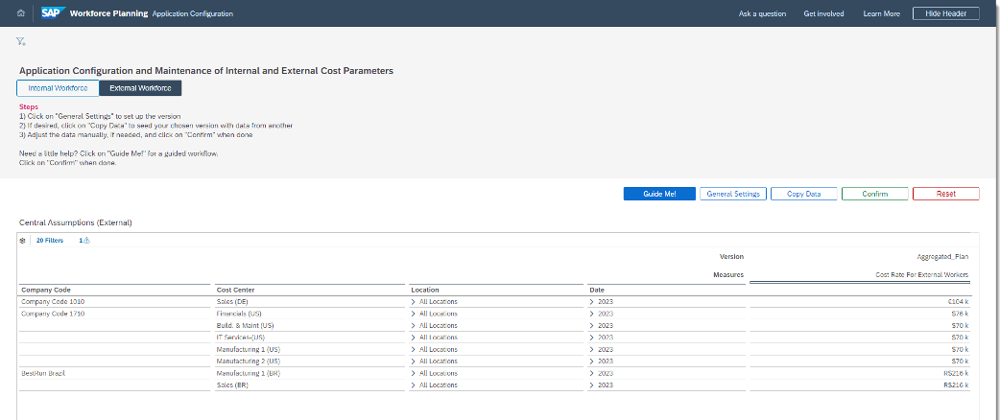   
| 7 Press `Confirm` | Pressing `Confirm` will publish the central assumptions for the selected version and planning level combination.            Additionally, if option Initialize Plan Data After Publish switched on the planning horizon will be pre filled with actuals data from the reference period. The initialize Plan Data option should only be executed for one combination of Version + Planning Level, i.e. for the one the planner are supposed to plan on.    **Please note:** Initializing plan data in for more than one planning level per version will lead to duplicate results for the version in the reporting charts.          Dimension Version (Version)   The plan horizon for a particular version can be maintained indicating the start and end period in properties Start Period of Planning ( `` StartPeriod `` ) and End Period of Planning ( `` EndPeriod `` ) respectively. The start period needs to be entered as `<YYYY>01` and end period as `<YYYY>12`. Only full years are supported, i.e. a total of 12, 24, 36... periods.   The reference period denotes the period from which actuals data is copied into the plan horizon for initializing the plan version in the non-predictive initialization. It needs to be maintained in property Reference Period for Seeding (`ReferencePeriod`)        | 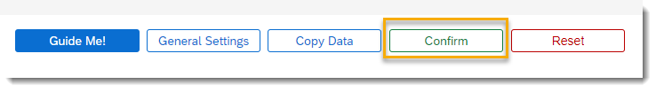 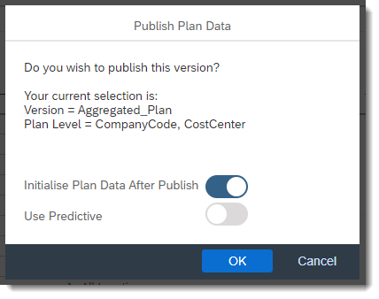 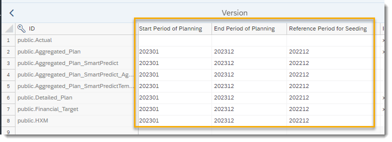
| 7.1 (Optional) Switch on `Use Predictive` and press `` Ok`` .   Click the Multi Action Trigger | **Please note**:     - Currently the multi actions delivered with the content package do not contain the predictive scenarios as part of the standard delivery, but need to be added to the multi actions.   - Currently parameters set in the data actions within the multi actions are static and are not influenced by the customizing properties of dimensions Aggregation Level for Planning ( `` Plan_Level `` ) and Version (Version)    For a version for aggregated planning you will also see the option Use Predictive. The predictive forecast will allow you to initialize an additional version (public. `` Smart_Predict `` ) with a headcount prediction for the upcoming plan horizon based on the previous 5 years actuals.   If you switch on option Use Predictive and press `` OK `` you will see a multi action trigger for your selected planning level to start the predictive forecast.     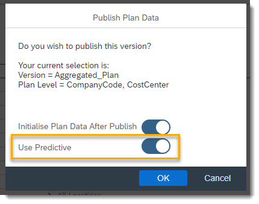        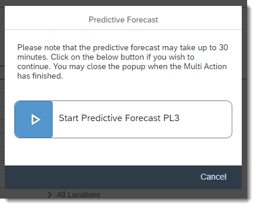   

### Aggregated Planning: External HC Plan

| What to do                                | What to focus on        | What you should see         |
| :--------------------------------------------------|---------------------------|----------------------------|
| 1. Click on the `Aggregated External HC Plan` | You can find the Link in the Overview App. If needed navigate to it with the Home screen Button. The aggregated planning application is designed to perform planning activities for External Workforce on an aggregated level.    The application has three sections. In the top section, called header section, you can compare your current planning version with other versions.     In the middle of the screen, you can see the HC Demand planning table. On the aggregated level you can plan the desired headcount end of period values. As the driving criteria for external workforce is location, you can plan always on this dimension. The drill down for the table will set according to the predefined planning level of the version.    In the last section the corresponding costs can be visualized and adjusted. | 
| 2. Enter adjusted headcount values in the upper table and drag them up to end of the planning period. | Get to know that you can use planning tables in an excel style of fashion. | 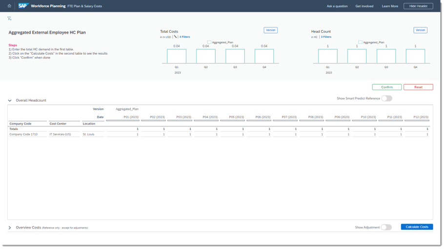
| 3. Press button `Calculate Costs` | Please press the Calculate Cost Button to recalculate the costs after having planned additional headcount. Check calculated costs in the lower table for your entered headcount
| 4. Click on switch `Show Adjustment` | Using the toggle switch ` Show Adjustment `, you can display the adjustment column for entering manual adjustments to the calculated costs. Enter additional costs in the ` Manual Adjustment` column        
| 3. Click on `Confirm` or `Reset` button to publish or revert your plan data | |        

### Aggregated Planning: Internal HC Plan

| What to do                                | What to focus on        | What you should see         |
| :--------------------------------------------------|---------------------------|----------------------------|
| 1. Click on the ` Aggregated Internal HC Plan ` in the Overview application. | This application is designed to perform planning activities for Internal Workforce on an aggregated level.  |  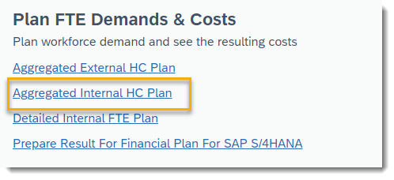   

### Aggregated Planning: Plan Total Internal HC Demand

| What to do                                | What to focus on        | What you should see         |
| :--------------------------------------------------|---------------------------|----------------------------|
| 1. Enter adjusted headcount values in the upper table and drag them up to end of the planning period.    | The application has three sections. In the top section, called header section, you can compare your current planning version with other versions.    In the middle of the screen, you can see the HC Demand planning table. On the aggregated level you can plan the desired headcount end of period values. The drill down for the table will set according to the predefined planning level of the version.   In the lower section of the screen the corresponding costs can be visualized and adjusted. |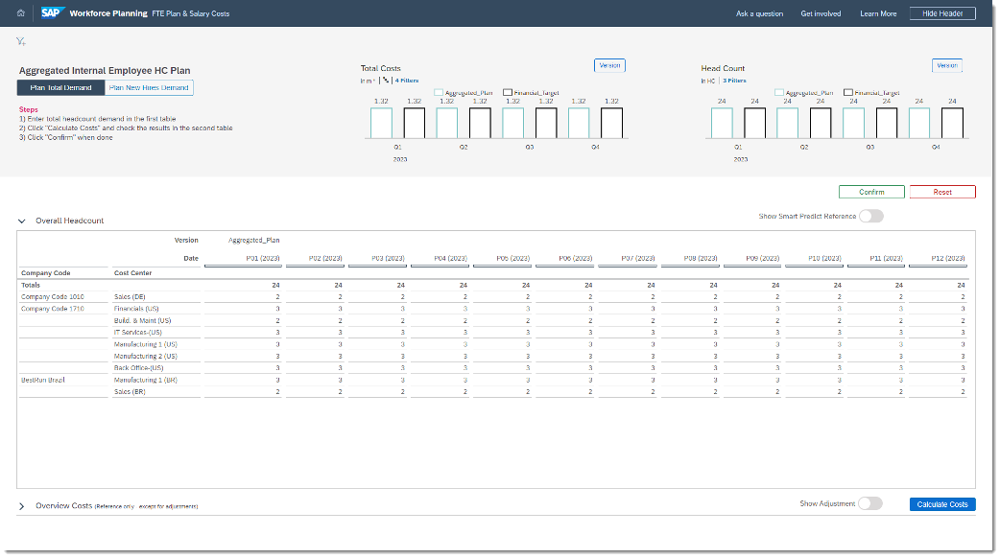   
| 2. Press button `Calculate Costs`    | Please press the Calculate Cost Button to recalculate the costs after having planned additional headcount. |
| 3. Check calculated costs in the lower table for your entered headcount    | |
| 4. Click on switch `Show Adjustment`    | Using the toggle switch ` Show Adjustment `, you can display the adjustment column for entering manual adjustments to the calculated costs. Enter additional costs in the Adjustment column  |
| 5. Click on `Confirm` or `Reset` button to publish or revert your plan data | |    

### Aggregated Planning: Plan New Hires Demand

| What to do                                | What to focus on        | What you should see         |
| :--------------------------------------------------|---------------------------|----------------------------|
| 1. Click on button `Plan New Hires Demand`    | This application is designed to perform planning activities for New Hires from a demand point of view. |
| 2. Enter delta values in the rows Hires (HC) and Terminations (HC) for a particular period (**do not drag them until end of planning grid!**)    | |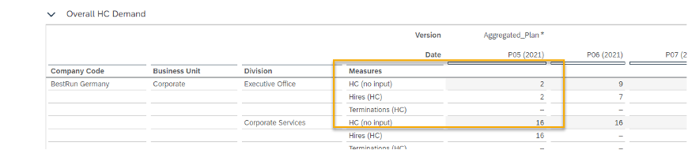
| 3. Press button `Calculate Costs`    | |
| 4. Check calculated costs in the lower table for your entered headcount    | |
| 5. Click on switch `Show Adjustment`    | | 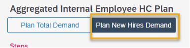
| 6. Enter additional costs in the `Adjustment` column | Clicking on the `Plan New Hires Demand` will switch the input layout for the headcount table to enter delta values for hires/terminations instead of maintaining end of period head count values.           After pressing the *Calculate Costs* button, the *HC (no input)* end of period measure will reflect the entered delta values in Rows *Hires (HC)* and *Terminations (HC)*; in the costs table changes will also reflect the changes in headcount.     Adjustment column for entering manual adjustments |          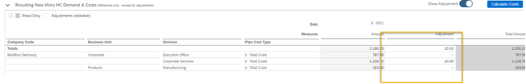   
| 7. Click on button `Plan Total Demand` again to switch back to the end of period view | During the planning process you can switch back and forth between the different entry modes. But be aware that the respective measures need to be calculated (delta hires/terminations vs. end of periods headcount values), when switching, hence there is a delay due to a data action run for calculation. | |
| 8. Click on `Confirm` or `Reset` button to publish or revert your plan data | |     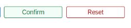   

### Detailed Planning: Internal FTE Plan

| What to do                                | What to focus on        | What you should see         |
| :--------------------------------------------------|---------------------------|----------------------------|
| 1. Click on the ` Detailed Internal HC Plan `.| This application is designed to perform planning activities for Internal Workforce on a detailed level.     |    

### Detailed Planning: Plan Absence & Movements

| What to do                                | What to focus on        | What you should see         |
| :--------------------------------------------------|---------------------------|----------------------------|
| 1. Overview | The application has three sections. In the top section, called header section, you can compare your current planning version with other versions.    In the middle of the screen, you can see the FTE planning table. On the detailed level you can select any employee and choose an action from the Action drop down for the selected employee. The Button General Settings lets you configure the display mode of the values in the dropdown boxes, i.e. ID + Description or Description only    In the lower section of the screen the corresponding costs are visualized and can be adjusted. Using the toggle switch `Show Adjustment`, you can display the adjustment column for entering manual adjustments to the calculated costs.    In the *Absence & Movement* view existing employees and their costs can be planned (via employee actions).    In the *New Hires* view, new positions can be planned.     | 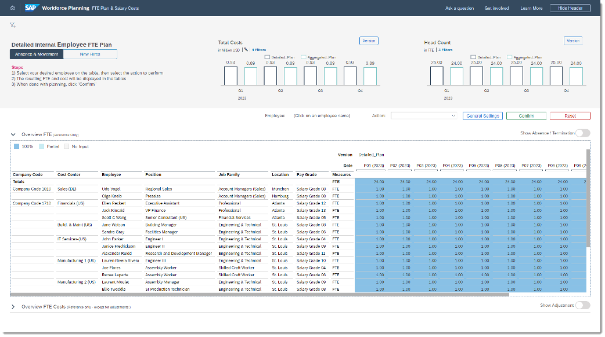   
| 2. Click on any cell in the FTE table to select an employee | By selecting an employee in the table and then using this dropdown, different planning activities can be performed     | 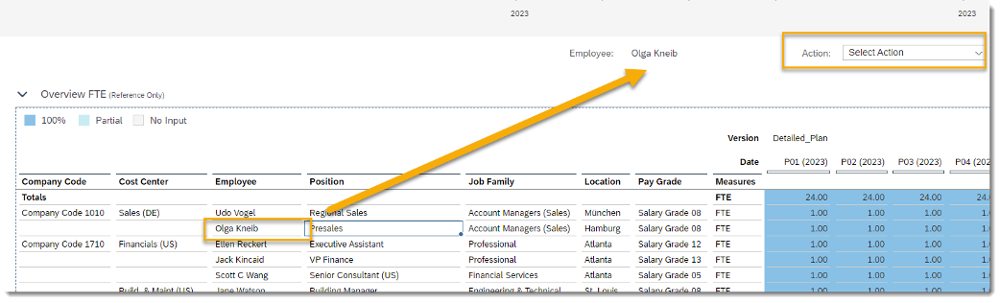   
| 3. Choose an action from the Action menu to be performed for the selected employee |     | 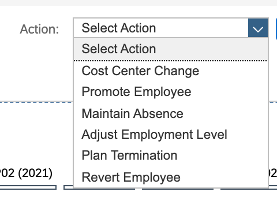   
| 4. Fill the needed parameters for the employee action (example here: *Adjust Employment Level*) | A popup appears for maintenance of the relevant parameters for the selected employee action     | 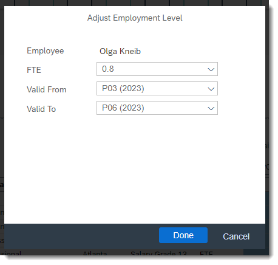   
| 5. Press `Done` in the Pop Up | The Popup disappears and the respective data action is triggered in the backend.         After the execution the FTE table displays the updated records.     Costs for the selected employee are being recalculated as well. Costs data actions could be customized accordingly, (e.g. paid leave vs. unpaid leave in case of absence) | 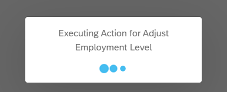 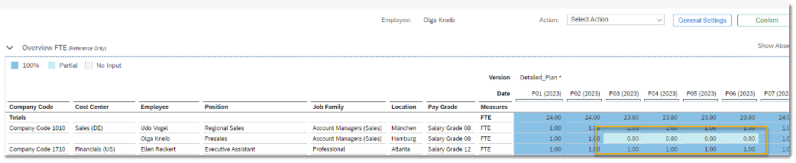   
| 6. Toggle switch `Show Absence / Termination` | Showing two more detailed measures *Absence* and *Terminations*     | 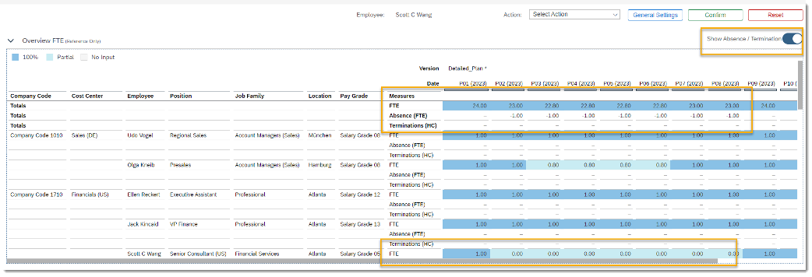   
| 7. Expand lane for costs table by clicking on the triangle icon next to the Table Description | Table will be expanded. Adjusted costs will be displayed in the costs table. | 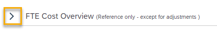     
| 8. Switch `Show Adjustment` to On | |    
| 9. Drill down Plan cost type hierarchy and adjust Bonus for the selected employee | | 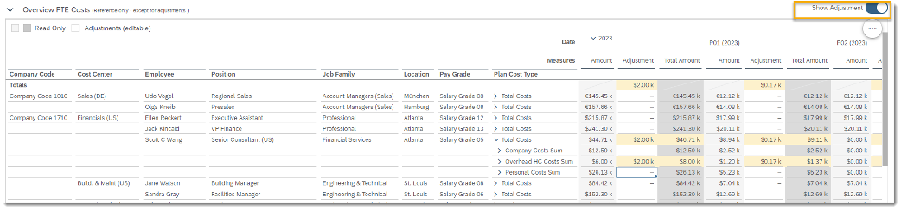   
| 10. Click on `Reset` if you want to revert your plan data (either whole version or for selected employee only) | |    
| 11. Press `Done`|   Reverting plan data of an individual employee will initialize the FTE as well as the costs data for this employee     | 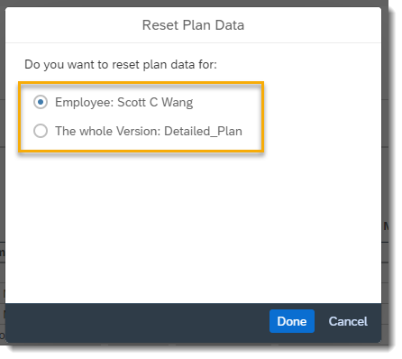 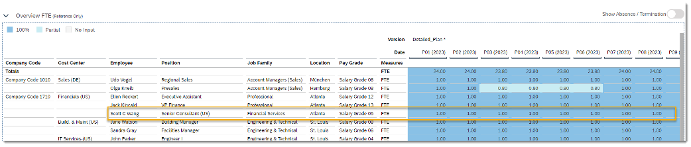   
| 12. Click on `Confirm `if you want to publish your plan data

### Detailed Planning: Plan New Hires

| What to do                                | What to focus on        | What you should see         |
| :--------------------------------------------------|---------------------------|----------------------------|
| 1. Click on the button `New Hires` | The New Hires view enables the cost center manager to plan new positions for his team.   The table is now configured to display new positions only, i.e. the employee dimensions if filtered to Unassigned (`#`). Initially the FTE and costs tables will be empty.    | 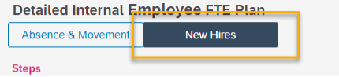     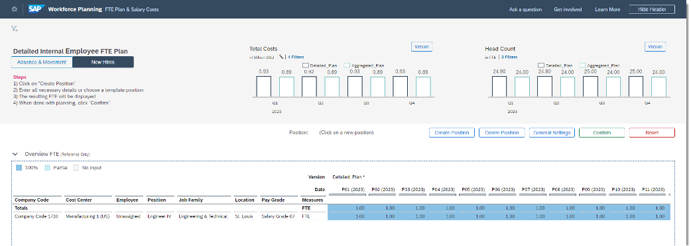   
| 2. Click Button `Create Position` | A Popup will open in which you need to maintain parameters for the new position. All parameters are mandatory. | 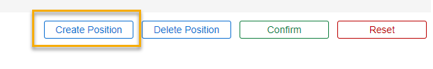   
| 3. Fill up the information |  After pressing Create, a new Position with according FTE numbers throughout the planning year will be created and the respective costs will be calculated based on the Midpoint Salary maintained in the Central assumptions. |     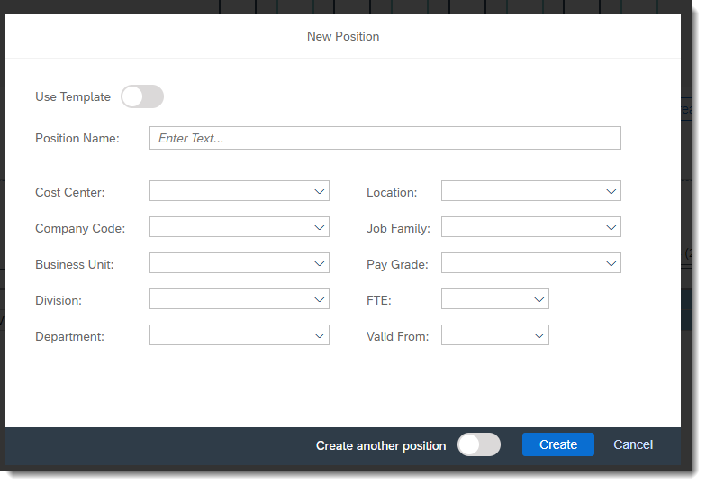
| 4. Toggle the Switch for `Use Template` and select a template position from the appearing drop down list.    Adjust the Position description| Toggling the `Create another position` will leave the window open if you need to plan multiple similar positions. |        
| 5. Click on the `Create Button` | The new plan position is created and its costs are calculated based on the midpoint salary as defined in the Central Assumptions (PL0) for this Company Code / Cost Center combination. If the Company Code / Cost Center is not defined in the Central Assumptions (PL0), costs cannot be calculated.     |            
| 6. Check Results | Result in the FTE table     |    
| 7. Check Cost Overview | Result in the Cost Overview table      |    
| 8. Select a newly planned position in the `Overview FTE` table by clicking on it |    |    
| 9. Click Button `Delete` Position | |       
| 10. Confirm the `Delete Position` dialogue | As a result the planned position and its costs are deleted. |     

### Publish to Integrated Financial Planning: Prepare Result for Financial Plan for SAP S/4HANA

| What to do                                | What to focus on        | What you should see         |
| :--------------------------------------------------|---------------------------|----------------------------|
| 1. Overview | This application helps you to prepare your plan data for version `HXM` for integration with the operating expense planning in [Integrated Financial Planning for SAP S/4HANA and S/4HANA Cloud](https://help.sap.com/docs/SAP_ANALYTICS_CLOUD/21868089d6ae4c5ab55f599c691726be/7b8caa06f850453fab8d570be92f4c99.html?locale=en-US).   For the derivation of GL Accounts, please maintain the corresponding account numbers in the dimension Plan Cost Type (`SAP_HR_COSTTYPE`) -> property `GL_Account`. |            
| 2. Click `General Settings` and choose version `Aggregated _Plan` and click on OK | The pop-up will let you select your source version       |             
| 3. Click `G/L Mapping` and press |       You will see the Pop Up for the Version and Plan Level to confirm for the G/L Account derivation      |         
| 4. Press `OK` | After pressing OK, the cost data from your selected source version will be copied to version `HXM` and will be enriched with the G/L account information      |    
| 5. Press `Confirm` to Publish the HXM Version |     |    
| 6. Click on the Hyperlink to open the transfer story | Prerequisite: **The packages Cross-Model Add-Ons for Integrated Financial Planning for SAP S/4HANA and Integrated Financial Planning for SAP S/4HANA must be imported before!      The **Workforce Planning Integration** story (`SAP_FI_IFP_IM_Addon_WFPIntegration`) will open and lets you transfer the costs into the Operating Expense Planning model. |                

### Reporting

| What to do                                | What to focus on        | What you should see         |
| :--------------------------------------------------|---------------------------|----------------------------|
| 1. Get familiar with the different Report Sections to navigate into the included Reporting Story pages |     |    
| 2. Click on `Progress Overview` | The *Progress Overview* story page offers a Actual vs. Plan comparison based on different dimensions (Location, Job Family, Job Level etc.)     |    
| 3. Either go back an click on `Gender Analysis` or use the in the report existing navigation concept of Reporting Pages | The *Gender Analysis* story page offers an in depth analysis on the gender distribution across various dimensions (Location, Job Family, Job Level, etc.)|       
| 4. Navigate to the External Workforce report | The *External Workforce* story pages offers an in depth analysis on the ratios of internal vs. external workforce across various dimensions (Location, Job Family, Job Level etc.)    |    
| 5. Navigate to the Budget Comparison report | The *Budget Comparison* story page offers a comparison of planned vs budgeted headcounts and costs across various dimensions (Location, Job Family, Job Level etc.)      |   

---
