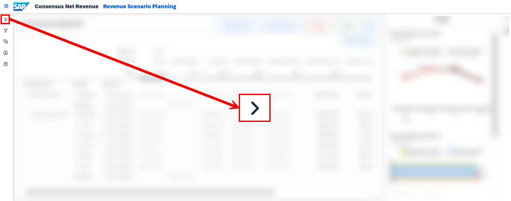
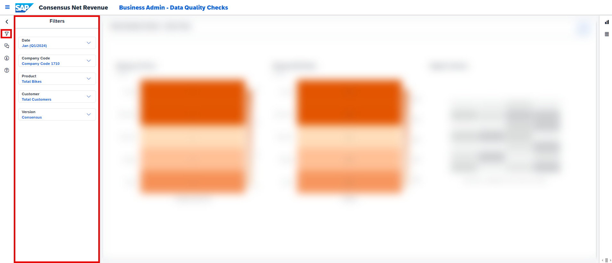

## Prerequisites
- You have an SAP Analytics Cloud tenant. If this is not the case, get started by requesting a free [SAP Analytics Cloud trial](https://www.sap.com/products/technology-platform/cloud-analytics/trial.html) tenant.
- You have installed the **SAP Consensus Net Revenue Planning** content in an SAP Analytics Cloud tenant. Reference: [Business Content Installation Guide](https://help.sap.com/docs/SAP_ANALYTICS_CLOUD/00f68c2e08b941f081002fd3691d86a7/078868f57f3346a98c3233207bd211c7.html), [Content Package User Guide](https://help.sap.com/docs/SAP_ANALYTICS_CLOUD/42093f14b43c485fbe3adbbe81eff6c8/778ddfa3a6b74c1793804d07fc64de17.html)
- You have installed the **SAP Commercial Planning (CX)** content in an SAP Analytics Cloud tenant. Reference: [Content Package User Guide](https://help.sap.com/docs/SAP_ANALYTICS_CLOUD/42093f14b43c485fbe3adbbe81eff6c8/b0046d8673b5412cbef7f521cfdfed95.html).
- You have installed the **Integrated Financial Planning for SAP S/4HANA (xP&A - Integrated Financial Planning for SAP S/4HANA and S/4HANA Cloud)** content (Reference: [Content Package User Guide](https://help.sap.com/docs/SAP_S4HANA_ON-PREMISE/48f4b4785b8e45938ac44a67be8032d9/7ce894bc95f449779fa19d076e67c925.html)) and the **Rapid Financial Planning & Analysis for SAP S/4HANA (Best Practices)** content (Reference: [Content Package User Guide](https://help.sap.com/docs/SAP_ANALYTICS_CLOUD/42093f14b43c485fbe3adbbe81eff6c8/28c3faa21e4743479e76c1d2569d8a58.html)) in an SAP Analytics Cloud tenant. NOTE: While you can choose which Financial Planning package fits your needs best, you will need both installed in order to pass dependency checks when installing this SAP Consensus Net Revenue Planning package. 

## You will learn
- all basics of the Consensus Net Revenue Planning content package for SAP Analytics Cloud 
- how to integrate data into your data model, prepare your versions and how to export your results using the **Consensus Net Revenue Planning Admin Page** story 
- how to plan different consensus scenarios, compare them with each other and how to submit your final consensus using the **Consensus Net Revenue Scenario Planning** story
- how to track your performance using the **Consensus Net Revenue and Margin Analysis** story

## Intro
In this tutorial you will learn all basics about the **Consensus Net Revenue Planning** content package. 

This business content package can be regarded as a complementary application to the [Commercial Planning (CX)](https://help.sap.com/docs/SAP_ANALYTICS_CLOUD/42093f14b43c485fbe3adbbe81eff6c8/b0046d8673b5412cbef7f521cfdfed95.html) business content.

A detailed documentation about the **Consensus Net Revenue Planning** can be found in our [Content Package User Guide](https://help.sap.com/docs/SAP_ANALYTICS_CLOUD/42093f14b43c485fbe3adbbe81eff6c8/778ddfa3a6b74c1793804d07fc64de17.html).

In case you have any questions or require further support, please use the [SAP Question Form](https://community.sap.com/t5/forums/postpage/choose-node/true/product-id/bcbf0782-ce74-43b8-b695-dafd7c1ff1c1/board-id/technology-questions).

If you have a specific request to our team in regards to the business content, you may also submit a request using the [SAP Influence Platform](https://influence.sap.com/sap/ino/#/idea-create?campaign=884&title=Extended%20Planning%20and%20Analysis%3A%20content&tags=Extended%20Planning%20and%20Analysis&RespList=cust.ino.config.SAP_ANALYTICS_CLOUD_SAP_DIGITAL_BOARDROOM.BIZ_CONTENT).

If you are interested in more xP&A topics, related business content packages, or videos showing the content in action, feel free to check out our community page [Extended Planning & Analysis Business Content](https://community.sap.com/topics/cloud-analytics/planning/content).

### Access SAP Analytics Cloud Contents
In this step you will learn how to navigate to the folder which contains all SAP Analytic Cloud content packages.

1. Login to your SAP Analytics Cloud tenant using **Google Chrome**.

    >INFORMATION:
    >
    In order to get the best experience, it is recommended to use **Google Chrome** as it offers the best compatibility with SAP Analytics Cloud (SAC).
    >
    Other browsers can be used as well but are not supported by SAP.

2. In the SAP Analytics Cloud Menu, navigate to the **Files** section.

    <!-- border; size:300px-->

3. Access the content package folder.

    - You can access the content package folder by either navigating to the `Public` folder first and looking for a folder named `SAP_CONTENT`, or by using the **search function** in the top-right corner.
    - In case you want to make use of the search function, simply enter the term `SAP_CONTENT` into the search bar.

    <!-- border; size:540px -->

    - The folder `SAP_CONTENT` contains all objects required to run SAC content. Here you can find your installed content from the content network provided by SAP.

    <!-- border; size:540px -->

### Access Consensus Net Revenue Planning Content
Now that you have learned where all the SAP Analytics Cloud content packages are stored, you need to find the **SAP Consensus Net Revenue Planning** content.

1. Look for the **SAP Consensus Net Revenue Planning** content package by using the search bar.

    - In order to do so, please use the keyword `xP&A` or `CNR`
    - In the result list, click on the folder `SAP_X_CNR_Consensus_Net_Revenue` with the description `xP&A – Consensus Net Revenue Planning`

    <!-- border; size:540px -->

2. Run the Consensus Net Revenue Planning content package.

    - The folder `SAP_X_CNR_Consensus_Net_Revenue` contains all stories and objects which are related to the content package. 
    - To run the **Consensus Net Revenue Planning** content, please navigate to the folder `Stories` and click on the story called **Consensus Net Revenue Planning Overview Page** (`SAP_X_CNR_OverviewPage`).

    >INFORMATION:
    >
    - The story **Consensus Net Revenue Planning Overview Page** (`SAP_X_CNR_OverviewPage`) serves as a starting point and allows you to access all other stories during run time.
    - In other words, you do not need to access the remaining stories by manually launching them from the **Files** section. Instead, you can conveniently open them from inside the **Consensus Net Revenue Planning Overview Page** (`SAP_X_CNR_OverviewPage`) story.

    <!-- border; size:540px -->

### Consensus Net Revenue Planning Overview
Before jumping into the individual stories of the **Consensus Net Revenue Planning** content package, it is necessary to understand what the stories are for and which use cases they cover.

1. **Consensus Net Revenue Overview Page**

    <!-- border; size:540px -->

    - By having opened the story **Consensus Net Revenue Planning Overview Page** (`SAP_X_CNR_OverviewPage`), you entered the **Home Screen** of the **Consensus Net Revenue Planning** content package.
    - This overview story serves as the central entry point for all personas and helps you to navigate through the content package.
    - In the lower half of the story, you can see three sections which cluster the different components of the application.
    - Those sections contain hyperlinks which redirect the responsible persona (e.g. the technical administrator or the revenue planner) to the respective story.
    
    >INFORMATION:
    >
    - Please note that this content packages comes with two different variants of the **Consensus Net Revenue Planning Overview Page** (`SAP_X_CNR_OverviewPage`) story.
    - This is because depending on the business content package you selected for your financial integration, the initialization script of this story differs. 
    - Please check out the [official documentation](https://help.sap.com/docs/SAP_ANALYTICS_CLOUD/42093f14b43c485fbe3adbbe81eff6c8/74b0442a90f04a439cabd91d2e63bd8f.html?locale=en-us) in order to learn how to set up the story correctly. Alternatively, you can learn more about the setup in the course of this tutorial. 

2. **Configure**

    <!-- border; size:540px -->

    - The section **Configure** contains two links, both leading to the story **Consensus Net Revenue Planning Admin Page** (`SAP_X_CNR_AdminPage` or `SAP_X_CNR_AdminPage(IFP)`, depending on which business content you selected for the financial integration) while each of the links opens a different page of the two-page story.
    - The **Consensus Net Revenue Planning Admin Page** story marks the start of the planning process and allows you to perform any administrative task required for the Consensus Net Revenue Planning activities. 
    - Among other available actions this also includes importing quantities from **SAP Integrated Business Planning for Demand Planning (IBP)**, integrating marketing and sales plans from the data models of the **SAP Commercial Planning (CX)** content package, initializing the various forecast versions required for the planning process and exporting data from the resulting consensus version to the initial source systems and data models. 
    - In addition to that you may also trigger individual Data Actions and Multi Actions manually from this screen, which by design are usually executed automatically during the Consensus Net Revenue Planning process.
    - Furthermore this story also offers a second page which focuses on identifying data quality issues, such as missing list prices, missing cost rates or negative volumes. 
    - This story is mainly designed for the planning administrator.

    >INFORMATION:
    >
    In order to learn more about the **SAP Commercial Planning (CX)** content package, please check out the respective [Content Package User Guide](https://help.sap.com/docs/SAP_ANALYTICS_CLOUD/42093f14b43c485fbe3adbbe81eff6c8/778ddfa3a6b74c1793804d07fc64de17.html)

3. **Plan**

    <!-- border; size:540px -->

    - The section **Plan** provides access to the story **Consensus Net Revenue Scenario Planning** (`SAP_X_CNR_RevenueScenarioPlanning`).
    - This story is targeting the persona leading the Consensus Planning discussions and allows you to perform planning activities on the different consensus scenarios.
    - By default, you are provided with three forecast versions representing different scenarios on which you can adjust the gross revenue as part of the planning activities. 

4. **Report**

    <!-- border; size:540px -->

    - The section **Report** provides access to the story **Consensus Net Revenue and Margin Analysis** (`SAP_X_CNR_RevenueMarginAnalysis`).
    - This story provides insights into different financial metrics such as revenues, expenses and margins by company code, product, plant and customer across all functional and consensus versions in order to help the planner derive actions for the business. 

### Navigation Concept within the Content
As a last preparation step, it is required to understand the navigation concept of the content package in order for you to use it properly. In this step, you will learn about the meaning and the functionality of all the buttons as well as other UI elements.

1. **Main Navigation** button

    - Each story apart from the Overview Page (`SAP_X_CNR_OverviewPage`) has a **Main Navigation** button located in the top-left corner.

    <!-- border; size:540px -->

    - By clicking on the **Main Navigation** button, a panel on the left-hand side of the story is opened.

    <!-- border; size:540px -->

    - From here you can quickly navigate to other stories of the Consensus Net Revenue Planning content package.

2. **Expand / Collapse Section** button

    - These buttons can be found in all stories apart from the Overview Page (`SAP_X_CNR_OverviewPage`) and are located at the top-right corner of each available section.
    - The **Expand Section** button (with the arrows pointing to the outside) enlarges a specific section and hides the remaining sections, which is quite useful in case you require more space for the planning tables or reports.

    <!-- border; size:540px -->

    - The **Expand Section** button changes to a **Collapse Section** button (with the arrows pointing to the center) after entering full screen mode. By pressing the **Collapse Section** button, you can unhide the remaining sections again and return to the default view mode.

    <!-- border; size:540px -->

3. **Confirm** button

    - The **Confirm** button can be found in the planning story **Consensus Net Revenue Scenario Planning** (`SAP_X_CNR_RevenueScenarioPlanning`) and is located at the top-right corner above the tables.
    - The **Confirm** button lets you publish your changes into the public version.

    <!-- border; size:540px -->

    - Prior to publishing the version you will receive the following pop-up:

    <!-- border; size:200px -->

    - If there is nothing to confirm, an application warning will appear instead of the pop-up telling you that there is nothing to publish.

4. **Reset** button
    
    - The **Reset** button can be found in the planning story **Consensus Net Revenue Scenario Planning** (`SAP_X_CNR_RevenueScenarioPlanning`) and is located at the top-right corner above the tables.
    - The **Reset** button lets you revert all unpublished changes of a specific version.
  
    <!-- border; size:540px -->

    - Prior to reverting the plan version you will receive the following pop-up:

    <!-- border; size:200px -->

    - If there is nothing to reset, an application warning will appear instead of the pop-up telling you that there is nothing to revert.

5. **Table Settings** button

    - All stories apart from the Overview Page (`SAP_X_CNR_OverviewPage`) have a **Table Settings** button which can be found on the top-right corner above the table. 

    <!-- border; size:540px -->

    - By pressing on this button, a pop-up is opened where you can select different measures, dimensions and versions to be displayed in your table. 

    <!-- border; size:200px -->

    >INFORMATION:
    >
    - Please note that the selection in the pop-up might differ depending on the story you are working on.

6. **Filter** section

    - This section can be found in all stories apart from the Overview Page (`SAP_X_CNR_OverviewPage`) of this content package and can be accessed via the left-side panel. It is indicated by the filter icon.

    <!-- border; size:540px -->

    - By using the input control and drop down widgets, you can filter all tables and charts down to specific members of the given dimensions or measures for an eased data entry and reporting.
    - By clicking on the little **arrow icon**, you can collapse the side panel in order to create more space for your planning tables or charts. 

    <!-- border; size:540px -->

    - You can then reopen the side panel by clicking on the **reversed arrow icon**.

    <!-- border; size:540px -->

    >INFORMATION:
    >
    - Please note that expanding and collapsing the left-side panel is a feature which is not exclusive to the filter section, but works for all of the functions of the panel. 
  
7. **Instructions** section

    <!-- border; size:540px -->

    - This section can be found in all stories apart from the Overview Page (`SAP_X_CNR_OverviewPage`) of this content package and can be accessed via the left-side panel. It is indicated by the information icon.
    - The instructions section serves as a rough guideline and describes the intended user workflow within each of the planning and reporting stories.

8.  **Comment** section

    <!-- border; size:540px -->

    - This section can be found in all stories apart from the Overview Page (`SAP_X_CNR_OverviewPage`) of this content package and can be accessed via the left-side panel. It is indicated by the comment icon.
    - By clicking on the comment icon, the comment panel is opened where you can leave comments for yourself or the other planners. 

9.  **Help** section

    <!-- border; size:540px -->

    - This section can be found in all stories apart from the Overview Page (`SAP_X_CNR_OverviewPage`) of this content package and can be accessed via the left-side panel. It is indicated by the question mark icon.
    - By clicking on the question mark icon, the help section is opened where you can find useful links related to the content package, such as links to the documentation or links which let you get in contact with the developers of this application. 

10.  **Hide Section / Unhide Section** button
    
    <!-- border; size:540px -->

    - In case a story contains multiple sections, you can choose to hide specific parts of the story by using the **Hide Section** button or respectively unhide the section by using the **Unhide Section** button. 
    - Both of these buttons can be found on the top left corner of each section.
  
11. **Update Figures** button

    <!-- border; size:540px -->

    - This button can be found in the **Consensus Net Revenue Scenario Planning** (`SAP_X_CNR_RevenueScenarioPlanning`) story.
    - By pressing on this button, a pop-up window is opened which lets you update a consensus scenario for a specific company code.

    <!-- border; size:200px -->

12. **Submit Scenario** button

    <!-- border; size:540px -->

    - This button can be found in the **Consensus Net Revenue Scenario Planning** (`SAP_X_CNR_RevenueScenarioPlanning`) story.
    - By pressing on this button, a pop-up window is opened which lets you submit a consensus scenario as final consensus for a specific company code.

    <!-- border; size:200px -->

13. **Charts** and **Tables** buttons

    - The chart button can be found inside the right-side panel of each story apart from the Overview Page (`SAP_X_CNR_OverviewPage`) of this content package.
    
    <!-- border; size:540px -->

    - Depending on the story you are looking at, this button executes a different function.
    - In the planning story **Consensus Net Revenue Scenario Planning** (`SAP_X_CNR_RevenueScenarioPlanning`), this button opens an additional section which contains charts providing additional insights. 
    - Similar to the left-side panel, you can also hide and unhide this section by clicking on the **arrow icon**.

    <!-- border; size:540px -->

    - In the reporting story **Consensus Net Revenue and Margin Analysis** (`SAP_X_CNR_RevenueMarginAnalysis`), this button is used to display all information in a graphical view instead of opening an additional section, which is also the default view mode on start-up of the story. 

    <!-- border; size:540px -->

    - In addition to the chart icon, the reporting story **Consensus Net Revenue and Margin Analysis** (`SAP_X_CNR_RevenueMarginAnalysis`) also contains a tables icon. 
  
    <!-- border; size:540px -->

    - By pressing on the tables icon, all information is displayed in a tabular view. 

    <!-- border; size:540px -->

    - To switch back to the graphical view, simply click on the chart icon inside the right-side panel again.

### Preconfiguration 
As mentioned in the prerequisites, it is required to have the **Integrated Financial Planning for SAP S/4HANA (xP&A - Integrated Financial Planning for SAP S/4HANA and S/4HANA Cloud)** business content package (Reference: [Content Package User Guide](https://help.sap.com/docs/SAP_S4HANA_ON-PREMISE/48f4b4785b8e45938ac44a67be8032d9/7ce894bc95f449779fa19d076e67c925.html)) or the **Rapid Financial Planning & Analysis for SAP S/4HANA (Best Practices)** business content package (Reference: [Content Package User Guide](https://help.sap.com/docs/SAP_ANALYTICS_CLOUD/42093f14b43c485fbe3adbbe81eff6c8/28c3faa21e4743479e76c1d2569d8a58.html)) installed in order to be able to perform an integration of financial data. 

Depending on which content package you have chosen, different calculation logics have to be applied and different scripts need to be run during the planning process. 

In this step you will learn how to pre-configure your entire application depending on the content package you have chosen for the financial integration. By default, the application is configured to initialize all stories based on the **Rapid Financial Planning & Analysis for SAP S/4HANA (Best Practices)** content package. In case you want to use the **Integrated Financial Planning for SAP S/4HANA (xP&A - Integrated Financial Planning for SAP S/4HANA and S/4HANA Cloud)**  content package for the financial integration instead, please proceed with the following steps.

1. Go to the **Stories** folder where all stories of the **Consensus Net Revenue Planning** content package are located. 

    <!-- border; size:540px -->

2. Open the **Consensus Net Revenue Planning Overview Page** (`SAP_X_CNR_OverviewPage`) story in **edit mode** and enter the `onInitialization` script.

    <!-- border; size:540px -->

3. Edit the `onInitialization` script by removing the comment indicator (`//`) in line 23 and putting into a comment line 22.
   
    - You can see that in line 22, the variable `cfg_FinanceVersion` is initialized while line 23 is commented and thus not executed on startup of the story. 

    <!-- border; size:540px -->

    - In order to reconfigure the story to be based on the **Integrated Financial Planning for SAP S/4HANA (xP&A - Integrated Financial Planning for SAP S/4HANA and S/4HANA Cloud)**, put into comment line 22 and uncomment line 23. 

    <!-- border; size:540px -->

    >INFORMATION:
    >
    - The **Consensus Net Revenue Planning** business content packages comes with two different versions of the **Consensus Net Revenue Admin Page**, which are the `SAP_X_CNR_AdminPage` and `SAP_X_CNR_AdminPage(IFP)` stories.
    - Having two different stories is required because depending on which content package you have chosen for the financial integration, different data integration jobs as well as calculation logics take place during the planning cycle. 
    - By adjusting the `onInitialization` script of the Overview Page, you ensure that you are redirected to the correct Admin Page when you click on one of the hyperlinks. 

4. Save your story. 

5. Go back to the **Stories** folder where all stories of the **Consensus Net Revenue Planning** content package are located. 

    <!-- border; size:540px -->

6. Open the **Consensus Net Revenue Scenario Planning** (`SAP_X_CNR_RevenueScenarioPlanning`) story in **edit mode** and enter the `onInitialization` script.

    <!-- border; size:540px -->

7. Edit the `onInitialization` script by removing the comment indicator (`//`) in line 50 and putting into a comment line 49.

    - You can see that in line 49, the variable `cfg_FinanceVersion` is initialized while line 50 is commented and thus not executed on startup of the story. 

    <!-- border; size:540px -->

    - In order to reconfigure the story to be based on the **Integrated Financial Planning for SAP S/4HANA (xP&A - Integrated Financial Planning for SAP S/4HANA and S/4HANA Cloud)**, put into comment line 49 and uncomment line 50. 

    <!-- border; size:540px -->

    >INFORMATION:
    >
    - As already mentioned, different calculation logics take place during the planning cycle depending on which content package you have chosen for the financial integration.
    - By adjusting this script you ensure that the correct Data Actions and Multi Actions are executed during your planning activities. 

8. Save your story. 

### Consensus Net Revenue Planning Admin Page
Now that you have preconfigured your application and are familiar with the basics and the navigation concept, you will learn in more detail how to use the different stories.

This step focuses on the story **Consensus Net Revenue Planning Admin Page** (`SAP_X_CNR_AdminPage` or respectively `SAP_X_CNR_AdminPage(IFP)`).

You will learn how to open the story (Tab 1), how to integrate all relevant data from other data models and systems (Tab 2), how to initialize your versions (Tab 3), what other actions you can trigger from the admin page (Tab 4) and lastly how to enter the data quality reporting section (Tab 5).

[OPTION BEGIN [Open Story]]
Currently, you have opened the tab **Open Story**. This tab provides guidance on how to open the **Consensus Net Revenue Planning Admin Page** (`SAP_X_CNR_AdminPage` or respectively `SAP_X_CNR_AdminPage(IFP)`) story.

1. In the **Consensus Net Revenue Planning Overview Page** (`SAP_X_CNR_OverviewPage`) story, click on the **Business Admin Tasks** link.

    <!-- border; size:540px -->

    >INFORMATION:
    >
    - The **Consensus Net Revenue Planning Admin Page** (`SAP_X_CNR_AdminPage` or respectively `SAP_X_CNR_AdminPage(IFP)`) story serves as a central place for any administrative task related to the Consensus Net Revenue Planning process. 
    - It offers a collection of Data Actions and Multi Actions which are used throughout the entire process.
    - From this screen you can import data from different data sources into your data model, initialize your versions, perform submissions for the various consensus versions and execute other individual actions which are usually performed automatically from within the planning story, such as recalculating sales deductions, marketing expenses or the entire profit and loss statement. 

2. Get an overview of the story

    <!-- border; size:540px -->

    - Make yourself familiar with the story.
    - Try to identity the different administrative sections and use cases. Do not execute anything yet, we will go through this step by step. 

3. Check out the **Help** section

    <!-- border; size:540px -->

    - As mentioned in the previous chapter, all stories provide a short in-built step by step guide which helps you to use the corresponding story correctly.
    - Before using the story, make sure to check the instructions to understand the intended user workflow.

You may now switch to the second tab **Load Data**.

[OPTION END]

[OPTION BEGIN [Load Data]]
Currently, you have opened the tab **Load Data**. This tab provides guidance on how to integrate all relevant data from different data sources, such as financial actuals, planned volumes or sales and marketing plans. All relevant actions related to this step can be found in the **Load Data** section of the **Consensus Net Revenue Planning Admin Page**.

 <!-- border; size:540px -->

>INFORMATION:
>
- This content package is dependant on five different data sources.
- For the Actuals, the so called `ACDOCA Table` from **SAP S/4HANA** is used as an external data source.
- For the planned quantities, **SAP Integrated Business Planning for Demand Planning (IBP)** as an external source system is used as a data source.
- For the details about the Marketing and the Sales Plans, the data models `SAP_MKT_IM_MarketingPlanning` and `SAP_SD_IM_SalesPlanning` from the [SAP Commercial Planning (CX)](https://help.sap.com/docs/SAP_ANALYTICS_CLOUD/42093f14b43c485fbe3adbbe81eff6c8/b0046d8673b5412cbef7f521cfdfed95.html) business content in SAP Analytics Cloud are used as a data source. 
- For the Finance plans and targets, the financial planning models from either the [Rapid Financial Planning & Analysis for SAP S/4HANA (Best Practices)](https://help.sap.com/docs/SAP_ANALYTICS_CLOUD/42093f14b43c485fbe3adbbe81eff6c8/28c3faa21e4743479e76c1d2569d8a58.html) or the [Integrated Financial Planning for SAP S/4HANA (xP&A - Integrated Financial Planning for SAP S/4HANA and S/4HANA Cloud)](https://help.sap.com/docs/SAP_S4HANA_ON-PREMISE/48f4b4785b8e45938ac44a67be8032d9/7ce894bc95f449779fa19d076e67c925.html) business content packages in SAP Analytics Cloud can be leveraged. Please make sure that you have completed **Step 5** of this tutorial or check out the [official documentation](https://help.sap.com/docs/SAP_ANALYTICS_CLOUD/42093f14b43c485fbe3adbbe81eff6c8/74b0442a90f04a439cabd91d2e63bd8f.html) in order to configure the application in regards to the financial integration correctly. 

1. Click on the **Load Plan Version Data** trigger to integrate the marketing, sales and finance forecast data into the data model.

    <!-- border; size:540px -->

    - By clicking on the trigger, a Multi Action is executed which populates the versions `Finance Forecast`, `Sales Forecast` and `Marketing Forecast` based on the `Plan` version of the business content packages **SAP Commercial Planning (CX)** and **Rapid Financial Planning & Analysis for SAP S/4HANA (Best Practices)** or respectively **Integrated Financial Planning for SAP S/4HANA (xP&A - Integrated Financial Planning for SAP S/4HANA and S/4HANA Cloud)**.
    - As per definition of the process flow, the consensus net revenue planning process ideally starts when the commercial planning process covered by the **SAP Commercial Planning (CX)** business content has ended.
    - At the end of the commercial planning process, you end up with one marketing focussed plan version and one sales focussed plan version. Additionally, the profit and loss statement resulting from the commercial planning process is integrated into the financial model part of the **Rapid Financial Planning & Analysis for SAP S/4HANA (Best Practices)** or **Integrated Financial Planning for SAP S/4HANA (xP&A - Integrated Financial Planning for SAP S/4HANA and S/4HANA Cloud)** business content. These integrated results can then be leveraged as reference for the financial planning process.
    - After the commercial planning and financial planning activities have been concluded, you end up having three plan versions. A marketing and a sales plan version resulting from the commercial planning process and a finance plan version resulting from the financial planning process. 
    - These results are now integrated into the three forecast versions of the **Consensus Net Revenue Planning** content package. 

    >INFORMATION:
    >
    - Please note that you may skip this step in case you want to go with the provided demo data first. This step will only become necessary once you decide to use your own data models as data source. 
    - For the population of the `Marketing Forecast` version, the `Plan` version of the `SAP_MKT_IM_MarketinPlanning` data model part of the **SAP Commercial Planning (CX)** business content is used.
    - For the population of the `Sales Forecast` version, the `Plan` version of the `SAP_SD_IM_SalesPlanning` data model part of the **SAP Commercial Planning (CX)** business content is used.
    - For the population of the `Finance Forecast` version, the `Plan` version of the `SAP_FI_FPA_IM_S4SalesPlan` data model part of the **Rapid Financial Planning & Analysis for SAP S/4HANA (Best Practices)** business content or respectively the `Plan` version of the `SAP_FI_IFP_IM_Profitability` data model part of the **Integrated Financial Planning for SAP S/4HANA (xP&A - Integrated Financial Planning for SAP S/4HANA and S/4HANA Cloud)** business content is used. 

2. Click on the **Load Supply Chain** trigger to integrate forecasted quantities into the data model.

    <!-- border; size:540px -->

    - By clicking on the trigger, a Multi Action is executed which populates the version `Supply Chain Forecast` with quantities from the system **SAP Integrated Business Planning for Demand Planning (IBP)**
    - As mentioned in the previous step, the consensus net revenue planning process ideally starts when the commercial planning process covered by the **SAP Commercial Planning (CX)** business content has ended. 
    - The planned quantities and commercial drivers resulting from the commercial planning process can be reintegrated into the **SAP Integrated Business Planning for Demand Planning (IBP)** system. These metrics can then be leveraged in the **SAP Integrated Business Planning for Demand Planning (IBP)** system by the Demand Planner to create a new forecast. 
    - In this step, these forecasted quantities are integrated into the `Supply Chain Forecast` version of the **Consensus Net Revenue Planning** content package.

    >INFORMATION:
    >
    - In order for this step to work, you must set up the Multi Action and integration job first. 
    - Please note that you may skip this step in case you want to go with the provided demo data first. This step will only become necessary once you decide to use your own systems as data source. 

3. Click on the **Load Target Version Data** trigger to integrate the financial target into the data model

    <!-- border; size:540px -->

    - By clicking on the trigger, a Data Action is executed which populates the `Financial Target` version based on the data stored on the `Target` version of the financial model of the business content package **Rapid Financial Planning & Analysis for SAP S/4HANA (Best Practices)** or respectively **Integrated Financial Planning for SAP S/4HANA (xP&A - Integrated Financial Planning for SAP S/4HANA and S/4HANA Cloud)**.
    - In this context, the financial target serves as a top-down reference or guideline for the entire planning process.

    >INFORMATION:
    >
    - Please note that you may skip this step in case you want to go with the provided demo data first. This step will only become necessary once you decide to use your own systems as data source. 
    - For the population of the `Financial Target` version, the `Target` version of the `SAP_FI_FPA_IM_S4SalesPlan` data model part of the **Rapid Financial Planning & Analysis for SAP S/4HANA (Best Practices)** business content or respectively the `Target` version of the `SAP_FI_IFP_IM_Profitability` data model part of the **Integrated Financial Planning for SAP S/4HANA (xP&A - Integrated Financial Planning for SAP S/4HANA and S/4HANA Cloud)** business content is used.
  
Now that you have loaded in all data successfully, you can proceed with the initialization of your versions as a last preparation step. You can now switch to the tab **Initialize Versions**.

[OPTION END]

[OPTION BEGIN [Initialize Versions]]
Currently you have opened the tab **Initialize Versions**. This tab provides guidance on how to prepare your versions so you can finally start with your planning activities. 

1. Click on the **Actualize Forecast Version** trigger to copy the Actuals from the last three closed periods into the different forecast versions `Finance Forecast`, `Sales Forecast`, `Marketing Forecast` and `Supply Chain Forecast`. 

    <!-- border; size:540px -->

    - In the tab **Load Data** of this step, you learned how to integrate plan data resulting from the commercial planning and the financial planning process covered by the different business content packages into the forecast versions of the **Consensus Net Revenue Planning** business content. In addition, you learned how to integrate forecasted quantities from the **SAP Integrated Business Planning for Demand Planning (IBP)** system. 
    - With other words, all of the forecast versions contain only plan data at this point of time.
    - As forecast versions usually represent hybrid scenarios which are regularly updated based on actual figures during the planning cycle, the four forecast versions of the **Consensus Net Revenue Planning** business content must be enriched or updated with the actuals from the closed periods. 
    
    >INFORMATION:
    >
    - Please note that you may skip this step in case you want to go with the provided demo data first. This step will only become necessary once you decide to use your own systems as data source. 

2. Click on the **Populate Supply Chain Forecast** trigger to copy price and marketing expense related data from the `Marketing Forecast` version, COGS-Rates from the `Finance Forecast` version and sales deductions from the `Sales Forecast` version into the `Supply Chain Forecast`version.

    <!-- border; size:540px -->

    - As you have learned previously, the `Supply Chain Forecast` version is only populated with quantities coming from the **SAP Integrated Business Planning for Demand Planning (IBP)** system during the **Load Data** phase and is consequently lacking financial data. 
    - In order to enrich the `Supply Chain Forecast` version with cost and price related information, data from the other forecast versions is copied over. 

3. Click on the **Supply Chain P&L Calculation** trigger to derive the respective total revenue and COGS for the `Supply Chain Forecast` version

    <!-- border; size:540px -->

    - This Data Action calculates the total revenue and COGS for the `Supply Chain Forecast` version by taking the previously integrated forecasted quantities from **SAP Integrated Business Planning for Demand Planning (IBP)** and multiplying them by the prices and cost rates which were integrated from the other forecast versions. 
    - By executing this step, the profit and loss statement of this version is refreshed. 

4. Click on the **Send volumes to Marketing** trigger to integrate the newly imported quantities of the `Supply Chain Forecast` version into the `Technical Integration` version of the marketing model of the **Commercial Planning (CX)** business content and reallocate the marketing expenses based on the new product quantities forecast. 

    <!-- border; size:540px -->

    - As mentioned earlier, the commercial planning process ideally happens prior to the consensus net revenue planning process. At the end of the commercial planning process, estimated quantities and commercial drivers can be sent back to the **SAP Integrated Business Planning for Demand Planning (IBP)** system, where these figures are used to create an updated demand forecast.
    - During the **Load Data** phase of this content package, these updated forecast quantities are imported into the `Supply Chain Forecast` version.
    - Consequently, the quantities stored in the `Supply Chain Forecast` version of the **Consensus Net Revenue** business content might differ significantly from the quantities stored in the versions of the **Commercial Planning (CX)** business content. 
    - In order to ensure consistency across all systems and data models during the planning cycle, these updated quantities must now be reintegrated into the data models of the **Commercial Planning (CX)** business content. In this step, the quantities are integrated into the marketing model of the **Commercial Planning (CX)** business content.
    - At the same time, a reallocation of marketing expenses based on the new quantities takes place in the marketing model of the **Commercial Planning (CX)** business content.
  
    >INFORMATION:
    >
    - In order to not manipulate the `Plan` version of the marketing model part of the **Commercial Planning (CX)** business content package created by the marketing planners, the new quantities are integrated into the `Technical Integration` version.
    - The `Technical Integration` version is a separate version inside the marketing model of the **Commercial Planning (CX)** business content package which stores the final results of the marketing planning process. 

5. Click on the **Inbound Marketing Expenses** trigger to import the updated marketing expenses from the marketing model of the **Commercial Planning (CX)** business content into the `Supply Chain Forecast` version of the **Consensus Net Revenue Planning** business content package.

    <!-- border; size:540px -->

    - In the previous step, the updated quantities were sent to the marketing model of the **Commercial Planning (CX)** business content and a reallocation of the marketing expenses based on the new quantities took place.
    - These updated expenses from marketing must now be integrated into the `Supply Chain Forecast` version of the **Consensus Net Revenue Planning** business content package.

    >INFORMATION:
    >
    - As the new quantities and expenses were integrated into the `Financial Target` version of the **Commercial Planning (CX)** business content, this version is used to source the recalculated marketing expenses. 

6. Click on the **Send volumes to Sales** trigger to integrate the newly imported quantities of the `Supply Chain Forecast` version into the `Technical Integration` version of the sales model of the **Commercial Planning (CX)** business content and recalculate the sales deductions based on the new quantities. 

    <!-- border; size:540px -->

    - Similar to the reasoning provided in the step ***Send volumes to Marketing***, the updated quantities stored in the `Supply Chain Forecast` version must also be sent back to the sales model of the **Commercial Planning (CX)** business content to ensure consistency across all systems and data models during the planning cycle.
    - Simultaneously, a recalculation of sales deductions based on the new quantities takes place in the sales model of the **Commercial Planning (CX)** business content.

    >INFORMATION:
    >
    - In order to not manipulate the `Plan` version of the sales model part of the **Commercial Planning (CX)** business content package created by the sales planners, the new quantities are integrated into the `Technical Integration` version.
    - The `Technical Integration` version is a separate version inside the sales model of the **Commercial Planning (CX)** business content package which stores the final results of the sales planning process. 

7. Click on the **Inbound Sales Deductions** trigger to import the updated sales deductions from the sales model of the **Commercial Planning (CX)** business content into the `Supply Chain Forecast` version of the **Consensus Net Revenue Planning** business content package.

    <!-- border; size:540px -->

    - In the previous step, the updated quantities were sent to the sales model of the **Commercial Planning (CX)** business content and a recalculation of the sales deductions based on the new quantities took place.
    - These updated sales deductions must now be integrated into the `Supply Chain Forecast` version of the **Consensus Net Revenue Planning** business content package.

    >INFORMATION:
    >
    - As the new quantities were integrated into the `Financial Target` version of the **Commercial Planning (CX)** business content, this version is used to source the recalculated sales deductions. 

8. Click on the **Populate Consensus Scenarios** trigger to copy the results stored on the `Supply Chain Forecast` version to the three predefined consensus scenario versions, which are the `Optimistic Consensus`, `Neutral Consensus`and `Pessimistic Consensus`.

    <!-- border; size:540px -->

    - Now that the `Supply Chain Forecast` version is finalized, it can be used as a baseline to initialize the three different consensus versions on which the actual planning process will happen in the next step. 

    >INFORMATION:
    >
    - In summary, the `Supply Chain Forecast` version now holds the latest forecasted quantities or volumes from the **SAP Integrated Business Planning for Demand Planning (IBP)** system as well as the list prices and cost rates from the other content packages which were previously mentioned.
    - In addition to that, the `Supply Chain Forecast` version also contains financial data. 
    - On the one-hand side, total revenues and COGS were calculated by taking the integrated list prices and COGS rates and multiplying them by the imported quantities. 
    - On the other hand side, marketing expenses resulting from the marketing planning process as well as sales deductions resulting from the sales planning process were integrated into the `Supply Chain Forecast` version as well.

Now that you have integrated all data and initialized your versions successfully, you can either switch to the tab **Data Quality Report** to learn more about how to identify data quality issues in your data model or you can optionally first go to the tab **Other Actions** in case you would like to learn what the remaining Data Actions and Multi Actions can be used for.

[OPTION END]

[OPTION BEGIN [Other Actions]]
Currently you have opened the tab **Other Actions**. This tab provides a rough overview of all the remaining Data Actions and Multi Actions which can be found on the admin screen. Please note that none of these actions are mandatory for the planning process. 

1. **Clear Model Data**

    <!-- border; size:540px -->

    - This Data Action deletes all transaction data from the target version.
    - This can be quite useful in case you want to reset an entire version.
  
2. **Archive Current Consensus**

    <!-- border; size:540px -->

    - This Multi Action can be used in order to create a back-up of the latest consensus once the consensus net revenue planning cycle has ended. 
    - In specific the Multi Action first copies all data from the final version `Consensus` to the backup version `Previous Consensus` and deletes all data from the versions `Consensus`, `Optimistic Consensus`, `Neutral Consensus` and `Pessimistic Consensus` afterwards. 

3. **Recalculate Scenario P&L**
    
    <!-- border; size:540px -->

    - Once the Gross Revenue has been adjusted during the planning process of the consensus net revenue planning cycle, this Data Action can be used in order to refresh the profit and loss statement as well as the quantities accordingly. 
    - This Data Action is usually called automatically during the consensus net revenue planning process and does not have to be executed from within the admin screen.

4. **Submit Consensus Scenario**

    <!-- border; size:540px -->

    - This Data Action copies over all data from **one** of the consensus scenario versions (`Optimistic Consensus`, `Neutral Consensus` or `Pessimistic Consensus`) to the final consensus version `Consensus`. 
    - This Data Action is usually called automatically during the consensus net revenue planning process and does not have to be executed from within the admin screen.

5. **Send Consensus to Marketing**
   
    <!-- border; size:540px -->

    - Once the consensus net revenue planning process has ended and you came to a final consensus, you can integrate the data into the marketing model of the **Commercial Planning (CX)** business content package.
    - This Data Action copies over all data from the `Consensus` version of the **Consensus Net Revenue Planning** business content package to the `Consensus` version of the marketing model of the **Commercial Planning (CX)** business content package.

6. **Send Consensus to Sales**
   
    <!-- border; size:540px -->

    - Once the consensus net revenue planning process has ended and you came to a final consensus, you can integrate the data into the sales model of the **Commercial Planning (CX)** business content package.
    - This Data Action copies over all data from the `Consensus` version of the **Consensus Net Revenue Planning** business content package to the `Consensus` version of the sales model of the **Commercial Planning (CX)** business content package.

7. **Export Consensus to IBP**
   
    <!-- border; size:540px -->

    - Once the consensus net revenue planning process has ended and you came to a final consensus, you can reintegrate the final quantities into the **SAP Integrated Business Planning for Demand Planning (IBP)** system.
    - This Multi Action copies over all quantities from the `Consensus` version to the `Technical Integration` version and performs several data manipulation tasks in order to prepare the data for the transport to the **SAP Integrated Business Planning for Demand Planning (IBP)** system.
    - Afterwards the final results are copied over to the **SAP Integrated Business Planning for Demand Planning (IBP)** system.

8. **Send Consensus to Marketing Plan**
   
    <!-- border; size:540px -->

    - This Data Action overwrites the `Plan` version of the marketing model part of the **Commercial Planning (CX)** business content package with the values from the `Consensus` version. 

9. **Send Consensus to Sales Plan**
   
    <!-- border; size:540px -->

    - This Data Action overwrites the `Plan` version of the sales model part of the **Commercial Planning (CX)** business content package with the values from the `Consensus` version. 

[OPTION END]

[OPTION BEGIN [Data Quality Report]]
Currently, you have opened the tab **Data Quality Report**. This tab provides guidance on how to enter the data quality report in the **Consensus Net Revenue Planning Admin Page** (`SAP_X_CNR_AdminPage`) story.

1. In the **Consensus Net Revenue Planning Overview Page** (`SAP_X_CNR_OverviewPage`) story, click on the **Data Quality Checks** link.

    <!-- border; size:540px -->

2. Get an overview of the story page

    <!-- border; size:540px -->

    - You will now be redirected to the second page of the **Consensus Net Revenue Planning Admin Page** (`SAP_X_CNR_ADMINPAGE` or respectively `SAP_X_CNR_ADMINPAGE(IFP)`) story.
    - This report provides insights about the data quality of your transaction data. 
    - It helps you to identify data records where list prices and cost rates are missing, but it also scans your dataset for records where negative volumes are recorded. 
    - In the graphical view mode, you can leverage the SAP Analytics Cloud standard functionality to drill up or down across dimensions by clicking on a specific spot on the chart. 

    <!-- border; size:540px -->

    - In addition to that, you can make use of the filter panel in the left-side panel to restrict your analyzed data set. 

    <!-- border; size:540px -->

    >INFORMATION:
    >
    - When no data quality issues can be detected, the charts do not render and consequently show no data.

    - Similar to the **Consensus Net Revenue and Margin Analysis** (`SAP_X_CNR_RevenueMarginAnalysis`) story, you can also switch to a tabular view mode by clicking on the table icon on the right-side panel.
    - This mode lets you identify data records with data quality issues in a tabular fashion.

    <!-- border; size:540px -->

    - By using the **Table Settings** button, you can switch between different measures to be shown in the table.

    <!-- border; size:540px -->

[OPTION END]

### Revenue Scenario Planning
As you have now passed all preparation steps, you can continue with the actual planning activities.

In this step, the **Consensus Net Revenue Scenario Planning** (`SAP_X_CNR_RevenueScenarioPlanning`) story of this content package is introduced.

You will learn how to open the story (Tab 1) and how to enter your planning assumptions (Tab 2).

[OPTION BEGIN [Open Story]]
Currently, you have opened the tab **Open Story**. This tab provides guidance on how to open the **Revenue Scenario Planning** (`SAP_X_CNR_RevenueScenarioPlanning`) story.

1. Click on the burger menu located on the top left corner of the **Consensus Net Revenue Planning Admin Page** (`SAP_X_CNR_AdminPage`) from the previous step.

2. Now click on either **Home Page** to jump back to the **Consensus Net Revenue Planning Overview Page** (`SAP_X_CNR_OVERVIEWPAGE`) or on **Revenue Scenario Planning** to directly access the **Consensus Net Revenue Scenario Planning** (`SAP_X_CNR_RevenueScenarioPlanning`) story.

    <!-- border; size:540px -->
   
    In this particular case, we will go back to the **Consensus Net Revenue Planning Overview Page** (`SAP_X_CNR_OVERVIEWPAGE`) by clicking on the **Home Page** button.

3. Click on the link **Revenue Scenario Planning** to enter the story.

    <!-- border; size:540px -->

4. Get an overview of the application

    <!-- border; size:540px -->

    - Generally the story consists of three sections, which are the planning section in the center of the story, the section addressed by the left-side panel and lastly the section addressed by the right-side panel. 
    - In this story, the right-side panel contains multiple graphs which provide you with additional information relevant for your planning activities. 
    - The upper line chart shows the gross revenue over time for different versions while the lower bar charts depict the gross margin, the gross revenue and the commercial investment rate per version. 
    
    >INFORMATION:
    >
    > The commercial investment rate is a calculated measure which shows the ratio of the marketing expenses and sales deductions in comparison to the gross revenue in percent. 

    - All of the charts take into consideration the filter settings from the filter panel located inside the left-side panel.
    - The filter panel provides different input controls with which you can define your planning context for the entire story.
    - In addition the filter panel also contains a drop down widget in which you can switch between the measures `Amount` and `Amount (GC)`, giving you the opportunity to show all numbers in either local currency or global currency. 
    - Furthermore the left-side panel also contains the comment section, information section and the help section.

    - The last important section is the planning section in the center of the story. 
    - The planning table is the place where you can enter your revenue assumptions for the different consensus versions, which per default are the optimistic, the neutral and the pessimistic consensus.  
    - Additional measures, dimensions and versions can be added to the planning table via the **Table Settings** dialogue if desired. 
  
You may now switch to the second tab **Enter Planning Assumptions** to learn how to enter your planning assumptions.

[OPTION END]

[OPTION BEGIN [Enter Planning Assumptions]]
Currently, you have opened the tab **Enter Planning Assumptions**. This tab provides guidance on how to modify the consensus versions and update all relevant figures, such as the profit and loss statement afterwards.

1. Adjust your filters in the filter panel and set up your table layout.
   
    - According to the **Instructions** section which you can enter via the left-side panel, start your planning activities by adjusting your filters in the filter panel and by configuring your table layout via the **Table Settings** dialogue if required. 
    
    >INFORMATION:
    >
    - For the following demonstration, the company code will be changed to `Company Code 1010` in the filter panel.
    - In addition to that, the measure `Quantity` will be added to the table layout via the **Table Settings** menu.

    <!-- border; size:540px -->

    >INFORMATION:
    >
    - All filters are preset manually and are static as a result.
    - If you want to change your default settings for the filters, please go into **edit mode** of the story and change the selection of the input controls. 

2. Adjust the gross revenues.

    - You can now adjust the consensus revenue based on global or local currency, this is completely up to you.
    - To edit the revenue, simply click on any editable cell and change the value.

    <!-- border; size:540px -->

    - In this example, the neutral consensus version was adjusted from a value of `139.998.928` to `150.000.000`. The optimistic consensus was increased from a total value of `141.374.056` to a value of `300.000.000`, while the pessimistic consensus was decreased from `139.311.366` to `110.000.000`. 

3. Update all figures.

    - Now that you have adjusted the gross revenue, you need to refresh all other relevant measures, such as the quantities in order for the data in the data model to be correct. 
    - Click on the **Update Figures** button to recalculate all quantities and all other financial metrics based on the new revenue.
    - Set up the correct context in the pop-up dialogue and click on the **OK** button. In this specific case, we need to repeat this exercise three times, once per available consensus version, with the company code filter set to `Company Code 1010`.
  
    <!-- border; size:540px -->

4. Submit scenario.

    - Once you have come to a final result, you have to submit your scenario and with that, make the selected scenario your final scenario. 
    - By submitting a scenario, all values from the selected scenario will be transferred to the final version `Consensus`.
    - In order to submit a scenario, click on the **Submit Scenario** button and select the consensus scenario and company code you wish to submit. Click on **OK** to start the process. 

    <!-- border; size:540px -->

    >INFORMATION:
    >
    - In this particular example, we submitted the optimistic consensus and made this version our final consensus.
    - You can check the results by pulling in the `Consensus` version into the table layout by leveraging the **Table Settings** dialogue.
    - As you can see in the screenshot, the `Consensus` version now contains the values of the `Optimistic Consensus` version.

    <!-- border; size:540px -->

5. Publish or revert your version

    - Click on the **Confirm** or **Reset** button in order to publish or revert your plan data.
    
    >INFORMATION:
    >
    - By publishing the version, all users with sufficient rights will be able to see your edits in the version you were working on.
    - As soon as you start editing a public version, a private version is created in the background, which only you can see. All edits you do are done on this private version. Thus your work-in-progress is only visible to you.
    - It is possible to leave the story and resume your work on another day without losing your progress.
    - Only after publishing the version your changes will be written to the public version and will be visible to all other users.
    - Learn more about the concept of planning on public versions in our [SAP Help Portal](https://help.sap.com/docs/SAP_ANALYTICS_CLOUD/00f68c2e08b941f081002fd3691d86a7/b6e3d093988e4c3eba7eb6c1c110e954.html?q=version)

[OPTION END]

### Revenue and Margin Analysis
In this step the **Consensus Net Revenue and Margin Analysis** (`SAP_X_CNR_RevenueMarginAnalysis`) story of this content package is introduced. 

Here you will learn how to open the story (Tab 1) and how to consume the different reports to get an overview about your financial performance (Tab 2).

[OPTION BEGIN [Open Story]]
Currently, you have opened the tab **Open Story**. This tab provides guidance on how to open the **Consensus Net Revenue and Margin Analysis** (`SAP_X_CNR_RevenueMarginAnalysis`) story.

1. If you still have the **Consensus Net Revenue Scenario Planning** (`SAP_X_CNR_REVENUESCENARIOPLANNING`) story opened from the previous step, click on the burger menu located on the top left corner to open the navigation panel.

2. Now click on either **Home Page** to jump back to the **Consensus Net Revenue Planning Overview Page** (`SAP_X_CNR_OVERVIEWPAGE`) or on **Revenue and Margin Analysis** to directly access the **Consensus Net Revenue and Margin Analysis** (`SAP_X_CNR_RevenueMarginAnalysis`) story. 

    <!-- border; size:540px -->
    
    In this particular case, we will go back to the **Consensus Net Revenue Planning Overview Page** (`SAP_X_CNR_OVERVIEWPAGE`) by clicking on the **Home Page** button.

3. Click on the link **Revenue and Margin Analysis** to enter the **Consensus Net Revenue and Margin Analysis** (`SAP_X_CNR_RevenueMarginAnalysis`) story.

    <!-- border; size:540px -->

4. Get an overview of the story

    <!-- border; size:540px -->

    - This story supports the consensus net revenue planning process and provides detailed insights into financial performance metrics from different perspectives.
    - It provides visualizations which for instance show the revenue, spend and margin.
    - The different sections in this report offer an additional analysis of financial metrics by company code, product, customer or plant. 
    - In addition to that, the report can be consumed in a tabular or graphical view. The mode can be switched by using the respective buttons located inside the right-side panel of this story. 

You may now switch to the tab **Reporting** in order to learn more about the navigation concept and the charts of this story.

[OPTION END]

[OPTION BEGIN [Reporting]]
Currently, you have opened the tab **Reporting**. This tab provides information about the navigation concept of the story and the reported data.

1. **Left-Side** panel

    - When you open the story, you can see the left-side panel of this story expanded with the filter panel opened where you can define the context of your reporting story and decide whether you want to consume the report in global or local currency. 

    <!-- border; size:540px -->

    - Similar to the left-side panel of the planning story, you can also enter the comment section, help section and instructions section here.
    - Please make sure to always check the instructions section before using the story. It contains information about the intended user workflow or provides other important information. 

    <!-- border; size:540px -->

2. **Revenue and Margin Analysis - Chart View** section

    - When you initially open the reporting story, you will see the revenue and margin analysis chart view section at the top per default. 
    - This section provides insights into key metrics and allows you to analyze and compare your versions in more detail. 
    
    <!-- border; size:540px -->

    - The **Gross Revenue** graph shows the total gross revenue per version under consideration of the current selection made in the filter panel.
    - The **Net Revenue** graph shows the total net revenue per version under consideration of the current selection made in the filter panel.
    - The **Gross Margin** graph shows the absolute gross margin per version under consideration of the current selection made in the filter panel.
    - The **Gross Revenue Mix Analysis** is a waterfall chart which allows you to compare the gross revenue of a selected version (left bar, labeled as `Comparison GR`) with the gross revenue of the Consensus version (right bar, labeled as `Consensus GR`). By using the input control panel on the top-right corner of the Gross Revenue Mix Analysis chart, you can change your comparison version. The bars between the `Comparison GR` and the `Consensus GR` represent the components which explain a potential deviation between the two compared versions. 
    - The **Net Revenue** graph shows the total net revenue per version over time under consideration of the current selection made in the filter panel.

3. Other sections

    - When you scroll down a little bit, you will find four additional sections which are indicated by the keywords **By company code**, **By product**, **By customer** and **By plant**.

    <!-- border; size:540px -->

    - All of them contain the same graphs, but provide insights from different perspectives. 
    - While the section **By company code** breaks down the different key figures by the company code structure, the other sections perform a breakdown by product, customer or plant respectively. 
    - The **Consensus Net Revenue** graph shows the consensus net revenue by company code, product, customer or plant over time, while the graph is configured to only show the version `Consensus`. Apart from this exception, the chart takes into consideration all filters made in the filter panel. 
    - The **Gross Margin** graph breaks down the Gross Margin by company code, product, customer or plant while taking into consideration the current selections made in the filter panel.
    - The **Commercial Spend** graph breaks down the commercial spend by company code, product, customer or plant while taking into consideration the current selections made in the filter panel. In this particular case, the commercial spend represents a calculated account which sums up marketing expenses and sales deductions. 

4. **Tabular view** mode

    - Click on the table icon in the right-side panel to enter the tabular point of view. 
   
    <!-- border; size:540px -->

    - In the tabular view, you only have one section available to inspect which is the **Revenue and Margin Analysis - Table View**
    - Similar to the graphical view mode, the context of the table is defined by the selections made in the filter panel. 
    - Using the table, you can drill into different G/L Accounts and compare your versions on a more detailed level. 
    - By leveraging the **Table Settings** function on the top-right of the table, you can modify the table layout by adding or removing dimensions.

    <!-- border; size:540px -->

    - You can then switch back to the graphical view mode by clicking on the chart icon in the right-side panel.

[OPTION END]

### Final Remarks
Congratulations! You have finished the introduction tutorial and are now able to use the **Consensus Net Revenue Planning** content like an expert.

Interested in more xP&A topics and related business content packages? Visit our community page [Extended Planning & Analysis Business Content](https://pages.community.sap.com/topics/cloud-analytics/planning/content).