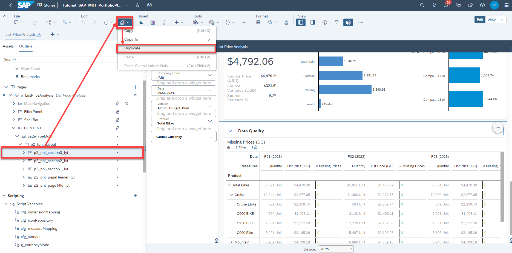

## Prerequisites
- You have an SAP Analytics Cloud tenant. If this is not the case, get started by requesting a free [SAP Analytics Cloud trial](https://www.sap.com/products/technology-platform/cloud-analytics/trial.html) tenant.
- You have installed the **SAP CX Commercial Planning content** in an SAP Analytics Cloud tenant. Reference: [Business Content Installation Guide](https://help.sap.com/docs/SAP_ANALYTICS_CLOUD/00f68c2e08b941f081002fd3691d86a7/078868f57f3346a98c3233207bd211c7.html), [Content Package User Guide](https://help.sap.com/docs/SAP_ANALYTICS_CLOUD/42093f14b43c485fbe3adbbe81eff6c8/b0046d8673b5412cbef7f521cfdfed95.html)
- You have finished both introduction tutorials [xP&A Commercial Planning - Get to know the Portfolio Planning module](xpa-sac-cxpp-portfolioplanning-gettoknow) and [xP&A Commercial Planning - Get to know the Marketing Planning module](xpa-sac-cxmp-marketingplanning-gettoknow)
- You have finished the tutorial [xP&A Commercial Planning - Understanding the technical structure of stories](xpa-sac-cx-technical-structure-stories) and understand the architectural design of each app

## You will learn
- how you can add additional sections to your stories based on the applied theme throughout this content package.  

## Intro
Now that you have successfully gone through the introduction tutorials and understand the technical structure of the stories, you may want to start customizing the stories based on your own business needs. 

Here you will learn how to add additional sections to your stories in accordance with the UI. 

In case you have any questions or require further support, please use the [SAP Question Form](https://community.sap.com/t5/forums/postpage/choose-node/true/product-id/bcbf0782-ce74-43b8-b695-dafd7c1ff1c1/board-id/technology-questions).

If you have a specific request to our team in regards to the business content, you may also submit a request using the [SAP Influence Platform](https://influence.sap.com/sap/ino/#/idea-create?campaign=884&title=Extended%20Planning%20and%20Analysis%3A%20content&tags=Extended%20Planning%20and%20Analysis&RespList=cust.ino.config.SAP_ANALYTICS_CLOUD_SAP_DIGITAL_BOARDROOM.BIZ_CONTENT).

If you are interested in more xP&A topics, related business content packages, or videos showing the content in action, feel free to check out our community page [Extended Planning & Analysis Business Content](https://community.sap.com/topics/cloud-analytics/planning/content).


### Open Story
For demonstration purposes, we will take a look at the **List Price Analysis** (`SAP_MKT_PortfolioPlanning_ListPriceAnalysis`) story.
The basic idea can be applied to any story which is part of the **Commercial Planning** business content package.

Open the story in which you want to add a new section in edit mode. 
- As mentioned, in this example the **List Price Analysis** (`SAP_MKT_PortfolioPlanning_ListPriceAnalysis`) story is opened.
- As you can see the story already has three sections, which are the **Trend Analysis** section, the **Average List Price** section and the **Data Quality** section.
  
<!-- border; size:540px -->

### Modify Layout

1. Open the **Left Side Panel** and switch to the **Outline** tab. 

    <!-- border; size:540px -->

2. Drill down to the **CONTENT** panel of the story page and look for panel groups called `p2_pnl_section1_lyt`, `p2_pnl_section2_lyt` and `p2_pnl_section3_lyt`.
   
    <!-- border; size:540px -->

    - Each of these panels represents one section of the story.
    - The container `p2_pnl_section1_lyt` contains all elements of the **Trend Analysis** section.
    - The container `p2_pnl_section2_lyt` contains all elements of the **Average List Price** section.
    - The container `p2_pnl_section3_lyt` contains all elements of the **Data Quality** section.

    >INFORMATION:
    >
    If the story you are customizing has less panels per default, there will be less containers consequently.
  
3. Click on one of those containers and duplicate it. 

    <!-- border; size:540px -->

    - As we want to add a new section to the story, we need to create another container which has the same structure as the others.
    - Building it from scratch would be way too time consuming - so let us just copy an existing container and modify it afterwards. 
    - In this example, we will simply make a copy of `p2_pnl_section3_lyt`. Of course you can take any other container as baseline as well.

4. Rename the new panel to `p2_pnl_section4_lyt`.
    - According to the naming convention used, rename the new panel from the auto-generated name (which in this instance is `Panel_1`) to `p2_pnl_section4_lyt` by double clicking on the panel name in the **Outline**.
  
    <!-- border; size:540px -->

    - It is generally recommended to also rename the widgets and panels inside this container according to the naming convention too, as all duplicated elements have the default naming now. However, for the purpose of efficiency, the rest of this tutorial assumes that the widgets and panels inside this container are left with their default names.

5. Define the height of the panel.
    - Click on the new parent panel `p2_pnl_section4_lyt` in the **Left Side Panel** and open the **Right Side Panel** afterwards. 
    - Now define a fixed height for the panel.
    - This will be the height of the panel when you open the story. Depending on how many widgets you want to place there, you may want to increase or decrease your pixels.
    - In this case, let us change the height from `550 px` to `700 px`.
  
    <!-- border; size:540px -->

    >INFORMATION:
    >
    - Depending on which container you duplicated, the original pixel height might be different. 
    - The duplicated container inherits the properties of its origin, so depending on which panel you chose as baseline, you might see different values. 
    - As for demonstration purposes the container `p2_pnl_section3_lyt` was duplicated, the original pixel height is set to `550 px`.

6. Adjust the layout scripts of the **Expand Buttons** or respectively **Collapse Buttons** in each available section.
    - Now it gets a little more technical.
    - As you have learned in the introduction tutorials, each section has a button on the top-right corner to either expand a section to full screen or to exit the full screen mode and return to default view. 
    - Each of these buttons calls a tiny script which changes the layout accordingly. As we have a new section now, we need to adjust all scripts of each button to take into consideration the new panel as well. 
    - First, let us start with the button of the first section `p2_pnl_section1_lyt`. Use the search function to look for the button called `p2_btn_section1_button1`. This is the technical name of the expand or respectively collapse button of the first section. 

    <!-- border; size:540px -->

    - Open the `onClick` script by clicking on the `fx` icon of the button in the **Left Side Panel**.
  
    <!-- border; size:540px -->

    - Now extend the script of this button by inserting the following code marked in red:
  
    <!-- border; size:540px -->

    ```
    var toggleVisibilityPanels = ArrayUtils.create(Type.Panel);

    // Get objects for visiblity toggle
    var reportPanel = Application.getWidgets({searchPattern:'p2_pnl_section2_lyt', type:WidgetType.Panel});
    var reportPanel2 = Application.getWidgets({searchPattern:'p2_pnl_section3_lyt', type:WidgetType.Panel});
    var reportPanel3 = Application.getWidgets({searchPattern:'p2_pnl_section4_lyt', type:WidgetType.Panel});
    var pageHeader = Application.getWidgets({searchPattern:'p2_pnl_pageHeader_lyt', type:WidgetType.Panel});
    var backNavigation = Application.getWidgets({searchPattern:'p2_pnl_backNavigation_lyt', type:WidgetType.Panel});
    var expandBtn = Application.getWidgets({searchPattern:'p2_pnl_btn_section1_expand', type:WidgetType.Panel});

    toggleVisibilityPanels = reportPanel.concat(pageHeader).concat(backNavigation).concat(expandBtn).concat(reportPanel2).concat(reportPanel3);

    layoutScripts.resizePanelsMulti(toggleVisibilityPanels, p2_pnl_section1_lyt, this );
    ```

    - As you can see, lines 4 to 6 are pretty identical. These lines must always address the parent containers of the **other** buttons, which are `p2_pnl_section2_lyt`,  `p2_pnl_section3_lyt` and `p2_pnl_section4_lyt` as we are located in `p2_pnl_section1_lyt` in this case. For the variable name, just give it some unique name. According to the naming convention, we will just go with `reportPanel3` in this case.
    - In addition to that, you can see that in line 11 a concatenation operation is done. Add the new variable addressing the new panel to the end of the concatenation operation. 
    - Now, look for the button `p2_btn_section2_button1` in the **Left Side Panel** and repeat these steps in order to adjust the script for the button of the second section.
    - As you are located inside the `p2_pnl_section2_lyt` container now, the `onClick` script must address the panels `p2_pnl_section1_lyt`, `p2_pnl_section3_lyt` and `p2_pnl_section4_lyt`.
  
    <!-- border; size:540px -->

    ```
    var toggleVisibilityPanels = ArrayUtils.create(Type.Panel);

    // Get objects for visiblity toggle
    var reportPanel = Application.getWidgets({searchPattern:'p2_pnl_section1_lyt', type:WidgetType.Panel});
    var reportPanel2 = Application.getWidgets({searchPattern:'p2_pnl_section3_lyt', type:WidgetType.Panel});
    var reportPanel3 = Application.getWidgets({searchPattern:'p2_pnl_section4_lyt', type:WidgetType.Panel});
    var pageHeader = Application.getWidgets({searchPattern:'p2_pnl_pageHeader_lyt', type:WidgetType.Panel});
    var backNavigation = Application.getWidgets({searchPattern:'p2_pnl_backNavigation_lyt', type:WidgetType.Panel});
    var expandBtn = Application.getWidgets({searchPattern:'p2_pnl_btn_section2_expand', type:WidgetType.Panel});

    toggleVisibilityPanels = reportPanel.concat(pageHeader).concat(backNavigation).concat(expandBtn).concat(reportPanel2).concat(reportPanel3);

    layoutScripts.resizePanelsMulti(toggleVisibilityPanels, p2_pnl_section2_lyt, this );
    ```

    - Repeat the same steps for the button `p2_btn_section3_button1`.

    <!-- border; size:540px -->

    ```
    var toggleVisibilityPanels = ArrayUtils.create(Type.Panel);

    // Get objects for visiblity toggle
    var reportPanel = Application.getWidgets({searchPattern:'p2_pnl_section1_lyt', type:WidgetType.Panel});
    var reportPanel2 = Application.getWidgets({searchPattern:'p2_pnl_section2_lyt', type:WidgetType.Panel});
    var reportPanel3 = Application.getWidgets({searchPattern:'p2_pnl_section4_lyt', type:WidgetType.Panel});
    var pageHeader = Application.getWidgets({searchPattern:'p2_pnl_pageHeader_lyt', type:WidgetType.Panel});
    var backNavigation = Application.getWidgets({searchPattern:'p2_pnl_backNavigation_lyt', type:WidgetType.Panel});
    var expandBtn = Application.getWidgets({searchPattern:'p2_pnl_btn_section3_expand', type:WidgetType.Panel});

    toggleVisibilityPanels = reportPanel.concat(pageHeader).concat(backNavigation).concat(expandBtn).concat(reportPanel2).concat(reportPanel3);

    layoutScripts.resizePanelsMulti(toggleVisibilityPanels, p2_pnl_section3_lyt, this );
    ```

    - Lastly repeat the same steps for your new button of the new section. Since we have not renamed the button yet according to the naming conventions, the button is called `Button_1` in this example, which is its auto-generated name.
  
    <!-- border; size:540px -->

    - As you can see, the `onClick` script is completely empty here - simply copy the `onClick` script of another button and adjust the code according to the logic explained - or simply copy the code from the text box below. You script should now look like this, with lines 4 to 6 addressing the other containers `p2_pnl_section1_lyt`, `p2_pnl_section2_lyt` and `p2_pnl_section3_lyt`:
  
    <!-- border; size:540px -->

    ```
    var toggleVisibilityPanels = ArrayUtils.create(Type.Panel);

    // Get objects for visiblity toggle
    var reportPanel = Application.getWidgets({searchPattern:'p2_pnl_section1_lyt', type:WidgetType.Panel});
    var reportPanel2 = Application.getWidgets({searchPattern:'p2_pnl_section2_lyt', type:WidgetType.Panel});
    var reportPanel3 = Application.getWidgets({searchPattern:'p2_pnl_section3_lyt', type:WidgetType.Panel});
    var pageHeader = Application.getWidgets({searchPattern:'p2_pnl_pageHeader_lyt', type:WidgetType.Panel});
    var backNavigation = Application.getWidgets({searchPattern:'p2_pnl_backNavigation_lyt', type:WidgetType.Panel});
    var expandBtn = Application.getWidgets({searchPattern:'p2_pnl_btn_section3_expand', type:WidgetType.Panel});

    toggleVisibilityPanels = reportPanel.concat(pageHeader).concat(backNavigation).concat(expandBtn).concat(reportPanel2).concat(reportPanel3);

    layoutScripts.resizePanelsMulti(toggleVisibilityPanels, p2_pnl_section3_lyt, this );
    ```

7.  Adjust the resizing script for the containers
    - The next thing you have to do is to adjust the resizing script for the containers once you leave the full screen mode and go back to default view. 
    - In the **Left Side Panel**, look for the script `resizePanelsMulti`. 
    - Now extend the if-else block with a new else-if condition, targeting the new section.
    - In the following screenshot, lines 30 to 32 were added. 
  
    <!-- border; size:540px -->

    - In order to simplify the extension of the code, copy lines 26 to 28 and paste them below.
    - Afterwards change the `p2_pnl_section3_lyt` to `p2_pnl_section4_lyt` in line 30.
    - Lastly change the orange highlighted number in line 31 from `550` to the pixel height of your new container which we defined in step 1, being `700` in this case. 

    ```
    else if (panelToBeResized===p2_pnl_section4_lyt) {
		panelToBeResized.getLayout().setHeight(LayoutValue.create(700, LayoutUnit.Pixel));		
		fullScreen_btn.setText(cfg_iconRepository.enterfullscreen);	}
    ```
    
    >INFORMATION:
    >
    - The amount of conditional checks in this script depends on how many containers or respectively sections you have. 

8.  Adjust the `onClick` script of the **Hide** or respectively **Unhide** button located on the top-left corner of the new section.

    >INFORMATION:
    >
    Depending on the story you are working on, this button may not be existent. If so, please skip this step.
    
    - First look for the button called `Button_2` as we have not yet renamed the buttons of the new section according to the naming convention. 
    
    >INFORMATION:
    >
    - Depending on the story you are working on, it also might have a different name. 
    - In the other panels, these buttons are called `p2_btn_section1_expand`, `p2_btn_section2_expand` or `p2_btn_section3_expand`.
  
    - Enter the `onClick` script of this button and add the following code:
  
    <!-- border; size:540px -->

    ```
    layoutScripts.sectionExpandCollapse(Button_2,
								    FlowLayoutPanel_1,
								    p2_pnl_section4_lyt,
								    FlowLayoutPanel_2,
								    LayoutValue.create(700, LayoutUnit.Pixel));
    ```

    - As already mentioned, this script may differ a little from the `onClick` scripts of the other buttons as we have not renamed the elements inside the new container according to the naming convention and thus have to go with the default names. 
    - The arguments you need to pass are basically the following:
    - As the first argument, you need to pass the button responsible for hiding or unhiding the new section, which in this example is called `Button_2`.
  
    <!-- border; size:540px -->

    - As the second argument, you need to pass the flow layout panel which covers the content of the section, which in this case is called `FlowLayoutPanel_1`
  
    <!-- border; size:540px -->

    - The third argument is the parent container which we had just created and renamed correctly, which is `p2_pnl_section4_lyt`.
    - The fourth argument is the flow layout panel containing the button to enter full screen, which in this case is called `FlowLayoutPanel_2`
  
    <!-- border; size:540px -->

    The last argument is a script, in which you need to pass another argument specifying the pixel height of the parent container, which we set to `700`. 

9.  Save your story.


### Final Remarks
Congratulations! You have finished the tutorial and are now able to add new sections to your story!

If you want to learn more about the modules of this content package, check out the following tutorials:

- [xP&A Commercial Planning - Get to know the Sales Planning module](xpa-sac-cxsp-salesplanning-gettoknow)
- [xP&A Commercial Planning - Get to know the Portfolio Planning module](xpa-sac-cxpp-portfolioplanning-gettoknow)
- [xP&A Commercial Planning - Get to know the Marketing Planning module](xpa-sac-cxmp-marketingplanning-gettoknow)

If you want to customize the content and adjust it according to your own business requirements, the following resources might be helpful:

- [xP&A Commercial Planning - Introduction to the Data Model](xpa-sac-cxmp-datamodelfundamentals)
- [xP&A Commercial Planning - Data Integration](xpa-sac-cx-data-integration-setup)
- [xP&A Commercial Planning - Manage data loads](xpa-sac-cx-manage-data-loads)
- [xP&A Commercial Planning - Understanding the technical structure of Stories](xpa-sac-cx-technical-structure-stories)
- [xP&A Commercial Planning - Add an additional story to the Navigation Menu](xpa-sac-cx-add-story-navmenu)
- [xP&A Commercial Planning - Customize Default Settings](xpa-sac-cx-customize-default-settings)
- [xP&A Commercial Planning - Customize Table Settings Dialogue](xpa-sac-cx-customize-tablesettings-dialogue)
- [xP&A Commercial Planning (Marketing) - Add a new Driver](xpa-sac-cxmp-add-new-driver)
- [xP&A Commercial Planning (Marketing) - Add a new Version](xpa-sac-cxmp-add-new-version)
- [xP&A Commercial Planning (Marketing) - Extend activity spend dates](xpa-sac-cxmp-extend-activity-dates)
- [xP&A Commercial Planning (Sales) - Add a new Version](xpa-sac-cxsp-add-new-version)
- [xP&A Commercial Planning (Sales) - Add a new Tactic](xpa-sac-cxsp-add-new-tactic)
- [xP&A Commercial Planning (Sales) - Add a new Spend Type](xpa-sac-cxsp-add-new-spendtype)

If you want to get an overview of the entire xP&A Commercial Planning content package, make sure to check out the Mission.

Interested in more xP&A topics and related business content packages? Visit our community page [Extended Planning & Analysis Business Content](https://community.sap.com/topics/cloud-analytics/planning/content).
