## Prerequisites
- You have an SAP Analytics Cloud tenant. If this is not the case, get started by requesting a free [SAP Analytics Cloud trial](https://www.sap.com/products/technology-platform/cloud-analytics/trial.html) tenant.
- You have installed the **SAP CX Commercial Planning content** in an SAP Analytics Cloud tenant. Reference: [Business Content Installation Guide](https://help.sap.com/docs/SAP_ANALYTICS_CLOUD/00f68c2e08b941f081002fd3691d86a7/078868f57f3346a98c3233207bd211c7.html), [Content Package User Guide](https://help.sap.com/docs/SAP_ANALYTICS_CLOUD/42093f14b43c485fbe3adbbe81eff6c8/b0046d8673b5412cbef7f521cfdfed95.html)
- You have finished both introduction tutorials [xP&A Commercial Planning - Get to know the Portfolio Planning module](xpa-sac-cxpp-portfolioplanning-gettoknow) and [xP&A Commercial Planning - Get to know the Marketing Planning module](xpa-sac-cxmp-marketingplanning-gettoknow)
- You have finished the tutorial [xP&A Commercial Planning - Understanding the technical structure of stories](xpa-sac-cx-technical-structure-of-stories) and understand the architectual design of each app

## You will learn
- how to add an additional story to the navigation menu in case you plan to enhance this content package with additional applications. 

## Intro
Now that you have successfully gone through the introduction tutorials and know how to use the content package like an expert, you may want to start customizing it and adjusting it according to your own business needs.

Here you will learn how to extend the navigation menu with new stories. 

In case you have any questions or require further support, please use the [SAP Blog question form](https://answers.sap.com/questions/ask.html?primaryTagId=bcbf0782-ce74-43b8-b695-dafd7c1ff1c1&additionalTagId=67838200100800006884&additionalTagId=819703369010316911100650199149950&topics=commercial%20planning) to reach out to us.

If you are interested in more xP&A topics, related business content packages, or videos showing the content in action, feel free to check out our community page [Extended Planning & Analysis Business Content](https://community.sap.com/topics/cloud-analytics/planning/content).


### Retrieve new Story ID
In order to add a new story to the navigation menu, you must first retrieve the story ID of your new story. 

1. Open the story you want to add to the navigation menu.
   
2. Retrive the technical story ID.
    - Check the hyperlink. The highlighted part represents the technical story ID. Please note that your story ID might differ.
    
    <!-- border; size:540px -->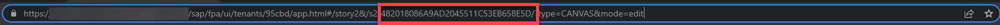
    
    - In this case, the new story has the ID `482018086A9AD2045511C53EB658E5D`. 
    - Save the ID somewhere as you will need it later.

### Extend Navigation Menu
Now that you have retrieved the story ID of the story by which you want to extend your navigation menu, you can continue with the actual customization process.

1. Open the story where you want to customize your navigation menu in **edit** mode.
    
    >INFORMATION:
    >
    For demonstration purposes, we will use the **Marketing Demand Planning** story.

2. Open the `onInitialization` script of the story.

    - Open the **Left Side Panel**
    - Go to **Outline**
    - Open the `onInitialization` script of the story.

    <!-- border; size:540px -->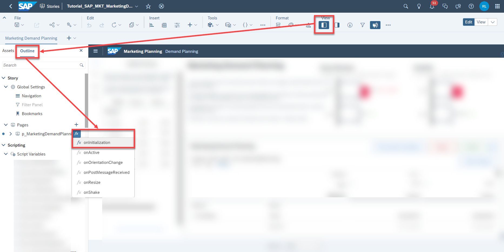

3. Extend the `cfg_storyIds` dictionary.

    - In the `onInitialization` script, scroll down until you see the block where the variable `cfg_storyIds` is initialized.

    <!-- border; size:540px -->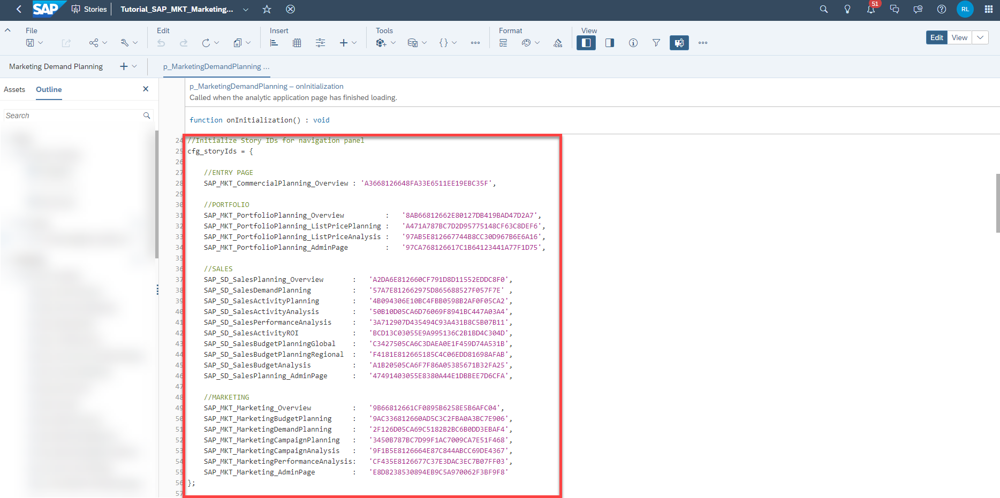

    - Add a new line for the new story according to the format you see. You may add this new line whereever you want, the order does not matter. 
    - For the so called `key`, provide some semantic name for your story. In this case, the story names were used but you can provide any name of your choice. In this demonstration, we will call it `SAP_Tutorial_Story`.
    - For the so called `value`, provide the story ID of your new story as string that you retrieved in **Step 1** of this tutorial. In this case, the ID is `482018086A9AD2045511C53EB658E5D`. 
    - Your result should look like this now:

    <!-- border; size:540px -->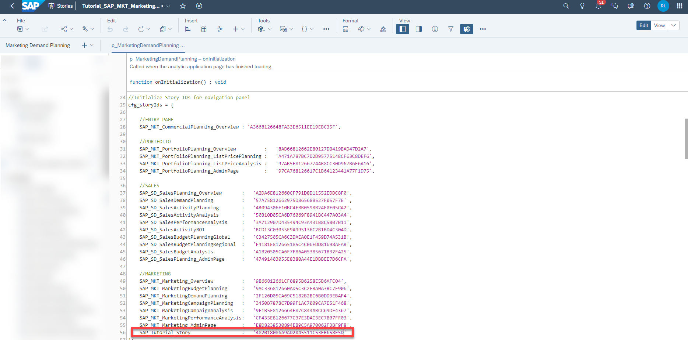

4. Add new UI elements to the Navigation Menu

    - In the **Left Side Panel**, open the container `MainNavigation` that holds all of the UI elements for the stories.
    - Set it to visible by clicking on the `eye` icon.
    
    <!-- border; size:540px -->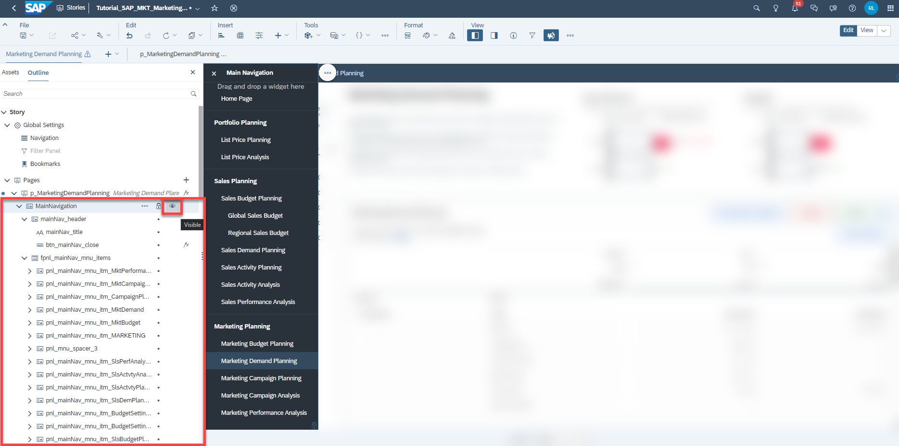
    
    - Each of those links or buttons in the navigation menu technically consists of a panel and a text field. In order to create a new item in the menu, select one of the panels called `pnl_mainNav_mnu_itm_xxx` in the **Left Side Panel** and duplicate it. 
    
    <!-- border; size:540px -->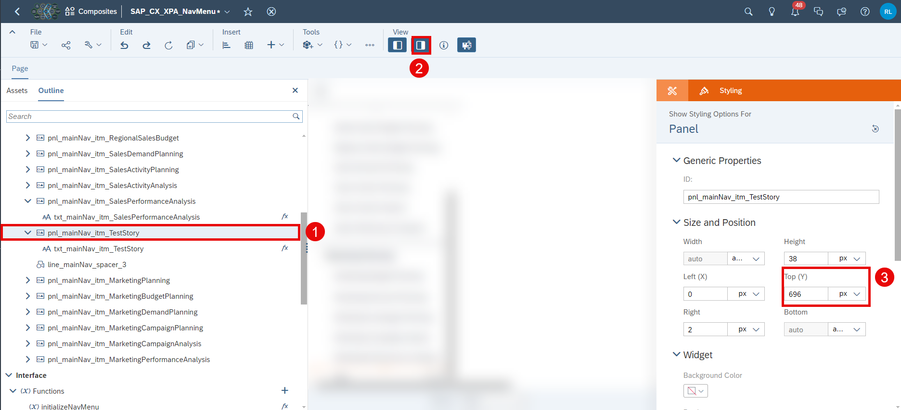

5. Rename the new elements

    - You can now see the new elements in the **Left Side Panel**. 

    <!-- border; size:540px -->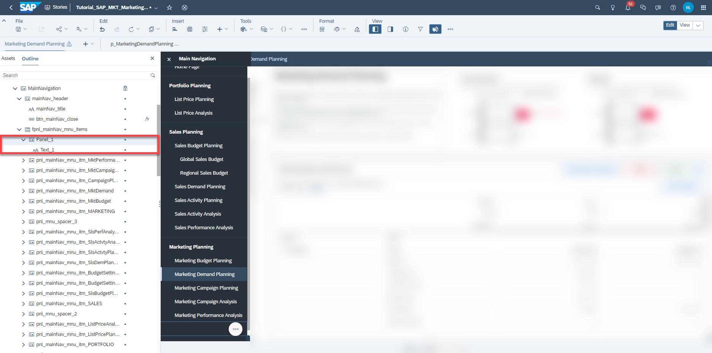

    - After duplicating existing elements, the new elements are provided with a generic name. 
    - Adjust the names of the panel and the text field according to the naming convention.
  
    >INFORMATION:
    >
    You can also skip this step and continue with the default names, but it highly advised to adjust the names for maintenance and consistency reasons.

    - In this demonstration, we will rename the panel `Panel_1` to `pnl_mainNav_mnu_itm_TUTORIAL` and the text field from `Text_1` to `txt_mainNav_mnu_itm_TUTORIAL`.

    <!-- border; size:540px -->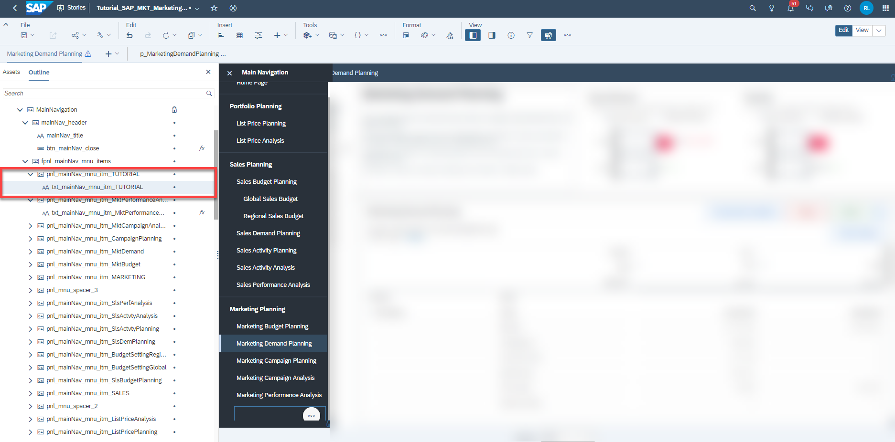

6. Add code to the `onClick` script of the text widget.

    - Open the `onClick` script of the text widget now called `txt_mainNav_mnu_itm_TUTORIAL`.

    <!-- border; size:540px -->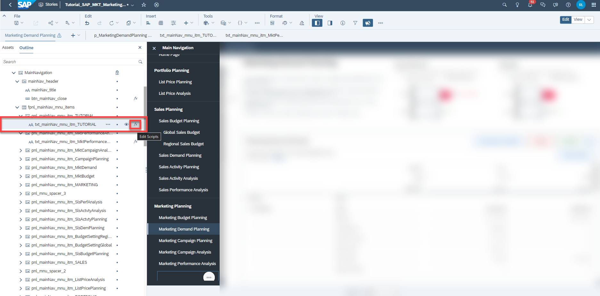

    - Add the following line of code to it. The highlighted area is the area you need to customize.

    <!-- border; size:540px -->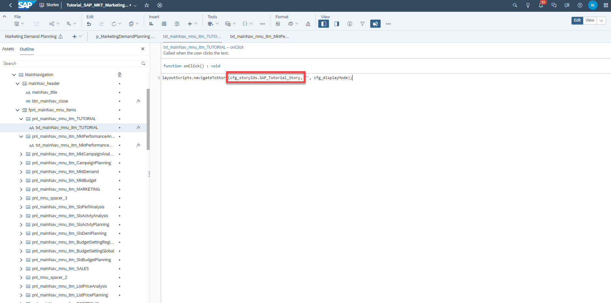

    ```
    layoutScripts.navigateToStory(cfg_storyIds.SAP_Tutorial_Story,'',cfg_displayMode);
    ```

    - After the `cfg_storyIds.`, you need to provide the `key` which you defined in your `onInitialization` script for the new story. In this case, the key is called `SAP_Tutorial_Story`, which may be different for you depending on the name you have chosen.

7. Change the displayed text for the view mode.

    - Double click on the new text field inside the canvas and provide a descriptive name for your story.
    - For demonstration purposes, we will just call it `TUTORIAL`.
  
    <!-- border; size:540px -->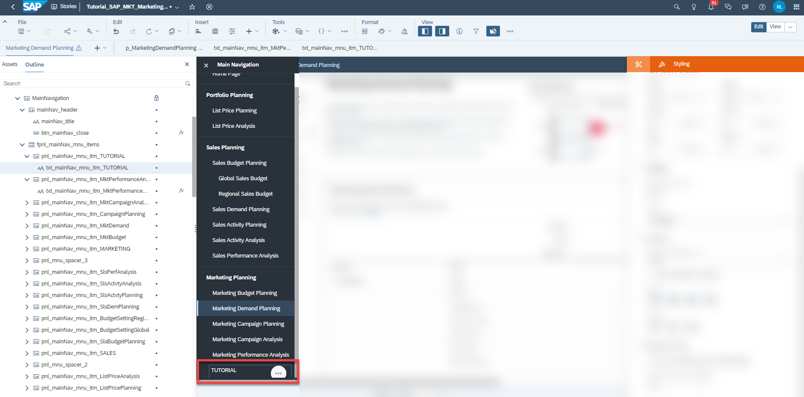

8. Hide the navigation menu.

     - Set to invisible the container for the navigation menu in the **Left Side Panel** by clicking on the `eye` icon next to it. 

    <!-- border; size:540px -->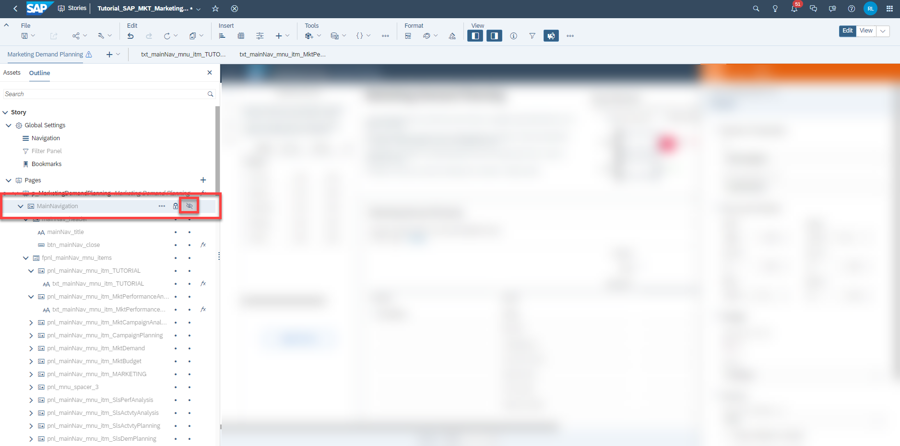

9.  Save your story.

10. Now repeat this exercise for all stories where you want to extend your navigation menu.

### Adjust CSS Class
You may have noticed that one story in the navigation menu is always highlighted when you open the panel. Basically the highlighted text only shows in which story you are currently located. 

<!-- border; size:540px -->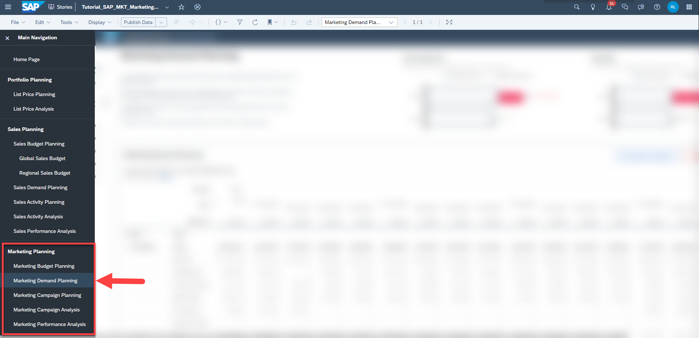

When you edit the navigation menu in your new story, you want to change the setting so that the new story is highlighted when you enter the menu within that new story. 

1. Open your new story in **edit mode**.
2. Open the **Left Side Panel**
3. Open the **Outline Tab**
4. Drill down until you find the newly created container for the new story button redirecting you to the new story.
5. Click on the panel object and change the css class name to `mainNavBgSelected`. For all the other containers, make sure they utilize the css class name `mainNavBg`.
6. As you can see in the lower part of the screenshot, the new link is now highlighted while the others are not. 
7. Save your story. 

<!-- border; size:540px -->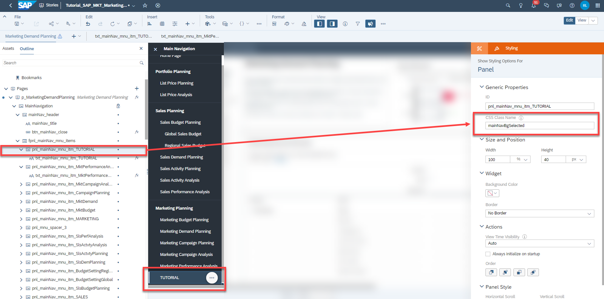

>INFORMATION:
>
Do not forget to hide the container `MainNavigation` in design time in case you set it to visible.


### Final Remarks
Congratulations! You have finished the tutorial and are now able to extend the navigation menu.

If you want to learn more about the modules of this content package, check out the following tutorials:

- [xP&A Commercial Planning - Get to know the Sales Planning module](xpa-sac-cxsp-salesplanning-gettoknow)
- [xP&A Commercial Planning - Get to know the Portfolio Planning module](xpa-sac-cxpp-portfolioplanning-gettoknow)
- [xP&A Commercial Planning - Get to know the Marketing Planning module](xpa-sac-cxmp-marketingplanning-gettoknow)

If you want to customize the content and adjust it according to your own business requirements, the following resources might be helpful:

- [xP&A Commercial Planning - Introduction to the Data Model](xpa-sac-cxmp-datamodelfundamentals)
- [xP&A Commercial Planning - Data Integration](xpa-sac-cx-data-integration-setup)
- [xP&A Commercial Planning - Manage data loads](xpa-sac-cx-manage-data-loads)
- [xP&A Commercial Planning - Understanding the technical structure of Stories](xpa-sac-cx-technical-structure-of-stories)
- [xP&A Commercial Planning - Add additional sections to a story](xpa-sac-cx-add-new-sections-to-app)
- [xP&A Commercial Planning - Customize Default Settings](xpa-sac-cx-customize-default-settings)
- [xP&A Commercial Planning - Customize Table Settings Dialogue](xpa-sac-cx-customize-table-settings-dialogue)
- [xP&A Commercial Planning (Marketing) - Add a new Driver](xpa-sac-cxmp-add-new-driver)
- [xP&A Commercial Planning (Marketing) - Add a new Version](xpa-sac-cxmp-add-new-version)
- [xP&A Commercial Planning (Marketing) - Extend campaign and activity attributes](xpa-sac-cxmp-add-new-attributes)
- [xP&A Commercial Planning (Marketing) - Extend activity spend dates](xpa-sac-cxmp-extend-activity-dates)
- [xP&A Commercial Planning (Sales) - Add a new Version](xpa-sac-cxsp-add-new-version)
- [xP&A Commercial Planning (Sales) - Add a new Tactic](xpa-sac-cxsp-add-new-tactic)
- [xP&A Commercial Planning (Sales) - Add a new Spend Type](xpa-sac-cxsp-add-new-spendtype)

If you want to get an overview of the entire xP&A Commercial Planning content package, make sure to check out the Mission.

Interested in more xP&A topics and related business content packages? Visit our community page [Extended Planning & Analysis Business Content](https://community.sap.com/topics/cloud-analytics/planning/content).
