## Prerequisites
- You have an SAP Analytics Cloud tenant. If this is not the case, get started by requesting a free [SAP Analytics Cloud trial](https://www.sap.com/products/technology-platform/cloud-analytics/trial.html) tenant.
- You have installed the **SAP CX Commercial Planning content** in an SAP Analytics Cloud tenant. Reference: [Business Content Installation Guide](https://help.sap.com/docs/SAP_ANALYTICS_CLOUD/00f68c2e08b941f081002fd3691d86a7/078868f57f3346a98c3233207bd211c7.html), [Content Package User Guide](https://help.sap.com/docs/SAP_ANALYTICS_CLOUD/42093f14b43c485fbe3adbbe81eff6c8/b0046d8673b5412cbef7f521cfdfed95.html)
- You have finished both introduction tutorials [xP&A Commercial Planning - Get to know the Portfolio Planning module](xpa-sac-cxpp-portfolioplanning-gettoknow) and [xP&A Commercial Planning - Get to know the Marketing Planning module](xpa-sac-cxmp-marketingplanning-gettoknow)
- You have finished the tutorial [xP&A Commercial Planning - Understanding the technical structure of stories](xpa-sac-cx-technical-structure-stories) and understand the architectural design of each app

## You will learn
- how to add an additional story to the navigation menu in case you plan to enhance this content package with additional applications.

## Intro
Now that you have successfully gone through the introduction tutorials and know how to use the content package like an expert, you may want to start customizing it and adjusting it according to your own business needs.

Here you will learn how to extend the navigation menu with new stories. 

In case you have any questions or require further support, please use the [SAP Question Form](https://community.sap.com/t5/forums/postpage/choose-node/true/product-id/bcbf0782-ce74-43b8-b695-dafd7c1ff1c1/board-id/technology-questions).

If you have a specific request to our team in regards to the business content, you may also submit a request using the [SAP Influence Platform](https://influence.sap.com/sap/ino/#/idea-create?campaign=884&title=Extended%20Planning%20and%20Analysis%3A%20content&tags=Extended%20Planning%20and%20Analysis&RespList=cust.ino.config.SAP_ANALYTICS_CLOUD_SAP_DIGITAL_BOARDROOM.BIZ_CONTENT).

If you are interested in more xP&A topics, related business content packages, or videos showing the content in action, feel free to check out our community page [Extended Planning & Analysis Business Content](https://community.sap.com/topics/cloud-analytics/planning/content).

### Retrieve new Story ID
In order to add a new story to the navigation menu, you must first retrieve the story ID of your new story. 

1. Open the story you want to add to the navigation menu.
   
2. Retrieve the technical story ID.
    - Check the hyperlink. The highlighted part represents the technical story ID. Please note that your story ID might differ.
    
    <!-- border; size:540px -->
    
    - In this case, the new story has the ID `A99AE05507BABDEB716E3C299797B03`. 
    - Save the ID somewhere as you will need it later.

### Extend Navigation Menu
Now that you have retrieved the story ID of the story by which you want to extend your navigation menu, you can continue with the actual customization process.

1. Navigate to the folder which contains the composite object for the navigation menu. 

    - The composite for the navigation menu is located inside the **Commercial Planning** folder structure and is called **Composite for Commercial Planning Navigation Menu** (`SAP_CX_XPA_NavMenu`).

    <!-- border; size:540px -->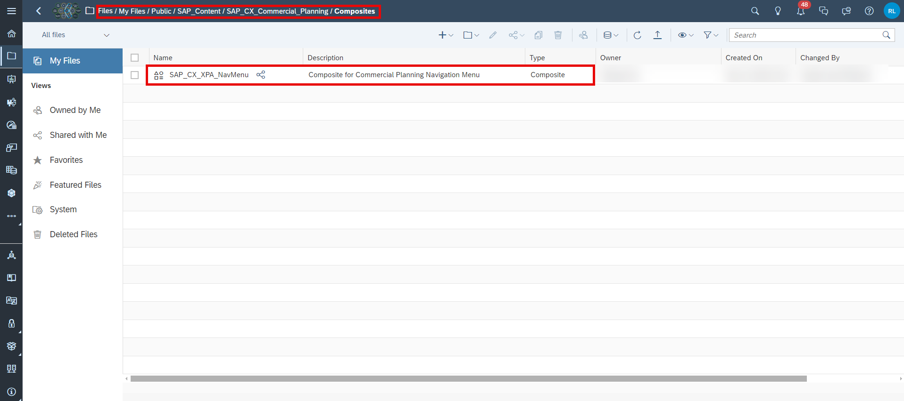

    >INFORMATION:
    >
    - A composite is a set of widgets and scripting elements which can be centrally created, maintained and then used across multiple stories. 
    - This is especially useful when you have a specific building block, such as a navigation menu, which is identical across all stories.
    - Instead of having to maintain the navigation menu in each of the stories separately, you can instead consume the centrally created composite.
    - All changes done to the composite will then also be automatically reflected in the respective stories which use the composite.

2. Add new UI elements to the Navigation Menu

    - Each of the links or buttons in the navigation menu technically consist of a panel and a text field. 
    - In order to create a new item in the menu, open the **Left Side Panel**, go to the **Outline** section, select one of the panels under the `pnl_mainNav_items` container (starting with `pnl_mainNav_mnu_itm_xxx`) and duplicate it. 
    - In this example, we will simply use the `pnl_mainNav_itm_GlobalSalesBudget` container as a baseline for the new menu item. You can chose any other panel as well since the structure across all of those buttons is identical.
    
    <!-- border; size:540px -->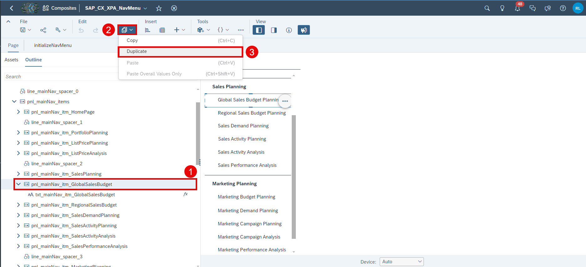

3. Rename the new elements

    - You can now see the new elements in the **Outline** section in the **Left Side Panel**. 

    <!-- border; size:540px -->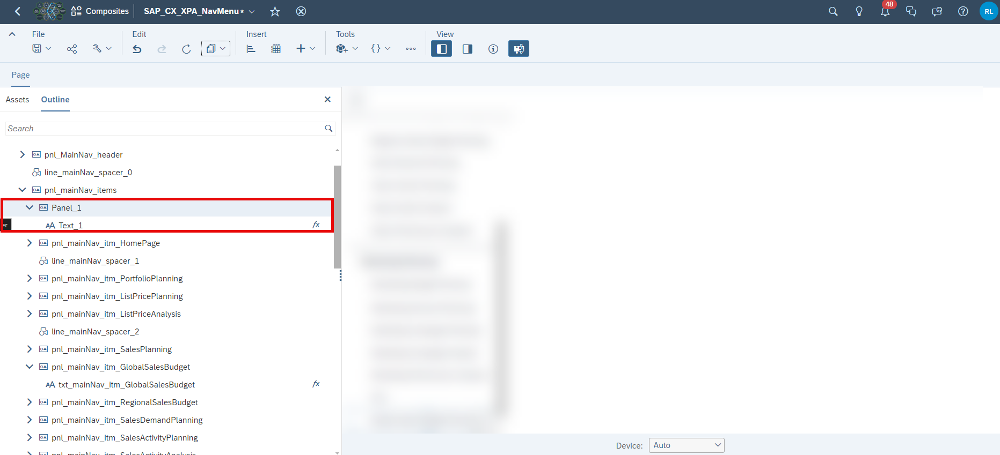

    - After duplicating existing elements, the new elements are provided with a generic name. 
    - Adjust the names of the panel and the text field according to the naming convention.
  
    >INFORMATION:
    >
    You can also skip this step and continue with the default names, but it highly advised to adjust the names for maintenance and consistency reasons.

    - In this demonstration, we will rename the panel `Panel_1` to `pnl_mainNav_itm_TestStory` and the text field from `Text_1` to `txt_mainNav_itm_TestStory`.

    <!-- border; size:540px -->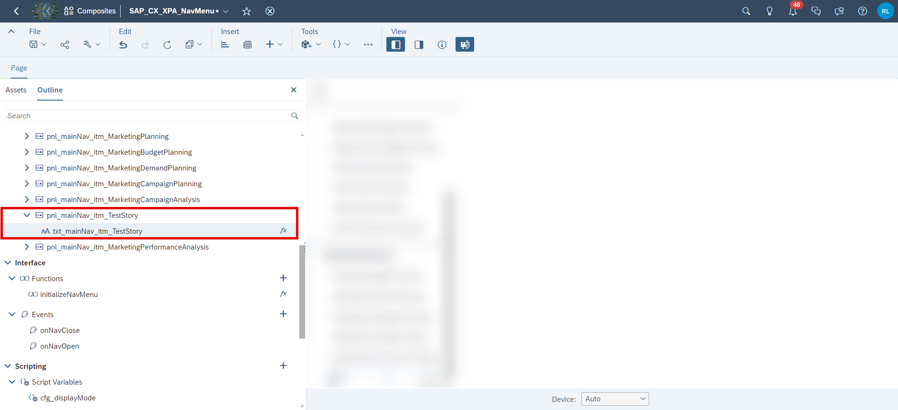

4. Adjust the display name of the new menu item.

    - Double click on the text widget on the canvas and adjust the text which should be displayed in runtime. 

    <!-- border; size:540px -->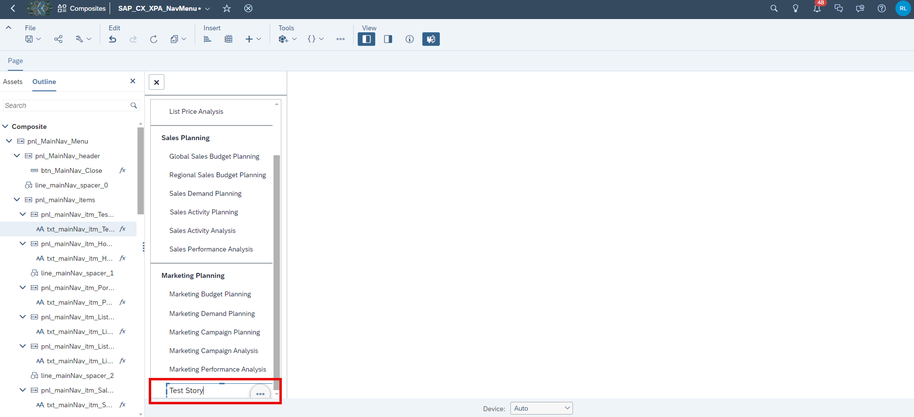

5. Rearrange the new elements by changing the positioning

    - If required, you can now rearrange the positioning of the new elements in the menu.
    - Please note that all panels inside the `pnl_mainNav_items` container have a fixed positioning. If you want to move the new elements to the top, you will consequently have to change the positioning of the following panels as well in order to avoid overlapping.

    <!-- border; size:540px -->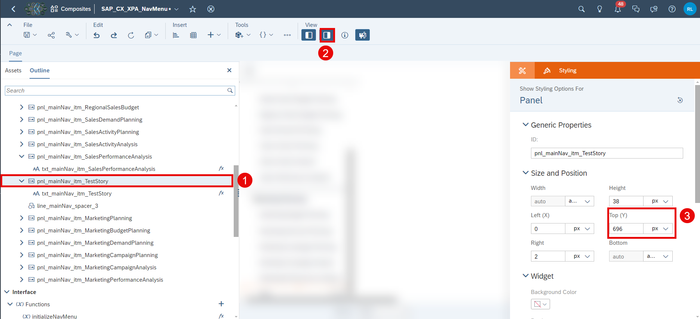

5. Open the `initializeNavMenu` script of the composite.

    - Open the **Left Side Panel**
    - Go to **Outline**
    - Open the `initializeNavMenu` script of the composite.

    <!-- border; size:540px -->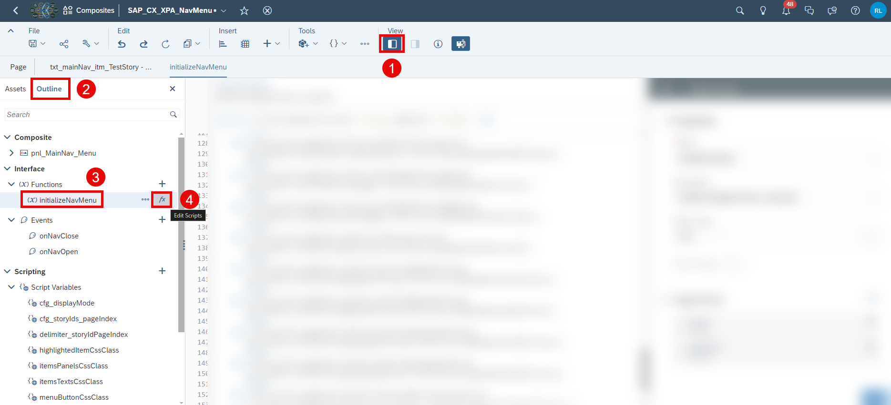

6. Extend the `cfg_storyIds_pageIndex` dictionary.

    - In the `initializeNavMenu` script, scroll down until you see the block where the variable `cfg_storyIds_pageIndex` is initialized.
    - Add a new line for the new story according to the format you see. You may add this new line wherever you want, the order does not matter. 
    - For the so called `key`, provide any semantic name for your story. In this case, the story names were used but you can provide any name of your choice. In this demonstration, we will call it `TestStory`.
    - For the so called `value`, provide the story ID of your new story as string that you retrieved in **Step 1** of this tutorial. In this case, the ID is `A99AE05507BABDEB716E3C299797B03`. 
    - Your result should look like this now:

    <!-- border; size:540px -->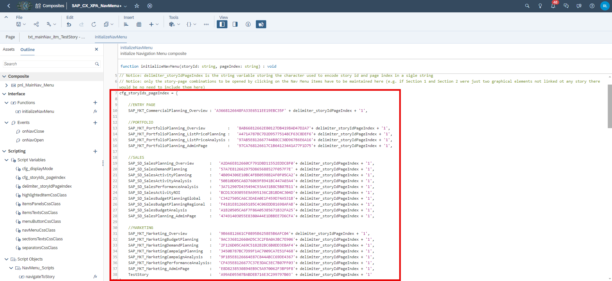

7. Add a new line of code to apply the correct CSS class to the duplicated text object.

    - Scroll down a little bit until you find the code block indicated by the comment `format Nav Menu items texts`
    - Add a new line of code here. Enter the name of the text element you have defined in sub-step 3 and append `.setCssClass(itemsTextsCssClass);` to it.
    - The result should look like this, with the new line visible in line 58: 

    <!-- border; size:540px -->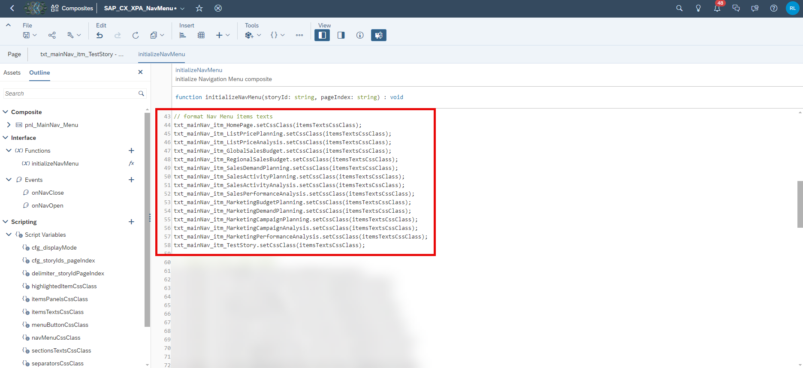

8. Add a new line of code to apply the correct CSS class to the duplicated panel object.

    - Scroll down a little bit until you find the code block indicated by the comment `format Nav Menu items panels`
    - Add a new line of code here. Enter the name of the panel object you have defined in sub-step 3 and append `.setCssClass(itemsPanelsCssClass);` to it.
    - The result should look like this, with the new line visible in line 78: 

    <!-- border; size:540px -->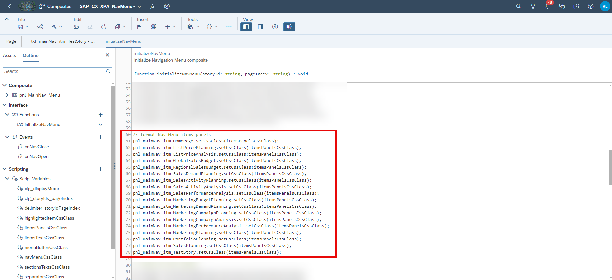

9. Extend the switch function at the end of the script.

    - Scroll to the last part of the script where you will find a switch function containing many cases. 
    - Extend the switch function by an additional case as shown in the following screenshot:

    <!-- border; size:540px -->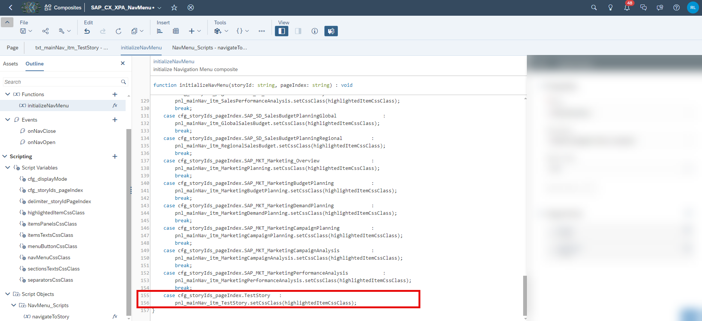

10. Update the `onClick` event script of the duplicated text element.

    - Open the **Outline** section.
    - Find the duplicated text object. In this case, we have to look for the object called `txt_mainNav_itm_TestStory`.
    - Open the `onClick` event script.
    - Edit the code by changing the highlighted part to the key name you provided in sub-step 6.

    <!-- border; size:540px -->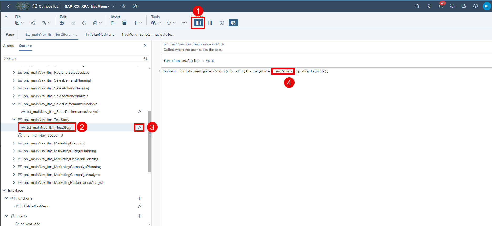

11. Save your changes.

    - Your changes should now be reflected in all of the stories which consume this composite.

### Final Remarks
Congratulations! You have finished the tutorial and are now able to extend the navigation menu.

If you want to learn more about the modules of this content package, check out the following tutorials:

- [xP&A Commercial Planning - Get to know the Sales Planning module](xpa-sac-cxsp-salesplanning-gettoknow)
- [xP&A Commercial Planning - Get to know the Portfolio Planning module](xpa-sac-cxpp-portfolioplanning-gettoknow)
- [xP&A Commercial Planning - Get to know the Marketing Planning module](xpa-sac-cxmp-marketingplanning-gettoknow) 

If you want to customize the content and adjust it according to your own business requirements, the following resources might be helpful:

- [xP&A Commercial Planning - Introduction to the Data Model](xpa-sac-cxmp-datamodelfundamentals)
- [xP&A Commercial Planning - Data Integration](xpa-sac-cx-data-integration-setup)
- [xP&A Commercial Planning - Manage data loads](xpa-sac-cx-manage-data-loads)
- [xP&A Commercial Planning - Understanding the technical structure of Stories](xpa-sac-cx-technical-structure-stories)
- [xP&A Commercial Planning - Add additional sections to a story](xpa-sac-cx-add-new-sections)
- [xP&A Commercial Planning - Customize Default Settings](xpa-sac-cx-customize-default-settings)
- [xP&A Commercial Planning - Customize Table Settings Dialogue](xpa-sac-cx-customize-tablesettings-dialogue)
- [xP&A Commercial Planning (Marketing) - Add a new Driver](xpa-sac-cxmp-add-new-driver)
- [xP&A Commercial Planning (Marketing) - Add a new Version](xpa-sac-cxmp-add-new-version)
- [xP&A Commercial Planning (Marketing) - Extend activity spend dates](xpa-sac-cxmp-extend-activity-dates)
- [xP&A Commercial Planning (Sales) - Add a new Version](xpa-sac-cxsp-add-new-version)
- [xP&A Commercial Planning (Sales) - Add a new Tactic](xpa-sac-cxsp-add-new-tactic)
- [xP&A Commercial Planning (Sales) - Add a new Spend Type](xpa-sac-cxsp-add-new-spendtype)

If you want to get an overview of the entire xP&A Commercial Planning content package, make sure to check out the Mission.

Interested in more xP&A topics and related business content packages? Visit our community page [Extended Planning & Analysis Business Content](https://community.sap.com/topics/cloud-analytics/planning/content).
