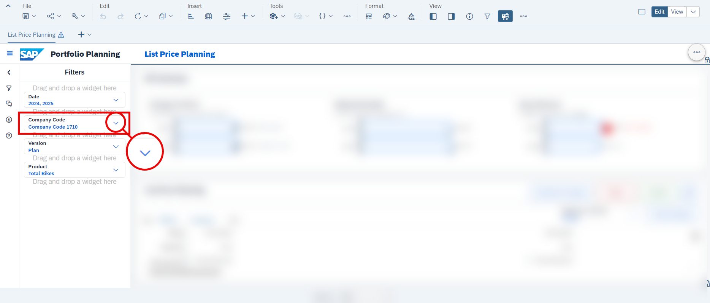
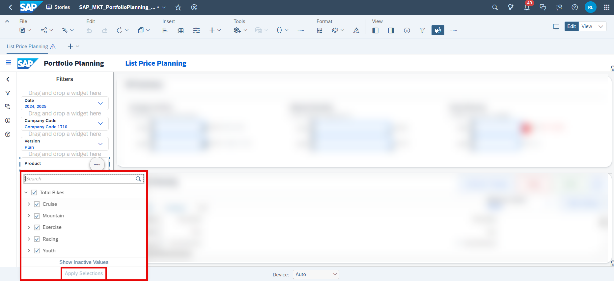
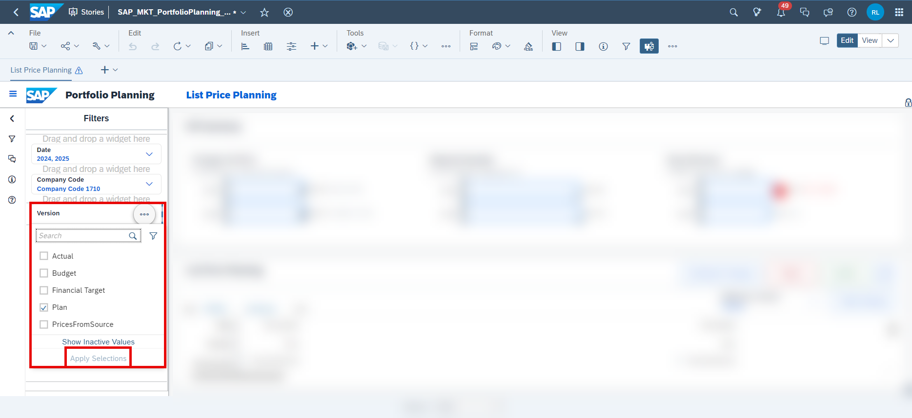
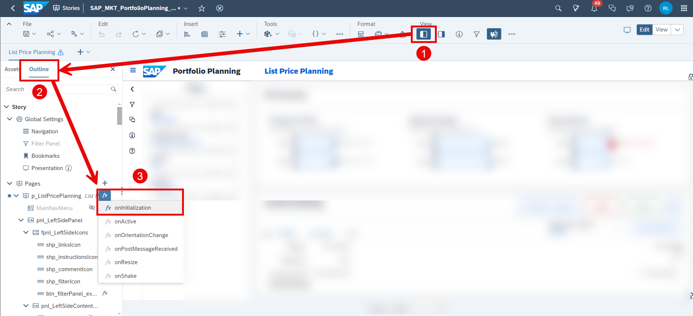
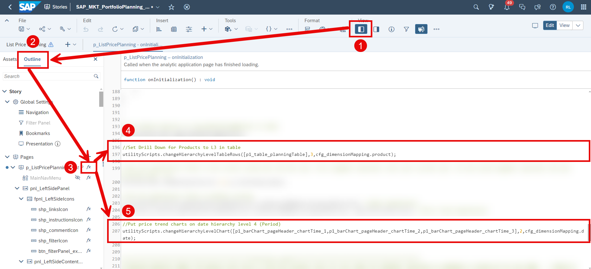
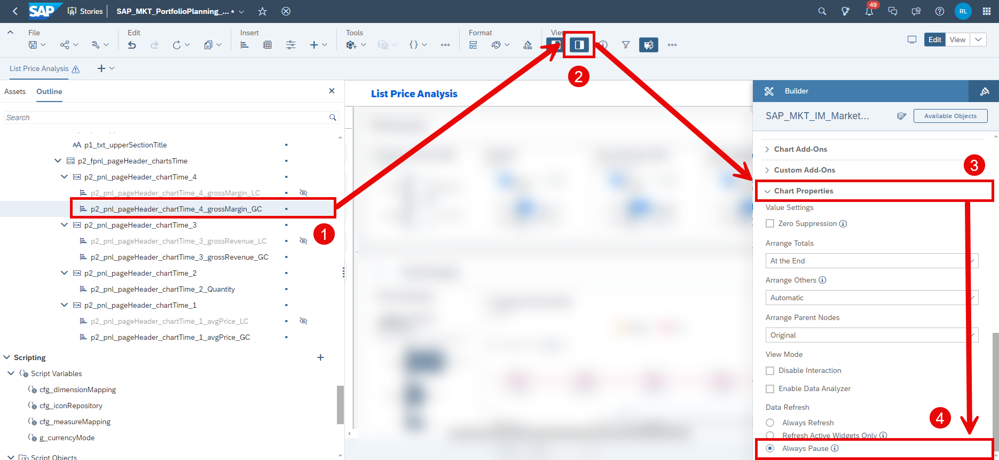
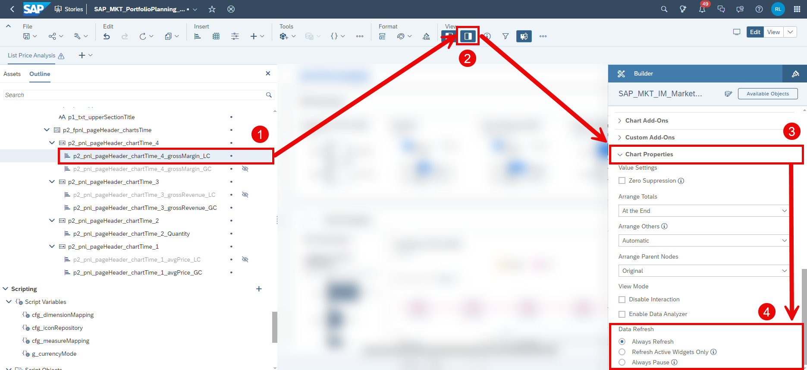

## Prerequisites
- You have an SAP Analytics Cloud tenant. If this is not the case, get started by requesting a free [SAP Analytics Cloud trial](https://www.sap.com/products/technology-platform/cloud-analytics/trial.html) tenant.
- You have installed the **SAP CX Commercial Planning content** in an SAP Analytics Cloud tenant. Reference: [Business Content Installation Guide](https://help.sap.com/docs/SAP_ANALYTICS_CLOUD/00f68c2e08b941f081002fd3691d86a7/078868f57f3346a98c3233207bd211c7.html), [Content Package User Guide](https://help.sap.com/docs/SAP_ANALYTICS_CLOUD/42093f14b43c485fbe3adbbe81eff6c8/b0046d8673b5412cbef7f521cfdfed95.html)
- You have finished both introduction tutorials [xP&A Commercial Planning - Get to know the Portfolio Planning module](xpa-sac-cxpp-portfolioplanning-gettoknow) and [xP&A Commercial Planning - Get to know the Marketing Planning module](xpa-sac-cxmp-marketingplanning-gettoknow)
- You have finished the tutorial [xP&A Commercial Planning - Understanding the technical structure of Stories](xpa-sac-cx-technical-structure-of-stories)
- You have finished the tutorial [xP&A Commercial Planning - Introduction to the Data Model](xpa-sac-cxmp-datamodelfundamentals) and understand the data model of the Commercial Planning Content package

## You will learn
- how to customize the default settings in each story of the **CX Commercial Planning** business content package. This includes...
- ...changing the default measures for the graphs located in the header section of each planning story.
- ...changing the default drill down in all widgets.
- ...changing the default selection in the filter panel of each story.

## Intro
Now that you have successfully gone through the introduction tutorials and know how to use the content package like an expert, you may want to start customizing it and adjusting it according to your own business needs.

This tutorial provides information on how to change the default settings of each story. Surely you have noticed that each time you open a story, all widgets are already pre-filtered to a certain version, company code, product, date range or any other member of another dimension. In addition to that all widgets are drilled down to a specific level of a hierarchy on startup of the planning stories, too. 

Here you will learn how to change the default settings of the planning stories. For demonstration purposes, we will take a look at the **List Price Planning** (`SAP_MKT_PortfolioPlanning_ListPricePlanning`) story and how this is done as the process of changing the default settings is the same for any other story. 

In case you have any questions or require further support, please use to the [SAP Blog question form](https://answers.sap.com/questions/ask.html?primaryTagId=bcbf0782-ce74-43b8-b695-dafd7c1ff1c1&additionalTagId=67838200100800006884&additionalTagId=819703369010316911100650199149950&topics=commercial%20planning) to reach out to us.

If you are interested in more xP&A topics, related business content packages, or videos showing the content in action, feel free to check out our community page [Extended Planning & Analysis Business Content](https://community.sap.com/topics/cloud-analytics/planning/content).

### Change Default Company Code 
In this step you will learn how to change the default company code selection.

1. Open the story you want to change the default company code settings for in **edit mode**.

2. Click on the arrow icon of the **Company Code Input Control** on the left-hand side of the story to expand the selection of available company codes. 

    <!-- border; size:540px -->

3. Now select the company code you want the widgets to be filtered to on startup of the story.

    <!-- border; size:540px -->

    >INFORMATION:
    >
    - In this particular example, the story is designed in a way so that you can only work on one company code, which is why the input control only allows a single selection.
    - Some **Company Code Input Controls** may allow you to select multiple company codes though.
    - If this is the case, you will additionally have to click on **Apply Settings** in order to apply your changes. 

4. Save your story.

### Change Default Product
In this step you will learn how to change the default product selection.

1. Open the story you want to change the default product settings for in **edit mode**.

2. Click on the arrow icon of the **Product Input Control** on the left-hand side of the story to expand the selection of available products. 

3. Now select the products you want the widgets to be filtered to on startup of the story and click on **Apply Selections**

    <!-- border; size:540px -->

4. Save your story.

### Change Default Version
In this step you will learn how to change the default version selection.

1. Open the story you want to change the default version settings for in **edit mode**.

2. Click on the arrow icon of the **Version Input Control** on the left-hand side of the story to expand the selection of available versions. 

3. Now select the versions you want the widgets to be filtered to on startup of the story and click on **Apply Selections**

    <!-- border; size:540px -->

4. Save your story.

Please note that some versions of the data model might be excluded from the input control and are not selectable as a result.
In order to change that, right-click on the **Version Input Control** and hit **Edit Filter...**.

<!-- border; size:540px -->

Select all version you want to be selectable and click on **OK** to apply the new setting.

<!-- border; size:540px -->

This works for any other input control as well in case you notice that some members or nodes are missing.

### Change Default Date
In this step you will learn how to change the default date selection.

As the date is fed in dynamically based on the current system date, you will have to make some smaller adjustments in the scripting section.

This is because the date default settings are controlled via a script that is executed on initialization of the story. 

1. Open the story you want to change the default date settings for in **edit mode**.

2. In order to define the date default selection, open the **Left Side Panel**, go on **Outline** and edit the `onInitialization` script of the story object.

    <!-- border; size:540px -->

3. Scroll down until you find the line of code shown in the next screenshot. Depending on the story you are working on, the line number might differ but the code itself remains the same. 
   
    <!-- border; size:540px -->

4. In order to change the date range to be selected, only adjust the orange-colored numbers in this line. 
   
    - This script function requires **two** arguments to be passed in order to define the start year and the end year. 
    - The start year is defined by the first argument (which is the `0` in this example) while the end date is defined by the second argument (which is the `1` in this example).
    - These numbers are added to the current system year. If the current year is `2023` for example, the start year would be `2023`+`0` and the end year would be `2023`+`1` as a result, while `0` and `1` are the arguments that you passed to the function. 
    - Consequently the default date range would be `2023` (resulting from `2023`+`0`) to `2024` (resulting from `2023`+`1`).
    - If on the other hand you wanted the default date range to be from `2023` (which is the current year in this example) to `2025` (which would be the current year plus `2`), you would have to change the script to look as shown in the next screenshot:
  
    <!-- border; size:540px -->

    - If you wanted to change the default date range to be from `2022` (which would be the current year minus `1`) to `2025` (which would be the current year plus `2`), you would have to change the script to look like that:
  
    <!-- border; size:540px -->

5. Save your changes
   
>INFORMATION:
>
- Some years might be excluded from the input control and are not selectable as a result, even if you use a script to select them.
- In order to extend the selectable options, please repeat the same steps as described in the previous sub-step.
- Right-click on the date input control and hit **Edit Filter...**.
- Select all dates you want to be selectable and click on **OK** to apply the new setting.

### Adjust default Drill Down
In this step you will learn how to change the default drill down for widgets applied on startup of each planning story or disable it completely.

>INFORMATION:
>
- Most of the planning stories perform a drill down operation down to a certain level on a set of dimensions in each widget on initialization in order to ensure consistency. 
- These drill-down operations are controlled via a tiny script that is executed on start-up of affected stories.

1. Open the story you want to change the default drill down settings for in **edit mode**.
   
2. Open the `onInitialization` script of the story and look for these lines of codes.

    <!-- border; size:540px -->

    >INFORMATION:
    >
    - Basically, there are three scripts which control the drill down. 
    - The script `utilityScripts.changeHierarchyLevelChart` controls the drill down for chart widgets.
    - The script `utilityScripts.changeHierarchyLevelTableRows` controls the drill down for dimensions located in the rows of a table widget.
    - The script `utilityScripts.changeHierarchyLevelTableColumns` controls the drill down for dimensions located in the columns of a table widget.

3. Now adjust the arguments in the function to change the affected widgets, dimensions and the level to which the drill down should be applied to.

    - In order to change the drill down state for chart widgets, you must call the script `utilityScripts.changeHierarchyLevelChart` as shown in the previous screenshot. 
    - As first argument, you must pass the affected widget IDs as an array, which in this example are the three widgets called `[p1_barChart_pageHeader_chartTime_1,p1_barChart_pageHeader_chartTime_2,p1_barChart_pageHeader_chartTime_3]`. 
    - As the second argument you must specify the level to which you want to drill down. The `2` indicates that the drill down is performed down to the second hierarchy level of the dimension, while the dimension itself is specified in the third argument. 
    - In this example, we want to perform a drill down on the date dimension, which we specify with the statement `cfg_dimensionMapping.date`. By using these settings, we now set-up an automatic drill down to the second level of the date dimension for the three widgets `p1_barChart_pageHeader_chartTime_1`, `p1_barChart_pageHeader_chartTime_2` and `p1_barChart_pageHeader_chartTime_3`.

    - In order to change the drill down state for table widgets, you must either call the script `utilityScripts.changeHierarchyLevelTableRows` or `utilityScripts.changeHierarchyLevelTableColumns`, depending on whether the affected dimension is located in the rows or columns of the table widget. 
    - As first argument, you must pass the affected table IDs as an array, which in this example is `[p1_table_planningTable]`. 
    - As the second argument you must specify the level to which you want to drill down. The `3` indicates that the drill down is performed down to the third hierarchy level of the dimension, while the dimension itself is specified in the third argument. In this example, we want to perform a drill down on the product dimension, which we specify with the statement `cfg_dimensionMapping.product`. By using these settings, we now set-up an automatic drill down to the third level of the product dimension for the table `p1_table_planningTable`.

    - You can use any of these scripts to define the default drill down by simply changing the arguments as shown above. 
    - If you do not want to control the drill down state via these scripts, simply delete these lines of code, put a `//` before each line in order to comment it out and thus disable the code or leave the first argument empty `[]` so no widget is affected by the script. 
  
4. Save your story. 

### Change Measures in Header Graphs
In this step you will learn how to change the measures in the header graphs of the planning stories.

>INFORMATION:
>
- Most of the stories have a couple of charts providing high level information located in the header section. 
- Those charts are predefined to show certain measures, such as the gross revenue, the gross margin or the total quantity for instance.
- In this step you will learn how to change the measures in the header graphs in case you would like to display other measures.
  
1. Open the story where you want to change the header graphs in **edit mode**.

2. Click on the chart widget in which you want to change the measure and open the **Right Side Panel** to enter the **Builder**.
    
    <!-- border; size:540px -->

3. Now simply select another measure or account of your choice in order to change the graph by using the SAC standard capabilities provided in the **Builder** panel.

4. Save your story.

Please note that some graphs may have pre-defined variances and color settings which potentially must be adjusted as well. 

<!-- border; size:200px -->

Depending on the scope of your changes, you might have to adjust the chart sub title as well. Some of the sub-titles are manually configured or contain custom variables directing to specific attributes of dimensions.

<!-- border; size:540px -->
  
Depending on the scope of your changes, please make sure that the drill down script `utilityScripts.changeHierarchyLevelChart` as described in the previous step still works. This is the case when no error on initialization of the story occurs. This is particularly necessary if you remove the date dimension from the y-axis of the chart as per default the drill-down script is targeting the date dimension.

### Change Currency Mode
Notice that the **List Price Analysis** (`SAP_MKT_PortfolioPlanning_ListPriceAnalysis`) story provides the possibility to switch between a local currency based view and a global currency based view.

Here you will learn how to change the default view.
  
1. Open the **List Price Analysis** (`SAP_MKT_PortfolioPlanning_ListPriceAnalysis`) story in **edit mode**.

2. Click on the currency drop down widget and open the **Right Side** panel and select the option `LC` as default.
  
    <!-- border; size:540px -->

    >INFORMATION:
    >
    - Per default, the global currency point of view is selected which is indicated by the abbreviation `GC`.
    - In order to change the selection to local currency, you must set `LC` as the default selection. 

3. Next, open the **Left Side Panel**, go into the **Outline** section and look for the global variable `g_currencyMode`. Change the default value to `LC`.
   
    <!-- border; size:540px -->

4. Lastly, scroll through the complete **Outline** panel and look for the widgets with the suffix `_LC` or `_GC`. 
    
    - You will notice that per default all widgets having the suffix `_LC` are hidden while all widgets with the suffix `_GC` are set to visible.
    - You will now have to reverse that as described in the next steps. 

5. Click on the chart with the suffix `_GC`, open the **Right Side** panel and open the chart properties. Select **Always Pause** now.
   
    <!-- border; size:540px -->

6. Now make the chart with the `_GC` suffix invisible by clicking on the `eye` icon and set the chart with the `_LC` suffix to visible.
   
    <!-- border; size:540px -->

7. Now click on the chart with the `_LC` suffix in the **Outline** Panel, open to the **Right Side** panel, open the chart properties section and set the chart to **Always Refresh**.
   
    <!-- border; size:540px -->

8. Repeat this step for every panel which contains widgets having the `_LC` and `_GC` suffix. 
   
9.  Save your story.

### Final Remarks
Congratulations! You have finished the tutorial and are now able to change the default settings for the stories.

If you want to learn more about the modules of this content package, check out the following tutorials:

- [xP&A Commercial Planning - Get to know the Sales Planning module](xpa-sac-cxsp-salesplanning-gettoknow)
- [xP&A Commercial Planning - Get to know the Portfolio Planning module](xpa-sac-cxpp-portfolioplanning-gettoknow)
- [xP&A Commercial Planning - Get to know the Marketing Planning module](xpa-sac-cxmp-marketingplanning-gettoknow)

If you want to customize the content and adjust it according to your own business requirements, the following resources might be helpful:

- [xP&A Commercial Planning - Introduction to the Data Model](xpa-sac-cxmp-datamodelfundamentals)
- [xP&A Commercial Planning - Data Integration](xpa-sac-cx-data-integration-setup)
- [xP&A Commercial Planning - Manage data loads](xpa-sac-cx-manage-data-loads)
- [xP&A Commercial Planning - Understanding the technical structure of Stories](xpa-sac-cx-technical-structure-of-stories)
- [xP&A Commercial Planning - Add additional sections to a story](xpa-sac-cx-add-new-sections-to-app)
- [xP&A Commercial Planning - Add an additional story to the Navigation Menu](xpa-sac-cx-add-new-story-to-navmenu)
- [xP&A Commercial Planning - Customize Table Settings Dialogue](xpa-sac-cx-customize-table-settings-dialogue)
- [xP&A Commercial Planning (Marketing) - Add a new Driver](xpa-sac-cxmp-add-new-driver)
- [xP&A Commercial Planning (Marketing) - Add a new Version](xpa-sac-cxmp-add-new-version)
- [xP&A Commercial Planning (Marketing) - Extend campaign and activity attributes](xpa-sac-cxmp-add-new-attributes)
- [xP&A Commercial Planning (Marketing) - Extend activity spend dates](xpa-sac-cxmp-extend-activity-dates)
- [xP&A Commercial Planning (Sales) - Add a new Version](xpa-sac-cxsp-add-new-version)
- [xP&A Commercial Planning (Sales) - Add a new Tactic](xpa-sac-cxsp-add-new-tactic)
- [xP&A Commercial Planning (Sales) - Add a new Spend Type](xpa-sac-cxsp-add-new-spendtype)

If you want to get an overview of the entire xP&A Commercial Planning content package, make sure to check out the Mission.

Interested in more xP&A topics and related business content packages? Visit our community page [Extended Planning & Analysis Business Content](https://community.sap.com/topics/cloud-analytics/planning/content).
