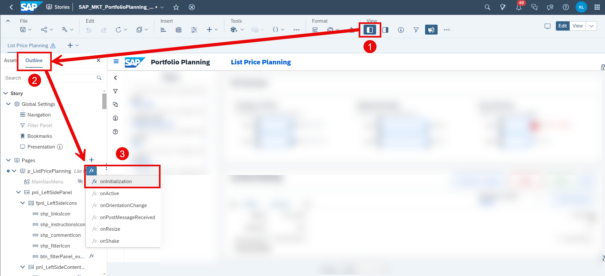
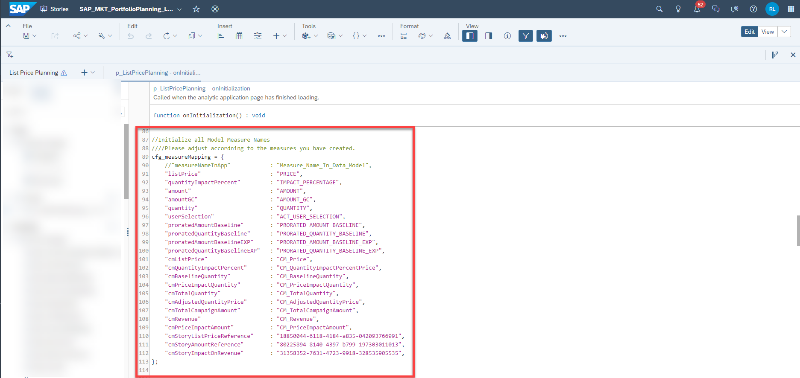
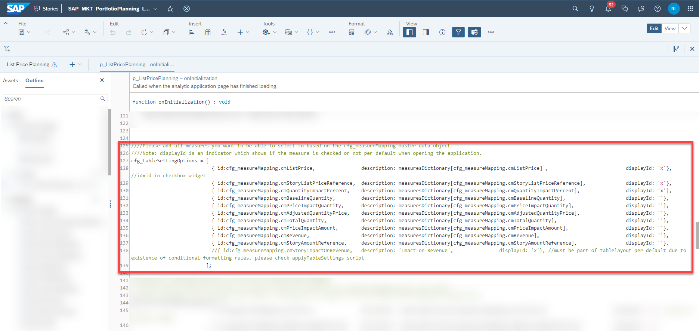
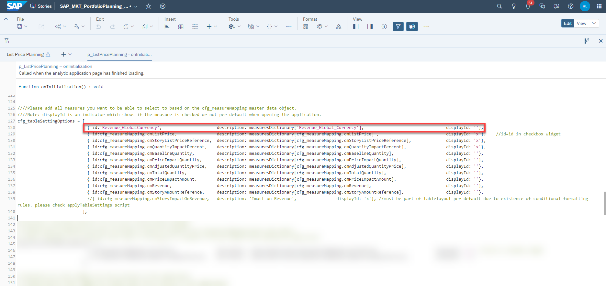
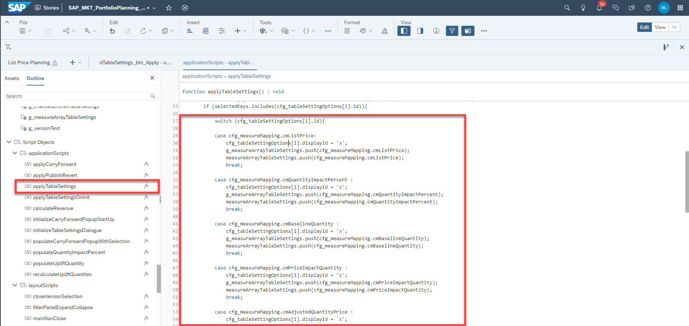
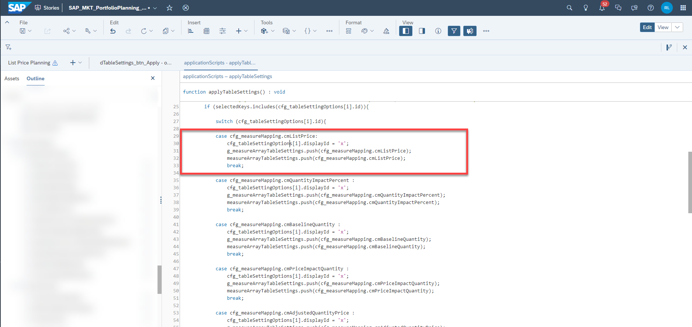
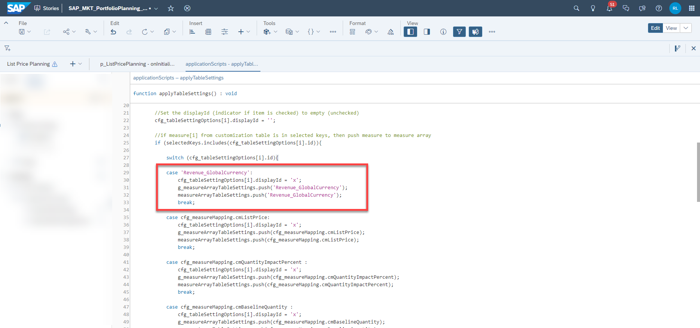
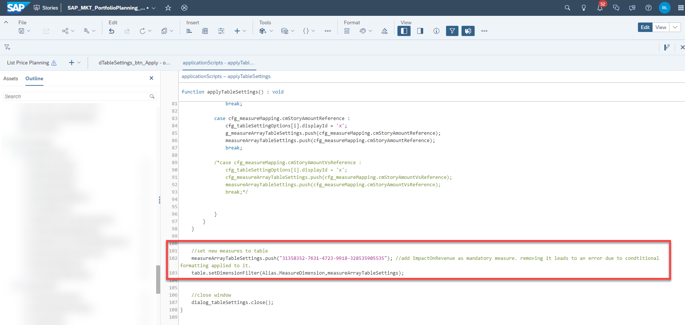

## Prerequisites
- You have an SAP Analytics Cloud tenant. If this is not the case, get started by requesting a free [SAP Analytics Cloud trial](https://www.sap.com/products/technology-platform/cloud-analytics/trial.html) tenant.
- You have installed the **SAP CX Commercial Planning content** in an SAP Analytics Cloud tenant. Reference: [Business Content Installation Guide](https://help.sap.com/docs/SAP_ANALYTICS_CLOUD/00f68c2e08b941f081002fd3691d86a7/078868f57f3346a98c3233207bd211c7.html), [Content Package User Guide](https://help.sap.com/docs/SAP_ANALYTICS_CLOUD/42093f14b43c485fbe3adbbe81eff6c8/b0046d8673b5412cbef7f521cfdfed95.html)
- You have finished both introduction tutorials [xP&A Commercial Planning - Get to know the Portfolio Planning module](xpa-sac-cxpp-portfolioplanning-gettoknow) and [xP&A Commercial Planning - Get to know the Marketing Planning module](xpa-sac-cxmp-marketingplanning-gettoknow)
- You have finished the tutorial [xP&A Commercial Planning - Understanding the technical structure of Stories](xpa-sac-cx-technical-structure-stories)
- You have finished the tutorial [xP&A Commercial Planning - Introduction to the Data Model](xpa-sac-cxmp-datamodelfundamentals) and understand the data model of the Commercial Planning Content package

## You will learn
- how to customize the table settings dialogue available in some of the planning stories. This includes...
- ...adding new measures to the selection
- ...removing existing measures from the selection
- ...properly dealing with measures which have conditional formatting applied to them

## Intro
Now that you have successfully gone through the introduction tutorials and know how to use the content package like an expert, you may want to start customizing it and adjusting it according to your own business needs.

This tutorial provides information on how to change the default selection for the table settings dialogue which can be found in some of the planning stories. 

As presented in the introduction tutorials, this dialogue can be called by using the **Table Settings** button and provides a set of measures to be displayed in your planning table. In particular you will now learn how to add or remove measures from the selection. 

In case you have any questions or require further support, please use the [SAP Question Form](https://community.sap.com/t5/forums/postpage/choose-node/true/product-id/bcbf0782-ce74-43b8-b695-dafd7c1ff1c1/board-id/technology-questions).

If you have a specific request to our team in regards to the business content, you may also submit a request using the [SAP Influence Platform](https://influence.sap.com/sap/ino/#/idea-create?campaign=884&title=Extended%20Planning%20and%20Analysis%3A%20content&tags=Extended%20Planning%20and%20Analysis&RespList=cust.ino.config.SAP_ANALYTICS_CLOUD_SAP_DIGITAL_BOARDROOM.BIZ_CONTENT).

If you are interested in more xP&A topics, related business content packages, or videos showing the content in action, feel free to check out our community page [Extended Planning & Analysis Business Content](https://community.sap.com/topics/cloud-analytics/planning/content).

### Extend Selection
In this step you will learn how to add new measures to the table settings dialogue.

1. Open the the story in which you want to edit the table settings dialogue in **edit mode**. In this example, we will use the List Price Planning story (`SAP_MKT_PortfolioPlanning_ListPricePlanning`).

2. Open the **Left Side Panel**, go to the **Outline** tab and edit the `onInitialization` script of the story object.
   
    <!-- border; size:540px -->

3. Look for the line where the variable `cfg_measureMapping` is initialized. 
   
    <!-- border; size:540px -->
   
    >INFORMATION:
    >
    - As a reminder - the `cfg_measureMapping` dictionary is a global variable which stores all measures of the data model in a dictionary.
    - The left column is the so called key, while the right column is known as the value. 
    - The key in this dictionary is a kind of descriptive version of the corresponding measure maintained in camel case and can be freely defined by you, while the value always represents the technical ID of a measure as it is stored in the data model. 
    - This dictionary stores all base measures, calculated measures and also story-based calculated measures.  
    
 
4. Scroll down inside the script a little further until you find the array called `cfg_tableSettingOptions`. 
    
    <!-- border; size:540px -->

    >INFORMATION:
    >
    - This array defines which measures are displayed for selection in the table settings dialogue. 
    - All measures which are listed here will show up in the dialogue eventually. 

5. In order to add a new measure to the selection, add a new line with a syntax according to the existing lines. 

    - First you must provide an `id`, which you can either type in manually by entering the technical measure ID as it is defined in the data model or by calling it from the `cfg_measureMapping` dictionary. 
    - The next value you must provide is the `description`. The description is the text that will be displayed in the measure selection pop-up. You can either provide a manual description or fetch the description stored in the data model by calling it from the previously initialized `measuresDictionary` object. In order to do so, simply add into the square brackets of `measuresDictionary[]` your technical measure ID.
    - The last information you must provide is the `displayId`. Provide an `x` if the measure should be checked as selected per default or pass an empty string if the checkbox should be unchecked per default.
    - All these three pieces of information must be contained inside swirly brackets `{....}`, as it is the case for the pre-defined measures.  

    - Let us assume that we have a measure in our data model called `Revenue_GlobalCurrency`. If we wanted to add this to the list of selections, the `cfg_tableSettingsOptions` would now look like this:
  
    <!-- border; size:540px -->

    - Now that you have configured which measures you want to display in the pop-up window, you need to adjust the back-end logic so the table layout changes accordingly as well.

6. Next, look for the script `applicationScripts.applyTableSettings` in the **Left Side Panel** and click on **Edit Scripts**. 

    - Scroll down until you find this big switch-case block. 
  
    <!-- border; size:540px -->

    - Make sure that all measures you have maintained in your `cfg_tableSettingOptions` dictionary from the `onInitialization` script are represented in this switch-case block.    
    - If you added a new measure that had not been there initially, make sure to add a respective `case` block for that new measure. 
    - Simply copy one of the existing `case` blocks and paste it somewhere in between the other `case` blocks. The order does not matter. In regards to the screenshot, one of the existing `case` blocks you could choose to copy from ranges from line 29 to 33.

    <!-- border; size:540px -->

    - Make sure to change the measure IDs in the new `case` block accordingly. In regards to the previous screenshot, this must be done in lines 29, 31 and 32. 
    - Following the previous example, your result should look like that:
  
    <!-- border; size:540px -->

    - Save your changes. 

    >INFORMATION
    >
    If you maintain your measure in the `cfg_measrueMapping` dictionary (for example by using the key `revenueGlobalCurrency`) located in the `onInitialization` script, you could also call the new measure by writing `cfg_measureMapping.revenueGlobalCurrency` instead of using the technical ID `Revenue_GlobalCurrency`. 
  
    

### Remove Measures
In this step you will learn how to remove measures from the table settings dialogue.

1. Open the the story in which you want to edit the table settings dialogue in **edit mode**.

2. Open the **Left Side Panel**, go on **Outline** and edit the `onInitialization` script of the story object.
   
    <!-- border; size:540px -->
 
3. Scroll down inside the script until you find the array called `cfg_tableSettingOptions`. 
    
    <!-- border; size:540px -->

    >INFORMATION:
    >
    This array defines which measures are displayed in the pop-up. 

3. In order to remove a certain measure from the selection, simply delete a line.
  
4. Now that you have configured which measures you want to display in the pop-up window, you need to adjust the back-end logic so the table layout changes accordingly as well. In order to do so, look for the script `applicationScripts.applyTableSettings` in the **Left Side Panel** and click on **Edit Scripts**. 
    
    - Scroll down until you find this huge switch-case block. 
  
    <!-- border; size:540px -->

    - Make sure that all measures you have maintained in your `cfg_tableSettingOptions` dictionary from the `onInitialization` script are represented in this switch-case block.
    - If you removed a certain measure, make sure to remove the respective `case` block for the same measure ID as well. So if you removed the measure `cfg_measureMapping.cmListPrice` from the `cfg_tableSettingOptions` dictionary for example, delete the respective lines as well:
    
    <!-- border; size:540px -->
    
    - Save your changes. 
  
### Formatted Measures
You may have noticed that one measure ID is excluded from the switch-case code block and is listed separately at the end of the `applicationScripts.applyTableSettings` script. 

<!-- border; size:540px -->

This is because this particular measure has conditional formatting applied to it and thus **must not** be removed from the table layout. 

Removing measures which have conditional formatting rules applied leads to an error where the application crashes. 
  
This is why the measure must be kept in the layout at any given point in time. 

### Final Remarks
Congratulations! You have finished the tutorial and are now able to adjust the table settings dialogue.

If you want to learn more about the modules of this content package, check out the following tutorials:

- [xP&A Commercial Planning - Get to know the Sales Planning module](xpa-sac-cxsp-salesplanning-gettoknow)
- [xP&A Commercial Planning - Get to know the Portfolio Planning module](xpa-sac-cxpp-portfolioplanning-gettoknow)
- [xP&A Commercial Planning - Get to know the Marketing Planning module](xpa-sac-cxmp-marketingplanning-gettoknow)

If you want to customize the content and adjust it according to your own business requirements, the following resources might be helpful:

- [xP&A Commercial Planning - Introduction to the Data Model](xpa-sac-cxmp-datamodelfundamentals)
- [xP&A Commercial Planning - Data Integration](xpa-sac-cx-data-integration-setup)
- [xP&A Commercial Planning - Manage data loads](xpa-sac-cx-manage-data-loads)
- [xP&A Commercial Planning - Understanding the technical structure of Stories](xpa-sac-cx-technical-structure-stories)
- [xP&A Commercial Planning - Add additional sections to a story](xpa-sac-cx-add-new-sections)
- [xP&A Commercial Planning - Add an additional story to the Navigation Menu](xpa-sac-cx-add-story-navmenu)
- [xP&A Commercial Planning - Customize Default Settings](xpa-sac-cx-customize-default-settings)
- [xP&A Commercial Planning (Marketing) - Add a new Driver](xpa-sac-cxmp-add-new-driver)
- [xP&A Commercial Planning (Marketing) - Add a new Version](xpa-sac-cxmp-add-new-version)
- [xP&A Commercial Planning (Marketing) - Extend activity spend dates](xpa-sac-cxmp-extend-activity-dates)
- [xP&A Commercial Planning (Sales) - Add a new Version](xpa-sac-cxsp-add-new-version)
- [xP&A Commercial Planning (Sales) - Add a new Tactic](xpa-sac-cxsp-add-new-tactic)
- [xP&A Commercial Planning (Sales) - Add a new Spend Type](xpa-sac-cxsp-add-new-spendtype)

If you want to get an overview of the entire xP&A Commercial Planning content package, make sure to check out the Mission.

Interested in more xP&A topics and related business content packages? Visit our community page [Extended Planning & Analysis Business Content](https://community.sap.com/topics/cloud-analytics/planning/content).
