## You will learn

- how to set up SAP Cloud Integration Flows in a way that they can be triggered from SAP Analytics Cloud
- how to set up end-to-end connectivity and authentication between SAP Analytics Cloud, SAP Cloud Integration, SAP S/4HANA and SAP Integrated Business Planning. 

## Prerequisites
* Have an SAP Analytics Cloud tenant available with Planning enabled and a user with admin rights for it
* You have an account with SAP Business Technology Platform as described in [Get a Free Account on SAP BTP Trial](https://developers.sap.com/tutorials/hcp-create-trial-account.html).
* You have enabled Cloud Integration, capability of SAP Integration Suite, as described in [Set Up Integration Suite Trial](https://developers.sap.com/tutorials/cp-starter-isuite-onboard-subscribe.html).
* Have access to SAP Integrated Business Planning. More details about the user role required are included below in the section entitled, "Set up authentication in SAP Integrated Business Planning". 
* As the focus of this tutorial is on the configuration to integrate SAP Integrated Business Planning with SAP Analytics Cloud and SAP S/4HANA, you would need to be familiarity with how to access and navigate to the relevant configuration apps of these systems. 

## Intro

For the integrated planning process between SAP IBP for Demand and SAP Analytics Cloud, business data needs to be moved between the two systems.

Short sketch of the process:
- SAP IBP for Demand creates statistical baseline quantities
- These statistical baseline quantities need to be transferred from SAP IBP for Demand -> SAP Analytics Cloud
- Marketing Planning in SAP Analytics Cloud produces marketing expense amounts
- These marketing expense amounts represent demand drivers and need to be transferred from SAP Analytics Cloud -> SAP IBP for Demand 

For each of the data movements a SAP cloud integration flow is delivered on the SAP Business Accelerator Hub (API.sap.com). <? deep link to the community packages?>

This tutorial will guide you through the process of setting up the connections and authentication. The results of this tutorial are configured Integration Flows which can be triggered via API. These APIs will be integrated into SAP Analytics Cloud to be started via Multi Actions.

You will first focus on connecting SAP Analytics Cloud and SAP Cloud Integration (Step 1 to 3). Secondly you will connect SAP Integrated Business Planning with SAP Cloud Integration (Step 4 and 5). Thirdly connect SAP S/4HANA with SAP Cloud Integration (Step 6 and 7). After you connected all relevant systems with SAP Cloud Integration, the last sections are about authorizations and configurations within SAP Cloud Integration (Step 8 to 10).

<!-- border; size:540px -->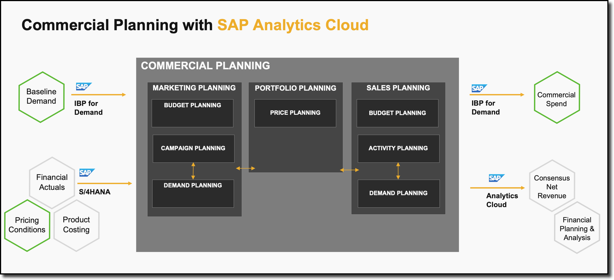

### Get OAuth Token URL for your SAP Analytics Cloud Tenant

[comment]: # (Step 1)

So, let's get started. Log on to your SAP Analytics Cloud tenant and navigate to
 System -> Administration -> App Integration.

In section **OAuth Clients**, take a note of the Token URL.
 It should be `https://<your-sac-tenant>/oauth/token`

> Take a note of the **Token URL** as you will need it later.

<!-- border; size:300px -->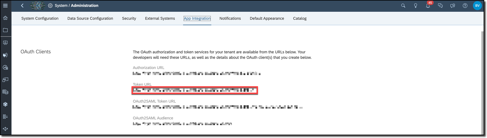

### Enable Import- and Export Service on SAP Analytics Cloud

[comment]: # (Step 2)

In this step you enable the Data Export and Import Service and create the OAuth client credentials to be able to connect against the services of SAP Analytics Cloud. In section **Configured Clients** click on the **+ Add a New OAuth Client** link.

- Provide a name for your client, e.g. **`SAC_Import`**
-  in dropdown **Purpose** select option **`Interactive Usage and API Access`**
-  in dropdown **Access** check option **`Data Export Service`** and **`Data Import Service`**

Finish the creation of the OAuth Client credentials by hitting the **Add** button at the bottom of the popup.

<!-- border; size:300px -->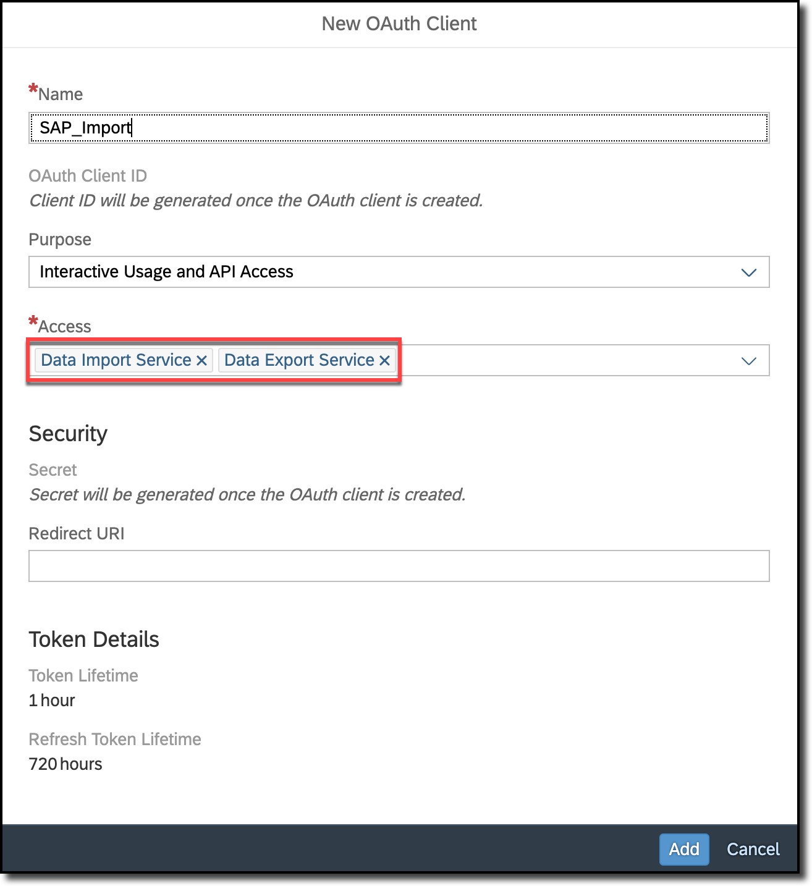

Once the client credentials have been created, take a note of the

- **OAuth Client ID**
- **the Secret** (click on **Show secret** to display it)

as you will need it in the next step.

<!-- border; size:300px -->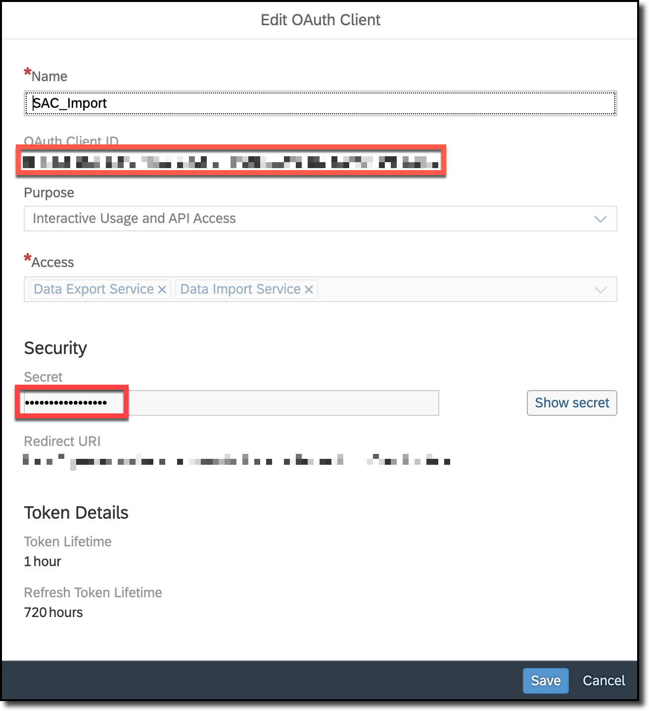

You can click on the button **Done** to close the popup and move over to the next step.

### Set up authentication SAP Cloud Integration for SAP Analytics Cloud

[comment]: # (Step 3)
For authentication from SAP Cloud Integration to SAP Analytics Cloud you will need to set up a *OAuth2 Client Credentials artifact* in SAP Cloud Integration.  
The artifact will then be used in the integration flow to authenticate against SAP Analytics Cloud.

Let's head over and logon to SAP Cloud Integration.

In SAP Cloud Integration click on the **Monitor Artifacts** symbol below the **Burger Menu** icon in the top left corner and access **Integrations**. Access the **Manage Security** tile.

<!-- border; size:300px -->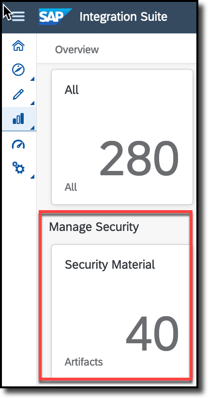

Click on button **Create** on top of the Security Material list and choose **OAuth2 Client Credentials**.

<!-- border; size:300px -->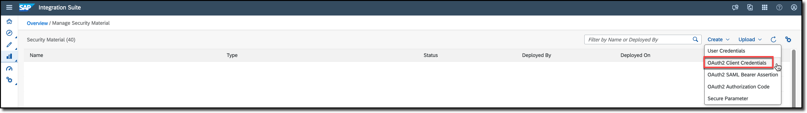

- Provide a **name** for this security material; default name referenced in the integration flow is **`SACoAUTH`**.
- Provide a description (optional).
- In field **Token Service URL** enter the Token Service URL from your SAC tenant.
- In field **Client** enter the *OAuth Client ID* that has been created in the previous step.
- In field **Client Secret** enter the *Secret* that has been created in the previous step.

Click on **Deploy** to save the user credential artifact.

<!-- border; size:300px -->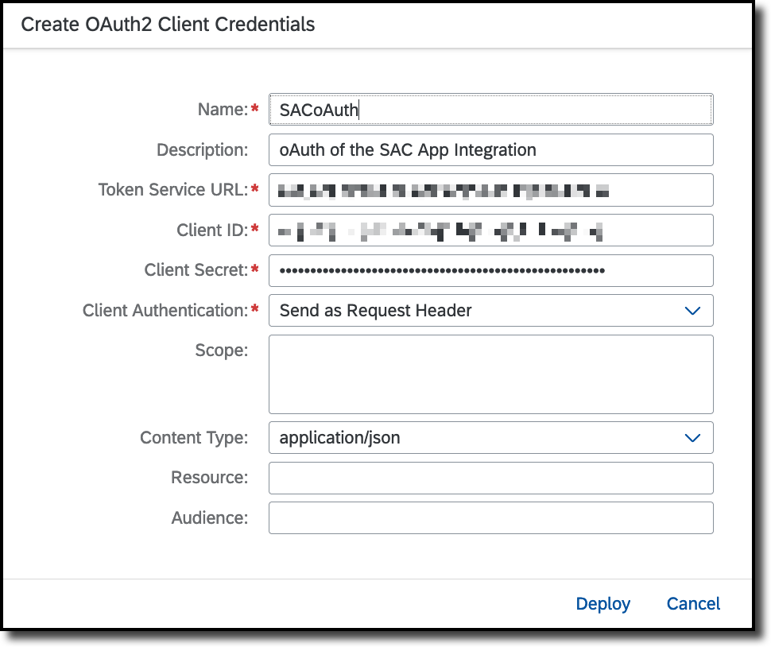

### Set up authentication in SAP Integrated Business Planning

[comment]: # (Step 4)
After the setup to connect SAP Analytics Cloud with SAP Cloud Integration is done, the next steps are about connecting SAP Integrated Business Planning with SAP Cloud Integration.
The artifacts that will be created in this step will later be used in the Integration Flow to authenticate against SAP Integrated Business Planning.

Let's head over and logon to SAP Integrated Business Planning.

You need a business user with the role like *`SAP_BR_DEMAND_PLANNER_IBP`*. This role is predefined by SAP and only intended for the initial setup of a system. Please create your own business roles based on the required business role template for production use.

Remember the **Business User ID** as you will need it in the next step.

<!-- border; size:300px -->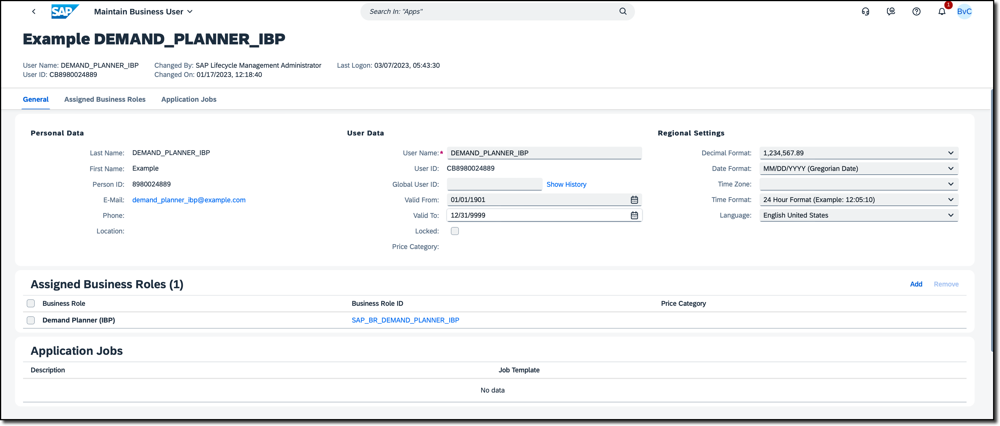

Open the App *Maintain Communication User* to create a Communication User. Please note down the **Communication User ID** and **Password**, they will be needed in the next step to access SAP Integrated Business Planning from SAP Cloud Integration. This tutorial creates Basic Access Authentication  credentials for SAP Integrated Business Planning. You could also choose a different authentication method.

<!-- border; size:300px -->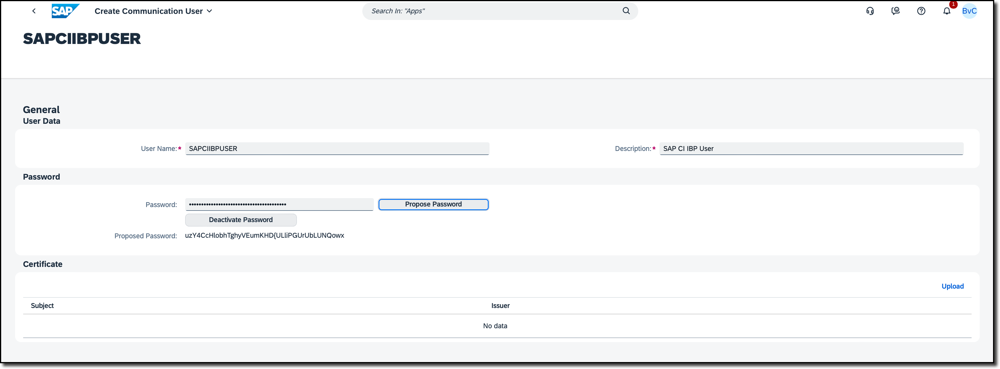

Assign this **Communication User** to the **Communication System** in the *Communication System* App.

<!-- border; size:300px -->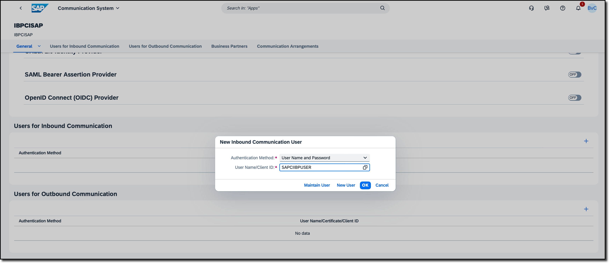

Change to the *Communication Arrangements* App and create a **Communication Arrangement** of scenario *`SAP_COM_0720`* with the Communication System and Communication User just created.

<!-- border; size:300px -->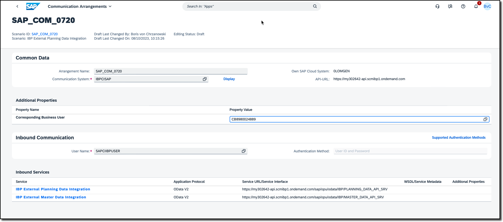

After this configuration you have the user and password of the Communication User for accessing SAP Cloud Integration via API. This credential needs to be stored as security material in SAP Cloud Integration. Storing the credential will be part of the next step.

### Set up authentication in SAP Cloud Integration for SAP Integrated Business Planning

[comment]: # (Step 5)

For authentication from SAP Cloud Integration to SAP Integrated Business Planning you will need to set up a *user credential artifact* in SAP Cloud Integration.  
The artifact will then be used in the Integration Flow to authenticate against SAP Integrated Business Planning.
The credential of the SAP Integrated Business Planning Communication User has been created in the last step and need to be stored in SAP Cloud Integration now.

Let's head over and logon to SAP Cloud Integration.

In SAP Cloud Integration click on the **Monitor Artifacts** symbol below the **Burger Menu** icon in the top left corner and access **Integrations**. Access the **Manage Security** tile.

<!-- border; size:300px -->

Click on button **Create** on top of the Security Material list and choose **User Credentials**.

<!-- border; size:300px -->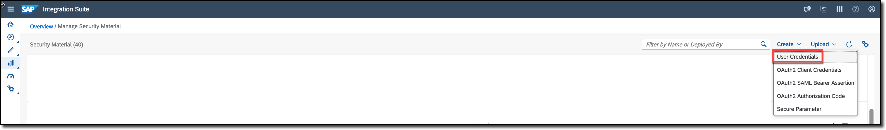

- Provide a **name** for this security material. Remember this name as you will need it in the Integration Flow configuration (Step 10).
- Provide a description (optional).
- Leave the **Type** as **`User Credentials`**
- In field **User** enter the *Communication User ID* that has been created in the previous step.
- In field **Password**/ **Repeat Password** enter the *Password* that has been created in the previous step.

<!-- border; size:300px -->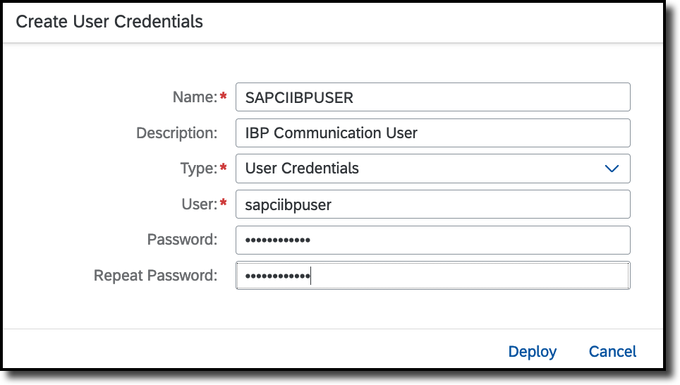

- Click on **Deploy** to save the user credential artifact.

You can now see the created item in your list of security materials. Please note down the Security Material Name, as it will be needed to customize the Integration Flows.

### Set up authentication in SAP S/4HANA

[comment]: # (Step 6)
In an earlier step, a Communication User for SAP Integrated Business Planning has been created. With this user you can use the SAP Integrated Business Planning APIs.

A similar Communication User has to be created for SAP S/4HANA. The Integration Flows for Commercial Planning are using S/4HANA APIs to read master data from the APIs *`API_SALESORGANIZATION_SRV`* and *`API_SLSPRICINGCONDITIONTYPE_SRV`*.

Open the App *Maintain Communication User* to create a Communication User. This example uses Basic Authorization. Please note down the **Communication User** and **Password**, they will be needed in the next step.

<!-- border; size:300px -->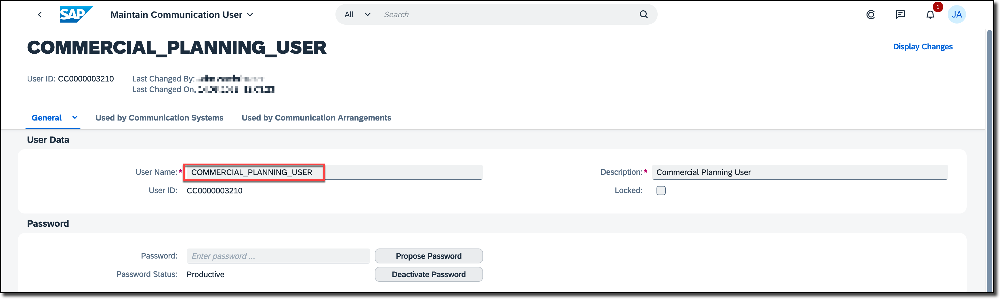

Create a **Communication System** in the *Communication System* App. Assign the **Communication User** that was just created to this **Communication System**.

<!-- border; size:300px -->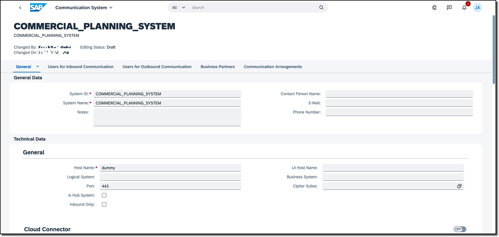

<!-- border; size:300px -->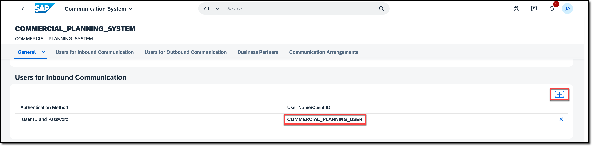

Change to the *Communication Arrangements* App and create two **Communication Arrangements**. One of scenario type *`SAP_COM_0087`* for the master data and of type *`SAP_COM_0294`* for the price service. 

<!-- border; size:300px -->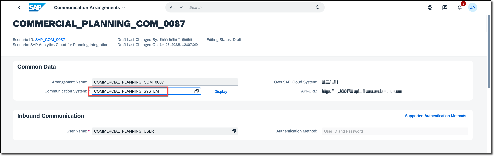

<!-- border; size:300px -->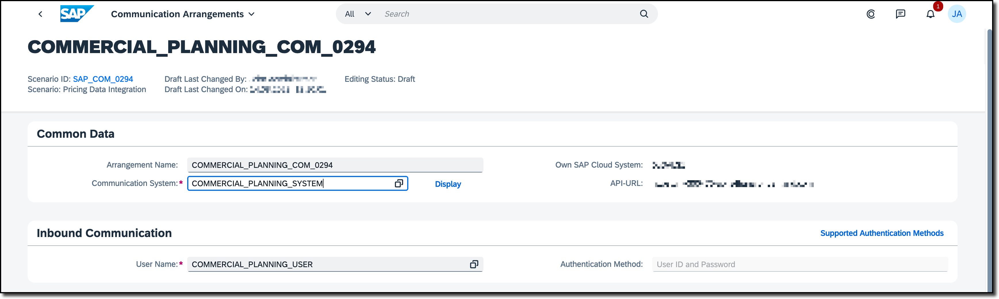

After this configuration you have the user and password of the Communication User for accessing SAP S/4HANA APIs. This credential needs to be stored as security material in SAP Cloud Integration. Storing the credential will be part of the next step.

### Set up authentication in SAP Cloud Integration for SAP S/4HANA

[comment]: # (Step 7)

For authentication from SAP Cloud Integration to SAP S/4HANA you will need to setup a *user credential artifact* in SAP Cloud Integration.  
The artifact will then be used in the Integration Flow to authenticate against SAP S/4HANA.
The credential of the SAP S/4HANA Communication User has been created in the last step and need to be stored in SAP Cloud Integration now.

The steps are identical to how to configure Secure Material for SAP Integration Business Planning in step 5.

In SAP Cloud Integration click on the **Monitor Artifacts** symbol below the **Burger Menu** icon in the top left corner and access **Integrations**. Access the **Manage Security** tile.

<!-- border; size:300px -->

Click on button **Create** on top of the Security Material list and choose **User Credentials**.

<!-- border; size:300px -->

- Provide a **name** for this security material. Note down this name as it will be used in Step 10.
- Provide a description (optional).
- Leave the **Type** as **`User Credentials`**
- In field **User** enter the *Communication User ID* that has been created in the previous step.
- In field **Password**/ **Repeat Password** enter the *Password* that has been created in the previous step.

<!-- border; size:300px -->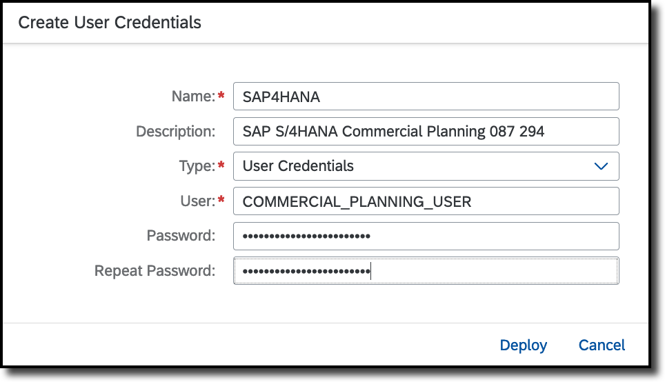

- Click on **Deploy** to save the user credential artifact.

You can now see the created item in your list of security materials. Please note down the Security Material Name, as it will be needed to customize the Integration Flows.

### Set up SAP Cloud Integration runtime

[comment]: # (Step 8)

In the last steps, credentials in SAP Cloud Analytics and SAP Integrated Business Planning have been created. Both credentials have been stored as Security Materials in SAP Cloud Integration. This step is about how to access the Integration Flows in SAP Cloud Integration via API. Up until now you could start the Integration Flows from SAP Cloud Integration directly when changing the starter to a timer. But in the target architecture the Integration Flows should be started from SAP Analytics Cloud via API. For this approach credentials are required which will be created in this step.

You need to create a Service Instance and a Service Key for Inbound Authentication in your Process Integration Runtime of your BTP account. This step describes how to setup a Process Integration Runtime to create the Service Key. 

The following steps are required prerequisites for this step, but outside the scope of this tutorial:
- set up BTP in general
- set up the Integration Suite with its capabilities in particular

Login to your BTP account and navigate to the Service Marketplace of your sub account.

Click **Create** on the Process Integration Runtime tile.

<!-- border; size:300px -->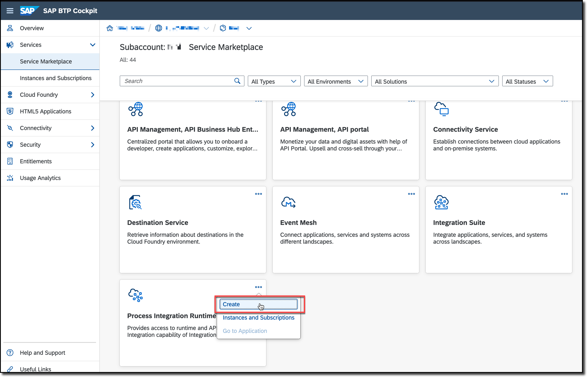

In the pop-up choose **`integration-flow`** in the combo box for **Plan** and populate the other fields depending on your BTP setup. Once complete, click "Next" at the bottom of the pop-up to continue.

<!-- border; size:300px -->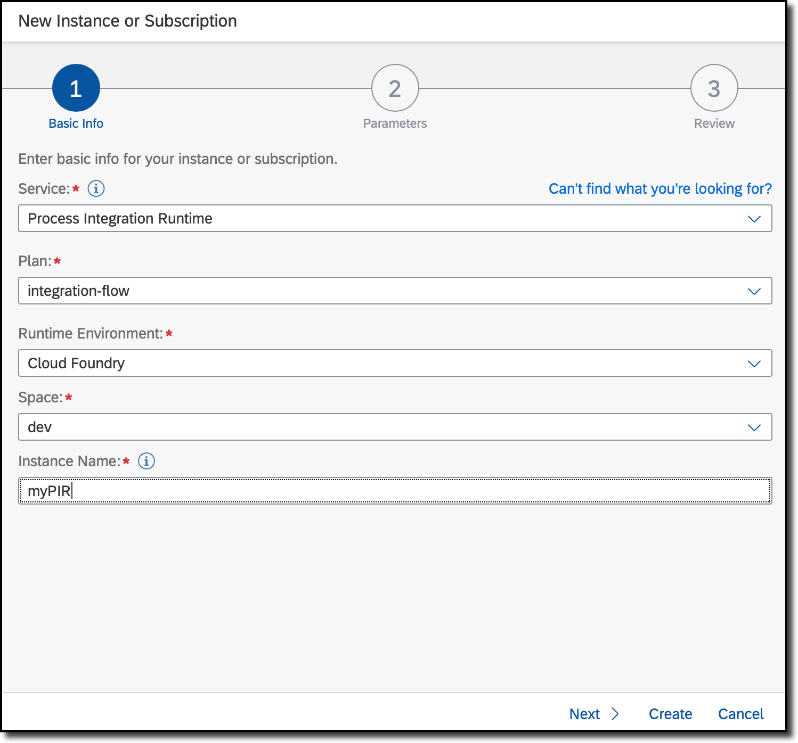

You can keep the standard role **`ESBMessaging.send`** or enter a custom role.

<!-- border; size:300px -->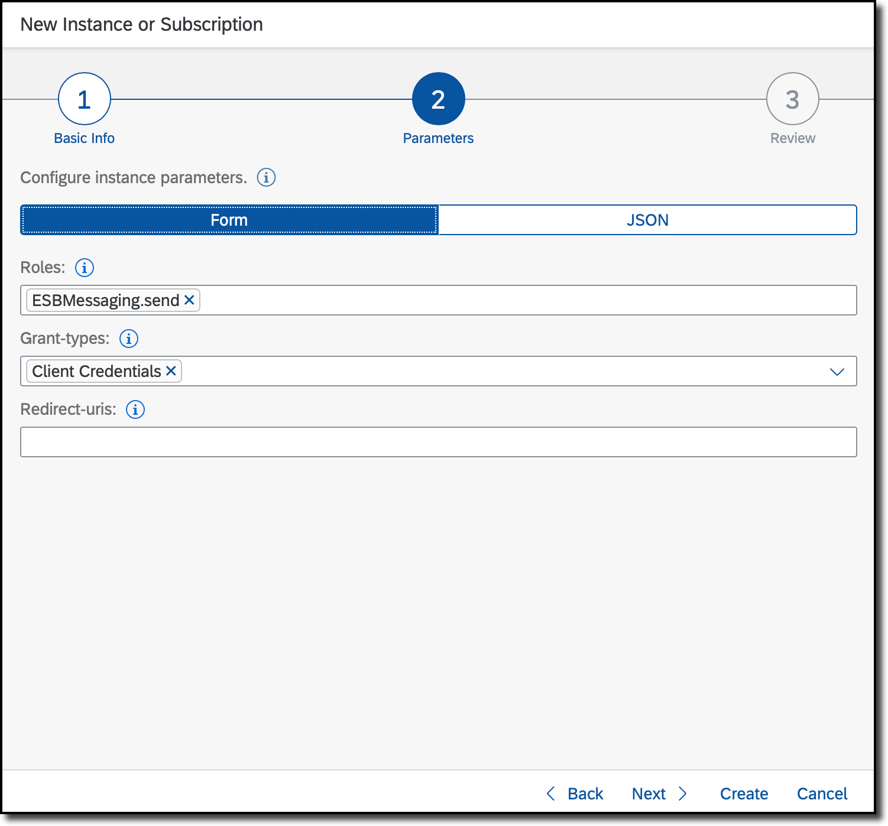

Review the settings click **Create** and wait until the Service Instance is created.

Based on the Process Integration Runtime Service instance we will create the OAuth Service Key. In your Service Marketplace click again on the Process Integration Runtime tile, but choose **Instance and Subscriptions** instead of **Create**.

<!-- border; size:300px -->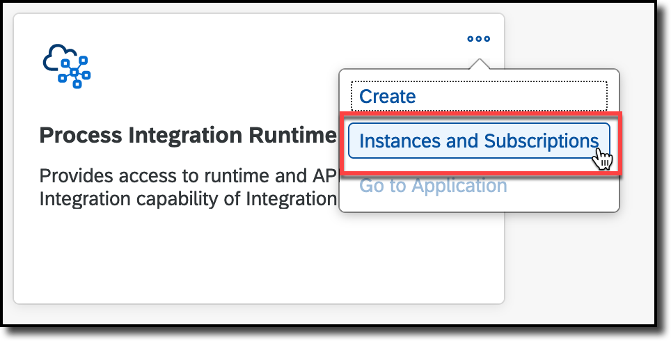

Click on **`Create Service Key`** for your instance.

<!-- border; size:300px -->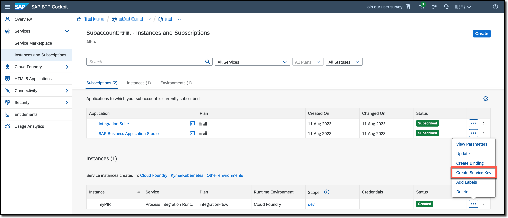

Give your key a name and choose **`Clientid/Secret`** for the Key Type. Click **Create** to close the dialog and start the key generation.

<!-- border; size:300px -->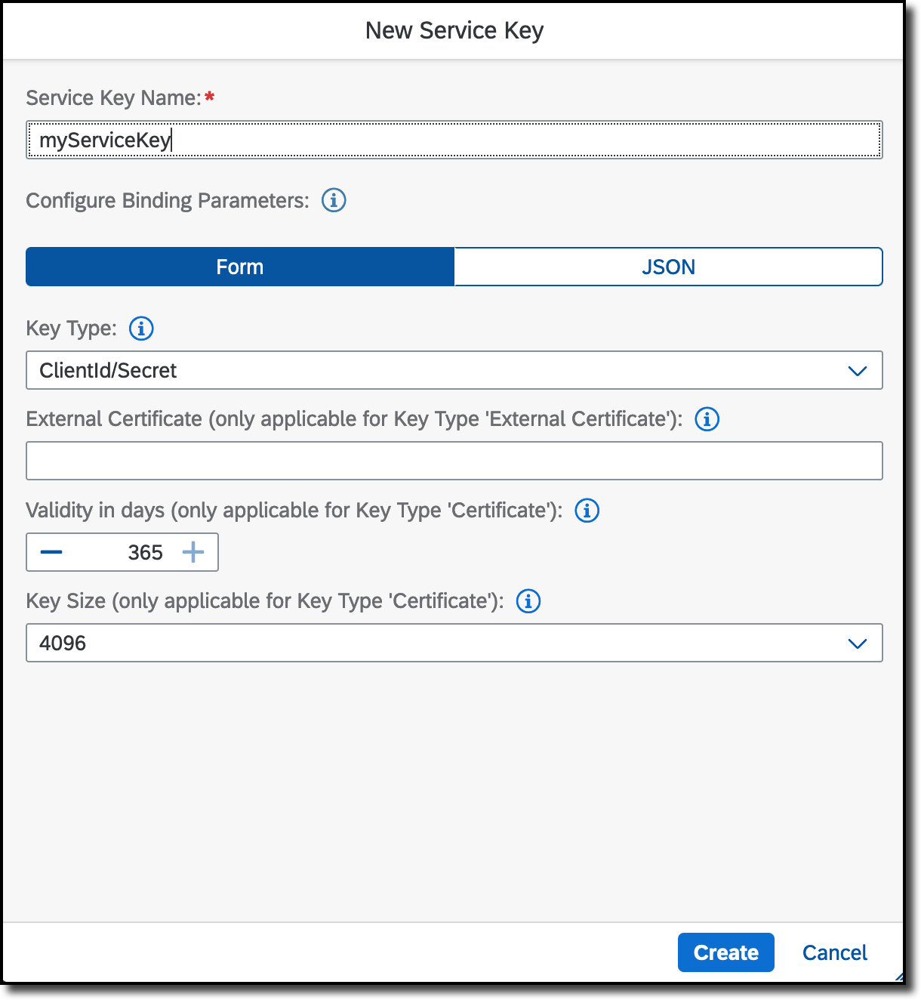

You can access the Service Key by navigating to your sub account into the instance section. Here you should find the Service Instance with your generated Service Key.

<!-- border; size:300px -->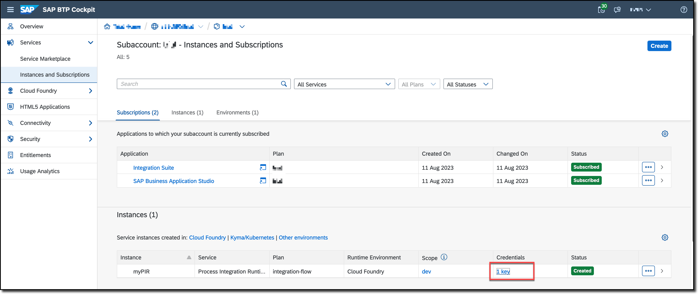

You need to note down the *`clientid`*, *`clientsecret`* and *`tokenurl`*.
This information will be needed later in an SAP Analytic Cloud connection so that the Integration Flows can be triggered via API from SAP Analytics Cloud.

<!-- border; size:300px -->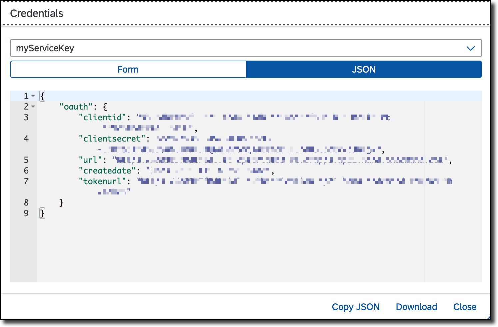

### Upload the Commercial Planning Integration Flows into SAP Cloud Integration

[comment]: # (Step 9)

After all authorizations have been set up it is time to enable the Cloud Integration Flows now.

Access the Integration Suite and go into the **Discover - Integrations** section. Search for the package name *`Integration between SAP Integrated Business Planning for demand and SAP Analytics Cloud`* by typing in the whole name or parts of the name or description like **IBP**.

<!-- border; size:300px -->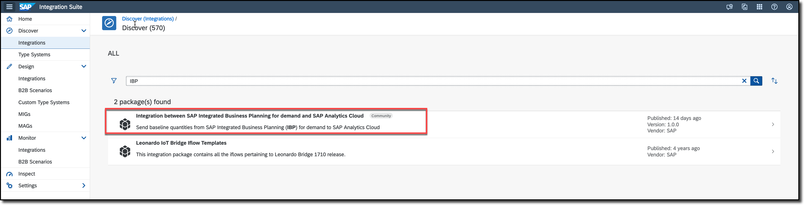

Do a left click on the package to access it. Within the package click **Copy** to copy the package into your tenant.

<!-- border; size:300px -->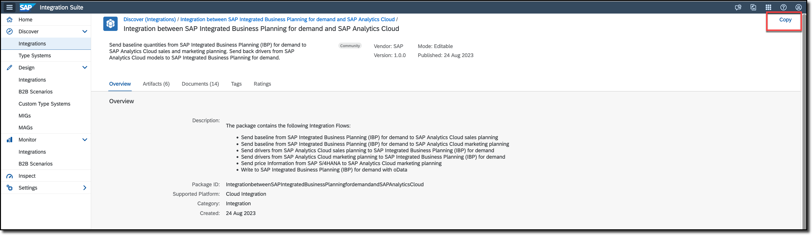

After the copy has been executed successfully the package will be available in the **Design - Integrations** section on your tenant. 

<!-- border; size:300px -->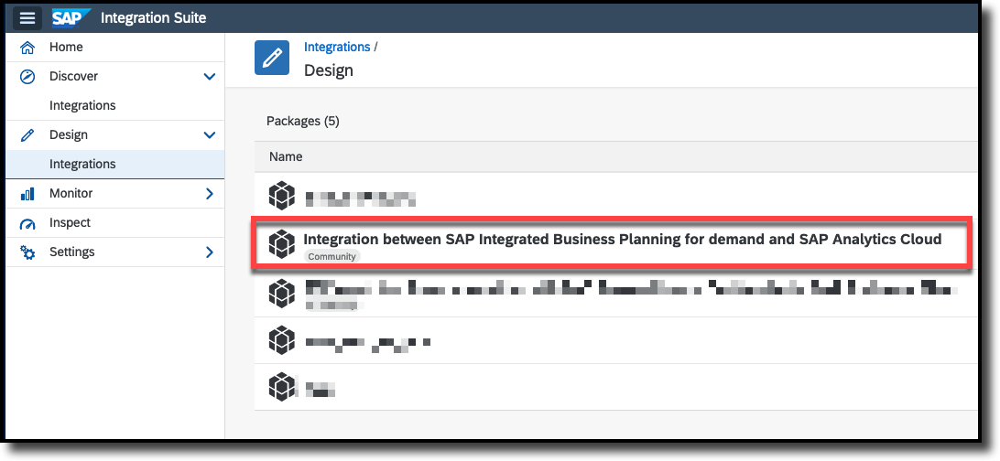

In the next step the newly created package will be configured.

### Configure SAP Cloud Integration Commercial Planning Integration Flows

[comment]: # (Step 10)

In the previous steps we have configured credentials for SAP Integrated Business Planning, SAP Analytics Cloud and SAP S/4HANA. All of them have been stored in SAP Cloud Integration as Secure Materials. These Secure Materials will be used in the Integration Flow configuration to enable the Integration Flow to read and write data into SAP Integrated Business Planning, SAP Analytics Cloud and SAP S/4HANA.

You need to configure all Integration Flows except *Write to SAP IBP for Demand using OData*. This step configures the Integration Flow 
**Send IBP for Demand baseline to SAP Analytics Cloud Marketing model** as an example. The other flows are configured in the same way.

<!-- border; size:300px -->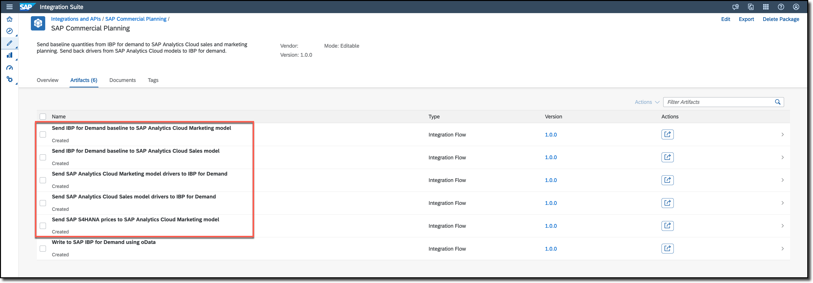

Access the Integration Flow and press **Configure**

<!-- border; size:300px -->

The next step is about configuring the API endpoint. The API endpoint, a URL, will be used to call the Integration Flow from SAP Analytics Cloud. The URL consists of two parts. The first part with the host of your Cloud Instance tenant and the path to all Cloud Integration Flows cannot be configured. But the last part that identifies this Integration Flow can be configured. In the popup go to the **Sender** tab. In the **Address** field enter a name. This name specifies the Integration Flow in the URL.

If you would to name the API endpoint for the Integration Flow that writes IBP baselines into the SAP Cloud Analytics Marketing model like *`https://my-cloud-instance.com/http/xpa_mkt_write2sac`*
 than you would need to configure *`/xpa_mkt_write2sac`* in the *`Address`* input box (including the slash /).  

<!-- border; size:300px -->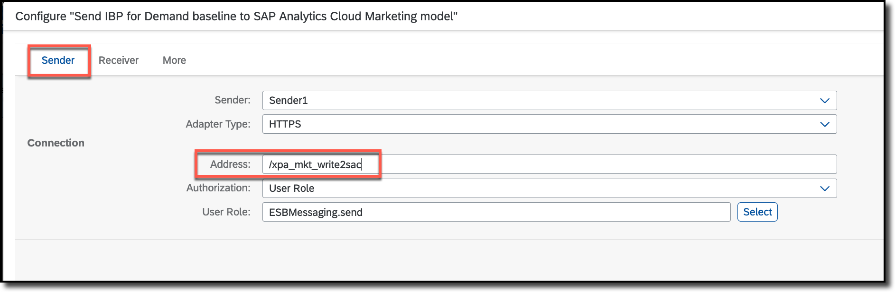

In the **Receiver** tab you need to configure the SAP Analytics Cloud tenant URL as *`<SAPHDA_SAC_URL>`* and the Security Material name with the credentials of your SAP Analytics Cloud instance in *`Credential Name`*. Following the example of step 3 it would be *`SACoAUTH`*.

<!-- border; size:300px -->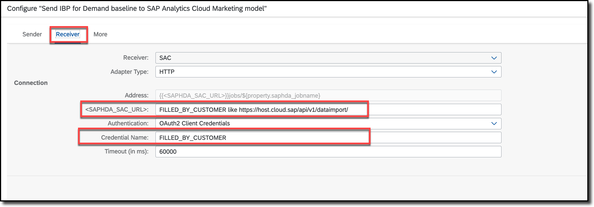

The same configuration of Security Material name and URL needs to be done for SAP Integrated Business Planning and SAP S/4HANA by choosing the systems from the combo box. This needs to be done per Integration Flow that you would like to use. 

<!-- border; size:300px -->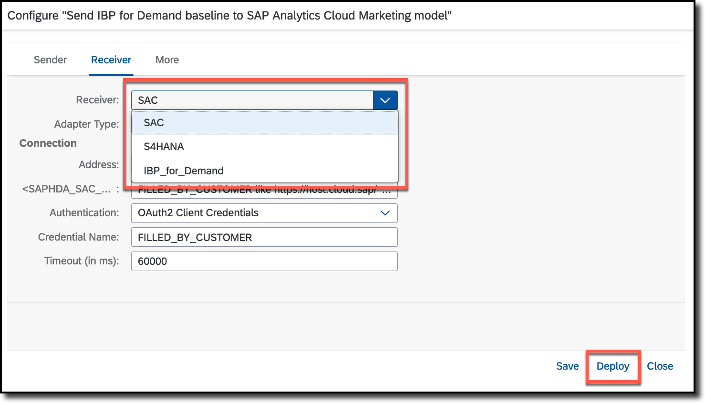

Close the popup and ensure that you deploy the Integration Flow after all the settings are done by leaving the popup with the **deploy** button or by pressing the **deploy** button in the upper right corner of the Integration Flow designer.

<!-- border; size:300px -->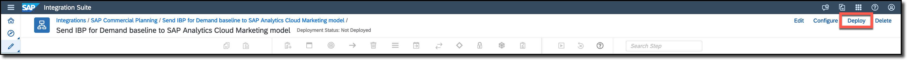

### Conclusion

[comment]: # (Step 11)

Congratulations! With this tutorial you have now enabled the Integration Flows to access SAP Analytics Cloud, SAP Integrated Business Planning and SAP S/4HANA. You have also created and enabled credentials to access the Integration Flows via API. So you can now maintain SAP Analytics Cloud Multi Actions to trigger these Integration Flows. This will be part of the tutorial [xP&A Commercial Planning - How to manage data loads](xpa-sac-cx-manage-data-loads).

---
