## You will learn

- how to set up connectivity to cloud integration flows for loading data between SAP Integrated Business Planning for Demand, SAP S/4HANA and SAP CX Commercial Planning content in SAP Analytics Cloud.
- how to use parameters and initialize cloud integration flows via SAP Analytics Cloud multi actions

## Prerequisites

- Have an SAP Analytics Cloud tenant available with Planning enabled and a user with admin rights for it
- Import the **xP&A Commercial Planning** content package as described in [xP&A Commercial Planning - Get to know the Marketing Planning module](xpa-sac-cxmp-marketingplanning-gettoknow)
- Have an SAP Integration Suite instance
- Copied the integration package [SAP Commercial Planning](https://api.sap.com/package/IntegrationbetweenSAPIntegratedBusinessPlanningfordemandandSAPAnalyticsCloud/integrationflow) into your SAP Integration Suite instance and configured Process Integration Runtime.
- Completed configuration of authentication and connectivity for Commercial Planning integration flows as described in [xP&A Commercial Planning - Data Integration](xpa-sac-cx-data-integration-setup)

## Intro

In the previous tutorial [xP&A Commercial Planning - How to set up system connections](xpa-sac-cx-data-integration-setup) you have set up the initial connectivity between SAP Integrated Business Planning for Demand, SAP Cloud Integration Suite and SAP Analytics Cloud and created a Process Integration Runtime. In this tutorial you will learn how to leverage these connections to manage the data loads between those respective applications.

Each of the integration flows offered in the package [SAP Commercial Planning](https://api.sap.com/package/IntegrationbetweenSAPIntegratedBusinessPlanningfordemandandSAPAnalyticsCloud/integrationflow) is related to either the sales planning or marketing planning data model and is used for transfer of data labeled in the honeycombs highlighted in green in the picture below. 

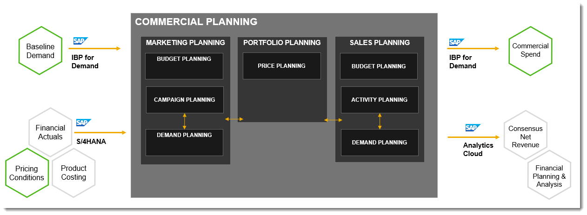

Let's have a look at the steps ahead

- Create an `API` connection in SAP Analytics Cloud to be used by the multi actions
- Customize multi actions with `API` endpoints and parameters
- Initialize the integration flow data loads via multi actions

So let us get started.

### Getting Open Authorization credentials from SAP Process Integration Runtime

To be able to initialize integration flows from SAP Analytics Cloud you will need to set up a connection of type `HTTP API`. This connection will need to use the service key credentials from your SAP Process Integration Runtime, so let's go there.

Start your browser and go to your **SAP BTP Cockpit**. Open the **Services** section and click on **Instances and Subscriptions**

To quickly locate your process integration runtime service you can use the drop downs on top:

In the service drop down, filter for **Process Integration Runtime**. In the plans drop down, filter for **integration-flow**.

>Hint: This should be the same one you had used to set up the flows during the tutorial [xP&A Commercial Planning - How to set up system connections](xpa-sac-cx-data-integration-setup)

<!-- border; size:540px -->

Once you have located the correct one in the list of instances click on the **Key** link in the **Credentials** column. You will get pop up displaying the credential details for `OAuth` authentication.

<!-- border; size:540px -->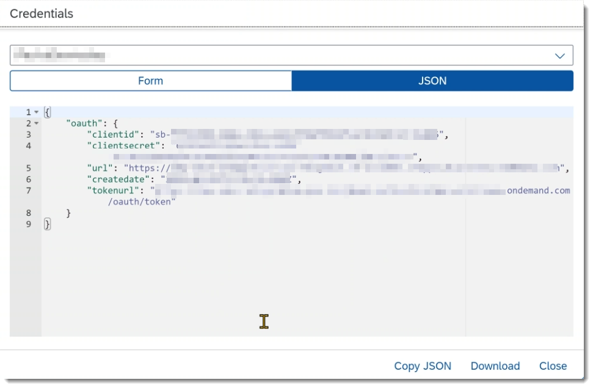

Take a note of:

- `clientid`
- `clientsecret`
- `url`
- `tokenurl`

Now that you have retrieved the credentials head over to the next step to retrieve the `API` end point for your connection

### Get Integration Flow API Endpoints (optional)

In case you have not worked through the previous tutorial [xP&A Commercial Planning - How to set up system connections](xpa-sac-cx-data-integration-setup) for defining the endpoints for each integration flow in step 10, this step will show you an easy way to get the defined endpoints for each flow. 

Head over to your Integration Suite instance. In section **Monitor** click on **Integrations**.

<!-- border; size:300px -->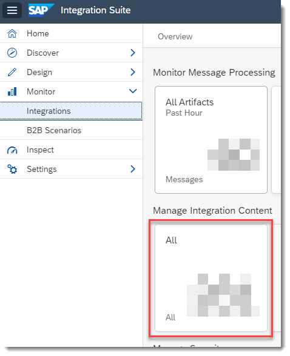

In the search field enter `market` which should give you any of the integration flows being part of the SAP Commercial Planning package. Click on one of the search results.

<!-- border; size:540px -->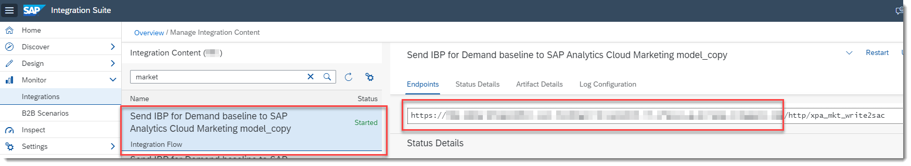

On the right hand-side under tab **Endpoints**, you can find the Endpoint for the particular flow. 

Note down the whole `URL`. You will need the part in the beginning of the `URL` (anything before `/http/<name of flow endpoint>`) for the general connection set up.

When calling the individual endpoints of each flow afterwards by multi action, you will need the base `URL` plus individual flow suffix.

Now that we have the credentials, the `URL` and the endpoint(s),  let us create the `HTTP API` connection in SAP Analytics Cloud.

### Create HTTP API Connection in SAP

In SAP Analytics Cloud click on menu entry **Connection**.

<!-- border; size:300px -->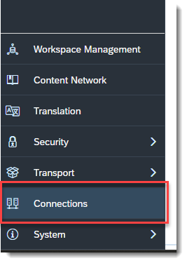

and then on the **+** icon to add the new connection

<!-- border; size:540px -->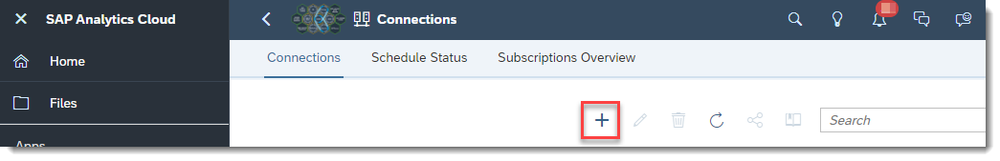

Please choose the connection type **HTTP `API`**.

<!-- border; size:300px -->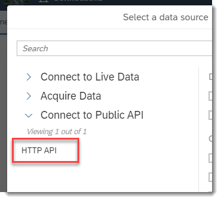

You will get a pop up to enter the connection details

Provide the following details

|Field|Name|
|:-----|:-----|
|Connection Name| technical name of the connection|
|`Description`| description for the connection|
|`Data Service URL`| The `URL` as retrieved in step 1|
|`Authentication Type`| set to `OAuth 2.0 Client Credentials`|
|`OAuth Client ID`| `clientid` as retrieved in step 1|
|`Secret`| `clientsecret` as retrieved in step 1|
|`Token URL`|`tokenurl` as retrieved in step 1|

Once you have entered all details click on the **Create** button to have your connection created.

<!-- border; size:300px -->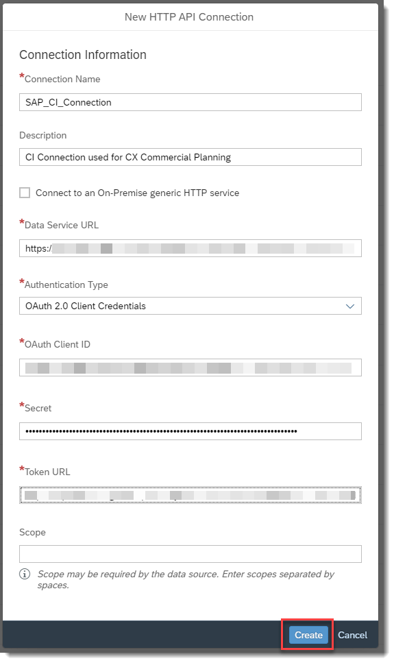

### Customize Multi Actions

Let's have a look at the Multi Actions now.

You can find the list of the multi actions delivered with the content package and their integration flows for transferring data in the table below. You can find more information on the individual cloud integration flows in their package documentation on [SAP Business Accelerator Hub](https://api.sap.com/package/IntegrationbetweenSAPIntegratedBusinessPlanningfordemandandSAPAnalyticsCloud/documents).

|Multi Action|Integration Flow|Source|Target|
|:-----|:-----|:-----|:-----|
|`SAP_MKT_IM_MarketingPlanning_LoadPrices`| Send SAP S/4HANA prices to SAP Analytics Cloud Marketing model|SAP S/4HANA| SAP Analytics Cloud|
|`SAP_MKT_IM_MarketingPlanning_LoadBaselineQuantities`|Send IBP for Demand baseline to SAP Analytics Cloud Marketing model|SAP IBP for Demand| SAP Analytics Cloud|
|`SAP_MKT_IM_MarketingPlanning_SendMarketingExpenses`|Send SAP Analytics Cloud Marketing model drivers to IBP for Demand|SAP Analytics Cloud|SAP IBP for Demand|
|`SAP_SD_IM_InboundBaselineQuantitiesFromIBP`|Send IBP for Demand baseline to SAP Analytics Cloud Sales model|SAP IBP for Demand| SAP Analytics Cloud|
|`SAP_SD_IM_OutboundSpendToIBP`|Send SAP Analytics Cloud Sales model drivers to IBP for Demand|SAP Analytics Cloud|SAP IBP for Demand|

The set up of the multi actions for all flows follows a similar scheme.

The following points need to be configured in all of the multi actions

- the connection to be used
- the `URL` to be called for the respective `API` end point
- parameters and their values to be passed in the body

Let's use the multi action `SAP_MKT_IM_MarketingPlanning_LoadBaselineQuantities` as an example.

>Please repeat these steps for all multi actions that you require.

In the Files menu search for multi action `SAP_MKT_IM_MarketingPlanning_LoadBaselineQuantities` and open it

<!-- border; size:540px -->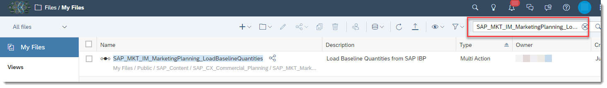

In the multi action screen, click on the `API` step in the middle of the screen. On the Step Details panel on the right-hand side you will need to finalize the details for the step.

In field **HTTP `API` Connection** pick the connection you have set up in the previous step.

In the field `API URL` you need to enter the `API` endpoint of your integration flow.

This is:

- The `URL` as determined in step 1
- `/http`
- the end point (e.g. `/xpa_mkt_write2sac` ) you have configured in the previous tutorial [xP&A Commercial Planning - Data Integration](xpa-sac-cx-data-integration-setup) in step 10 (or as retrieved in step 2 of this tutorial).

Example: `https://<host of your process integration runtime>/http/<your configured end point>`

<!-- border; size:300px -->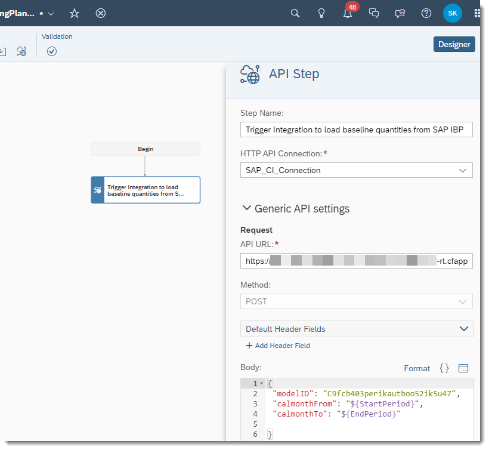

In the **Body** input field you need to specify three parameters and their values for the integration flow:

|Parameter|Description|
|:-----|:-----|
|`modelID`|technical SAC model id as data target for the integration flow; or in case of the model being the source of the integration flow the model to read data from|
|`calmonthFrom`|start date from which baseline quantities will be transferred |
|`calmonthTo`|end date up to which baseline quantities will be transferred |

If you are working with the models as delivered by default, the parameter `modelID` is pointing to the correct model id already. In case you have created a copy of the model, make sure to insert the correct model id. The correct id can be found in the `URL` when opening your model from the File menu.

<!-- border; size:540px -->

Parameters for `calmonthFrom` and `calmonthTo` are filled by parameters `${StartPeriod}` and `${EndPeriod}` respectively which will prompt you to enter a value when running the multi action.

In the **Response** section, leave the option as displayed in the screen shot below.

In section **Request -> Method**, leave the setting at **Synchronous Return**.

<!-- border; size:300px -->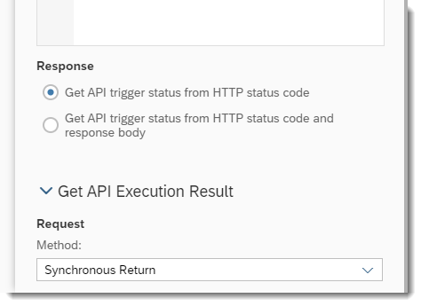

Great, now that you have customized the multi actions, head over to the next step to see them in action

### Run Multi Actions

Now you are ready to get your multi actions started.

Based on the different planning scenarios in the Commercial Planning package, the multi actions are linked in different stories. Hence, please find the story you need to open for each multi action in the table below:

|Multi Action|Story|
|:-----|:-----|
|`SAP_MKT_IM_MarketingPlanning_LoadPrices`|`SAP_MKT_PortfolioPlanning_AdminPage`|
|`SAP_MKT_IM_MarketingPlanning_LoadBaselineQuantities`|`SAP_MKT_Marketing_AdminPage`|
|`SAP_MKT_IM_MarketingPlanning_SendMarketingExpenses`|`SAP_MKT_Marketing_AdminPage`|
|`SAP_SD_IM_InboundBaselineQuantitiesFromIBP`|`SAP_SD_SalesPlanning_AdminPage`|
|`SAP_SD_IM_OutboundSpendToIBP`|`SAP_SD_SalesPlanning_AdminPage`|

To continue with our example, search for story `SAP_MKT_Marketing_AdminPage`
in the File menu and open it.

<!-- border; size:540px -->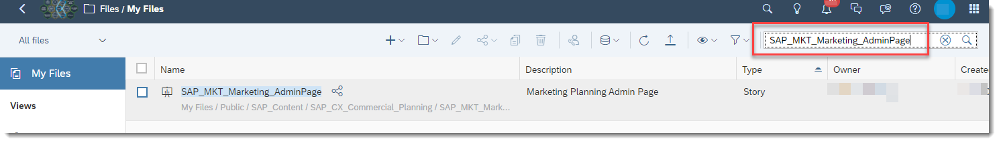

Click on the **Load Baseline Quantities** multi action trigger to start the multi action.

<!-- border; size:300px -->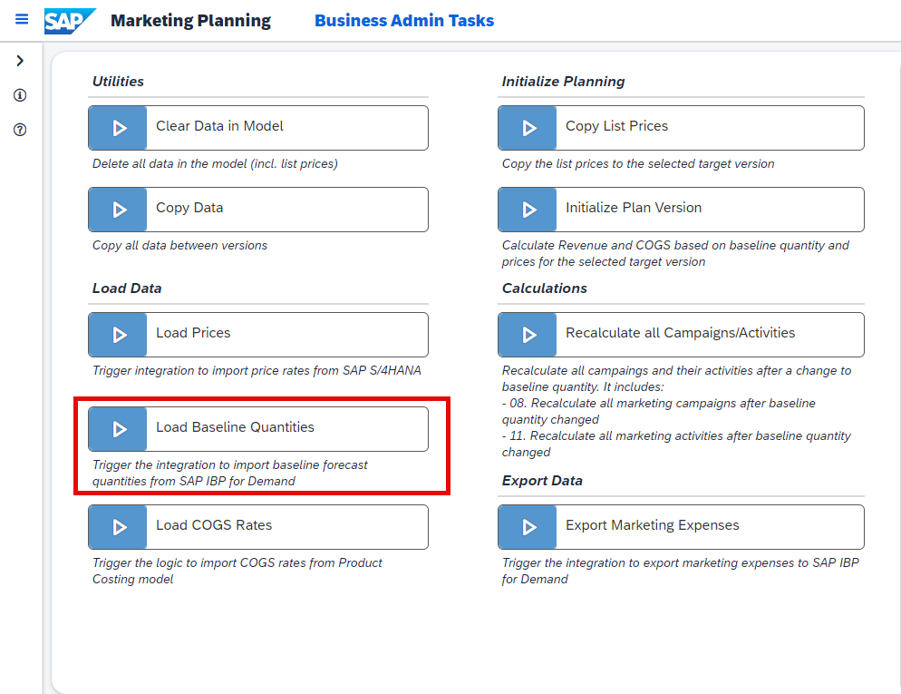

You will get a pop up to set the parameters for start and end period as seen before in the previous steps. Enter values for start and end period and click on **Run**

<!-- border; size:300px -->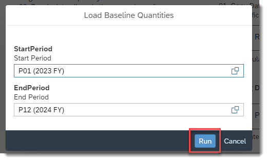

Now your multi action will call the cloud integration flow to pick up baseline quantity data from SAP Integrated Business Planning for Demand and push it into your SAP Analytics Cloud planning model.

<!-- border; size:300px -->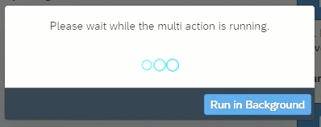

Once the job has finished, you will get a notification.

<!-- border; size:540px -->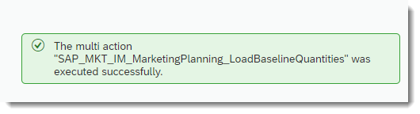

> Please repeat steps 4 and 5 of this tutorial to get all of your multi actions ready.

### Final Remarks

Congratulations! You have now learned how to set up and initialize your integration jobs from within SAP Analytics Cloud. Visit our community page [Extended Planning & Analysis Business Content](https://community.sap.com/topics/cloud-analytics/planning/content?source=social-Global-SAP+Analytics-YOUTUBE-SalesCampaign-Analytics-Analytics-spr-5330779922).
