## Prerequisites
- You have an SAP Analytics Cloud tenant. If this is not the case, get started by requesting a free [SAP Analytics Cloud trial](https://www.sap.com/products/technology-platform/cloud-analytics/trial.html) tenant.
- You have installed the **SAP CX Commercial Planning content** in an SAP Analytics Cloud tenant. Reference: [Business Content Installation Guide](https://help.sap.com/docs/SAP_ANALYTICS_CLOUD/00f68c2e08b941f081002fd3691d86a7/078868f57f3346a98c3233207bd211c7.html), [Content Package User Guide](https://help.sap.com/docs/SAP_ANALYTICS_CLOUD/42093f14b43c485fbe3adbbe81eff6c8/b0046d8673b5412cbef7f521cfdfed95.html)
- You have finished both introduction tutorials [xP&A Commercial Planning - Get to know the Portfolio Planning module](xpa-sac-cxpp-portfolioplanning-gettoknow) and [xP&A Commercial Planning - Get to know the Marketing Planning module](xpa-sac-cxmp-marketingplanning-gettoknow)
- You have finished the tutorial [xP&A Commercial Planning - Introduction to the Data Model](xpa-sac-cxmp-datamodelfundamentals) and understand the data model of the Commercial Planning Content package
- You have a basic familiarity with programming and understand concepts such as script variables 

## You will learn
- how stories are built from a technical perspective. This includes...
- ...understanding the structure of stories
- ...understanding the naming convention of the objects and widgets
- ...learning about the usage of script variables 
- ...learning about the script objects 

## Intro
Now that you have successfully gone through the introduction tutorials and know how to use the content package like an expert, you may want to start customizing it and adjusting it according to your own business needs.

Before you do that though, it is highly recommended to go through this tutorial in order to understand how the stories are structured and how the objects are used in the standard content. 

In case you have any questions or require further support, please use the [SAP Question Form](https://community.sap.com/t5/forums/postpage/choose-node/true/product-id/bcbf0782-ce74-43b8-b695-dafd7c1ff1c1/board-id/technology-questions).

If you have a specific request to our team in regards to the business content, you may also submit a request using the [SAP Influence Platform](https://influence.sap.com/sap/ino/#/idea-create?campaign=884&title=Extended%20Planning%20and%20Analysis%3A%20content&tags=Extended%20Planning%20and%20Analysis&RespList=cust.ino.config.SAP_ANALYTICS_CLOUD_SAP_DIGITAL_BOARDROOM.BIZ_CONTENT).

If you are interested in more xP&A topics, related business content packages, or videos showing the content in action, feel free to check out our community page [Extended Planning & Analysis Business Content](https://community.sap.com/topics/cloud-analytics/planning/content).

### Structure of UI elements
In this step you will learn about the structure of UI elements in each story. 

[OPTION BEGIN [Planning, Reporting and Admin Pages]]
Depending on which story you are looking at, the high level structure of the UI elements may differ, but the core concept remains the same. In the following example we will take a look at the **List Price Planning** story to understand how reporting and planning stories are structured from a technical perspective.

Each page consists of multiple bigger groups or respectively **Panels** to put it in technical SAC terms. 
  
<!-- border; size:540px -->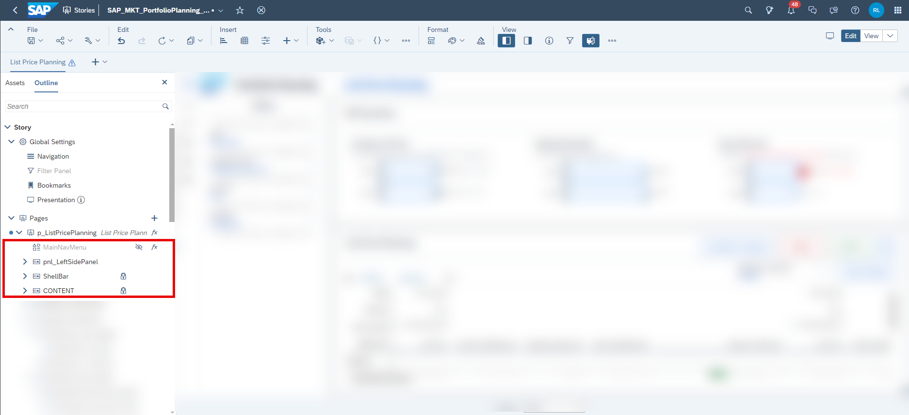

These panels are used to structure the different sections of the story into different components in order to make the story more modular. 
  
The **CONTENT** section is the section where the main part of the content is located. Based on what you have learned in the introduction tutorials, that could cover the header section with the high level graphs, but also the main area where the planning tables reside, for instance.
  
<!-- border; size:540px -->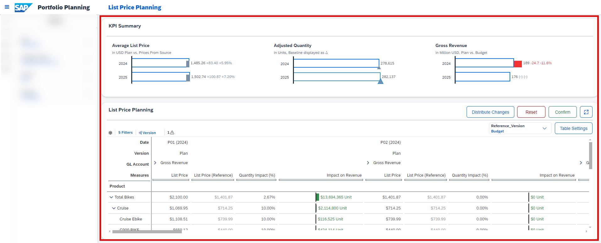

The `ShellBar` section is where the shell bar on the top is configured. All of the stories apart from the Overview Pages contain a bespoke shell bar built specifically for this content package, which consistently provides the exact same functionality across all stories. 
  
<!-- border; size:540px -->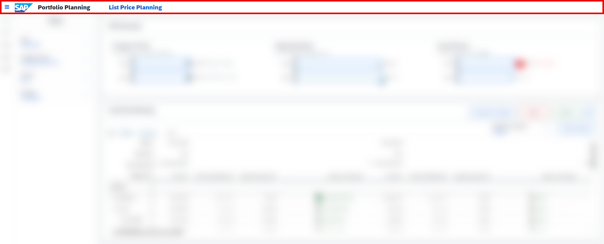

The `pnl_LeftSidePanel` section is where the left-side panel is configured. As this component is used across all planning and reporting stories as well, it deserves to have an own container outside the **CONTENT** section.
  
<!-- border; size:540px -->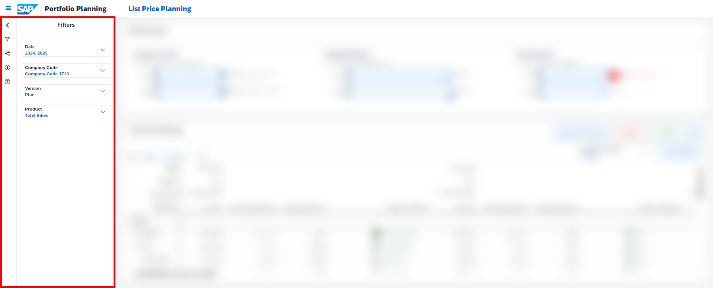

The `MainNavMenu` section is where the navigation menu is configured. Other than the other sections, the `MainNavMenu` section is a composite object which is configured outside the story as this component is used across almost all stories of this content package. 
  
<!-- border; size:540px -->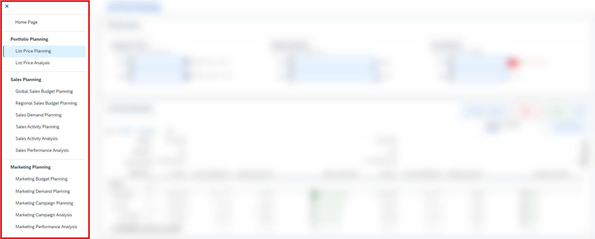

[OPTION END]

[OPTION BEGIN [Overview Pages]]
The overview pages may have a slightly different approach of clustering the different components but in its core, it is pretty much the same as with the planning and reporting stories.

Similar as it is the case for planning and reporting stories, the overview pages are divided into different components by using **Containers**, such as **Panels** or **Flow Layout Panels**.

<!-- border; size:540px -->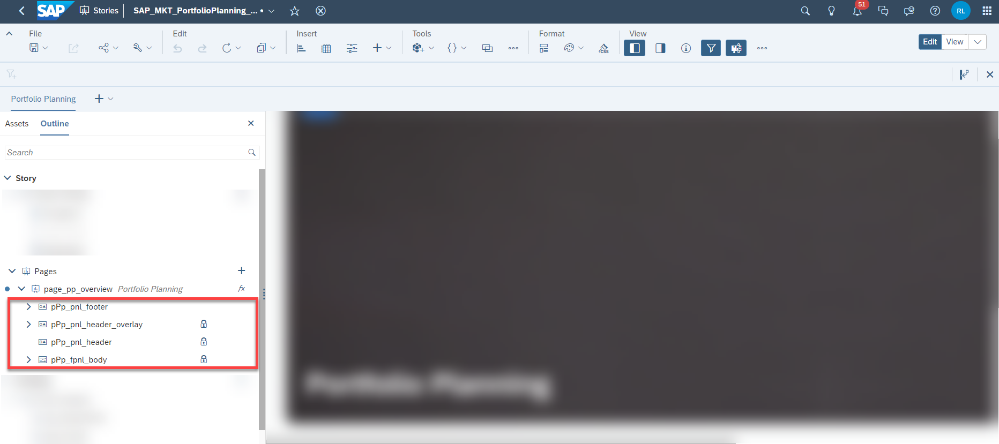

The body section (`pPp_fpnl_body`) is used for the containers in the center of the application.

<!-- border; size:540px -->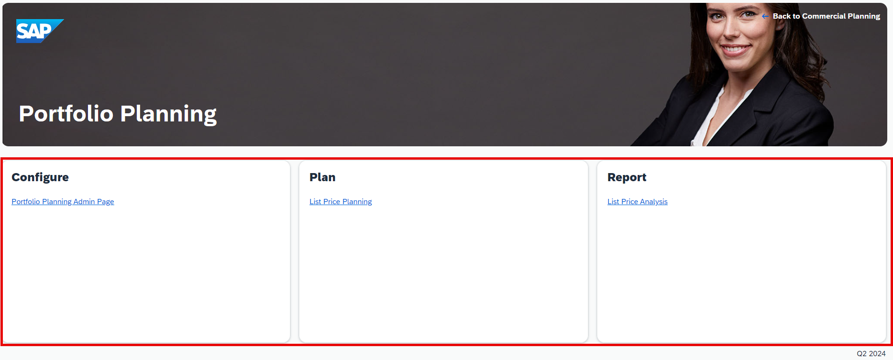

The header section (consisting of `pPp_pnl_header` and `pPp_pnl_header_overlay` in this example) is used for the upper part of the overview page, where the image is located.

<!-- border; size:540px -->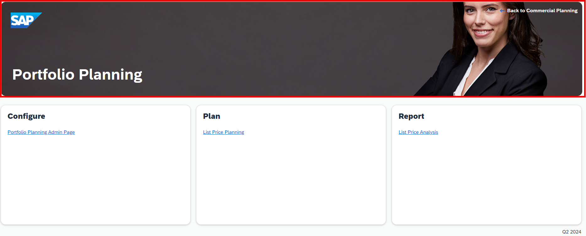

The footer section (`pPp_pnl_footer`) is used for the lower part of the story, where the version of the content is specified.

<!-- border; size:540px -->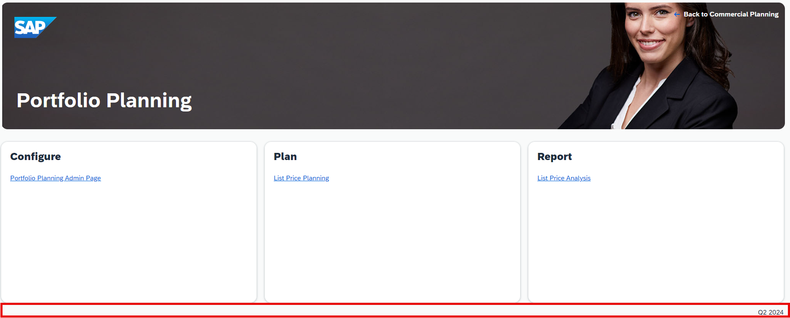
[OPTION END]

### Naming Convention of Elements
In this step you will learn about the naming convention of UI elements and script objects in each story. 

You may have noticed that most of the objects have some sort of abbreviations as prefix.

The abbreviations indicate what kind of technical object is used for the specific widget. Afterwards follows a descriptive naming. The following list will help you to understand the meaning of the abbreviations:

|  Abbreviation                            | Widget                            |                
|  :-------------------------------------- | --------------------------------- |
|  `dd`                                    | `drop down`                         
|  `cb`                                    | `check box group`      
|  `dialog`                                | `pop up`                  
|  `tbl`                                   | `table`
|  `ic`                                    | `input control`
|  `shp`                                   | `shape`
|  `btn`                                   | `button`                     
|  `pnl`                                   | `panel`                                                
|  `fpnl`                                  | `flow layout panel`                     
|  `txt`                                   | `text`              
|  `rb`                                    | `radio button`     
|  `da`                                    | `data action`        
|  `ma`                                    | `multi action`      
|  `swi`                                   | `switch` 
|  `img`                                   | `image`           

### Script Variables
In this step you will learn about script variables and how they are named. 

Generally the **Script Variables** section is the place where you can define global variables for your story.

<!-- border; size:540px -->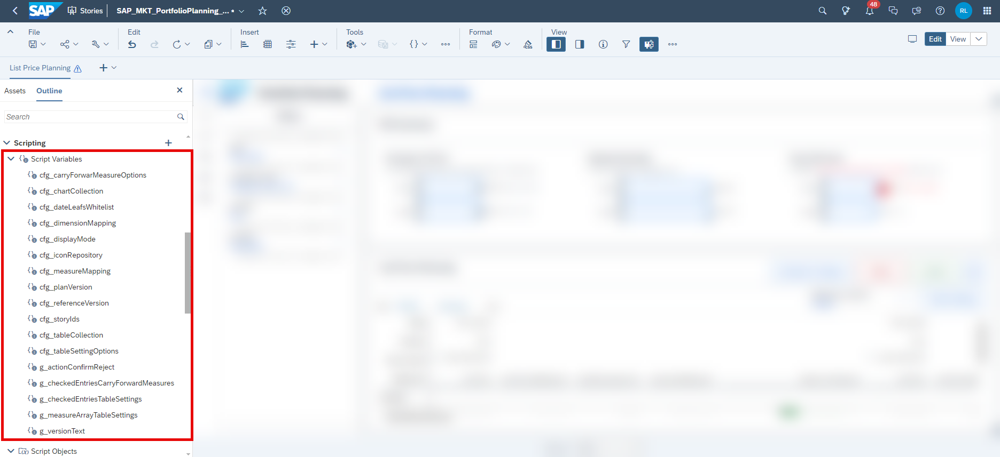

In the scope of this content, two different groups of variables have been created.

- All variables with the prefix `cfg_` are considered to be constant variables which are never changed.
- In native JavaScript language, these variables would be declared as `const`. As the in-built SAC IDE does not offer this, we decided to mark constant variables with the `cfg_` prefix.
  
- All variables with the prefix `g_` are considered to be ordinary global variables which can be changed or overwritten during runtime. 
- In native JavaScript language, these variables would be declared as `let`. As the in-built SAC IDE does not offer this, we decided to mark these variables with the `g_` prefix.

- Some of the variables are initialized directly in the menu provided by the builder panel. 
  
    <!-- border; size:540px -->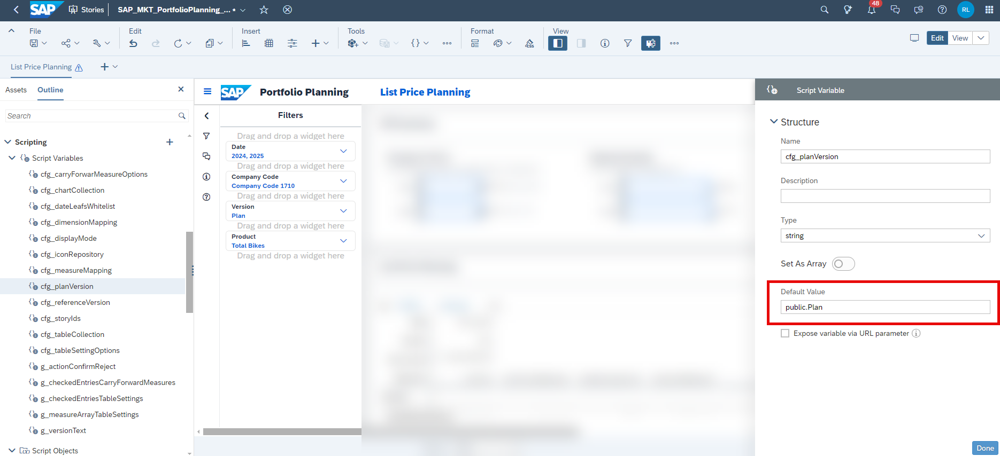

- Other variables are initialized in the `onInitialization` script of the story. The following screenshot provides such an example.
  
    <!-- border; size:540px -->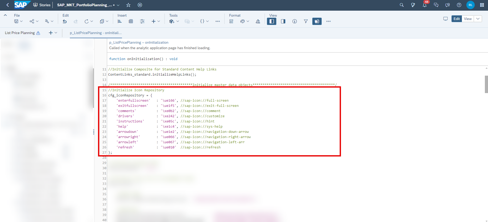

Many variables are re-used across all stories while some of the variables only exist inside a particular story. The following list provides an overview of the **most important and common** variables and how they are used:

- The variable `cfg_chartCollection` is an array of chart objects which can be found in many stories and is initialized in the `onInitialization` script. It is used to store all chart objects of a particular story.
- 
The variable is mainly used in order to loop over all chart objects, making it easy to address all chart widgets of a story at once.

  
    <!-- border; size:540px -->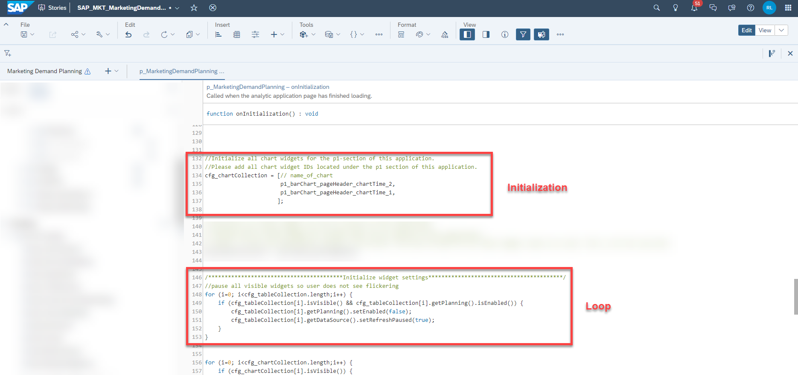

- The variable `cfg_tableCollection` is an array of table objects which can be found in many stories and is initialized in the `onInitialization` script. It is used to store all table objects of a particular story.
- 
The variable is mainly used in order to loop over all table objects, making it easy to address all table widgets of a story at once.

  
    <!-- border; size:540px -->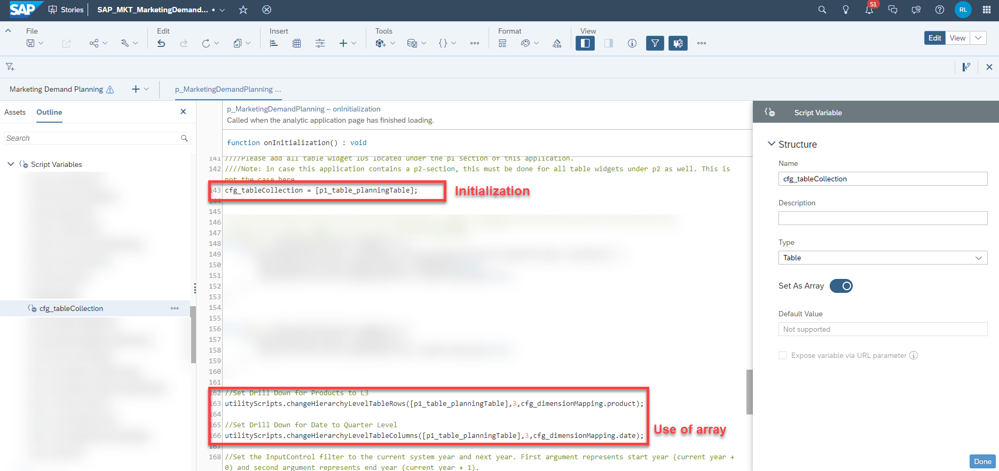

- The variable `cfg_dimensionMapping` of type `Selection` is initialized in the `onInitialization` script and serves as a dictionary which stores all dimension IDs of the data model and provides a descriptive naming to these dimensions. 
  
    <!-- border; size:540px -->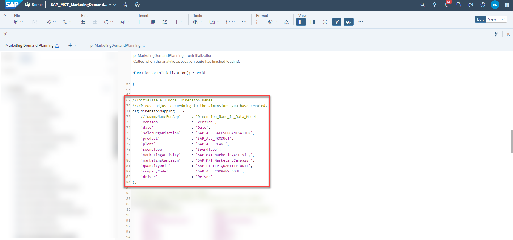

- The left column, also known as the **key**, provides the descriptive naming for the dimension ID, whereas the right column, also known as the **value** represents the technical dimension ID as it is stored in the data model. 
- This variable is used in order to ease the usage of dimension IDs in the scripts. By using this dictionary, you can work with the easy descriptions instead of having to write the entire dimension ID each time you call a script or API where you need to specify a dimension.
- 
If for instance your product dimension has a different dimension ID, you can simply replace the value in the dictionary with your own ID and the scripts will still work without having to change the dimension in every single line of code where the product dimension is used.

  
    <!-- border; size:540px -->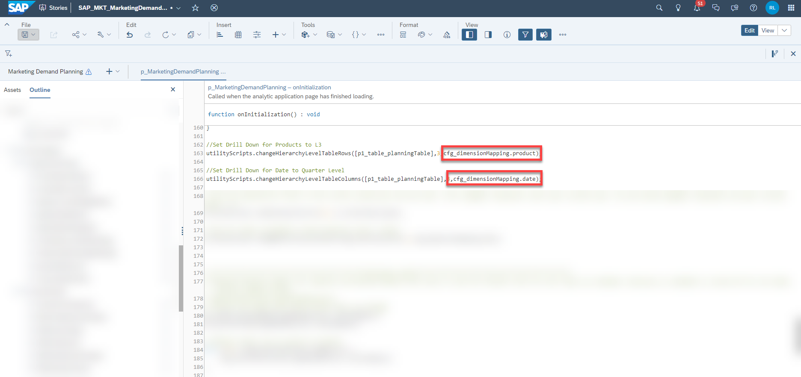

- The variable `cfg_displayMode` of type `string` is initialized in the `onInitialization` script. 
- 
It is hard coded to one single value <code>present</code> and is used when switching over to other stories when using the navigation menu. The script used to open a new story consumes this variable and opens the story in present mode respectively. If you want to open the story in another mode than the present mode, you may change the value to any other valid value than <code>present</code>.
 
  
    <!-- border; size:540px -->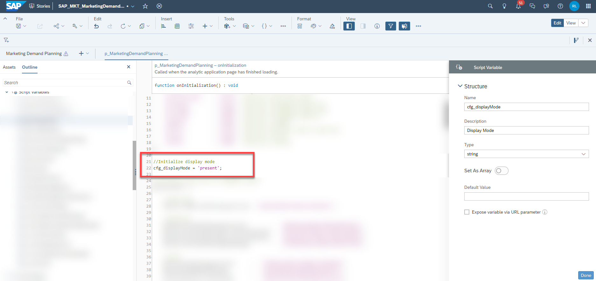

- The variable `cfg_iconRepository` of type `Selection` is initialized in the `onInitialization` script and serves as a dictionary to store the `unicode` of an icon together with its descriptive name in a key-value fashion similar to `cfg_dimensionMapping`.
- 
Also here, the main use case is to ease the usage and addressing of icons in the scripts.

  
    <!-- border; size:540px -->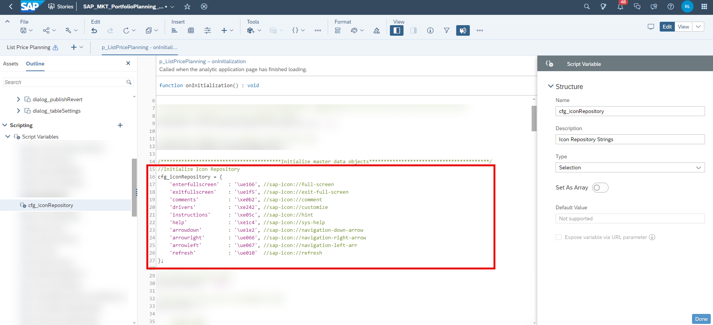

- The variable `cfg_measureMapping` of type `Selection` is initialized in the `onInitialization` script and serves as a dictionary which stores all measure IDs of the data model and the story and provides a descriptive naming to these measures. 
  
    <!-- border; size:540px -->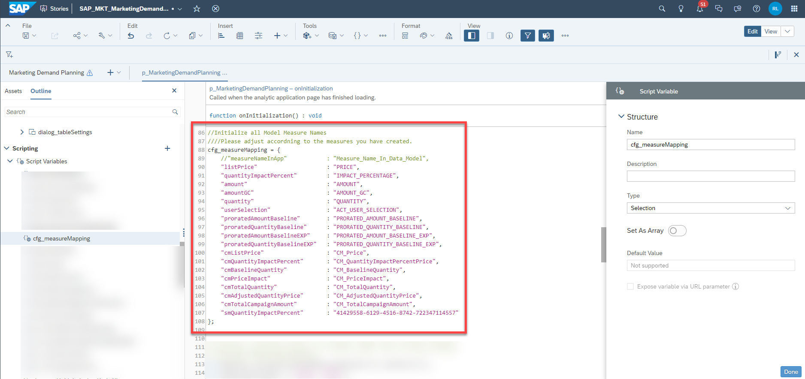

- Similar to the variable `cfg_dimensionMapping`, this dictionary is mainly used to ease the usage of measure IDs in the scripts. In addition to that it also provides more flexibility, as you can change the measure IDs in your data model freely and only need to update the new ID on one single spot instead of having to go into every single script where the measure is called. 
  
    <!-- border; size:540px -->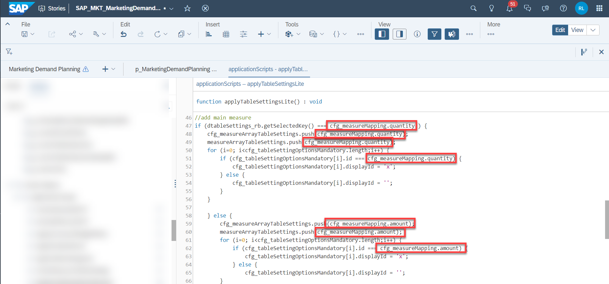

- The variable `cfg_planVersion` of type `string` is initialized in both the `onInitialization` script and the Right-side panel where it is provided a default value. 
- 
It is hard coded to the default plan version of this content package, which is the <code>public.Plan</code> version.

  
    <!-- border; size:540px -->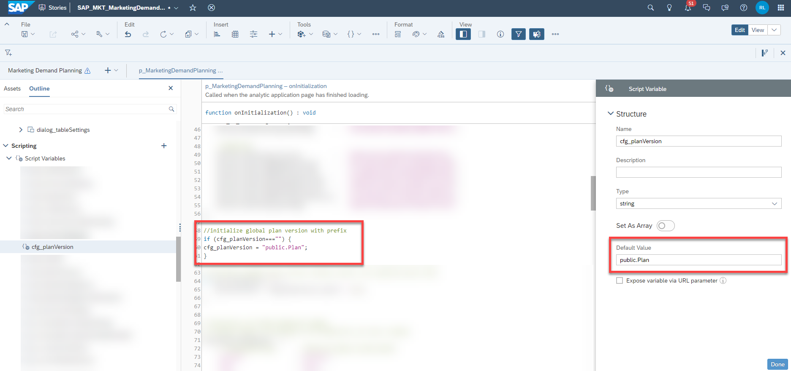

- The variable `g_versionText` of type `string` is used for the same purpose, except that it does not store the prefix but only the version text itself. Similar to `cfg_planVersion`, it is hard coded to the value `Plan`.
  
    <!-- border; size:540px -->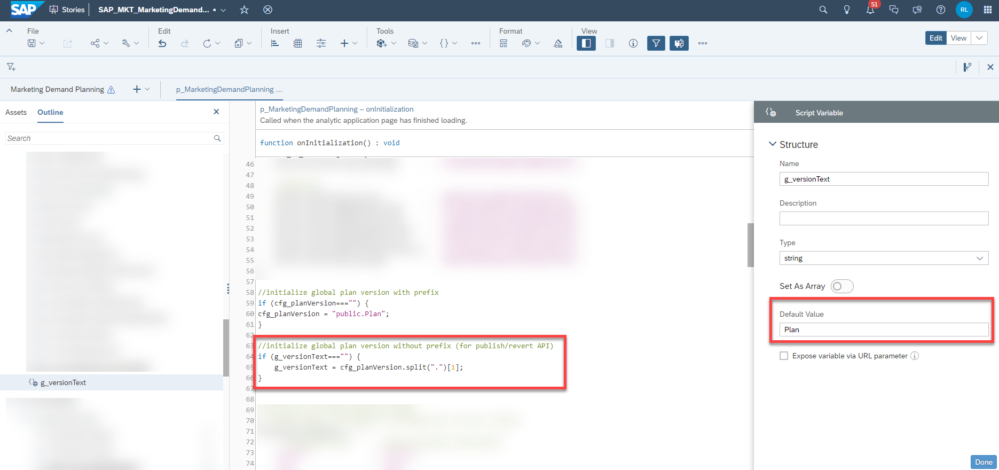

- The variable `cfg_storyIds` of type `Selection` is initialized in the `onInitialization` script and serves as a dictionary which stores all story IDs of the content package and provides a descriptive naming to these stories.
- 
This dictionary is used for the navigation menu. By having initialized this dictionary in a central place, you can create new stories or copy existing stories and maintain everything in one single spot instead of having to look for the button or widget where the script to open another story is called.

  
    <!-- border; size:540px -->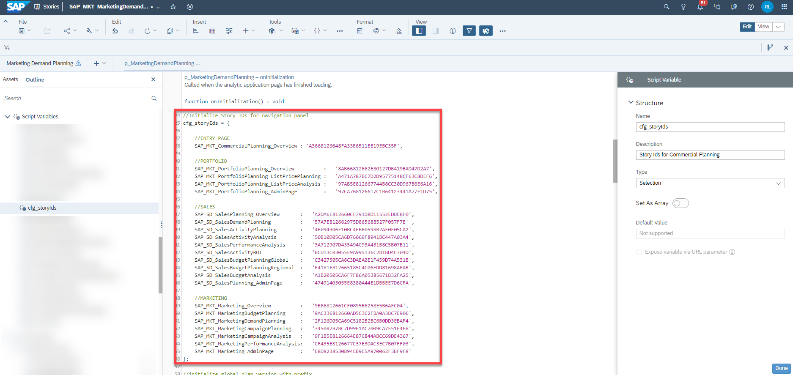

- The variable `g_actionConfirmReset` of type `string` is not initialized on startup and does not posses a default value. It is used in the process of publishing or reverting a version and stores information on whether the version will be published or reverted. 

- Depending on the story, there may also be additional variables which have not been mentioned here. Covering every single variable which was created to serve for one particular purpose would go beyond the scope of this tutorial. Please check the in-line documentation to find out what they are used for and where they are used by using the in-built search function in SAC. 
  
    <!-- border; size:540px -->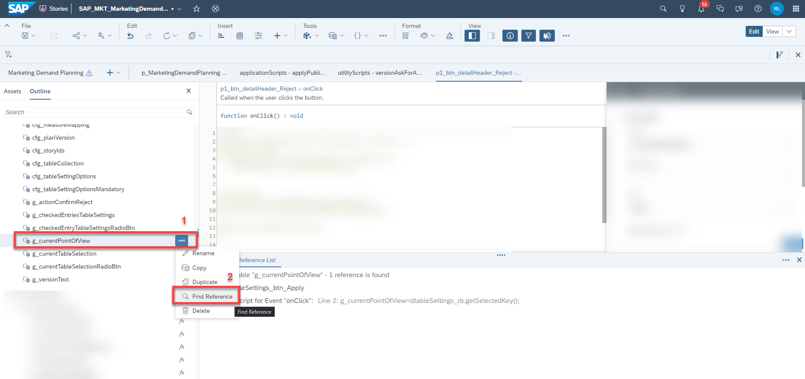

### Script Objects
In this step you will learn about script objects and how they are clustered. 

Generally the **Script Objects** section is the place where you can create scripts which then can be called by different events, such as `onClick` or `onChange` events for instance.

In the scope of this content, you will find three different groups of scripts, which are clustered in `applicationScripts`, `layoutScripts` and `utilityScripts`.

<!-- border; size:540px -->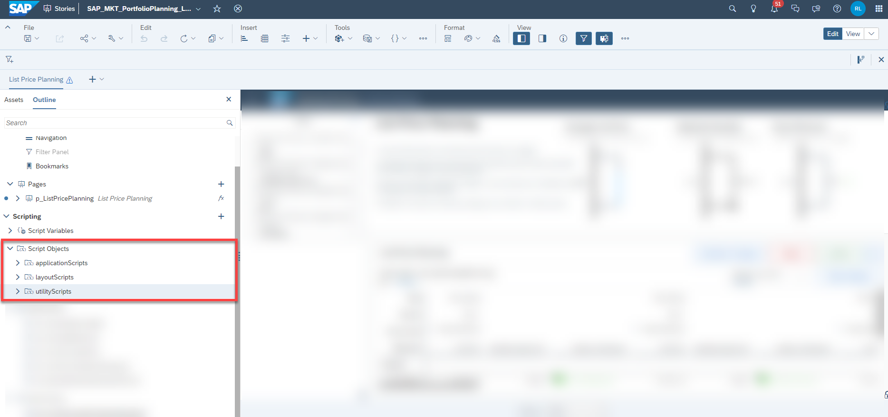

- The `applicationScripts` group is the place where all story specific scripts are stored. These kind of scripts are not re-usable as they execute a very specific task designed for one particular story only.
- The `layoutScripts` group is the place where all layout related scripts are stored. These kind of scripts are used to change the layout of the application and come into action when you collapse a table for example or expand a section.
- The `utilityScripts` group is the place where generic scripts are stored. These kind of scripts are reusable and provide basic functions which can be executed independent of the story you are working on, such as converting a date to a string or similar things.

### Final Remarks
Congratulations! You have finished the tutorial and are now able to navigate through the story from a technical perspective.

If you want to learn more about the modules of this content package, check out the following tutorials:

- [xP&A Commercial Planning - Get to know the Sales Planning module](xpa-sac-cxsp-salesplanning-gettoknow)
- [xP&A Commercial Planning - Get to know the Portfolio Planning module](xpa-sac-cxpp-portfolioplanning-gettoknow)
- [xP&A Commercial Planning - Get to know the Marketing Planning module](xpa-sac-cxmp-marketingplanning-gettoknow)

If you want to customize the content and adjust it according to your own business requirements, the following resources might be helpful:

- [xP&A Commercial Planning - Introduction to the Data Model](xpa-sac-cxmp-datamodelfundamentals)
- [xP&A Commercial Planning - Data Integration](xpa-sac-cx-data-integration-setup)
- [xP&A Commercial Planning - Manage data loads](xpa-sac-cx-manage-data-loads)
- [xP&A Commercial Planning - Add additional sections to a story](xpa-sac-cx-add-new-sections)
- [xP&A Commercial Planning - Add an additional story to the Navigation Menu](xpa-sac-cx-add-story-navmenu)
- [xP&A Commercial Planning - Customize Default Settings](xpa-sac-cx-customize-default-settings)
- [xP&A Commercial Planning - Customize Table Settings Dialogue](xpa-sac-cx-customize-tablesettings-dialogue)
- [xP&A Commercial Planning (Marketing) - Add a new Driver](xpa-sac-cxmp-add-new-driver)
- [xP&A Commercial Planning (Marketing) - Add a new Version](xpa-sac-cxmp-add-new-version)
- [xP&A Commercial Planning (Marketing) - Extend activity spend dates](xpa-sac-cxmp-extend-activity-dates)
- [xP&A Commercial Planning (Sales) - Add a new Version](xpa-sac-cxsp-add-new-version)
- [xP&A Commercial Planning (Sales) - Add a new Tactic](xpa-sac-cxsp-add-new-tactic)
- [xP&A Commercial Planning (Sales) - Add a new Spend Type](xpa-sac-cxsp-add-new-spendtype)

If you want to get an overview of the entire xP&A Commercial Planning content package, make sure to check out the Mission.

Interested in more xP&A topics and related business content packages? Visit our community page [Extended Planning & Analysis Business Content](https://community.sap.com/topics/cloud-analytics/planning/content).
