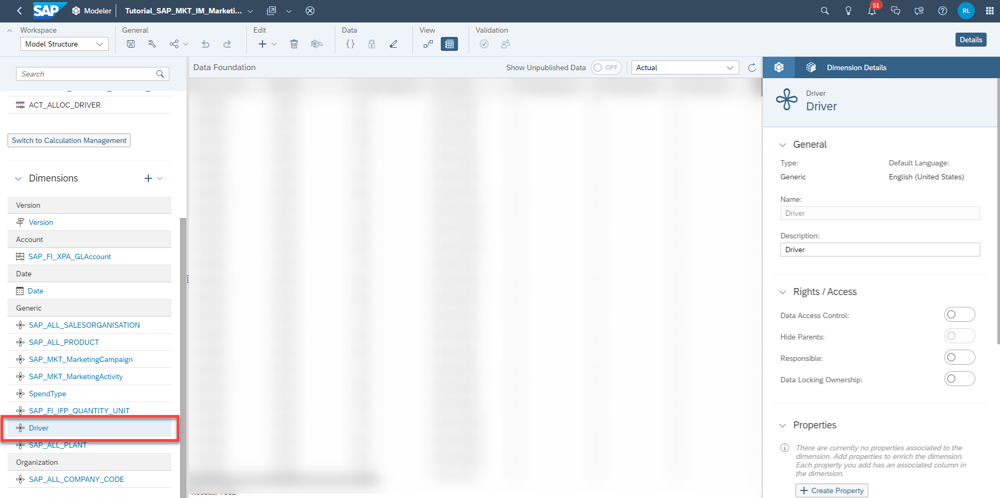
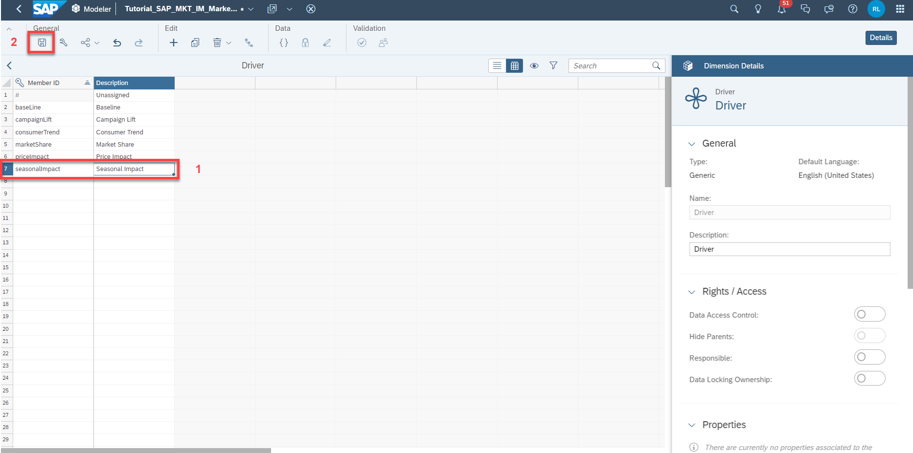
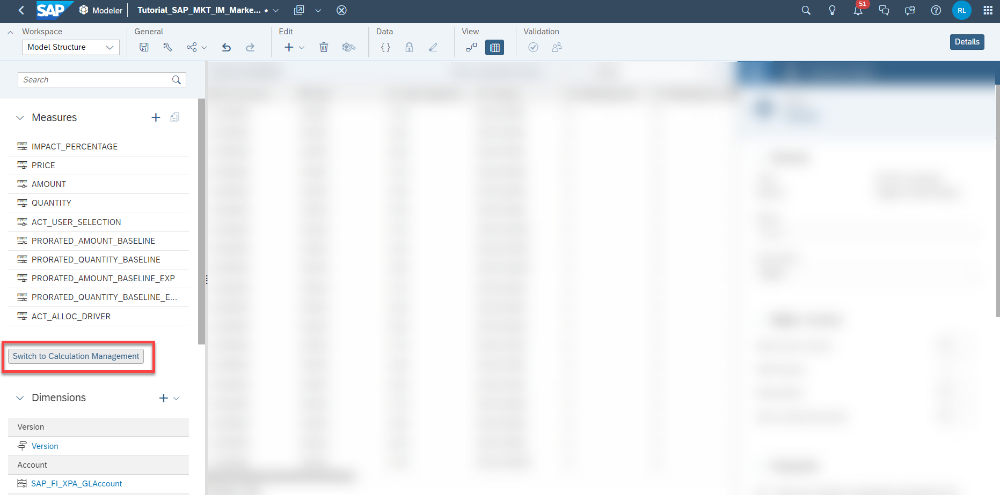
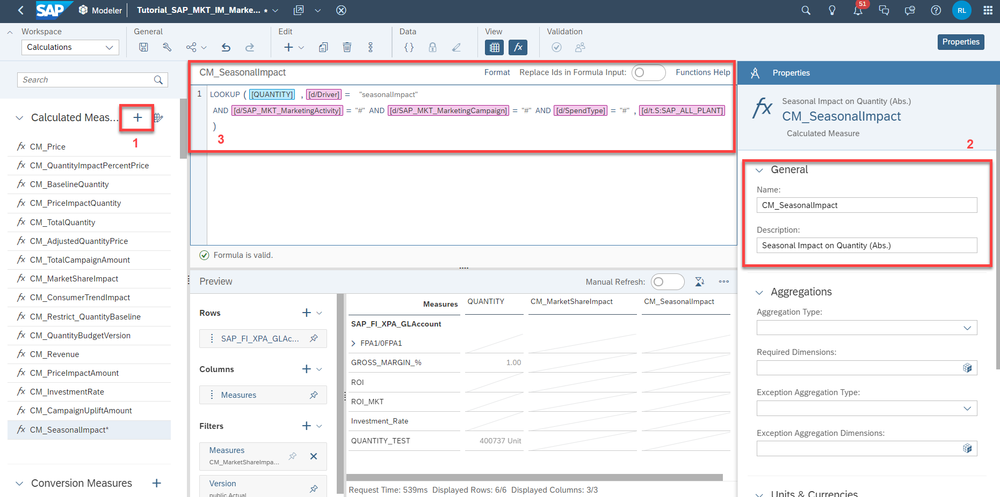
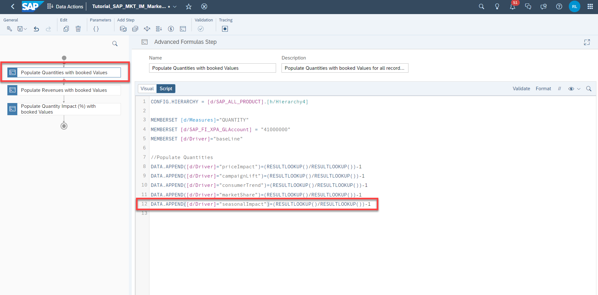
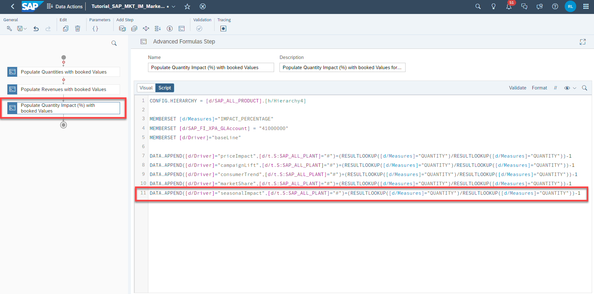
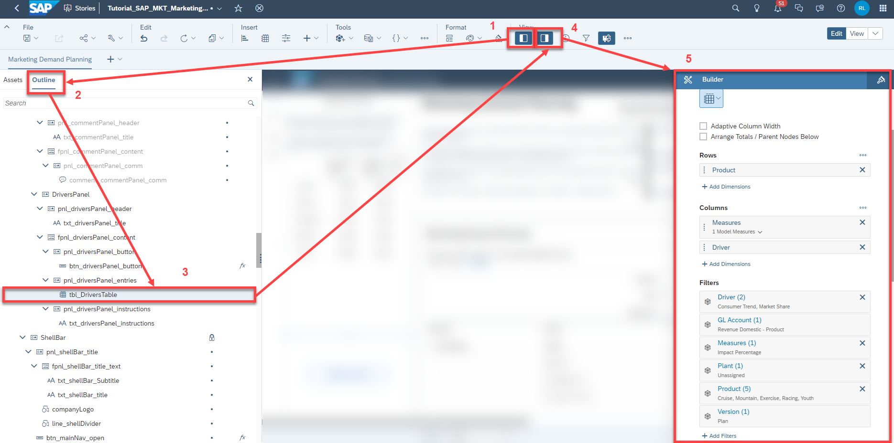
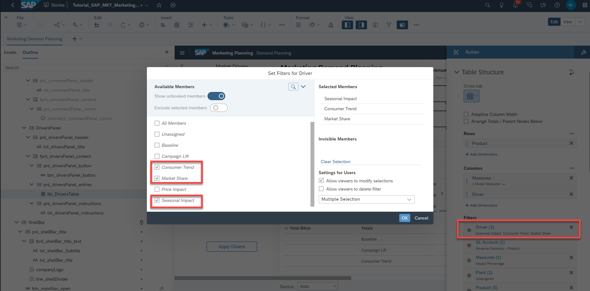

## Prerequisites
- You have an SAP Analytics Cloud tenant. If this is not the case, get started by requesting a free [SAP Analytics Cloud trial](https://www.sap.com/products/technology-platform/cloud-analytics/trial.html) tenant.
- You have installed the **SAP CX Commercial Planning content** in an SAP Analytics Cloud tenant. Reference: [Business Content Installation Guide](https://help.sap.com/docs/SAP_ANALYTICS_CLOUD/00f68c2e08b941f081002fd3691d86a7/078868f57f3346a98c3233207bd211c7.html), [Content Package User Guide](https://help.sap.com/docs/SAP_ANALYTICS_CLOUD/42093f14b43c485fbe3adbbe81eff6c8/b0046d8673b5412cbef7f521cfdfed95.html)
- You have finished both introduction tutorials [xP&A Commercial Planning - Get to know the Portfolio Planning module](xpa-sac-cxpp-portfolioplanning-gettoknow) and [xP&A Commercial Planning - Get to know the Marketing Planning module](xpa-sac-cxmp-marketingplanning-gettoknow)
- You have finished the tutorial [xP&A Commercial Planning - Understanding the technical structure of stories](xpa-sac-cx-technical-structure-of-stories) and understand the architectural design of each app
- You have finished the tutorial [xP&A Commercial Planning - Introduction to the data model](xpa-sac-cxmp-datamodelfundamentals) and understand the concept of the data model 

## You will learn
- How to add a new driver. This includes...
- ...creating a new member in the driver dimension
- ...adding relevant calculated measures to the data model
- ...adjusting all affected data actions
- ...embedding the driver into the stories

## Intro
Now that you have successfully gone through the introduction tutorials and know how to use the content package like an expert, you may want to start customizing it and adjusting it according to your own business needs.

Here you will learn how to add a new driver and how to embed it into the relevant stories.

In case you have any questions or require further support, please use the [SAP Blog question form](https://answers.sap.com/questions/ask.html?primaryTagId=bcbf0782-ce74-43b8-b695-dafd7c1ff1c1&additionalTagId=67838200100800006884&additionalTagId=819703369010316911100650199149950&topics=commercial%20planning) to reach out to us.

If you are interested in more xP&A topics, related business content packages, or videos showing the content in action, feel free to check out our community page [Extended Planning & Analysis Business Content](https://community.sap.com/topics/cloud-analytics/planning/content).


### Create Driver member
First you need to create a new dimension member in the `Driver` dimension.
  
1. Open the `Marketing Planning` data model `SAP_MKT_IM_MarketingPlanning` and click on the `Driver` dimension in the dimension list on the left-hand side.

    <!-- border; size:540px -->

2. Add a new member ID to the dimension and save your changes.
    - In this example, we will create a new driver to be able to plan season based fluctuations. We will call this driver `Seasonal Impact` and provide the member ID `seasonalImpact`.
    - Save your changes afterwards.
  
    <!-- border; size:540px -->

3. Navigate back to the main menu of the data model and enter the **Calculation Management** section.
   
    <!-- border; size:540px -->

### Create Calculated Measure 
Add a new calculated measure representing the incremental quantity coming from the new driver

1. Click on the `+` icon on the top to create a new calculated measure 
2. Provide a fitting **Name** and **Description** in the Properties panel on the right-hand side
3. <p>Add the formula according to the screenshot</p>
   
    <!-- border; size:540px -->

    ```
    LOOKUP([QUANTITY], [d/Driver]="" AND [d/SAP_MKT_MarketingActivity]="#" AND [d/SAP_MKT_MarketingCampaign]="#" AND[d/SpendType]="#", [d/t.S:SAP_ALL_PLANT] )
    ```

4. Save your changes

### Adjust Data Actions

1. Enter the Data Action `SAP_MKT_IM_MarketingPlanning_PopulateImpactPercentage`

    >INFORMATION:
    >
    This data action is executed on initialization of the **Marketing Demand Planning** story and populates all relevant records with booked values, i.e. zeroes for all relevant measures.

2. In step 1 `Populate Quantities with booked Values`, add a new line according to the screenshot
   
    <!-- border; size:540px -->

    ```
    DATA.APPEND([d/Driver]="seasonalImpact")=(RESULTLOOKUP()/RESULTLOOKUP())-1
    ```

3. In step 2 `Populate Revenues with booked Values`, add a new line according to the screenshot
   
    <!-- border; size:540px -->

    ```
    DATA.APPEND([d/Driver]="seasonalImpact")=(RESULTLOOKUP([d/Measures]="QUANTITY")/RESULTLOOKUP([d/Measures]="QUANTITY"))-1
    ```

4. In step 3 `Populate Quantity Impact (%) with booked Values `, add a new line according to the screenshot

    <!-- border; size:540px -->

    ```
    DATA.APPEND([d/Driver]="seasonalImpact",[d/t.S:SAP_ALL_PLANT]="#")=(RESULTLOOKUP([d/Measures]="QUANTITY")/RESULTLOOKUP([d/Measures]="QUANTITY"))-1
    ```

5. Save the Data Action

### Adjust Marketing Demand Planning Story

1. Open the story **Marketing Demand Planning** (`SAP_MKT_MarketingDemandPlanning`) in edit mode

2. Open the **Left Side Panel**, go to the **Outline** tab, look for the object called `tbl_DriversTable`, click on it and open the **Right Side Panel** to enter the **Builder** panel.
   
    <!-- border; size:540px -->

3. Add the new driver member to the filter of the table widget.
   
    <!-- border; size:540px -->

4. Save your story.

5. Open your story in view mode to initialize the data for the new driver. Your tables should now contain the new driver with booked values.

### Final Remarks
Congratulations! You have finished the tutorial and are now able to add additional drivers to your data model!

If you want to learn more about the modules of this content package, check out the following tutorials:

- [xP&A Commercial Planning - Get to know the Sales Planning module](xpa-sac-cxsp-salesplanning-gettoknow)
- [xP&A Commercial Planning - Get to know the Portfolio Planning module](xpa-sac-cxpp-portfolioplanning-gettoknow)
- [xP&A Commercial Planning - Get to know the Marketing Planning module](xpa-sac-cxmp-marketingplanning-gettoknow)

If you want to customize the content and adjust it according to your own business requirements, the following resources might be helpful:

- [xP&A Commercial Planning - Introduction to the Data Model](xpa-sac-cxmp-datamodelfundamentals)
- [xP&A Commercial Planning - Data Integration](xpa-sac-cx-data-integration-setup)
- [xP&A Commercial Planning - Manage data loads](xpa-sac-cx-manage-data-loads)
- [xP&A Commercial Planning - Understanding the technical structure of Stories](xpa-sac-cx-technical-structure-of-stories)
- [xP&A Commercial Planning - Add additional sections to a story](xpa-sac-cx-add-new-sections-to-app)
- [xP&A Commercial Planning - Add an additional story to the Navigation Menu](xpa-sac-cx-add-new-story-to-navmenu)
- [xP&A Commercial Planning - Customize Default Settings](xpa-sac-cx-customize-default-settings)
- [xP&A Commercial Planning - Customize Table Settings Dialogue](xpa-sac-cx-customize-table-settings-dialogue)
- [xP&A Commercial Planning (Marketing) - Add a new Version](xpa-sac-cxmp-add-new-version)
- [xP&A Commercial Planning (Marketing) - Extend campaign and activity attributes](xpa-sac-cxmp-add-new-attributes)
- [xP&A Commercial Planning (Marketing) - Extend activity spend dates](xpa-sac-cxmp-extend-activity-dates)
- [xP&A Commercial Planning (Sales) - Add a new Version](xpa-sac-cxsp-add-new-version)
- [xP&A Commercial Planning (Sales) - Add a new Tactic](xpa-sac-cxsp-add-new-tactic)
- [xP&A Commercial Planning (Sales) - Add a new Spend Type](xpa-sac-cxsp-add-new-spendtype)

If you want to get an overview of the entire xP&A Commercial Planning content package, make sure to check out the Mission.

Interested in more xP&A topics and related business content packages? Visit our community page [Extended Planning & Analysis Business Content](https://community.sap.com/topics/cloud-analytics/planning/content).
