## Prerequisites

- You are familiar with the **SAP Commercial Planning (CX) Marketing Planning** content from the xP&A Business Content Suite. Reference: [Getting Started tutorial](xpa-sac-cxmp-marketingplanning-gettoknow)
- You have installed the **SAP Commercial Planning (CX) Marketing Planning** content in an SAP Analytics Cloud tenant. Reference: [Business Content Installation Guide](https://help.sap.com/docs/SAP_ANALYTICS_CLOUD/00f68c2e08b941f081002fd3691d86a7/078868f57f3346a98c3233207bd211c7.html), [Content Package User Guide](https://help.sap.com/docs/SAP_ANALYTICS_CLOUD/42093f14b43c485fbe3adbbe81eff6c8/b0046d8673b5412cbef7f521cfdfed95.html).  

## You will learn

- Which steps are required in order to add and use a new version
- This includes...
  - adding a new version via the version management function
  - which options are available to use the new version for your planning activities

## Intro

The **SAP Commercial Planning (CX) Marketing Planning** content package comes with a number of pre-defined versions which can be used for your planning activities. Nevertheless you might want to add more versions according to your own business needs. In this case, you would need to adjust the planning applications as well as the reporting stories, so the planning grids and objects initialize with the correct version member.

In this tutorial, you will learn how to add a new version and how to make it available in the planning applications and reporting stories of this content package.

### Enter Version Management section

In the first step, it is necessary to add a new member to the `Version` dimension. In order to do so, you need to enter the **Version Management** section.

1. In the SAP Analytics Cloud Menu, navigate to the **Files** section.

2. Search for any application with a table. In this example, we will look for the `SAP_MKT_MarketingCampaignPlanning` application and **Open in Story Edit Mode**.

    <!-- border; size:540px -->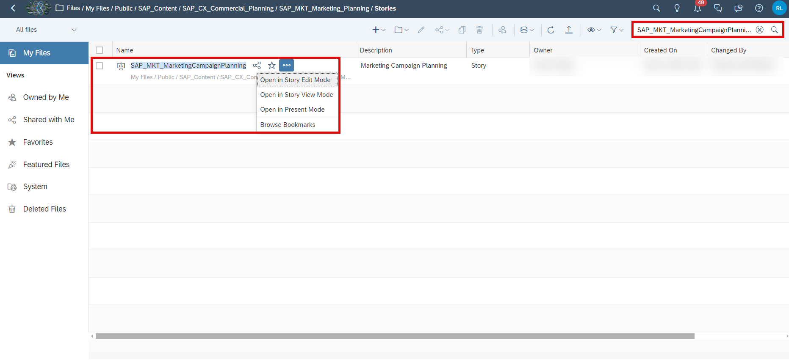

3. Click on the table and open the **Version Management** section in the **Tools** section.

    >INFORMATION:
    >
    **Version Management** is greyed out as long as you have not selected the table beforehand.

    <!-- border; size:540px -->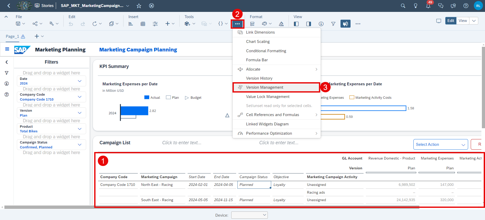

### Create new Version

After clicking on the **Version Management** icon, a new section on the right-hand side expands, where public and private versions are listed. By default, there is a filter applied to only display Versions currently in use in the selected table. If you prefer, you can deselect that switch in the right-hand side panel in order to display all versions. In this step, that will not be necessary as you proceed to add a new public version to the data model based upon the currently selected Plan version.

1. Duplicate an existing version.

    - Choose a version and click on the **copy** icon next to it. In this example, you will create a copy of the version `public.Plan`.

    <!-- border; size:540px -->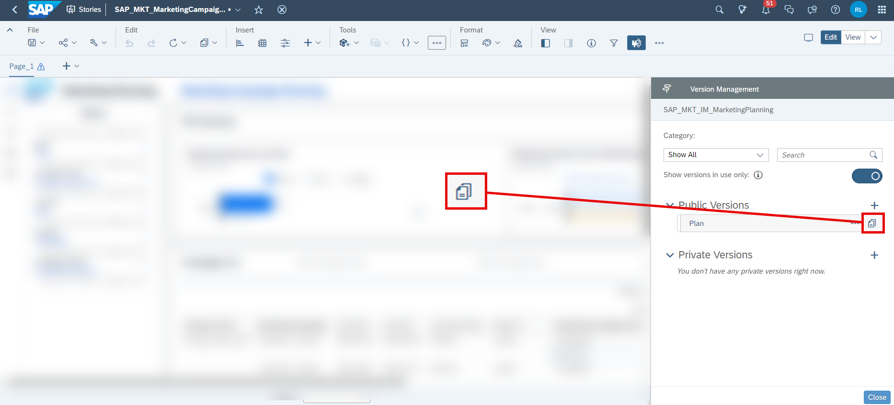

2. Define the version properties.

    - Choose a valid name for your new version. In this example we will call it `Baseline`.
    - Ensure to choose **Planning** as your version category.
    - Choose one of the options provided for your copy operation. In this example, we will **Copy all data** from the `public.Plan` version to the new version.
    - Click on **OK** to create the copy.

    <!-- border; size:540px -->

### Publish new Version

Now that you created the new version, you need to publish it as it is initially created as a private version.

1. Click on the **Publish** icon next to your new version. Select the option **Publish As**.

    <!-- border; size:540px -->

2. Specify the version properties.

    - Specify the version name once more. In this example, we will stick to the name `Baseline`.
    - Specify the version category once more. Ensure to select **Planning**.
    - Click on the **Publish** button when done.

    <!-- border; size:540px -->

3. Close your story.

    - You may now close your story.
    - There is no need to save it as it only served as an entry point for the version management section.

### Adjust Version Properties

Now that you created your new version, you can make a couple of adjustments which are relevant for the planning activities. This includes changing the plan horizon or the reference period for instance.

1. In the SAP Analytics Cloud Menu, navigate to the **Files** section.

2. Search for the `SAP_MKT_IM_MarketingPlanning` data model and open it.

    <!-- border; size:540px -->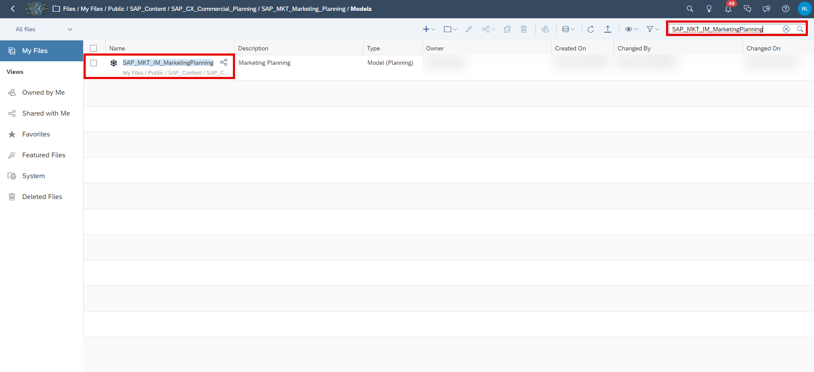

3. Click on the dimension `Version` or on the **Navigate to Dimension**-button.

    <!-- border; size:540px -->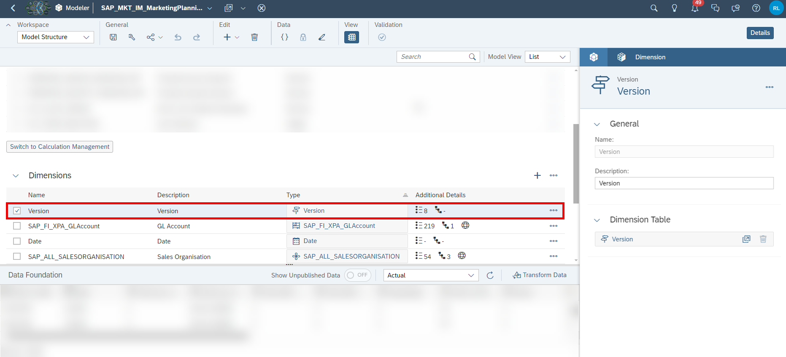

4. Adjust the version properties.

    - As your new version `Baseline` was created based on a copy of the version `Plan`, all properties were copied.
    - In this particular case, the version `Plan` does not have any property.
    - In case you want to add a property, you can do it here.

    <!-- border; size:540px -->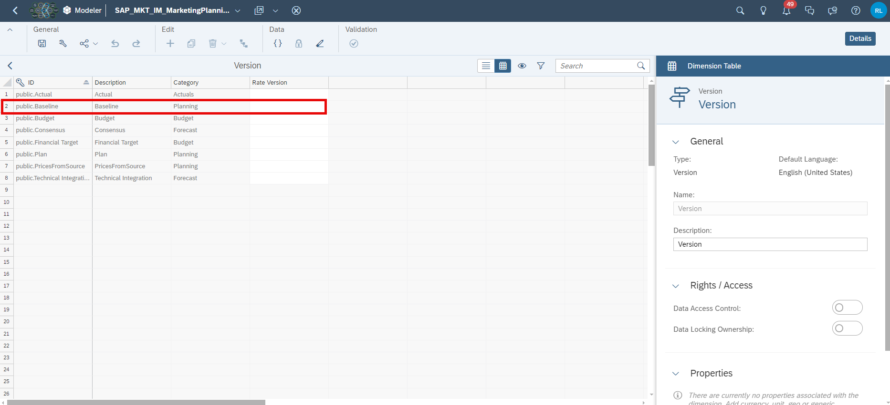

    The below table offers an overview on the different properties and their impact.

    |  Column | Explanation |
    | --- | --- |
    | ID | Not editable. Displays the ID of the version member. |
    | Description | Not editable. Represents the description of the version member. |
    | Category | Not editable. Defines the category of the version member. |
    | Rate Version | Used when planning with currency conversion and multiple sets of exchange rates. |

5. Save your changes in case you have done any.

### Initialize Objects in Planning Applications with new Version

[OPTION BEGIN [Incorporate new version into planning applications]]
Lastly, you need to make some final adjustments in order for the applications to initialize all objects with the new version.

Here you learn how to set the new version as the default version for the initialization of the objects used in the planning applications by adjusting the scripts, filters and variances. For example, some charts have a pre-defined filter on the specific version `Plan`.

1. In the SAP Analytics Cloud Menu, navigate to the **Files** section.

2. Search for the affected application, in which you want the objects to be initialized with new version. In this example, we will look for the `SAP_MKT_MarketingCampaignAnalysis` application and **Open in Story Edit Mode**.

    <!-- border; size:540px -->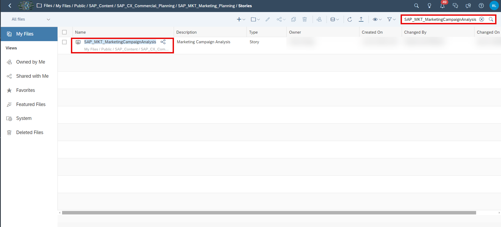

    >INFORMATION:
    >
    Please note that the procedure is the exact same for any other application. Possible applications where the plan version can be changed in the charts are:
    >
    - `SAP_MKT_MarketingCampaignPlanning`
    - `SAP_MKT_MarketingDemandPlanning`
    - `SAP_MKT_MarketingPerformanceAnalysis`
    - `SAP_MKT_Marketing_AdminPage`

3. Open the **Left Side Panel** and open the **Outline**. Search for the table `pnl_chart_smallCharts_chart01` or select the left most chart on **Page_1** manually.

    <!-- border; size:540px -->

4. Select **Right Side Panel** and click on the **Version** filter.

    <!-- border; size:540px -->

5. Unselect the current version `Plan` and select the new version `Baseline`. Click on **OK**.

    <!-- border; size:540px -->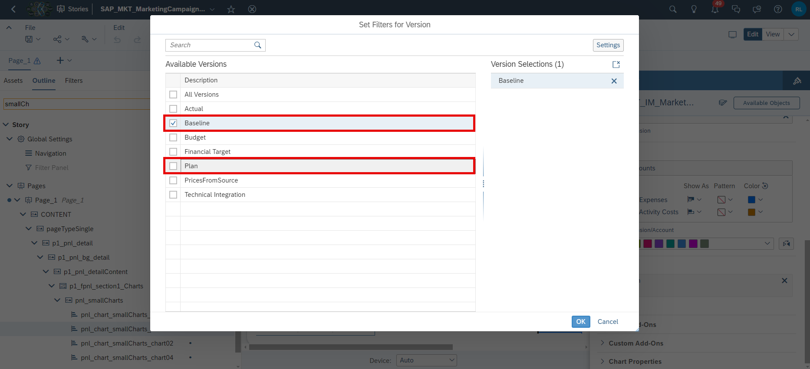

6. Follow step 3-5 for the remaining charts. You have to change the version filter for the following charts:

    - `pnl_chart_smallCharts_chart02`
    - `pnl_chart_smallCharts_chart03`
    - `pnl_chart_smallCharts_chart04`
    - `p1_barChart_pageHeader_chartsVersion_chart1`
    - `p1_barChart_pageHeader_chartsVersion_chart2`
    - `p1_barChart_pageHeader_chartsVersion_chart3`

7. Save your changes.

[OPTION END]

[OPTION BEGIN [Adjust Version Input Control in a Story]]
You learn how to set the new version as an option in filter widgets inside the reporting story `SAP_MKT_MarketingPerformanceAnalysis`.

1. In the SAP Analytics Cloud Menu, navigate to the **Files** section.

2. Search for the affected application `SAP_MKT_MarketingPerformanceAnalysis` and **Open in Story Edit Mode**.

    <!-- border; size:540px -->

3. Right-click on the input control `p1_ic_detailHeader_Version`. (You can search the name of the object in the **Outline** in the **Left Side Panel**.) Click on **Edit Filter** in the context menu.

    <!-- border; size:540px -->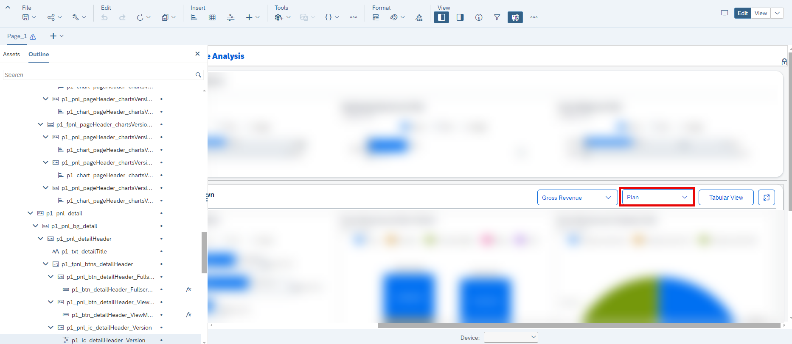

4. Select `Baseline` as additional value for your version. Press **OK**.

    <!-- border; size:540px -->

5. Save the story.

[OPTION END]

[OPTION BEGIN [Adjust Version Parameter to run Data Actions]]
You learn how to set the new version as default in the story `SAP_MKT_MarketingDemandPlanning` to run the data actions.
You learn how to overwrite the default in the section after this. However, in case anybody misses to provide the correct parameter while invoking the data actions, you have selected the correct default value as fall back in this section.
The data actions are used to switch back and forth between the quantity and revenue point of view in the table. This can be done by using the **Table Settings** button you will see once you have opened the app and its respective **Table Setting Dialog**. Without the change, the table would refresh to the `Plan` version when you use the **Table Settings**.

1. In the SAP Analytics Cloud Menu, navigate to the **Files** section.

2. Search for the story `SAP_MKT_MarketingDemandPlanning` and open it in **Edit Mode**.

    <!-- border; size:540px -->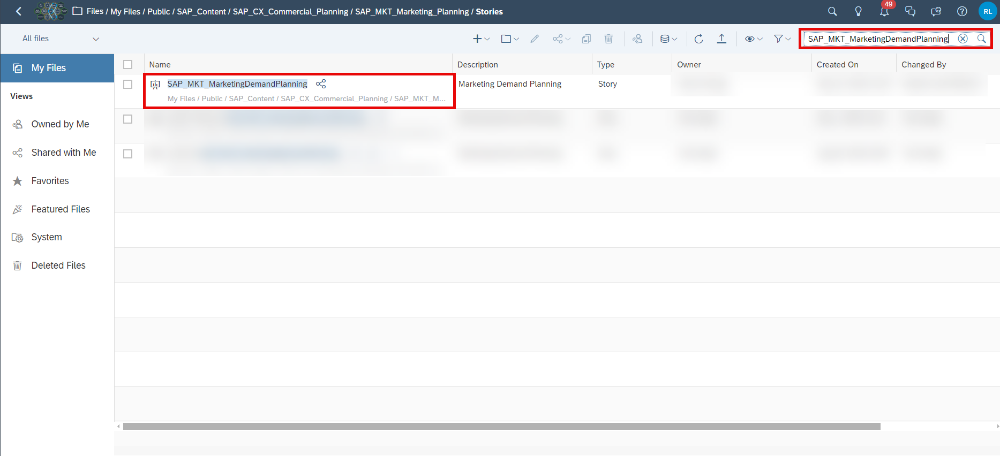

3. Open the **Left Side Panel** and open the **Outline**. Scroll down to **Data Actions**. Click on `da_populateMeasures`.

    <!-- border; size:540px -->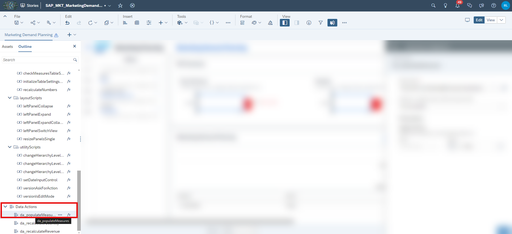

4. Click on the **value member selector** of the Target Version drop down menu in the **right side panel**.

    <!-- border; size:540px -->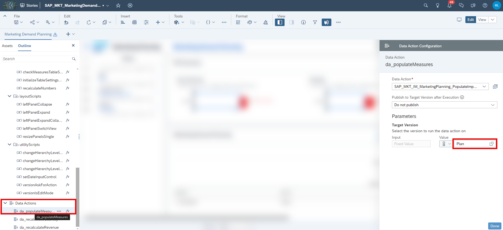

5. Select the `Baseline` version and click on **OK**.

    <!-- border; size:540px -->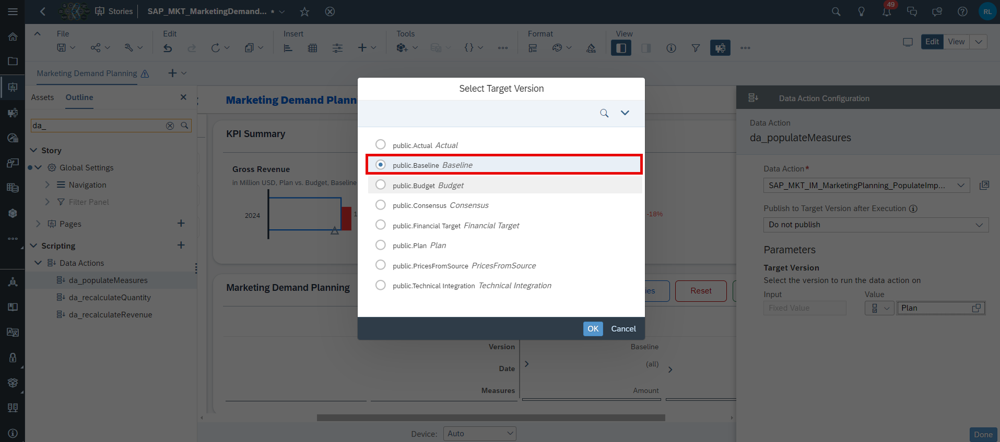

6. Repeat step 3-5 for the other data actions

    - `da_recalculateQuantity`
    - `da_recalculateRevenue`

7. Save the changes.

[OPTION END]

[OPTION BEGIN [Adjust Version in variables]]
You learn how to set the new version as default in a variable in the story `SAP_MKT_MarketingDemandPlanning` to run data actions. In the previous section you adjusted the default version value of each data action. This is just a fall back in case you as the developer forget to do the next steps. The next steps show you how to change the variable for the version in a central place. You can either follow the steps 1 and 2 or skip them, if you are still in the story from the previous steps.

1. In the SAP Analytics Cloud Menu, navigate to the **Files** section.

2. Search for the story `SAP_MKT_MarketingDemandPlanning` and open it in **Edit Mode**.

    <!-- border; size:540px -->

    >INFORMATION:
    >
    Please note that the procedure is the exact same for any other application. Possible applications where the plan version can be changed in script:
    >
    - `SAP_MKT_MarketingCampaignPlanning`

3. Open the **Left Side Panel** and open the **Outline**. Scroll down to `p_MarketingDemandPlanning`. Click on `fx` in order to **Edit Scripts** and then click `onInitialization`.

    <!-- border; size:540px -->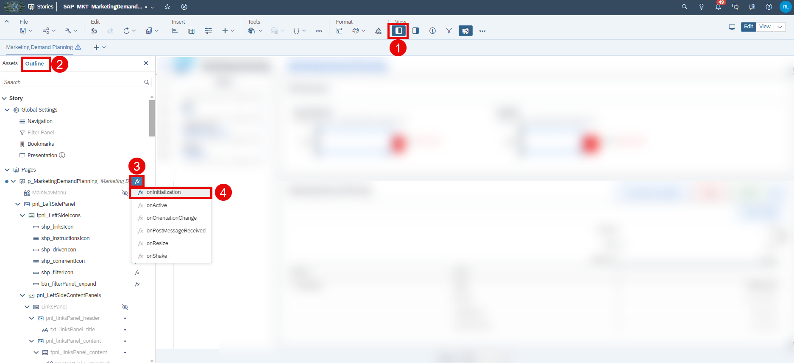

4. Adjust line 60 of the script.

    <!-- border; size:540px -->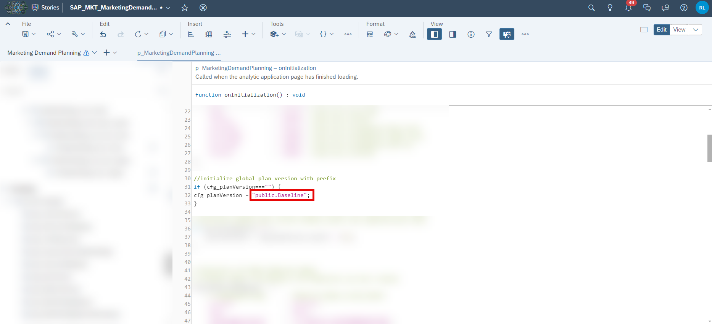

    Remove the old version `public.Plan` and add the new version `public.Baseline` like this

            cfg_planVersion = 'public.Baseline';

5. Use the **Left Side Panel** with the **Outline** again. Search for the **Script Variable** `cfg_planVersion`. Click on `...` in order to **Find Reference**.

    <!-- border; size:540px -->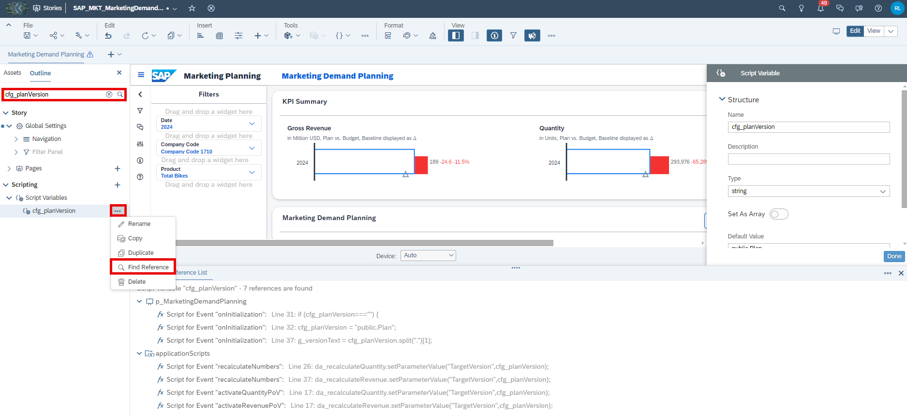

6. Change the **Default Value** in the **Right Side Panel** to `public.Baseline`. Dive deeper into the **Reference List** at the bottom to understand where the script variable `cfg_planVersion` is used.

    <!-- border; size:540px -->

7. Save the changes.

[OPTION END]

### Final Remarks

Congratulations! You have now successfully created a new version and embedded it into the planning applications and stories!

Interested in more xP&A topics and related business content packages? Visit our community page [Extended Planning & Analysis Business Content](https://community.sap.com/topics/cloud-analytics/planning/content).
