## Prerequisites
- You have an SAP Analytics Cloud tenant. If this is not the case, get started by requesting a free [SAP Analytics Cloud trial](https://www.sap.com/products/technology-platform/cloud-analytics/trial.html) tenant.
- You have installed the **SAP CX Commercial Planning content** in an SAP Analytics Cloud tenant. Reference: [Business Content Installation Guide](https://help.sap.com/docs/SAP_ANALYTICS_CLOUD/00f68c2e08b941f081002fd3691d86a7/078868f57f3346a98c3233207bd211c7.html), [Content Package User Guide](https://help.sap.com/docs/SAP_ANALYTICS_CLOUD/42093f14b43c485fbe3adbbe81eff6c8/b0046d8673b5412cbef7f521cfdfed95.html)
- You have read through both introduction tutorials [xP&A Commercial Planning - Get to know the Portfolio Planning module](xpa-sac-cxpp-portfolioplanning-gettoknow) and [xP&A Commercial Planning - Get to know the Marketing Planning module](xpa-sac-cxmp-marketingplanning-gettoknow).

## You will learn
- all fundamentals about the data model used in the **Marketing Planning** and **Portfolio Planning** module of the **CX Commercial Planning** content package. This includes...
- ...understanding the different dimensions and what they are used for
- ...understanding the different measures and what they are used for
- ...getting an understanding of how data is stored in the data model.

## Intro
Now that you have successfully gone through the introduction tutorials and know how to use the content package like an expert, you may want to start customizing it and adjusting it according to your own business needs.

But in order to do this, you have to get an understanding about the data model first.

This tutorial provides fundamental information about the data model and the provided demo data. You will learn about the dimensions, measures and how data is supposed to be stored. 

In case you have any questions or require further support, please use the [SAP Blog question form](https://answers.sap.com/questions/ask.html?primaryTagId=bcbf0782-ce74-43b8-b695-dafd7c1ff1c1&additionalTagId=67838200100800006884&additionalTagId=819703369010316911100650199149950&topics=commercial%20planning) to reach out to us.

If you are interested in more xP&A topics, related business content packages, or videos showing the content in action, feel free to check out our community page [Extended Planning & Analysis Business Content](https://community.sap.com/topics/cloud-analytics/planning/content).

### Introduction to Dimensions
In this step you will learn about the dimensions of the data model and what they are used for.

Generally the **Marketing Planning** data model `SAP_MKT_IM_MarketingPlanning` is composed of twelve dimensions and is used by the **Portfolio Planning** module and the **Marketing Planning** module of the **Commercial Planning** content package.
The **Sales Planning** module has its own data model while it consumes some of the information from the **Marketing Planning** data model.

**Version**

- The `Version` dimension is a mandatory dimension and is part of each and every SAC planning data model.
- 
In the scope of this content package, the <code>Version</code> dimension comes with five pre-defined versions.

    
    <!-- border; size:540px -->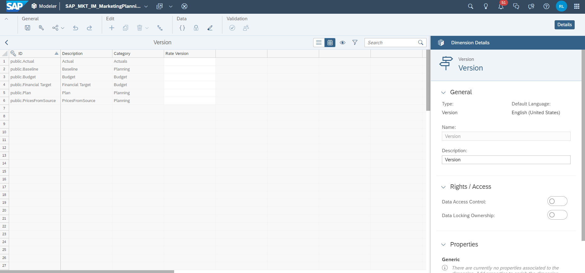
  
- The member `public.Actual` stores actual data as the name indicates. It contains actual revenues, costs as well as the list prices and cost rates per product. 
- The member `public.Financial Target` of category `Budget` serves as a reference version and is not used for planning activities in this content package. This version stores data which mimics a revenue and cost budget that is given from upper management or from the financial department and is thus only used for reporting purposes.
- The member `public.Budget` of category `Budget` is initially an exact copy of the `Financial Target` version. The difference here is that the `Budget` version is plannable which means that you can change your marketing budget and use this version as a reference for your planning activities later. 
- The member `public.Plan` of category `Planning` is the version where you will enter your planning assumptions. Here you can plan quantities, price changes, revenues and costs. Here you can also find the baseline quantity which is imported from **SAP Integrated Business Planning** and the initial list prices imported from **SAP S/4HANA**. In addition to that, imported COGS rates from the product cost model `SAP_FI_IFP_IM_ProductCost` part of the **Integrated Financial Planning for SAP S/4HANA (xP&A - Integrated Financial Planning for SAP S/4HANA and S/4HANA Cloud)** business content are also stored here.
- The member `public.PricesFromSource` of category `Planning` stores the initial prices coming from the source system, which is **SAP S/4HANA** in this case. This version serves as a sort of backup version or reference version for the initial data that had been integrated and is not used for planning purposes, but rather for reporting purposes.

**GL Account**

- The `SAP_FI_XPA_GLAccount` dimension is an account dimension which provides an exemplary General Ledger Account structure in combination with a couple of calculated accounts outside the hierarchy. 
  
    <!-- border; size:540px -->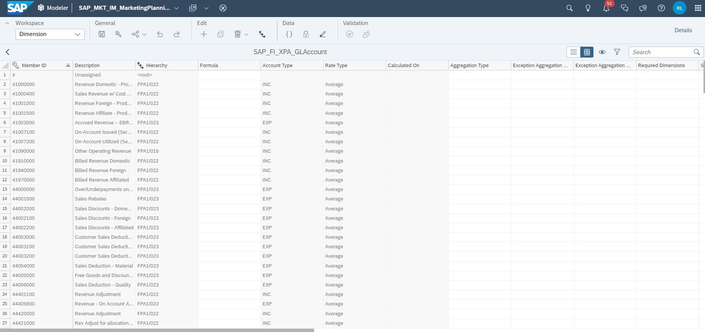
  
- In the scope of this content package, only a limited number of G/L Accounts is used.
- 
Most of the data is located under the <strong>Net Revenue</strong> node <code>FPA1/013</code>.

  
    <!-- border; size:540px -->

**Date**

- The `Date` dimension is another mandatory dimension for every SAC data model.
- In the scope of this content package, dates range from period `202101` (first period of fiscal year 2021) until `202512` (last period of fiscal year 2025).
- Most of the data is stored on the years 2023 to 2024, while actual data can be found for `Q1` and `Q2` of `2023`. Plans and Budgets can be found from `2023` to `2025`. 
- The data model is configured to handle the `Date` dimension with `Fiscal Year` property, where the fiscal year starts in January. Periods are labeled as `P01, P02, P03 ...`.

**Sales Organisation**

- 
The dimension <code>SAP_ALL_SALESORGANISATION</code> is a shared public dimension and provides IDs for numerous sales organisations which are semantically structured by region

  
    <!-- border; size:540px -->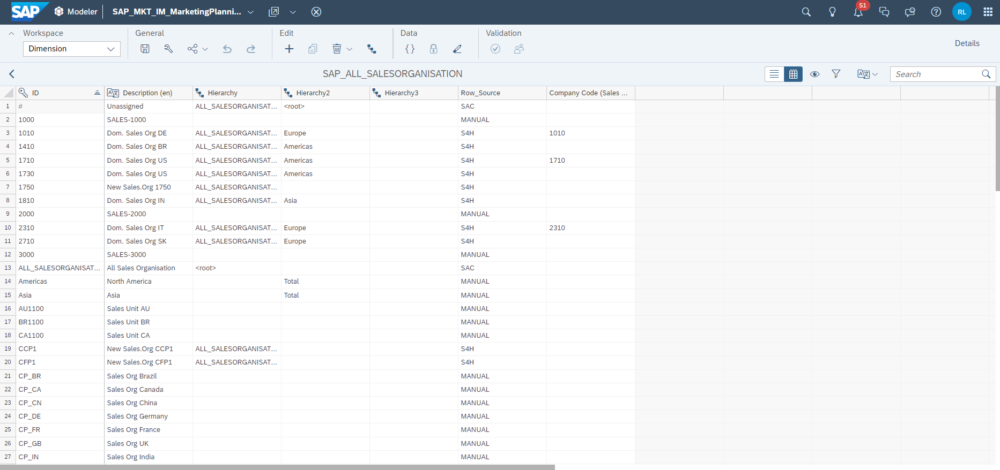
  
- The public dimension comes with three pre-defined hierarchies. In this content package, the default hierarchy with the ID `Hierarchy` is used across all stories. 
- The property `Row_Source` shows where the sample master data comes from. Some products might be imported from a source system like **SAP S/4HANA** while others might be created manually.
- The property `Company Code` shows if a specific sales organisation is related to a company code as a company code might have multiple sales organisations in theory. For the demo data, the relationship between used sales organisations and company codes is 1:1 though.

**Product**

- The dimension `SAP_ALLPRODUCT` is a shared public dimension and contains a list of different products. 
- The public dimension comes with four pre-defined hierarchies. In this content package, the hierarchy with the ID `Hierarchy4` is used across all stories as the demo data focusses on bike products only. Other products are excluded from this hierarchy. 
- 
In addition to that, all Data Actions are restricted to only work on <code>Hierarchy4</code> of this dimension.

  
    <!-- border; size:540px -->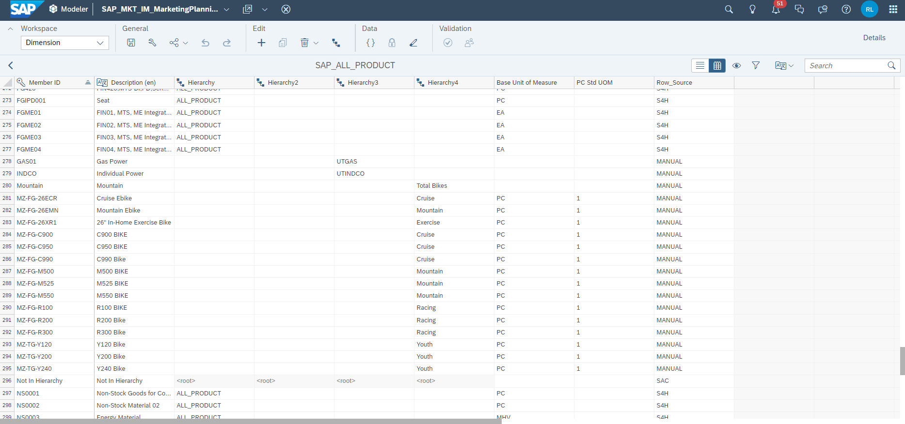
  
- The property `Base Unit of Measure` must be maintained inside the data modeler and shows the base unit of the measure. For the products used in the demo data, all items have the base unit `PC` which translates to `Piece`.
- The property `PC Std UOM` complements the property `Base Unit of Measure` by telling how many pieces are covered by one `PC` unit. All bike products have a `PC Std UOM` of `1`, which means that one `PC` translates to exactly `1` bike. 
- The property `Row_Source` shows where the master data comes from. Some products might be imported from a source system like **SAP S/4HANA** while others might be created manually. All bike data was created manually and thus these items are marked as `MANUAL` inside this property. 

**Marketing Campaign**

- The dimension `SAP_MKT_MarketingCampaign` is a private dimension which exists only inside the data model.
- This dimension is used to store different marketing campaigns which are created in the **Marketing Campaign Planning** story. 
- The dimension comes with two hierarchies. 
- The hierarchy `All Campaigns` is used to display all existing campaigns, both active and inactive ones. 
- The hierarchy `Active Campaigns` is used to display only active campaigns as the name indicates.
- The properties `Start Date` and `End Date` define the validity period of each campaign and are maintained from inside the **Marketing Campaign Planning** story.
- The property `Campaign Status` shows the current status of the campaign and is also maintained from inside the **Marketing Campaign Planning** story.
- The property `Objective` describes the goal of the campaign and is also maintained from inside the **Marketing Campaign Planning** story.
- The property `Company Code` is created for technical reasons and is maintained automatically when a campaign is created from inside the **Marketing Campaign Planning** story.
- The properties `Campaign Spend Amount` and `Campaign Uplift Percentage` store the respective numbers and are automatically updated by the **Marketing Campaign Planning** story.
- The properties `Expense Start Date` and `Expense End Date` are also maintained from inside the **Marketing Campaign Planning** story and show when expenses are expected to occur for a specific campaign.
- The property `Comment` is also maintained from inside the **Marketing Campaign Planning** story and shows user generated comments related to a specific campaign.
- 
The property <code>Deleted</code> shows whether a campaign was deleted and is maintained from inside the <strong>Marketing Campaign Planning</strong> story.

  
    <!-- border; size:540px -->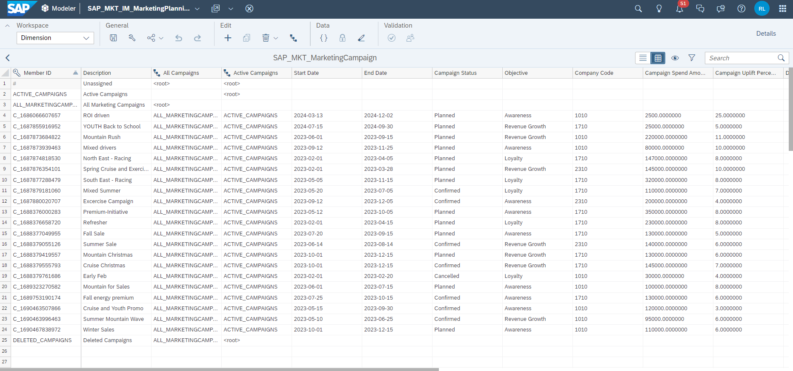

**Marketing Activity**

- The dimension `SAP_MKT_MarketingAtivity` is a private dimension which exists only inside the data model.
- This dimension is used to store different marketing activities which are created in the **Marketing Campaign Planning** story. 
- The dimension comes with two hierarchies. 
- The hierarchy `All Activity` is used to display all existing activities, both active and inactive ones. 
- The hierarchy `Active Activities` is used to display only active activities as the name indicates.
- The property `Invoice Date` shows the date of the invoice in a `YYYY-MM-DD` format and is maintained from inside the **Marketing Campaign Planning** story.
- The property `Spend Type` shows what kind of marketing activity is planned and is maintained from inside the **Marketing Campaign Planning** story.
- The property `Campaign Id` shows the related campaign member ID as a marketing campaign can have multiple marketing activities related to it. The IDs maintained are the ones that can be found in the `SAP_MKT_MarketingCampaign` dimension.
- The property `Activity Spend Amount` stores the respective spend amount and is automatically updated by the **Marketing Campaign Planning** story.
- The property `Deleted` shows whether an activity was deleted and is maintained from inside the **Marketing Campaign Planning** story.
- The property `Activity Status` shows the current status of the activity and is also maintained from inside the **Marketing Campaign Planning** story.
- 
The property <code>Comment</code> is also maintained from inside the <strong>Marketing Campaign Planning</strong> story and shows user generated comments related to a specific activity.

  
    <!-- border; size:540px -->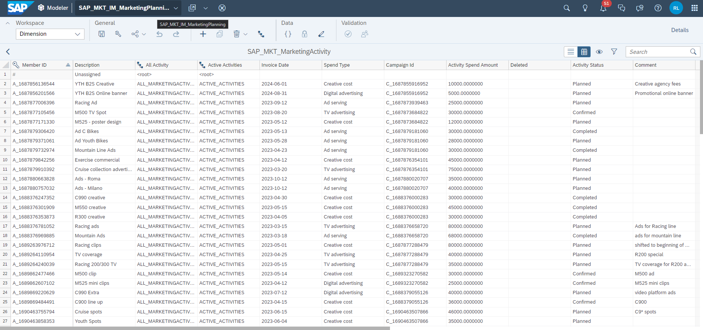

**Spend Type**

- The dimension `SpendType` is a private dimension which exists only inside the data model.
- 
This dimension is used to store different options of spend types which can be maintained in the property <code>Spend Type</code> of the <code>SAP_MKT_MarketingAtivity</code> dimension.

  
    <!-- border; size:540px -->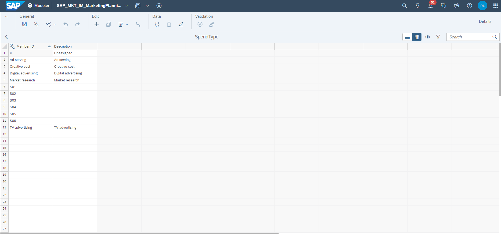

**Quantity Unit**

- The dimension `SAP_FI_IFP_QUANTITY_UNIT` is a shared public dimension and contains a list of different quantity units.
- This list serves as a sort of allowlist for possible units which can be maintained in the property `Base Unit of Measure` of the dimension `SAP_ALLPRODUCT`. 
- 
As mentioned earlier, for the demo data only the member ID <code>PC</code> was used.

  
    <!-- border; size:540px -->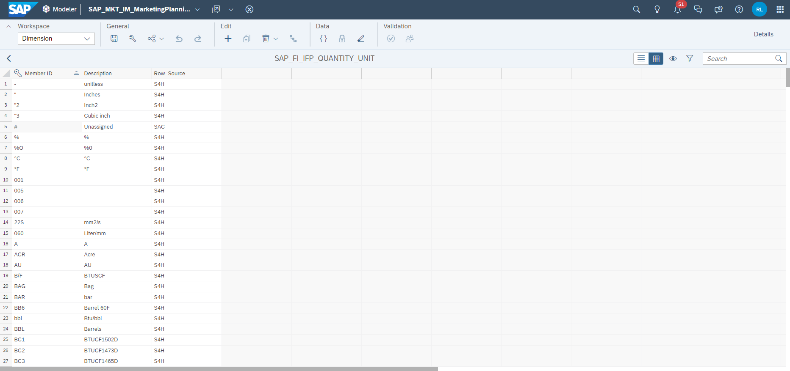

**Driver**

- The dimension `Driver` is a private dimension which exists only inside the data model.
- This dimension is used to differentiate different components or sources of quantities, revenues and costs. 
- The member `baseLine` is used to store all baseline quantities coming from the source system **SAP Integrated Business Planning**. By taking the price and the COGS rates which are stored on the driver member `#`, baseline revenues and costs are calculated and stored on the member `baseLine` as well. Eventually, this member stores the baseline quantity, baseline revenue and the baseline costs.
- The member `campaignLift` is used to store incremental quantities, revenues and costs which come from planned marketing campaigns and activities. 
- The member `consumerTrend` is used to store incremental quantities, revenues and costs which come from assumptions made about the consumer trend.
- The member `marketShare` is used to store incremental quantities, revenues and costs which come from estimated changes based on the market share.
- The member `priceImpact` is used to store incremental quantities, revenues and costs which result from price changes. 
- 
The sum of all members represents the total planned revenue or respectively the total costs and quantities.

  
    <!-- border; size:540px -->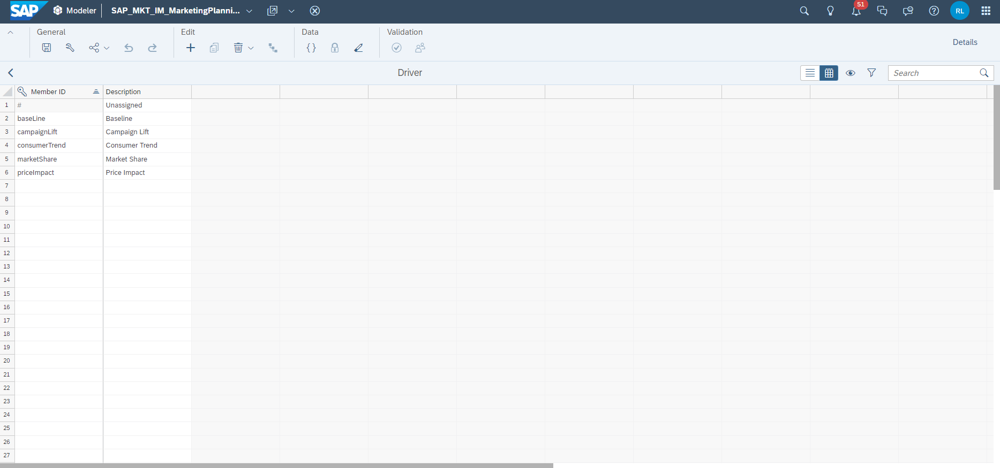

**Plant**

- The dimension `SAP_ALL_PLANT` is a shared public dimension and contains a list of different plants where a product comes from.
- The dimension has one hierarchy only which is used throughout the entire content respectively.
- The property `Company Code` shows the assignment of the plant to a company code, as a company code may have multiple plants. 
- 
Different plants may have different COGS rates, baseline quantities, revenues etc. - but in the scope of this content package, planning does not occur on plant level explicitly as the plant dimension itself is not included in the planning tables. The dimension is rather present in the background and entered planning assumptions are distributed across the respective plant members automatically.

  
    <!-- border; size:540px -->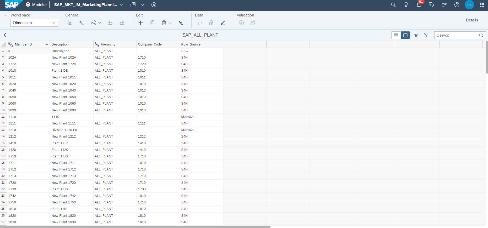
  
    >INFORMATION:
    >
    - Let us assume you have a product called `Mountain Bike` in company code `Germany` with a baseline quantity of `900`. 
    - Out of those `900` bikes, `300` units come from plant `Munich` while `600` units come from plant `Berlin`. 
    - In the planning table itself, you would not be able to see any plant related information as planning in the context of this content package occurs on a company code and product level only. 
    - As a result, you would only see the value of `900` units in the planning table. 
    - If you now increased the value from `900` units by `25 %` to a value of `1200` units, the baseline quantity for plant `Munich` will automatically adjust from a value of `300` units to `400` units and for plant `Berlin` from `600` units to `800` units.
    

**Company Code**

- The dimension `SAP_ALL_COMPANY_CODE` is a shared public dimension and contains a list of different company codes.
- The public dimension comes with three pre-defined hierarchies. In this content package, the default hierarchy with the ID `Hierarchy` is used across all stories. 
- This dimension is also used to derive the currencies for each company code. 
- The property `Currency` is used to define the currency used for a specific company code.
- The property `Country` is used to translate the company code to a specific country and must be maintained inside the data model. 
- The property `Trading Partner` is used to define the trading partner and must be maintained inside the data model, while the trading partner is specific by using an existing company code member ID.
- 
None of these properties apart from the <code>Currency</code> property are important for the scope of this content package.

  
    <!-- border; size:540px -->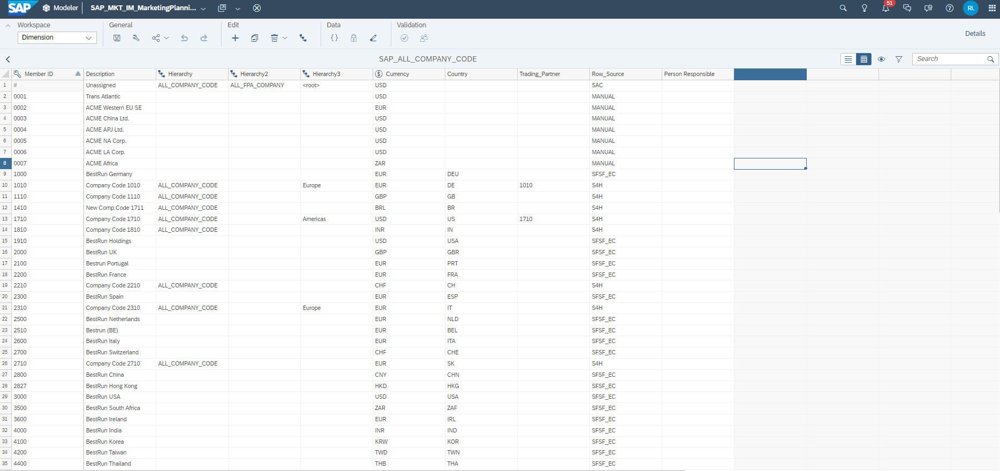

That's it for the dimensions! You may jump to the next step to learn about the measures of this data model.

### Introduction to Measures
In this step you will learn about the measures of the data model and what they are used for. 

Generally you can differentiate between base measures and calculated measures as the data model contains both. In order to understand how this content package works, it is sufficient to look at the base measures only as most of the calculated measures were specifically designed to address one particular use case only, for instance in order to bypass filter settings in a table widget in order to still show a number despite not matching the filter criteria. But more about this topic later, let's start with the base measures first. 

**Revenues and Costs**

- Revenues and costs are stored on the measure `AMOUNT`.
- The measure `AMOUNT` of type `decimal` is a currency measure which derives its currency from the company code dimension `SAP_ALL_COMPANY_CODE` by reading from the property `Currency`.
- In order to differentiate whether a value stored on the measure `AMOUNT` is a revenue or a cost measure, you need to take into consideration the G/L Account dimension as well. 
- If the value is stored on a member of the **Gross Revenue** Account `FPA1/022`, the value is considered to be a revenue as all these account members are of type `INC` (income). 
- If the value is stored on a member of the **Sales Deductions** Account `FPA1/023` or **Cost of Goods Sold** Account `FPA1/021`, the value is considered to be cost as all account members are of type `EXP` (expense).
- Other members outside the **Gross Revenue** Account `FPA1/017` are not represented in the demo data, but the core concept remains the same.
- By taking into consideration the driver dimension `Driver` in addition to that, you can even identify the revenue and cost portions which come from different streams, such as revenues and costs coming from assumptions made about market share changes or revenues and costs which come from campaign planning assumptions etc. 
  
>INFORMATION:
>
If you do not know if an account is considered to be of type `INC` (representing an income account) or `EXP` (representing an expense account), simply go into the data modeler and access the dimension `SAP_FI_XPA_GLAccount`. Each account has an attribute which tells you the type of a particular account or account node. 

**List Price and COGS rates**

- The list prices and COGS rates per product are stored on the measure `PRICE`.
- The measure `PRICE` of type `decimal` uses an exception aggregation of type `Average` across the dimensions `Date` and `SAP_ALL_PRODUCT` so the prices will not be aggregated on a node level in table widgets, but it will rather be displayed as an average.
- Same as with the `AMOUNT` measure, it derives its currency from the company code dimension `SAP_ALL_COMPANY_CODE` by reading from the property `Currency`.
- Whether the value stored on the `PRICE` measure is a list price or a COGS rate can be identified by taking into consideration the G/L Account dimension.
- If the value is stored on a member of the **Gross Revenue** Account `FPA1/022`, the value is considered to be a list price as all these account members are of type `INC`. 
- If the value is stored on a member of the **Cost of Goods Sold** Account `FPA1/021`, the value is considered to be a COGS rate as all account members are of type `EXP`.
  
>INFORMATION:
>
- In the demo data, list prices are only stored on one member of the **Gross Revenue** Account `FPA1/022`, which is the account **Revenue Domestic - Product** `41000000`. That is also why most of the data actions are hard coded to read list prices from this account, for instance in data actions where the revenue is calculated by multiplying quantities with the list price.
- What is also important to know is that other than revenues and costs, prices are always stored on the driver member **unassigned** `#` and are also planned on this driver. If you want to have your initial list price which came from the source system as a reference, you need to take a look at the version `PricesFromSource` instead of looking at the driver member `baseLine`. 

**Quantity**

- Quantities are stored on the measure `QUANTITY`.
- The measure `QUANTITY` of type `decimal` has its unit fixed to the unit type `Unit`.
- Similar to the list price, all quantities are stored on members of the G/L Account which have the type `INC`. In order to keep things easy, quantities are only stored on the account member **Revenue Domestic - Product** `41000000` in the demo data, equally to the list price. 
- What is different compared to the list price is that all baseline quantities which were loaded in from the source system **SAP Integrated Business Planning** are stored on the member of the driver dimension `baseLine` instead of `#`.
- Incremental quantities from other planning streams (or driver members to be precise) can be found on the other driver members respectively.
  
>INFORMATION:
>
- While the Driver dimension plays an important role for differentiating the different components of quantities, revenues and costs, the version `Financial Target` stores everything on the driver member `#`.
- This is because the financial target is considered to be an externally fed-in budget and does not take into consideration targets for different streams, but rather represents an overall budget target from upper management or the financial department. 
- The driver dimension is only relevant for planning purposes, which is important for the versions `Plan` and `Budget`, whereas `Financial Target` is a sole reporting or reference version.
- In addition to that it is important to keep in mind that while imported baseline quantities are stored on the member `baseLine` of the `Driver` dimension, they can still be changed in the **Marketing Demand Planning** story. This means that you will lose information about the initially imported baseline quantities as you are able to manipulate values stored on `baseLine`. Thus if you want to maintain the original values imported from **SAP Integrated Business Planning**, you will need to create an additional reference Version prior to beginning your planning operation.

**Impact Percentage**

- The measure `IMPACT_PERCENTAGE` is a plannable measure of type `decimal` which uses an exception aggregation of type `Average` across the dimensions `Date` and `SAP_ALL_PRODUCT` scaled in `Percent`.
- It is used to plan the incremental quantity as a percentage which comes on top to the baseline quantity.
- Generally, you do not plan incremental quantities as absolute values in this content package. You would rather have to plan whether you expect the quantity to increase or decrease based on what is provided as `baseLine` by entering percentage values.
- The `IMPACT_PERCENTAGE` is stored on the exact same combination of dimensions as the `QUANTITY`, using both G/L Account and driver to identify which quantity and for which stream you expect the quantity to increase or decrease.
- In the demo data, quantities are stored on the G/L Account **Revenue Domestic - Product** `41000000` for instance. If you add the `Driver` dimension to the table, you could now add percentage numbers for the other driver members (apart from `#` and `baseLine`, as the baseline is what has been initially loaded in and `#` does not contain data for quantity) and hit a data action inside the planning stories to calculate the incremental quantity per driver as a result. 

**Prorated Revenues**

- The measure `PRORATED_AMOUNT_BASELINE` of type `decimal` is a currency measure which derives its currency from the company code dimension `SAP_ALL_COMPANY_CODE` by reading from the property `Currency`.
- All points that have been mentioned for the `AMOUNT` measure apply here as well.
- The only difference to the `AMOUNT` measure is that this measure is only used in combination with marketing campaigns and only stores revenues, but not costs. 
- Whenever you create a marketing campaign, you can define a start date and end date in a `DD-MM-YYYY` format. If you decide to start your campaign mid of the month, for instance on `15-04-2023`, the campaign will cover only 50 % of the month as a result, as the month of April has 30 days in total, but only 15 days are effectively left to be planned. 
- While the measure `AMOUNT` will now represent the revenues for the whole month, the measure `PRORATED_AMOUNT_BASELINE` will represent the correct value for the campaign under consideration of the remaining days of a month, being 50 % of the value stored on `AMOUNT` as only 50 % of the month of April are left. 

**Prorated Quantity**

- The measure `PRORATED_QUANTITY_BASELINE` of type `decimal` has its unit fixed to the unit type `Unit`.
- All points that have been mentioned for the `QUANTITY` measure apply here as well.
- The logic behind this measure is precisely the same as for the measure `PRORATED_AMOUNT_BASELINE` - with the only difference that this measure represents quantities instead of revenues.

**Prorated Costs**

- The measure `PRORATED_AMOUNT_BASELINE_EXP` of type `decimal` is exactly the same as the measure `PRORATED_AMOUNT_BASELINE`, with the only difference being that this measure stores prorated costs instead of revenues.
- The reason why revenues and costs are stored on separate measures is because in the course of the campaign planning process, you have the possibility to define different start dates and end dates for expected revenues and costs.
- Let us assume that you plan a campaign which is supposed to start mid of April 2023 (`15-04-2023`). While expenses are most likely to start occurring on the date the campaign is launched, revenues will probably come in with a delay. 
- By having two separate measures, you can model exactly this behaviour. For the expenses, you can then use the measure `PRORATED_AMOUNT_BASELINE_EXP` with the start date `15-04-2023`, while for the expected revenue you can take the measure `PRORATED_AMOUNT_BASELINE` with a later start date, for instance `29-04-2023` if you expect the revenues to flow in with a two week offset. 

**Prorated Quantity relevant for Expenses**

- The measure `PRORATED_QUANTITY_BASELINE_EXP` of type `decimal` is exactly the same as the measure `PRORATED_QUANTITY_BASELINE`, with the only difference being that this measure takes into consideration the respective start date and end date for expenses.

**Allocation Driver**

- The measure `ACT_ALLOC_DRIVER` of type `decimal` scaled as `Percent` is a technical measure which is only used for recalculation purposes for marketing campaigns and activities in case the baseline quantity has changed. 
- It is used to persist the ratio used for the calculation of prorated measures. If for instance your campaign is supposed to start mid of April 2023 (`15-04-2023`), it will persist a value of `50 %` so the ratio does not have to be calculated in the course of the overall recalculation again.

**User Selection**

- The measure `ACT_USER_SELECTION` of type `Integer` is another technical measure used in the context of campaign planning.
- When you plan a marketing campaign in the **Marketing Campaign Planning** story, you are asked to select the products that are affected by the campaign. 
- For each product selected, a `1` is persisted on the measure `ACT_USER_SELECTION`. This way the application knows what products were selected for this specific campaign.
  
### Data Storage
In this step you will learn how data is stored in the data model.
As the way data is stored varies depending on the version, we will take a look at it version by version. 
For simplicity reasons, we will not take a look at the real demo data but instead use the following spreadsheet:

<!-- border; size:540px -->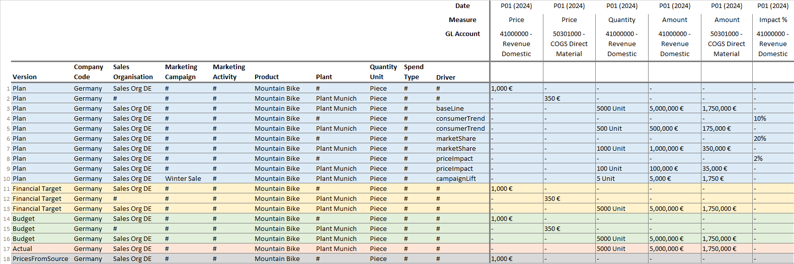

**Plan**

- Let us begin with the most important but also most complex version, which is the `Plan` version. 
- As you have learned in **Step 1**, the version `Plan` is where you enter most of your planning assumptions. 
- In the first line you can see how list prices are stored in this version. List prices are always stored on a combination of `Company Code`, `Sales Organisation`, `Product` and `Quantity Unit`.
- The `Quantity Unit` is always fixed to the member `Piece` across the entire package while the other dimensions are set to `#`, which means that the list price is completely independent of the `Driver` dimension. 
- In addition to that the list price is always stored on the measure `Price` with the G/L Account `41000000`. Naturally, it could be any G/L Account of type `INC`, but in this content package we only use one single G/L Account which is the account with the member ID `41000000`.
- The second line shots how COGS rates are stored. COGS Rates reside on the exact same combination of dimensions as list prices, with the only difference that COGS rates have a `Plant` assigned but in exchange, do not have a `Sales Organisation`. 
- This is because the product cost model where COGS rates are imported from does not have the `Sales Organisation` as part of the data model and thus this information is not available. As a result, COGS rates reside on the `Sales Organisation` member **unassigned** `#`.
- The third line shows how baseline quantities are stored. As you have learned, baseline quantities are imported from **SAP IBP** while revenues and costs are not imported, but calculated inside the content package. 
- Generally the baseline quantity is stored on a combination of `Company Code`, `Sales Organisation`, `Product`, `Plant`, `Driver` and `Quantity Unit`, while the `Quantity Unit` is fixed to the member `Piece` and the `Driver` dimension is set to `baseLine`. 
- In order to derive the total revenue and total costs for the baseline quantity, the number residing on the `Driver` member `baseLine` is multiplied by the COGS rates and list prices shown in the previous lines. Afterwards the results are stored on the same record as the baseline quantity as you can see.
- In lines 4 to 10 you can then see how numbers are stored for the other drivers. Let us first take a look at lines 4 and 5, which show how numbers for the consumer trend driver are stored. 
- As already mentioned before, you cannot plan total quantities or revenues on a driver level in this content package. What you can do is plan the `Impact Percentage` though, which is a percentage number saying by how much percent the baseline quantity is estimated to go up or down. 
- Let us assume that you think that based on consumer trend statistics, your baseline quantity is estimated to increase by 10 %. When you enter this assumption in the story **Marketing Demand Planning**, it will eventually be persisted on the combination of `Company Code`, `Sales Organisation`, `Product`, `Driver` and `Quantity Unit`, while again the `Quantity Unit` is fixed to the member `Piece` and the driver to the respective member, which in this case would be `consumerTrend`.
- The resulting incremental quantity and the respective revenues and total costs are then stored on a combination of `Company Code`, `Sales Organisation`, `Product`, `Plant`, `Driver` and `Quantity Unit` - exactly the same as it is the case for the baseline quantities, revenues and costs. The Data Action which is responsible for the calculation simply takes your assumed 10 % and multiples it by the baseline quantity. The result is written on the respective driver member while the plant is derived from the record where the baseline quantity is residing. 
- The exact same concept applies for the drivers `marketShare` and `priceImpact`.
- Only the driver `campaignLift` is handled differently. Here, you do not enter an impact percentage as part of your planning assumptions, but rather provide the expected uplift as an input manually. Thus no record for the measure `Impact Percentage` exists for the `campaignLift` driver. Nonetheless, quantities, revenues and costs are stored on the same combination as the other drivers with one exception - it does have a marketing campaign member other than `#` assigned to it as you can see in line 10 as this driver is designed to specifically store planning assumptions for marketing campaigns. 
- In the demo data set, data in this version can be found from the year `2023` to `2025`.

**Financial Target**

- Let us continue with the version `Financial Target`.
- The `Financial Target` version is not plannable in this content package and only serves as a reference version for reporting purposes as mentioned.
- List prices and COGS rates are stored on the exact same combination as it is the case in the `Plan` version.
- The same applies for quantities, revenues and costs, but with one major difference.
- As the numbers stored on this version represent a high-level budget, no differentiation between different drivers is made. As a result, absolutely all records on this version are stored on the driver member `#`. 
- In the demo data set, data in this version can be found from the year `2023` to `2025`.

**Budget**

- On the `Budget` version, data is stored exactly the same as on the `Financial Target` version.
- Initially, the budget version is empty. It is initialized from within the story **Marketing Budget Planning** by creating a copy of the `Financial Target` version.
- The only difference between these versions is that the budget version is plannable and that it is of type `Budget` instead of `Planning`.
- But in terms of how data is stored, it is precisely the same. 
- In the demo data set, this version is initially empty and must be initialized from within the **Marketing Budget Planning** story.

**Actual**

- Data stored on the `Actual` version is also stored the same way as on `Financial Target`, where no differentiation between drivers is made. 
- What is different here though is that the actual version contains data on the sales rebates account member in addition to COGS, revenues and prices. 
- In the demo data set, data in this version can be found from `Q1 2023` to `Q2 2023`.

**Prices From Source**

- The version `pricesFromSource` stores the initially imported list prices from **SAP S/4HANA** and serves as a reference and backup version.
- As you can see, list prices are stored on the same record as it is the case in other versions.
- In the demo data set, data in this version can be found from `2023` to `2025`.

### Final Remarks
Congratulations! You have finished the tutorial.

If you want to learn more about the modules of this content package, check out the following tutorials:

- [xP&A Commercial Planning - Get to know the Sales Planning module](xpa-sac-cxsp-salesplanning-gettoknow)
- [xP&A Commercial Planning - Get to know the Portfolio Planning module](xpa-sac-cxpp-portfolioplanning-gettoknow)
- [xP&A Commercial Planning - Get to know the Marketing Planning module](xpa-sac-cxmp-marketingplanning-gettoknow)

If you want to customize the content and adjust it according to your own business requirements, the following resources might be helpful:

- [xP&A Commercial Planning - Understanding the technical structure of Stories](xpa-sac-cx-technical-structure-of-stories)
- [xP&A Commercial Planning - Data Integration](xpa-sac-cx-data-integration-setup)
- [xP&A Commercial Planning - Manage data loads](xpa-sac-cx-manage-data-loads)
- [xP&A Commercial Planning - Add additional sections to a story](xpa-sac-cx-add-new-sections-to-app)
- [xP&A Commercial Planning - Add an additional story to the Navigation Menu](xpa-sac-cx-add-new-story-to-navmenu)
- [xP&A Commercial Planning - Customize Default Settings](xpa-sac-cx-customize-default-settings)
- [xP&A Commercial Planning - Customize Table Settings Dialogue](xpa-sac-cx-customize-table-settings-dialogue)
- [xP&A Commercial Planning (Marketing) - Add a new Driver](xpa-sac-cxmp-add-new-driver)
- [xP&A Commercial Planning (Marketing) - Add a new Version](xpa-sac-cxmp-add-new-version)
- [xP&A Commercial Planning (Marketing) - Extend campaign and activity attributes](xpa-sac-cxmp-add-new-attributes)
- [xP&A Commercial Planning (Marketing) - Extend activity spend dates](xpa-sac-cxmp-extend-activity-dates)
- [xP&A Commercial Planning (Sales) - Add a new Version](xpa-sac-cxsp-add-new-version)
- [xP&A Commercial Planning (Sales) - Add a new Tactic](xpa-sac-cxsp-add-new-tactic)
- [xP&A Commercial Planning (Sales) - Add a new Spend Type](xpa-sac-cxsp-add-new-spendtype)

If you want to get an overview of the entire xP&A Commercial Planning content package, make sure to check out the Mission.

Interested in more xP&A topics and related business content packages? Visit our community page [Extended Planning & Analysis Business Content](https://community.sap.com/topics/cloud-analytics/planning/content).
