## You will learn

- how to extend all of the involved components for the marketing campaign planning in order to allocate activity costs across multiple periods
- how to add additional properties to SAP Analytics Cloud dimensions
- how to change user interface elements in SAP Analytics Cloud stories
- how to change script functions in SAP Analytics Cloud stories
- how to adapt data actions SAP Analytics Cloud SAC

## Prerequisites

- Have an SAP Analytics Cloud tenant available with Planning enabled and a user with admin rights for it
- Import the xP&A Commercial Planning content as described in [xP&A Commercial Planning - Get to know the Marketing Planning module](xpa-sac-cxmp-marketingplanning-gettoknow)

## Intro

In the default content for marketing campaign planning, when planning a marketing activity, the marketing activity spend is allocated to a particular period only which is derived from the user input entered in the invoice date field. This is how the activity form looks by default:

<!-- border; size:540px -->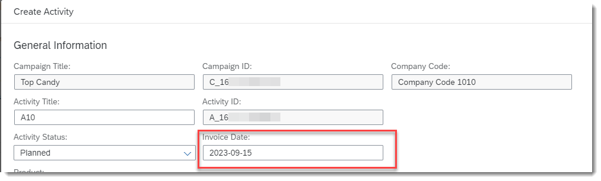

The activity spend is then allocated according to the individual products revenues chosen during activity creation.

<!-- border; size:540px -->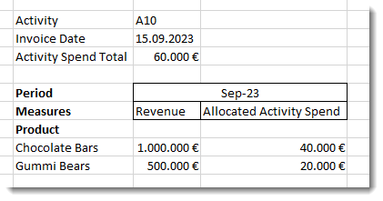

This tutorial will enable you to extend the concept to allocate marketing activity spend to a time period based on a start and end date provided by the user. The updated form will look like this:

<!-- border; size:540px -->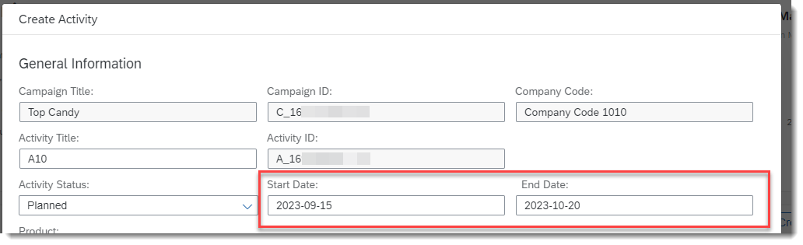

The activity spend is then split/allocated according to the prorated product revenues for each product according to the number of days of each involved period within the chosen time interval.

<!-- border; size:540px -->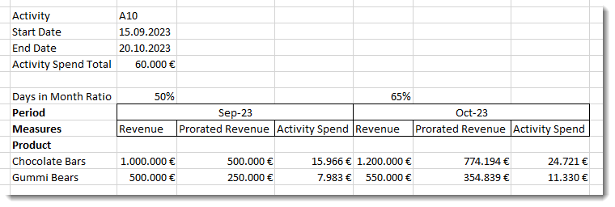

To achieve this you will need to go though all components of the content:

- Data model (attributes of marketing activity time dimension)
- UI (Story and Scripting)
- Data action (adjust to do the prorating and allocation across a time interval)

So let us get started.

### Update dimension properties of marketing activity dimension

Have a look at the properties of the dimension **Marketing Activity** (`SAP_MKT_CampaignActivity`). To store the start and end date for an activity entered by the user we will need to extend the properties for the marketing activity dimension.

Open the marketing planning model **Marketing Planning** (`SAP_MKT_IM_MarketingPlanning`), searching for it in the file browser of SAP Analytics Cloud.

<!-- border; size:540px -->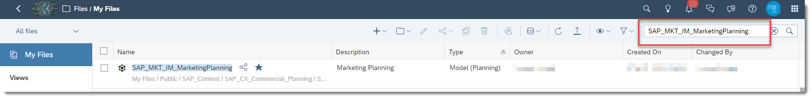

In the dimension on the left-hand side, click on the entry for **Marketing Campaign Activity** (`SAP_MKT_CampaignActivity`) to open the dimension details on the right-hand side.

<!-- border; size:540px -->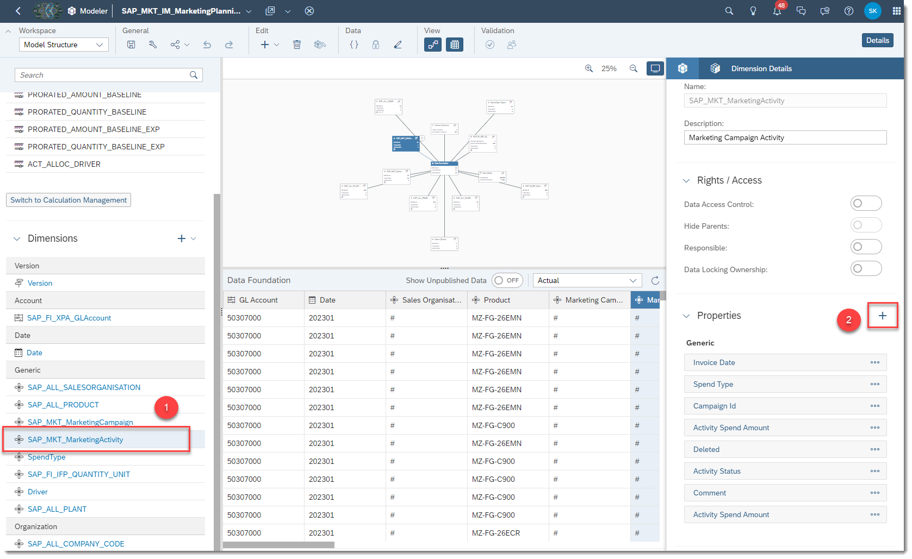

On the right-hand side in the Properties list, click on the "+" to add two new properties.

|  Id     | Description | Type | Length
|  :------------- | :------------- | :------------- | :-------------
|  `StartDate`   | Start Date | Text | 10
|  `EndDate`     | End Date | Text | 10

Enter the needed values and click on **Create** to close the property editor

<!-- border; size:540px -->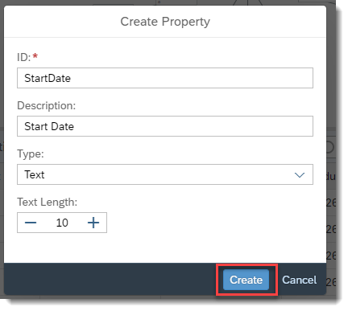

Repeat the same to add the property `EndDate`.

Once you are done, click the **Save** icon to save the model.

<!-- border; size:540px -->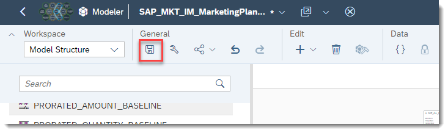

Now you have two properties to store the start and end date for the marketing activity.

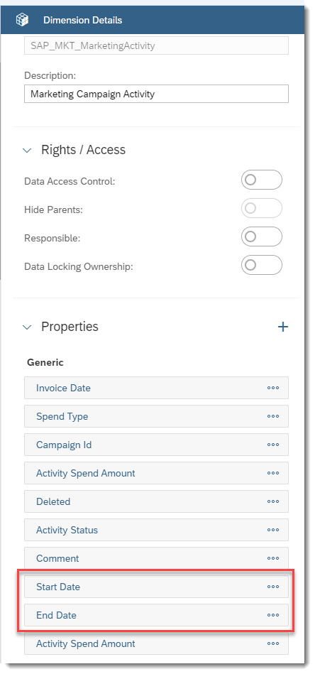

### Update data action for maintaining an activity

As a next step, you will need to adjust the data action that allocates the activity spend according to the start- and end dates entered. While the prorating is done according to the dates set as attributes of the marketing activity, the parameters are passed to the data action on a month/period level derived from these dates.

In the File explorer search for data action **Maintain Marketing Campaign Activity** (`SAP_MKT_IM_MarketingPlanning_MaintainActivity`) and open it. This is the data action that is being called when you create or edit a marketing activity.

<!-- border; size:540px -->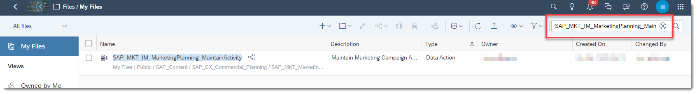

You will need to add additional parameters for the start and end period to the data action. Click on the parameter icon to open the list of parameters available for the data action.

<!-- border; size:540px -->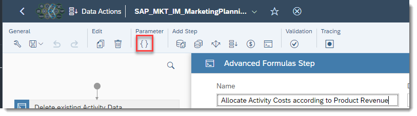

As the parameter for the `InvoiceDate` will not be needed anymore, change it to become the parameter for the start period.
Click on the change icon next to the parameter.

<!-- border; size:540px -->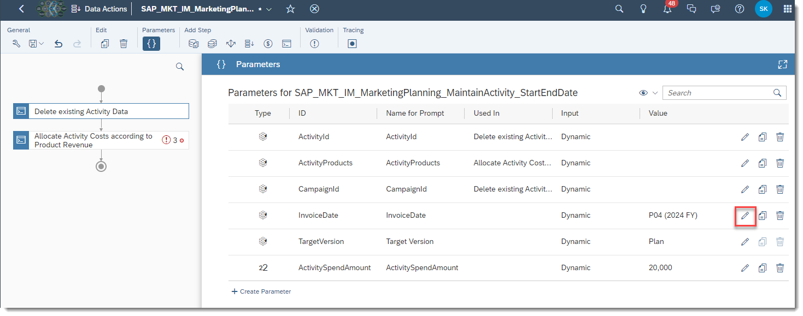

Change the `Id` and `Name for Prompt` field to `StartPeriod`. While you are here you can also remove the Default Member currently set to *P04.2024* by marking it with your mouse and pressing the `Delete/DEL` key on your keyboard.
Once you have made the changes click on **Done**.

<!-- border; size:540px -->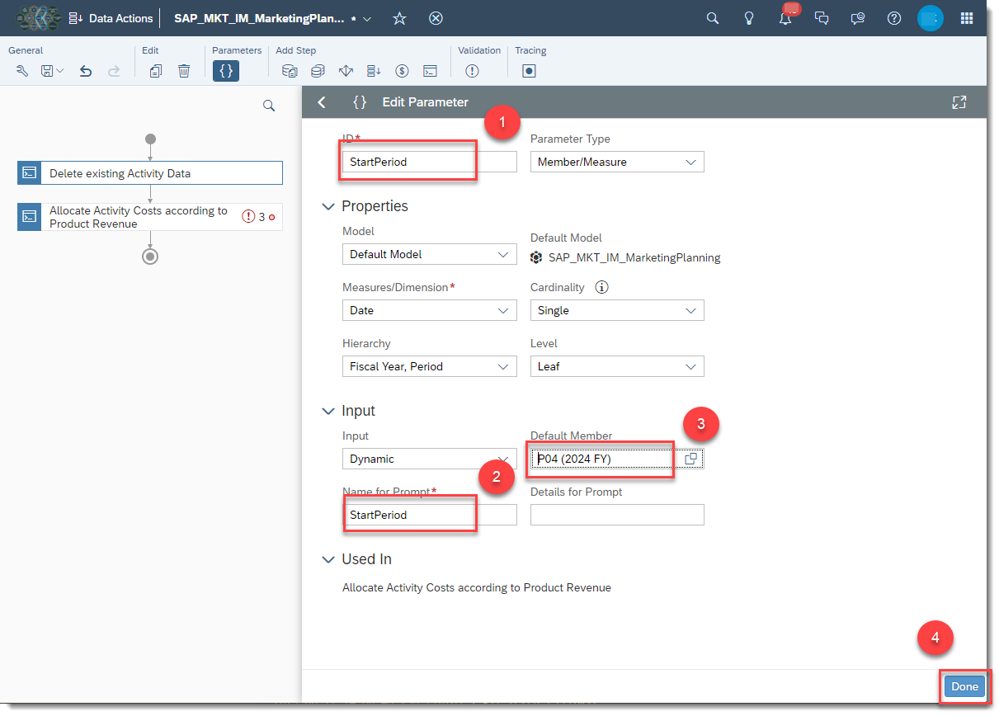

Now you will need to create a new parameter for the end date. Click on the **Create Parameter** below the parameter list.

<!-- border; size:540px -->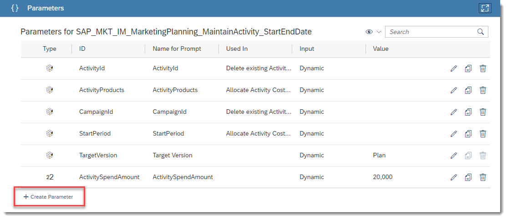

Enter the parameter details as follows and click on **Done** to save and close the new parameter.

<!-- border; size:540px -->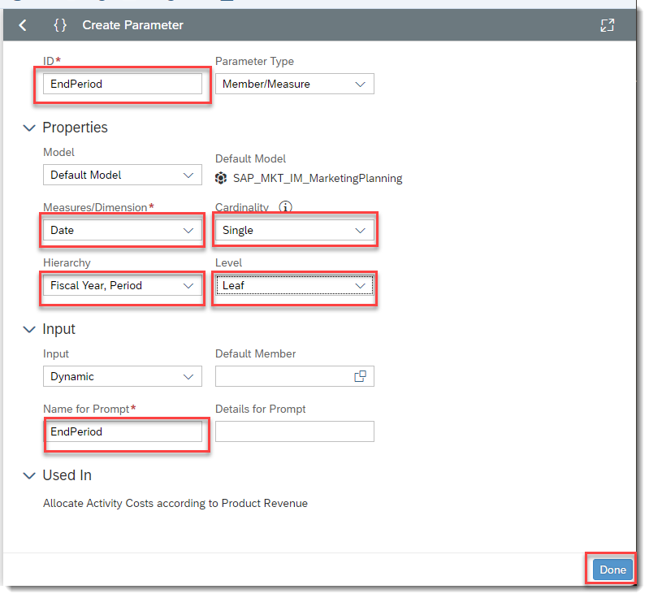

While you are looking at the parameter list you can also delete the parameter for the `ActivitySpendAmount` as we will use the ATTRIBUTE function in the updated version of the data action. Click on the **trash can** icon next to it to delete it.

<!-- border; size:540px -->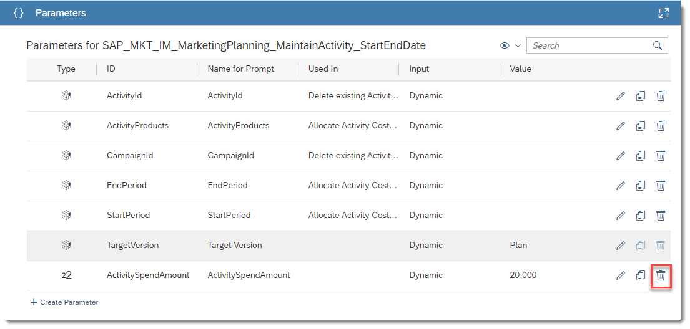

Now that you have the data action in place, make sure that these parameters are being used and the proration is set up correctly (similarly to the one for campaigns).

As this requires multiple changes across the second data action step, go ahead and click on the step called **Allocated Activity Costs according to Product Revenue** and replace everything in this step with the script provided below:

<!-- border; size:540px -->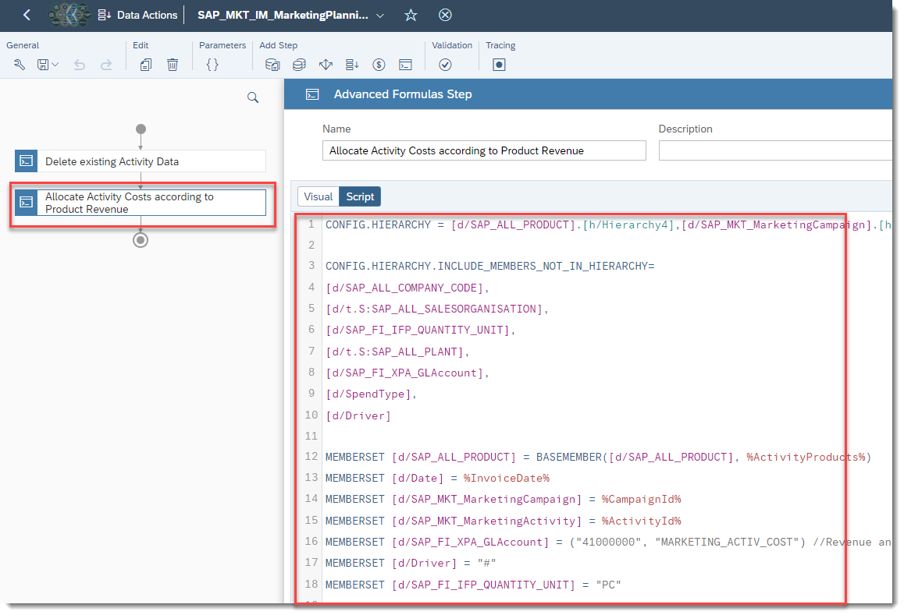

			CONFIG.HIERARCHY = [d/SAP_ALL_PRODUCT].[h/Hierarchy4],[d/SAP_MKT_MarketingCampaign].[h/Hierarchy2], [d/SAP_MKT_MarketingActivity].[h/Hierarchy2]

			CONFIG.HIERARCHY.INCLUDE_MEMBERS_NOT_IN_HIERARCHY= 
			[d/SAP_ALL_COMPANY_CODE],
			[d/t.S:SAP_ALL_SALESORGANISATION], 
			[d/SAP_FI_IFP_QUANTITY_UNIT],
			[d/t.S:SAP_ALL_PLANT],
			[d/SAP_FI_XPA_GLAccount],
			[d/SpendType],
			[d/Driver]

			MEMBERSET [d/SAP_ALL_PRODUCT] = BASEMEMBER([d/SAP_ALL_PRODUCT], %ActivityProducts%)
			MEMBERSET [d/Date] = %StartPeriod% To %EndPeriod%
			MEMBERSET [d/SAP_MKT_MarketingCampaign] = %CampaignId%
			MEMBERSET [d/SAP_MKT_MarketingActivity] = %ActivityId%
			MEMBERSET [d/SAP_FI_XPA_GLAccount] = ("41000000", "MARKETING_ACTIV_COST") //Revenue and Marketing Expenses
			MEMBERSET [d/Driver] = "#"
			MEMBERSET [d/SAP_FI_IFP_QUANTITY_UNIT] = "PC"
			MEMBERSET [d/Measures] = ("AMOUNT","ACT_USER_SELECTION","PRORATED_AMOUNT_BASELINE_EXP","ACT_ALLOC_DRIVER")

			VARIABLEMEMBER #TotalWeightedRevenue OF [d/Measures]

			// "Mark all products initially set by user for the activity
			DATA([d/Measures] = "ACT_USER_SELECTION",
					[d/SAP_ALL_COMPANY_CODE] = [d/SAP_MKT_MarketingCampaign].[p/CompanyCode],
					[d/t.S:SAP_ALL_SALESORGANISATION] = "#",
					[d/t.S:SAP_ALL_PLANT] = "#",
					[d/SAP_MKT_MarketingCampaign] = %CampaignId%,
					[d/SAP_MKT_MarketingActivity] = %ActivityId%,
					[d/SAP_FI_XPA_GLAccount] = "41000000",
				//	[d/SAP_ALL_PRODUCT],
				//	[d/Date],
					[d/SpendType] = "#",
					[d/Driver] = "baseLine",
					[d/SAP_FI_IFP_QUANTITY_UNIT] = "#") = 1

			// Store Driver for recalculation of all Activities with start- and end date
			DATA([d/Measures] = "ACT_ALLOC_DRIVER",
					[d/SAP_ALL_COMPANY_CODE] = [d/SAP_MKT_MarketingCampaign].[p/CompanyCode],
					[d/t.S:SAP_ALL_SALESORGANISATION] = "#",
					[d/t.S:SAP_ALL_PLANT] = "#",
					[d/SAP_MKT_MarketingCampaign] = %CampaignId%,
					[d/SAP_MKT_MarketingActivity] = %ActivityId%,
				//	[d/SAP_ALL_PRODUCT],
				//	[d/Date],
					[d/SAP_FI_XPA_GLAccount] = "MARKETING_ACTIV_COST",
					[d/SpendType] = "#",
					[d/Driver] = "#",
					[d/SAP_FI_IFP_QUANTITY_UNIT] = "#") = DATERATIO([d/SAP_MKT_MarketingActivity].[p/StartDate], [d/SAP_MKT_MarketingActivity].[p/EndDate], [d/Date])

			//Determine prorated Baseline Revenue	
				DATA([d/Measures] = "PRORATED_AMOUNT_BASELINE_EXP",
					[d/SAP_ALL_COMPANY_CODE] = [d/SAP_MKT_MarketingCampaign].[p/CompanyCode],
					[d/SAP_FI_XPA_GLAccount] = "41000000",
					[d/SpendType] = "#",
					[d/Driver] = "#") =

				Round( 
				// Baseline revenue for products	 
				RESULTLOOKUP([d/Measures] = "AMOUNT",
							[d/SAP_ALL_COMPANY_CODE] = [d/SAP_MKT_MarketingCampaign].[p/CompanyCode],
							[d/SAP_MKT_MarketingCampaign] = "#",
							[d/SAP_MKT_MarketingActivity] = "#",
							[d/SAP_FI_XPA_GLAccount] = "41000000",
							[d/Driver] = "baseLine",
							[d/SpendType] = "#")
							//All Products in Scope
							*
				//Date ratio driver per period	 
				RESULTLOOKUP([d/Measures] = "ACT_ALLOC_DRIVER",
						[d/SAP_ALL_COMPANY_CODE] = [d/SAP_MKT_MarketingCampaign].[p/CompanyCode],
						[d/t.S:SAP_ALL_SALESORGANISATION] = "#",
						[d/t.S:SAP_ALL_PLANT] = "#",
						[d/SAP_MKT_MarketingCampaign] = %CampaignId%,
						[d/SAP_MKT_MarketingActivity] = %ActivityId%,
						//	[d/SAP_ALL_PRODUCT],
						//	[d/Date],
						[d/SAP_FI_XPA_GLAccount] = "MARKETING_ACTIV_COST",
						[d/SpendType] = "#",
						[d/Driver] = "#",
						[d/SAP_FI_IFP_QUANTITY_UNIT] = "#"),3 )

			// Determine Total Weighted Revenue across all products/periods
			DATA([d/Measures] = #TotalWeightedRevenue,
				[d/SAP_ALL_PRODUCT] = "#",
				[d/Date] = %StartPeriod%,
				[d/SAP_ALL_COMPANY_CODE] = [d/SAP_MKT_MarketingCampaign].[p/CompanyCode],
				[d/t.S:SAP_ALL_SALESORGANISATION] = "#",
				[d/t.S:SAP_ALL_PLANT] = "#",
				[d/SAP_FI_XPA_GLAccount] = "41000000")
			= 
			RESULTLOOKUP([d/Measures] = "PRORATED_AMOUNT_BASELINE_EXP",
							[d/SAP_ALL_COMPANY_CODE] = [d/SAP_MKT_MarketingCampaign].[p/CompanyCode],
							[d/SAP_FI_XPA_GLAccount] = "41000000",
							[d/SpendType] = "#",
							[d/Driver] = "#")	

			// Allocate Activity Spend Amount to individual products/periods based on contribution to overall revenue
			DATA([d/Measures] = "AMOUNT",
				[d/SAP_ALL_COMPANY_CODE] = [d/SAP_MKT_MarketingCampaign].[p/CompanyCode],
				[d/SAP_FI_XPA_GLAccount] = "MARKETING_ACTIV_COST",
				[d/SpendType] = [d/SAP_MKT_MarketingActivity].[p/SpendType] ) =

			RESULTLOOKUP([d/Measures] = "PRORATED_AMOUNT_BASELINE_EXP",
							[d/SAP_ALL_COMPANY_CODE] = [d/SAP_MKT_MarketingCampaign].[p/CompanyCode],
							[d/SAP_FI_XPA_GLAccount] = "41000000") /

			RESULTLOOKUP([d/Measures] = #TotalWeightedRevenue,
				[d/SAP_ALL_COMPANY_CODE] = [d/SAP_MKT_MarketingCampaign].[p/CompanyCode],		 
				[d/SAP_ALL_PRODUCT] = "#",
				[d/Date] = %StartPeriod%,
				[d/t.S:SAP_ALL_SALESORGANISATION] = "#",
				[d/t.S:SAP_ALL_PLANT] = "#",
				[d/SAP_FI_XPA_GLAccount] = "41000000")

			* ATTRIBUTE([d/SAP_MKT_MarketingActivity].[p/ActivitySpendAmount])

Click on the **Save** icon to have your updated data action saved.

<!-- border; size:540px -->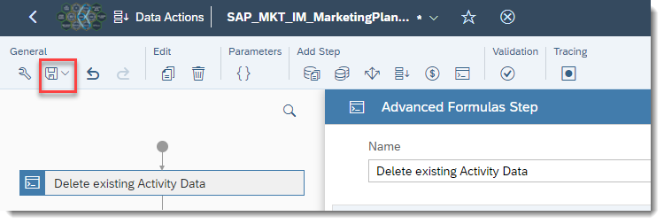

### Update data action for recalculation of all activities (optional)

**Do not skip this step**, in case you also use the **Marketing Demand Planning** story to plan total demand values which will have an effect on the baseline quantities as well as on the driver quantities like campaign lift, market share etc.

Changed baseline quantities and respective revenues might have an impact on the allocation of activity spend across products, hence after a change all activities will need to be recalculated. So you will also need to take care of the data action that recalculates all planned marketing activities to reconcile the spend across products.

Go into the File explorer and search for data action **Recalculate all activities** (`SAP_MKT_IM_MarketingPlanning_RecalculateActivities`).

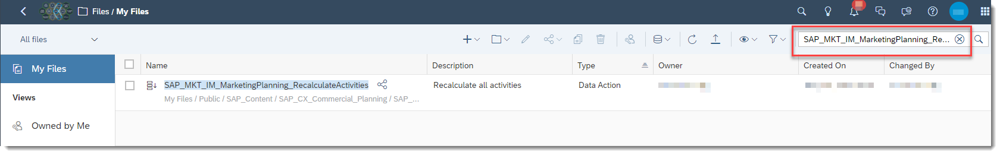

Click on the step **Recalculate all Activities** and replace the whole script in the editor with the one provided in the box below.

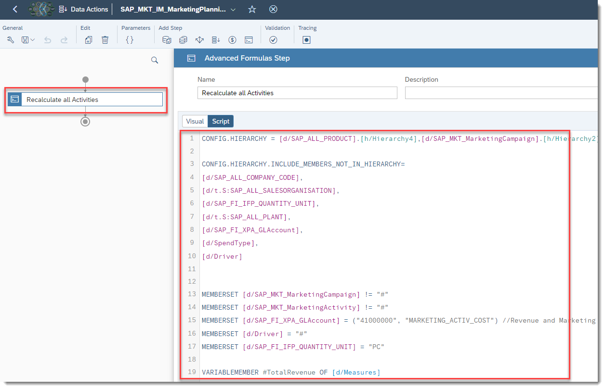

			CONFIG.HIERARCHY = [d/SAP_ALL_PRODUCT].[h/Hierarchy4],[d/SAP_MKT_MarketingCampaign].[h/Hierarchy2], [d/SAP_MKT_MarketingActivity].[h/Hierarchy2]

			CONFIG.HIERARCHY.INCLUDE_MEMBERS_NOT_IN_HIERARCHY= 
			[d/SAP_ALL_COMPANY_CODE],
			[d/t.S:SAP_ALL_SALESORGANISATION], 
			[d/SAP_FI_IFP_QUANTITY_UNIT],
			[d/t.S:SAP_ALL_PLANT],
			[d/SAP_FI_XPA_GLAccount],
			[d/SpendType],
			[d/Driver]

			MEMBERSET [d/SAP_MKT_MarketingCampaign] != "#"
			MEMBERSET [d/SAP_MKT_MarketingActivity] != "#"
			MEMBERSET [d/SAP_FI_XPA_GLAccount] = ("41000000", "MARKETING_ACTIV_COST") //Revenue and Marketing Expenses
			MEMBERSET [d/Driver] = "#"
			MEMBERSET [d/SAP_FI_IFP_QUANTITY_UNIT] = "PC"
			MEMBERSET [d/Measures] = ("AMOUNT","PRORATED_AMOUNT_BASELINE_EXP","ACT_ALLOC_DRIVER")

			VARIABLEMEMBER #myDate OF  [d/Date]
			VARIABLEMEMBER #TotalWeightedRevenue OF [d/Measures]

			//Determine weighted Baseline Revenue	
				DATA([d/Measures] = "PRORATED_AMOUNT_BASELINE_EXP",
					[d/SAP_ALL_COMPANY_CODE] = [d/SAP_MKT_MarketingCampaign].[p/CompanyCode],
					[d/SAP_FI_XPA_GLAccount] = "41000000",
					[d/SpendType] = "#",
					[d/Driver] = "#") =

				Round( 
				// Baseline revenue for products	  
				RESULTLOOKUP([d/Measures] = "AMOUNT",
							[d/SAP_ALL_COMPANY_CODE] = [d/SAP_MKT_MarketingCampaign].[p/CompanyCode],
							[d/SAP_MKT_MarketingCampaign] = "#",
							[d/SAP_MKT_MarketingActivity] = "#",
							[d/SAP_FI_XPA_GLAccount] = "41000000",
							[d/Driver] = "baseLine",
							[d/SpendType] = "#")
							//All Products in Scope
							*
				//date ratio driver per period	  
				RESULTLOOKUP([d/Measures] = "ACT_ALLOC_DRIVER",
						[d/SAP_ALL_COMPANY_CODE] = [d/SAP_MKT_MarketingCampaign].[p/CompanyCode],
						[d/t.S:SAP_ALL_SALESORGANISATION] = "#",
						[d/t.S:SAP_ALL_PLANT] = "#",
					//	[d/SAP_MKT_MarketingCampaign]
					//	[d/SAP_MKT_MarketingActivity]
					//	[d/SAP_ALL_PRODUCT],
					//	[d/Date],
						[d/SAP_FI_XPA_GLAccount] = "MARKETING_ACTIV_COST",
						[d/SpendType] = "#",
						[d/Driver] = "#",
						[d/SAP_FI_IFP_QUANTITY_UNIT] = "#"),3 )
				
			DATA([d/Measures] = #TotalWeightedRevenue,
				[d/SAP_ALL_COMPANY_CODE] = [d/SAP_MKT_MarketingCampaign].[p/CompanyCode],
				[d/t.S:SAP_ALL_SALESORGANISATION] = "#",
				[d/t.S:SAP_ALL_PLANT] = "#",
				[d/SAP_ALL_PRODUCT] = "#",
				[d/Date] = #myDate,
				[d/SAP_FI_XPA_GLAccount] = "41000000") =

			RESULTLOOKUP([d/Measures] = "PRORATED_AMOUNT_BASELINE_EXP",
							[d/SAP_ALL_COMPANY_CODE] = [d/SAP_MKT_MarketingCampaign].[p/CompanyCode],
							[d/SAP_FI_XPA_GLAccount] = "41000000",
							[d/SpendType] = "#",
							[d/Driver] = "#")		
			
			// Allocate Activity Spend Amount to individual products/periods based on contribution to overall revenue
			DATA([d/Measures] = "AMOUNT",
				[d/SAP_ALL_COMPANY_CODE] = [d/SAP_MKT_MarketingCampaign].[p/CompanyCode],
				[d/SAP_FI_XPA_GLAccount] = "MARKETING_ACTIV_COST",
				[d/SpendType] = [d/SAP_MKT_MarketingActivity].[p/SpendType] ) =

			Round(
			RESULTLOOKUP([d/Measures] = "PRORATED_AMOUNT_BASELINE_EXP",
							[d/SAP_ALL_COMPANY_CODE] = [d/SAP_MKT_MarketingCampaign].[p/CompanyCode],
							[d/SAP_FI_XPA_GLAccount] = "41000000",
							[d/SpendType] = "#",
							[d/Driver] = "#")	 /

			RESULTLOOKUP([d/Measures] = #TotalWeightedRevenue,
				[d/SAP_ALL_COMPANY_CODE] = [d/SAP_MKT_MarketingCampaign].[p/CompanyCode],
				[d/t.S:SAP_ALL_SALESORGANISATION] = "#",
				[d/t.S:SAP_ALL_PLANT] = "#",		 
				[d/SAP_ALL_PRODUCT] = "#",
				[d/Date] = #myDate,
				[d/SAP_FI_XPA_GLAccount] = "41000000")

			* ATTRIBUTE([d/SAP_MKT_MarketingActivity].[p/ActivitySpendAmount]) ,3)

Click on the **Save** icon to have your updated data action saved.

<!-- border; size:540px -->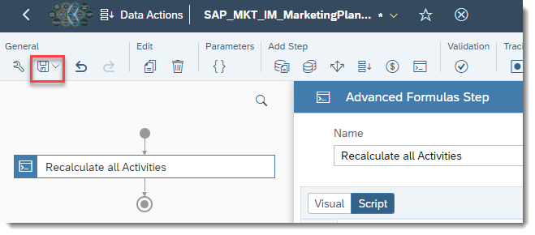

### Update activity input form to extend with additional field for end date

Now you need to do some work on the screen for the marketing activity form to cater for a start and end date input field.

Go to the file menu and search for the story **Marketing Campaign Planning** (`SAP_MKT_MarketingCampaignPlanning`).

<!-- border; size:540px -->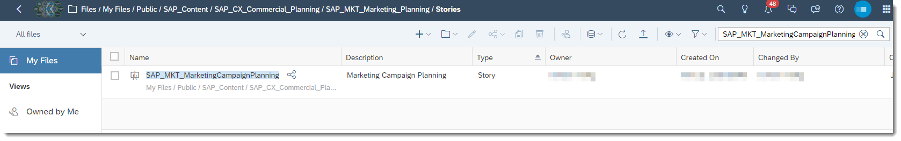

In case you want to try this out on a copy of the story, mark the checkbox left to the story and hit the **Copy** button on top. Provide a name for your story copy and have it saved. Now open the saved copy.

<!-- border; size:540px -->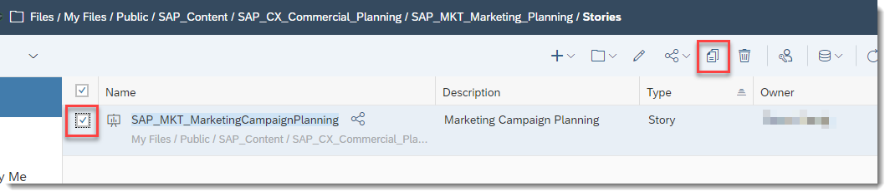

Switch to **Edit** mode so you can make changes to the story. In the **View** section click on button to **Left Display Panel** to display the outline panel on the left-hand side.

<!-- border; size:540px -->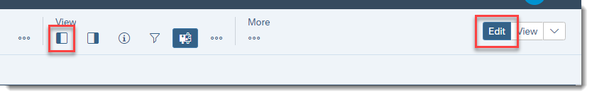

In the outline panel on the left-hand side locate the `dialog_maintainActivity` pop-up, which you will need to adjust. You will reuse the existing `Invoice Date` input field for the start date and duplicate it to have a second input field for the end date. For the second input field you can use the empty space right next to it (currently filled up with placeholder panel `d2_pnl_cs1_placeholder02`).

<!-- border; size:540px -->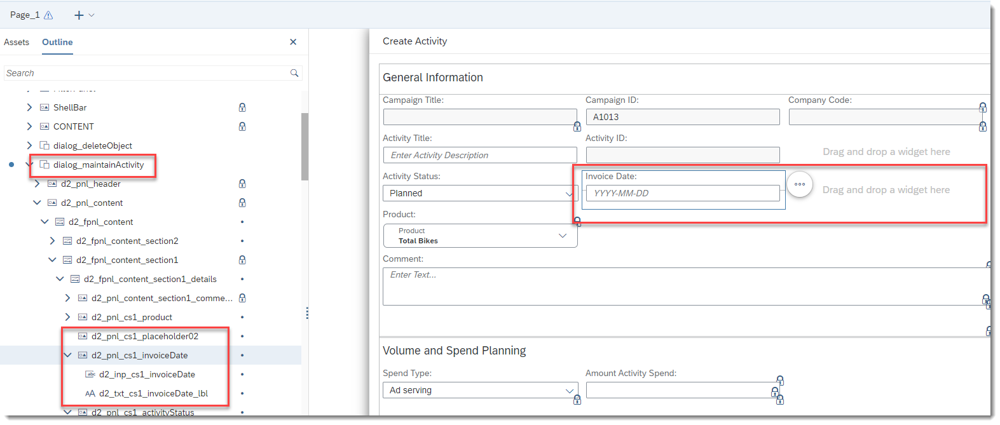

Start with the duplication, mark the panel `d2_pnl_cs1_invoiceDate` and in the **Edit** menu on top select option **Duplicate**.

<!-- border; size:540px -->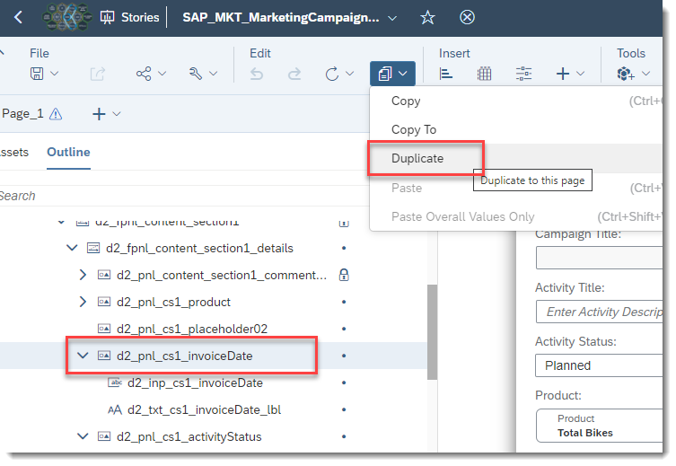

You will get a duplicate group containing a panel, the input field and the label field. Now drag this set below the placeholder panel `d2_pnl_cs1_placeholder02`.

<!-- border; size:540px -->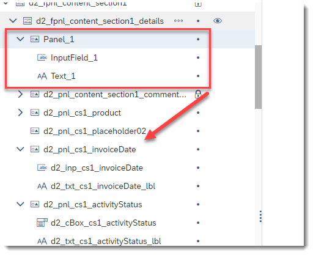

It should look like this.

<!-- border; size:540px -->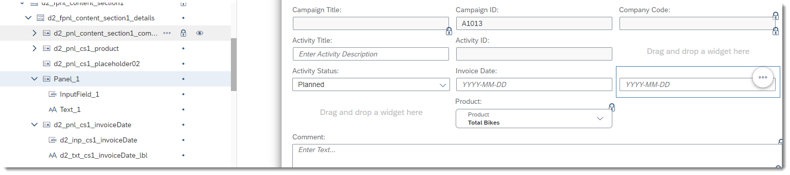

Delete the placeholder panel `d2_pnl_cs1_placeholder02` as it is not needed anymore and rename the two date input groups for start and end date (panel, input field and text) as follows:

|  Type     | Old Name | New Name
|  :------------- | :------------- | :------------- 
|  `Panel`       | `Panel_1`                    | `d2_pnl_cs1_endDate`
|  `Input Field` | `InputField_1`               | `d2_inp_cs1_endDate`
|  `Text`        | `Text_1`                     | `d2_txt_cs1_endDate_lbl`
|  `Panel`       | `d2_pnl_cs1_invoiceDate`     | `d2_pnl_cs1_startDate`
|  `Input Field` | `d2_inp_cs1_invoiceDate`     | `d2_inp_cs1_startDate`
|  `Text`        | `d2_txt_cs1_invoiceDate_lbl` | `d2_txt_cs1_startDate_lbl`

The only thing left to change is to add proper labels for start and end date to the form. Double click on the labels above the text boxes ( `d2_txt_cs1_startDate_lbl` and `d2_txt_cs1_endDate_lbl`) in the form UI and enter `Start Date` and `End Date` respectively.

After that your form should look like this.

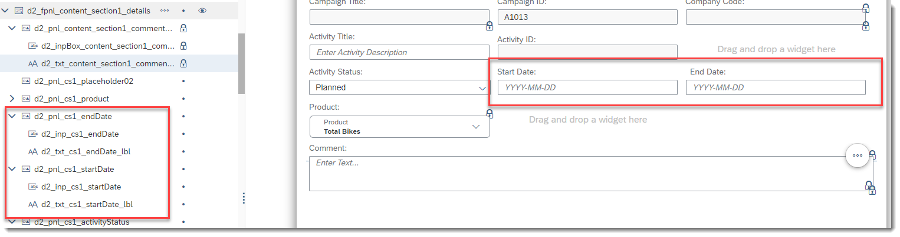

Great, now that you are done with the UI, head over to adapt the scripting part for it.

### Update the initialization of the marketing activity pop-up

The input fields for start and end date are being handled once when initializing the pop-up for creating or editing an activity, and once when saving an activity. In this step let us handle the initialization of the pop-up.

First, we will introduce two new global key/value pairs in the variable `cfg_activityAttr` for the two activity properties start and end date, so they can easily be addressed throughout the scripts. Click on the `fx` icon next to the story page object **Page_1** to edit the `onInitialization` function.

<!-- border; size:540px -->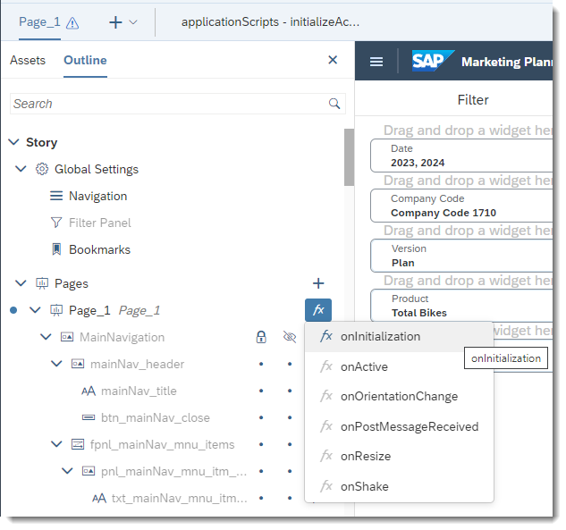

Search for the assignment of variable `cfg_activityAttr` and add two additional key/value pairs to it, so it looks like this.

<!-- border; size:540px -->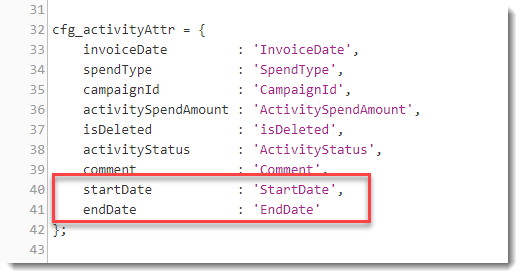

Once you are done, locate the function `initializeActivityPopUp` below the `applicationScripts` object and click on the `fx` icon to open it in the editor.

<!-- border; size:540px -->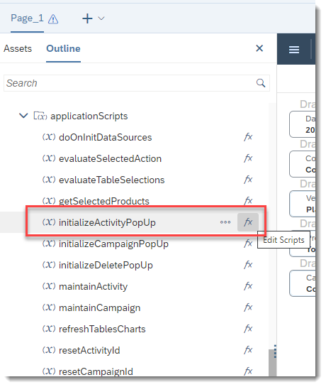

In the switch statement, there is a case block for creating a new activity. Within this block of code, you need to make sure the new input fields are properly initialized to empty strings (i.e., no value) when opening the pop-up.
Note that when you renamed the input field for invoice date to start date, the variable name had already been adjusted in this script automatically:

<!-- border; size:540px -->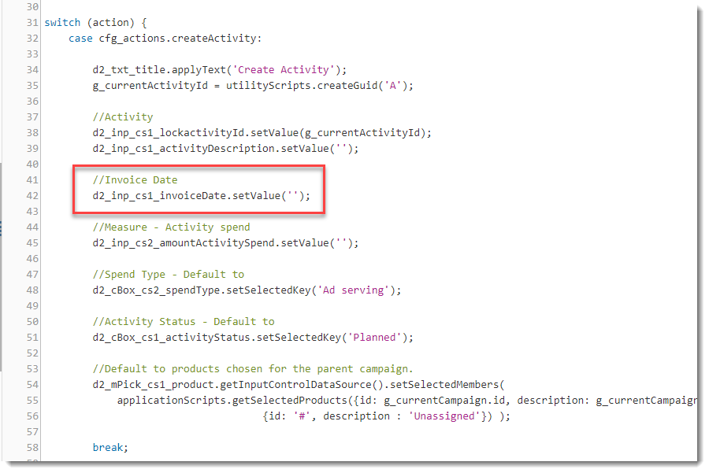

So you just need to add a line for initializing the end date input field (and update the comment).

<!-- border; size:540px -->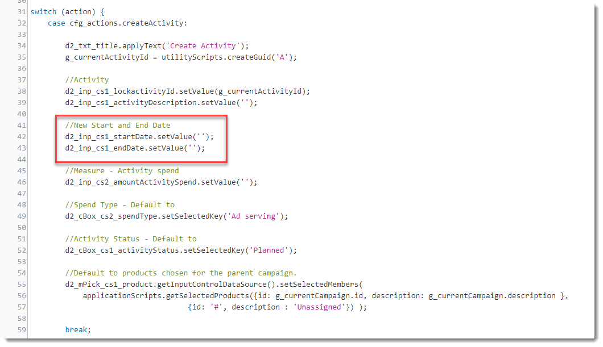

In the same switch statement, there is also a case block for editing an existing activity. Within this block of code, you need to make sure the new input fields for start and end date are properly filled from the activity properties. Initially it looks like this, still being filled from invoice date.

<!-- border; size:540px -->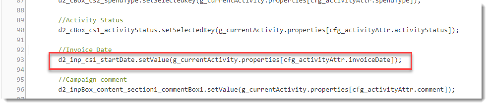

Change the assignment to read the value from the start date property instead of invoice date of the Marketing Activity dimension. Additionally you will need to add a line for the end date input field and assign the end date property of the Marketing Activity dimension to it (and update the comment).

<!-- border; size:540px -->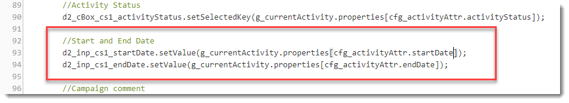

Great, now continue with the next step to handle the saving of an activity.

### Update the save operation of the marketing activity pop-up

In this step you need to make sure that the values for start and end date entered by the user are passed into the data action as well as saved in the dimension id properties.

Locate the function `maintainActivity` below the `applicationScripts` object and click on the `fx` icon to open it in the editor.

<!-- border; size:540px -->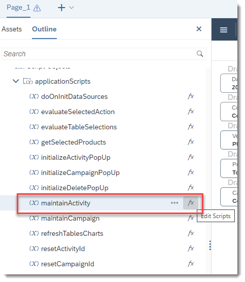

At first you need to retrieve the values entered by the user from the input fields.
For start date we reuse and rename the formerly used invoice date while for the end date we need to add this similarly.

Change this section

<!-- border; size:540px -->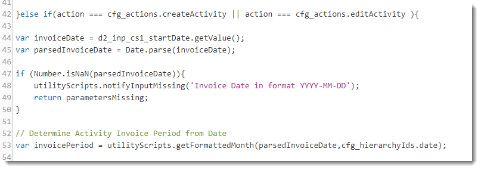

So it looks like this, i.e handling, reading and validating start and end date input

<!-- border; size:540px -->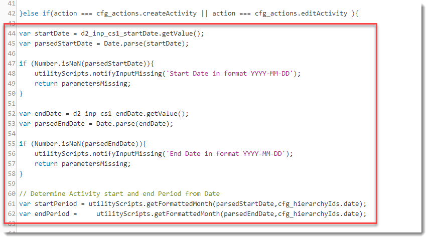

Now you need to make use of the read values for updating the activity's properties.
This is how it looks before the change

<!-- border; size:540px -->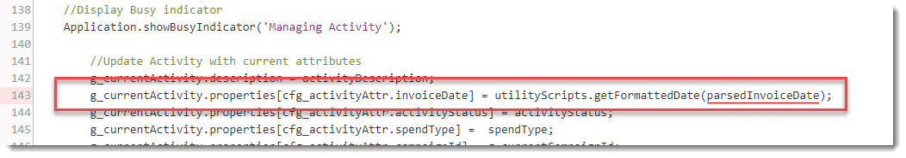

Change the line to adjust for start date instead of invoice date and add an additional line for the end date so it looks like this

<!-- border; size:540px -->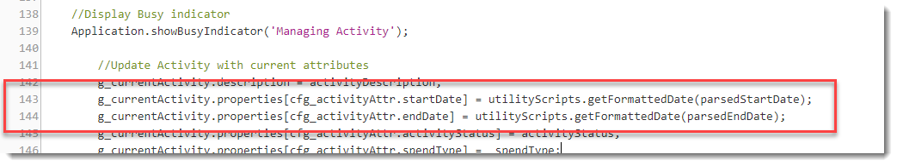

Additionally to updating property values, the derived start and end period need to be passed as parameters to the data action **Maintain Marketing Campaign Activity** (`SAP_MKT_IM_MarketingPlanning_MaintainActivity`) for calculating the activity data.

> Information
> You could use CTRL + Space to get a value help for the available parameter names of the data action.

You need to adjust this section

<!-- border; size:540px -->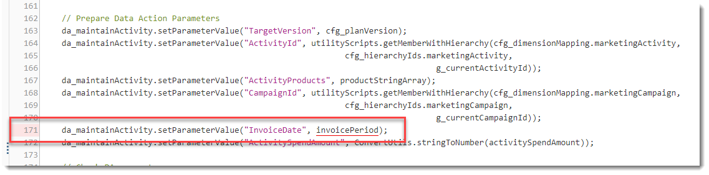

to look like this

<!-- border; size:540px -->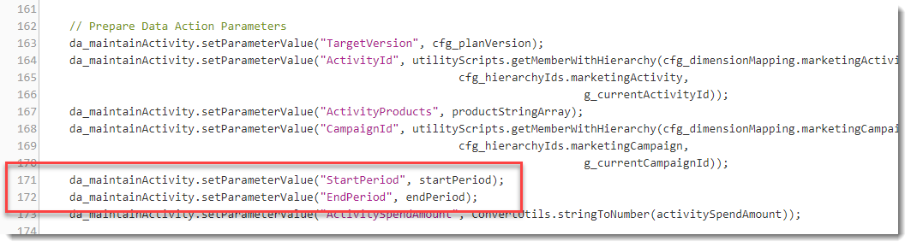

Do not forget to save all the changes you have made to the story.

That is it, great job on making it here!

You have just enabled multi-period cost allocation on your marketing activities by:

1. Adding additional properties to a dimension in a model
2. Updating data actions with new parameters and script
3. Updating UI elements in a story
4. Updating script functions in a story

### Final Remarks

Now you can go ahead and create a new activity for a campaign and check how the activity spend is allocated across products and periods. Congratulations on completing this tutorial! Visit our community page [Extended Planning & Analysis Business Content](https://community.sap.com/topics/cloud-analytics/planning/content?source=social-Global-SAP+Analytics-YOUTUBE-SalesCampaign-Analytics-Analytics-spr-5330779922).
