## Prerequisites
- You have an SAP Analytics Cloud tenant. If this is not the case, get started by requesting a free [SAP Analytics Cloud trial](https://www.sap.com/products/technology-platform/cloud-analytics/trial.html) tenant.
- You have installed the **SAP CX Commercial Planning content** in an SAP Analytics Cloud tenant. Reference: [Business Content Installation Guide](https://help.sap.com/docs/SAP_ANALYTICS_CLOUD/00f68c2e08b941f081002fd3691d86a7/078868f57f3346a98c3233207bd211c7.html), [Content Package User Guide](https://help.sap.com/docs/SAP_ANALYTICS_CLOUD/42093f14b43c485fbe3adbbe81eff6c8/b0046d8673b5412cbef7f521cfdfed95.html)
- You have a rough understanding of the data model. Check out the tutorial [xP&A Commercial Planning - Introduction to the Data Model](xpa-sac-cxmp-datamodelfundamentals) to learn about the dimensions and measures used. 

## You will learn
- all basics of the Marketing Planning module within the Commercial Planning content package for SAP Analytics Cloud 
- how to integrate data into your data model and prepare your plan version using the **Marketing Planning Admin Page** story 
- how to plan your budget using the **Marketing Budget Planning** story
- how to plan individual marketing campaigns and marketing activities using the **Marketing Campaign Planning** story
- how to adjust the baseline and how to plan on different drivers using the **Marketing Demand Planning** story
- how to track your performance using the **Marketing Campaign Analysis** and the **Marketing Performance Analysis** stories

## Intro
In this tutorial you will learn all basics about the **Marketing Planning** module within the Commercial Planning Content Package. 

A detailed documentation can be found in our [Content Package User Guide](https://help.sap.com/docs/SAP_ANALYTICS_CLOUD/42093f14b43c485fbe3adbbe81eff6c8/b0046d8673b5412cbef7f521cfdfed95.html).

In case you have any questions or require further support, please use the [SAP Blog question form](https://answers.sap.com/questions/ask.html?primaryTagId=bcbf0782-ce74-43b8-b695-dafd7c1ff1c1&additionalTagId=67838200100800006884&additionalTagId=819703369010316911100650199149950&topics=commercial%20planning) to reach out to us.

If you are interested in more xP&A topics, related business content packages, or videos showing the content in action, feel free to check out our community page [Extended Planning & Analysis Business Content](https://community.sap.com/topics/cloud-analytics/planning/content).

### Access SAP Analytics Cloud Contents
In this step you will learn how to navigate to the folder which contains all SAP Analytic Cloud content packages.

1. Login to your SAP Analytics Cloud tenant using **Google Chrome**.

    >INFORMATION:
    >
    In order to get the best experience, it is recommended to use **Google Chrome** as it offers the best compatibility with SAP Analytics Cloud (SAC).
    >
    Other browsers can be used as well but are not supported by SAP.

2. In the SAP Analytics Cloud Menu, navigate to the **Files** section.

    <!-- border; size:300px-->

3. Access the content package folder.

    - You can access the content package folder by either navigating to the `Public` folder first and looking for a folder named `SAP_CONTENT`, or by using the **search function** in the top-right corner.
    - In case you want to make use of the search function, simply enter the term `SAP_CONTENT` into the search bar.

    <!-- border; size:540px -->

    - The folder `SAP_CONTENT` contains all objects required to run SAC content. Here you can find your installed content from the content network provided by SAP.

    <!-- border; size:540px -->

### Access Marketing Planning Content
Now that you have learned where all the SAP Analytics Cloud content packages are stored, you need to find the **SAP Commercial Planning** content.

1. Look for the **SAP Commercial Planning** content package by using the search bar.

    - In order to do so, please use the keyword `xP&A` or `CX`
    - In the result list, click on the folder `SAP_CX_Commercial_Planning` with the description `xP&A – Commercial Planning`

    <!-- border; size:540px -->

2. Run the Commercial Planning content package.

    - The Commercial Planning content package consists of three modules, which are the **Marketing Planning** module, the **Portfolio Planning** module and lastly the **Sales Planning** Module.
    - The folder `SAP_CX_Commercial_Planning` contains two folders, which are the marketing planning folder and the sales planning folder.
    - The marketing planning folder contains all stories and objects which are related to the **Portfolio Planning** module and the **Marketing Planning** module. 
    - The sales planning folder contains all stories and objects which are related to the **Sales Planning** module. 
    - To run the Commercial Planning content, please navigate to the folder `SAP_MKT_Marketing_Planning` and enter the folder `Stories`. Click on the story called **Commercial Planning Overview Page** (`SAP_MKT_CommercialPlanning_Overview`).

    >INFORMATION:
    >
    - The story **Commercial Planning Overview Page** (`SAP_MKT_CommercialPlanning_Overview`) serves as a starting point and allows you to access all resources of **all modules** during run time.
    - In other words, you do not need to access the remaining stories by manually launching them from the **Files** section. Instead, you can conveniently open them from inside the **Commercial Planning Overview Page** (`SAP_MKT_CommercialPlanning_Overview`) story.

    <!-- border; size:540px -->

3. Access the Marketing Planning content sub-package. 

    <!-- border; size:540px -->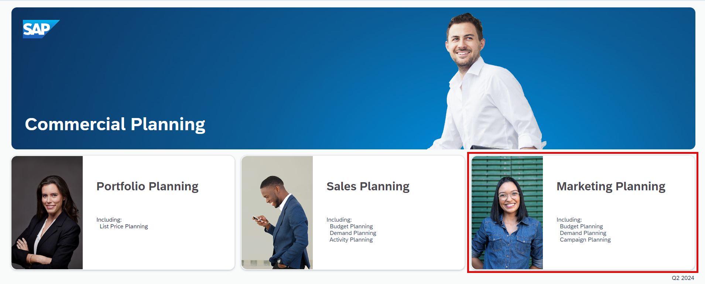

    - Now that you have opened the **Commercial Planning Overview Page** (`SAP_MKT_CommercialPlanning_Overview`) story, you can see that the screen is split into three different sections, while each section represents one of the modules of the entire Commercial Planning content package.
    - These sections are the **Portfolio Planning** section, the **Sales Planning** section and the **Marketing Planning** section. 
    - In order to run the **Marketing Planning** content sub-package, click anywhere on the **Marketing Planning** section to open the story **Marketing Planning Overview Page** (`SAP_MKT_MarketingPlanning_Overview`). Similar to the **Commercial Planing Overview Page**, the **Marketing Planning Overview Page** serves as a starting point for all marketing planning related activities. 

### Marketing Planning Overview
Before jumping into the individual stories of the **Marketing Planning** content sub-package, it is necessary to understand what the stories are for and which use cases they cover.

As this tutorial focuses only on the marketing planning module of the commercial planning content package, other sub-packages are not covered here. 

If you wish to learn more about the portfolio planning module or the sales planning module, check out the tutorials [xP&A Commercial Planning - Get to know the Portfolio Planning module](xpa-sac-cxpp-portfolioplanning-gettoknow) and [xP&A Commercial Planning - Get to know the Sales Planning module](xpa-sac-cxsp-salesplanning-gettoknow) to get a full overview of the Commercial Planning content package.

1. **Marketing Planning Overview Page**

    <!-- border; size:540px -->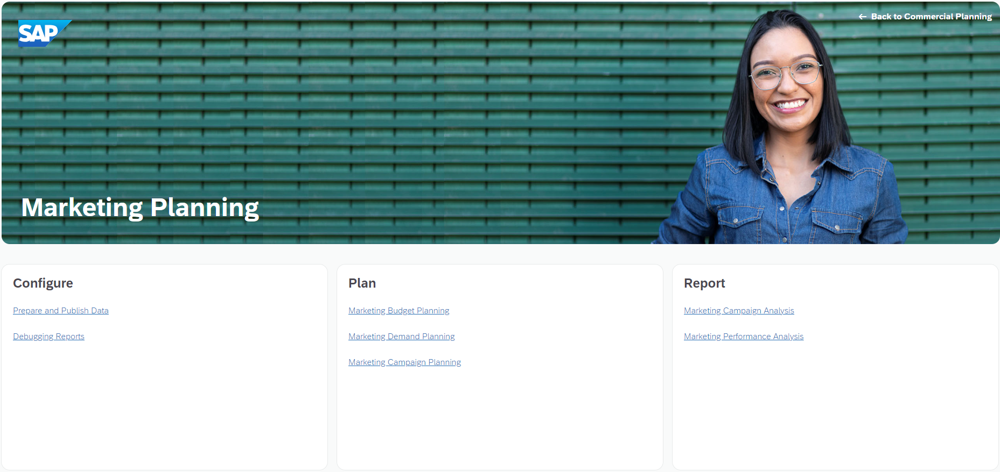

    - By having opened the application **Marketing Planning Overview Page** (`SAP_MKT_MarketingPlanning_Overview`), you entered the **Home Screen** of the **Marketing Planning** content sub-package.
    - The overview application serves as the central entry point for all personas and helps to navigate through the content package.
    - In the lower half of the story, you can see three sections which cluster the different components of the application.
    - Those sections contain hyperlinks which redirect the responsible persona (e.g. the technical administrator or the marketing planner) to the respective story.

2. **Configure**

    <!-- border; size:540px -->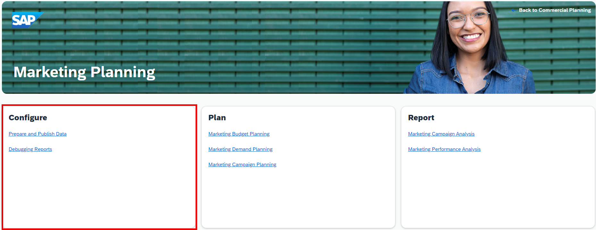

    - The section **Configure** contains two links, both leading to the story **Marketing Planning Admin Page** (`SAP_MKT_Marketing_AdminPage`) while each of the links opens a different page of the two-page story.
    - This story marks the start of the planning process and allows you to perform any administrative task required for the marketing planning activities. 
    - Among other available actions this also includes loading list prices from **SAP S/4HANA**, importing baseline quantities from **SAP Integrated Business Planning**, initializing the plan version and exporting marketing expenses back to **SAP Integrated Business Planning**.
    - In addition to that you may also trigger individual Data Actions and Multi Actions manually from this screen, which by design are usually executed automatically during the marketing planning process.
    - Furthermore this story also offers a second page for debugging activities mainly designed for the marketing campaign and marketing activity planning process, where you can inspect which campaign or activity targets which products. 
    - This story is mainly designed for the technical administrator.

3. **Plan**

    <!-- border; size:540px -->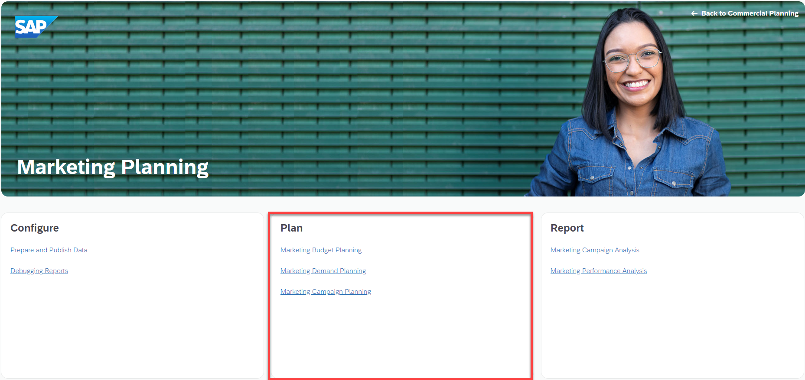

    - The section **Plan** provides access to the stories **Marketing Budget Planning** (`SAP_MKT_MarketingBudgetPlanning`), **Marketing Demand Planning** (`SAP_MKT_MarketingDemandPlanning`) and **Marketing Campaign Planning** (`SAP_MKT_MarketingBudgetPlanning`).
    - These stories are targeting use cases of the marketing budget planner persona, the marketing demand planner persona or respectively the marketing campaign planner persona.
    - Specifically, the **Marketing Budget Planning** (`SAP_MKT_MarketingBudgetPlanning`) story allows you to create an overall quantity, revenue and cost budget on the version `public.Budget`, which then can be used as a reference in the other planning stories. 
    - The **Marketing Demand Planning** (`SAP_MKT_MarketingDemandPlanning`) story allows you to adjust baseline quantities and plan incremental quantities for different drivers, such as the consumer trend driver or the market share driver. It also allows you to make changes based on the revenue and recalculate the respective quantities afterwards. 
    - The **Marketing Campaign Planning** (`SAP_MKT_MarketingBudgetPlanning`) story is specifically designed to plan marketing campaigns and activities on a daily granularity which target specific products.

4. **Report**

    <!-- border; size:540px -->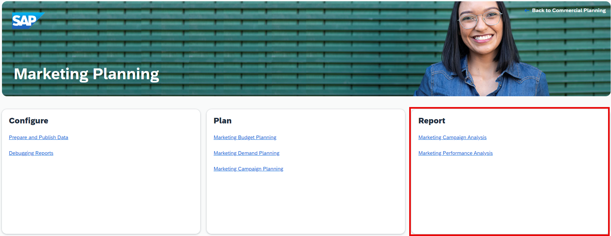

    - The section **Report** contains two links, one leading to the story **Marketing Campaign Analysis** (`SAP_MKT_MarketingCampaignAnalysis`) and the other one to the story **Marketing Performance Analysis** (`SAP_MKT_MarketingPerformanceAnalysis`).
    - The reporting story **Marketing Campaign Analysis** provides insights into financial metrics related to planned campaigns, such as marketing expenses, activity costs and the ROI per product. 
    - The reporting story **Marketing Performance Analysis** provides deeper insights into financial metrics such as the revenue per date and product or revenue per company code. 

### Navigation Concept within the Content
As a last preparation step, it is required to understand the navigation concept of the content package in order for you to use it properly. In this step, you will learn about the meaning and the functionality of all the buttons as well as other UI elements.

1. **Main Navigation** button

    - Each story apart from the Overview Pages (`SAP_MKT_MarketingPlanning_Overview`, `SAP_MKT_PortfolioPlanning_Overview` and `SAP_MKT_CommercialPlanning_Overview`) has a **Main Navigation** button located on the top-left corner.

    <!-- border; size:540px -->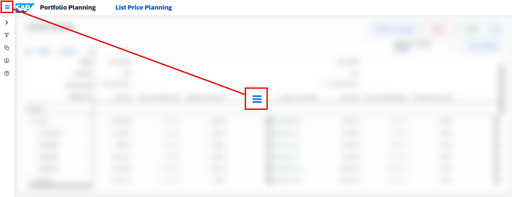

    - By clicking on the **Main Navigation** button, a panel on the left-hand side of the story is opened.

    <!-- border; size:540px -->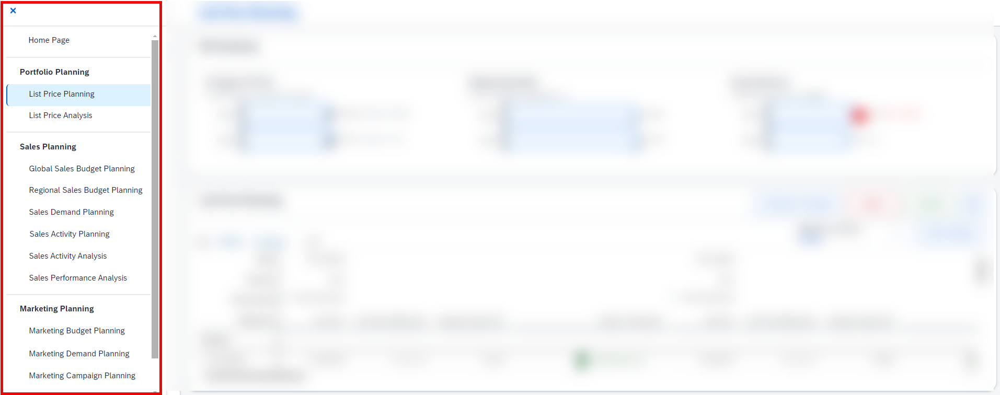

    - Here you can quickly navigate to other stories of the Commercial Planning content package.

2. **Expand / Collapse Section** button

    - These buttons can be found in all stories apart from the Overview Pages and are located at the top-right corner of each available section.
    - The **Expand Section** button (with the arrows pointing to the outside) enlarges a specific section and hides the header and the remaining sections, which is quite useful in case you require more space for the planning tables or reports.

    <!-- border; size:540px -->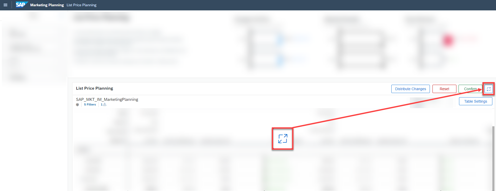

    - The **Expand Section** button changes to a **Collapse Section** button (with the arrows pointing to the center) after entering full screen mode. By pressing the **Collapse Section** button, you can unhide the header section as well as the remaining sections again and return to the default view mode.

    <!-- border; size:540px -->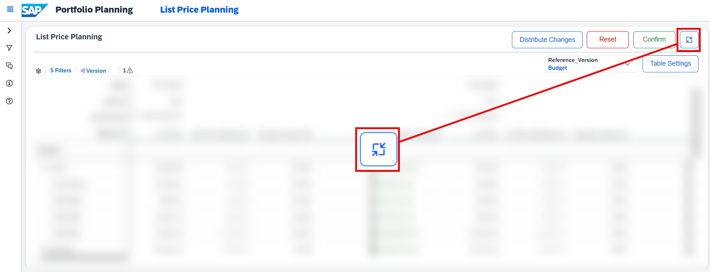

3. **Confirm** button

    - The **Confirm** button can be found in each planning story of this content package and is located at the top-right corner above the tables.
    - The **Confirm** button lets you publish your current plan data into the public plan version.

    <!-- border; size:540px -->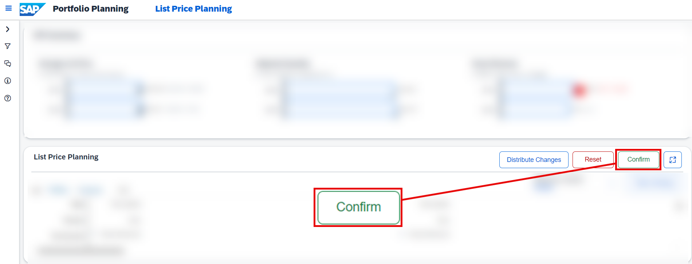

    - Prior to publishing the version you will receive the following pop-up:

    <!-- border; size:200px -->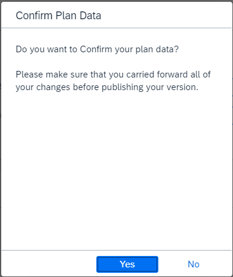

    - If there is nothing to confirm, an application warning will appear instead of the pop-up telling you that there is nothing to publish.

4. **Reset** button
    
    - The **Reset** button can be found in each planning story of this content package and is located at the top-right corner above the tables.
  
    <!-- border; size:540px -->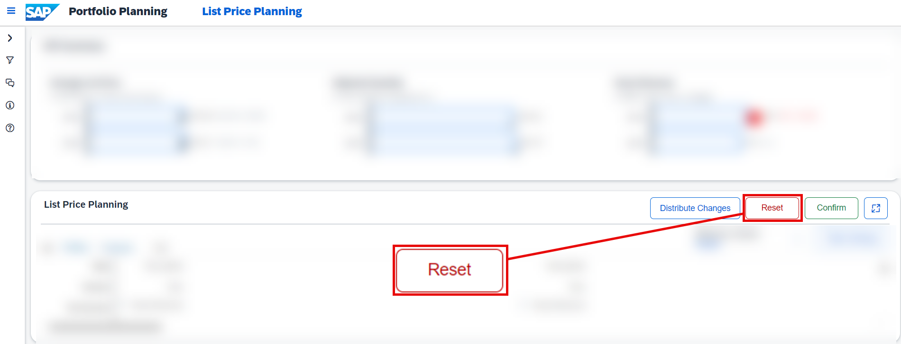

    - Prior to reverting the plan version you will receive the following pop-up:

    <!-- border; size:200px -->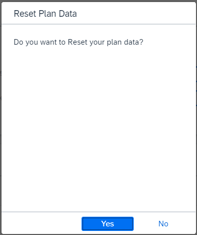

    - If there is nothing to reset, an application warning will appear instead of the pop-up telling you that there is nothing to revert.

5. **Table Settings** button

    - Some of the planning stories have a **Table Settings** button which can be found on the top-right corner above the table. 

    <!-- border; size:540px -->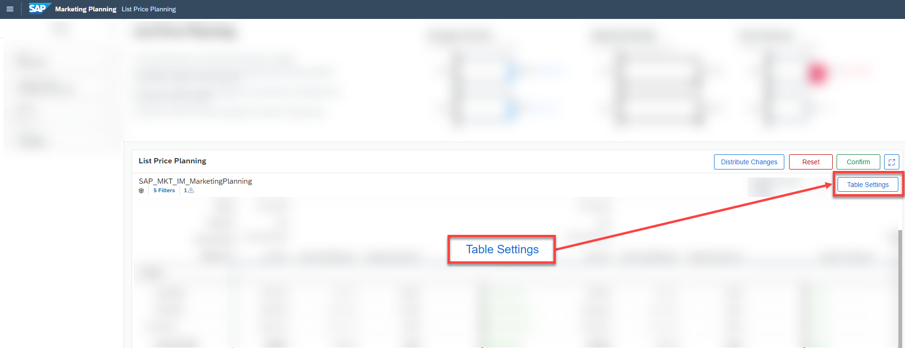

    - By pressing on this button, a pop-up is opened where you can select different measures to be displayed in your table. 
    - Depending on the story the offered selection of measures might differ.

    <!-- border; size:200px -->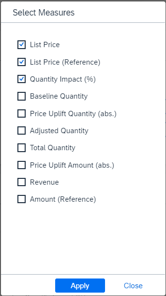

6. **Steps** description field

    <!-- border; size:540px -->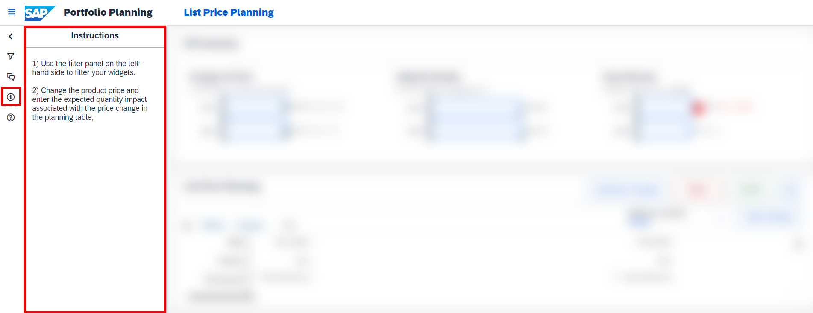

    - Such a text field can be found in each planning story of this content package and is located at the top-left corner.
    - This description field serves as a rough guideline and describes the intended user workflow within each of the planning stories.

7. **Filter** panel

    - This panel can be found in each story apart from the overview pages of this content package and is located on the left-hand side of the screen.

    <!-- border; size:540px -->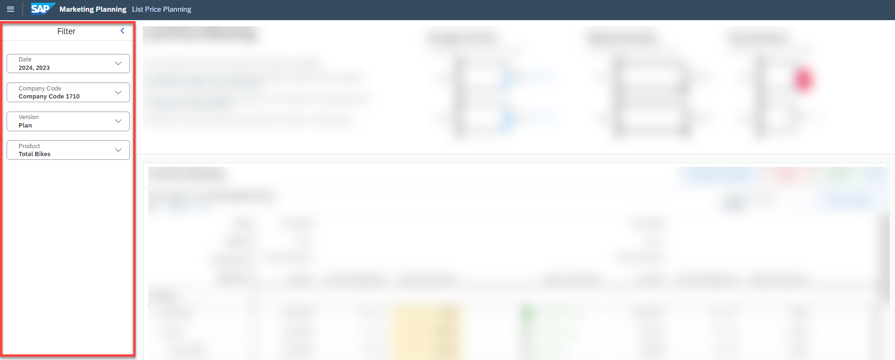

    - By using the drop down widgets, you can filter all tables and charts down to specific members of the given dimensions for an eased data entry and reporting.
    - By clicking on the little **arrow icon**, you can collapse the side panel in order to create more space for your planning tables or charts. 

    <!-- border; size:540px -->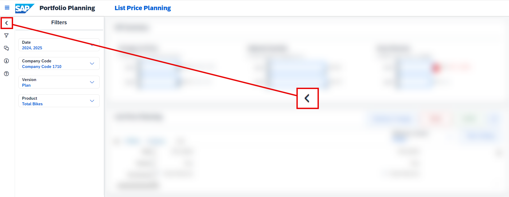

    - You can then reopen the side panel by clicking on the **reversed arrow icon**.

    <!-- border; size:540px -->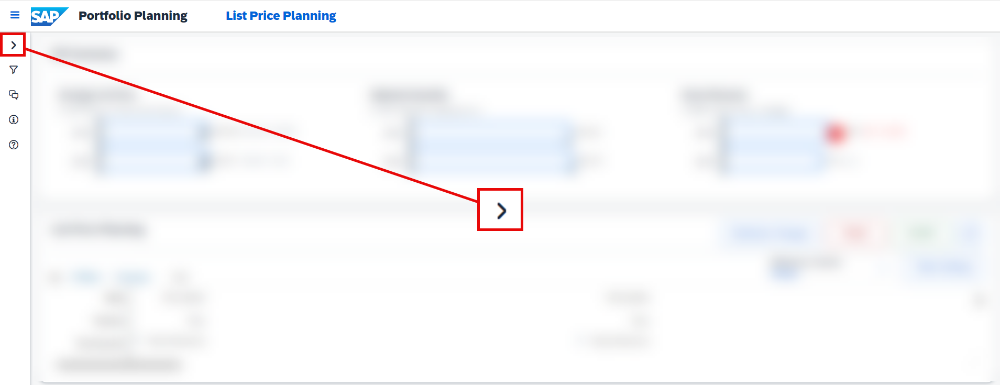

    >INFORMATION:
    >
    - Be aware that some widgets are disconnected from the input controls and thus do not take into consideration the settings from the filter panel. 
    - This is because some charts are specifically designed to only show data for one specific version or member of a dimension. 

8.   **Reference Version** drop-down

    <!-- border; size:540px -->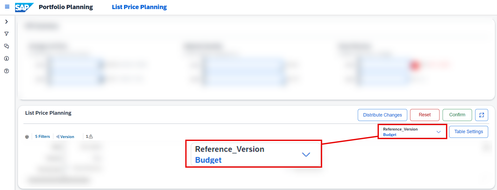

    - This drop-down widget can be found in some of the stories of this content package.
    - By using this drop-down widget, you can define the reference version against which you would like to compare your plan data.

9.   **Hide / Unhide Section** button
    
    <!-- border; size:540px -->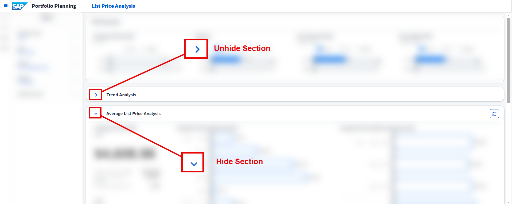

    - In case a story contains multiple sections, you can choose to hide specific parts of the story by using the **Hide Section** button or respectively unhide the section by using the **Unhide Section** button. 
    - Both of these buttons can be found on the top left corner of each section.

10. **Comment** panel

    <!-- border; size:540px -->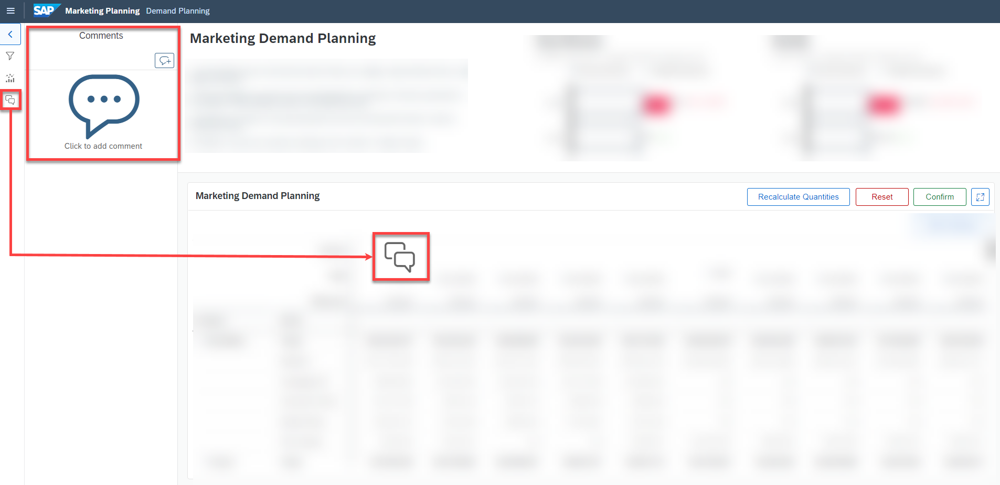
    
    - This panel can only be found in the **Marketing Demand Planning** story and is located on the left-hand side of the screen.
    - In this story, the left-side panel which usually only contains the filter panel is extended by two different panels, one of these being the comment panel.
    - By clicking on the comment icon, the comment panel is opened where you can leave comments for yourself or the other planners. 

11. **Driver** panel

    <!-- border; size:540px -->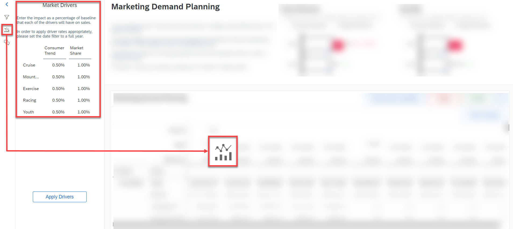
    
    - This panel can only be found in the **Marketing Demand Planning** story and is located on the left-hand side of the screen.
    - In this story, the left-side panel which usually only contains the filter panel is extended by two different panels, one of these being the driver panel.
    - By clicking on the chart icon, the driver panel is opened where you can enter impact percentages for the consumer trend and the market share driver on a product group level. 

12. **Initialize Version** button

    <!-- border; size:540px -->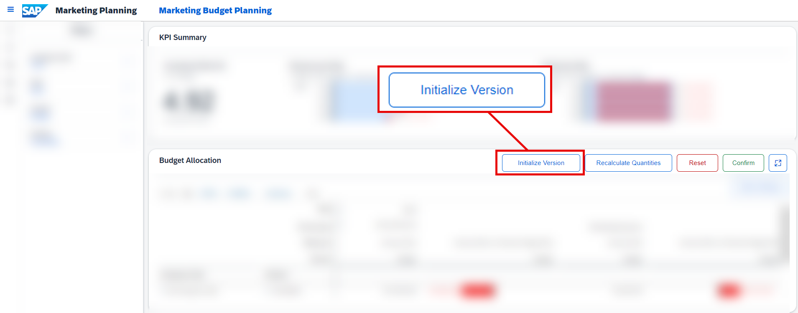

    - The button **Initialize Version** can be found on the top right corner above the table in the **Marketing Budget Panning** story. 
    - By pressing on this button, a pop-up is opened where you can select a start date and an end date to start a copy operation from another version, which in the scope of this content is the `Financial Target` version. 

13. **Recalculate Quantities** button

    <!-- border; size:540px -->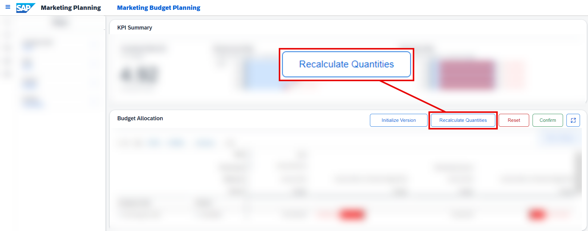

    - The button **Recalculate Quantities** can be found on the top right corner above the table in the **Marketing Budget Planning** story. 
    - By pressing on this button, a recalculation of quantities is triggered as this planning story allows you to make changes on the budgeted revenue. In order to keep data consistent and correct, you need to recalculate the quantities based on your new revenue entries. 

14. **Select Action** drop down

    <!-- border; size:540px -->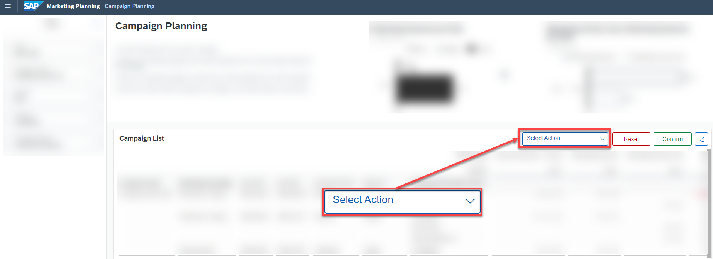

    - This drop down can be found in the **Marketing Campaign Planning** story and is located on the top right corner above the planning table.
    - The drop down lets you select between different actions, while each selection opens a different pop-up. 
    
    <!-- border; size:540px -->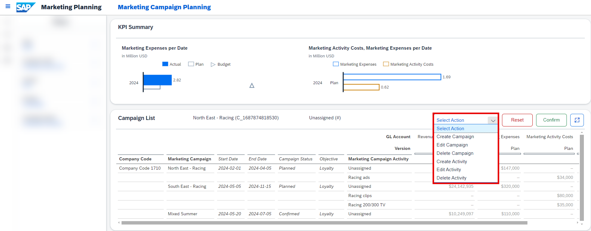

15. **Switch to ROI view** and **Switch to Chart view** buttons

     <!-- border; size:540px -->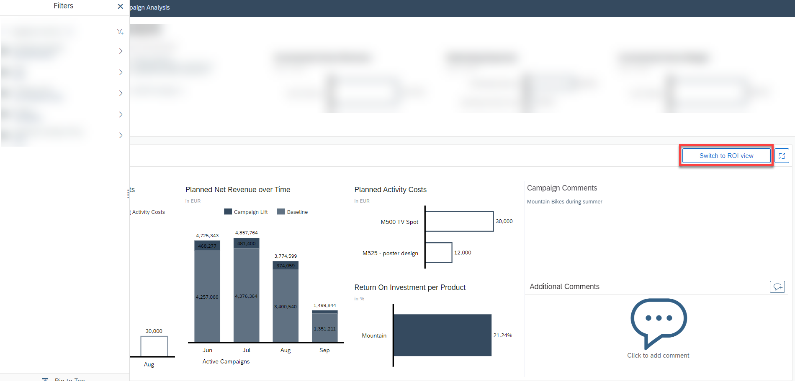

    - The **Switch to ROI view** button can be found in the **Marketing Campaign Analysis** story and is located on the top right corner above the reporting section.
    - As the name suggests, clicking on this button will change the view to display information in a tabular view where the focus lies on reporting the ROI per product.
    - Once the view is changed, the button will be replaced by the button **Switch to Chart view**.
    
    <!-- border; size:540px -->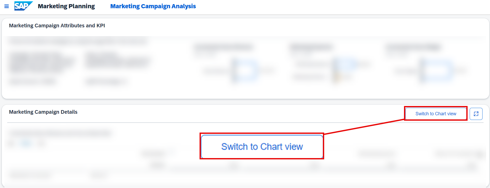

    - By clicking on this button, you will return to the default view mode of this story. 

16. **Tabular View** and **Graphical View** buttons

    <!-- border; size:540px -->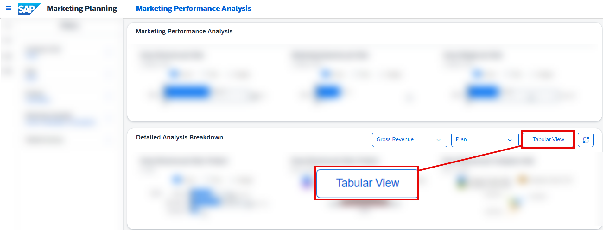

    - The **Tabular View** button can be found in the **Marketing Performance Analysis** story and is located on the top right corner above the reporting section.
    - As the name suggests, clicking on this button will change the view to display information in a tabular view.
    - Once the view is changed, the button will be replaced by the button **Graphical View**.
    
    <!-- border; size:540px -->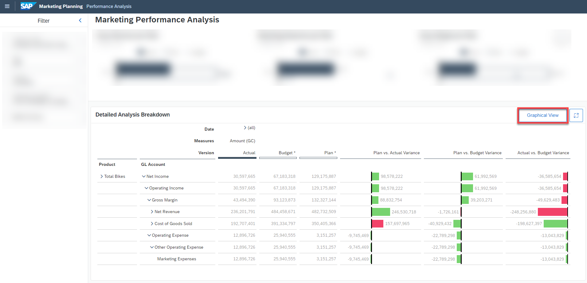

    - By clicking in this button, you will return to the default view mode of this story. 

### Marketing Planning Admin Page
Now that you are familiar with the basics and the navigation concept, you will learn in more detail how to use the different stories.

This step focuses on the story **Marketing Planning Admin Page** (`SAP_MKT_Marketing_AdminPage`).

You will learn how to open the story (Tab 1), how to integrate all relevant data from different data sources into the data model (Tab 2), how to initialize the plan version (Tab 3). what other actions you can trigger from the admin page (Tab 4) and lastly how to enter the debugging report section for marketing campaigns (Tab 5).

[OPTION BEGIN [Open Story]]
Currently, you have opened the tab **Open Story**. This tab provides guidance on how to open the **Marketing Planning Admin Page** (`SAP_MKT_Marketing_AdminPage`) story.

1. In the **Marketing Planning Overview Page** (`SAP_MKT_Marketing_Overview`) story, click on the **Prepare and Publish Data** link.

    <!-- border; size:540px -->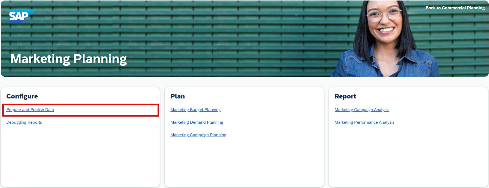

    >INFORMATION:
    >
    - The **Marketing Planning Admin Page** (`SAP_MKT_Marketing_AdminPage`) story serves as a central place for any administrative task related to the marketing planning process. 
    - It offers a collection of Data Actions and Multi Actions which are used throughout the entire process.
    - From this screen you can integrate data from different data sources into your data model, initialize your plan version and perform other individual actions which are usually executed automatically from within the planning stories, such as recalculating revenues or costs. 

2. Get an overview of the story

    <!-- border; size:540px -->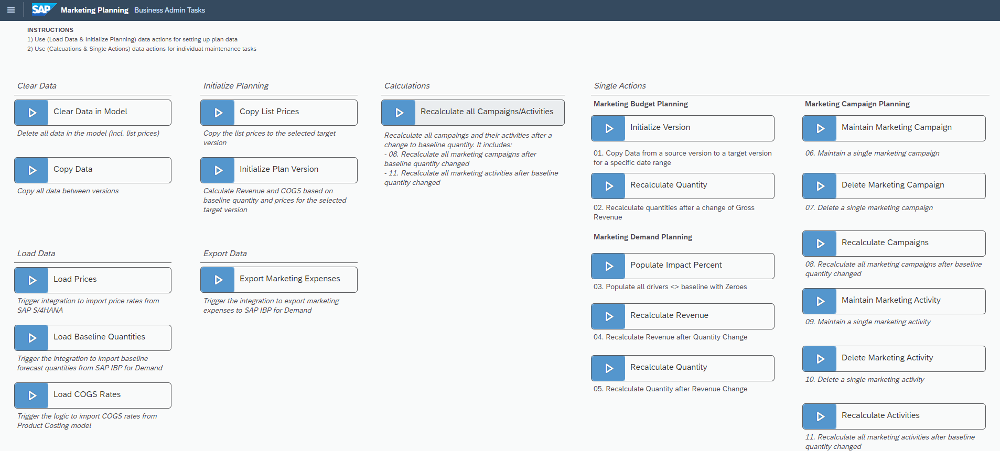

    - Make yourself familiar with the story.
    - Try to identity the different administrative sections and use cases. Do not execute anything yet, we will go through this step by step. 

3. Check the **INSTRUCTIONS** section

    <!-- border; size:540px -->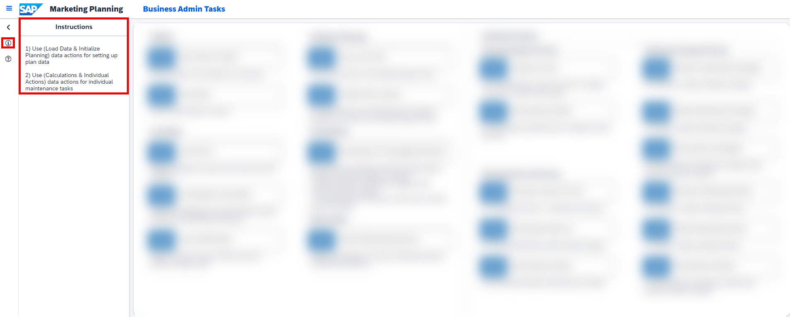

    - All stories provide a short in-built step by step guide which helps you to use the corresponding story correctly.
    - Before using the story, make sure to check the **INSTRUCTIONS** description field to understand the intended user workflow.

You may now switch to the second tab **Load Data**.

[OPTION END]

[OPTION BEGIN [Load Data]]
Currently, you have opened the tab **Load Data**. This tab provides guidance on how to integrate all relevant data from different data sources, such as baseline quantities, cost rates and list prices. All relevant actions related to this step can be found in the **Load Data** section of the **Marketing Planning Admin Page**.

 <!-- border; size:540px -->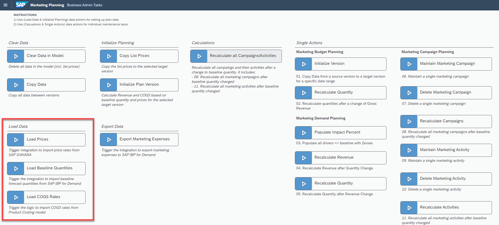

>INFORMATION:
>
- This content package is dependant on three different data sources.
- For the list prices, **SAP S/4HANA** as an external source system is used as a data source.
- For the baseline quantities, **SAP Integrated Business Planning** as an external source system is used as a data source.
- For the COGS rates, the product cost data model `SAP_FI_IFP_IM_ProductCost` from the **Integrated Financial Planning for SAP S/4HANA (xP&A - Integrated Financial Planning for SAP S/4HANA and S/4HANA Cloud)** business content in SAP Analytics Cloud is used as a data source. 
- If you wish to install the **Integrated Financial Planning for SAP S/4HANA (xP&A - Integrated Financial Planning for SAP S/4HANA and S/4HANA Cloud)** business content package, check out the documentation: [Business Content Integrated Financial Planning](https://help.sap.com/docs/SAP_S4HANA_ON-PREMISE/48f4b4785b8e45938ac44a67be8032d9/7ce894bc95f449779fa19d076e67c925.html?q=SAP_FI_IFP_Financial_Planning%20): 

1. Click on the **Load Prices** trigger to integrate price data into the data model.

    <!-- border; size:540px -->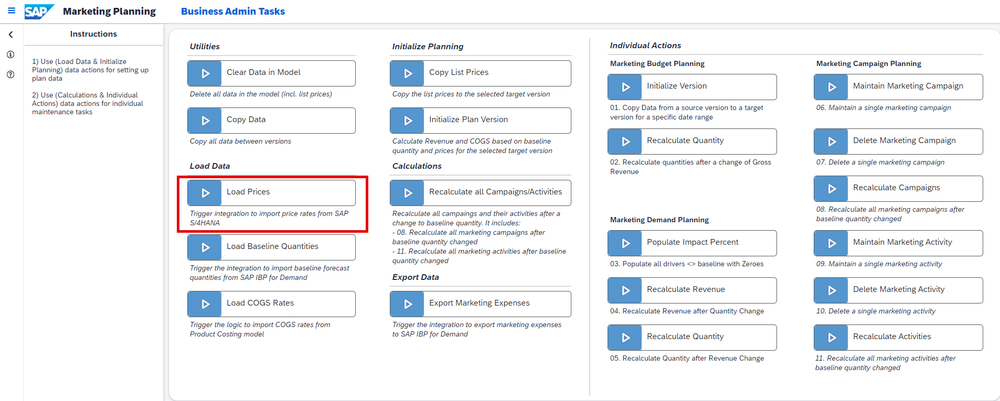

    - As suggested in the **INSTRUCTIONS** description field, start the planning process with the data loading in case it has not been done elsewhere yet. 
    - By clicking on the trigger, a Multi Action is executed which loads price data from **SAP S/4HANA** into the data model of this content package. 

    >INFORMATION:
    >
    - In order for this step to work, you must set up the Multi Action and integration job first. 
    - If you wish to learn how to set up the integration process for price data, check the tutorials [xP&A Commercial Planning - Data Integration](xpa-sac-cx-data-integration-setup) and [xP&A Commercial Planning - Manage data loads](xpa-sac-cx-manage-data-loads).
    - Please note that you may skip this step in case you want to go with the provided demo data first. This step will only become necessary once you decide to use your own systems as data source. 

2. Click on the **Load Baseline Quantities** trigger to integrate baseline quantities into the data model

    <!-- border; size:540px -->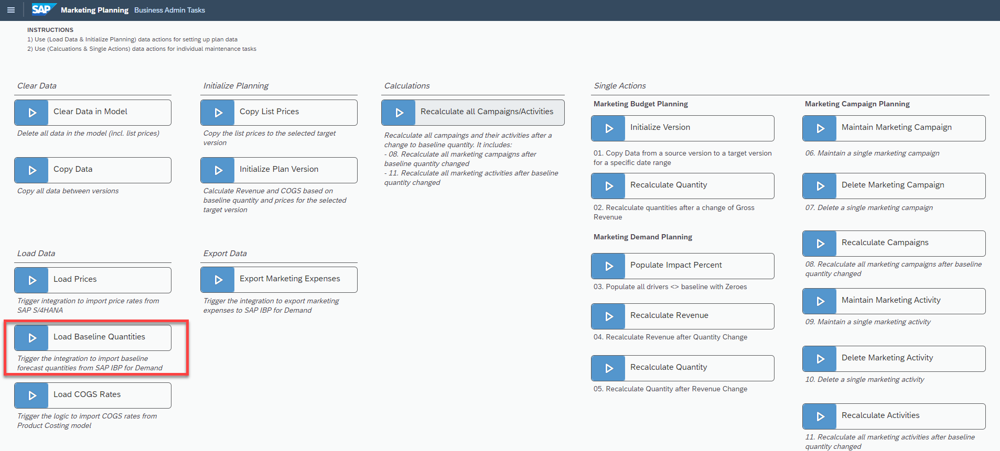

    - By clicking on the trigger, a Multi Action is executed which loads baseline quantities from **SAP Integrated Business Planning** into the data model of this content package. 

    >INFORMATION:
    >
    - In order for this step to work, you must set up the Multi Action and integration job first. 
    - If you wish to learn how to set up the integration process for baseline quantities, check the tutorials [xP&A Commercial Planning - How to set up system connections](xpa-sac-cx-data-integration-setup) and [xP&A Commercial Planning - Manage data loads](xpa-sac-cx-manage-data-loads).
    - Please note that you may skip this step in case you want to go with the provided demo data first. This step will only become necessary once you decide to use your own systems as data source. 

3. Click on the **Load COGS Rates** trigger to integrate cost rates into the data model

    <!-- border; size:540px -->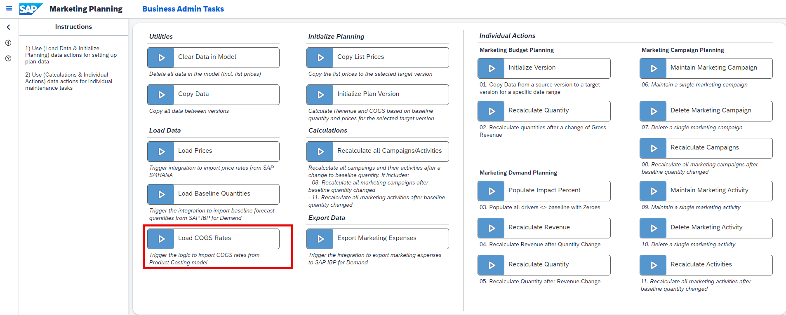

    - By clicking on the trigger, a Data Action is executed which loads COGS rates from the product cost data model outside the content package (`SAP_FI_IFP_IM_ProductCost`) into the data model of this content package. 

    >INFORMATION:
    >
    - In order for this step to work, you must have access to the product cost model `SAP_FI_IFP_IM_ProductCost`. 
    - Check out the official documentation for the business content package [Integrated Financial Planning for SAP S/4HANA (xP&A - Integrated Financial Planning for SAP S/4HANA and S/4HANA Cloud)](https://help.sap.com/docs/SAP_S4HANA_ON-PREMISE/48f4b4785b8e45938ac44a67be8032d9/7ce894bc95f449779fa19d076e67c925.html?q=SAP_FI_IFP_Financial_Planning%20).
    - Please note that you may skip this step in case you want to go with the provided demo data first. This step will only become necessary once you decide to use your own systems as data source. 
  
Now that you have loaded in all data successfully, you can proceed with the initialization of your plan version as a last preparation step. You can now switch to the tab **Initialize Plan Version**.

[OPTION END]

[OPTION BEGIN [Initialize Plan Version]]
Currently you have opened the tab **Initialize Plan Version**. This tab provides guidance on how to prepare your plan version so you can finally start with your planning activities. All relevant actions related to this step can be found in the **Initialize Planning** section of the **Marketing Planning Admin Page**.

 <!-- border; size:540px -->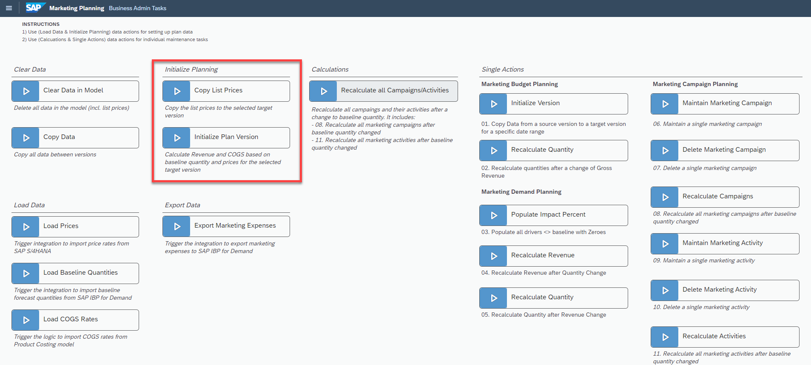

Click on the **Initialize Plan Version** trigger to calculate all relevant measures based on your integrated data.

<!-- border; size:540px -->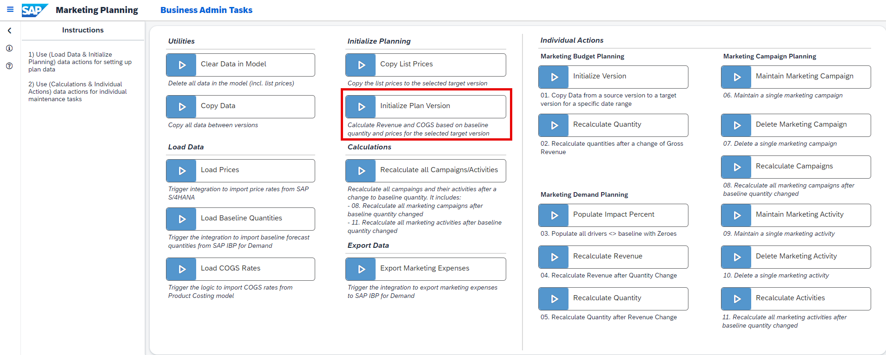

- In the previous step you learned how to load in baseline quantities, COGS rates and list prices.
- By clicking on the trigger, a Data Action is executed which now calculates the total revenue and costs based on the imported figures for each product. 
 
>INFORMATION:
>
- This is required because neither total revenues nor total costs are imported from an external system. 
- Thus these figures are calculated inside SAP Analytics Cloud now by using this Data Action.
- The Data Action takes the imported quantities and multiplies the quantities by the list prices and COGS rates. The results are then persisted on the amount (`AMOUNT`) measure, which stores the total revenue or COGS.
>
Now that you have integrated all data and initialized your plan version successfully, you can either proceed with the next step of this tutorial or switch to the tab **Other Actions** in case you would like to learn what the remaining Data Actions and Multi Actions are used for.

[OPTION END]

[OPTION BEGIN [Other Actions]]
Currently you have opened the tab **Other Actions**. This tab provides a rough overview of all the remaining Data Actions and Multi Actions which can be found on the admin screen. Please note that none of these actions are mandatory. 

1. **Clear Data in Model**

    <!-- border; size:540px -->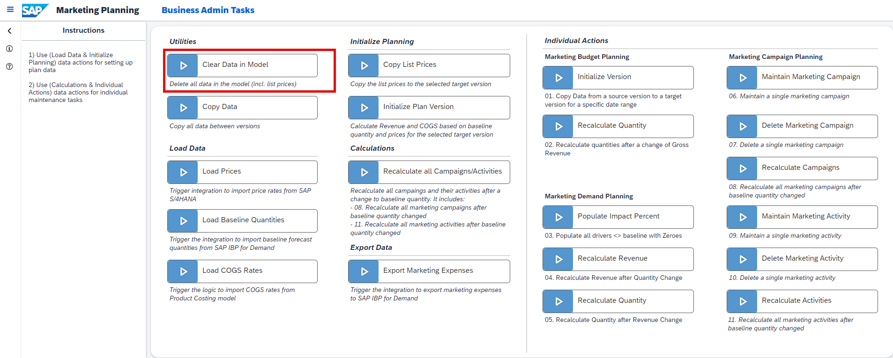

    - This Data Action deletes all data from the target version without any restriction.
    - This can be quite useful in case you want to reset an entire version, such as for example the `Budget` version.
  
2. **Copy Data**

    <!-- border; size:540px -->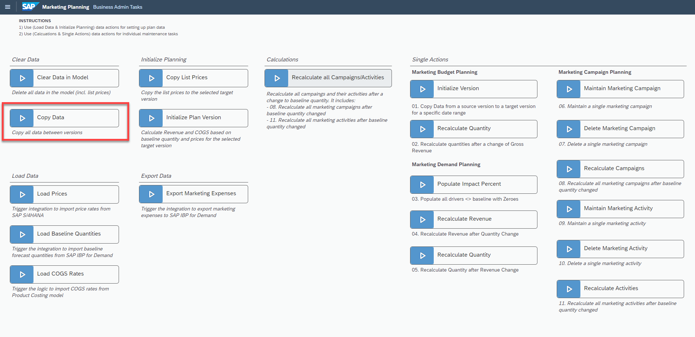

    - This Data Action deletes all data from the target version for a specified date range and copies data from another version to the exact same date range.
    - This Data Action can be used if you work on more than two versions for example or if you want to redeploy data from a backup version of yours. 

3. **Copy List Prices**
    
    <!-- border; size:540px -->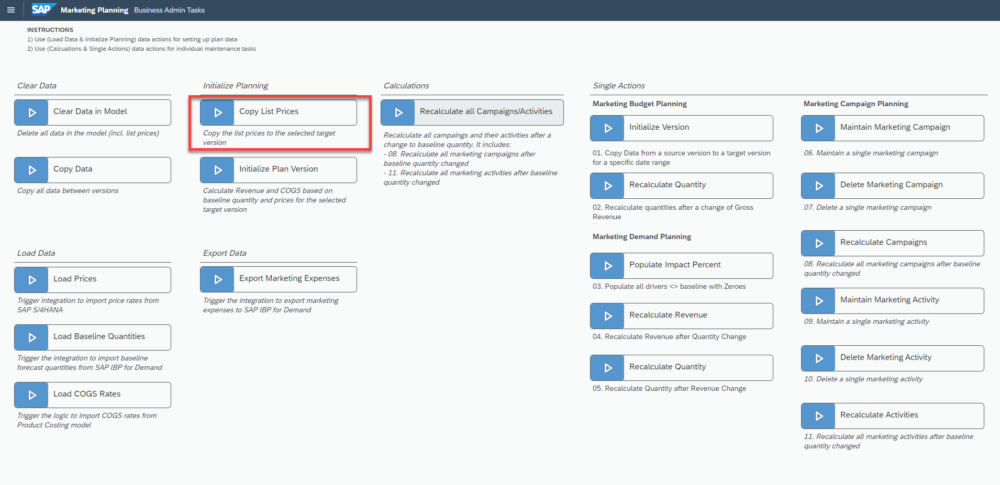

    - This Data Action copies over list prices to the target version from another version for a specified time range.

4. **Export Marketing Expenses**

    <!-- border; size:540px -->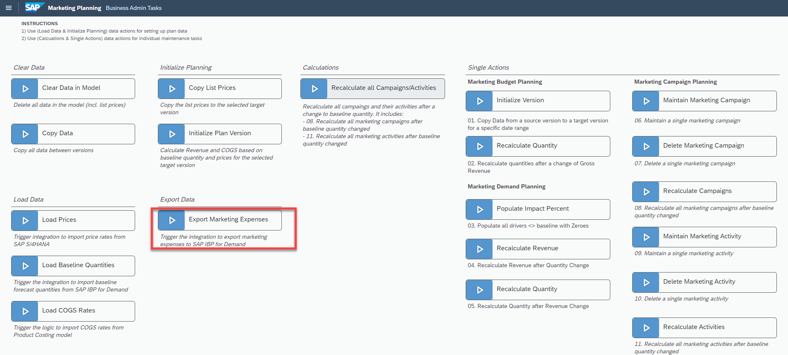

    - This Multi Action exports the planning results to **SAP Integrated Business Planning** for a given time window.

5. **Recalculate all Campaigns/Activities**
   
    <!-- border; size:540px -->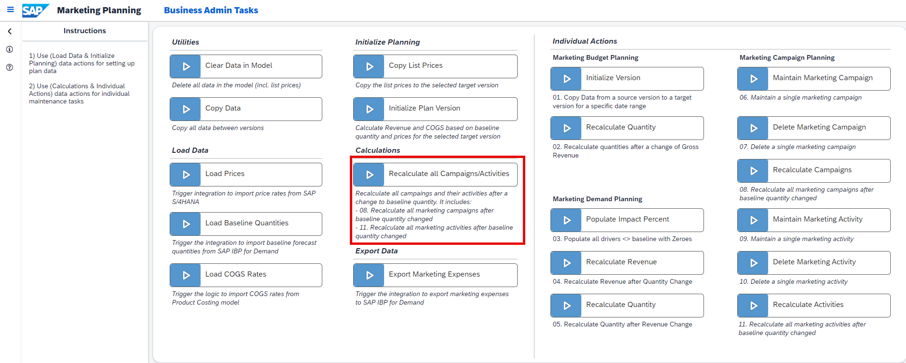

    - This Multi Action recalculates all marketing campaigns and activities by estimating the prorated baseline quantity and multiplying it by the list prices. 
    - The incremental revenues, costs and quantities are then stored on a campaign or activity level.

6. **Initialize Version**
   
    <!-- border; size:540px -->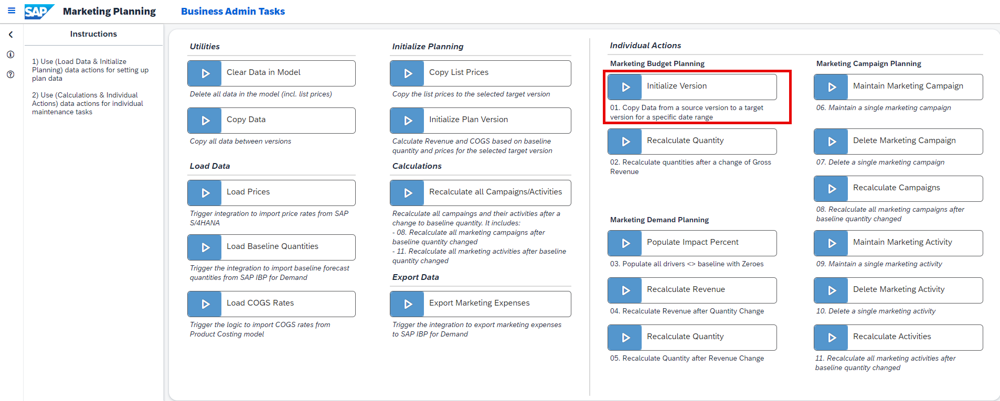

    - This Data Action copies over data from a specified source version to a target version for a given date range.
    - This Data Action is called automatically during the **Marketing Budget Planning** process when initializing the `Budget` version.

7. **Recalculate Quantity**
   
    <!-- border; size:540px -->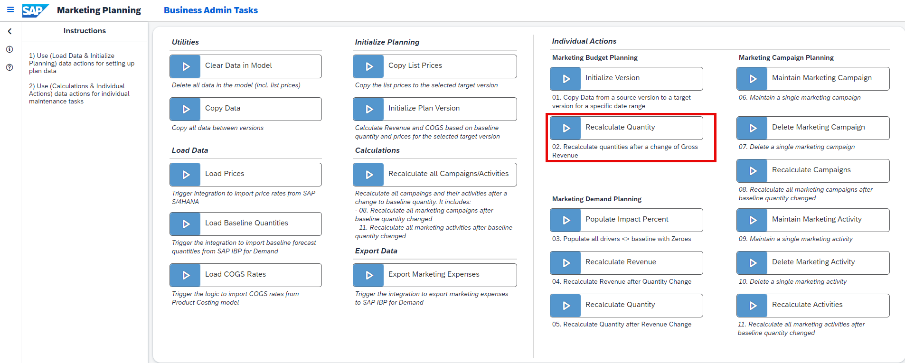

    - This Data Action recalculates the quantity based on your planned revenue. 
    - The Data Action is called automatically during the **Marketing Budget Planning** process. 

8. **Populate Impact Percent**
   
    <!-- border; size:540px -->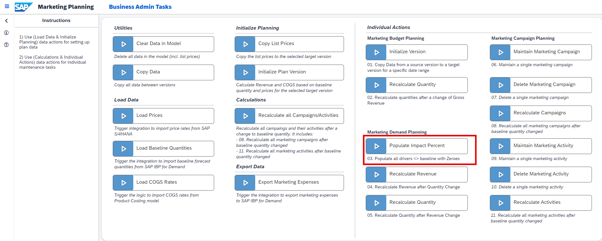

    - This Data Action creates booked values for the Quantity Impact (%) (`IMPACT_PERCENTAGE`) measure by writing a zero to specific data records.
    - The Data Action is executed automatically on startup of the **Marketing Demand Planning** story and is required because the table widgets are set to hide unbooked records. As the Quantity Impact (%) must be planned by you, it is required to have some sort of booked value in order for the widget to be able to display the relevant data record. 
 
9.  **Recalculate Revenue**
    
    <!-- border; size:540px -->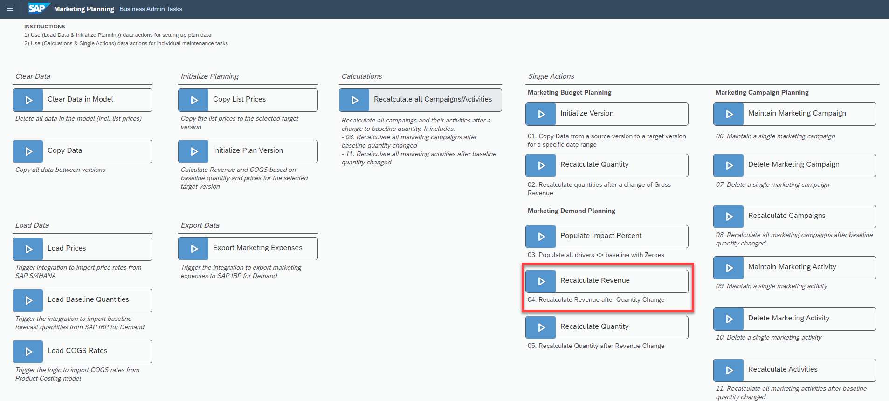

    - This Data Action recalculates the revenue after a quantity has been changed.
    - The Data Action is executed automatically during the **Marketing Demand Planning** process. 

10. **Recalculate Quantity**
    
    <!-- border; size:540px -->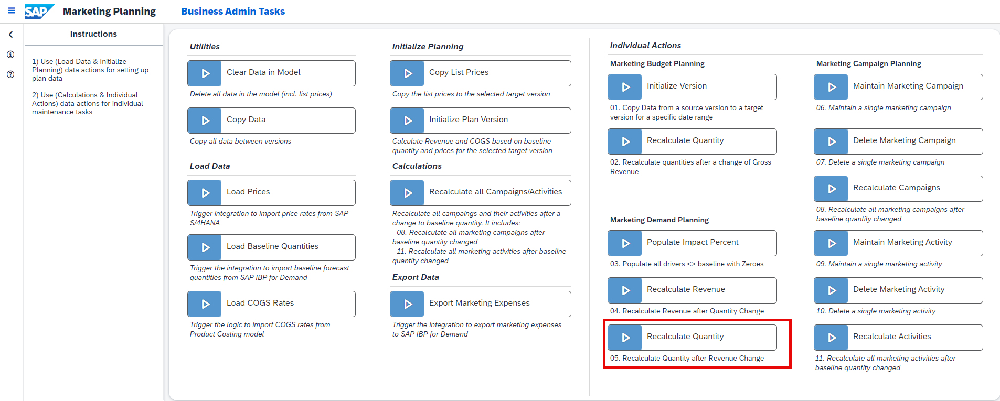

    - This Data Action recalculates the quantity after a revenue has been changed.
    - The Data Action is executed automatically during the **Marketing Demand Planning** process.   

11. **Maintain Marketing Campaign**
    
    <!-- border; size:540px -->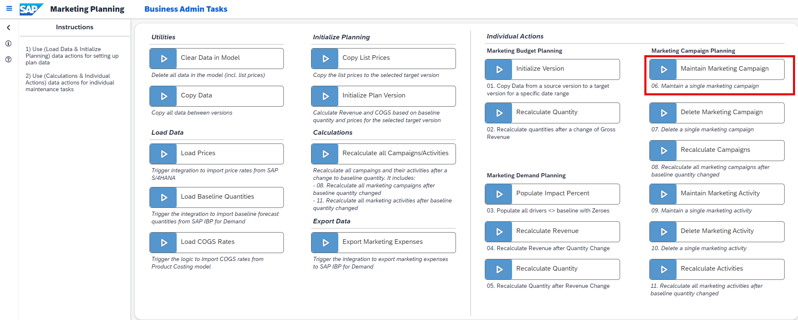

    - This Data Action deletes all data for an existing marketing campaign and recalculates all relevant measures such as the prorated quantity and revenue based on your input from scratch. 
    - The Data Action is executed automatically during the **Marketing Campaign Planning** process when you choose to edit a campaign from inside the story.   

12. **Delete Marketing Campaign**
    
    <!-- border; size:540px -->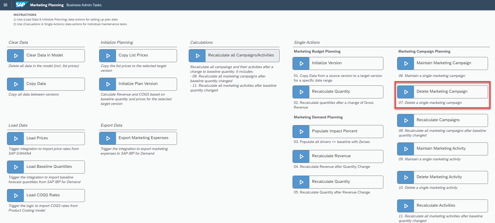

    - This Data Action deletes all data from an existing marketing campaign.
    - The Data Action is executed automatically during the **Marketing Campaign Planning** process when you choose to delete a campaign from inside the story.   

13. **Recalculate Campaigns**
    
    <!-- border; size:540px -->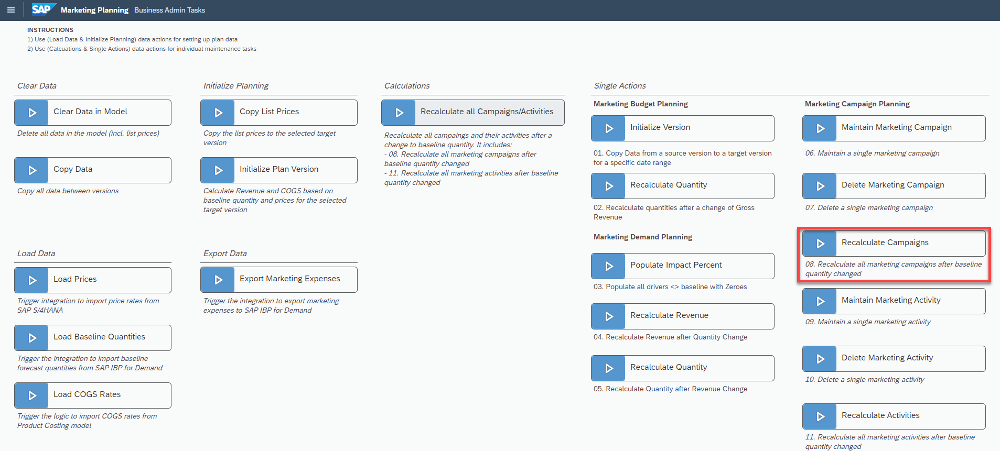

    - This Data Action recalculates all relevant measures for a campaign based on the new baseline quantity.
    - The Data Action is executed automatically during the **Marketing Demand Planning** process as this story allows you to edit baseline quantities and consequently, change the calculation baseline for campaigns. 

14. **Maintain Marketing Activity**
    
    <!-- border; size:540px -->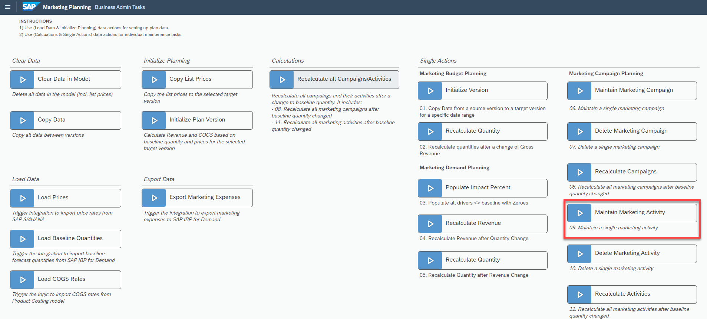

    - This Data Action deletes all data for an existing marketing activity and recalculates all relevant measures, such as the costs per product.
    - The Data Action is executed automatically during the **Marketing Campaign Planning** process when you choose to edit a marketing activity from inside the story.   

15. **Delete Marketing Activity**
    
    <!-- border; size:540px -->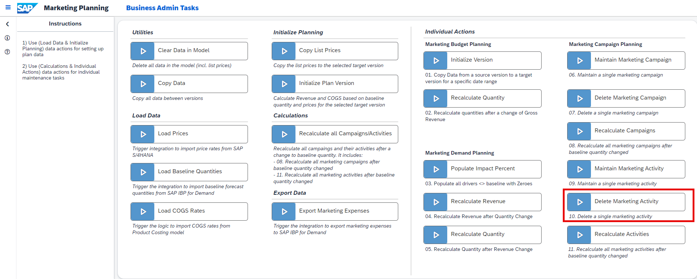

    - This Data Action deletes all data from an existing marketing activity.
    - The Data Action is executed automatically during the **Marketing Campaign Planning** process when you choose to delete an activity from inside the story.   

16. **Recalculate Activities**
    
    <!-- border; size:540px -->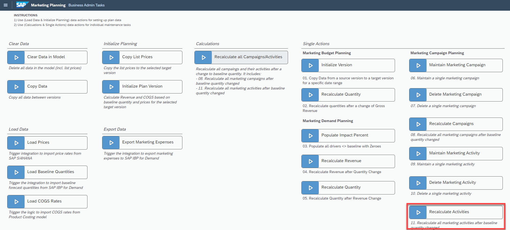

    - This Data Action recalculates all relevant measures for a marketing activity based on the new baseline quantity.
    - The Data Action is executed automatically during the **Marketing Demand Planning** process as this story allows you to edit baseline quantities and consequently, change the calculation baseline for marketing activities.  

[OPTION END]

[OPTION BEGIN [Debugging Reports]]
Currently, you have opened the tab **Debugging Reports**. This tab provides guidance on how to enter the debugging reports in the **Marketing Planning Admin Page** (`SAP_MKT_Marketing_AdminPage`) story.

1. In the **Marketing Planning Overview Page** (`SAP_MKT_Marketing_Overview`) story, click on the **Debugging Reports** link.

    <!-- border; size:540px -->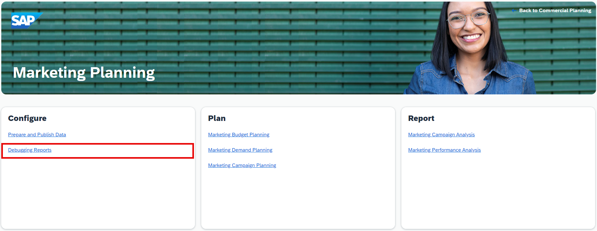

2. Get an overview of the story page

    <!-- border; size:540px -->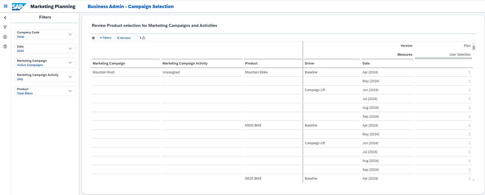

    - You will now be redirected to the second page of the **Marketing Planning Admin Page** (`SAP_MKT_Marketing_AdminPage`) story.
    - This report allows you to understand which marketing campaign and which activity target which products. 
    - You can filter the table by using the filter panel on the left-hand side once this report becomes helpful for you. For now, it is enough for you to know that there is such a report existing.

[OPTION END]

### Marketing Budget Planning
As you have now integrated all relevant data and initialized your plan version, you can continue with the actual planning activities.

In this step, the **Marketing Budget Planning** (`SAP_MKT_MarketingBudgetPlanning`) story of this content package is introduced.

You will learn how to open the story (Tab 1) and how to enter your budget(Tab 2).

[OPTION BEGIN [Open Story]]
Currently, you have opened the tab **Open Story**. This tab provides guidance on how to open the **Marketing Budget Planning** (`SAP_MKT_MarketingBudgetPlanning`) story.

1. Click on the burger menu located on the top left corner of the **Marketing Planning Admin Page** (`SAP_MKT_Marketing_AdminPage`) from the previous step.
2. Now click on either **Marketing Planning** to jump back to the **Marketing Planning Overview Page** or on **Marketing Budget Planning** to directly access the **Marketing Budget Planning** story.

    <!-- border; size:540px -->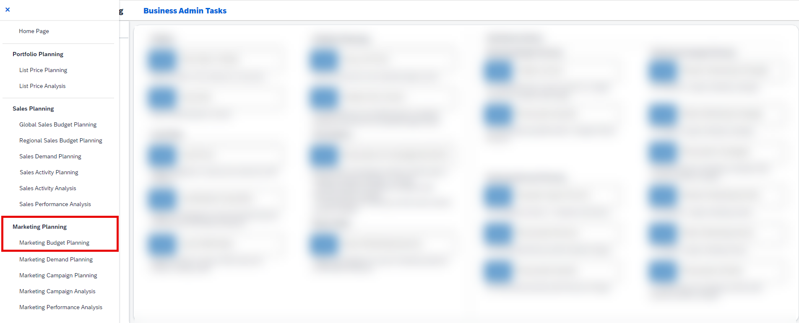
   
    In this particular case, we will go back to the **Marketing Planning Overview Page** by clicking on the **Marketing Planning** button.

3. Click on the link **Marketing Budget Planning** to enter the story.

    <!-- border; size:540px -->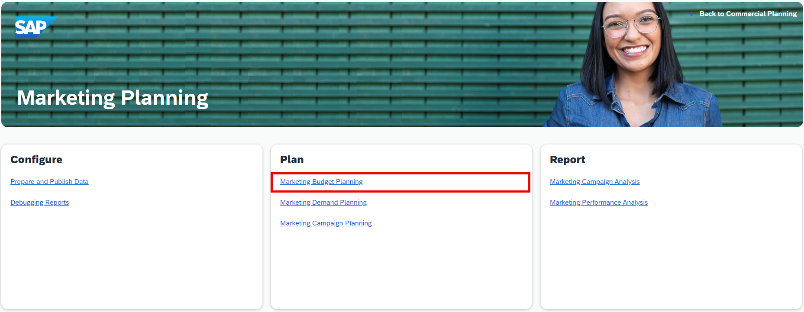

4. Get an overview of the application

    <!-- border; size:540px -->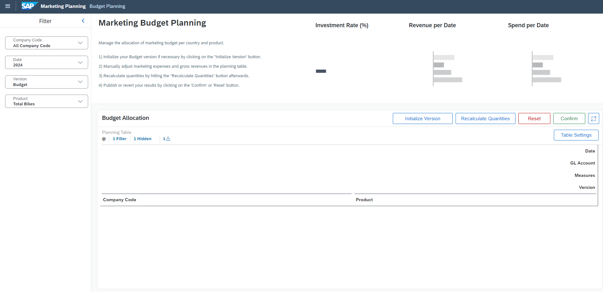

    - When you enter the story for the very first time, you will probably be confronted with an entirely empty application with the widgets not displaying anything. This is because the `Budget` version is initially empty and must be initialized by you. Before you do that, let's take a look at the structure of the story first. 

    - Generally the story consists of three sections. 
    - The header section provides three charts showing the the Investment Rate in percent, the Revenue by period and the Spend by period. 
    - The context for all charts is defined by the filters set in the input controls on the left-hand side of the story. 
    - The Investment Rate (%) is a measure which shows the portion of marketing expenses as compared to the revenue. 
    - The Revenue per Date chart shows the budgeted gross revenue per year. The green (positive deviation) or respectively red (negative deviation) bar serves as an indicator for the difference to the `Financial Target` version which the `Budget` version is based on.
    - The Spend per Date chart shows the budgeted marketing expenses per year. The green or respectively red bar serves as an indicator for the difference to the `Financial Target` version which the `Budget` version is based on.

    - The second important section is the filter section, which can be found on the left-hand side of the application. 
    - The filter panel provides different input controls in which you can define your planning context for this story.

    - The last important section is the planning section in the center of the story. 
    - The planning table is the place where you can enter your revenue and your marketing expense budget. 
    - The informational measure **Amount(GC) vs Financial Target (GC)** shows the deviation between your budgeted revenue and the revenue budget provided by the `Financial Target` version.
    - Additional measures can be added to the planning table via the **Table Settings** dialogue if desired. 
  
You may now switch to the second tab **Enter Budget Data** to learn how to enter your planning assumptions.

[OPTION END]

[OPTION BEGIN [Enter Budget Data]]
Currently, you have opened the tab **Enter Budget Data**. This tab provides guidance on how to initialize your budget version and how to modify the budget afterwards.

1. Adjust your filters in the filter panel.
   
    - According to the **Steps** description field, start your activities by adjusting your filters in the filter panel if required. 
    
    >INFORMATION:
    >
    For the following demonstration, we will change the date filter to the years 2023 and 2024. 

    <!-- border; size:540px -->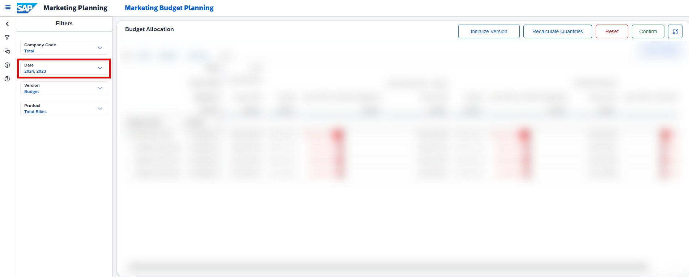

    >INFORMATION:
    >
    - All filters apart from the date filter are preset manually and are static as a result.
    - If you want to change your default settings for the filters, please go into edit mode of the story and change the selection of the input controls. 
    - The date filter on the other hand uses a tiny script and always sets the current year and the next year as default. As this tutorial was published in 2023, the date filter is set to the year 2023 and 2024. 
    - Check out the tutorial [xP&A Commercial Planning - Customize Default Settings](xpa-sac-cx-customize-default-settings) to learn in detail how to customize your default settings.

2. Initialize your Budget version

    - Click on the button **Initialize Version** to fill your budget version with data.

    <!-- border; size:540px -->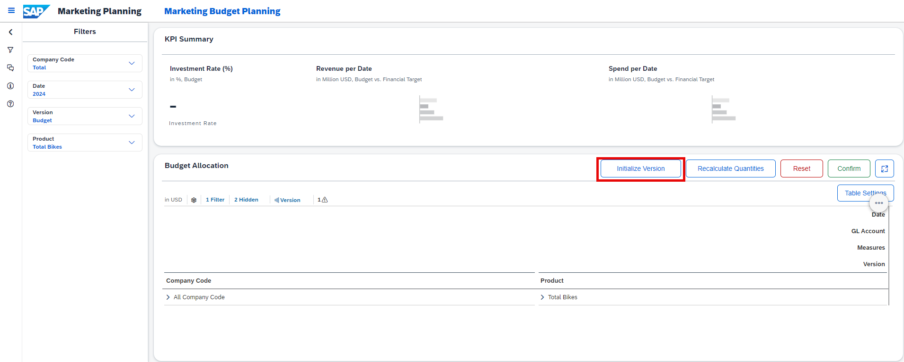

    - After clicking on the button, a dialogue pops up where you need to define the time horizon you want to populate.
    - In this case, we want to populate the Budget version for the years `2023` and `2024`. Click on **Start** to start the initialization process.
    
    <!-- border; size:540px -->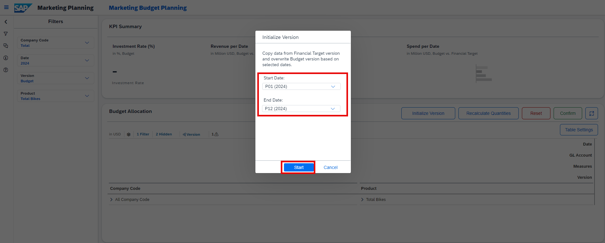

    >INFORMATION:
    >
    - The budget version is initialized by copying over data from the `Financial Target` version.
    - The `Financial Target` version is predefined and serves as a sort of high-level budget provided by the financial department or upper management. 

3. Add additional measures to table

    - Click on the button **Table Settings** located on the top-right corner above the table.

    <!-- border; size:540px -->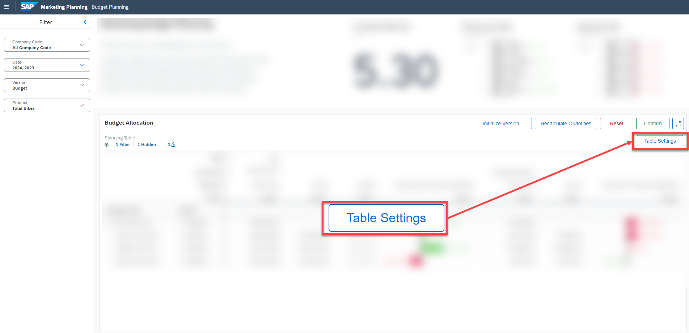

    - A pop-up shows up. Select all measures and click on **Apply**.

    <!-- border; size:540px -->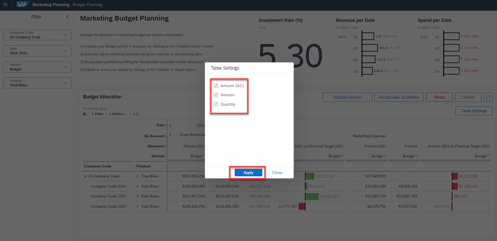

    - You should now be able to see the revenue in both global and local currency inside the table. 
    - In addition to that you can also see the quantity as a read-only measure.

    <!-- border; size:540px -->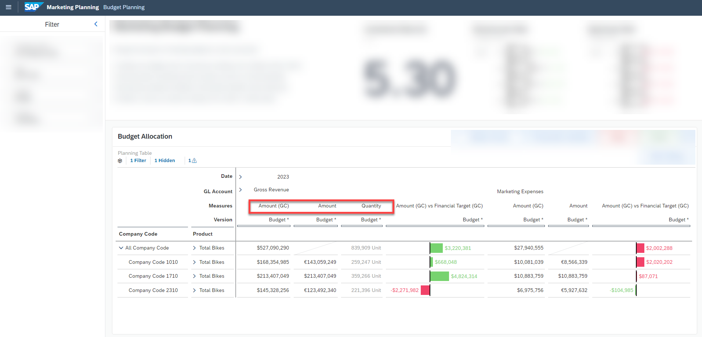

4. Adjust the revenue budget

    - You can now adjust the revenue budget based on global or local currency, this is completely up to you.
    - Expand the G/L Account structure to see plannable account members. In the scope of this content package, we only have the accounts **Revenue Domestic** and **Marketing Expenses** that requires budgeting. 
    - To edit the revenue and marketing expense budget, simply click on any editable cell and change the value.

    <!-- border; size:540px -->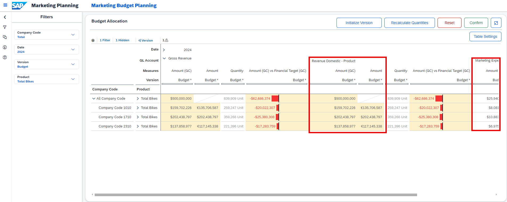

    - If you want to distribute the marketing expense budget based on the ratio of your revenue budget, you can do so by using SAC standard functionality. 
    - To do so, simply copy the revenue value of a cell and paste it into the expense cell on the same data record. Please note that this is only possible on a single member level though - you cannot copy and paste node values. In this particular example, you need to expand the account dimension in the table and copy the value under the account member `Revenue Domestic - Product` as shown in the screenshot.

    <!-- border; size:540px -->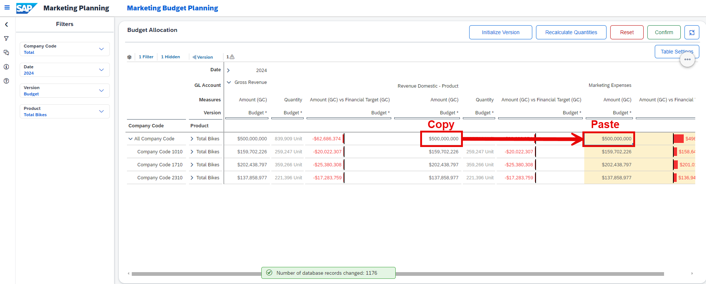

    - Now, both revenue budget and marketing expense budget should have the same number across all records. 
    - Afterwards, edit the value inside the cell where you just pasted the revenue value into. SAC will automatically take over the distribution of the budget based on the revenue or respectively based on the values that you have just pasted. 

    <!-- border; size:540px -->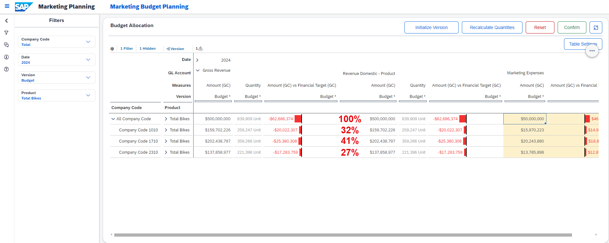

    - In this example, the marketing expenses were adjusted from a value of `550.000.000` to `550.000`, which is exactly 10 % of the revenue budget. As you can see, the distribution of the overall marketing expense budget among the company codes is precisely the same as for the revenue budget with `Company Code 1010` having around 32 % of the overall budget, `Company Code 1710` having around 40.5 % of the overall budget and `Company Code 2310` having around 27.5 % of the overall budget.

5. Recalculate the quantities

    - Now that you have adjusted the revenue budget, you need to refresh the quantities in order for the data in the model to be correct. 
    - Click on the **Recalculate Quantities** button to recalculate all quantities based on the new revenue.
  
    <!-- border; size:540px -->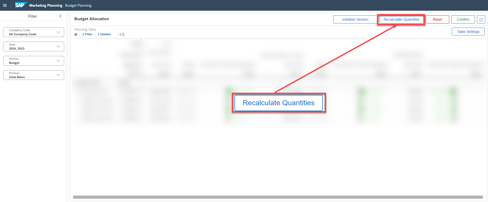

6. Publish or revert your version

    - Click on the **Confirm** or **Reset** button in order to publish or revert your plan data.
    
    >INFORMATION:
    >
    - By publishing the version, all users with sufficient rights will be able to see your edits in the version you were working on.
    - As soon as you start editing a public version, a private version is created in the background, which only you can see. All edits you do are done on this private version. Thus your work-in-progress is only visible to you.
    - It is possible to leave the story and resume your work on another day without losing your progress.
    - Only after publishing the version your changes will be written to the public version and will be visible to all other users.
    - Learn more about the concept of planning on public versions in our [SAP Help Portal](https://help.sap.com/docs/SAP_ANALYTICS_CLOUD/00f68c2e08b941f081002fd3691d86a7/b6e3d093988e4c3eba7eb6c1c110e954.html?q=version)

[OPTION END]

### Marketing Demand Planning
Now that the budget is planned, you can continue with your planning activities on the `Plan` version. Please note that the overall planning process is not considered to be linear or to be performed successively. It is rather an iterative process, so it does not matter whether you start your planning activities by using this story or any other planning story of this content package. 

In this step, the **Marketing Demand Planning** (`SAP_MKT_MarketingDemandPlanning`) story of this content package is introduced.

You will learn how to open the story (Tab 1) and how to enter your planning assumptions (Tab 2).

[OPTION BEGIN [Open Story]]
Currently, you have opened the tab **Open Story**. This tab provides guidance on how to open the **Marketing Demand Planning** (`SAP_MKT_MarketingDemandPlanning`) story.

1. Click on the burger menu located on the top left corner of the **Marketing Budget Planning** (`SAP_MKT_MarketingBudgetPlanning`) story if it is still opened.
2. Now click on either **Marketing Planning** to jump back to the **Marketing Planning Overview Page** or on **Marketing Demand Planning** to directly access the **Marketing Demand Planning** story. 

    <!-- border; size:540px -->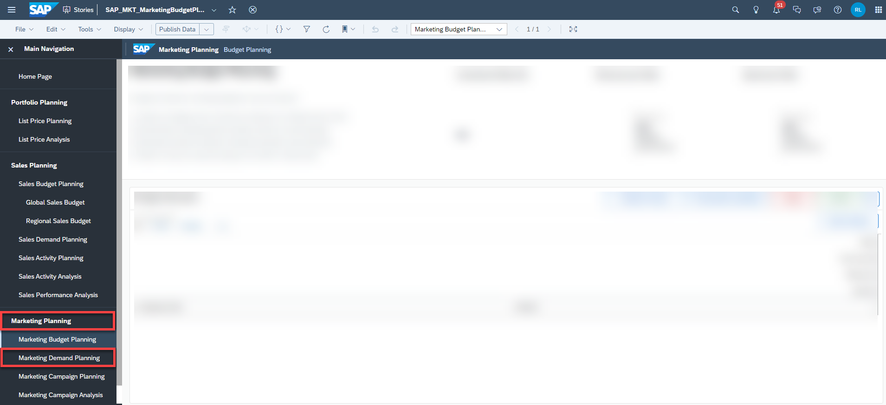
    
    In this particular case, we will go back to the **Marketing Planning Overview Page** by clicking on the **Marketing Planning** button.

3. Click on the link **Marketing Demand Planning** to enter the story.

    <!-- border; size:540px -->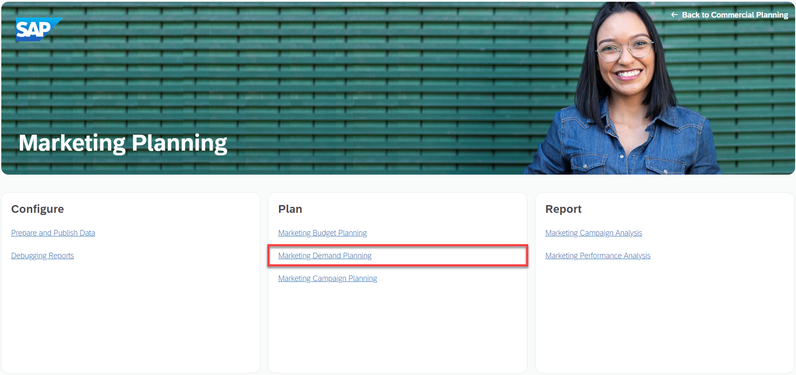

4. Get an overview of the application

    <!-- border; size:540px -->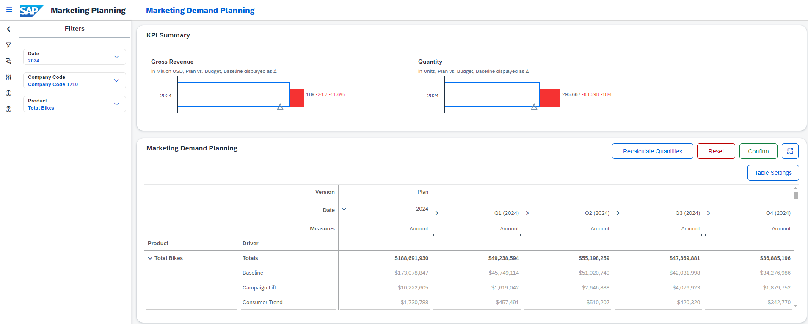

    - The story consists of three sections. 
    - The header section provides two charts showing the the total gross revenue and the total quantity by year. 
    - The context for all charts is defined by the filters set in the input controls on the left-hand side of the story. 
    - The (total) gross revenue or respectively (total) quantity residing on the plan version is displayed as a bar, while the baseline quantity and baseline revenue is indicated by the triangle below the bars. 
    - The red or respectively green bars (depending on whether the deviation is positive or negative) show the variance between the `Plan` and the `Budget` version.

    - The second important section is the left-side panel, which can be found on the left-hand side of the application. 
    - Per default the filter panel is opened. It provides input controls in which you can define your planning context for this story.
    - By clicking on the icons on the very left, you can change the context of the panel to either show comments or the driver table. 

    - The last important section is the planning section in the center of the story. 
    - The planning table is the place where you can enter your planning assumptions.
    - You can either plan revenues or quantities. The entry is only allowed on a Totals level in order to keep the distribution between the different drivers equal. 
  
You may now switch to the second tab **Enter Plan Data** to learn how to enter your planning assumptions.

[OPTION END]

[OPTION BEGIN [Enter Plan Data]]
Currently, you have opened the tab **Enter Plan Data**. This tab provides guidance on how to enter your plan data and how to plan the drivers.

1. Adjust your filters in the filter panel.
   
    - According to the **Steps** description field, start your activities by adjusting your filters in the filter panel if required. 
    
    >INFORMATION:
    >
    For the following demonstration, we will keep the default settings.

    <!-- border; size:540px -->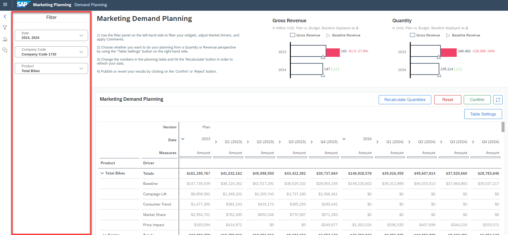

    >INFORMATION:
    >
    - All filters apart from the date filter are preset manually and are static as a result.
    - If you want to change your default settings for the filters, please go into edit mode of the story and change the selection of the input controls. 
    - The date filter on the other hand uses a tiny script and always sets the current year and the next year as default. As this tutorial was published in 2023, the date filter is set to the year 2023 and 2024. 
    - Check out the tutorial [xP&A Commercial Planning - Customize Default Settings](xpa-sac-cx-customize-default-settings) to learn in detail how to customize your default settings.

2. Adjust the total revenue

    - Click on any editable cell to adjust the planned revenue and enter a new number. 

    >INFORMATION:
    >
    - In this story, planning assumptions can only be entered on the totals level. It is not possible to adjust the absolute values for each driver individually.
    - If you want to change your baseline revenue, you can only do so by manipulating the value in the totals row. 
    - If you want to change the values of the price impact or the campaign uplift driver, you have to jump into the respective stories to do so.
    - In order to change the price impact driver, please visit the **List Price Planning** story. For the campaign lift driver, visit the **Marketing Campaign Planning** story. For the consumer trend and market share driver, a detailed description will be provided later in this step. 

    <!-- border; size:540px -->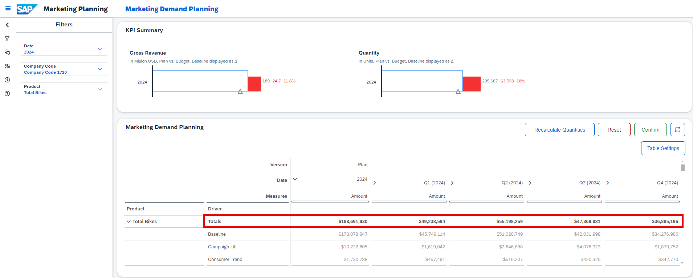

3. Recalculate quantities

    - Now that you have changed your planned revenue, the planned quantities must be refreshed as well to keep data in the model correct.
    - In order to do so, click on the **Recalculate Quantities** button.

    <!-- border; size:540px -->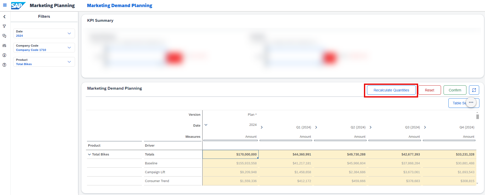

4. Switch to the quantity point of view

    - Click on the **Table Settings** button and select `Quantity`.
    - Click on **Apply** afterwards to change the table view from a revenue-based planning mode to a quantity-based planning mode.
    - You can now do your planning based on quantities.

    <!-- border; size:540px -->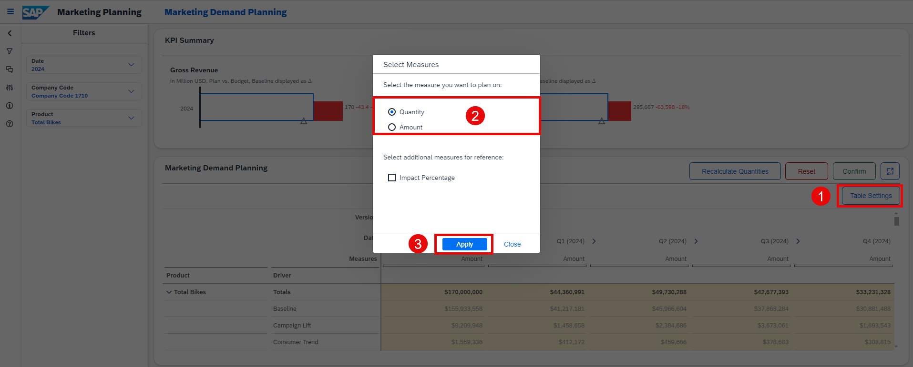

5. Adjust the quantity

    - The concept of planning quantities is precisely the same as for revenues.
    - To change a value, simply click on an editable cell and type in your new planning assumption.
  
    <!-- border; size:540px -->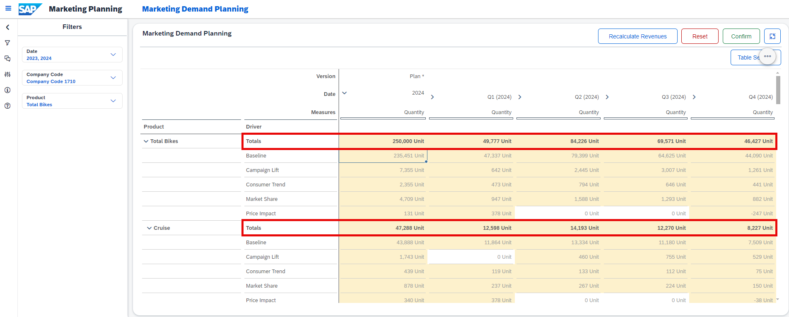

6. Recalculate revenues

    - Now that you have changed your planned quantities, the planned revenues must be refreshed as well.
    - In order to do so, click on the **Recalculate Revenues** button.
  
    <!-- border; size:540px -->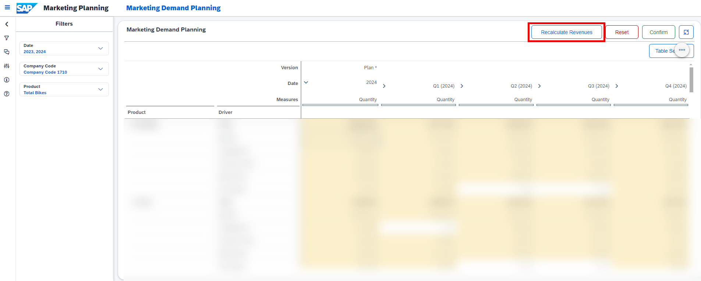

    >INFORMATION:
    >
    - In some cases you might experience that your entered value is slightly adjusted after the calculation.
    - This is because the executed data action contains a step in which your incremental quantities are refreshed based on the maintained quantitiy impact percentage values first to ensure data integrity. 
    - As `Quantity` is an integer measure while `Quantity Impact (%)` is a decimal measure, results are stored as integer values consequently which leads to the slight adjustments you might experience. 

7. Adjust the market share and consumer trend drivers

    - In order to adjust the drivers, click on the little chart icon in the left-side panel.
    - A table will open up where you can maintain your drivers on a product group level. 
    - To change a driver, simply adjust the values.
    - Do not forget to click on **Apply Drivers** once you are done to apply the new drivers and trigger a recalculation for the incremental quantities, revenues and costs. 

    <!-- border; size:540px -->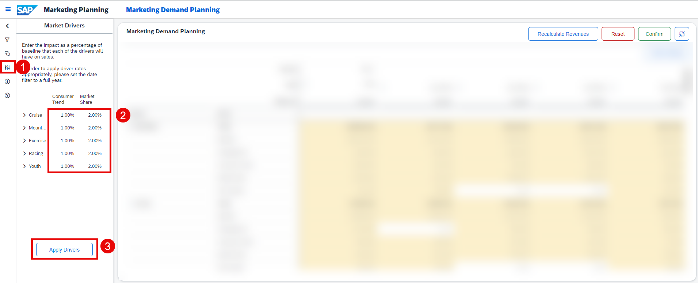

    >INFORMATION:
    >
    - This table takes into consideration all settings from the filter panel.

8. Add the Impact (%) measure to the table

    - Click on the **Table Settings** button and select the `Impact Percentage` measure.
    - Click on **Apply** to add the measure to the table.

    <!-- border; size:540px -->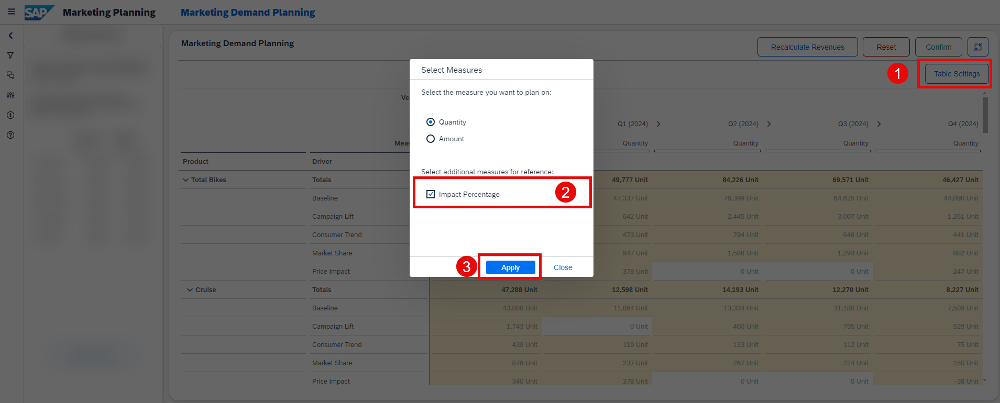

    >INFORMATION:
    >
    The Impact Percentage is a read-only measure which only provides you with some additional context.

9.  Add a comment in the comment panel

    - In order to add a comment, click on the little chat bubble icon in the left-side panel.
    - A comment widget will appear where you can leave comments for yourself or your colleagues.
    - To add a comment, click on the small icon on the top-right corner of the comment panel.
    - Enter your text and click on **Add Comment**.

    <!-- border; size:540px -->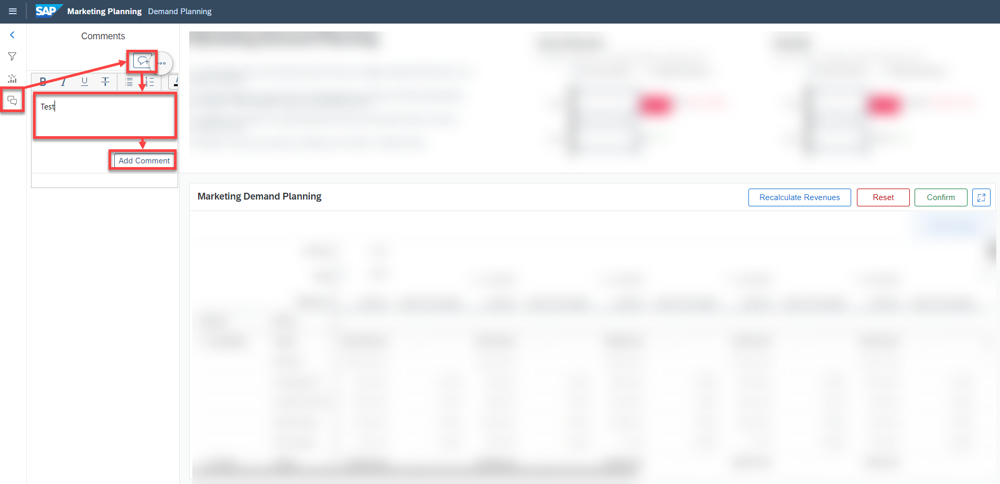

    >INFORMATION:
    >
    The context of the comment panel is defined by your table settings. If you leave a comment while being in the quantitiy-based planning mode, it will not be visible in the revenue-based mode and vice versa. 

10. Publish or revert your version

    - Click on the **Confirm** or **Reset** button in order to publish or revert your plan data.
    
    >INFORMATION:
    >
    - By publishing the version, all users with sufficient rights will be able to see your edits in the version you were working on.
    - As soon as you start editing a public version, a private version is created in the background, which only you can see. All edits you do are done on this private version. Thus your work-in-progress is only visible to you.
    - It is possible to leave the story and resume your work on another day without losing your progress.
    - Only after publishing the version your changes will be written to the public version and will be visible to all other users.
    - Learn more about the concept of planning on public versions in our [SAP Help Portal](https://help.sap.com/docs/SAP_ANALYTICS_CLOUD/00f68c2e08b941f081002fd3691d86a7/b6e3d093988e4c3eba7eb6c1c110e954.html?q=version)

[OPTION END]

### Marketing Campaign Planning
In this step, the **Marketing Campaign Planning** (`SAP_MKT_MarketingCampaignPlanning`) story of this content package is introduced.

You will learn how to open the story (Tab 1) and how to create, modify and delete marketing campaigns and marketing activities (Tab 2).

[OPTION BEGIN [Open Story]]
Currently, you have opened the tab **Open Story**. This tab provides guidance on how to open the **Marketing Campaign Planning** (`SAP_MKT_MarketingCampaignPlanning`) story.

1. If you are still located inside the **Marketing Demand Planning** story introduced in the previous step, click on the burger menu located on the top left corner to open the navigation panel.
2. Now click on either **Marketing Planning** to jump back to the **Marketing Planning Overview Page** or on **Marketing Campaign Planning** to directly access the **Marketing Campaign Planning** story. 

    <!-- border; size:540px -->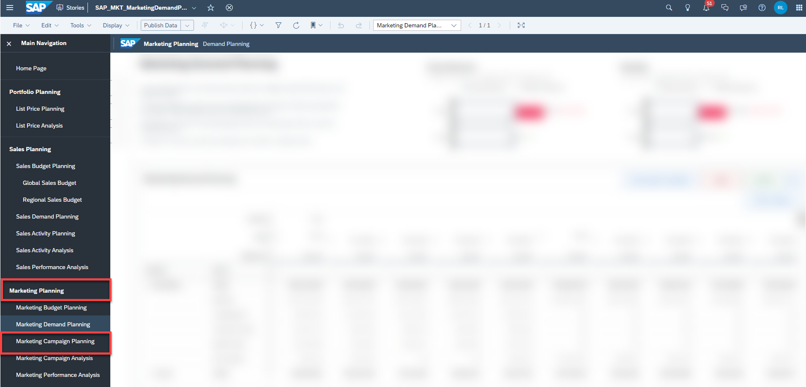
    
    In this particular case, we will go back to the **Marketing Planning Overview Page** by clicking on the **Marketing Planning** button.

3. Click on the link **Marketing Campaign Planning** to enter the story.

    <!-- border; size:540px -->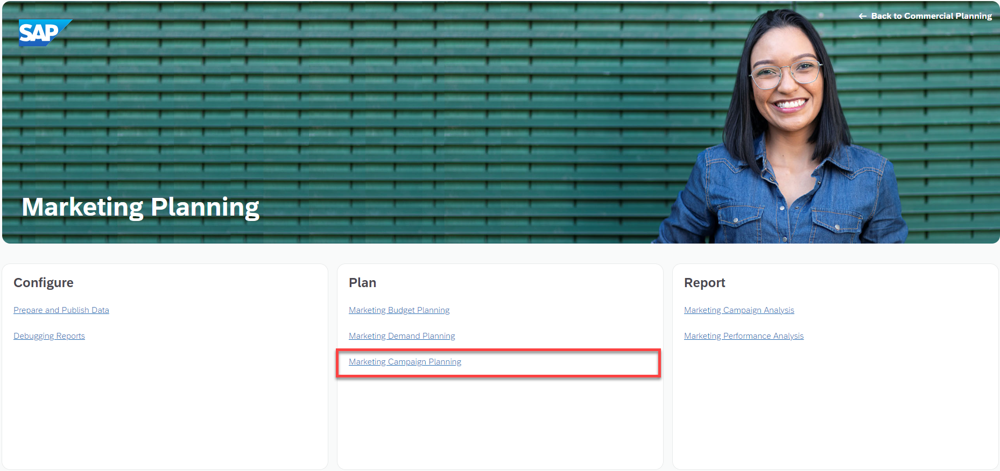

4. Get an overview of the application

    <!-- border; size:540px -->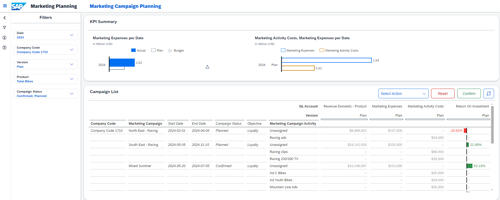

    - The story consists of three sections. 
    - The header section provides two charts. The first one is showing the the marketing expenses per year and version while the second one displays the overall marketing expenses as compared to the marketing activity costs . 
    - The context for the header charts is defined by the filters set in the input controls on the left-hand side of the story. For the left header chart, the version input control is disconnected though as this chart is designed to only show the marketing expenses for the versions `Plan`, `Budget` and  `Actual`.
    - The Marketing Campaign expenses or respectively Marketing Activity costs are displayed as a bar in both charts.
    - The left chart has a little triangle attached to the bar which shows the budgeted marketing expenses. 

    - The second important section is the filter section, which can be found on the left-hand side of the application. 
    - The filter panel provides input controls in which you can define your planning context for this story.

    - The last important section is the planning section in the center of the story. 
    - Different from the other planning stories, all cells are locked and you cannot change your planning assumptions by editing the single values in the table. 
    - Your planning activities are controlled via the drop-down widget located above the table, where you can choose between different actions. 
  
You may now switch to the second tab **Plan Campaigns and Activities** to learn how to create, edit or delete marketing campaigns or marketing activities.

[OPTION END]

[OPTION BEGIN [Plan Campaigns and Activities]]
Currently, you have opened the tab **Plan Campaigns and Activities**. This tab provides guidance on how to create, edit or delete marketing campaigns or marketing activities.

1. Create a new campaign
   
    - According to the **Steps** description field, start your activities by using the drop-down widget to create a campaign. 
    - Click on the option **Create Campaign**. A new dialogue appears now where you can enter all details concerning the campaign.

    <!-- border; size:540px -->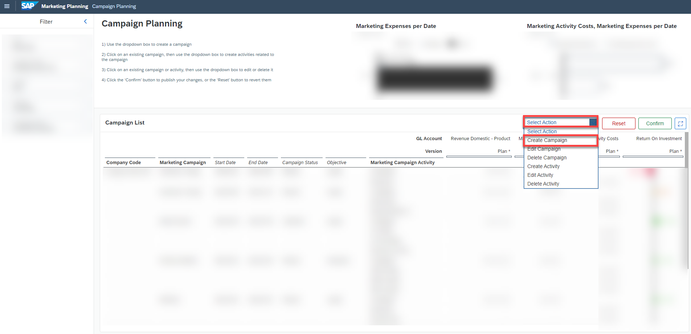

    - Provide all required information about the campaign
    - In the **Title** field, provide a descriptive name for your marketing campaign.
    - The **Campaign ID** field is auto-generated and represents the campaign ID as it will be saved in the data model.
    - The **Campaign Status** is a drop-down where you must select between four different status describing the status of your campaign, which are **Planned**, **Confirmed**, **Completed** and **Cancelled**.
    - The **Campaign Start Date** field is a date field which requires the start date for the campaign in a `YYYY-MM-DD` format. Expected revenues and consequently incremental quantities are going to occur as of this date.
    - The **Campaign End Date** field is a date field which requires the end date for the campaign in a `YYYY-MM-DD` format. Expected revenues and consequently incremental quantities are going to end on this date.
    - The **Company Code** field is a mandatory field where you need to specify the company code to which the campaign is related.
    - The **Expense Start Date** field is a date field which requires the start date for expected campaign expenses in a `YYYY-MM-DD` format. While the **Campaign Start Date** marks the point of time when incremental quantities and revenues are going to occur, the **Expense Start Date** specifies when expenses are expected to start. 
    - The **Expense End Date** field is a date field which requires the end date for expected campaign expenses in a `YYYY-MM-DD` format. While the **Campaign End Date** marks the point of time when incremental quantities and revenues are going to end, the **Expense End Date** specifies when expenses are expected end.
    - The **Product** drop down field is technically an input control which allows you to select the products targeted by this campaign.
    - The **Comment** text field can be optionally be filled and allows you to provide some more descriptive context to the campaign. 
    - The **Objective** drop down allows you to select the goal for your campaign. You can select between **Awareness**, **Revenue Growth** or **Loyalty**.
    - The **Amount Marketing Spend** is an input field where you need to specify the expected overall campaign spend in local currency. 
    - The **Uplift %** field is an input field where you need to specify the expected quantity uplift in percent. A value of `5 %` means that you expect the quantity and consequently the revenue to grow by `5 %`, while these `5 %` are applied on the baseline quantity and revenue, **not** the total quantity and revenue which take into consideration incremental portions from other drivers as well. 
    - Click on **Save** to create the campaign. A new model member is now created with the ID shown in the field **Campaign ID** and respective measures are calculated. 
  
    <!-- border; size:540px -->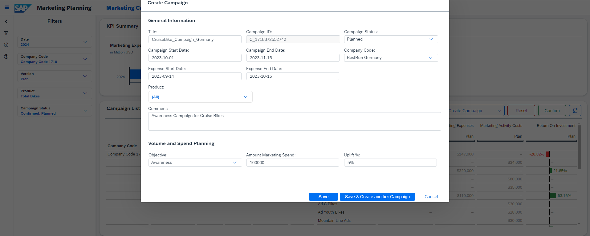

2. Edit an existing campaign 

    - According to the **Steps** description field, click on an existing campaign in the planning table. You can see the currently selected campaign in the header section of the table now.
  
    <!-- border; size:540px -->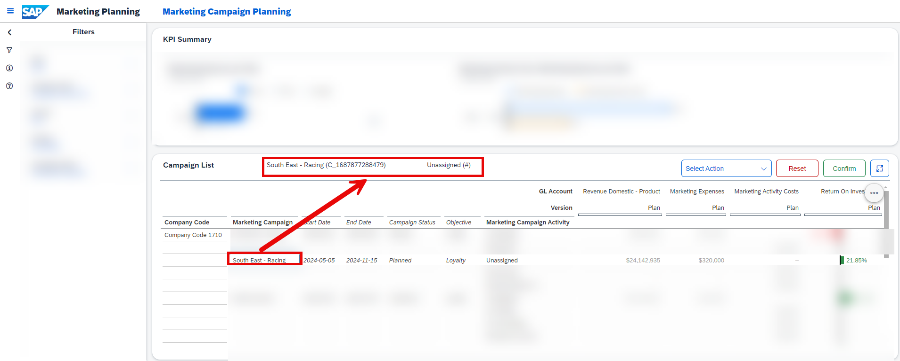  

    -  Now use the drop down widget to select the option **Edit Campaign**. A new dialogue appears now where you can enter all details about the campaign.

    <!-- border; size:540px -->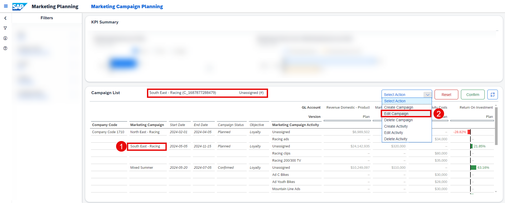  

    - You will see the exact same dialogue as for the campaign creation now, with the difference that all fields are already pre-populated based on the properties of the selected campaign.
    - Edit your campaign now and click on **Save**. All data for the existing campaign will be deleted now and a recalculation based on your new input starts. 

    <!-- border; size:540px -->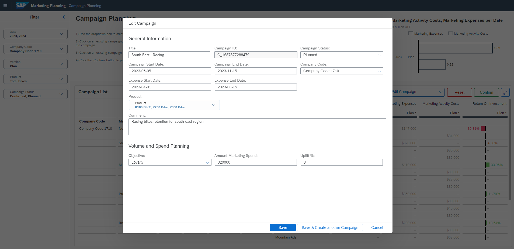  

3. Delete an existing campaign

    - Click on an existing campaign in the planning table. You can see the currently selected campaign in the header section of the table now.
  
    <!-- border; size:540px -->  

    -  Now use the drop down widget to select the option **Delete Campaign**.
  
    <!-- border; size:540px -->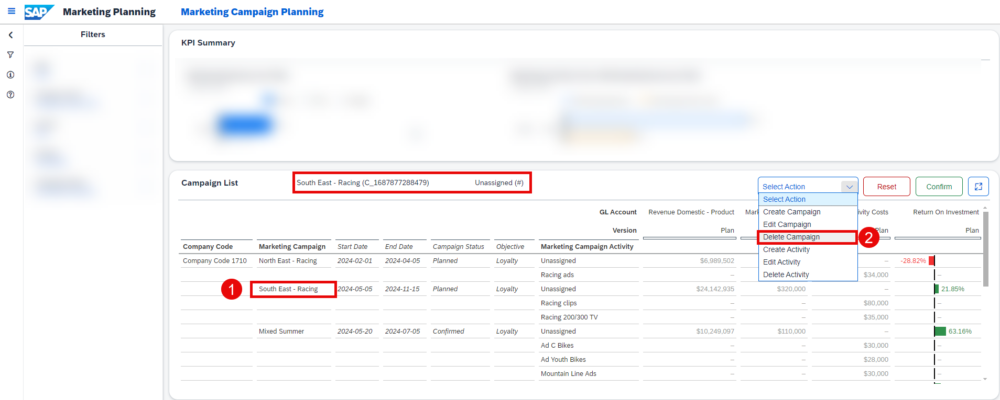  

    -   A new dialogue appears now where you are asked if you are sure about deleting this campaign. Click on **Yes** to delete the campaign from the data model or on **No** to abort the action.
  
    <!-- border; size:540px -->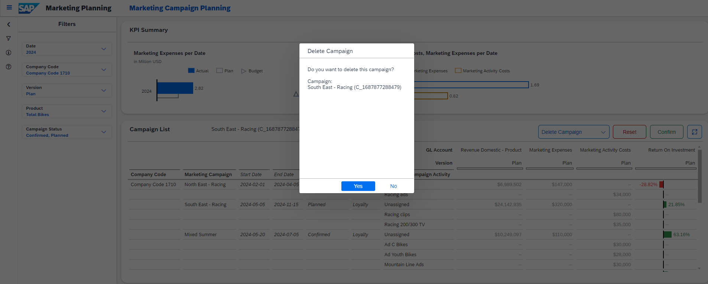  

4. Create a marketing activity

    - Now that you have learned how to create marketing campaigns, you can additionally create single marketing activities on a more granular basis related to an existing marketing campaign.
    - First click on an existing campaign in the planning table. You can then see the currently selected campaign in the header section of the table.
  
    <!-- border; size:540px -->  

    - Now use the drop down widget to select the option **Create Activity**.
    - In the table, you can already see that the marked campaign has two activities **Racing clips** and **Racing 200/300 TV**. 
  
    <!-- border; size:540px -->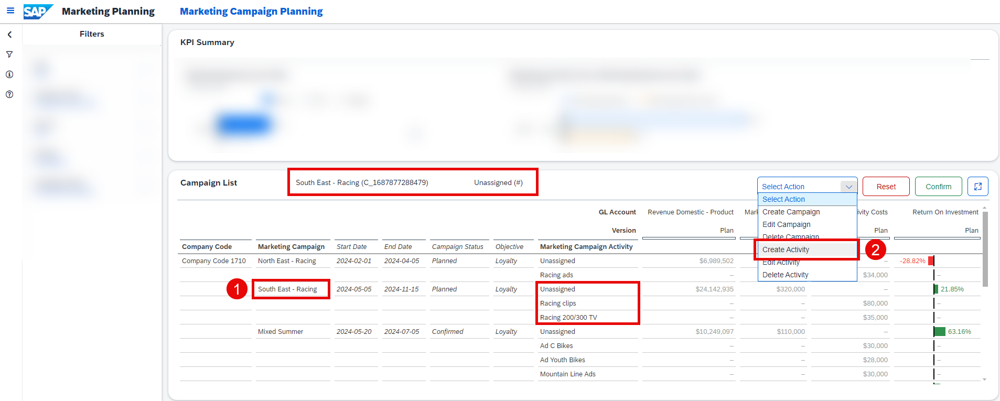  

    - A new dialogue pops up now where you need to specify some information required for the activity creation.
    - The field **Campaign Title** is already pre-populated based on your selection.
    - The field **Campaign ID** is also automatically pre-populated based on your selection.
    - The field **Company Code** is also automatically pre-populated based on your selection.
    - The input field **Activity Title** must be filled by you. Please enter a descriptive name for your marketing activity here.
    - The field **Activity ID** is automatically generated while the shown value represents the member ID which will be created in the data model.
    - The drop down **Activity Status** allows you to choose between four different activity status, which are **Planned**, **Confirmed**, **Completed** and **Cancelled**.
    - The field **Invoice Date** is another mandatory field and represents the date when your activity costs are going to occur. 
    - The **Product** drop down is an input control which is also automatically pre-populated based on your selection. You can change the selection if your activity is supposed to target only one instead of all campaign related products for instance.
    - The **Comment** text field is an optional field where you can leave additional descriptive information about the marketing activity.
    - The **Spend Type** drop down lets you choose between different spend types, where the pre-defined options are **Ad serving**, **Creative costs**, **Digital advertising**, **TV advertising** and **Market Research**. If you want to add more spend types to the selection, simply add a new member to the spend type dimension in the data model. 
    - The **Amount Activity Spend** field is a mandatory field where you need to specify the amount of expected costs for this activity in local currency. 
    - Click on **Save** to create the marketing activity.
  
    <!-- border; size:540px -->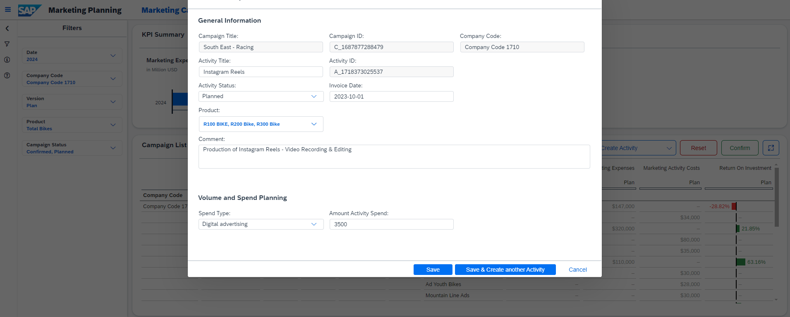  

5. Edit an existing marketing activity

    - Click on an existing marketing activity in the planning table. You can see the currently selected campaign and activity in the header section of the table now.
  
    <!-- border; size:540px -->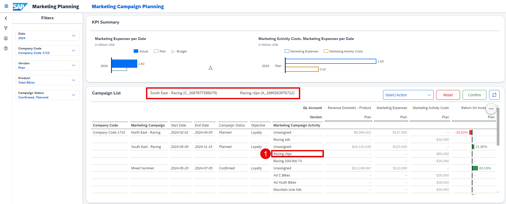  

    - Now use the drop down widget to select the option **Edit Activity**.
  
    <!-- border; size:540px -->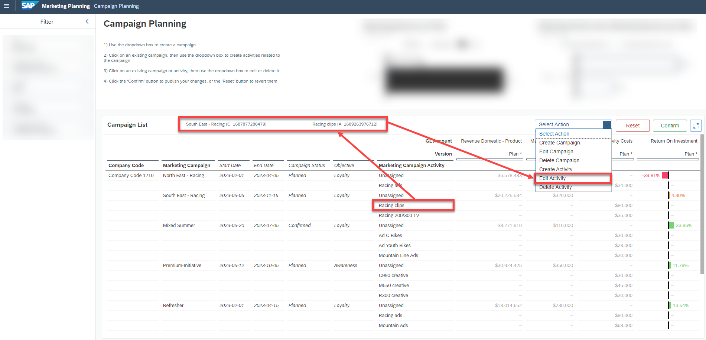  

    - You will see the exact same dialogue as for the activity creation now, with the difference that all fields are already pre-populated based on the properties of the selected activity.
    - Edit your activity now and click on **Save**. All data for the existing activity will be deleted now and a recalculation based on your new input starts. 

    <!-- border; size:540px -->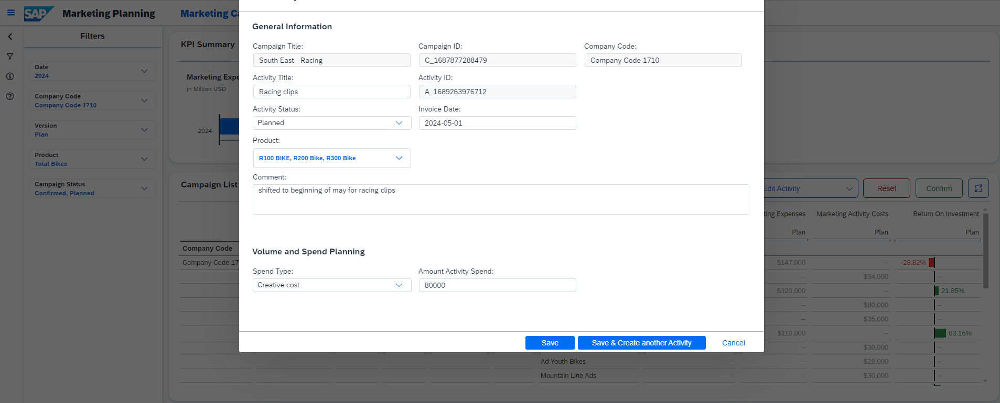  

6. Delete an existing activity

    - Click on an existing marketing activity in the planning table. You can see the currently selected campaign and activity in the header section of the table now.
  
    <!-- border; size:540px -->  

    -  Now use the drop down widget to select the option **Delete Activity**.
  
    <!-- border; size:540px -->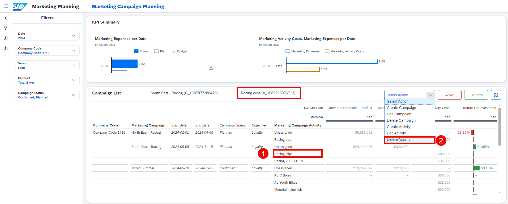  

    -   A new dialogue appears now where you are asked if you are sure about deleting this activity. Click on **Yes** to delete the activity from the data model or on **No** to abort the action.
  
    <!-- border; size:540px -->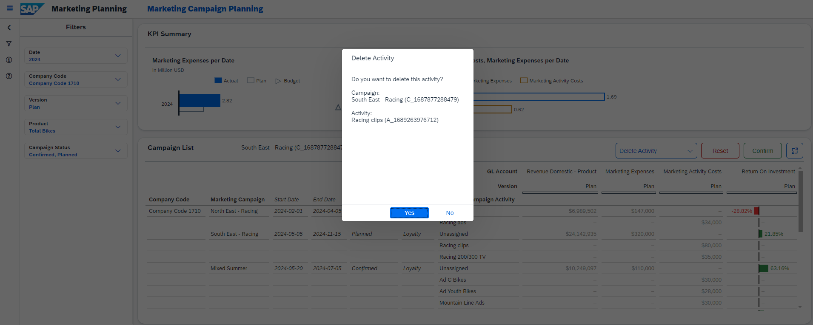  

7.  Publish or revert your version

    - Click on the **Confirm** or **Reset** button in order to publish or revert your plan data.
    
    >INFORMATION:
    >
    - By publishing the version, all users with sufficient rights will be able to see your edits in the version you were working on.
    - As soon as you start editing a public version, a private version is created in the background, which only you can see. All edits you do are done on this private version. Thus your work-in-progress is only visible to you.
    - It is possible to leave the story and resume your work on another day without losing your progress.
    - Only after publishing the version your changes will be written to the public version and will be visible to all other users.
    - Learn more about the concept of planning on public versions in our [SAP Help Portal](https://help.sap.com/docs/SAP_ANALYTICS_CLOUD/00f68c2e08b941f081002fd3691d86a7/b6e3d093988e4c3eba7eb6c1c110e954.html?q=version)

[OPTION END]

### Marketing Campaign Analysis
In this step the **Marketing Campaign Analysis** (`SAP_MKT_MarketingCampaignAnalysis`) story of this content package is introduced. 

Here you will learn how to open the story (Tab 1) and how to consume the different reports to get an overview about your marketing campaigns, activities and your financial metrics (Tab 2).

[OPTION BEGIN [Open Story]]
Currently, you have opened the tab **Open Story**. This tab provides guidance on how to open the **Marketing Campaign Analysis** (`SAP_MKT_MarketingCampaignAnalysis`) story.

1. If you still have the **Marketing Campaign Planning** story opened from the previous step, click on the burger menu located on the top left corner to open the navigation panel.
2. Now click on either **Marketing Planning** to jump back to the **Marketing Planning Overview Page** or on **Marketing Campaign Analysis** to directly access the **Marketing Campaign Analysis** story. 

    <!-- border; size:540px -->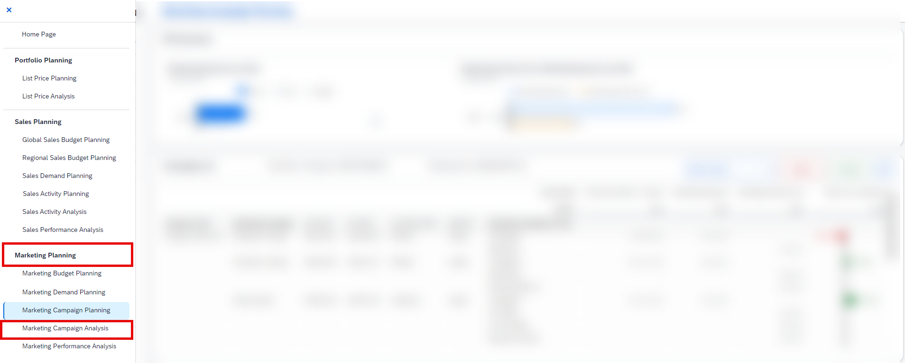
    
    In this particular case, we will go back to the **Marketing Planning Overview Page** by clicking on the **Marketing Planning** button.

3. Click on the link **Marketing Campaign Analysis** to enter the story.

    <!-- border; size:540px -->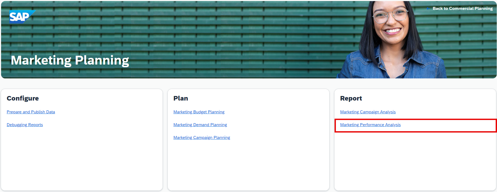

4. Get an overview of the story

    <!-- border; size:540px -->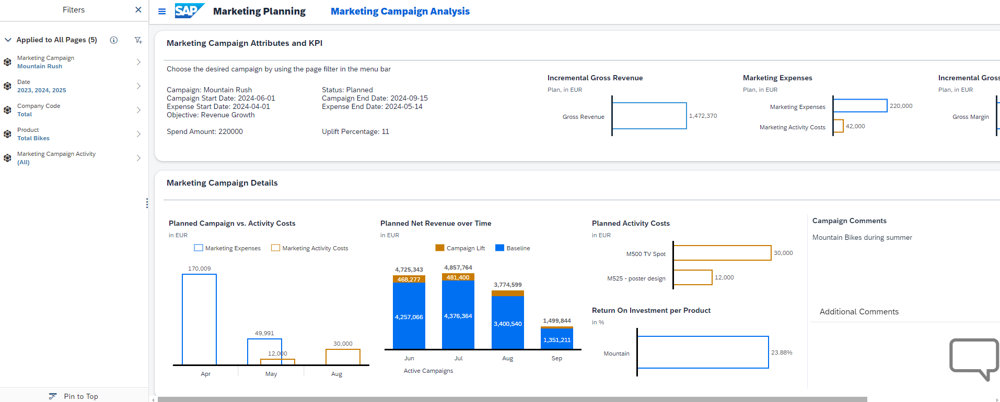

    - This story supports the marketing campaign and marketing activity planning process and provides detailed insights into income and expense related topics. 
    - It provides visualizations which for instance show the amount of planned campaign and activity costs and revenues as well as other metrics such as the expected ROI and more. 
    - In addition to that, the report can be consumed in a tabular or graphical view by using the switch button on the top right corner of the reporting section. 

[OPTION END]

[OPTION BEGIN [Reporting]]
Currently, you have opened the tab **Reporting**. This tab provides information about the navigation concept of the story and the reported data.

1. **Filter** panel

    - When you open the story, you can see a filter panel on the left-hand side of the story where you can select your marketing campaign, marketing activity and other things. 

    <!-- border; size:540px -->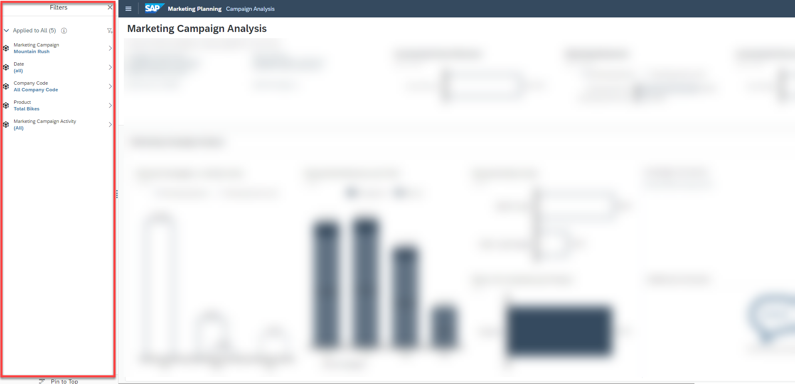

    - These filters define the entire context for the reporting story. 
    - Different from the filter panels in the planning stories where the panel is created manually, this panel is an SAC in-built filter panel. 
    - If you close the filter panel, you will not have the left-side panel visible anymore. Instead, you have to go to the header of the story and click on the filter icon to display the filter panel again.

    <!-- border; size:540px -->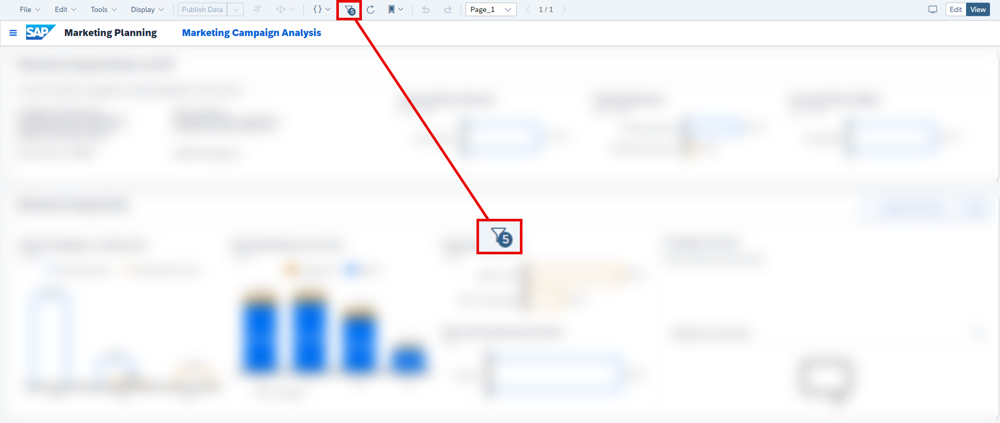

2. **Header** section

    - In the header section you can find three graphs that provide you with high level insights.
    - Next to the graphs, you can find more detailed information about the context in a descriptive form. 
    - The text on the left-hand side applies not only to the header graphs, but to all charts of this story.
    
    <!-- border; size:540px -->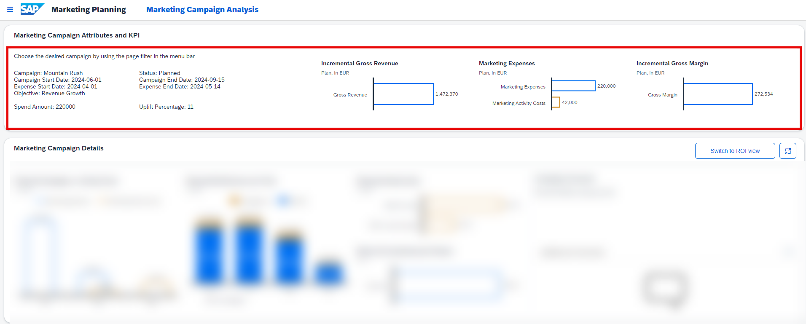

    - The **Incremental Gross Revenue** graph shows the gross revenue of the current selection made in the filter section. 
    - The **Marketing Expenses** graph shows the marketing expenses and the planned marketing activity costs of the current selection made in the filter section. 
    - The **Incremental Gross Margin** graph shows the gross margin of the current selection made in the filter section

3. **Marketing Campaign Analysis** section

    - This section provides deeper insights into key metrics and allows you to analyze your campaigns in more detail. 
    
    <!-- border; size:540px -->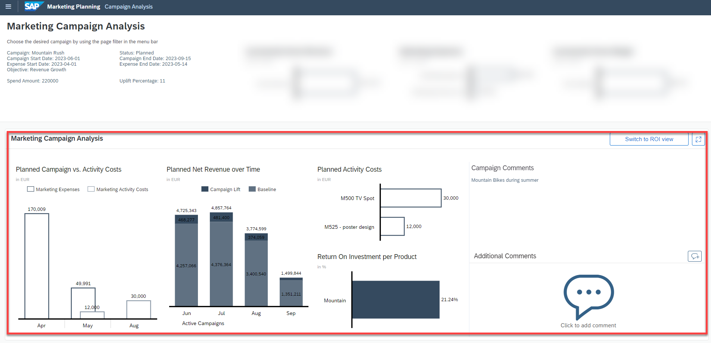

    - The **Planned Campaign vs. Activity Costs** graph shows the marketing expenses in relation to the marketing activity costs per month under consideration of the current selection made in the filter panel.
    - The **Planned Net Revenue over Time** graph shows the net revenue per month under consideration of the current selection made in the filter panel as bar charts, while the colors of the bar chart show which portion comes from the baseline driver and which portion comes from campaign planning related activities.
    - The **Planned Activity Costs** chart shows the activity costs per activity under consideration of the current selection made in the filter panel as bar charts.
    - The **Return on Investment per Product** graph shows the ROI per product under consideration of the current selection made in the filter panel as bar chart.
    - The **Campaign Comments** display commentary you entered when creating and editing the currently-selected campaign.
    - The **Additional Comments** section provides a place where you can leave additional comments for yourself or your colleagues. 

4. **ROI view** mode

    - Click on the button **Switch to ROI view** to enter the tabular point of view. 
   
    <!-- border; size:540px -->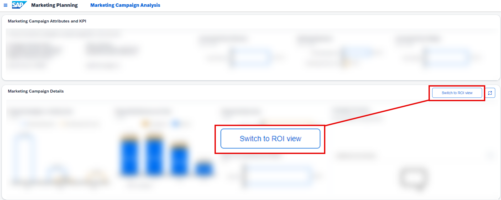

    - You can now consume the report in a tabular instead of a graphical view.

    <!-- border; size:540px -->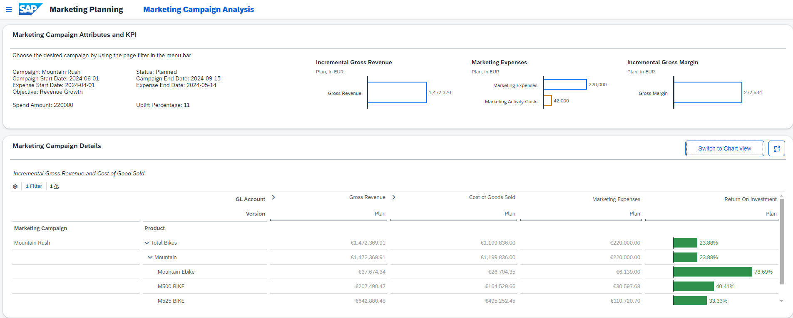

    - Again, the context of the table is defined by the selections made in the filter panel. 
    - Using the table, you can drill into different G/L Accounts and compare your revenues with your expenses on a campaign level. 
    - In addition to that you can also check the ROI per product by consuming the in-cell graphs in the table.

[OPTION END]

### Marketing Performance Analysis
In this step the **Marketing Performance Analysis** (`SAP_MKT_MarketingPerformanceAnalysis`) story of this content package is introduced. 

Here you will learn how to open the story (Tab 1) and how to consume the different reports to get an overview about your marketing performance and all important financial metrics (Tab 2).

[OPTION BEGIN [Open Story]]
Currently, you have opened the tab **Open Story**. This tab provides guidance on how to open the **Marketing Performance Analysis** (`SAP_MKT_MarketingPerformanceAnalysis`) story.

1. If you still have the **Marketing Campaign Analysis** story opened from the previous step, click on the burger menu located on the top left corner to open the navigation panel.
2. Now click on either **Marketing Planning** to jump back to the **Marketing Planning Overview Page** or on **Marketing Performance Analysis** to directly access the **Marketing Performance Analysis** story. 

    <!-- border; size:540px -->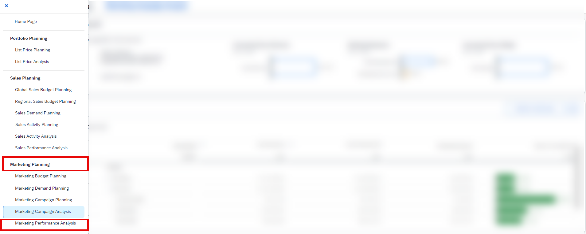
    
    In this particular case, we will go back to the **Marketing Planning Overview Page** by clicking on the **Marketing Planning** button.

3. Click on the link **Marketing Performance Analysis** to enter the story.

    <!-- border; size:540px -->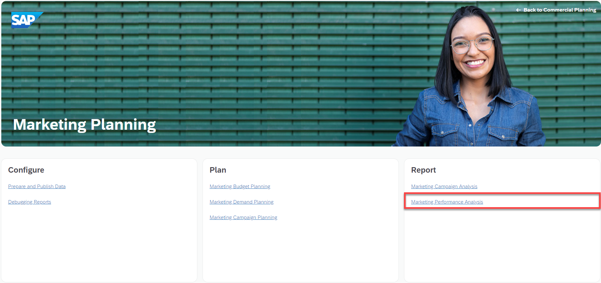

4. Get an overview of the story

    <!-- border; size:540px -->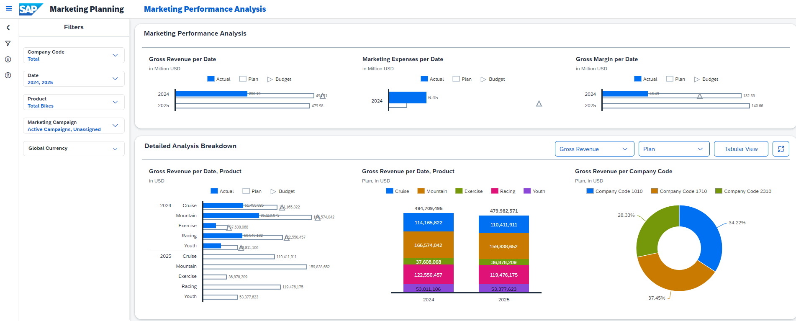

    - This story supports the marketing planning process and provides detailed insights into income and expense topics. 
    - It provides different modes where you can inspect your revenues, costs or margins per version in detail.
    - In addition to that, the report can be consumed in a tabular or graphical view by using the switch button on the top right corner of the reporting section. 

[OPTION END]

[OPTION BEGIN [Reporting]]
Currently, you have opened the tab **Reporting**. This tab provides information about the navigation concept of the story and the reported data.

1. **Filter** panel

    - When you open the story, you can see a filter panel on the left-hand side of the story where you can define the context of the story. 
    - These settings are applied on the entire story.

    <!-- border; size:540px -->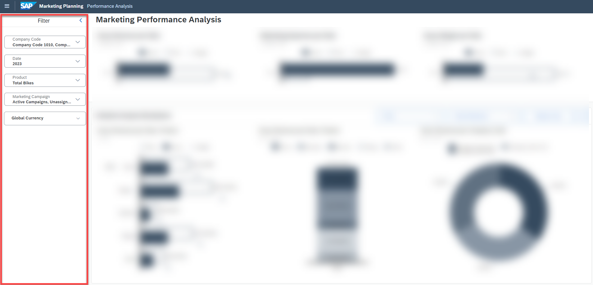

    - In addition to the filter settings, you can also switch between a local currency or global currency point of view in this panel. 
    - In order to do so, click on the last drop down and select either **Local Currency** or **Global Currency**.
  
    <!-- border; size:540px -->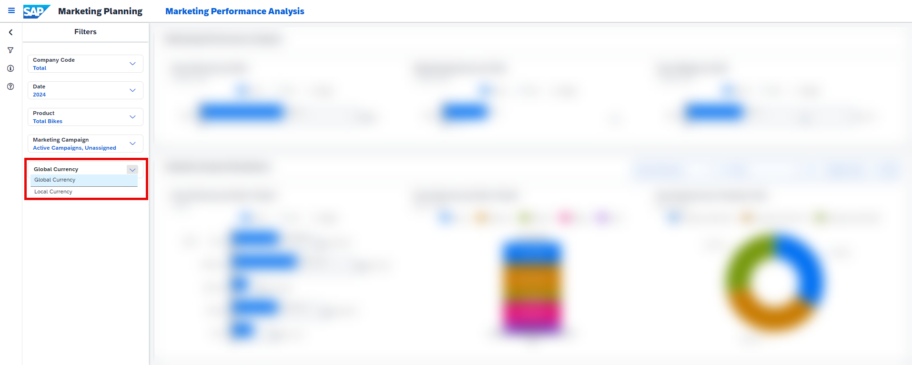

    >INFORMATION:
    >
    - When you switch to the local currency mode, please make sure to select only **one** company code in the company code input control inside the filter panel.
    - Otherwise you may receive misleading results as SAC aggregates the raw numbers as they are stored in the data model over all company codes, which can be critical when company codes use different currencies.

2. **Header** section

    - In the header section you can find three graphs that provide you with high level insights.
    
    <!-- border; size:540px -->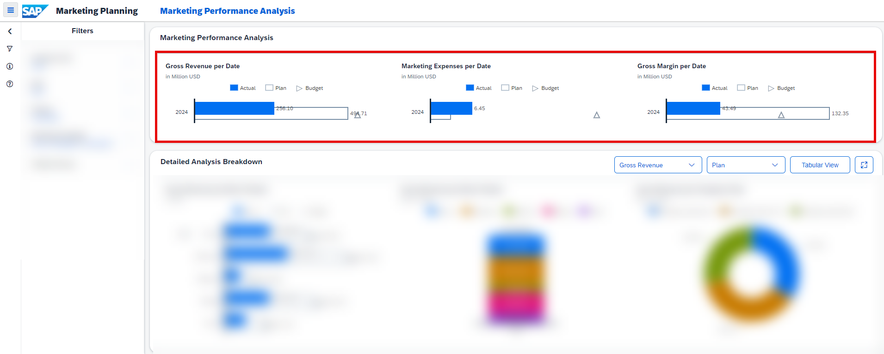

    - The **Gross Revenue per Date** graph shows the gross revenue under consideration of the current selection made in the filter section across multiple versions. All versions apart from the `Budget` version are displayed as a bar, while the `Budget version` itself is represented by the small triangle.  
    - The **Marketing Expenses per Date** graph shows the marketing expenses under consideration of the current selection made in the filter section across multiple versions. All versions apart from the `Budget` version are displayed as a bar, while the `Budget version` itself is represented by the small triangle.  
    - The **Gross Margin per Date** graph shows the gross margin under consideration of the current selection made in the filter section across multiple versions. All versions apart from the `Budget` version are displayed as a bar, while the `Budget version` itself is represented by the small triangle.  

3. **Detailed Analysis Breakdown** section

    - This section provides deeper insights into key metrics and allows you to analyze your marketing activities and versions in more detail. 
    
    <!-- border; size:540px -->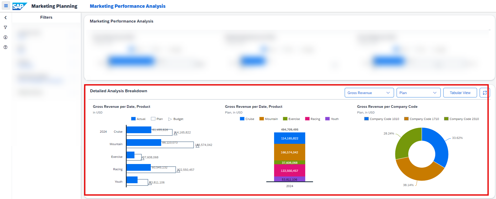

    - To change the displayed version, use the drop down widget located in the header of the breakdown section.

    <!-- border; size:540px -->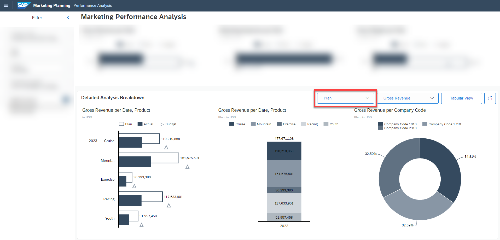

    - To change the displayed measure, use the drop down widget located in the header of the breakdown section.
    
    <!-- border; size:540px -->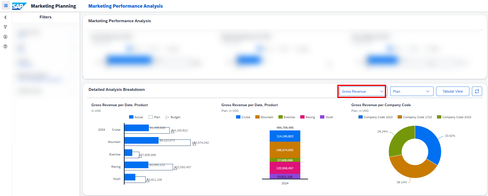

    - Per default, the view is set to **Gross Revenue**.
    - The **Gross Revenue per Date, Product** graph on the left-hand side shows the gross revenue per year and product group under consideration of the current selection made in the filter panel for all versions.
    - The **Gross Revenue per Date, Product** graph in the center shows the gross revenue per year and product group under consideration of the current selection made in the filter panel for only the selected version, while the gross revenue is depicted as one bar, split into different colors where the colors represent the product groups. 
    - The **Gross Revenue per Company Code** shows the gross revenue split between the different company codes in percent under consideration of the current selection made in the filter panel.
    - If you now switch the measure by using the drop down in the header line to show marketing expenses, you will see the exact same reports, but focussing on marketing expenses instead of the gross revenue.

    <!-- border; size:540px -->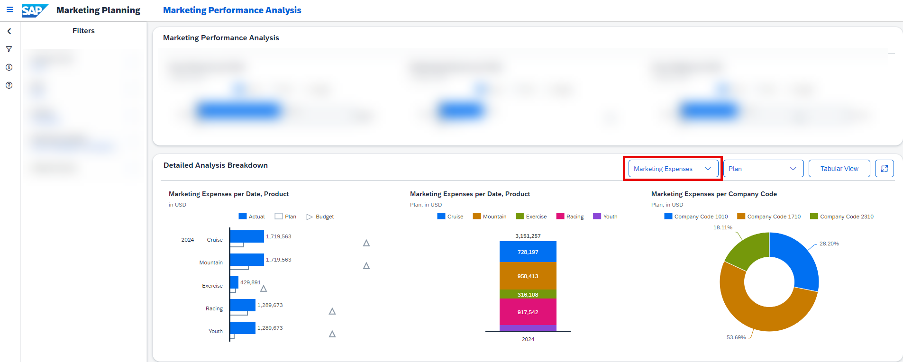

    - The same applies when you switch to the gross margin view. Now the graphs will show you the gross margin instead of marketing expenses or the gross revenue.

    <!-- border; size:540px -->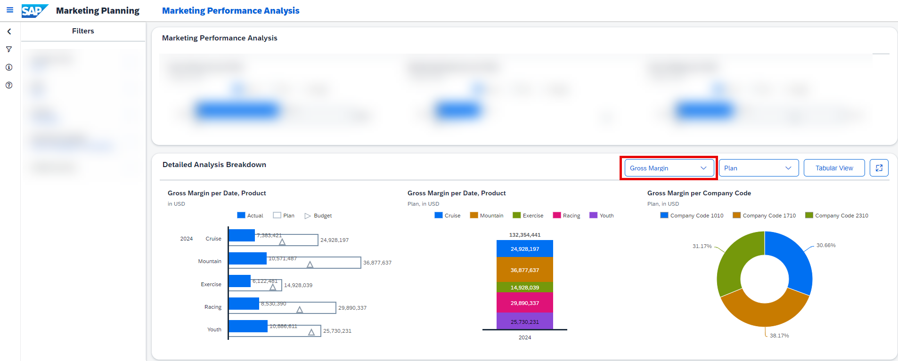

4. **Table View** mode

    - Lastly, you also have the possibility to switch over from a graphical mode to a tabular mode by using the **Tabular View** button on the top right corner.

    <!-- border; size:540px -->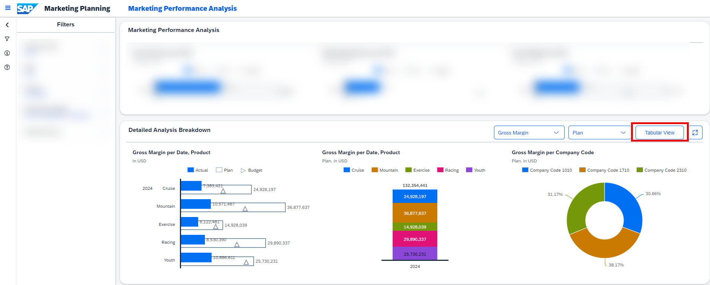

    - The table displays the revenues and costs per product and version and also contains some in-cell graphs to compare the versions. 
    - You can drill down along the product hierarchy or the account hierarchy to receive deeper insights. 

    <!-- border; size:540px -->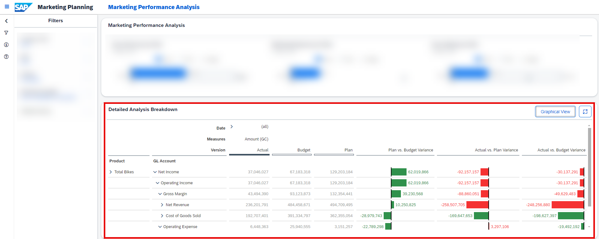

    - If you want to go back to the graphical point of view, simply click on the **Graphical View** button.

[OPTION END]

### Final Remarks
Congratulations! You have finished the introduction tutorial and are now able to use the **Marketing Planning** content like an expert.

If you want to learn more about the other modules of this content package, check out the following tutorials:

- [xP&A Commercial Planning - Get to know the Sales Planning module](xpa-sac-cxsp-salesplanning-gettoknow)
- [xP&A Commercial Planning - Get to know the Portfolio Planning module](xpa-sac-cxpp-portfolioplanning-gettoknow)

If you want to customize the content and adjust it according to your own business requirements, the following resources might be helpful:

- [xP&A Commercial Planning - Introduction to the Data Model](xpa-sac-cxmp-datamodelfundamentals)
- [xP&A Commercial Planning - Understanding the technical structure of Stories](xpa-sac-cx-technical-structure-of-stories)
- [xP&A Commercial Planning - Data Integration](xpa-sac-cx-data-integration-setup)
- [xP&A Commercial Planning - Manage data loads](xpa-sac-cx-manage-data-loads)
- [xP&A Commercial Planning - Add additional sections to a story](xpa-sac-cx-add-new-sections-to-app)
- [xP&A Commercial Planning - Add an additional story to the Navigation Menu](xpa-sac-cx-add-new-story-to-navmenu)
- [xP&A Commercial Planning - Customize Default Settings](xpa-sac-cx-customize-default-settings)
- [xP&A Commercial Planning - Customize Table Settings Dialogue](xpa-sac-cx-customize-table-settings-dialogue)
- [xP&A Commercial Planning (Marketing) - Add a new Driver](xpa-sac-cxmp-add-new-driver)
- [xP&A Commercial Planning (Marketing) - Add a new Version](xpa-sac-cxmp-add-new-version)
- [xP&A Commercial Planning (Marketing) - Extend campaign and activity attributes](xpa-sac-cxmp-add-new-attributes)
- [xP&A Commercial Planning (Marketing) - Extend activity spend dates](xpa-sac-cxmp-extend-activity-dates)
- [xP&A Commercial Planning (Sales) - Add a new Version](xpa-sac-cxsp-add-new-version)
- [xP&A Commercial Planning (Sales) - Add a new Tactic](xpa-sac-cxsp-add-new-tactic)
- [xP&A Commercial Planning (Sales) - Add a new Spend Type](xpa-sac-cxsp-add-new-spendtype)

If you want to get an overview of the entire xP&A Commercial Planning content package, make sure to check out the Mission.

Interested in more xP&A topics and related business content packages? Visit our community page [Extended Planning & Analysis Business Content](https://community.sap.com/topics/cloud-analytics/planning/content?source=social-Global-SAP+Analytics-YOUTUBE-MarketingCampaign-Analytics-Analytics-spr-5330779922).
