## Prerequisites
- You have an SAP Analytics Cloud tenant. If this is not the case, get started by requesting a free [SAP Analytics Cloud trial](https://www.sap.com/products/technology-platform/cloud-analytics/trial.html) tenant.
- You have installed the **SAP CX Commercial Planning content** in an SAP Analytics Cloud tenant. Reference: [Business Content Installation Guide](https://help.sap.com/docs/SAP_ANALYTICS_CLOUD/00f68c2e08b941f081002fd3691d86a7/078868f57f3346a98c3233207bd211c7.html), [Content Package User Guide](https://help.sap.com/docs/SAP_ANALYTICS_CLOUD/42093f14b43c485fbe3adbbe81eff6c8/b0046d8673b5412cbef7f521cfdfed95.html)
- You have a rough understanding of the data model. Check out the tutorial [xP&A Commercial Planning - Introduction to the Data Model](xpa-sac-cxmp-datamodelfundamentals) to learn about the dimensions and measures used. 

## You will learn
- all basics of the Portfolio Planning module within the Commercial Planning content package for SAP Analytics Cloud 
- how to integrate data into your data model and prepare your plan version using the **Portfolio Planning Admin Page** story 
- how to enter your planning assumptions using the **List Price Planning** story
- how to consume the different reports using the **List Price Analysis** story

## Intro
In this tutorial you will learn all basics about the **Portfolio Planning** module within the Commercial Planning Content Package. 

A detailed documentation can be found in our [Content Package User Guide](https://help.sap.com/docs/SAP_ANALYTICS_CLOUD/42093f14b43c485fbe3adbbe81eff6c8/b0046d8673b5412cbef7f521cfdfed95.html).

In case you have any questions or require further support, please use the [SAP Blog question form](https://answers.sap.com/questions/ask.html?primaryTagId=bcbf0782-ce74-43b8-b695-dafd7c1ff1c1&additionalTagId=67838200100800006884&additionalTagId=819703369010316911100650199149950&topics=commercial%20planning) to reach out to us.

If you are interested in more xP&A topics, related business content packages, or videos showing the content in action, feel free to check out our community page [Extended Planning & Analysis Business Content](https://community.sap.com/topics/cloud-analytics/planning/content).

### Access SAP Analytics Cloud Contents
In this step you will learn how to navigate to the folder which contains all SAP Analytic Cloud content packages.

1. Login to your SAP Analytics Cloud tenant using **Google Chrome**.

    >INFORMATION:
    >
    In order to get the best experience, it is recommended to use **Google Chrome** as it offers the best compatibility with SAP Analytics Cloud (SAC).
    >
    Other browsers can be used as well but are not supported by SAP.

2. In the SAP Analytics Cloud Menu, navigate to the **Files** section.

    <!-- border; size:300px -->

3. Access the content package folder.

    - You can access the content package folder by either navigating to the `Public` folder first and looking for a folder named `SAP_CONTENT`, or by using the **search function** in the top-right corner.
    - In case you want to make use of the search function, simply enter the term `SAP_CONTENT` into the search bar.

    <!-- border; size:540px -->

    - The folder `SAP_CONTENT` contains all objects required to run SAC content. Here you can find your installed content from the content network provided by SAP.

    <!-- border; size:540px -->

### Access Portfolio Planning Content
Now that you have learned where all the SAP Analytics Cloud content packages are stored, you need to find the **SAP Commercial Planning** content.

1. Look for the **SAP Commercial Planning** content package by using the search bar.

    - In order to do so, please use the keyword `xP&A` or `CX`
    - In the result list, click on the folder `SAP_CX_Commercial_Planning` with the description `xP&A – Commercial Planning`

    <!-- border; size:540px -->

2. Run the Commercial Planning content package.

    - The Commercial Planning content package consists of three modules, which are the **Marketing Planning** module, the **Portfolio Planning** module and lastly the **Sales Planning** Module.
    - The folder `SAP_CX_Commercial_Planning` contains two folders, which are the marketing planning folder and the sales planning folder.
    - The marketing planning folder contains all stories and objects which are related to the **Portfolio Planning** module and the **Marketing Planning** module. 
    - The sales planning folder contains all stories and objects which are related to the **Sales Planning** module. 
    - To run the Commercial Planning content, please navigate to the folder `SAP_MKT_Marketing_Planning` and enter the folder `Stories`. Click on the story called **Commercial Planning Overview Page** (`SAP_MKT_CommercialPlanning_Overview`).

    >INFORMATION:
    >
    - The story **Commercial Planning Overview Page** (`SAP_MKT_CommercialPlanning_Overview`) serves as a starting point and allows you to access all resources of **all modules** during run time.
    - In other words, you do not need to access the remaining stories by manually launching them from the **Files** section. Instead, you can conveniently open them from inside the **Commercial Planning Overview Page** (`SAP_MKT_CommercialPlanning_Overview`) story.

    <!-- border; size:540px -->

3. Access the Portfolio Planning content sub-package. 

    - Now that you have opened the **Commercial Planning Overview Page** (`SAP_MKT_CommercialPlanning_Overview`) story, you can see that the screen is split into three different sections, while each section represents one of the modules of the entire Commercial Planning content package.
    - These sections are the **Portfolio Planning** section, the **Sales Planning** section and the **Marketing Planning** section. 
    - In order to run the **Portfolio Planning** content sub-package, click anywhere on the **Portfolio Planning** section to open the story **Portfolio Planning Overview Page** (`SAP_MKT_PortfolioPlanning_Overview`). Similar to the **Commercial Planing Overview Page**, the **Portfolio Planning Overview Page** serves as a starting point for all portfolio planning related activities. 
    
    <!-- border; size:540px -->

### Portfolio Planning Overview
Before jumping into the individual stories of the **Portfolio Planning** content sub-package, it is necessary to understand what the stories are for and which use cases they cover.

As this tutorial focusses only on the portfolio planning module of the commercial planning content package, other sub-packages are not covered here. 

If you wish to learn more about the marketing planning module or the sales planning module, check out the tutorials [xP&A Commercial Planning - Get to know the Marketing Planning module](xpa-sac-cxmp-marketingplanning-gettoknow) and [xP&A Commercial Planning - Get to know the Sales Planning module](xpa-sac-cxsp-salesplanning-gettoknow) to get a full overview of the Commercial Planning content package.

1. **Portfolio Planning Overview Page**

    <!-- border; size:540px -->

    - By having opened the application **Portfolio Planning Overview Page** (`SAP_MKT_PortfolioPlanning_Overview`), you entered the **Home Screen** of the **Portfolio Planning** content sub-package.
    - The overview application serves as the central entry point for all personas and helps to navigate through the content package.
    - In the lower half of the story, you can see three sections which cluster the different components of the application.
    - Those sections contain hyperlinks which redirect the responsible persona (e.g. the technical administrator or the list price planner) to the respective story.

2. **Configure**

    <!-- border; size:540px -->

    - The section **Configure** contains a link to the story **Portfolio Planning Admin Page** (`SAP_MKT_PortfolioPlanning_AdminPage`).
    - This story marks the start of the planning process and allows you to perform any administrative task required for the list price planning activities. 
    - Among other available actions this also includes loading prices from **SAP S/4HANA**, importing baseline quantities from **SAP Integrated Business Planning** and initializing the plan version.
    - In addition to that you may also trigger individual Data Actions and Multi Actions manually from this screen, which by design are usually executed automatically during the list price planning process.
    - This story is mainly designed for the technical administrator.

3. **Plan**

    <!-- border; size:540px -->

    - The section **Plan** provides access to the **List Price Planning** (`SAP_MKT_PortfolioPlanning_ListPricePlanning`) story.
    - This story is covering use cases of the list price planner persona.
    - In specific it allows you to perform list price planning activities, such as changing list prices and planning the effect of the updated prices on the demand. 

4. **Report**

    <!-- border; size:540px -->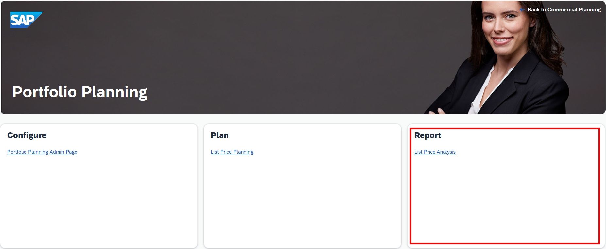

    - The section **Report** contains a link to the reporting story **List Price Analysis** (`SAP_MKT_PortfolioPlanning_ListPriceAnalysis`).
    - The reporting story is divided into different sections, which provide deeper insights into various price related topics.
    - In addition to monitoring and analyzing the effects of planned prices, this story also contains a data quality section where missing prices in the dataset can be easily identified. 

### Navigation Concept within the Content
As a last preparation step, it is required to understand the navigation concept of the content package in order for you to use it properly. In this step, you will learn about the meaning and the functionality of all the buttons as well as other UI elements.

1. **Main Navigation** button

    - Each story apart from the Overview Pages (`SAP_MKT_MarketingPlanning_Overview`, `SAP_MKT_PortfolioPlanning_Overview` and `SAP_MKT_CommercialPlanning_Overview`) has a **Main Navigation** button located on the top-left corner.

    <!-- border; size:540px -->

    - By clicking on the **Main Navigation** button, a panel on the left-hand side of the story is opened.
  
    <!-- border; size:540px -->
  
    - Here you can quickly navigate to other stories of the Commercial Planning Content Package.

2. **Expand / Collapse Section** button

    - These buttons can be found in all stories apart from the Overview Pages and are located at the top-right corner of each available section.
    - The **Expand Section** button (with the arrows pointing to the outside) enlarges a specific section and hides the header and the remaining sections, which is quite useful in case you require more space for the planning tables or reports.

    <!-- border; size:540px --> 

    - The **Expand Section** button changes to a **Collapse Section** button (with the arrows pointing to the center) after entering full screen mode. By pressing the **Collapse Section** button, you can unhide the header section as well as the remaining sections again and return to the default view mode.

    <!-- border; size:540px -->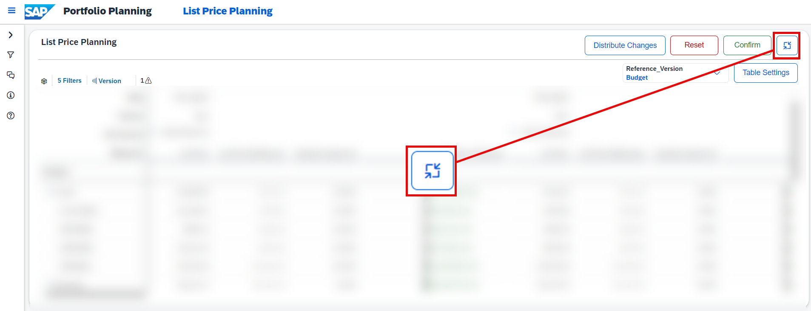 

3. **Confirm** button

    - The **Confirm** button can be found in each planning story of this content package and is located at the top-right corner above the tables.
    - The **Confirm** button lets you publish your current plan data into the public plan version.

    <!-- border; size:540px -->

    - Prior to publishing the version you will receive the following pop-up:

    <!-- border; size:200px -->

    - If there is nothing to confirm, an application warning will appear instead of the pop-up telling you that there is nothing to publish.

4. **Reset** button

    - The **Reset** button can be found in each planning story of this content package and is located at the top-right corner above the tables.
  
    <!-- border; size:540px -->

    - Prior to reverting the plan version you will receive the following pop-up:

    <!-- border; size:200px -->

    - If there is nothing to reset, an application warning will appear instead of the pop-up telling you that there is nothing to revert.

5. **Table Settings** button

    - Some of the planning stories contain a **Table Settings** button which can be found on the top-right corner above the table. 
  
    <!-- border; size:540px -->

    - By pressing on this button, a pop-up is opened where you can select different measures to be displayed in your table. 
    - Depending on the story the offered selection of measures might differ.

    <!-- border; size:200px -->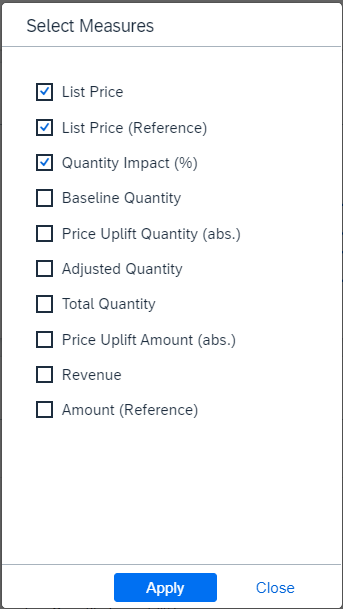

6. **Steps** description field

    <!-- border; size:540px -->

    - Such a text field can be found in each planning story of this content package and is located at the top-left corner.
    - This description field serves as a rough guideline and describes the intended user workflow within each of the planning stories.

7. **Filter** panel

    - This panel can be found in each story apart from the overview pages of this content package and is located on the left-hand side of the screen.
  
    <!-- border; size:540px -->

    - By using the drop down widgets, you can filter all tables and charts down to specific members of the given dimensions for an eased data entry and reporting.
    - By clicking on the little **arrow icon**, you can collapse the side panel in order to create more space for your planning tables or charts. 
  
    <!-- border; size:540px -->

    - You can then reopen the side panel by clicking on the **reversed arrow icon**.
  
    <!-- border; size:540px -->

    >INFORMATION:
    >
    - Be aware that some widgets are disconnected from the input controls and thus do not take into consideration the settings from the filter panel. 
    - This is because some charts are specifically designed to only show data for one specific version or member of a dimension. 

8.  **Distribute Changes** button

    <!-- border; size:540px -->

    - This button can only be found in the **List Price Planning** (`SAP_MKT_PortfolioPlanning_ListPricePlanning`) story.
    - By pressing on this button a pop-up is opened where you can define different parameters for a carry forward operation. This topic will be covered in a later step of this tutorial in more detail.

9.   **Reference Version** drop-down

    <!-- border; size:540px -->

    - This drop-down widget can be found in some of the stories of this content package.
    - By using this drop-down widget, you can define the reference version against which you would like to compare your plan data.

10.  **Hide / Unhide Section** button
    
    <!-- border; size:540px -->

    - In case a story contains multiple sections, you can choose to hide specific parts of the story by using the **Hide Section** button or respectively unhide the section by using the **Show Section** button. 
    - Both of these buttons can be found on the top-left corner of each section.

### Portfolio Planning Admin Page
Now that you are familiar with the basics and the navigation concept, you will learn in more detail how to use the different stories.

This step focuses on the story **Portfolio Planning Admin Page** (`SAP_MKT_PortfolioPlanning_AdminPage`).

You will learn how to open the story (Tab 1), how to integrate all relevant data from different data sources into the data model (Tab 2), how to initialize the plan version (Tab 3) and lastly what other actions you can trigger from the admin page (Tab 4).

[OPTION BEGIN [Open Story]]
Currently, you have opened the tab **Open Story**. This tab provides guidance on how to open the **Portfolio Planning Admin Page** (`SAP_MKT_PortfolioPlanning_AdminPage`) story.

1. In the **Portfolio Planning Overview Page** (`SAP_MKT_PortfolioPlanning_Overview`) story, click on the **Portfolio Planning Admin Page** link.

    <!-- border; size:540px -->

    >INFORMATION:
    >
    - The **Portfolio Planning Admin Page** (`SAP_MKT_PortfolioPlanning_AdminPage`) story serves as a central place for any administrative task related to the portfolio planning process. 
    - It offers a collection of Data Actions and Multi Actions which are used throughout the entire process.
    - From this screen you can integrate data from different data sources into your data model, initialize your plan version and perform other individual actions which are usually executed automatically from within the planning stories, such as recalculating revenues or costs. 

2. Get an overview of the story

    <!-- border; size:540px -->

    - Make yourself familiar with the story.
    - Try to identity the different administrative sections and use cases. Do not execute anything yet, we will go through this step by step. 

3. Check the **INSTRUCTIONS** section

    <!-- border; size:540px -->

    - All stories provide a short in-built step by step guide which helps you to use the corresponding story correctly.
    - Before using the story, make sure to check the **INSTRUCTIONS** description field to understand the intended user workflow.

You may now switch to the second tab **Load Data**.

[OPTION END]

[OPTION BEGIN [Load Data]]
Currently, you have opened the tab **Load Data**. This tab provides guidance on how to integrate all relevant data from different data sources, such as baseline quantities, cost rates and list prices. All relevant actions related to this step can be found in the **Load Data** section of the **Portfolio Planning Admin Page**.

 <!-- border; size:540px -->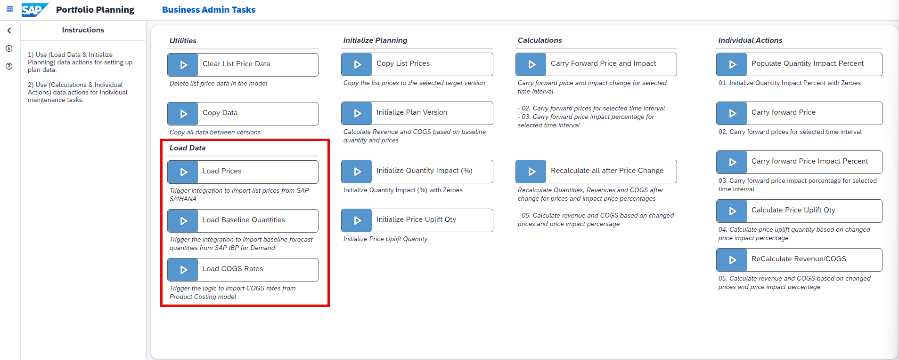

>INFORMATION:
>
- This content package is dependant on three different data sources.
- For the list prices, **SAP S/4HANA** as an external source system is used as a data source.
- For the baseline quantities, **SAP Integrated Business Planning** as an external source system is used as a data source.
- For the COGS rates, the product cost data model `SAP_FI_IFP_IM_ProductCost` from the [Integrated Financial Planning for SAP S/4HANA (xP&A - Integrated Financial Planning for SAP S/4HANA and S/4HANA Cloud)](https://help.sap.com/docs/SAP_S4HANA_ON-PREMISE/48f4b4785b8e45938ac44a67be8032d9/7ce894bc95f449779fa19d076e67c925.html?q=SAP_FI_IFP_Financial_Planning%20) business content in SAP Analytics Cloud is used as a data source.  

1. Click on the **Load Prices** trigger to integrate price data into the data model.

    <!-- border; size:540px -->

    - As suggested in the **INSTRUCTIONS** description field, start the planning process with the data loading in case it has not been done elsewhere yet. 
    - By clicking on the trigger, a Multi Action is executed which loads price data from **SAP S/4HANA** into the data model of this content package. 

    >INFORMATION:
    >
    - In order for this step to work, you must set up the Multi Action and integration job first. 
    - If you wish to learn how to set up the integration process for price data, check the tutorials [xP&A Commercial Planning - How to set up system connections](xpa-sac-cx-data-integration-setup) and [xP&A Commercial Planning - Manage data loads](xpa-sac-cx-manage-data-loads).
    - Please note that you may skip this step in case you want to go with the provided demo data first. This step will only become necessary once you decide to use your own systems as data source. 

2. Click on the **Load Baseline Quantities** trigger to integrate baseline quantities into the data model

    <!-- border; size:540px -->

    - By clicking on the trigger, a Multi Action is executed which loads baseline quantities from **SAP IBP** into the data model of this content package. 

    >INFORMATION:
    >
    - In order for this step to work, you must set up the Multi Action and integration job first. 
    - If you wish to learn how to set up the integration process for baseline quantities, check the tutorials [xP&A Commercial Planning - How to set up system connections](xpa-sac-cx-data-integration-setup) and [xP&A Commercial Planning - Manage data loads](xpa-sac-cx-manage-data-loads).
    - Please note that you may skip this step in case you want to go with the provided demo data first. This step will only become necessary once you decide to use your own systems as data source. 

3. Click on the **Load COGS Rates** trigger to integrate cost rates into the data model

    <!-- border; size:350px -->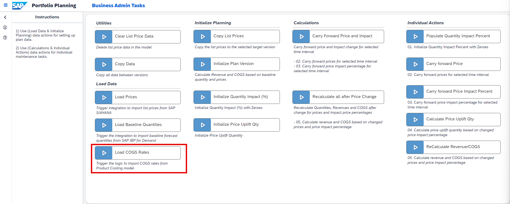

    - By clicking on the trigger, a Data Action is executed which loads COGS rates from the product cost data model outside the content package (`SAP_FI_IFP_IM_ProductCost`) into the data model of this content package. 

    >INFORMATION:
    >
    - In order for this step to work, you must have access to the product costing model (`SAP_FI_IFP_IM_ProductCost`). 
    - Check out the official documentation for the business content package [Integrated Financial Planning for SAP S/4HANA (xP&A - Integrated Financial Planning for SAP S/4HANA and S/4HANA Cloud)](https://help.sap.com/docs/SAP_S4HANA_ON-PREMISE/48f4b4785b8e45938ac44a67be8032d9/7ce894bc95f449779fa19d076e67c925.html?q=SAP_FI_IFP_Financial_Planning%20).
    - Please note that you may skip this step in case you want to go with the provided demo data first. This step will only become necessary once you decide to use your own systems as data source. 
  
Now that you have loaded in all data successfully, you can proceed with the initialization of your plan version as a last preparation step. You can now switch to the tab **Initialize Plan Version**.

[OPTION END]

[OPTION BEGIN [Initialize Plan Version]]
Currently you have opened the tab **Initialize Plan Version**. This tab provides guidance on how to prepare your plan version so you can finally start with your planning activities. All relevant actions related to this step can be found in the **Initialize Planning** section of the **Portfolio Planning Admin Page**.

 <!-- border; size:540px -->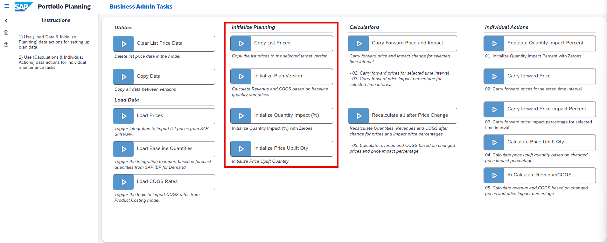

1. Click on the **Initialize Plan Version** trigger to calculate all relevant measures based on your integrated data.

    <!-- border; size:540px -->

    - In the previous step you learned how to load in baseline quantities, COGS rates and list prices.
    - By clicking on the trigger, a Data Action is executed which now calculates the total revenue and costs based on the imported figures for each product.
    - In the data action dialogue, please select the respective version on which you want to perform this action. In this example, you would have to execute the data action on the target version `public.Plan`.
    
    >INFORMATION:
    >
    - This is required because neither total revenues nor total costs are imported from an external system. 
    - Thus these figures are calculated inside SAP Analytics Cloud now by using this Data Action.
    - The Data Action takes the imported quantities and multiplies the quantities by the prices and COGS rates. The results are then persisted on the amount (`AMOUNT`) measure, which stores the total revenue and COGS in their respective accounts of the Account Dimension.
  
2. Click on the **Initialize Quantity Impact (%)** trigger to populate the Quantity Impact (%) measure with booked values.

    <!-- border; size:540px -->

    - By clicking on the trigger, a Data Action is executed which populates the Quantity Impact (%) measure (`QUANTITY_IMPACT`) for each member of the `Driver` dimension (excluding `baseLine` and `#`) with zeroes for all data records, where a baseline quantity can be found.
    - In the data action dialogue, please select the respective version on which you want to perform this action. In this example, you would have to execute the data action on the target version `public.Plan`.
    - For the member **Price Impact** (`priceImpact`) of the `Driver` dimension, the zero value is only created for all records where a list price can be found. 
    
    >INFORMATION:
    >
    - The reason why this measure must be populated with booked values is because the planning tables inside the planning stories are configured to not show unbooked records. 
    - As the Quantity Impact (%) measure must be planned by you, it must contain some sort of booked value as a result as otherwise it would not be visible in the table due to the display settings. 
    - In order to bypass this setting and still show the Quantity Impact (%) measure despite not having any data originally, the Data Action is used to generate a zero value for all data records where a baseline quantity can be found as those are the records that must me planned. 
    - This Data Action does not overwrite already planned values. If you have already entered some values for the Quantity Impact (%) measure, your progress will not be overwritten.

3. Click on the **Initialize Price Uplift Qty** trigger to populate the Uplift Quantity measure with booked values.
    
    <!-- border; size:540px -->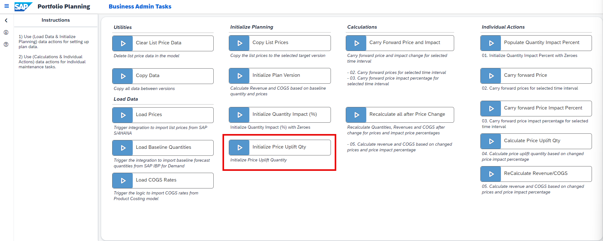

    - By clicking on the trigger, a Data Action is executed which populates the Quantity measure (`QUANTITY`) with zeroes for all data records where a baseline quantity can be found. 
    - In the data action dialogue, please select the respective version on which you want to perform this action. In this example, you would have to execute the data action on the target version `public.Plan`.
    - As only Uplift Quantities are targeted by this Data Action, the Driver members **Unassigned** (`#`) and **Baseline** (`baseLine`) are excluded from the calculation scope of the Data Action.
    - To learn more about the Driver dimension, please check the tutorial [xP&A Commercial Planning - Introduction to the Data Model](xpa-sac-cxmp-datamodelfundamentals).

    >INFORMATION:
    >
    - Different from the **Quantity Impact (%)** measure, the absolute uplift quantity cannot be planned manually.
    - Nevertheless it is still required to execute this Data Action as other planning stories which share the same data model as well as the **List Price Planning** (`SAP_MKT_PortfolioPlanning_ListPricePlanning`) story of this content sub-package do display this measure in some widgets. 

Now that you have integrated all data and initialized your plan version successfully, you can either proceed with the next step of this tutorial or switch to the tab **Other Actions** in case you would like to learn what the remaining Data Actions and Multi Actions are used for.

[OPTION END]

[OPTION BEGIN [Other Actions]]
Currently you have opened the tab **Other Actions**. This tab provides a rough overview of all the remaining Data Actions and Multi Actions which can be found on the admin screen. Please note that none of these actions are mandatory. 

1. **Clear List Price Data**

    <!-- border; size:540px -->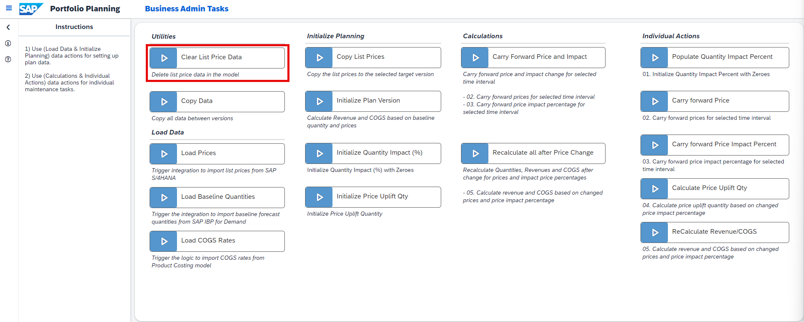

    - This Data Action deletes all list prices from a target version.
    - This can be quite useful in case you want to reset your planned changes and re-upload the original list prices.
  
2. **Copy Data**

    <!-- border; size:540px -->

    - This Data Action deletes all data from the target version for a specified date range and copies data from another version to the exact same date range.
    - This Data Action can be used if you work on more than two versions for example or if you want to redeploy data from a backup version of yours. 

3. **Copy List Prices**
    
    <!-- border; size:540px -->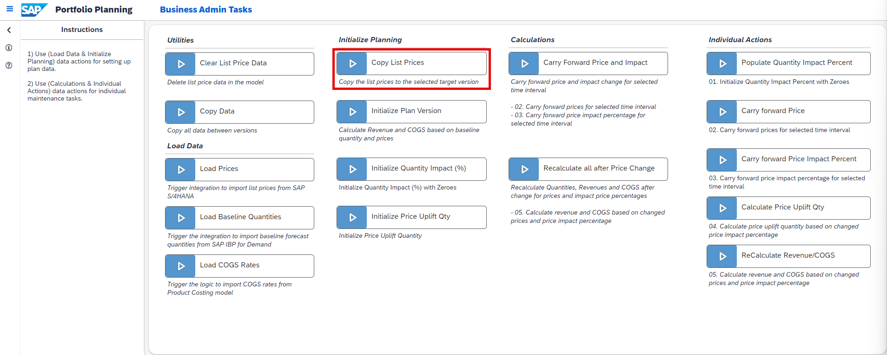

    - This Data Action copies over list prices to the target version from another version for a specified time range.

4. **Carry Forward Price and Impact**

    <!-- border; size:540px -->

    - This Multi Action carries forward the List Price and the Quantity Impact (%) for a specific product or for the members of a product group from a specified starting period until a specified end period.
    - This Multi Action is normally executed automatically during the usage of the **List Price Planning** (`SAP_MKT_PortfolioPlanning_ListPricePlanning`) story.  

5. **Recalculate all after Price Change**
   
    <!-- border; size:540px -->

    - This Multi Action calculates the impact of the adjusted price on the demand quantity by taking the planned Quantity Impact (%) of the `priceImpact` Driver and multiplying it by the baseline quantity. The resulting incremental quantity is then stored on the respective driver. 
    - In addition to that it also recalculates revenues and costs for all drivers by multiplying the Quantity by the List Price and COGS rates. The result is then stored on the respective members of the Driver dimension.
    - This Multi Action is normally executed automatically during the usage of the planning stories and should not be triggered manually.  

6. **Populate Quantity Impact Percent**
   
    <!-- border; size:540px -->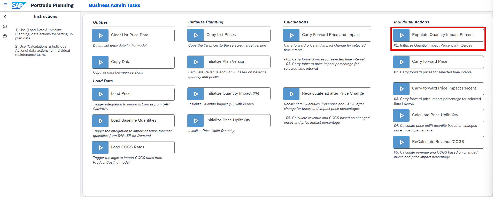

    - This Data Action creates a booked value (zero) for the Quantity Impact (%) measure related to the `priceImpact` driver member for all records where a List Price can be found.
    - This Data Action is normally executed automatically during the usage of the planning stories and should not be executed manually.  

7. **Carry forward Price**
   
    <!-- border; size:540px -->

    - This Data Action carries forward the List Price for a specific product or for the members of a product group from a specified starting period until a specified end period.
    - This Data Action is normally executed automatically during the usage of the **List Price Planning** (`SAP_MKT_PortfolioPlanning_ListPricePlanning`) story.  

8. **Carry forward Price Impact Percent**
   
    <!-- border; size:540px -->

    - This Data Action carries forward the Quantity Impact (%) for a specific product or for the members of a product group from a specified starting period until a specified end period. 
    - This Data Action is normally executed automatically during the usage of the **List Price Planning** (`SAP_MKT_PortfolioPlanning_ListPricePlanning`) story.  

9.  **Calculate Price Uplift Qty**
    
    <!-- border; size:540px -->

    - This Data Action calculates the incremental quantity for the `priceImpact` driver by multiplying the baseline quantity by the Quantity Impact (%) value of the respective driver. 
    - This Data Action is normally executed automatically during the usage of the **List Price Planning** (`SAP_MKT_PortfolioPlanning_ListPricePlanning`) story.  

10. **ReCalculate Revenue/COGS**
    
    <!-- border; size:540px -->

    - This Data Action recalculates revenues and costs for all drivers by multiplying the quantities by the list prices and COGS rates. The result is then stored on a the respective members of the driver dimension.
    - This Data Action is normally executed automatically during the usage of the planning stories.  

[OPTION END]

### List Price Planning
As you have now integrated all relevant data and initialized your plan version, you can continue with the actual planning activities.

In this step, the **List Price Planning** (`SAP_MKT_PortfolioPlanning_ListPricePlanning`) story of this content package is introduced.

You will learn how to open the story (Tab 1), how to plan list prices and how to plan the effect resulting from the price changes on the demand or respectively the quantity (Tab 2).

[OPTION BEGIN [Open Story]]
Currently, you have opened the tab **Open Story**. This tab provides guidance on how to open the **List Price Planning** (`SAP_MKT_PortfolioPlanning_ListPricePlanning`) story.

1. Click on the burger menu located on the top left corner of the **Portfolio Planning Admin Page** (`SAP_MKT_PortfolioPlanning_AdminPage`).
   
2. Now click on either **Portfolio Planning** to jump back to the **Portfolio Planning Overview Page** or on **List Price Planning** to directly access the **List Price Planning** story. 

    <!-- border; size:540px -->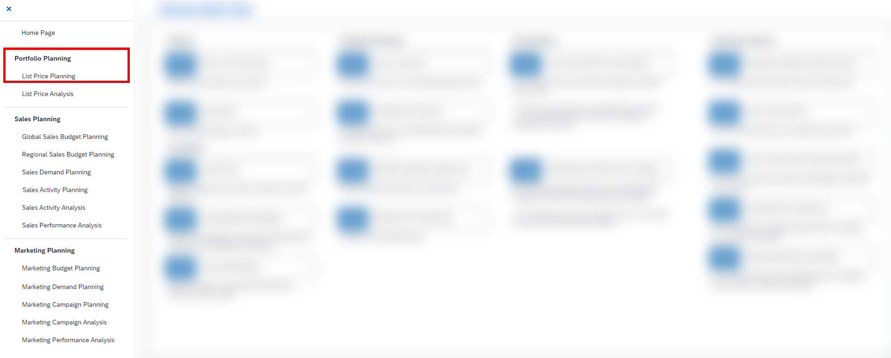
    
    In this particular case, we will go back to the **Portfolio Planning Overview Page** by clicking on the **Portfolio Planning** button.

    >INFORMATION:
    >
    - When leaving the story, you might receive a pop-up asking you if you want to publish the changes before leaving or not.
    - This message usually appears when changes to the data have been made.
    - Here you can either decide to publish your data and then leave the story or to not publish your data at this point of time, for instance because you would like to inspect the results first before making any changes public. 
    - The decision is completely up to you - in this particular case, we will not publish anything yet as this will be done in a later step. 

3. Click on the link **List Price Planning** to enter the story.

    <!-- border; size:540px -->

4. Get an overview of the application

    <!-- border; size:540px -->

    - The story consists of three sections. 
    - The header section provides three charts showing the Average List Price, the Adjusted Quantity and the Gross Revenue. 
    - The context for all charts is defined by the filters set in the input controls on the left-hand side of the story. 
    - The Average List Price represents the non-weighted average across all products and periods. The blue bar serves as an indicator for the average list price that comes from the source system (which is stored on the version `pricesFromSource`). 
    - The Adjusted Quantity represents the baseline quantity plus the incremental quantity that is estimated to come by adjusting the list prices. The triangle serves as an indicator for the baseline quantity. 
    - The Gross Revenue represents the total gross revenue across all drivers available. The green or respectively red bar (depending on whether the number is positive or negative) serves as an indicator for the deviation from the `Budget` version.

    - The second important section is the filter section, which can be found on the left-hand side of the application. 
    - The filter panel provides input controls in which you can define your planning context for this story.

    - The last important section is the planning section in the center of the story. 
    - The planning table is the place where you can enter your planning assumptions.
    - Both the List Price and the Quantity Impact (%) can be planned here. The remaining measures are read-only and cannot be modified. 
  
You may now switch to the second tab **Enter Plan Data** to learn how to enter your planning assumptions.

[OPTION END]

[OPTION BEGIN [Enter Plan Data]]
Currently, you have opened the tab **Enter Plan Data**. This tab provides guidance on how to plan list prices and the estimated impact on quantities that comes with the price change.

1. Adjust your filters in the filter panel.
   
    - According to the **Steps** description field, start your activities by adjusting your filters in the filter panel if required. 
    
    >INFORMATION:
    >
    For the following demonstration filters will not be changed. 

    <!-- border; size:540px -->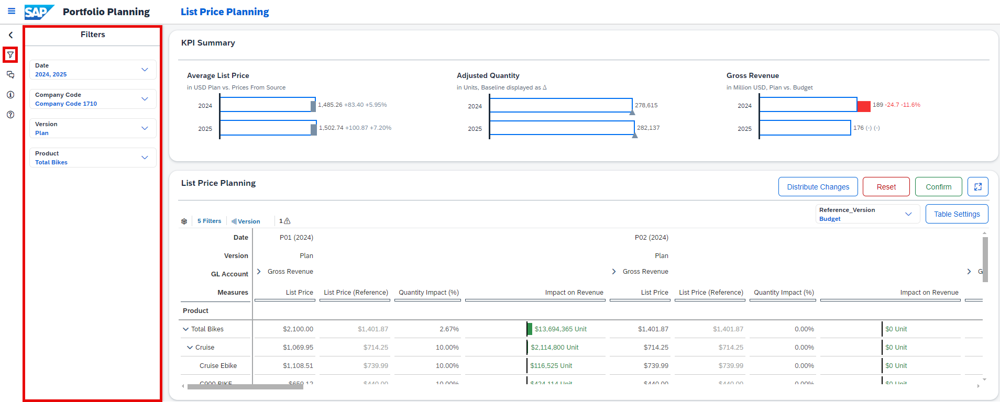

    >INFORMATION:
    >
    - All filters apart from the date filter are configured to only show a specific set of members for each of the dimensions.
    - If you want to change your default settings for the filters, please go into edit mode of the story and change the selection of the input controls. 
    - The date filter on the other hand uses a tiny script and always sets the current year and the next year as default. As this tutorial was published in 2023, the date filter in the screenshots is set to the year 2023 and 2024. 
    - Check out the tutorial [xP&A Commercial Planning - Customize Default Settings](xpa-sac-cx-customize-default-settings) to learn in detail how to customize your default settings.

2. Adjust the list price in the planning table.

    - Adjust the list price for any product or product group inside the planning table. Make sure to only adjust the list price for one single period for now.
    - In this example the price for the product `Cruise Ebike` in period `P01 (2023)` was changed to a value of `USD 1200`.

    <!-- border; size:540px -->

3. Recalculate revenues based on new list price.

    - Click on the cell in which you edited the list price.

    <!-- border; size:540px -->

    - Now click on the button **Distribute Changes** located on the top-right corner above the planning table.

    <!-- border; size:540px -->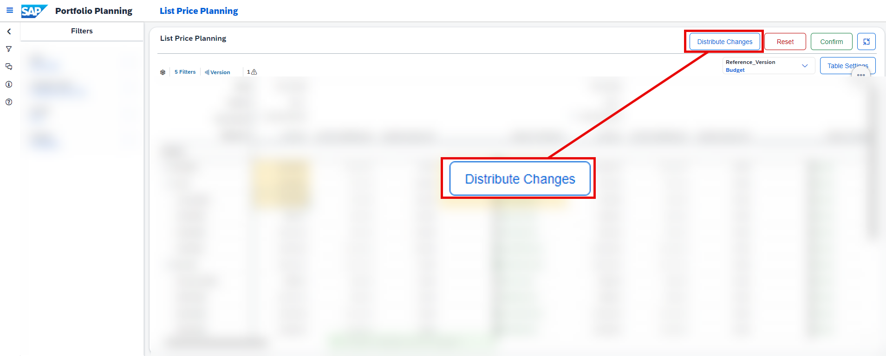

    - A pop-up window appears with all mandatory information already pre-populated. 
    - Check the settings for correctness and change the **End Date** to the same period as **Start Date** `P01 (2023)`.

    <!-- border; size:540px -->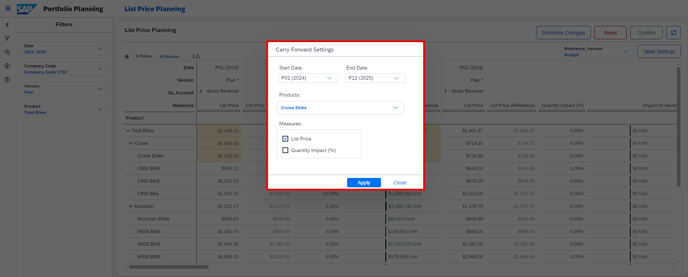
    
    >INFORMATION:
    >
    - The pre-population of the fields inside this pop-up always occurs automatically as soon as you click on a specific cell. 
    - In this example, we do not want to perform a carry forward operation but only trigger a recalculation of revenues for the selected Period `P01 (2023)`. 
    - This is why you need to set the end date to the same period as the start date.  

    - Click on **Apply** to start the recalculation.
    
    >INFORMATION:
    >
    - An algorithm is now triggered which first performs a carry forward operation of the list price, starting from the specified start date until the specified end date.
    - As the end date equals the start date, technically no carry forward is performed. 
    - Afterwards a recalculation of all revenues is executed by taking the new list price and multiplying it by the baseline quantities.
    - This recalculation was only triggered here as a demonstration exercise. In practice, you could wait until you have also adjusted the Quantity Impact (%) in the next step and then triggered the recalculation and carry-forward all at once in one operation.

4. Adjust the Quantity Impact (%) in the planning table. 

    - Adjust the Quantity Impact (%) for any product or product group inside the planning table. 
    - For demonstration purposes, the Quantity Impact (%) will be changed for the same product and period as before.

    <!-- border; size:540px -->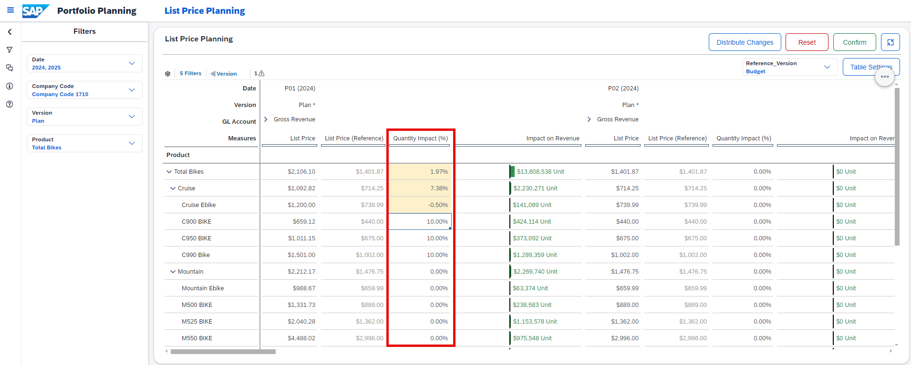

    >INFORMATION:
    >
    - As the price for the product `Cruise Ebike` has increased to a total value of `USD 1200` in the shown example, you may assume that the demand goes back a little. 
    - This assumption must be entered as a percentage value.
    - An entry of `-0.5 %` means that you expect the demand to shrink by `0.5 %` in conclusion, while these `-0.5 %` are applied on the baseline quantity. 

5. Carry forward your assumptions and recalculate both revenue and costs.   

    - Click on the cell in which you edited the Quantity Impact (%).

    <!-- border; size:540px -->

    - Now click on the button **Distribute Changes** located on the top-right corner above the planning table.

    <!-- border; size:540px -->

    - A pop-up window appears with all mandatory information already pre-populated. 
    - Check the settings for correctness. As we want to perform a carry forward operation as well this time, change the **End Date** to a later period than the **Start Date**.
    - In addition to that, also put a check on **List Price** in the measure section of the pop-up so you carry forward the list price together with the Quantity Impact (%). 

    <!-- border; size:540px -->

    - Alternatively, you can also just select both the Quantity Impact (%) and the List Price in the planning table with your mouse and pre-populate this setting instead of setting the check manually.

    <!-- border; size:540px -->

    - Click on **Apply** to start the carry forward and recalculation.
    
    >INFORMATION:
    >
    - An algorithm is now triggered which first performs a carry forward operation of the selected measures, starting from the specified start date until the specified end date.
    - Afterwards a recalculation of all revenues is executed by taking the new list price and multiplying it by the baseline quantities.
    - In addition to that, the incremental quantity is calculated by taking the Quantity Impact (%) value and multiplying it by the baseline quantity. The result is then stored on the member `priceImpact` of the Driver dimension. 
    - The incremental quantity is then multiplied by the planned price and COGS rates to estimate incremental revenues and costs, which are stored on the respective driver as well. 

6. Publish or revert your version

    - Click on the **Confirm** or **Reset** button in order to publish or revert your plan data.
    
    >INFORMATION:
    >
    - By publishing the version, all users with sufficient rights will be able to see your edits in the version you were working on.
    - As soon as you start editing a public version, a private version is created in the background, which only you can see. All edits you do are done on this private version. Thus your work-in-progress is only visible to you.
    - It is possible to leave the story and resume your work on another day without losing your progress.
    - Only after publishing the version your changes will be written to the public version and will be visible to all other users.
    - Learn more about the concept of planning on public versions in our [SAP Help Portal](https://help.sap.com/docs/SAP_ANALYTICS_CLOUD/00f68c2e08b941f081002fd3691d86a7/b6e3d093988e4c3eba7eb6c1c110e954.html?q=version)

[OPTION END]

### List Price Analysis
In this step the **List Price Analysis** story of this content package is introduced. 

Here you will learn how to open the story (Tab 1) and how to consume the different reports to get an overview about your pricing, your financial metrics and other insights (Tab 2).

[OPTION BEGIN [Open Story]]
Currently, you have opened the tab **Open Story**. This tab provides guidance on how to open the **List Price Analysis** (`SAP_MKT_PortfolioPlanning_ListPriceAnalysis`) story.

1. Click on the burger menu located on the top-left corner of the **List Price Planning** (`SAP_MKT_PortfolioPlanning_ListPricePlanning`) story from the previous step.

2. Now click on either **Portfolio Planning** to jump back to the **Portfolio Planning Overview Page** or on **List Price Analysis** to directly access the **List Price Analysis** story. 

    <!-- border; size:540px -->
    
    In this particular case, we will go back to the **Portfolio Planning Overview Page** by clicking on the **Portfolio Planning** button.

3. Click on the link **List Price Analysis** to enter the story.

    <!-- border; size:540px -->

4. Get an overview of the application

    <!-- border; size:540px -->

    - This story supports the list price planning process and provides detailed insights into price related topics. 
    - It provides visualizations which for instance show average prices over time, their effect on revenues and quantities, and compares actuals, plans, and budgets for key metrics. 
    - In addition to that, all charts can be consumed in local or global currency. The view can be switched by using the currency drop down widget located in the panel on the left-hand side of the story. 
    - Lastly this report also provides a data quality report to easily identify missing list prices for products which have a planned quantity. 

[OPTION END]

[OPTION BEGIN [Reporting]]
Currently, you have opened the tab **Reporting**. This tab provides information about the navigation concept of the story and the reported data.

1. **Header** section

    - In the header section you can find four graphs that provide you with high level insights.
    
    <!-- border; size:540px -->

    - You can change the context of all graphs by using the filters on the left-hand side of the story. 

    <!-- border; size:540px -->

    >INFORMATION:
    >
    - Please note that currency related graphs may show misleading numbers when multiple company codes are selected and the currency mode is set to **Local Currency**. 
    - In order to avoid this behaviour, please select only one company code when in **Local Currency** mode. 

    - The **Average List Price** graph shows the non-weighted average price across all products per date and per version under consideration of the selections made in the filter section. All versions apart from the Budget version are shown as bars. The Budget version is displayed as a triangle here. 
    - The **Quantity** graph shows the aggregated quantity across all products and drivers per date and per version under consideration of the selections made in the filter section. All versions apart from the Budget version are shown as bars. The Budget version is displayed as a triangle here. 
    - The **Gross Revenue** graph shows the aggregated gross revenue across all products and drivers per date and per version under consideration of the selections made in the filter section. All versions apart from the Budget version are shown as bars. The Budget version is displayed as a triangle here. 
    - The **Gross Margin** graph shows the aggregated gross margin in absolute values across all products and drivers per date and per version under consideration of the selections made in the filter section. All versions apart from the Budget version are shown as bars. The Budget version is displayed as a triangle here. 

2. **Trend Analysis** section

    - This section provides deeper insights into key metrics and allows you to analyze different trends. 
    - Apart from the **Price Deviations** graph, this can be seen as an extension to the header charts. 
    
    <!-- border; size:540px -->

    - You can change the context of all graphs by using the filters on the left-hand side of the story. 

    <!-- border; size:540px -->

    >INFORMATION:
    >
    - Please note that currency related graphs may show misleading numbers when multiple Company Codes are selected and the currency mode is set to **Local Currency**. 
    - In order to avoid this behaviour, please select only one company code when in **Local Currency** mode. 

    - The **Price Deviations** graph shows the top five and bottom five periods with the highest price deviation under consideration of the selections made in the filter section. Only the version filter is ignored as the graph is preset to only show the deviation between the version `Plan` and `pricesFromSource`.
    - The **Average List Price** graph shows the non-weighted average price across all products per period and per version under consideration of the selections made in the filter section. 
    - The **Gross Revenue** graph shows the aggregated gross revenue across all products and drivers per period and per version under consideration of the selections made in the filter section. 
    - The **Quantity** graph shows the aggregated quantity across all products and drivers per period and per version under consideration of the selections made in the filter section. 

3. **Average List Price Analysis** section

    - This section provides deeper insights into price related topics based on the `Plan` version. 
   
    <!-- border; size:540px -->

    - You can change the context of all graphs by using the filters on the left-hand side of the story. 

    <!-- border; size:540px -->

    >INFORMATION:
    >
    - Please note that currency related graphs may show misleading numbers when multiple Company Codes are selected and the currency mode is set to **Local Currency**. 
    - In order to avoid this behaviour, please select only one company code when in **Local Currency** mode. 

    - The **Average List Price** graph on the left-hand side of this section shows the non-weighted average price across all products per year under consideration of the selections made in the filter section as a numeric point indicator for the `Plan` version. All deviations and figures shown below the numeric point refer to the original price maintained in the version `pricesFromSource`.
    - The **Average List Price by Product** graph shows the non-weighted average list price by year and product group under consideration of the selections made in the filter section for the `Plan` version. 
    - The **Average List Price by Company Code** graph shows the non-weighted average list price by year and company code under consideration of the selections made in the filter section for the `Plan` version. 

4. **Data Quality** section

    - This section allows you to perform data quality checks and identify missing list prices for products which have a planned quantity. 
    - The table takes into consideration all filters set in the filter panel on the left-hand side of the story.

    <!-- border; size:540px -->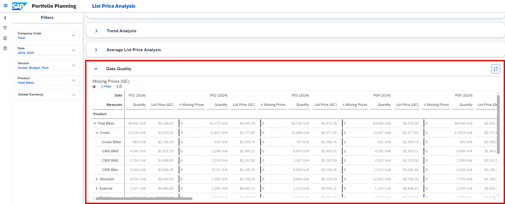

    >INFORMATION:
    >
    - Please note that currency related graphs may show misleading numbers when multiple Company Codes are selected and the currency mode is set to **Local Currency**. 
    - In order to avoid this behaviour, please select only one company code when in **Local Currency** mode. 

    - The table shows the total quantity and the list price per product and period.
    - The column **# Missing Prices** shows whether a list price for a certain product is missing or not. 
    - A green value of **0** indicates that there are no missing prices. Thus no action must be taken. 
    - If a list price is missing, a red-colored number will be displayed. In this case the list price can not be added from inside this story though as this is a pure reporting story with planning disabled.
    - If you want to add a price you can do so by either uploading it manually or by using the **List Price Planning** story. 

[OPTION END]

### Final Remarks
Congratulations! You have finished the introduction tutorial and are now able to use the **Portfolio Planning** content like an expert.

If you want to learn more about the other modules of this content package, check out the following tutorials:

- [xP&A Commercial Planning - Get to know the Sales Planning module](xpa-sac-cxsp-salesplanning-gettoknow)
- [xP&A Commercial Planning - Get to know the Marketing Planning module](xpa-sac-cxmp-marketingplanning-gettoknow)

If you want to customize the content and adjust it according to your own business requirements, the following resources might be helpful:

- [xP&A Commercial Planning - Introduction to the Data Model](xpa-sac-cxmp-datamodelfundamentals)
- [xP&A Commercial Planning - Understanding the technical structure of Stories](xpa-sac-cx-technical-structure-of-stories)
- [xP&A Commercial Planning - Data Integration](xpa-sac-cx-data-integration-setup)
- [xP&A Commercial Planning - Manage data loads](xpa-sac-cx-manage-data-loads)
- [xP&A Commercial Planning - Add additional sections to a story](xpa-sac-cx-add-new-sections-to-app)
- [xP&A Commercial Planning - Add an additional story to the Navigation Menu](xpa-sac-cx-add-new-story-to-navmenu)
- [xP&A Commercial Planning - Customize Default Settings](xpa-sac-cx-customize-default-settings)
- [xP&A Commercial Planning - Customize Table Settings Dialogue](xpa-sac-cx-customize-table-settings-dialogue)
- [xP&A Commercial Planning (Marketing) - Add a new Driver](xpa-sac-cxmp-add-new-driver)
- [xP&A Commercial Planning (Marketing) - Add a new Version](xpa-sac-cxmp-add-new-version)
- [xP&A Commercial Planning (Marketing) - Extend campaign and activity attributes](xpa-sac-cxmp-add-new-attributes)
- [xP&A Commercial Planning (Marketing) - Extend activity spend dates](xpa-sac-cxmp-extend-activity-dates)
- [xP&A Commercial Planning (Sales) - Add a new Version](xpa-sac-cxsp-add-new-version)
- [xP&A Commercial Planning (Sales) - Add a new Tactic](xpa-sac-cxsp-add-new-tactic)
- [xP&A Commercial Planning (Sales) - Add a new Spend Type](xpa-sac-cxsp-add-new-spendtype)

If you want to get an overview of the entire xP&A Commercial Planning content package, make sure to check out the Mission.

Interested in more xP&A topics and related business content packages? Visit our community page [Extended Planning & Analysis Business Content](https://community.sap.com/topics/cloud-analytics/planning/content).
