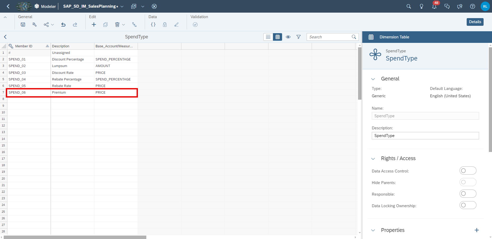
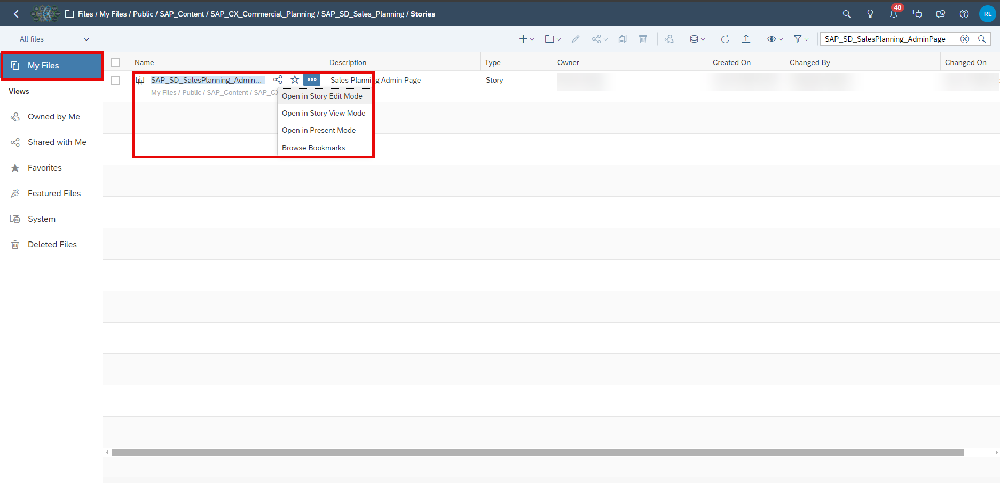
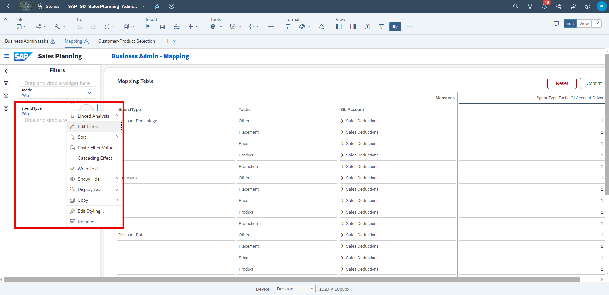
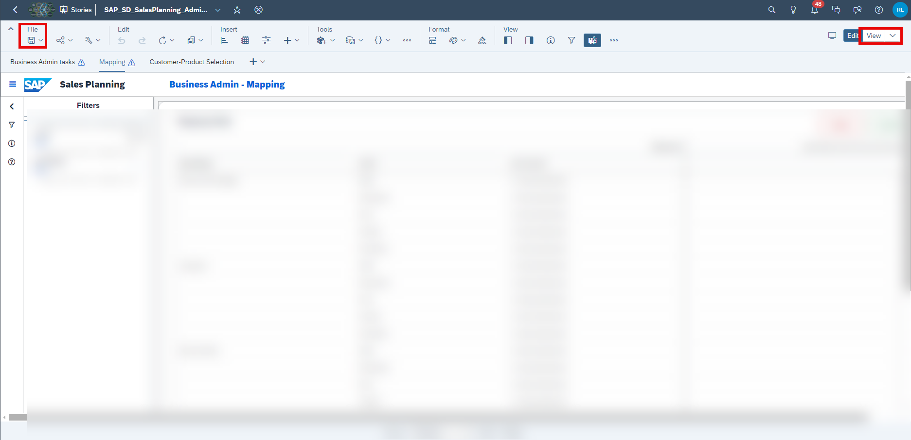
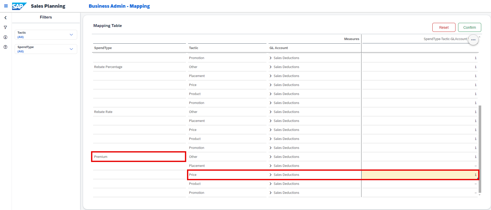
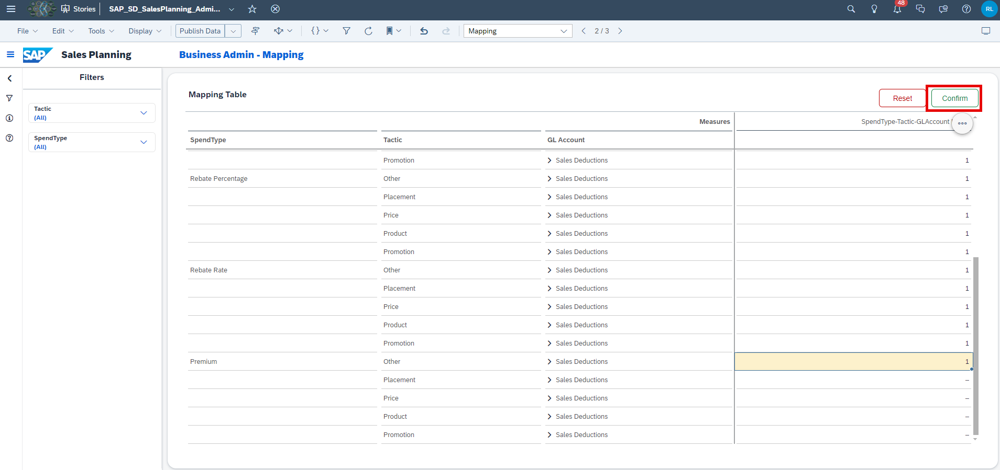

## Prerequisites

- You are familiar with the **SAP Commercial Planning (CX) Sales Planning** content from the xP&A Business Content Suite. Reference: [Getting Started tutorial](xpa-sac-cxsp-salesplanning-gettoknow)
- You have installed the **SAP Commercial Planning (CX) Sales Planning** content in an SAP Analytics Cloud tenant. Reference: [Business Content Installation Guide](https://help.sap.com/docs/SAP_ANALYTICS_CLOUD/00f68c2e08b941f081002fd3691d86a7/078868f57f3346a98c3233207bd211c7.html), [Content Package User Guide](https://help.sap.com/docs/SAP_ANALYTICS_CLOUD/42093f14b43c485fbe3adbbe81eff6c8/b0046d8673b5412cbef7f521cfdfed95.html)  

## You will learn

- Which steps are required in order to add and use a new tactic
- This includes...
  - adding a new spend type in the model
  - adjust the planning applications
  - adjust the data actions

## Intro

The **SAP Commercial Planning (CX) Sales Planning** content package comes with several pre-defined assumptions, such as the mapping between Tactic – Spend Type and GL Account, which can be used for your planning activities. Nevertheless, you might want to add more spend types according to your own business needs. In this case, you would need to adjust the planning applications, data actions as well as the dimension master data.

In this tutorial, you will learn how to add a new spend type member into the dimension and how to make it available in the planning applications of this content package.

### Adjust the Dimension in the Master Data

In the first step, it is necessary to add a new member to the `SpendType` dimension.

1. In the SAP Analytics Cloud Menu, navigate to the **Files** section, search for `SAP_SD_IM_SalesPlanning` and click on it.

    <!-- border; size:540px -->

2. Open the `SpendType` dimension.

    <!-- border; size:540px -->

3. Add a new member to the `SpendType` dimension. The spend type is meant for long-term regular customers.

    <!-- border; size:540px -->

    - Use `SPEND_06` as your `Member ID`
    - Use `Premium` as your `Description`.
    - Use `PRICE` as your `Base_Account/Measure (Sales Planning)`

4. **Save** your change.

### Adjust Planning Application

In the next step the **Sales Planning Admin Page** (`SAP_SD_SalesPlanning_AdminPage`) must be modified, and a new mapping should be provided for the new `SpendType` member created.

1. In the SAP Analytics Cloud Menu, navigate to the **Files** section, search for `SAP_SD_SalesPlanning_AdminPage` and select **Open in Story Edit Mode**.

    <!-- border; size:540px -->

2. Select the **Mapping** page of the story. Right click on the **Spend Type** input control or select the button **More Actions**. Click on **Edit Filter...**.

    <!-- border; size:540px -->

3. Click on **Settings**. In the members display settings, and select **All Members** in the **Available Members** drop down. Then select your newly added Spend Type `Premium`. Click on **OK**.

    <!-- border; size:540px -->

4. **Save** your change and go to **View** mode.

    <!-- border; size:540px -->

5. Select the **Mapping** page of the story. Right-click on the column `SpendType` in the **Mapping Table**. Select the **Show/Hide** option and select **Unbooked**.

    <!-- border; size:540px -->

6. The new `SpendType` `Premium` is now visible in the table. Perform a manual input on the desired combination of `SpendType`, `Tactic` and `GL Account` to create a valid driver combination to be used for the sales activity planning.

    <!-- border; size:540px -->

    For instance, enter `1` for the following combination:

    | Column       | Value                 |
    |--------------|-----------------------|
    | `SpendType`  | Premium               |
    | `Tactic`     | Price                 |
    | `GL Account` | Sales Discount - Domestic |

7. Click on **Confirm** to publish your change.

    <!-- border; size:540px -->

8. Confirm your intention by pressing **Yes**.

    <!-- border; size:540px -->

### Understand Spend Type in Data Action

Now, you are going to learn the different ways how your `SpendType` is treated in the data action.

1. In the SAP Analytics Cloud Menu, navigate to the **Files** section.

2. Search for the affected data action `SAP_SD_IM_SalesPlanning_ActualActivityP&LCalculation` and open it.

    <!-- border; size:540px -->

3. Click on step `Calculate Incremental Spend - Rate`.

    <!-- border; size:540px -->

    The following table explains roughly what the data action step is about.

    | Line         | Purpose               |
    |--------------|-----------------------|
    | 1-4          | Sets the configuration definition for the advanced formula like hierarchy and time zone. |
    | 5-21         | Sets the member set for the data action. The data action operates on the previous year, amount, sales deductions (FPA1/023) and by parameter given activity. |
    | 24-40        | This step only fires based on the `Base_Account/Measure (Sales Planning)` of your `SpendType`, in this case `PRICE`. It adds the quantity and prorated baseline quantity for the booked drivers, which you defined in the mapping table of the **Sales Planning Admin Page** (`SAP_SD_SalesPlanning_AdminPage`). The sum of it is multiplied with the spend input of the given sales activity, which you enter in the pop-up, whenever you edit or create an activity in the story **Sales Activity Planning** (`SAP_SD_SalesActivityPlanning`). |

    That means, if you create a new sales activity with `SpendType` `Premium` and an `Spend Input` of `12`, this step would sum the quantities and multiply it with 12 to get the incremental spend rate. Because previously we defined that the `SpendType Premium` has `PRICE` as the `Base_Account/Measure (Sales Planning)`. So **line 24** is **true**.

4. Click on the last three steps and compare them.

    - `Calculate Incremental Spend - Rate`
    - `Calculate Incremental Spend - Lumpsum`
    - `Calculate Incremental Spend - Percentage`

    The first 23 lines are the same in each step. The data action steps differ in the last part. They distinguish between the `Base_Account/Measure (Sales Planning)` of the `SpendType`. The `SpendType` has currently three different base accounts:

    <!-- border; size:540px -->

    - `SPEND_PERCENTAGE`
    - `AMOUNT`
    - `PRICE`

    If you want to add a fourth `Base_Account/Measure (Sales Planning)`, you would need to add another step at the end of the data action `SAP_SD_IM_SalesPlanning_ActualActivityP&LCalculation`. The step would follow the same pattern like the others you just looked at.

### Adjust Planning Applications

You need to incorporate the option to select your new `SpendType Premium` whenever you interact with Sales Activities.

1. In the SAP Analytics Cloud Menu, navigate to the **Files** section.

2. Search for `SAP_SD_SalesActivityPlanning`, click on **More actions** and select **Open in Story Edit Mode**.

    <!-- border; size:540px -->

3. Adjust the master data.

    While the page is being initialized master data is being retrieved and stored in local variables. You need to add your new `SpendType`.

    - Click on **Left Side Panel**
    - Search for `Masterdata_RetrieveMemeber`
    - Click on **Edit Scripts**.
    - Add the following line to **line 22** to add your `SpendType`.

            dimension_SpendType[6]=temp_SpendType[6];

    <!-- border; size:540px -->

4. Adjust the logic how the values of the rates are stored when you create a new activity.

    When you save an activity the rate value is treated in two ways. It is either converted into a percentage value by dividing the entered value by one hundred or it is stored as it is. As a digression please have a look at the screenshot below. It shows the dialog for creating and editing an activity. Once you are done, you will be able to select `Premium` as `SpendType` in this dialog as well. You can see the referred value.

    <!-- border; size:540px -->

    As of now the value for `SpendType Premium` is not saved to the data model. You need to do the following change to make it happen.

    - Search for `Activity_CreateUpdate`
    - Click on **Edit Scripts**.
    - Add the following line to **line 163** to add your `SpendType`.

            case "SPEND_06": // Premium [Price]

    <!-- border; size:540px -->

5. Adjust the logic how the values of the rates are stored when you edit an existing activity.

    You have to do the same exercise for the `PopUp_EditActivity` script.

    - Search for `PopUp_EditActivity`
    - Click on **Edit Scripts**.
    - Add the following line to **line 48** to add your `SpendType`. 

            case "SPEND_06": // Premium [Price]

    <!-- border; size:540px -->

6. **Save** your changes.

### Final Remarks

Congratulations! You have now successfully created a new `SpendType` and embedded it into the planning applications and stories!

If you want to learn more about the other modules of this content package, check out the following tutorials:

- [xP&A Commercial Planning - Get to know the Marketing Planning module](xpa-sac-cxmp-marketingplanning-gettoknow)
- [xP&A Commercial Planning - Get to know the Sales Planning module](xpa-sac-cxsp-salesplanning-gettoknow)
- [xP&A Commercial Planning - Get to know the Portfolio Planning module](xpa-sac-cxpp-portfolioplanning-gettoknow)

If you want to customize the content and adjust it according to your own business requirements, the following resources might be helpful:

- [xP&A Commercial Planning - Introduction to the Data Model](xpa-sac-cxmp-datamodelfundamentals)
- [xP&A Commercial Planning - Understanding the technical structure of Stories](xpa-sac-cx-technical-structure-stories)
- [xP&A Commercial Planning - Data Integration](xpa-sac-cx-data-integration-setup)
- [xP&A Commercial Planning - Manage data loads](xpa-sac-cx-manage-data-loads)
- [xP&A Commercial Planning - Add additional sections to a story](xpa-sac-cx-add-new-sections)
- [xP&A Commercial Planning - Add an additional story to the Navigation Menu](xpa-sac-cx-add-story-navmenu)
- [xP&A Commercial Planning - Customize Default Settings](xpa-sac-cx-customize-default-settings)
- [xP&A Commercial Planning - Customize Table Settings Dialogue](xpa-sac-cx-customize-tablesettings-dialogue)
- [xP&A Commercial Planning (Marketing) - Add a new Driver](xpa-sac-cxmp-add-new-driver)
- [xP&A Commercial Planning (Marketing) - Add a new Version](xpa-sac-cxmp-add-new-version)
- [xP&A Commercial Planning (Marketing) - Extend activity spend dates](xpa-sac-cxmp-extend-activity-dates)
- [xP&A Commercial Planning (Sales) - Add a new Version](xpa-sac-cxsp-add-new-version)
- [xP&A Commercial Planning (Sales) - Add a new Tactic](xpa-sac-cxsp-add-new-tactic)

Interested in more xP&A topics and related business content packages? Visit our community page [Extended Planning & Analysis Business Content](https://community.sap.com/topics/cloud-analytics/planning/content?source=social-Global-SAP+Analytics-YOUTUBE-SalesCampaign-Analytics-Analytics-spr-5330779922).
