## Prerequisites

- You are familiar with the **SAP Commercial Planning (CX) Sales Planning** content from the xP&A Business Content Suite. Reference: [Getting Started tutorial](xpa-sac-cxsp-salesplanning-gettoknow)
- You have installed the **SAP Commercial Planning (CX) Sales Planning** content in an SAP Analytics Cloud tenant. Reference: [Business Content Installation Guide](https://help.sap.com/docs/SAP_ANALYTICS_CLOUD/00f68c2e08b941f081002fd3691d86a7/078868f57f3346a98c3233207bd211c7.html), [Content Package User Guide](https://help.sap.com/docs/SAP_ANALYTICS_CLOUD/42093f14b43c485fbe3adbbe81eff6c8/b0046d8673b5412cbef7f521cfdfed95.html).

## You will learn

- Which steps are required in order to add and use a new tactic
- This includes...
  - adding a new tactic in the model
  - adjust the planning applications

## Intro

The **SAP Commercial Planning (CX) Sales Planning** content package comes with several pre-defined assumptions, such as the mapping between Tactic – Spend Type and GL Account, which can be used for your planning activities. Nevertheless, you might want to add more tactics according to your own business needs. In this case, you would need to adjust the planning applications as well as the dimension master data.

In this tutorial, you will learn how to add a new tactic member into the dimension and how to make it available in the planning applications of this content package.

### Adjust the Dimension in the Master Data

In the first step, it is necessary to add a new member to the `Tactic` dimension in the Sales Planning data model.

1. In the SAP Analytics Cloud Menu, navigate to the **Files** section, search for `SAP_SD_IM_SalesPlanning` and click on the data model to open it.

    <!-- border; size:540px -->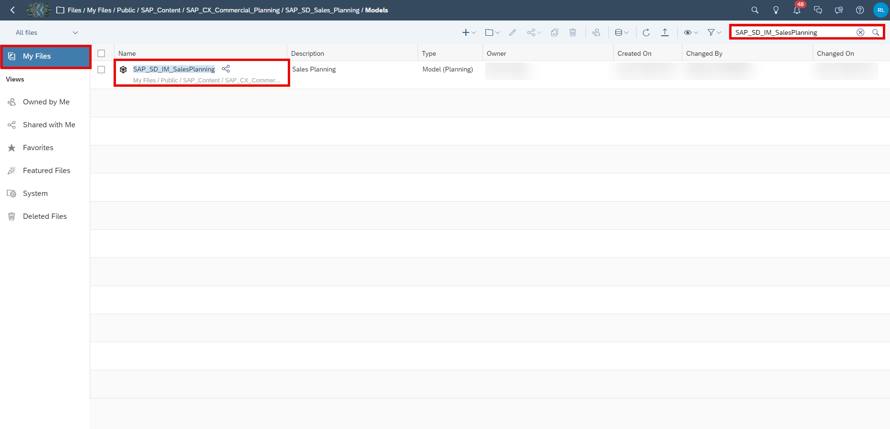

2. Open the `SAP_SD_Tactic` dimension.

    <!-- border; size:540px -->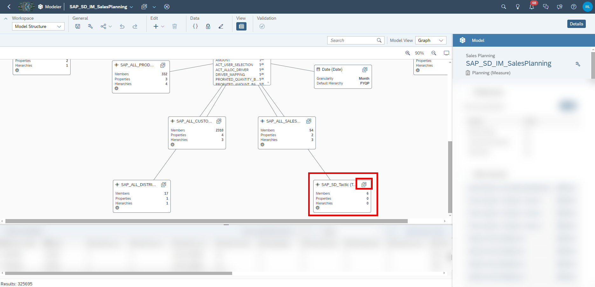

3. Add a new member to the tactic dimension. Use `DISCOUNT` as your **Member ID** and use `Discount` as your description.

    <!-- border; size:540px -->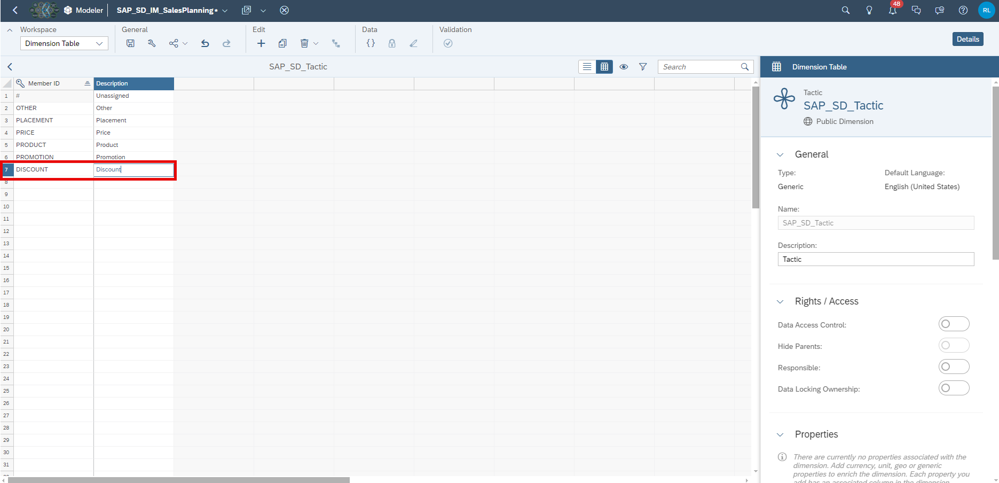

4. **Save** your change.

### Adjust Planning Application

In the next step the **Sales Planning Admin Page** (`SAP_SD_SalesPlanning_AdminPage`) must be modified, and a new mapping should be provided for the new `Tactic` member created.

1. In the SAP Analytics Cloud Menu, navigate to the **Files** section, search for `SAP_SD_SalesPlanning_AdminPage` and select **Open in Story Edit Mode**.

    <!-- border; size:540px -->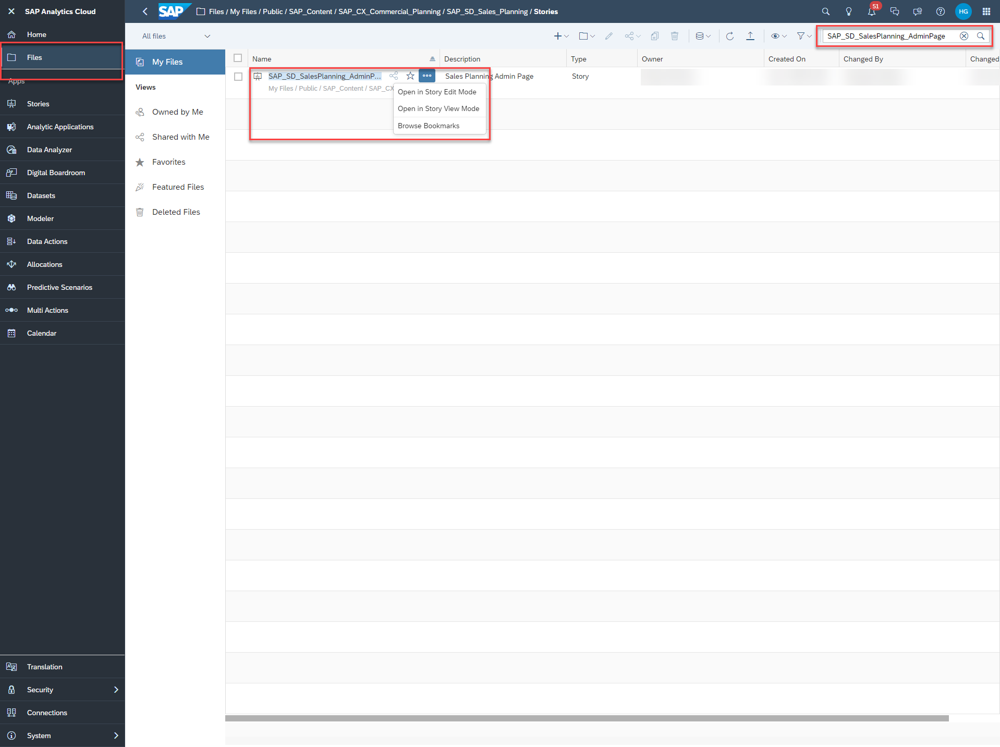

2. Select the **Mapping** page of the story. Right click on the **Tactic** input control or select the button **More Actions**. Click on **Edit Filter...**.

    <!-- border; size:540px -->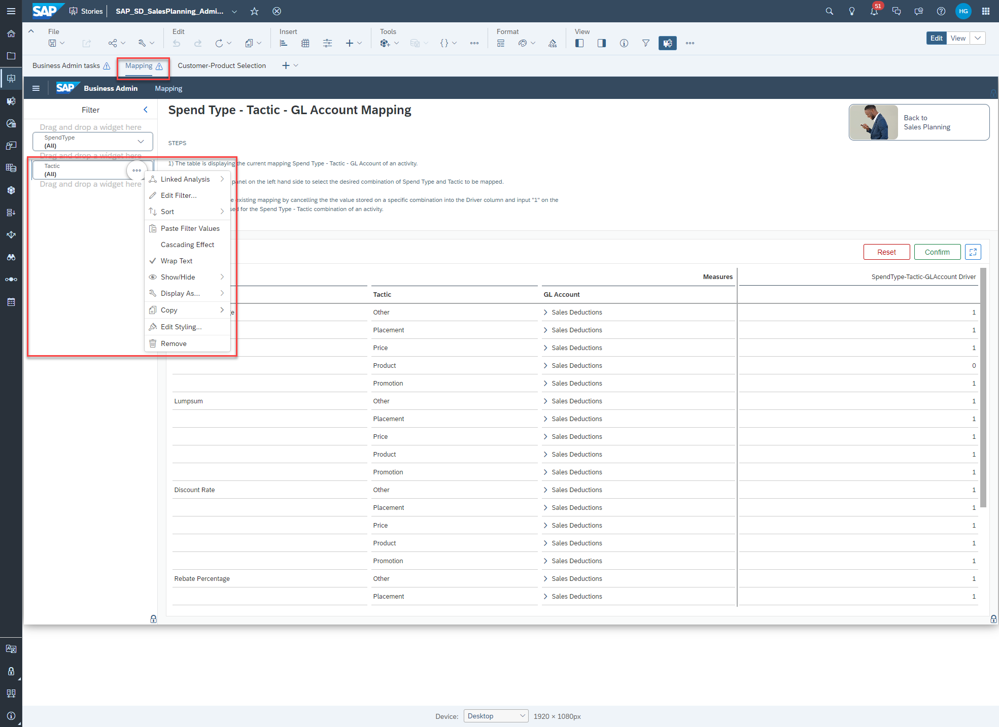

3. Open the **Settings**, go to the **Member Display** setting and select **All Members** in the **Available Members** drop down. Then select your newly added tactic `Discount`. Click on **OK**.

    <!-- border; size:540px -->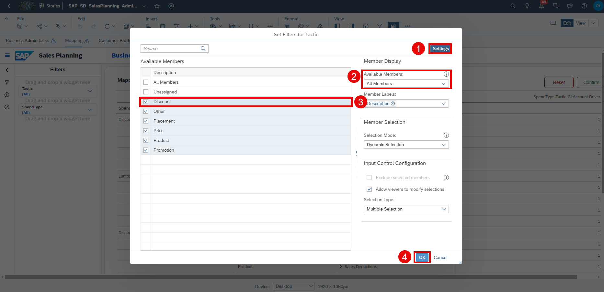

4. **Save** your change and go to **View** mode.

    <!-- border; size:540px -->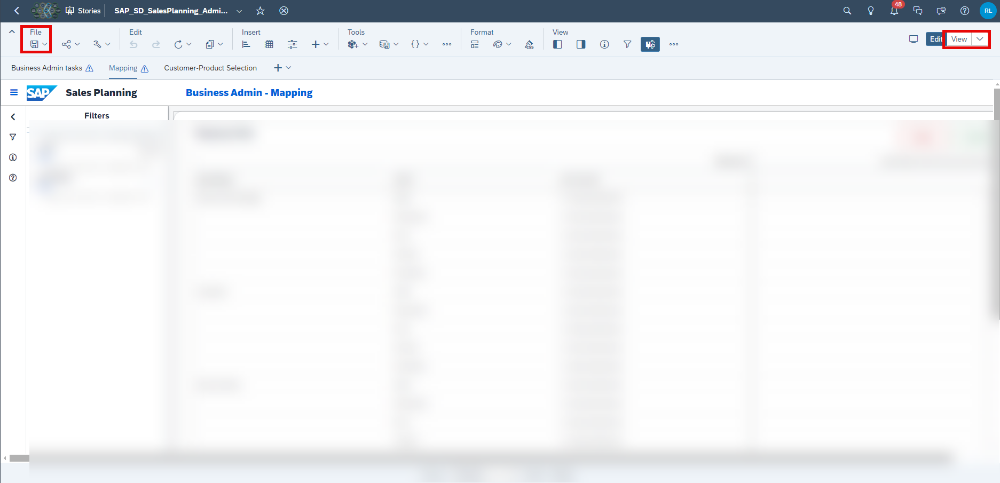

5. Select the **Mapping** page of the story. Right-click on the column `SpendType` in the **Mapping Table**. Select the **Show/Hide** option and select **Unbooked**.

    <!-- border; size:540px -->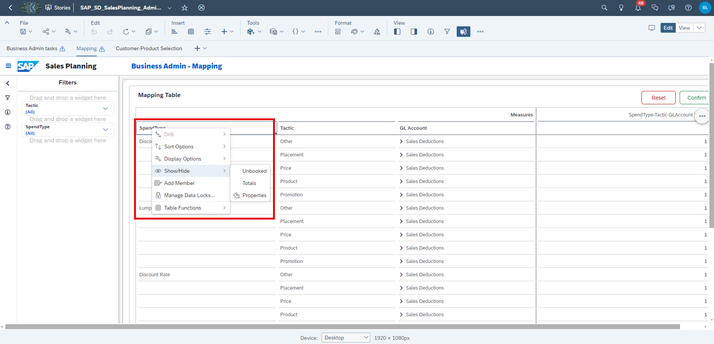

6. The new tactic `Discount` is now visible in the table. Perform a manual input on the desired combination of `SpendType`, `Tactic` and `GL Account` to create a valid driver combination to be used for the sales activity planning.

    <!-- border; size:540px -->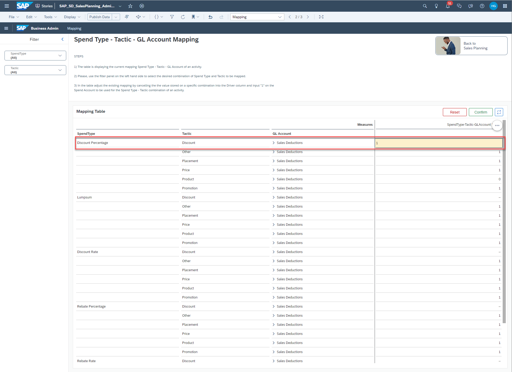

    For instance, enter `1` for the following combination:

    | Column       | Value                 |
    |--------------|-----------------------|
    | `SpendType`  | Discount Percentage   |
    | `Tactic`     | Discount              |
    | `GL Account` | Sales Discount - Domestic |

7. Click on **Confirm** to publish your change.

    <!-- border; size:540px -->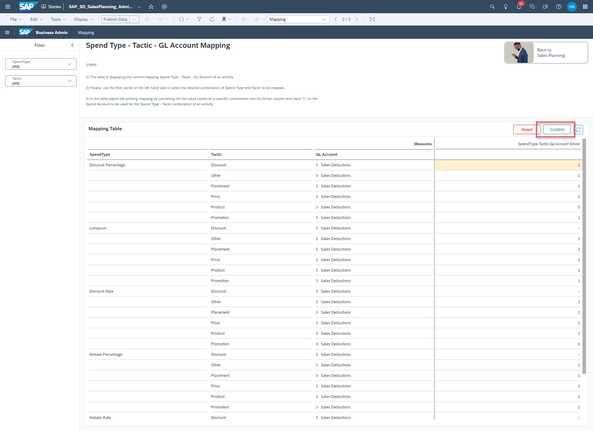

8. Confirm your intention by pressing **Yes**. 

    <!-- border; size:540px -->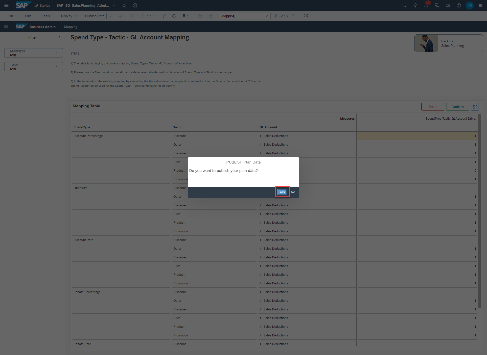

### Final Remarks

Congratulations! You have now successfully created a new tactic and embedded it into the planning applications and stories!

If you want to learn more about the other modules of this content package, check out the following tutorials:

- [xP&A Commercial Planning - Get to know the Marketing Planning module](xpa-sac-cxmp-marketingplanning-gettoknow)
- [xP&A Commercial Planning - Get to know the Sales Planning module](xpa-sac-cxsp-salesplanning-gettoknow)
- [xP&A Commercial Planning - Get to know the Portfolio Planning module](xpa-sac-cxpp-portfolioplanning-gettoknow)

If you want to customize the content and adjust it according to your own business requirements, the following resources might be helpful:

- [xP&A Commercial Planning - Introduction to the Data Model](xpa-sac-cxmp-datamodelfundamentals)
- [xP&A Commercial Planning - Understanding the technical structure of Stories](xpa-sac-cx-technical-structure-stories)
- [xP&A Commercial Planning - Data Integration](xpa-sac-cx-data-integration-setup)
- [xP&A Commercial Planning - Manage data loads](xpa-sac-cx-manage-data-loads)
- [xP&A Commercial Planning - Add additional sections to a story](xpa-sac-cx-add-new-sections)
- [xP&A Commercial Planning - Add an additional story to the Navigation Menu](xpa-sac-cx-add-story-navmenu)
- [xP&A Commercial Planning - Customize Default Settings](xpa-sac-cx-customize-default-settings)
- [xP&A Commercial Planning - Customize Table Settings Dialogue](xpa-sac-cx-customize-tablesettings-dialogue)
- [xP&A Commercial Planning (Marketing) - Add a new Driver](xpa-sac-cxmp-add-new-driver)
- [xP&A Commercial Planning (Marketing) - Add a new Version](xpa-sac-cxmp-add-new-version)
- [xP&A Commercial Planning (Marketing) - Extend activity spend dates](xpa-sac-cxmp-extend-activity-dates)
- [xP&A Commercial Planning (Sales) - Add a new Version](xpa-sac-cxsp-add-new-version)
- [xP&A Commercial Planning (Sales) - Add a new Spend Type](xpa-sac-cxsp-add-new-spendtype)

Interested in more xP&A topics and related business content packages? Visit our community page [Extended Planning & Analysis Business Content](https://community.sap.com/topics/cloud-analytics/planning/content).
