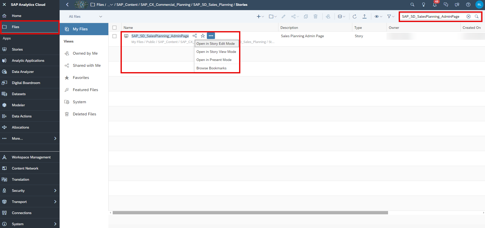
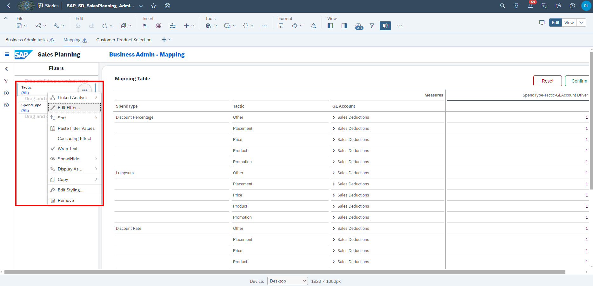
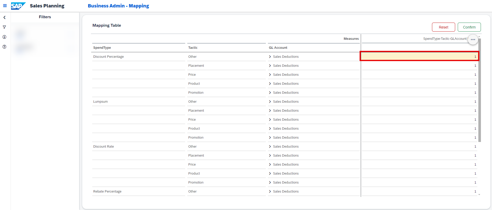
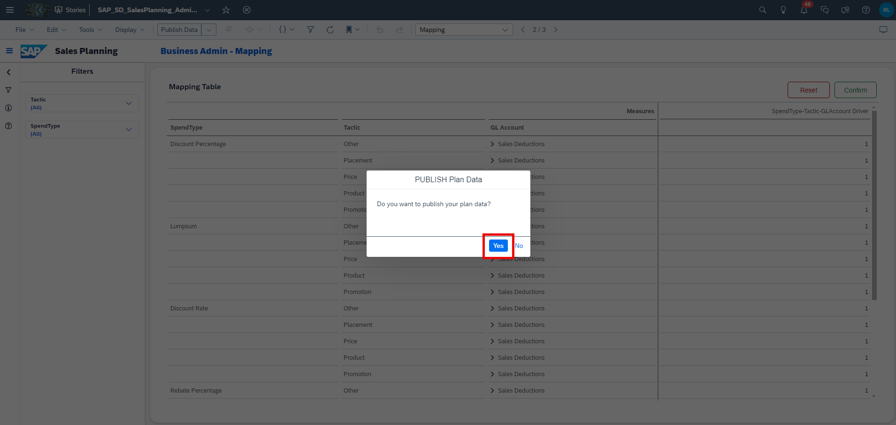

## Prerequisites

- You are familiar with the **SAP Commercial Planning (CX) Sales Planning** content from the xP&A Business Content Suite. Reference: [Getting Started tutorial](xpa-sac-cxsp-salesplanning-gettoknow)
- You have installed the **SAP Commercial Planning (CX) Sales Planning** content in an SAP Analytics Cloud tenant. Reference: [Business Content Installation Guide](https://help.sap.com/docs/SAP_ANALYTICS_CLOUD/00f68c2e08b941f081002fd3691d86a7/078868f57f3346a98c3233207bd211c7.html), [Content Package User Guide](https://help.sap.com/docs/SAP_ANALYTICS_CLOUD/42093f14b43c485fbe3adbbe81eff6c8/b0046d8673b5412cbef7f521cfdfed95.html).

## You will learn

- Which steps are required in order to add and use a new tactic
- This includes...
  - adding a new tactic in the model
  - adjust the planning applications

## Intro

The **SAP Commercial Planning (CX) Sales Planning** content package comes with several pre-defined assumptions, such as the mapping between Tactic – Spend Type and GL Account, which can be used for your planning activities. Nevertheless, you might want to add more tactics according to your own business needs. In this case, you would need to adjust the planning applications as well as the dimension master data.

In this tutorial, you will learn how to add a new tactic member into the dimension and how to make it available in the planning applications of this content package.

### Adjust the Dimension in the Master Data

In the first step, it is necessary to add a new member to the `Tactic` dimension in the Sales Planning data model.

1. In the SAP Analytics Cloud Menu, navigate to the **Files** section, search for `SAP_SD_IM_SalesPlanning` and click on the data model to open it.

    <!-- border; size:540px -->

2. Either click on `SAP_SD_Tactic` or on the button **Navigate to Dimension**

    <!-- border; size:540px -->

3. Add a new member to the tactic dimension. Use `DISCOUNT` as your **Member ID** and use `Discount` as your description.

    <!-- border; size:540px -->

4. **Save** your change.

### Adjust Planning Application

In the next step the **Sales Planning Admin Page** (`SAP_SD_SalesPlanning_AdminPage`)  must be modified, and a new mapping should be provided for the new `Tactic` member created.

1. In the SAP Analytics Cloud Menu, navigate to the **Files** section, search for `SAP_SD_SalesPlanning_AdminPage` and select **Open in Story Edit Mode**.

    <!-- border; size:540px -->

2. Select the **Mapping** page of the story. Right click on the **Tactic** input control or select the button **More Actions**. Click on **Edit Filter...**.

    <!-- border; size:540px -->

3. Toggle to **Show unbooked members**.  Select your newly added tactic `Discount`. Click on **OK**.

    <!-- border; size:540px -->

4. **Save** your change and go to **View** mode.

    <!-- border; size:540px -->

5. Select the **Mapping** page of the story. Right-click on the column `SpendType` in the **Mapping Table**. Select the **Show/Hide** option and select **Unbooked**.

    <!-- border; size:540px -->

6. The new tactic `Discount` is now visible in the table. Perform a manual input on the desired combination of `SpendType`, `Tactic` and `GL Account` to create a valid driver combination to be used for the sales activity planning.

    <!-- border; size:540px -->

    For instance, enter `1` for the following combination:

    | Column       | Value                 |
    |--------------|-----------------------|
    | `SpendType`  | Discount Percentage   |
    | `Tactic`     | Discount              |
    | `GL Account` | Sales Deductions      |

7. Click on **Confirm** to publish your change.

    <!-- border; size:540px -->

8. Confirm your intention by pressing **Yes**.

    <!-- border; size:540px -->

### Final Remarks

Congratulations! You have now successfully created a new tactic and embedded it into the planning applications and stories!

Interested in more xP&A topics and related business content packages? Visit our community page [Extended Planning & Analysis Business Content](https://community.sap.com/topics/cloud-analytics/planning/content).
