## Prerequisites

- You are familiar with the **SAP Commercial Planning (CX) Sales Planning** content from the xP&A Business Content Suite. Reference: [Getting Started tutorial](xpa-sac-cxsp-salesplanning-gettoknow)
- You have installed the **SAP Commercial Planning (CX) Sales Planning** content in an SAP Analytics Cloud tenant. Reference: [Business Content Installation Guide](https://help.sap.com/docs/SAP_ANALYTICS_CLOUD/00f68c2e08b941f081002fd3691d86a7/078868f57f3346a98c3233207bd211c7.html), [Content Package User Guide](https://help.sap.com/docs/SAP_ANALYTICS_CLOUD/42093f14b43c485fbe3adbbe81eff6c8/b0046d8673b5412cbef7f521cfdfed95.html).  

## You will learn

- Which steps are required in order to add and use a new version
- This includes...
  - adding a new version via the version management function
  - which options are available to use the new version for your planning activities

## Intro

The **SAP Commercial Planning (CX) Sales Planning** content package comes with a number of pre-defined versions which can be used for your planning activities. Nevertheless you might want to add more versions according to your own business needs. In this case, you would need to adjust the planning applications as well as the reporting stories, so the planning grids and objects initialize with the correct version member.

In this tutorial, you will learn how to add a new version and how to make it available in the planning applications and reporting stories of this content package.

### Enter Version Management section

In the first step, it is necessary to add a new member to the `Version` dimension. In order to do so, you need to enter the **Version Management** section.

1. In the SAP Analytics Cloud Menu, navigate to the **Files** section.

2. Search for any application with a table. In this example, we will look for the `SAP_SD_SalesDemandPlanning` application and **Open in Story Edit Mode**.

    <!-- border; size:540px -->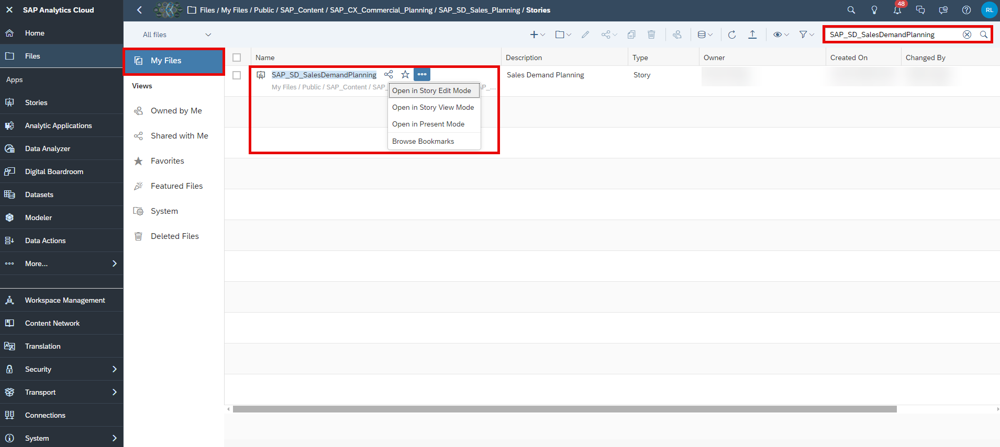

3. Click on the table and open the **Version Management** section in the **Tools** section.

    >INFORMATION:
    >
    **Version Management** is greyed out as long as you have not selected the table beforehand.

    <!-- border; size:540px -->

### Create new Version

After clicking on the **Version Management** icon, a new section on the right-hand side expands, where public and private versions are listed. By default, there is a filter applied to only display Versions currently in use in the selected table. If you prefer, you can deselect that switch in the right-hand side panel in order to display all versions. In this step, that will not be necessary as you proceed to add a new public version to the data model based upon the currently selected Plan version.

1. Duplicate an existing version.

    - Choose a version and click on the **copy** icon next to it. In this example, you will create a copy of the version `public.Plan`.

    <!-- border; size:540px -->

2. Define the version properties.

    - Choose a valid name for your new version. In this example we will call it `Baseline`.
    - Ensure to choose **Planning** as your version category.
    - Choose one of the options provided for your copy operation. In this example, we will **Copy all data** from the `public.Plan` version to the new version.
    - Click on **OK** to create the copy.

    <!-- border; size:540px -->

### Publish new Version

Now that you created the new version, you need to publish it as it is initially created as a private version.

1. Click on the **Publish** icon next to your new version. Select the option **Publish As**.

    <!-- border; size:540px -->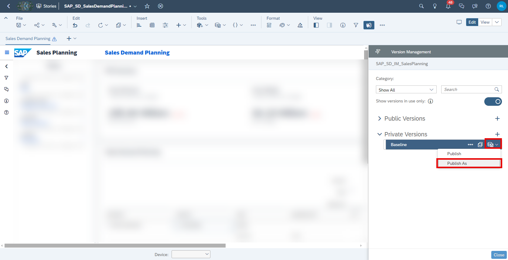

2. Specify the version properties.

    <!-- border; size:540px -->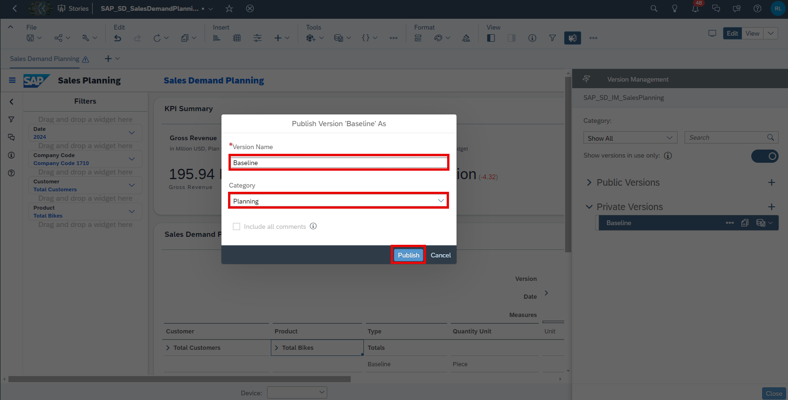

    - Specify the version name once more. In this example, we will stick to the name `Baseline`.
    - Specify the version category once more. Ensure to select **Planning**.
    - Click on the **Publish** button when done.

3. Close your story.

    - You may now close your story.
    - There is no need to save it as it only served as an entry point for the version management section.
    - You can also leave this page open as you have to come back to it in a later step.

### Adjust Version Properties

Now that you created your new version, you can make a couple of adjustments which are relevant for the planning activities. This includes changing the plan horizon or the reference period for instance.

1. In the SAP Analytics Cloud Menu, navigate to the **Files** section.

2. Search for the `SAP_SD_IM_SalesPlanning` data model and open it.

    <!-- border; size:540px -->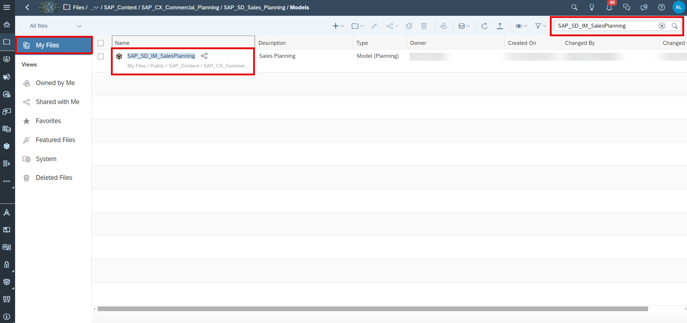

3. Click on the dimension `Version` or on the **Navigate to Dimension**-button.

    <!-- border; size:540px -->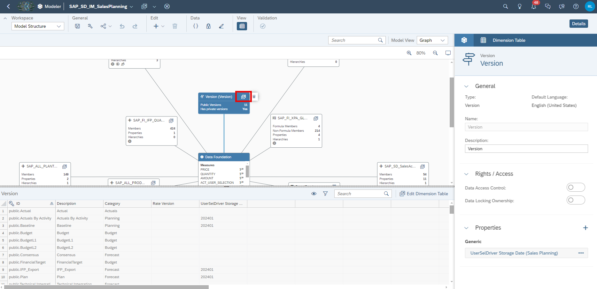

4. Adjust the version properties.

    <!-- border; size:540px -->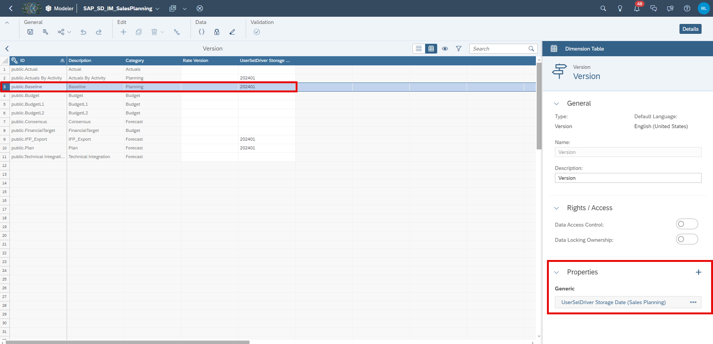

    - As your new version `Baseline` was created based on a copy of the version `Actual`, all properties were copied.
    - In case you want to adjust some of the properties, you can do it here.

    The below table offers an overview on the different properties and their impact.

    | Column       | Explanation                 |
    |--------------|-----------------------|
    | `ID` | Not editable. Displays the ID of the version member. |
    | `Description`    | Not editable. Represents the description of the version member.             |
    | `Category`  | Not editable. Defines the category of the version member.      |
    | `Rate Version` | Used when planning with currency conversion and multiple sets of exchange rates. |
    | `UserSelDriver Storage Date (Sales Planning)` | Tracks the date on which the two main model drivers are stored (`DRIVER_MAPPING` measure, which is used to store the GLAccount-Tactic-SpendType mapping; `ACT_USER_SELECTION` measure, which is used to store product-customer selections impacted by each activity) |

5. Save your changes in case you have done any.

### Initialize Objects in Planning Applications with new Version

You need to make some adjustments in order for the applications to initialize all objects with the new version.

1. Incorporate new version into planning applications

    Here you learn how to set the new version as the default version for the initialization of the objects used in the planning applications by adjusting the scripts, filters and variances. You can skip step 1 and 2 in case you left the app `SAP_SD_SalesDemandPlanning` open.

      1. In the SAP Analytics Cloud Menu, navigate to the **Files** section.

      2. Search for the affected application, in which you want the objects to be initialized with new version. In this example, we will look for the `SAP_SD_SalesDemandPlanning` application and **Open in Story Edit Mode**.

         <!-- border; size:540px -->

         >INFORMATION:
         >
         Please note that the procedure is the exact same for any other application. Possible applications where the plan version can be changed either in script or at least in the charts are:

         - `SAP_SD_SalesActivityAnalysis`
         - `SAP_SD_SalesActivityPlanning`
         - `SAP_SD_SalesActivityROI`
         - `SAP_SD_SalesDemandPlanning`
         - `SAP_SD_SalesPerformanceAnalysis`
         - `SAP_SD_SalesPlanning_AdminPage`

      3. Open the **Left Side Panel**, open the **Outline**. Scroll down to the **Scripting** section and click on the **More**-button of the script variable `pageFilter_Version`. Click on **Find Reference** and get an overview in which scripts the variable is used.

         <!-- border; size:540px -->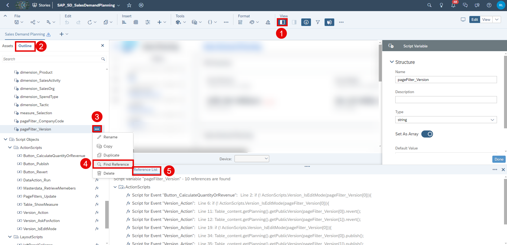

      4. Select one of the references `Script for Event "PageFilers_Update: ..."`. In line 9 of the `ActionScripts.PageFilers_Update`-script replace the first element of the array with your newly created version:

            pageFilter_Version[0] = "Baseline";

         <!-- border; size:540px -->

         The first entry in the variable array `pageFilter_Version` is used for publishing and reverting data. However, it is not used to set the version filter to the planning table and charts and the variances for the charts. You change this in the next steps.

      5. Close the **Info Panel** and search for the table `Table_content` or select the table on **page_1** manually.

         <!-- border; size:540px -->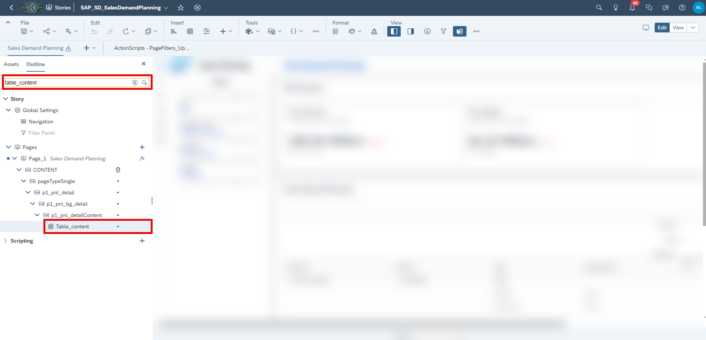

      6. Select **Right Side Panel** and click on the **Version** filter.

         <!-- border; size:540px -->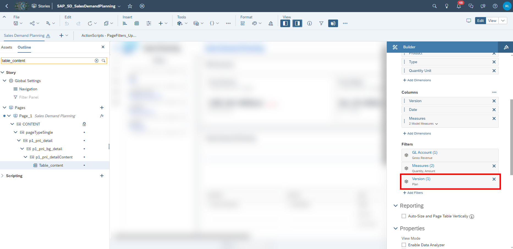

      7. Unselect the current version `Plan` and select the new version `Baseline`. Click on **OK**.

         <!-- border; size:540px -->

      8. Follow step 5-7 for the remaining charts. You have to change the version filter for the following charts:

         - `p1_chart_pageHeader_chartKPI_1`
         - `p1_chart_pageHeader_chartKPI_3`

      9. Adjust the variance for both charts `p1_chart_pageHeader_chartKPI_1` and `p1_chart_pageHeader_chartKPI_3`. Click on the **Edit**-button of `All Accounts in Use (Variance)` under **Variance**.

         <!-- border; size:540px -->

      10. Change the Version for **COMPARE (A)** from `Plan` to `Baseline` for both charts `p1_chart_pageHeader_chartKPI_1` and `p1_chart_pageHeader_chartKPI_3`. Save your changes afterwards.

         <!-- border; size:540px -->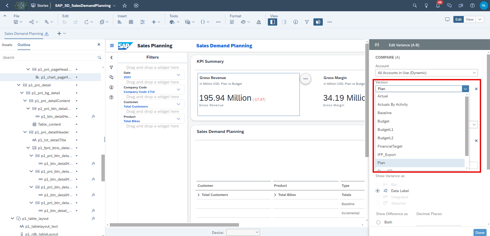

2. Adjust Version Input Controls in a Story

    You learn how to set the new version as an option in filter widgets inside the reporting story `SAP_SD_SalesBudgetAnalysis`.

      1. In the SAP Analytics Cloud Menu, navigate to the **Files** section.

      2. Search for the affected application `SAP_SD_SalesBudgetAnalysis` and **Open in Story Edit Mode**.

         <!-- border; size:540px -->

      3. Right-click on the input control **Reference_Version1**. Otherwise, you can hover over the input control to get the option to click on the three dots **"..." (More Actions)**. Click on **Edit Input Control** in the context menu.

         <!-- border; size:540px -->

      4. In the **Input Section** of the **Calculation Input Control** click on the values to edit them.

         <!-- border; size:540px -->

      5. Select `Baseline` as additional value for your version. Press **OK** two times.

         <!-- border; size:540px -->

      6. Repeat step 3-5 for the input control **Reference_Version2** below input control **Reference_Version1**. Save the story afterwards.

         <!-- border; size:540px -->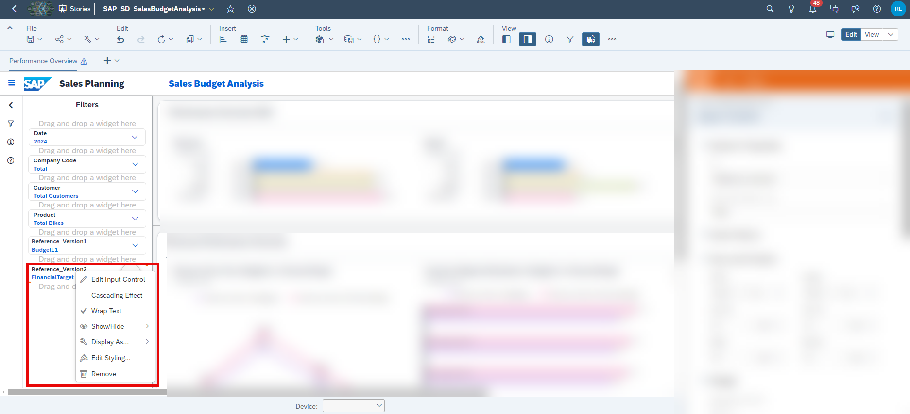

3. Adjust Version in Data Actions

    You learn how to set the new version in data action `SAP_SD_IM_ActualActivityP&LCalculation`. The baseline activity costs of goods sold and the incremental costs of good sold are calculated on the `Plan` version. Without the change in the data action, any change made on your `Baseline` version will not effect the calculated COGS. Hence, you need to change it to your new version.

    >INFORMATION:
    >
    The next advanced step not being shown here would be to introduce a parameter in the data action. Instead of hard-coding the version you would be able to feed your desired version into the data action. As this requires extensive changes to the data action and depended stories it is only mentioned as an outlook.

      1. In the SAP Analytics Cloud Menu, navigate to the **Files** section.

      2. Search for the affected data action `SAP_SD_IM_ActualActivityP&LCalculation` and open it.

         <!-- border; size:540px -->

      3. Click on the step `Compute Baseline Activity COGS`. Search for the previous version `Plan` and replace it in the data action on line 25 with the new version `Baseline`.

         <!-- border; size:540px -->

      4. Click on the next step `Compute Incremental COGS` and do the same as in step 4.

         <!-- border; size:540px -->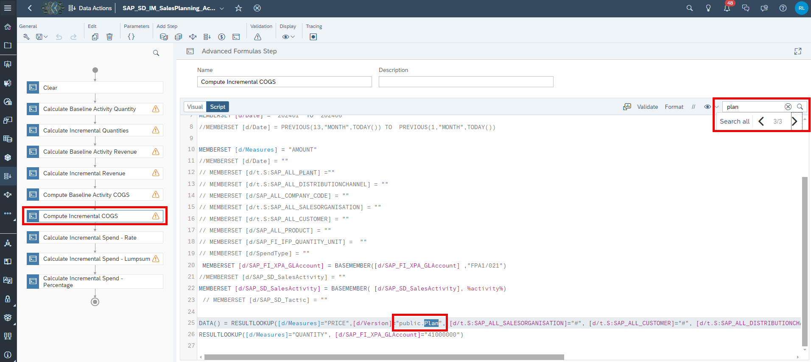

      5. Save the changes.

### Final Remarks

Congratulations! You have now successfully created a new version and embedded it into the planning applications and stories!

Interested in more xP&A topics and related business content packages? Visit our community page [Extended Planning & Analysis Business Content](https://community.sap.com/topics/cloud-analytics/planning/content).
