## Prerequisites

- You have an SAP Analytics Cloud tenant. If this is not the case, get started by requesting a free [SAP Analytics Cloud trial](https://www.sap.com/products/technology-platform/cloud-analytics/trial.html) tenant.
- You have installed the **SAP Commercial Planning (CX)** content in an SAP Analytics Cloud tenant. Reference: [Business Content Installation Guide](https://help.sap.com/docs/SAP_ANALYTICS_CLOUD/00f68c2e08b941f081002fd3691d86a7/078868f57f3346a98c3233207bd211c7.html), [Content Package User Guide](https://help.sap.com/docs/SAP_ANALYTICS_CLOUD/42093f14b43c485fbe3adbbe81eff6c8/b0046d8673b5412cbef7f521cfdfed95.html).

## You will learn

- All basics of the Sales Planning module within the Commercial Planning (CX) content package for SAP Analytics Cloud 
- How to navigate and use the Sales Planning stories in the content package
- How to perform global and regional sales budget planning, including initializing the planning version, setting up the planning table, adjusting revenue and spend and publishing the result
- How to perform sales demand planning, including setting up the planning table, adjusting revenue and quantity, and publishing the result
- How to perform sales activity planning, including creating, editing, copying, and cancelling activities, and publishing the result
- How to navigate and use the different reports in the content package, including sales budget analysis, sales activity analysis, sales activity ROI report, and sales performance analysis

## Intro

A detailed documentation can be found in our [Content Package User Guide](https://help.sap.com/docs/SAP_ANALYTICS_CLOUD/42093f14b43c485fbe3adbbe81eff6c8/b0046d8673b5412cbef7f521cfdfed95.html).

In case you have any questions or require further support, please use the [SAP Question Form](https://community.sap.com/t5/forums/postpage/choose-node/true/product-id/bcbf0782-ce74-43b8-b695-dafd7c1ff1c1/board-id/technology-questions).

If you have a specific request to our team in regards to the business content, you may also submit a request using the [SAP Influence Platform](https://influence.sap.com/sap/ino/#/idea-create?campaign=884&title=Extended%20Planning%20and%20Analysis%3A%20content&tags=Extended%20Planning%20and%20Analysis&RespList=cust.ino.config.SAP_ANALYTICS_CLOUD_SAP_DIGITAL_BOARDROOM.BIZ_CONTENT).

If you are interested in more xP&A topics, related business content packages, or videos showing the content in action, feel free to check out our community page [Extended Planning & Analysis Business Content](https://community.sap.com/topics/cloud-analytics/planning/content).

### Access SAC Contents

In this step you will learn how to navigate to the folder which contains all SAP Analytic Cloud content packages.

1. Login to your SAP Analytics Cloud tenant using **Google Chrome**.

    >INFORMATION:
    >
    In order to get the best experience, it is recommended to use **Google Chrome** as it offers the best compatibility with SAC. Other browsers can be used as well but are not supported by SAP.

2. In the SAP Analytics Cloud Menu, navigate to the **Files** section.

    <!-- border; size:300px -->

3. Access the content package folder.

    - You can access the content package folder by either navigating to the `Public` folder first and looking for a folder named `SAP_CONTENT`, or by using the **search function** in the top-right corner.
    - In case you want to make use of the search function, simply enter the term `SAP_CONTENT` into the search bar.

    <!-- border; size:540px -->

    - The folder `SAP_CONTENT` contains all objects required to run SAC content. Here you can find your installed content from the content network provided by SAP.

    <!-- border; size:540px -->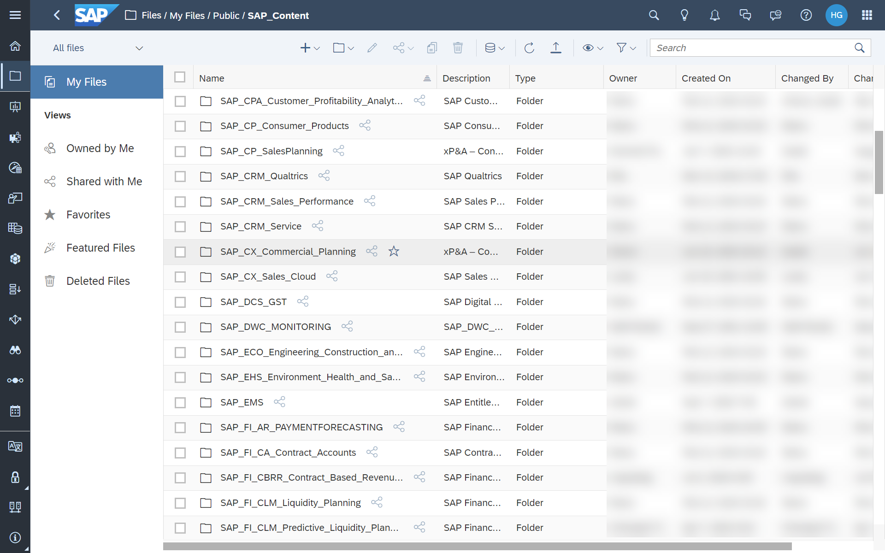

### Access Sales Planning Content

Now that you learned where all the SAP Analytics Cloud content packages are stored, you need to find the Sales Planning content within the **SAP Commercial Planning (CX)** content package.

1. Look for the **SAP Sales Planning (SP)** content by using the search bar.

    - In order to do so, please use the keyword `xP&A` or `SD`
    - In the result list, click on the folder `SAP_SD_Sales_Planning` with the description `xP&A – SAP Sales Planning`

    <!-- border; size:540px -->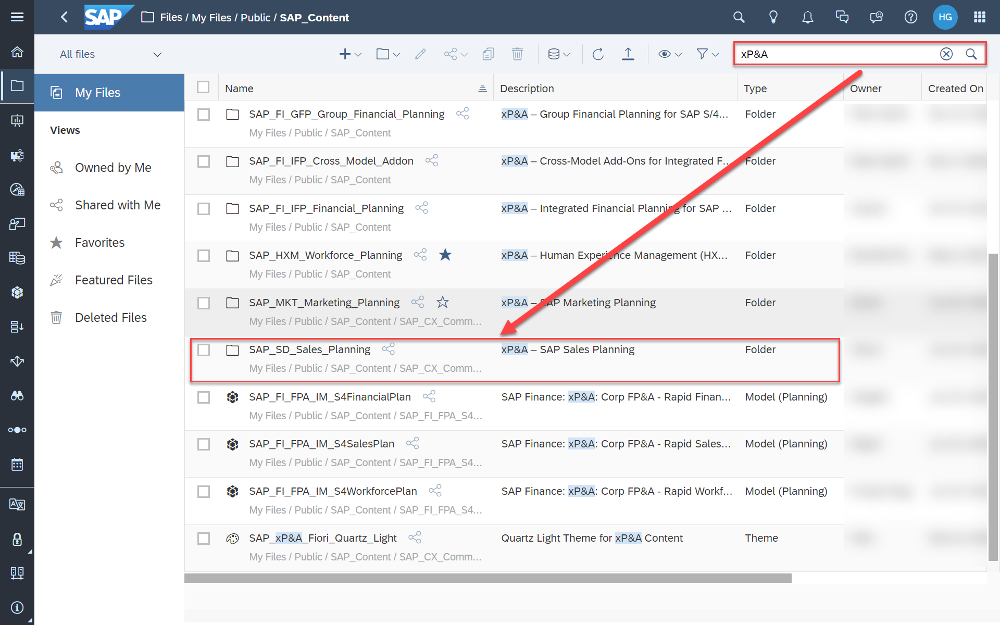

2. Run the Sales Planning content package.

    - The folder `SAP_SD_Sales_Planning` contains all planning applications and the reporting story.
    - To run the Sales Planning content, please click on the folder `Stories` and on the application called **Sales Planning Overview Page** (`SAP_SD_SalesPlanning_Overview`).

    <!-- border; size:540px -->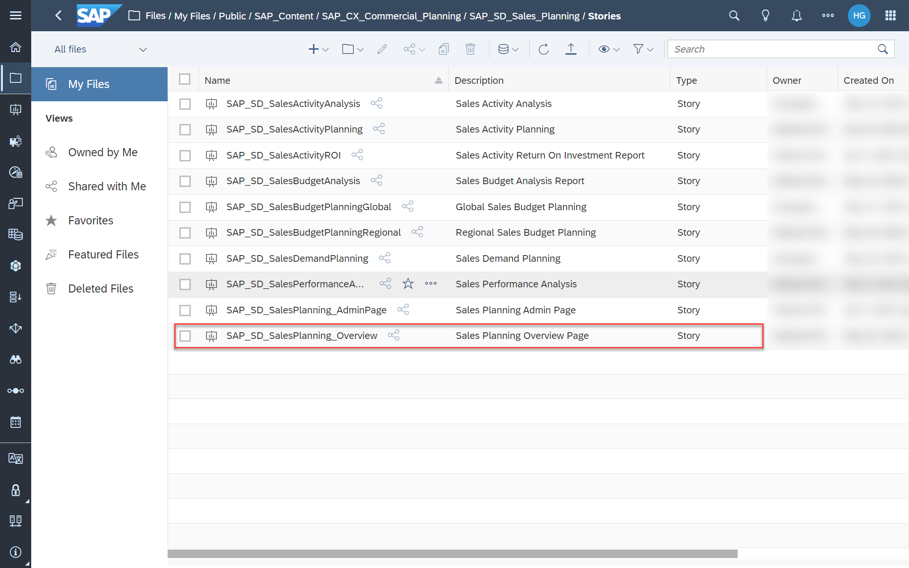

    >INFORMATION:
    >
    The application `SAP_SD_SalesPlanning_Overview` serves as a starting point and allows you to access all of the other resources during run time. In other words, you do not need to access the remaining applications by manually launching them from the **Files** section. Instead, you can open them from inside the `SAP_SD_SalesPlanning_Overview` application.

### Sales Planning Content Overview

Before jumping into the different applications which are accessible through the landing page of this content package, it is necessary to understand what the individual applications are for and which use cases they cover.

1. **Overview Page**

    <!-- border; size:540px -->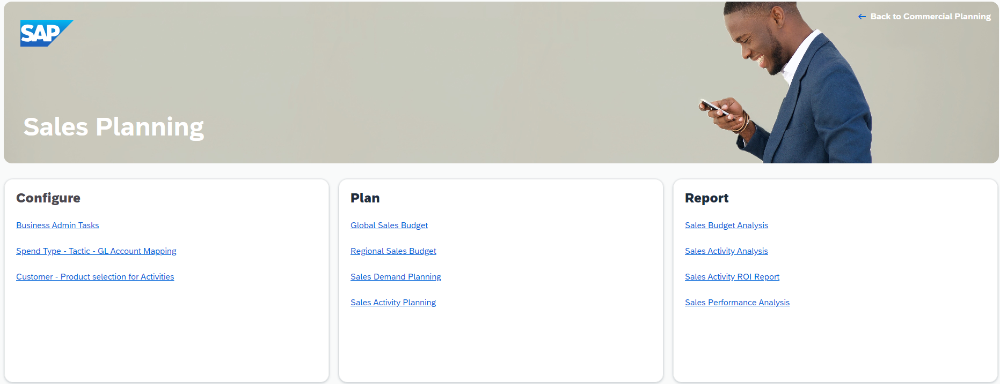

    - By having opened the application **Sales Planning Overview Page** (`SAP_SD_SalesPlanning_Overview`), you entered the **Home Screen** of the Sales Planning content.
    - The overview application serves as the central entry point for all personas and helps to navigate through the content package.
    - In the lower half of the application, you can see three sections which cluster the different components of the application.
    - Those sections contain hyperlinks, which redirect the responsible persona to the relevant application.

2. **Configure**

    <!-- border; size:540px -->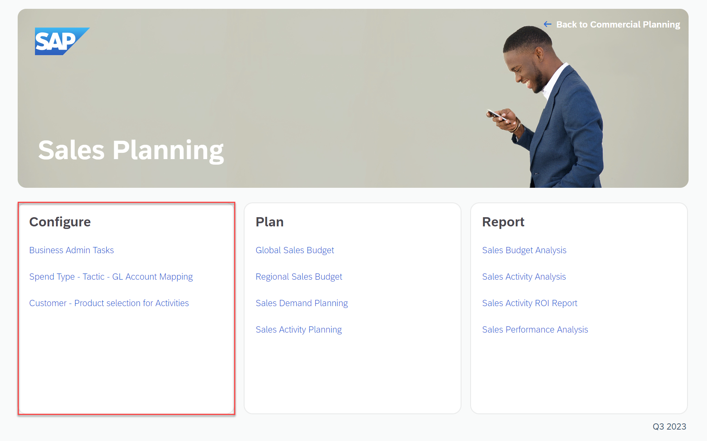

    - The section **Configure** contains links to the different pages of the application **Sales Planning Admin Page** (`SAP_SD_SalesPlanning_AdminPage`).
    - This application marks the start of the planning process and allows you to set up all the required mapping between dimensions for the planning version.
    - This application is designed for the planning administrator.

3. **Plan**

    <!-- border; size:540px -->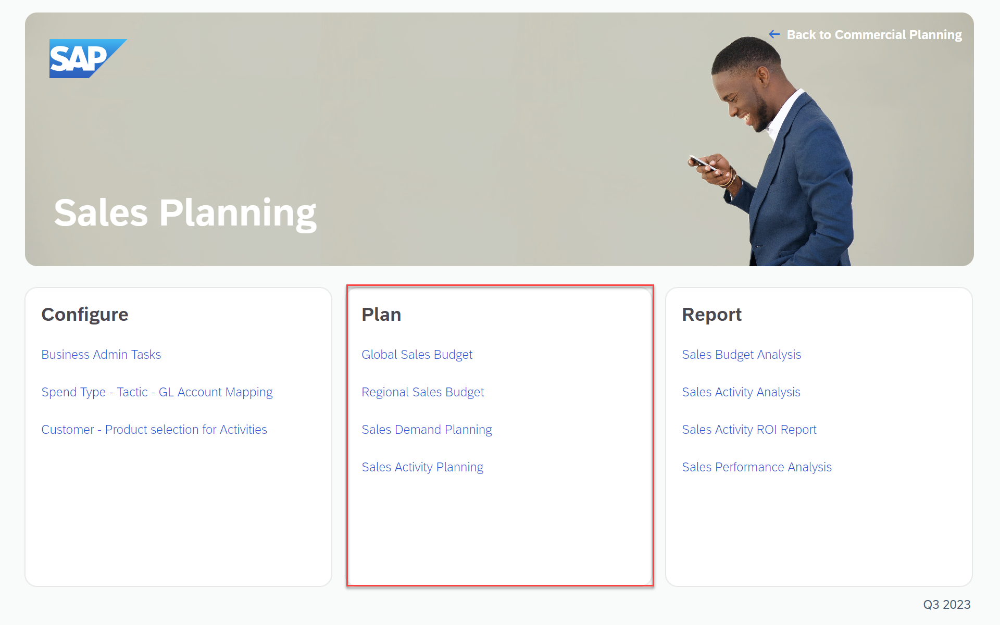

    - The section **Plan** provides access to different applications which allow you to perform planning activities in the different scenarios.

4. **Report**

    <!-- border; size:540px -->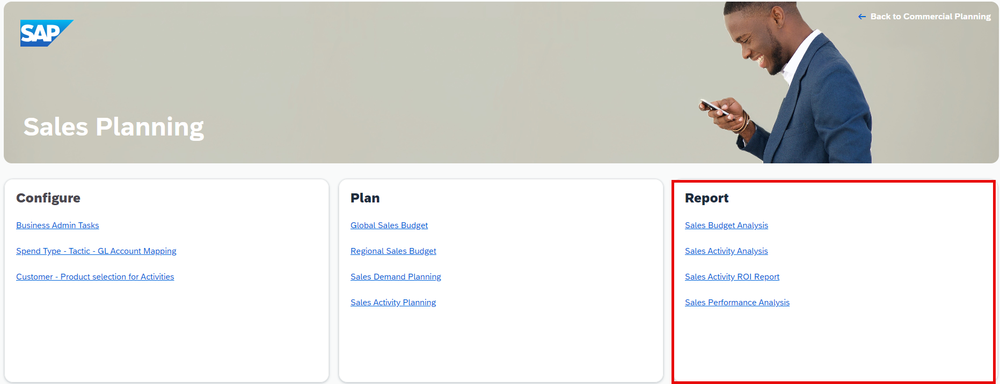

    - The section **Reporting** contains links to different parts of the reporting stories available for the **Sales Planning** content.
    - The reporting stories provide reports to compare actual performances with different plan scenarios in order to derive actions for your business.

### Navigation Concepts within the Content

As a last preparation step, it is required to understand the navigation concept of the content package in order for you to use it properly. In this step, you will learn about the meaning and the functionality of all the buttons as well as other UI elements.

1. **Navigation Menu**

    - Each story apart from the **Sales Planning Overview Page** (`SAP_SD_SalesPlanning_Overview`) has a Navigation Menu button located on the top-left corner.
  
    <!-- border; size:540px -->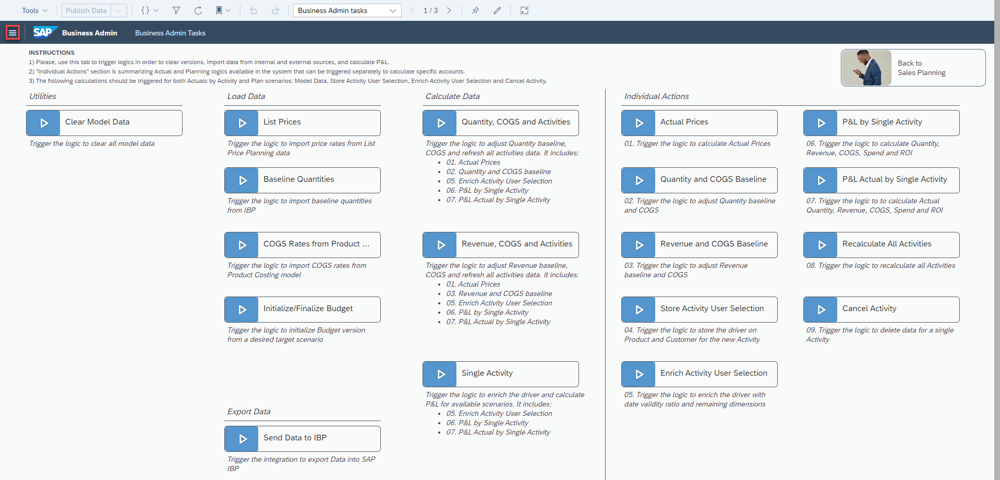

    - For example, launch the Business Admin Tasks from the Configure box. Now you will see the Navigation Menu button.

    <!-- border; size:540px -->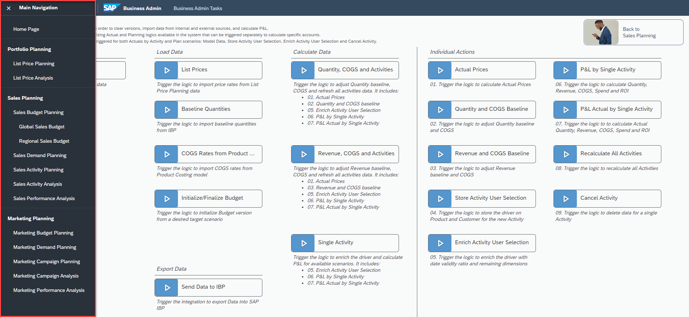

    - Click on the Navigation Menu button and a panel with all the applications available in the system for the Commercial Planning package will appear.

2. **Filter** button

    <!-- border; size:540px -->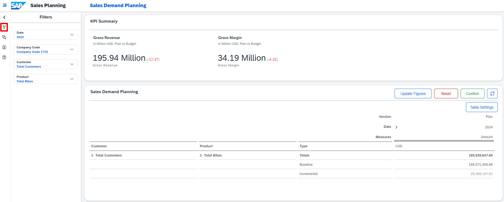

    - This button can be found in the left-side panel of all planning and reporting stories of this content package.
    - You can filter tables and charts down to specific members of the given dimensions for an eased data entry and reporting.

3. **Collapse/Expand** button

    <!-- border; size:540px -->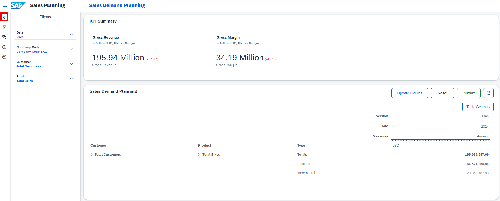

    - By clicking on the little **arrow icon**, you can collapse the side panel in order to create more space for your planning tables or charts. 

4. **Confirm** button

    <!-- border; size:540px -->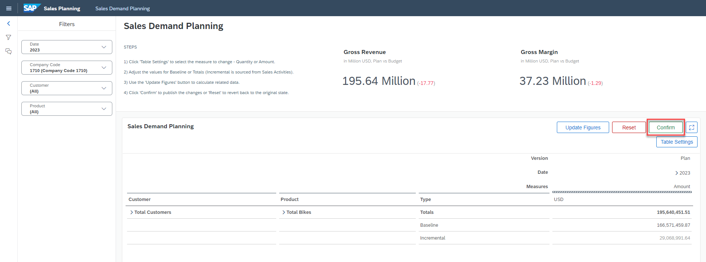

    - This button can be found in each planning story of this content package and is located at the top-right above the table.
    - The **Confirm** button lets you publish your current plan data as a public plan version.

5. **Reset** button

    <!-- border; size:540px -->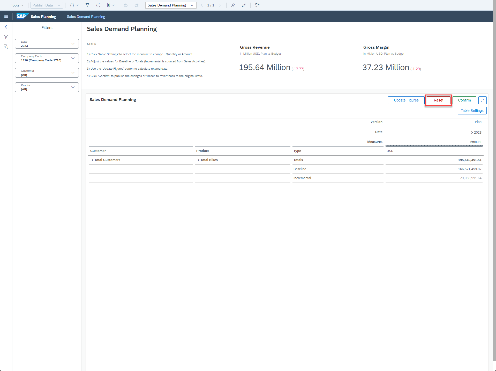

    - This button can be found in each planning story of this content package and is located at the top-right above the table.
    - The **Reset** button can be used to reset all changes you have done in the plan version since the last publish.

6. **Table Settings** button

    <!-- border; size:540px -->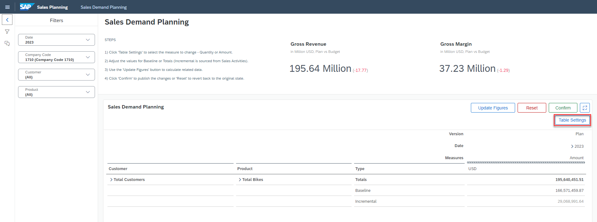

    - This button can be found in some of the planning stories at the top-right above the table.
    - The **Table Settings** button lets you adjust some dimensions and measures of the table.

7. **Reduce/Enlarge** button

    <!-- border; size:540px -->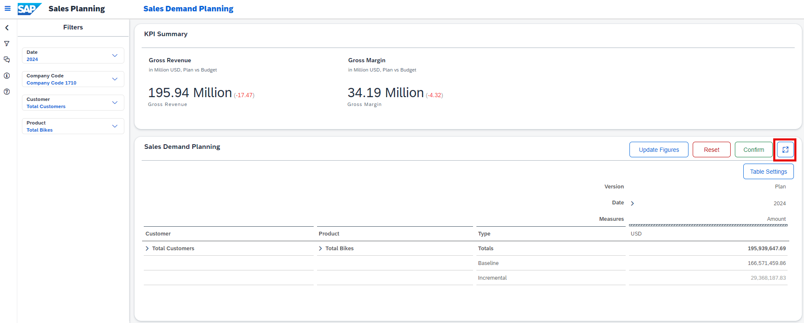

    - This button can be found at the top-right above the table.
    - The **Reduce/Enlarge** button lets you maximize and minimize the planning table by hiding or showing the charts above accordingly.

8. **Comment** button

    <!-- border; size:540px -->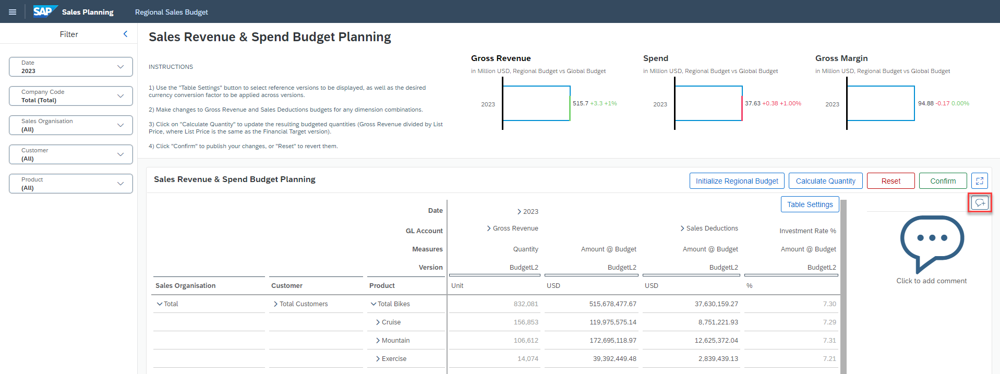

    <!-- border; size:540px -->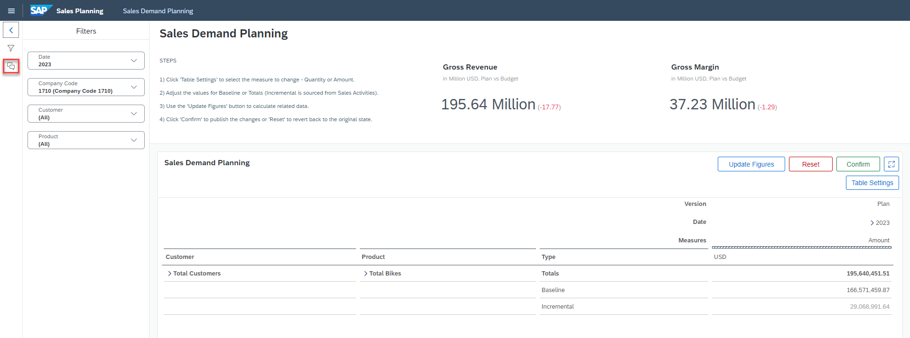

    - This button can be found at the top-right above the table or on the left-side panel depending which application you are using. 
    - The **Comment** button enables you and your team to collaborate and communicate on your planning.

9. **Steps** description field

    <!-- border; size:540px -->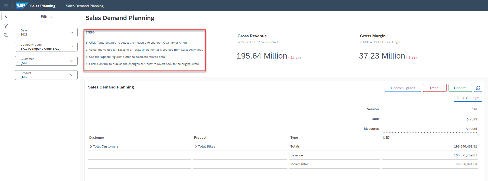

    - Such a text field can be found in all stories of this content package apart from the **Sales Planning Overview Page** (`SAP_SD_SalesPlanning_Overview`) and is located inside the left-side panel.
    - This description field serves as a rough guideline and describes the intended workflow within each of the planning applications.

### Application Configuration

Now that you are familiar with the basics and the navigation concept, you will learn in more detail how to use the different planning applications.
This step focuses on the **Admin Page** (`SAP_SD_SalesPlanning_AdminPage`) application.
You will learn how to open the story, trigger initialization logic and how to setup mappings.

>INFORMATION:
>
You only need to perform the initialization steps for the data if you want to work with your own data. You can work with the pre-built data for the time being as well and initialize your data from your source systems later.

1. Open **Business Admin tasks**

    <!-- border; size:540px -->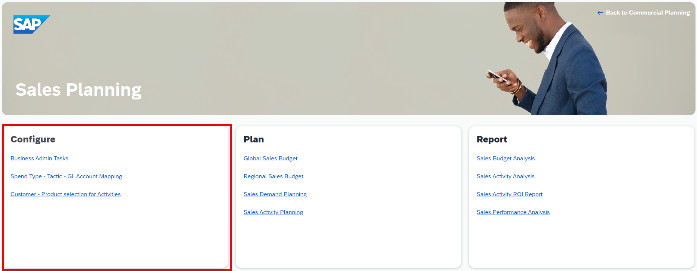

    - Open **Sales Planning Overview Page** (`SAP_SD_SalesPlanning_Overview`).
    - Click on **Business Admin tasks** in the Configure section in order to land on the related tab of the Admin Page.

2. Familiarize yourself with the application

    <!-- border; size:540px -->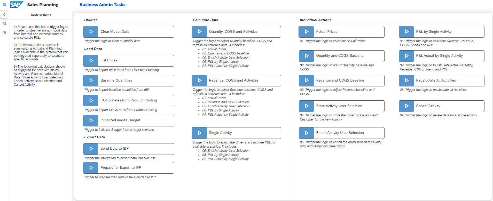

    - Get an overview of the application and read the instructions.
    - All planning applications provide a short in-built step by step guide which helps you to use the corresponding application correctly.
    - Before using the application, make sure to check the Instructions field to understand the intended workflow.
    - This tab contains the data actions and multi actions available in the system for the Sales Planning process. By triggering the dedicated logic, you are able to clear versions, import data from external and internal sources, and calculate the relevant Profit and Loss figures.
    - The **Utilities** section offers a function to delete all the data and all measures on all combinations existing on the version selected as a Target Version.
    - The **Load Data** area provides functions to load prices, baseline quantities or COGS rates from external data sources or data models.
    - The remaining areas **Calculate Data** and **Individual Actions** cover all other data actions and multi actions which are automatically called during the usage of the stories related to the sales planning.

3. Setup your data

    <!-- border; size:540px -->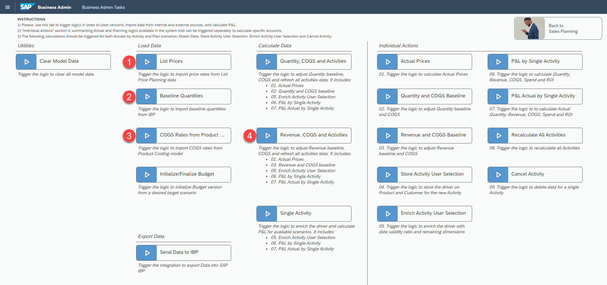

    >INFORMATION:
    >
    Please note, that the following steps assume, that you have already setup your data for Marketing Planning. The following steps are building on top of it. Please note as well, that you need to maintain the **HTTP API Connection** and **API URL** of your **SAP Integrated Business Planning (IBP)** system in the multi action `Multiaction importing IBP Baseline Quantities` (`SAP_SD_IM_InboundBaselineQuantitiesFromIBP`). Otherwise, you will get a warning that you need to fix errors in the multi action designer.

    <!-- border; size:540px -->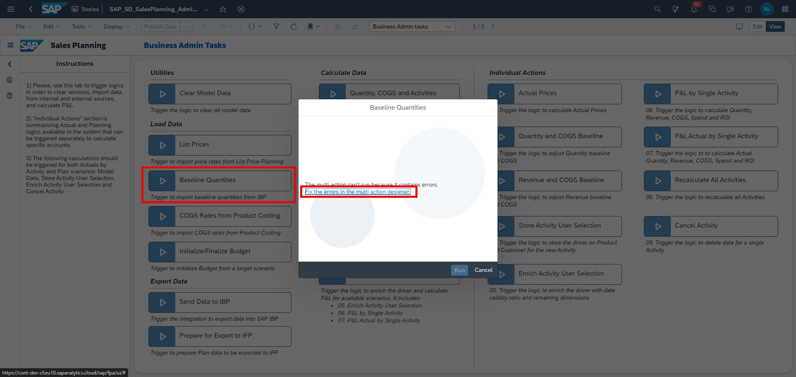

    >INFORMATION:
    >
    This is mentioned error screen you receive when triggering the multi action **Baseline Quantities** without proper configuration. The link will take you to the multi action to maintain the needed details.

    <!-- border; size:540px -->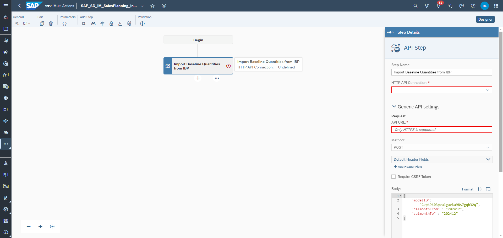

    >INFORMATION:
    >
    Click on the step or exclamation mark to open the details of the step. You can see the missing fields for **HTTP API Connection** and **API URL**. This and more will be explained in [xP&A Commercial Planning - How to set up system connections](xpa-sac-cx-data-integration-setup).

    >INFORMATION:
    >
    Additionally, please note, that you need to have [Integrated Financial Planning for S/4HANA](https://help.sap.com/docs/SAP_ANALYTICS_CLOUD/42093f14b43c485fbe3adbbe81eff6c8/4922aae688c543c5863a70c1316694d5.html). Follow the [Business Content Installation Guide](https://help.sap.com/docs/SAP_ANALYTICS_CLOUD/00f68c2e08b941f081002fd3691d86a7/078868f57f3346a98c3233207bd211c7.html) to install it. You can learn more about the details of data mapping of the actual transaction data from SAP S/4HANA (`A_JournalEntryItemBasicQuery`) to SAC Sales Planning model (`SAP_SD_IM_SalesPlanning`) in the [Content Package User Guide](https://help.sap.com/docs/SAP_ANALYTICS_CLOUD/42093f14b43c485fbe3adbbe81eff6c8/fe65801fd2e6487686ed0329d830f136.html#data-mapping-for-%5Bactual-data%5D-a_journalentryitembasicquery).

    - Run the data action **List Prices** by selecting **public.Budget** as source version (or whichever version from the Marketing model you wish to use as the source for List Prices) and **public.plan** as target version and the corresponding time range for which you have data in your marketing planning data model. The data action first deletes the prices on **public.plan** version of the Sales Planning model. Then it copies the existing prices of Marketing Planning model for the selected time range into the **public.plan** version.
    - If you have already configured the SAP Integrated Business Planning import job as specified in [xP&A Commercial Planning - How to set up system connections](xpa-sac-cx-data-integration-setup), then you can trigger the import of **Baseline Quantities** from **SAP Integrated Business Planning** into the **public.plan** version of Sales Planning Model.
    - Run the data action **COGS Rates from Product Costing** with **public.plan** as target version. It deletes the existing COGS Rates on **public.plan** version of Sales Planning model for the selected date range and copies to that version the COGS Rates existing in the **public.plan** version of Product Cost model from **SAP Integrated Financial Planning** package for the selected time range.
    - Run the multi action **Revenue, COGS and Activities** with **public.plan** as target version. It deletes existing baseline revenues and COGS for **public.plan** version and recalculates them by multiplying quantity and price on Revenue GL Account and by multiplying updated Quantities by the respective COGS Rates respectively. As a subsequent step this multi action refreshes the calculations of all existing activities to ensure return of investment and required metrics are up to date.

4. Open Spend Type - Tactic - GL Account Mapping from the Overview page

    Now, that the data is loaded into the data model, you are going to have a look how to adjust **Spend Type - Tactic - GL Account Mapping**.

    <!-- border; size:540px -->

    - Go back to the **Sales Planning Overview Page** (`SAP_SD_SalesPlanning_Overview`).
    - Click on **Spend Type - Tactic - GL Account Mapping** in the Configure section in order to land on the related tab of the Admin Page.

5. Open Spend Type - Tactic - GL Account Mapping from the Business Admin tasks page

    <!-- border; size:540px -->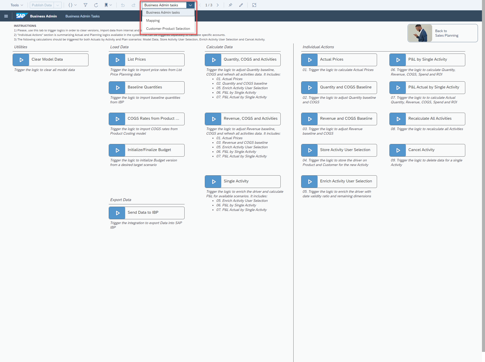

    - Move your mouse to the top of the page and wait for the navigation menu to appear.
    - Click on **Mapping** to open **Spend Type - Tactic - GL Account Mapping** page.

6. Define mapping

    <!-- border; size:540px -->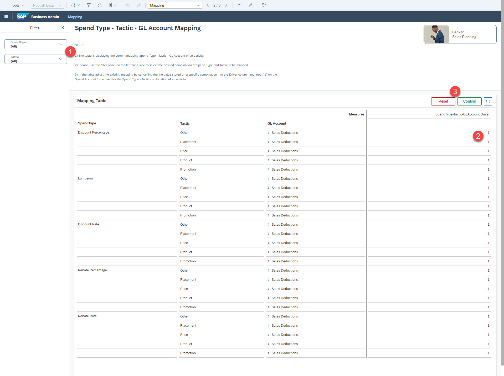

    - This tab allows for the review and adjustment of the existing mapping between `SpendType`, `Tactic` and `GL Account` of a specific activity. It enables you to drive the objectives of your organization by prioritizing on certain combinations.
    - The table displays the current mapping Spend Type - Tactic - GL Account of an activity.
    - Use the filter panel on the left-hand side to select the desired combination of Spend Type and Tactic to be mapped.
    - Adjust the mapping in the table by cancelling the value stored on a specific combination into the Driver column and input "1" on the Spend Account to be used for the Spend Type - Tactic combination of an activity.

    <!-- border; size:540px -->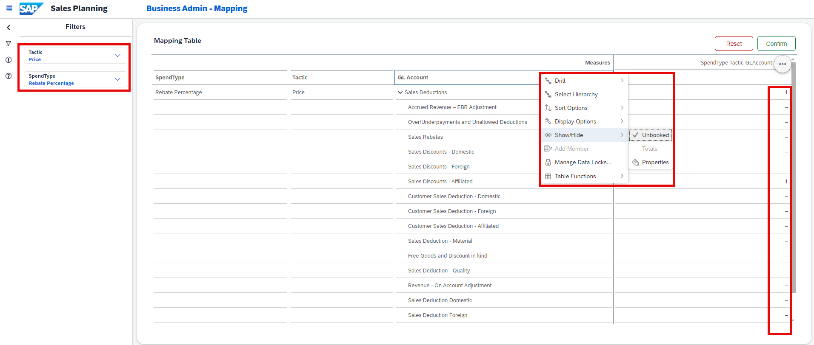

    - For example, apply a filter in the left panel on `SpendType` on `Rebate Percentage` and on `Tactic` on `Price`. The main table will filter down to a single row.
    - Right-click on `GL Account`.
    - Click on **Show/Hide** and check **Unbooked**.
    - You can then drill down on `Sales Deduction` and edit the driver column to add a "1" next to the desired G/L Account for the `SpendType`-`Tactic`-combination.
    - Confirm or Reset the adjustment through the dedicated buttons.

7. Open **Customer-Product selection** from the Overview page

    You can now switch to the Customer-Product selection tab after you are done with your mapping.

    <!-- border; size:540px -->

    - Go back to the **Sales Planning Overview Page** (`SAP_SD_SalesPlanning_Overview`).
    - Click on **Customer-Product selection for Activities** in the Configure section in order to land on the related tab of the Admin Page.

8. Open the **Customer-Product selection** page

    <!-- border; size:540px -->

    - Move your mouse to the top of the page and wait for the navigation menu to appear.
    - Click on **Customer-Product selection** to open **Customer-Product selection for Activities** page.
    - This tab allows for the review of the original customer product combination selected by the user while creating a new activity.
    - The report is used for debugging purpose and should not be relevant by now. But in case anything goes amiss for customer, product and activity combinations you can double check on this report.

### Global Sales Budget Planning

As you have now cleared the planning scenario, imported prices, COGS and volumes and mapped the different dimension combinations, you can continue with the actual planning activities.
In the next steps the Sales Planning stories of this content package are introduced.

1. Open **Global Sales Budget Planning** (`SAP_SD_SalesBudgetPlanningGlobal`) from the Sales Planning Overview Page

    <!-- border; size:540px -->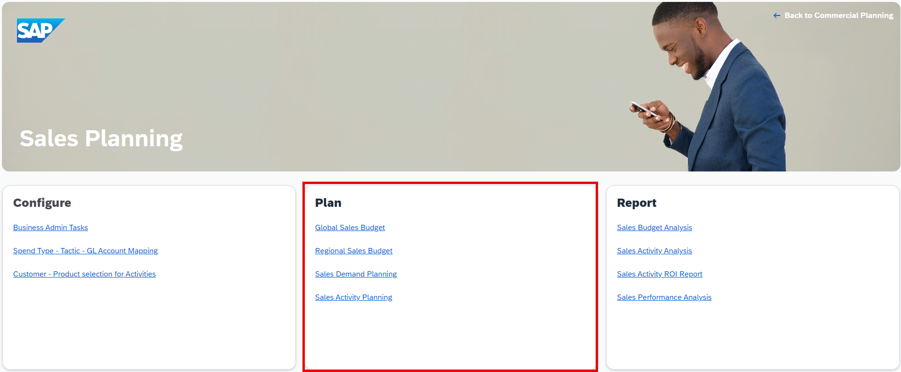

    - Go to the **Sales Planning Overview Page** (`SAP_SD_SalesPlanning_Overview`).
    - Click on **Global Sales Budget** in the Plan section in order to land on the **Global Sales Budget Planning** (`SAP_SD_SalesBudgetPlanningGlobal`) application.

2. Understand the application

    <!-- border; size:540px -->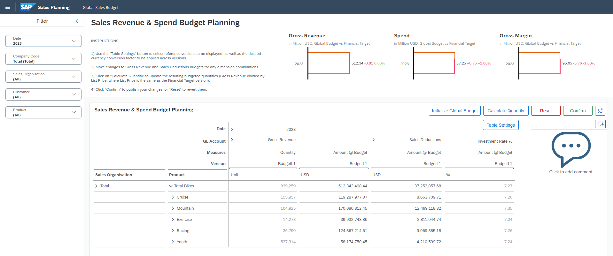

    - The application consists of four sections.
    - In the middle at the top, you can read the instructions to understand the workflow of this application.
    - On the left-hand side of the page, you can find the filter panel, that allows you to select the desired combination of Date, Company Code, Sales Organization, Customer and Product that will be reflected on the charts and the planning table.
    - In the top right section, you can find charts that show Global Budget Gross Revenue, Spend and Gross Margin in the Global currency for the selected year. The amounts of the **Global Budget** (`BudgetL1`) version are compared to the **Financial Target** (`FinancialTarget`) version displayed as variance.
    - In the lower section, you can find the planning table where you can adjust Gross Revenue and Spend and recalculate the Quantity. On the right side of the table a commentary widget gives you and your colleagues the chance to collaborate. You can add comments during the planning phase.

3. **Initialization** of the Global Budget

    <!-- border; size:540px -->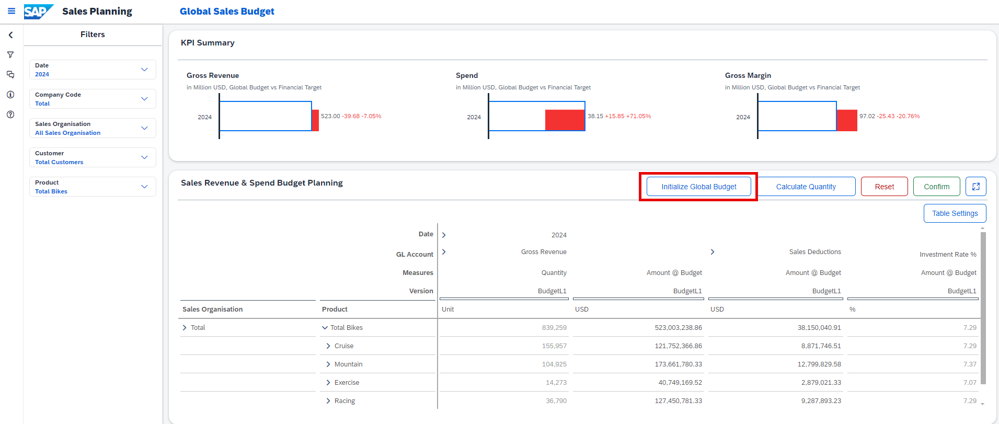

    - Click on the button **Initialize Global Budget** to copy data from **Financial Target** (`FinancialTarget`) version to **Global Budget** (`BudgetL1`) version. It clears all data on the **Global Budget** (`BudgetL1`) version for the selected time range and copies the Financial Target data for the selected time range.

4. Select **Initialization Year**

    <!-- border; size:540px -->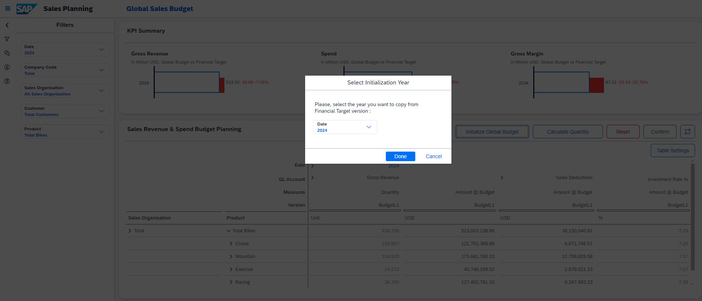

    >INFORMATION:
    >
    Ignore the warning triangle in the pop-up **Select Initialization Year** which warns you that the input control widget is not connected to any other widget. Technically, the warning is correct and comes by default for an input control without a connection to another widget in the story. However, this input control widget serves as year selector for the to be executed data action and has its impact as you will see in a second.

    - Select a year to copy the data from the **Financial Target** (`FinancialTarget`) version to your **Global Budget** (`BudgetL1`) version and click **Done**.
    - Note the yellow highlighting in your table as the values have changed

5. **Plan the Global Budget** by adjusting **Table Settings**

    <!-- border; size:540px -->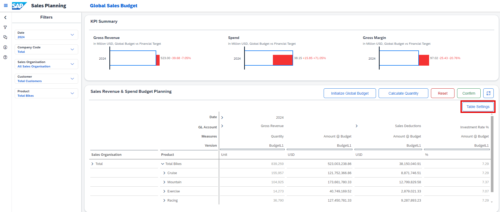

    - Click on **Table Settings**.

    <!-- border; size:540px -->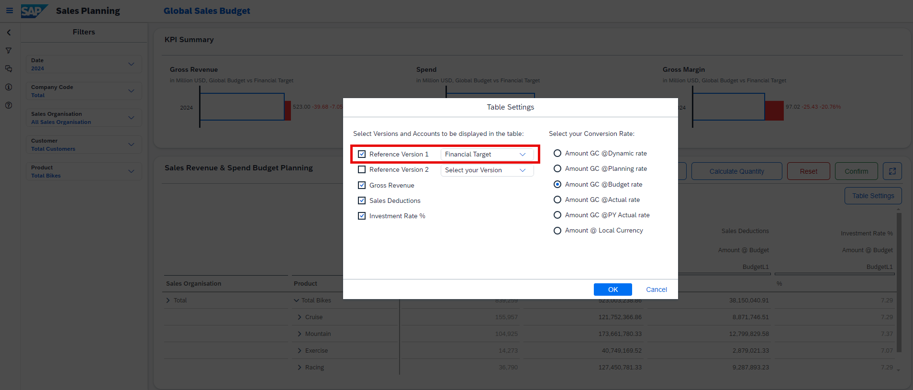

    - Check the **Reference Version 1** and select the **Financial Target** in the drop down menu.
    - With this change you can compare the difference between your planned and original amount for gross revenue and sales deduction, which you will change in the next steps.
    - This makes it more transparent for you to understand the variance in the charts, which will grow based on your changes on the BudgetL1 version.
    - Click on **OK** once you are done.
    - Note that the table has a Financial Target column for each GL Account and Measure.

    <!-- border; size:540px -->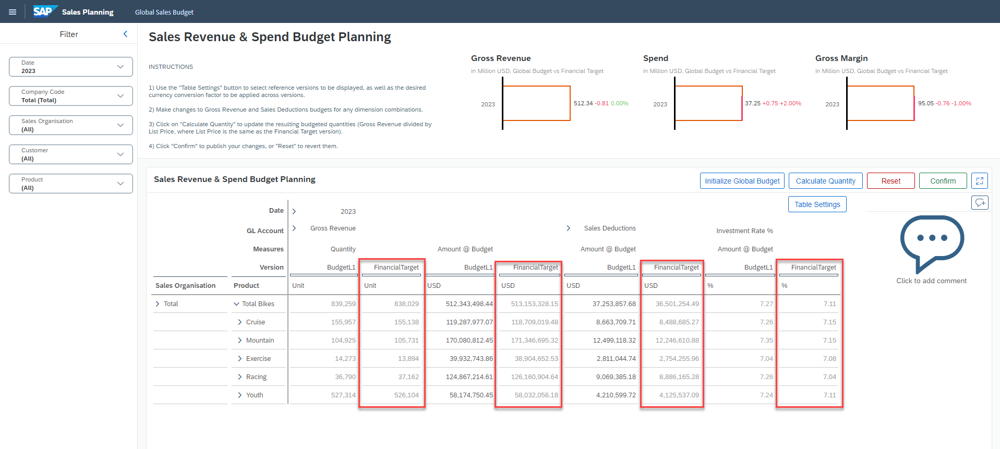

6. Plan **Gross Revenue**

    <!-- border; size:540px -->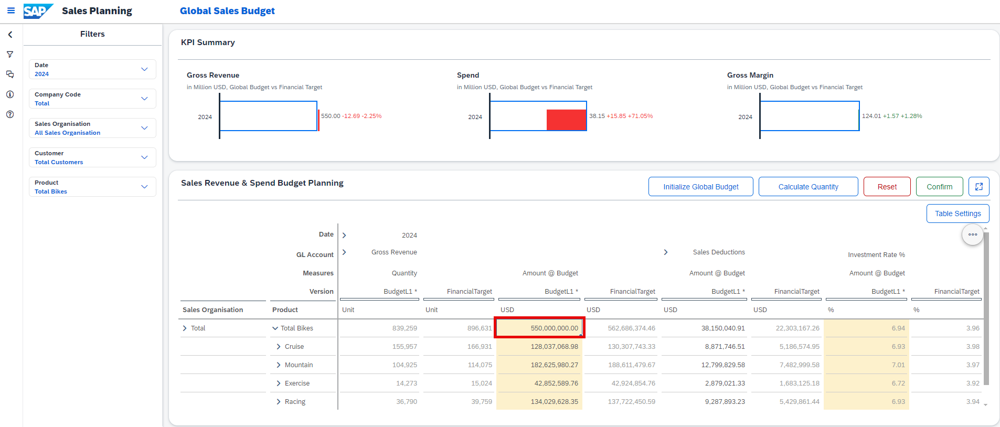

    - You are a global sales leader who wants to increase the sales revenue by a lot.
    - Change the filter on the left side to the year you want to plan and show all data for Company Code, Sales Organization, Customer and Product.
    - Click in the cell of line **Total** as **Sales Organization**, **Total Bikes** as **Product** and of column **2024** as **Date**, **Gross Revenue** as **GL Account**, **Amount @ Budget** as Measures and **BudgetL1** as **Version**.
    - Increase the value by roughly **+7%**. In this example you see the value of **550.000.000,00 USD**.
    - Notice the change happening to the charts at the top and in the table highlighted yellow, once you press enter. The variance **Global Budget (L1) versus Financial Target** for **Gross Revenue** and **Gross Margin** increases and is therefore colored green. The **GL Account** **Investment Rate %** reacts on your change as well.

7. Plan **Sales Deduction**

    <!-- border; size:540px -->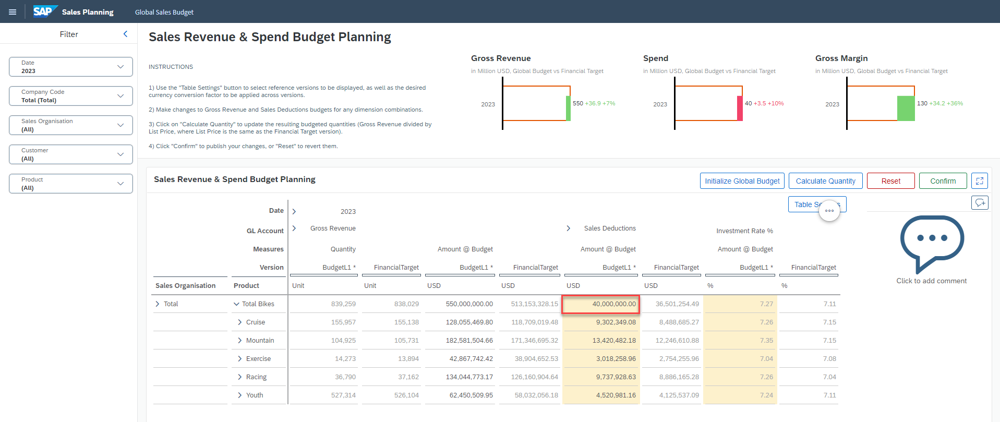

    - In order to achieve the increase in revenue you are willing to increase the spend budget by an even bigger amount.
    - Click in the cell of line **Total** as **Sales Organization**, **Total Bikes** as **Product** and of column **2024** as **Date**, **Sales Deduction** as **GL Account**, **Amount @ Budget** as Measures and **BudgetL1** as **Version**.
    - Increase the value by roughly **+10%**. In this example you see the value of **40.000.000,00 USD**.
    - Notice the change happening to the charts at the top and in the table highlighted yellow, once you press enter. The variance **Global Budget (L1) versus Financial Target** for **Spend** increases and is therefore colored red. Once again, the **GL Account** **Investment Rate %** reacts on your change.

8. **Calculate Quantity**

    <!-- border; size:540px -->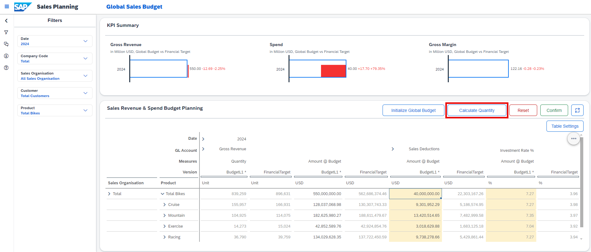

    - The measure **Quantity** has not reacted at all on your changes. You can take this step once you are done with your planning of **Gross Revenue** and **Sales Deduction**.
    - Click on the button **Calculate Quantity**.
    - The quantity units increase according to the changes you made in the previous steps as you can see in the highlighted yellow area.

9. **Publish** your version **Global Budget** (`BudgetL1`)

    <!-- border; size:540px -->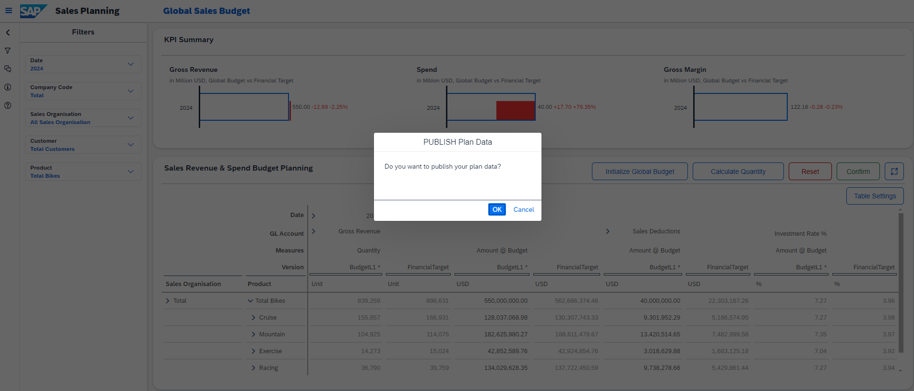

    - You adjusted the amount of **Gross Revenue** and **Sales Deduction** and the **Investment Rate %** and **Quantity** units followed suit.
    - Now it is time to publish your new planned data as version **Global Budget** (`BudgetL1`).
    - Check your data one last time.
    - Click on the button **Confirm**.
    - Confirm your intentions by pressing **OK**.

    You have successfully planned your Global Sales Revenue and Spend Budget.

### Regional Sales Budget Planning

1. Open **Regional Sales Budget Planning** (`SAP_SD_SalesBudgetPlanningRegional`) from the Sales Planning Overview Page

    <!-- border; size:540px -->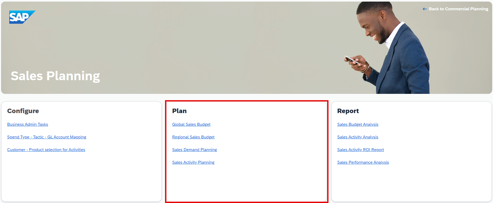

    - Go to the **Sales Planning Overview Page** (`SAP_SD_SalesPlanning_Overview`).
    - Click on **Regional Sales Budget** in the Plan section in order to land on the **Regional Sales Budget Planning** (`SAP_SD_SalesBudgetPlanningRegional`) application.

2. Understand the application

    <!-- border; size:540px -->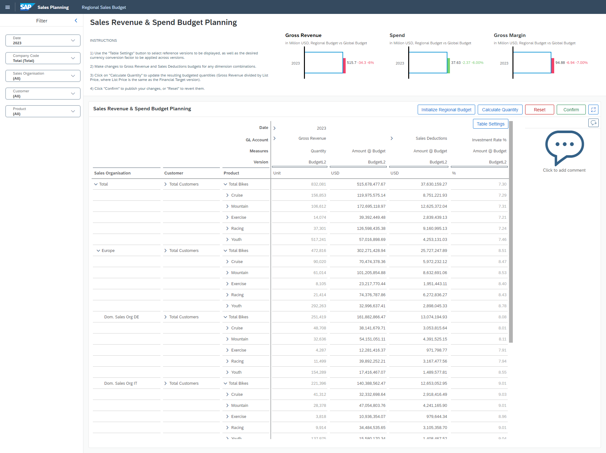

    - The application consists of four sections.
    - In the middle at the top, you can read the instructions to understand the workflow of this application.
    - On the left-hand side of the page, you can find the filter panel, that allows you to select the desired combination of Date, Company Code, Sales Organization, Customer and Product that will be reflected on the charts and the planning table.
    - In the top right section, you can find charts that show Global Budget Gross Revenue, Spend and Gross Margin in the currency of the selected company code for the selected year. The amounts of the **Regional Budget** (`BudgetL2`) version are compared to the **Global Budget** (`BudgetL1`) displayed as variance.
    - In the lower section, you can find the planning table where you can adjust Gross Revenue and Spend and recalculate the Quantity. On the right side of the table a commentary widget gives you and your colleagues the chance to collaborate. You can add comments during the planning phase.

3. **Initialization** of the Regional Budget

    <!-- border; size:540px -->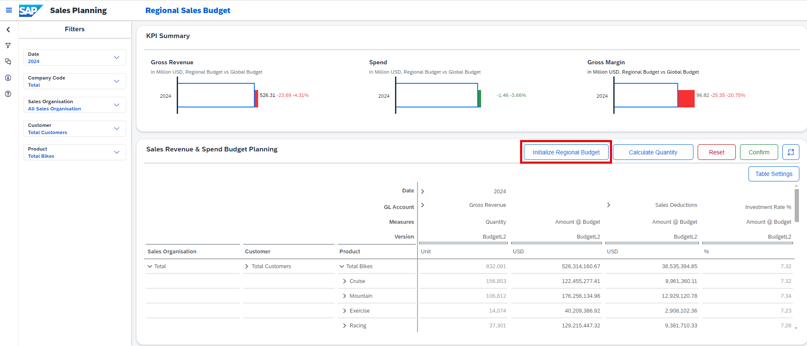

    - Click on the button **Initialize Regional Budget** to copy data from **Global Budget** (`BudgetL1`) version to **Regional Budget** (`BudgetL2`) version. It clears all data on the Regional Budget (`BudgetL2`) version for the selected time range and copies the **Global Budget** (`BudgetL1`) data for the selected time range.

4. Select **Initialization Year**

    <!-- border; size:540px -->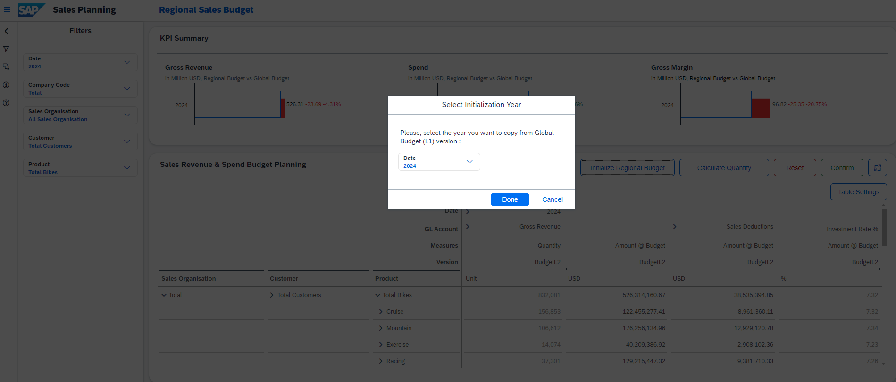

    >INFORMATION:
    >
    Ignore the warning triangle in the pop-up **Select Initialization Year** which warns you that the input control widget is not connected to any other widget. Technically, the warning is correct and comes by default for an input control without a connection to another widget in the story. However, this input control widget serves as year selector for the to be executed data action and has its impact as you will see in a second.

    - Select a year to copy the data from the **Global Budget** (`BudgetL1`) version to your **Regional Budget** (`BudgetL2`) version and click **Done**.
    - Note the yellow highlighting in your table as the values have changed.

5. **Plan** the Regional Budget by adjusting **Table Settings**

    <!-- border; size:540px -->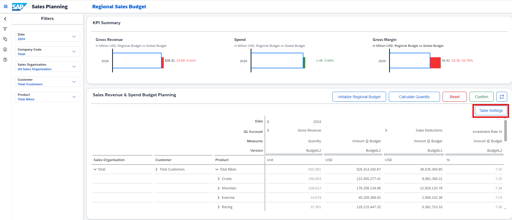

    - Click on **Table Settings**.

    <!-- border; size:540px -->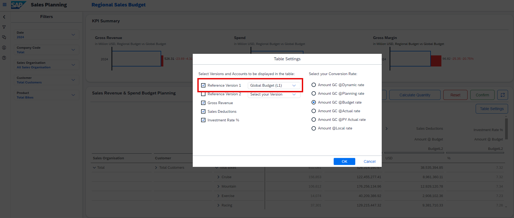

    - Check the **Reference Version 1** and select the **Global Budget** (`BudgetL1`) in the drop down menu.
    - With this change you can compare the difference between your planned and original amount for gross revenue and sales deduction, which you will change in the next steps.
    - This makes it more transparent for you to understand the variance in the charts, which will grow based on your changes on the **Regional Budget** (`BudgetL2`) version.
    - Click on **OK** once you are done.
    - Note that the table has a **Global Budget** column for each GL Account and Measure.

    <!-- border; size:540px -->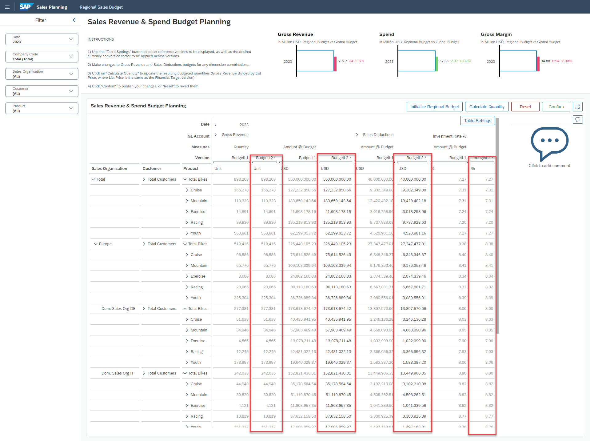

6. Plan **Gross Revenue**

    <!-- border; size:540px -->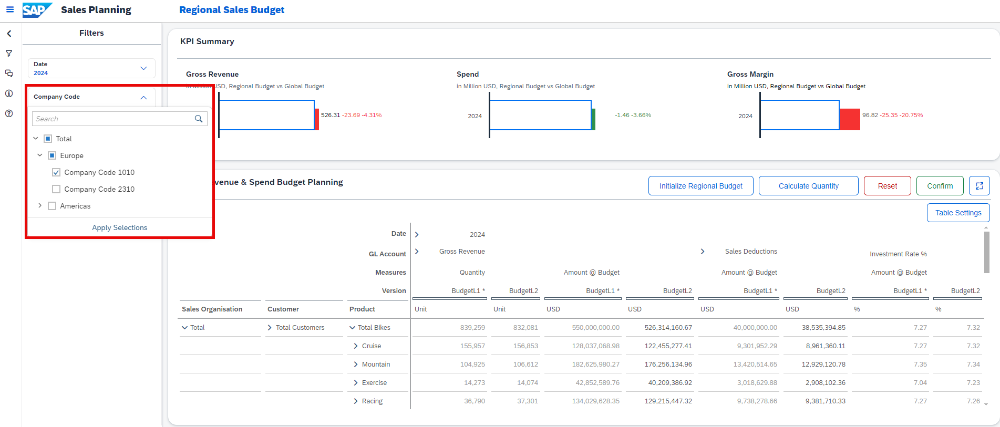

    - Change the filter on the left side to the year you want to plan and show all data for Sales Organization, Customer and Product.
    - You can assume that you are now in the role of a regional sales leader for Germany. Filter on the **company code 1010** to only display your data by selecting the input control, selecting the **company code 1010** and clicking **Apply Selection**.
    - All other Sales Organizations besides the german one are filtered out.

    <!-- border; size:540px -->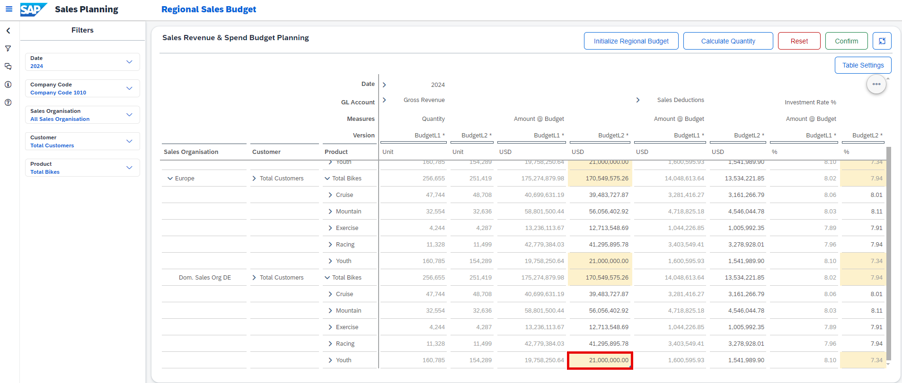

    - You know with your market knowledge in your region that with the given spend budget for your products for young people, you can generate more sales revenue than currently planned. That is why you are going to increase the sales revenue.
    - Click in the cell of line **Dom. Sales Org DE** as **Sales Organization**, **Total Customers** as **Customer**, **Youth** as **Product** and of column **2024** as **Date**, **Gross Revenue** as **GL Account**, **Amount @ Budget** as Measures and **BudgetL2** as **Version**.
    - Increase the value by roughly **+10%**. In this example you see the value of **21.000.000,00 USD**.
    - Notice the change happening to the charts at the top and in the table highlighted yellow, once you press enter. The variance **Regional Budget versus Global Budget** for **Gross Revenue** and **Gross Margin** increases and is therefore colored green. The **GL Account** **Investment Rate %** reacts on your change as well.

7. Plan **Sales Deduction**

    <!-- border; size:540px -->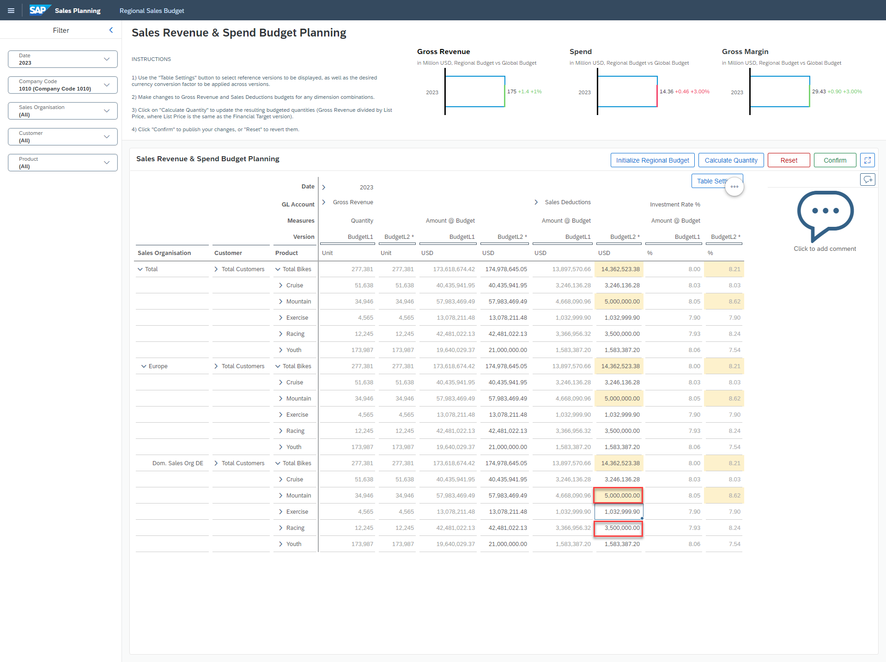

    - However, the global sales leader wants you to achieve higher revenue for mountain and racing bikes than you deem possible with the current spend budget. Therefore, you are going to increase it.
    - Click in the cell of line **Total** as **Dom. Sales Org DE**, **Total Customers** as **Customer**, **Mountain** as **Product** and of column **2024** as **Date**, **Sales Deduction** as **GL Account**, **Amount @ Budget** as Measures and **BudgetL2** as **Version**.
    - Increase the value to **5.000.000,00 USD**.
    - Click in the cell of line **Dom. Sales Org DE** as **Sales Organisation**, **Total Customers** as **Customer**, **Racing** as **Product** and of column **2024** as **Date**, **Sales Deduction** as **GL Account**, **Amount @ Budget** as Measures and **BudgetL2** as **Version**.
    - Increase the value to **3.500.000,00 USD**.
    - Notice the changes happening to the charts at the top and in the table highlighted yellow, once you press enter. The variance **Regional Budget versus Global Budget** for **Spend** increases and is therefore colored red. Once again, the **GL Account** **Investment Rate %** reacts on your change.

8. **Calculate Quantity**

    <!-- border; size:540px -->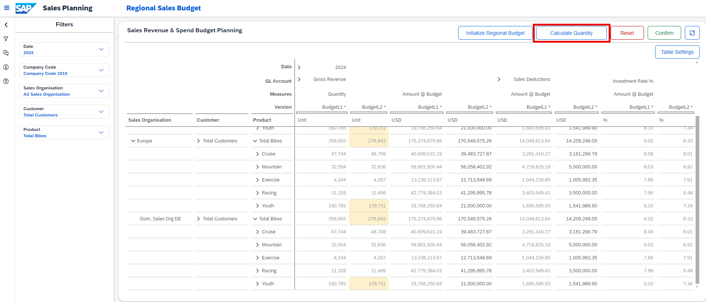

    - The measure **Quantity** has not reacted at all on your changes. You can take this step once you are done with your planning of **Gross Revenue** and **Sales Deduction**.
    - Click on the button **Calculate Quantity**.
    - The quantity units increase according to the changes you made in the previous steps as you can see in the highlighted yellow area.

9. **Publish** your version Regional Budget (L2)

    <!-- border; size:540px -->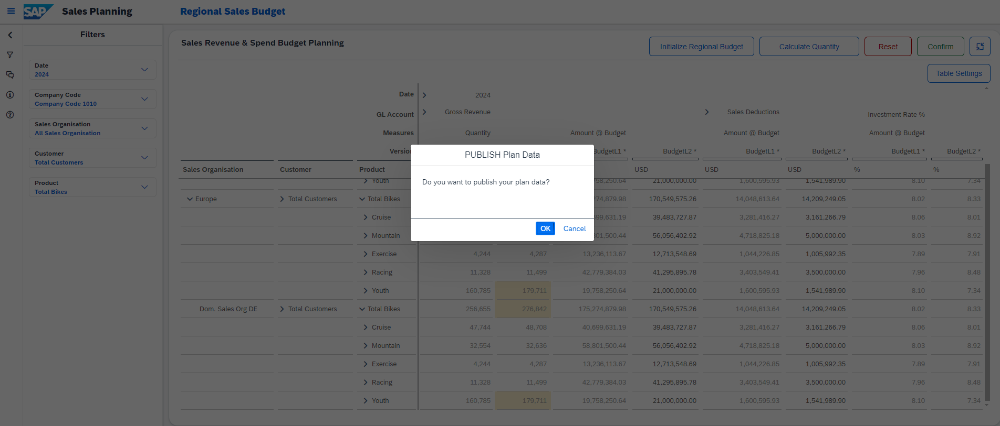

    - You adjusted the amount of **Gross Revenue** and **Sales Deduction** and the **Investment Rate %** and **Quantity** units followed suit.
    - Now it is time to publish your new planned data as version Regional Budget (L2) for Germany.
    - Check your data one last time.
    - Click on the button **Confirm**.
    - Confirm your intentions by pressing **OK**.

    You have successfully planned your Regional Sales Revenue and Spend Budget.

### Sales Demand Planning

In this next section, you will be planning the sales demand for year 2024 based on your analysis of sales as well as consumer trends and historical sales, which your organization has already conducted. You will now play the role of a Sales Demand Planner for Germany.

1. Open **Sales Demand Planning** (`SAP_SD_SalesDemandPlanning`) from the Sales Planning Overview Page

    <!-- border; size:540px -->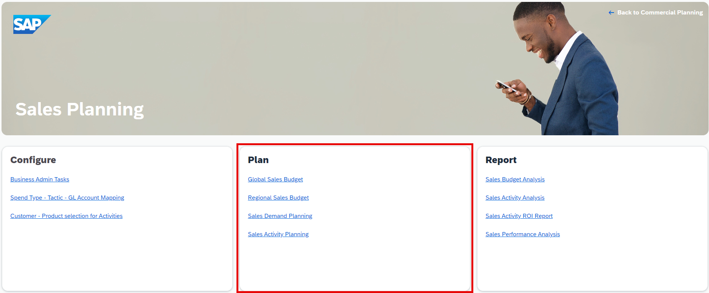

    - Go to the **Sales Planning Overview Page** (`SAP_SD_SalesPlanning_Overview`).
    - Click on **Sales Demand Planning** in the Plan section in order to land on the **Sales Demand Planning** (`SAP_SD_SalesDemandPlanning`) application.

2. Understand the application

    <!-- border; size:540px -->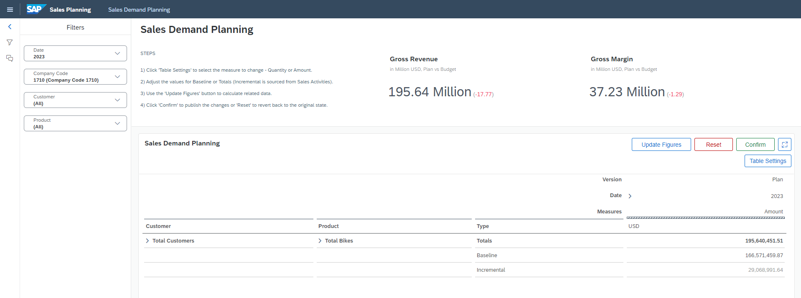

    - The application consists of four sections.
    - In the middle at the top, you can read the instructions to understand the workflow of this application.
    - On the left-hand side of the page, you can find the filter panel, that allows you to select the desired combination of Date, Company Code, Customer and Product that will be reflected on the numeric point indicators and the planning table. You can also find the option to add comments on the left hand side.
    - In the top right section, you can find numeric point indicators that show Gross Revenue and Gross Margin. The amounts of the **Plan** are compared to the **Budget** version displayed as variance.
    - In the lower section, you can find the planning table where you can adjust Gross Revenue or Quantity and recalculate respectively.

3. **Plan** the Sales Demand by filtering your data

    <!-- border; size:540px -->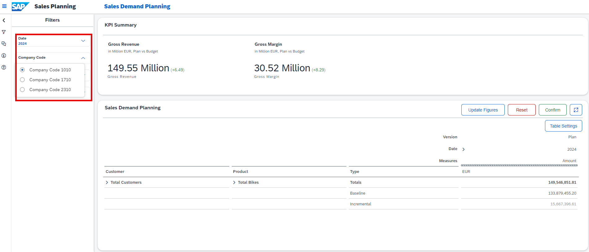

    - You want to plan the demand for the **year 2024** and the German organization with **Company Code 1010**.
    - Filter your year and company code with the input controls on the left accordingly.
    - The numeric point indicators and table display the relevant data.

4. Adjust **Table Settings**

    <!-- border; size:540px -->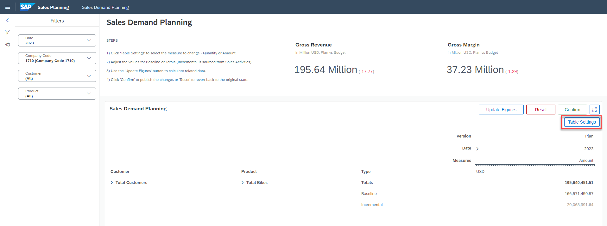

    - Click on **Table Settings**.

    <!-- border; size:540px -->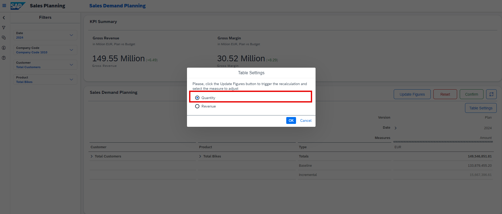

    - Select **Quantity** as option in the radio button group.
    - Click on **OK**.
    - You are now able to plan your sales demand from the quantity perspective.

5. Plan **Quantity**

    <!-- border; size:540px -->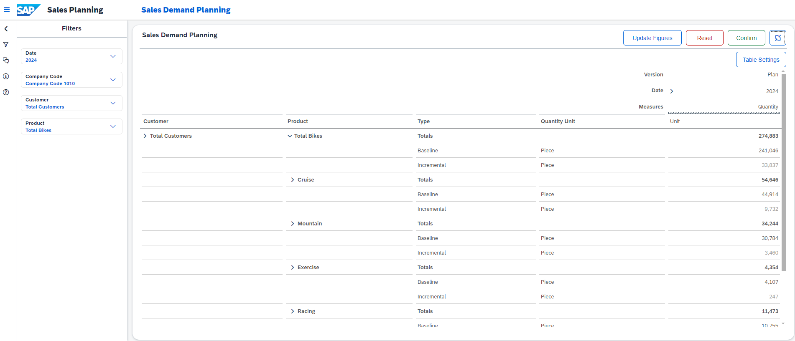

    - In your planning table drill down one product level under **Total Bikes**.
    - You can now adjust the baseline quantity of each product line, but you cannot change the incremental quantity directly.

    >INFORMATION:
    >
    Incremental quantities refer to the amount of products sold during a specific period of time that exceeds the baseline quantity of your business. This difference is typically attributed to the implementation of a specific promotional sales activity. The concept of incremental quantity can also be used by you as a key performance indicator (KPI) to assess the effectiveness of marketing efforts.

    - Click in the cell of line **Total Customers** as **Customer**, **Cruise** as **Product**, **Baseline** as **Type**, **Piece** as **Quantity Unit** and of column **Plan** as **Version**, **2024** as **Date** and **Quantity** as **Measure**.
    - Increase the value to **47.000**, which is roughly +5% as you expect an increase.
    - Click in the cell of line **Total Customers** as **Customer**, **Exercise** as **Product**, **Baseline** as **Type**, **Piece** as **Quantity Unit** and of column **Plan** as **Version**, **2024** as **Date** and **Quantity** as **Measure**.
    - Decrease the value to **4000**, which is roughly -3% as you expect a decrease.
    - Notice the changes happening to the numeric point indicator at the top and in the table highlighted yellow, once you press enter.

         <!-- border; size:540px -->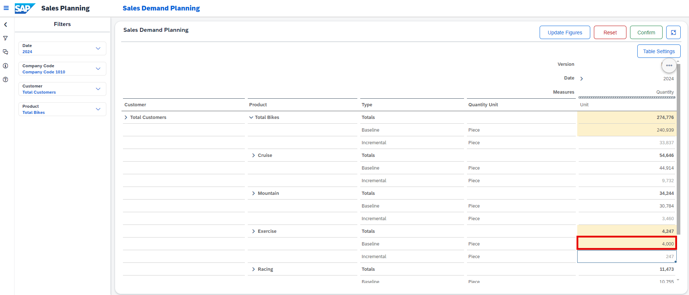

6. **Update Figures**

    <!-- border; size:540px -->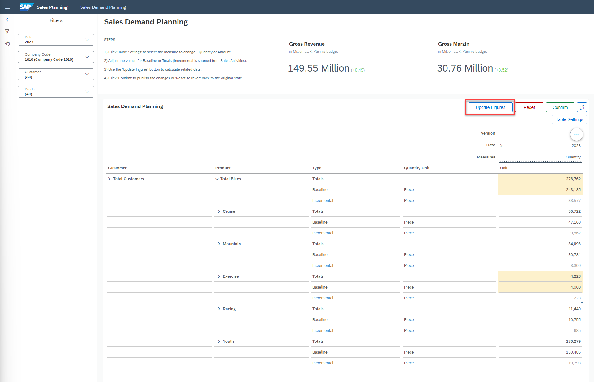

    - Once you are done with your sales demand plan, you want to update all depending figures by pressing the button **Update Figures**.
    - By this action you delete existing baseline quantities and cost of goods sold for the **Plan** version. Then it recalculates them based on the ratio between amount and price on revenue GL Account and by multiplying quantities by the respective costs of goods sold rates respectively. As a subsequent step this refreshes the calculations of all existing activities to ensure return of investment and required metrics are up to date.
    - After completion you can switch back to the revenue view with the button **Table Settings** to see the impact your change had.

7. **Publish** your version Plan

    <!-- border; size:540px -->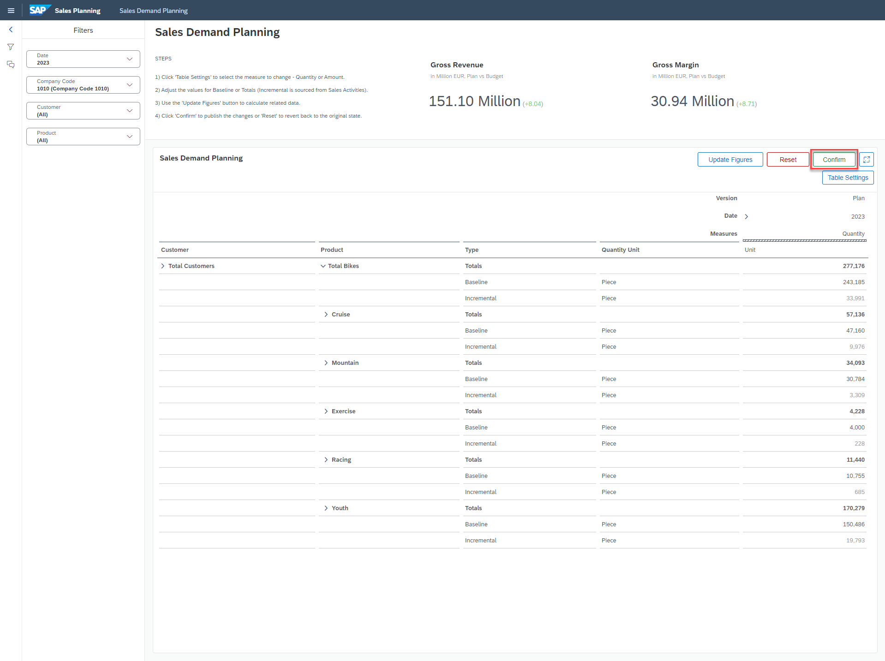

    - You planned the **Quantity** for the products **Cruise** and **Exercise** and recalculated the depending measures.
    - Now it is time to publish your new planned data as version **Plan**.
    - Check your data one last time.
    - Click on the button **Confirm**.
    - Confirm your intentions by pressing **OK**.

    You have successfully planned your Sales Demand.

### Sales Activity Planning

Now you are ready to perform the tasks of a sales activity manager.  You will create a new sales activity for your region and approve an existing sales activity.

1. Open **Sales Activity Planning** (`SAP_SD_SalesActivityPlanning`) from the Sales Planning Overview Page

    <!-- border; size:540px -->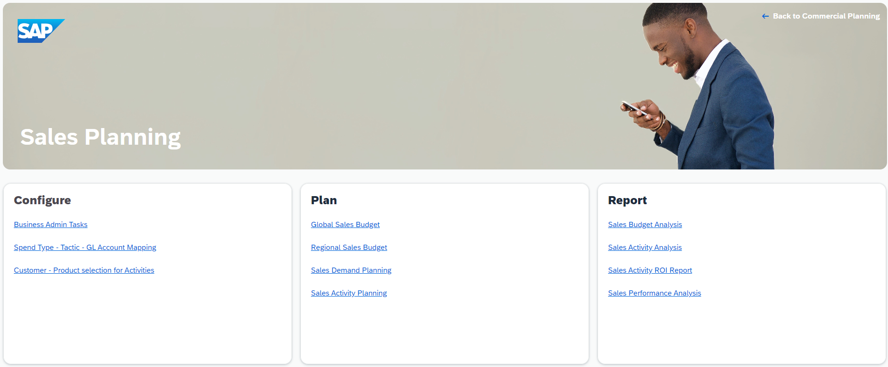

    - Go to the **Sales Planning Overview Page** (`SAP_SD_SalesPlanning_Overview`).
    - Click on **Sales Activity Planning** in the Plan section in order to land on the **Sales Activity Planning** (`SAP_SD_SalesActivityPlanning`) application.

2. Understand the application

    <!-- border; size:540px -->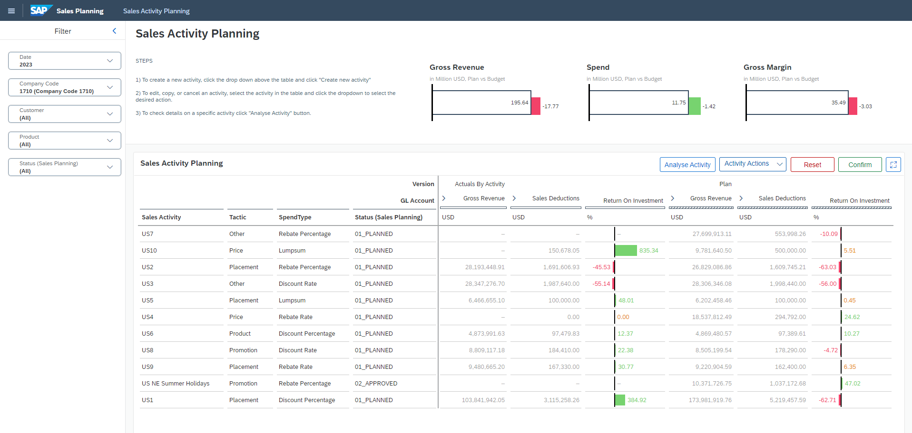

    - The application consists of four sections.
    - In the middle at the top, you can read the instructions to understand the workflow of this application.
    - On the left-hand side of the page, you can find the filter panel, that allows you to select the desired combination of Date, Company Code, Customer, Product and Status (Sales Planning) that will be reflected on the charts and the planning table.
    - In the top right section, you can find charts that show Gross Revenue, Spend and Gross Margin. The amounts of the **Plan** are compared to the **Budget** version displayed as variance.
    - In the lower section, you can find the planning table where you can create, edit, copy and cancel sales activities and see their **Return of Investment**.

    > Information:
    >
    You cannot calculate the **Return of Investment** based on the measure you can see on the screen. You need the measure `Cost of Goods Sold` to calculate it, but he table does not display it. Additionally, the measure amount for `Gross Revenue` is the sum of activity incremental amount and activity prorated baseline amount.
    However, the **Return of Investment** is calculated based on incremental amounts generated by sales activities. The **Return on Investment** formula is as following:
    `Return on Investment = (Incremental Gross Sales - Incremental Cost of Goods Sold - Sales Deductions)/Sales Deductions`
    If you want to confirm the **Return of Investment** values you can switch to the **Sales Activity Return on Investment Report** (`SAP_SD_SalesActivityROI`) application and read the respective chapter in this guide to learn more about **Return of Investment**. Note, the **Return of Investment** reported in **Sales Activity Planning** (`SAP_SD_SalesActivityPlanning`) and **Sales Activity Return on Investment Report** (`SAP_SD_SalesActivityROI`) are consistent.

3. **Manage** your activities by filtering your data

    <!-- border; size:540px -->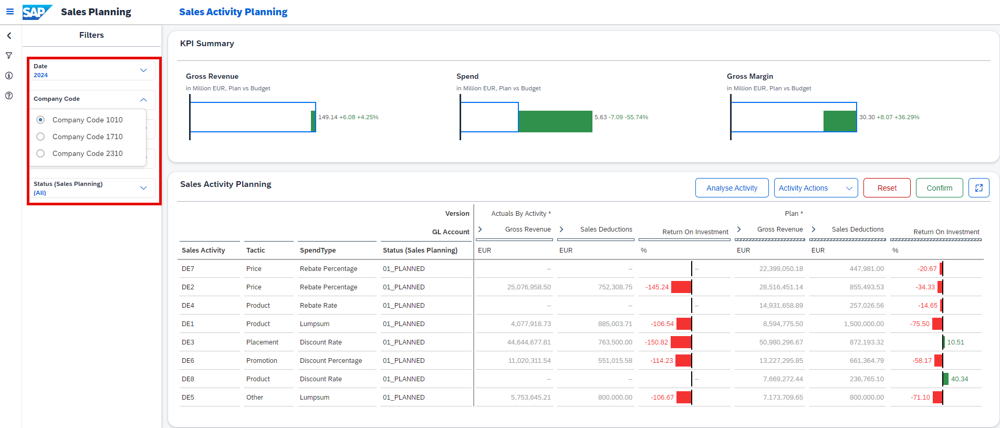

    - You want to manage your activities for the **year 2024** and the German organization with **Company Code 1010**.
    - Filter your year and company code with the input controls on the left accordingly.
    - The charts and table display the relevant data.

4. Create a new **Sales Activity**

    You are creating a **Sales Activity** for large cycles, specifically cruise bikes, for the Western Europe customers for the second half of the year 2024. You are willing to spend a lump sum of USD 800000 and expect an uplift of 20% in return.

    <!-- border; size:540px -->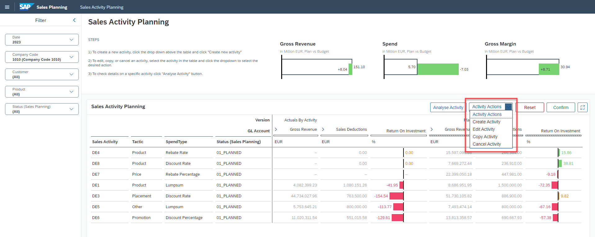

    - Click on the button **Activity Actions** and select **Create Activity** in the drop down menu.

    <!-- border; size:540px -->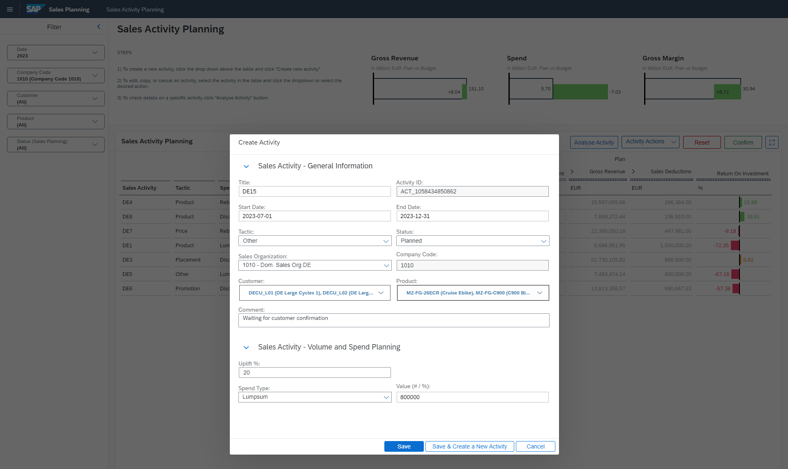

    - Fill in the popup with the following data:

    | Field             | Content       |
    |---             |---          |
    | `Title`           | `DE15`       |
    | `Activity ID`        | `auto-generated` |
    | `Start Date`         | `2024-07-01`     |
    | `End Date`           | `2024-12-31`     |
    | `Tactic`             | `Product`        |
    | `Status`             | `Planned`        |
    | `Sales Organization` | `1010 - Dom. Sales Org DE` |
    | `Company Code`       | `1010`           |
    | `Customer`           | `DECU_L01 (DE Large Cycles 1), DECU_L02 (DE Large Cycles 2), DECU_L03 (DE Large Cycles 3), DECU_L04 (DE Large Cycles 4), DECU_L05 (DE Large Cycles 5), DECU_L06 (DE Large Cycles 6), DECU_L07 (DE Large Cycles 7), DECU_L08 (DE Large Cycles 8), DECU_L09 (DE Large Cycles 9), DECU_L010 (DE Large Cycles 10)` |
    | `Product`            | `MZ-FG-26ECR (cruise Ebike), MZ-FG-C900 (C900 BIKE), MZ-FG-C950 (C950 BIKE), MZ-FG-C990 (C990 BIKE)` |
    | `Comment`            | `Waiting for customer confirmation` |
    | `Uplift %`          | `20`             |
    | `Spend Type`         | `Lumpsum`        |
    | `Value (# / % )`     | `800000`        |

    - Click on **Save**

    <!-- border; size:540px -->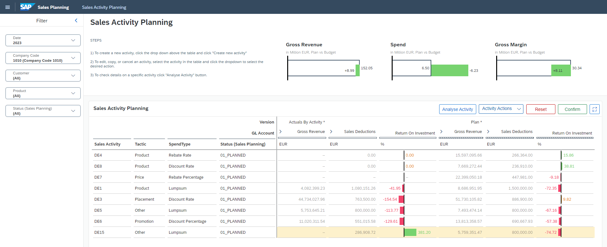

    - Notice the added activity in the table highlighted in yellow.

5. Approve a **Sales Activity**

    <!-- border; size:540px -->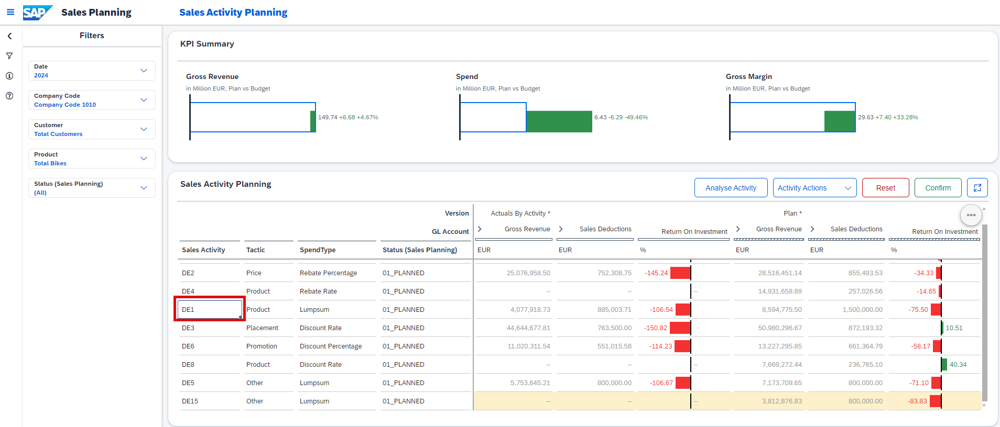

    - Select the **Sales Activity DE1** in your table.

    <!-- border; size:540px -->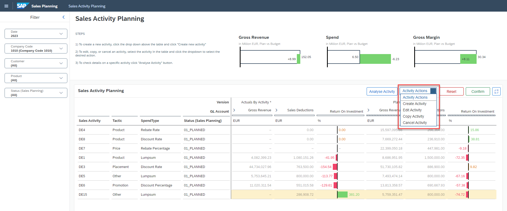

    - Click on the button **Activity Actions** and select **Edit Activity**.

    <!-- border; size:540px -->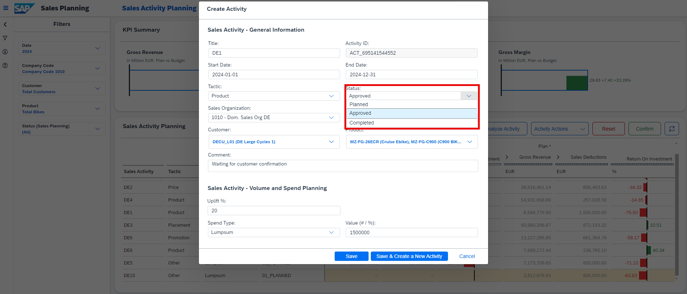

    - A popup for the selected **Sales Activity** opens.
    - Click on the **Status** dropdown menu and select **Approved**
    - Remove the comment "Waiting for customer confirmation"
    - Click on the **Save** button.

    <!-- border; size:540px -->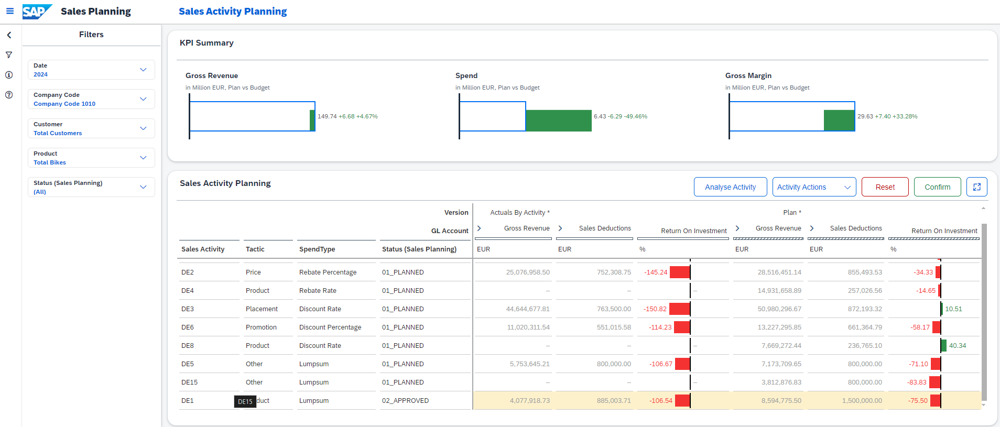

    - Notice the changed activity in the table highlighted in yellow.

6. **Publish** your version Plan

    <!-- border; size:540px -->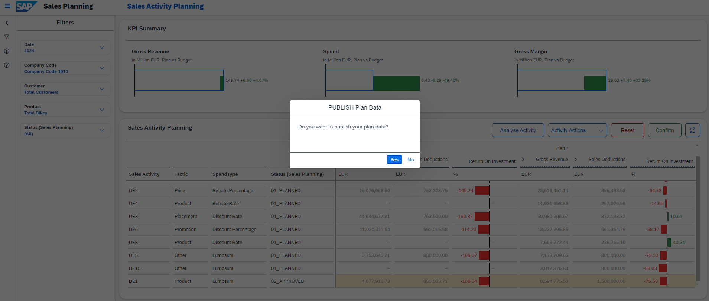

    - You created a new **Sales Activity** and approved another one.
    - Now it is time to publish your new activities.
    - Check your data one last time.
    - Click on the button **Confirm**.
    - Confirm your intentions by pressing **Yes**.

    You have successfully worked with Sales Activities.

### Sales Budget Analysis Report

The **Sales Budget Analysis Report** (`SAP_SD_SalesBudgetAnalysis`) provides an overview of revenue, spend, and quantity data, allowing users to analyze sales performance based on various filters and compare different versions over time.

1. Open **Sales Budget Analysis Report** (`SAP_SD_SalesBudgetAnalysis`) from the Sales Planning Overview Page

    <!-- border; size:540px -->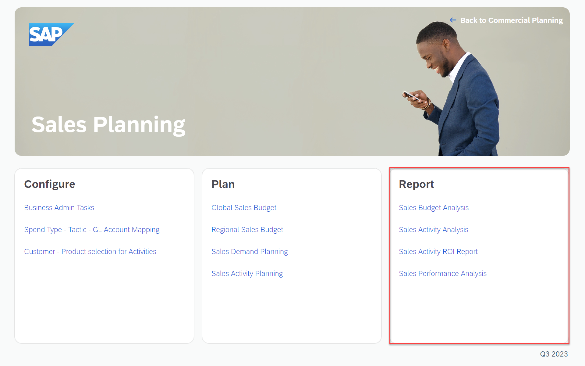

    - Go to the **Sales Planning Overview Page** (`SAP_SD_SalesPlanning_Overview`).
    - Click on **Sales Budget Analysis** in the Report section in order to land on the **Sales Budget Analysis Report** (`SAP_SD_SalesBudgetAnalysis`) application.

2. Understand the application

    <!-- border; size:540px -->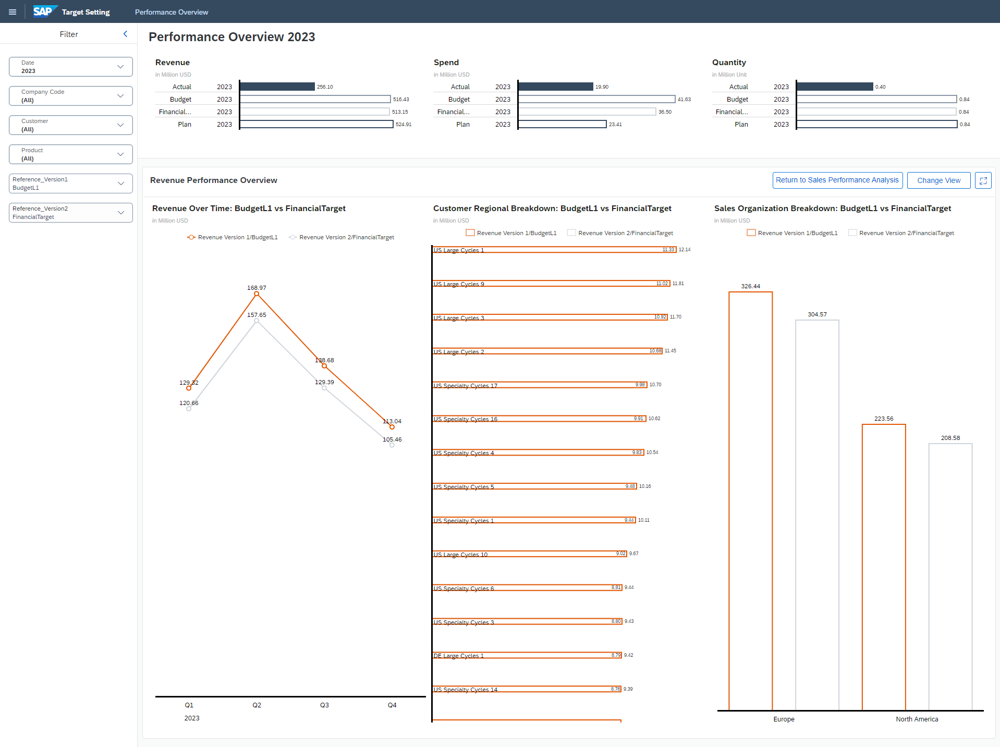

    - The application consists of three sections.
    - On the left-hand side of the page, you can find the filter panel, that allows you to select the desired combination of Date, Company Code, Customer, Product and two reference versions that will be reflected on the charts.
    - In the top section, you can find charts that show Revenue, Spend and Quantity for the different versions for the selected time frame.
    - In the lower section, you can switch views from your **Revenue Performance Overview** to **Trade Budget Performance Overview** or **Quantity Performance Overview**.

    <!-- border; size:540px -->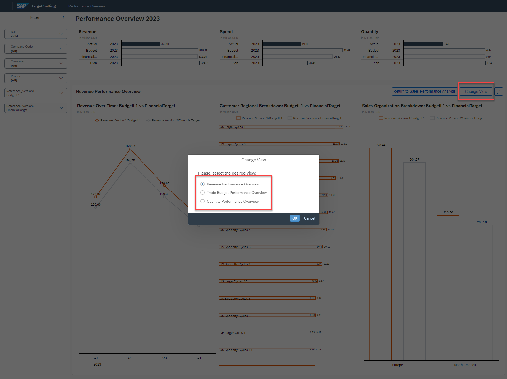

    - Click on the button **Change View** on the right side and confirm your selection by pressing **OK** in the dialog to switch views.

3. **Revenue Performance Overview**

    <!-- border; size:540px -->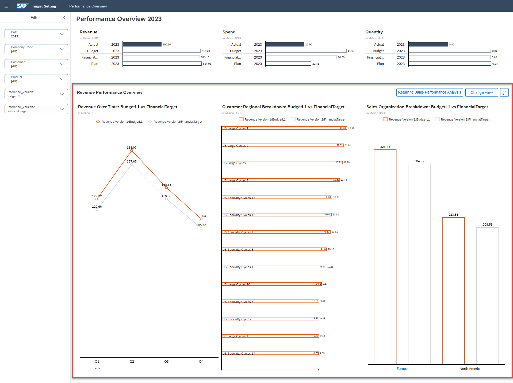

    - In the **Revenue Performance Overview** you can see **Revenue Over Time**, **Customer Regional Breakdown** and **Sales Organization Breakdown** for the selected reference versions for revenue.

4. **Trade Budget Performance Overview**

    <!-- border; size:540px -->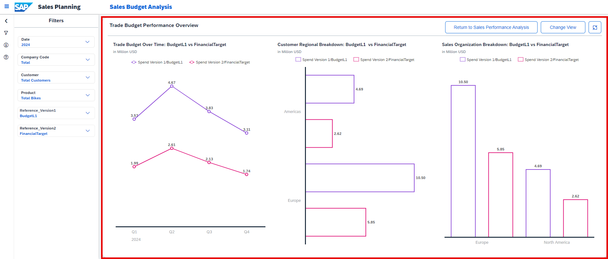

    - In the **Trade Budget Performance Overview** you can see the **Trade Budget Over Time**, **Customer Regional Breakdown** and **Sales Organization Breakdown** for the selected reference versions for spend.

5. **Quantity Performance Overview**

    <!-- border; size:540px -->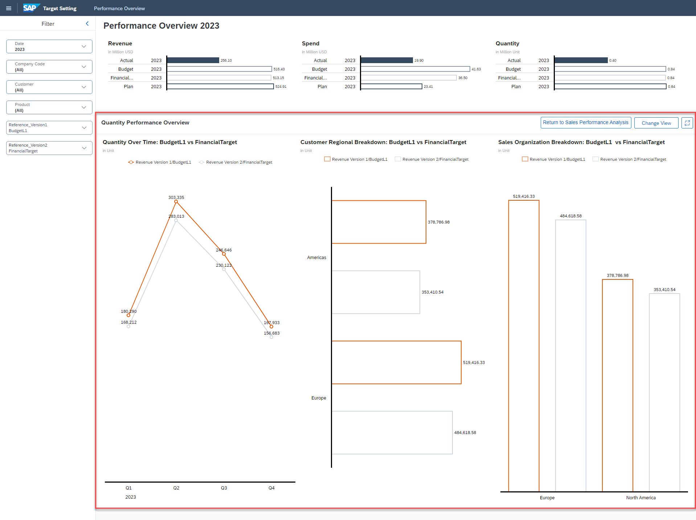

    - In the **Quantity Performance Overview** you can see the **Quantity Over Time**, **Customer Regional Breakdown** and **Sales Organization Breakdown** for the selected reference versions for revenue.

    You have successfully understood the capabilities of the **Sales Budget Analysis Report** (`SAP_SD_SalesBudgetAnalysis`).

### Sales Activity Analysis

The **Sales Activity Analysis** (`SAP_SD_SalesActivityAnalysis`) application provides a comprehensive overview of sales activity impact, including filters, charts displaying revenue, spend and margin, as well as detailed information on return on investment and spend over time.

1. Open ***Sales Activity Analysis** (`SAP_SD_SalesActivityAnalysis`) application from the Sales Planning Overview Page

    <!-- border; size:540px -->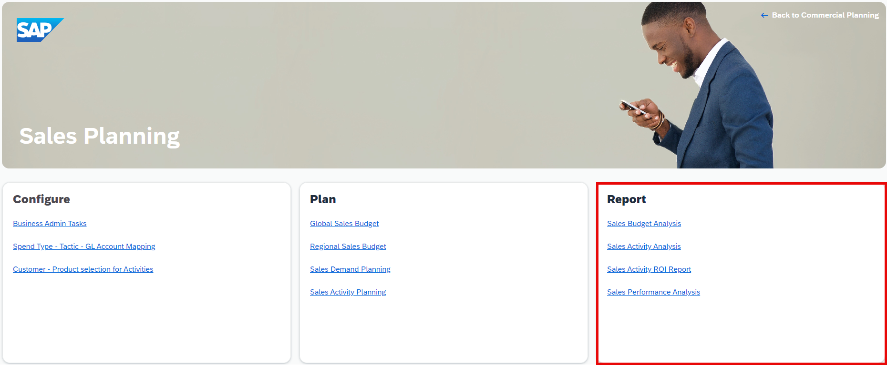

    - Go to the **Sales Planning Overview Page** (`SAP_SD_SalesPlanning_Overview`).
    - Click on **Sales Activity Analysis** in the Report section in order to land on the **Sales Activity Analysis** (`SAP_SD_SalesActivityAnalysis`) application.

2. Understand the application

    <!-- border; size:540px -->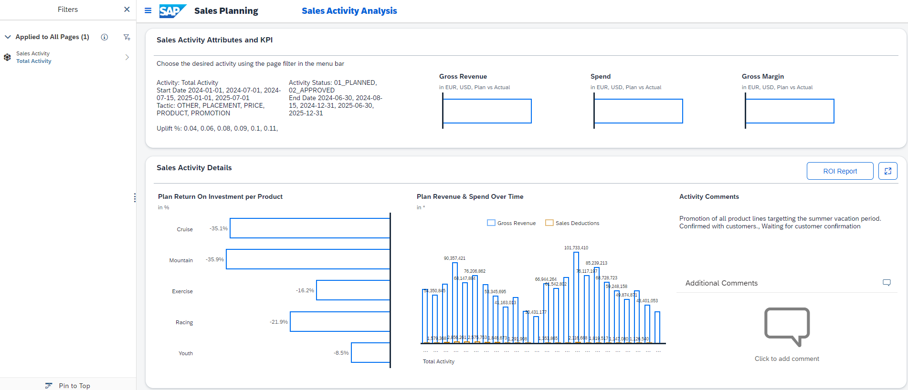

    - The application consists of three sections.
    - On the top left side of the page, you can find an instruction plus details about the current filters applied.
    - In the top right section, you can find charts that show Gross Revenue, Spend and Gross Margin for the two versions **Plan** and **Actual**.
    - In the lower section, you can find the **Sales Activity Details**. It shows the **Plan Return On Investment per Product**, **Plan Revenue & Spend Over Time** and comments.

3. Example how to filter

    - Imagine you are a **German** Sales Activity Planner and want to filter on all **planned** activities with **Tactic Price**.

    <!-- border; size:540px -->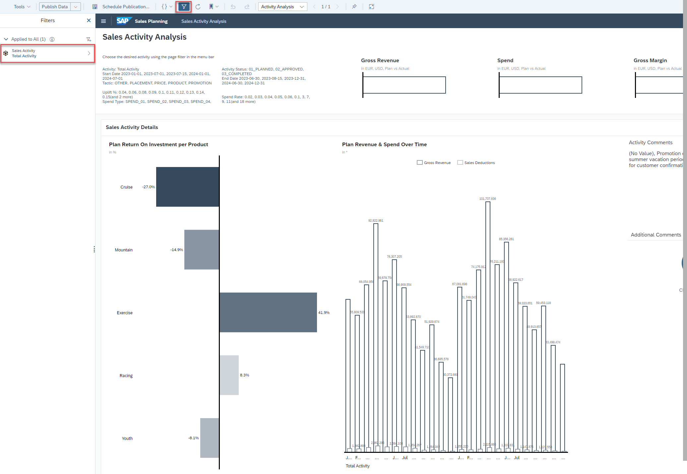

    - Hover to the top of you screen to let the shell bar show up.
    - Select the button **Filter Panel**.
    - Click on the filter for **Sales Activity**, which is applied per default.

    <!-- border; size:540px -->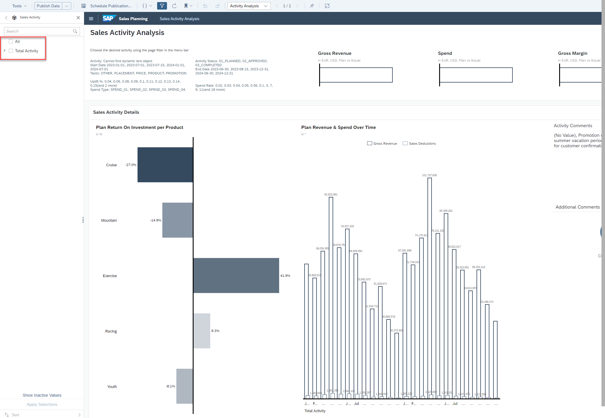

    - Uncheck the filter on **All** activities.

    <!-- border; size:540px -->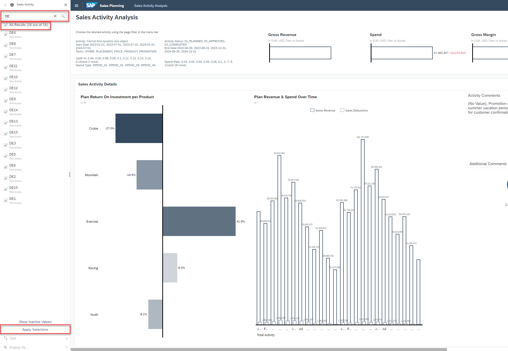

    - Search for `DE` in the search bar of the filter.
    - Check **All Results**.
    - **Apply Selections** to confirm your filter configuration.

    <!-- border; size:540px -->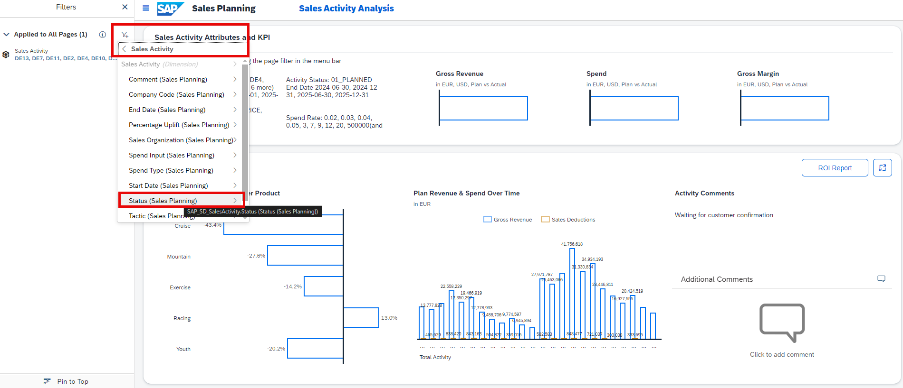

    - Click on **Add new filter**.
    - Navigate to **Dimensions** -> **Sales Activity** -> **Status (Sales Planning)**

    <!-- border; size:540px -->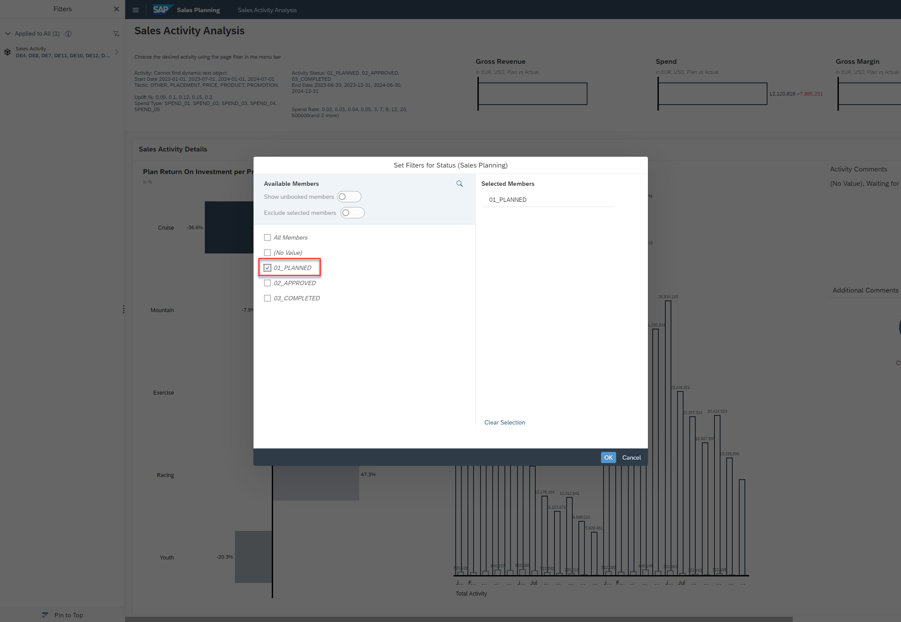

    - Select the member `01_PLANNED` in the dialog.
    - Click on **OK**.

    <!-- border; size:540px -->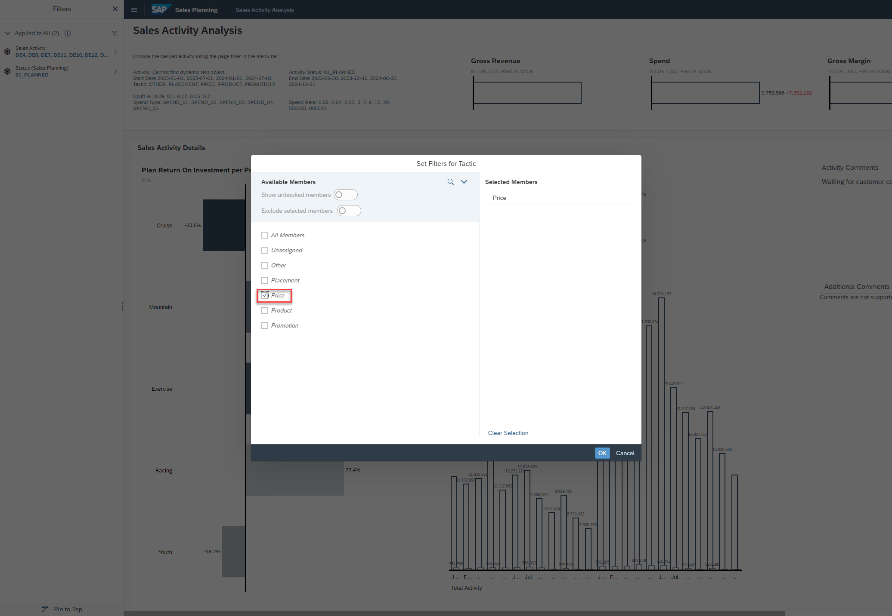

    - Click on **Add new filter** again.
    - Navigate to **Dimensions** -> **Tactic**
    - Select the member `Price` in the dialog.
    - Click on **OK**.

    <!-- border; size:540px -->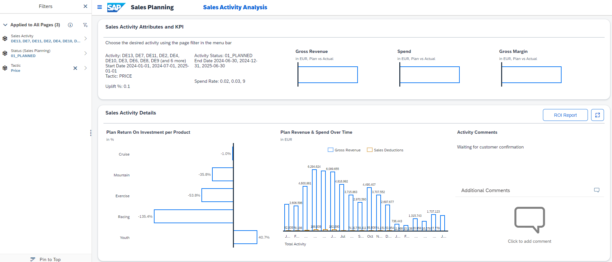

    - Notice the changes in the description section in the top left, the changed charts on the top right and the changed **Sales Activity Details**. The report now shows **planned** activities for **Germany** with the **Tactic Price**.

    You have successfully understood the capabilities of the **Sales Activity Analysis** (`SAP_SD_SalesActivityAnalysis`) application.

### Sales Activity Return on Investment Report

The **Sales Activity Return on Investment Report** (`SAP_SD_SalesActivityROI`) application allows users to filter and analyze sales activity data based on various criteria, view top and bottom performing activities, and examine detailed ROI calculations and visualizations for each sales activity.

1. Open **Sales Activity Return on Investment Report** (`SAP_SD_SalesActivityROI`) from the Sales Planning Overview Page

    <!-- border; size:540px -->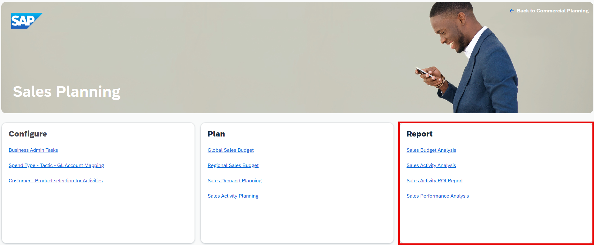

    - Go to the **Sales Planning Overview Page** (`SAP_SD_SalesPlanning_Overview`).
    - Click on **Sales Activity ROI Report** in the Report section in order to land on the **Sales Activity Return on Investment Report** (`SAP_SD_SalesActivityROI`) application.

2. Understand the application

    <!-- border; size:540px -->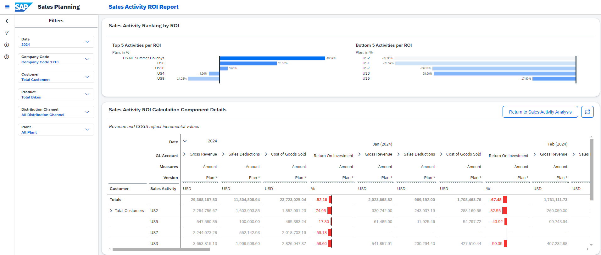

    - The application consists of three sections.
    - On the left side of the page, you can find the filter section to filter on Date, Company Code, Customer, Product, Distribution Channel and Plant.
    - At the top, you can find charts that show the Top 5 and Bottom 5 Activities per **Return of Investment**.
    - In the lower section, you can find the **Sales Activity ROI Calculation Component Details**. It shows a table holding information per customer and sales activity per Date, GL Account. It shows the amount of the plan version. for the GL Accounts Gross Revenue, Sales Deduction, Cost of Goods Sold and **Return on Investment**. Whereas the **Return on Investment** is shown in a graphical view with conditional formatting to display the over- or under-performance of the key performance indicator.

3. **Return on Investment** formula

    The **Return on Investment** in the last column of the table is calculated as following:
    `Return on Investment = (Incremental Gross Sales - Incremental Cost of Goods Sold - Sales Deductions)/Sales Deductions`

    You have successfully understood the capabilities of the **Sales Activity Return on Investment Report** (`SAP_SD_SalesActivityROI`) application.

### Sales Performance Analysis

The **Sales Performance Analysis** (`SAP_SD_SalesPerformanceAnalysis`) application allows users to filter and analyze sales performance data based on various criteria, view detailed breakdowns on gross revenue, by customers and products for the different versions. You can also compare your versions in a graphical view.

1. Open **Sales Performance Analysis** (`SAP_SD_SalesPerformanceAnalysis`) application from the Sales Planning Overview Page

    <!-- border; size:540px -->

    - Go to the **Sales Planning Overview Page** (`SAP_SD_SalesPlanning_Overview`).
    - Click on **Sales Performance Analysis** in the Report section in order to land on the **Sales Performance Analysis** (`SAP_SD_SalesPerformanceAnalysis`) application.

2. Understand the application

    <!-- border; size:540px -->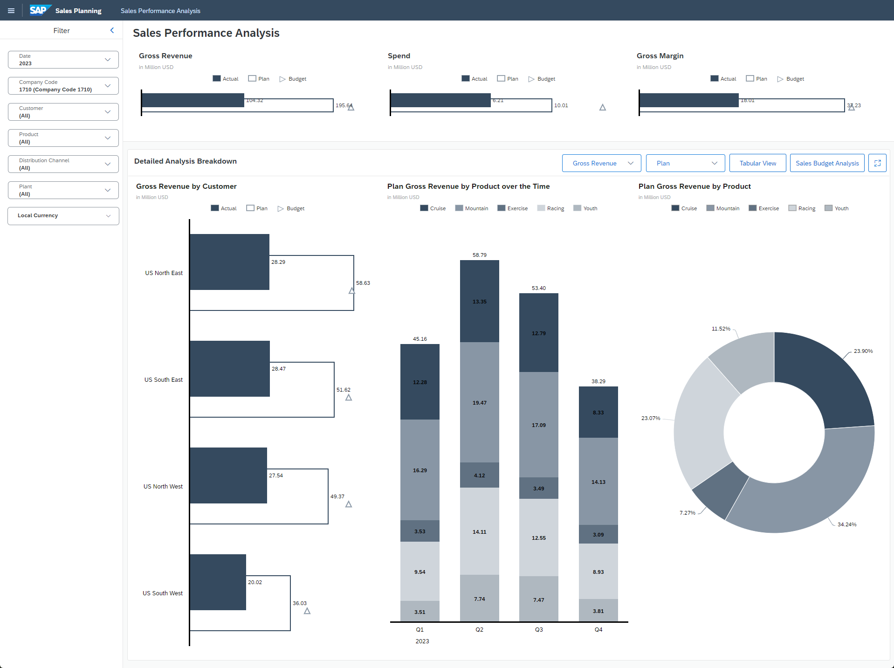

    - The application consists of three sections.
    - On the left side of the page, you can find the filter section to filter on Date, Company Code, Customer, Product, Distribution Channel, Plant and Currency.
    - At the top, you can find charts that show Gross Revenue, Spend and Gross Margin for the versions Actual, Plan and Budget.
    - In the lower section, you can find the **Detailed Analysis Breakdown**. It shows charts for the Gross Revenue by Customer for the different versions, Plan Gross Revenue by Product over the Time and Plan Gross Revenue by Product.

    <!-- border; size:540px -->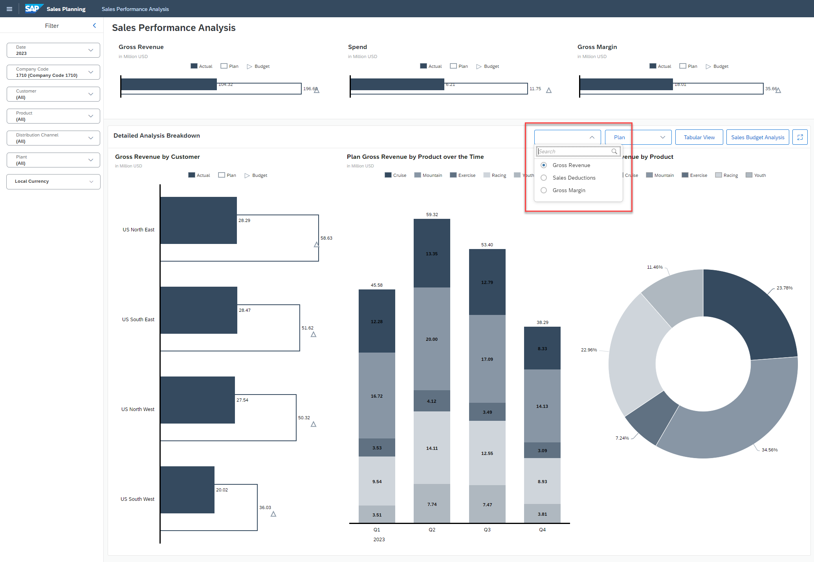

    - You can change the measure for the **Detailed Analysis Breakdown** by clicking on the dropdown menu mentioning **Gross Revenue** above the **Detailed Analysis Breakdown**. You can choose between **Gross Revenue**, **Sales Deductions** and **Gross Margin**.

    <!-- border; size:540px -->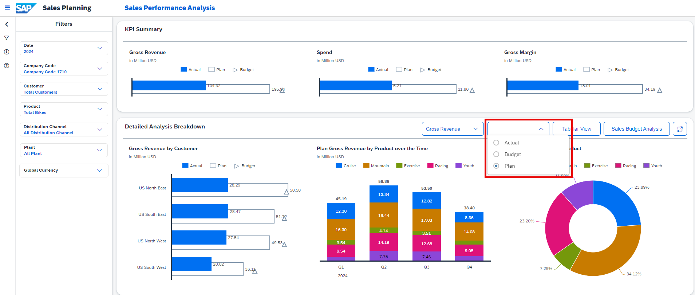

    - You can change the version for the **Detailed Analysis Breakdown** by clicking on the dropdown menu mentioning **Plan** above the **Detailed Analysis Breakdown**. You can choose between **Actual**, **Budget** and **Plan**.

    <!-- border; size:540px -->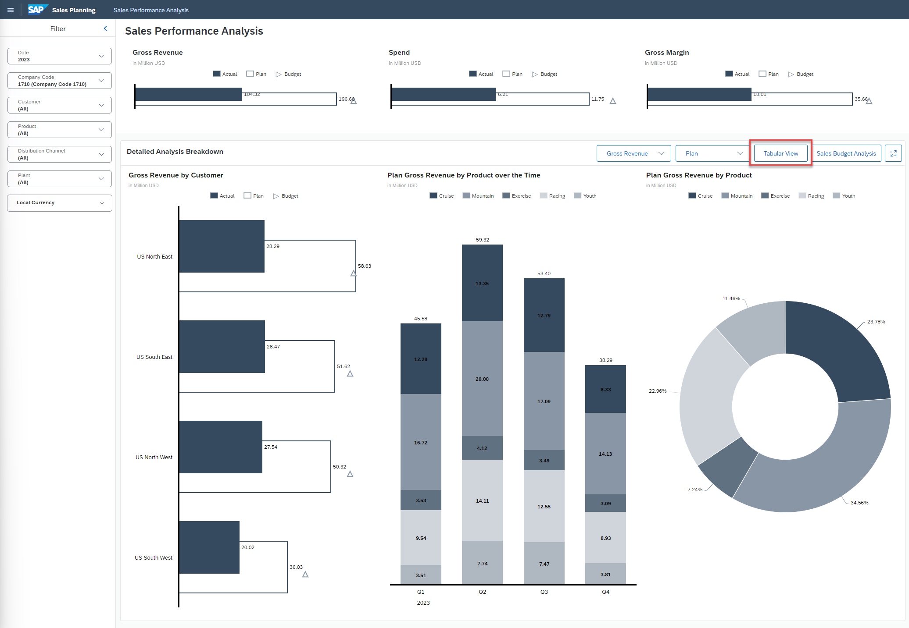

    - You can also switch from the **Detailed Analysis Breakdown** with charts to a tabular view.
    - Click on **Tabular View**.
    - You can switch back by clicking on **Graphical View**.

    <!-- border; size:540px -->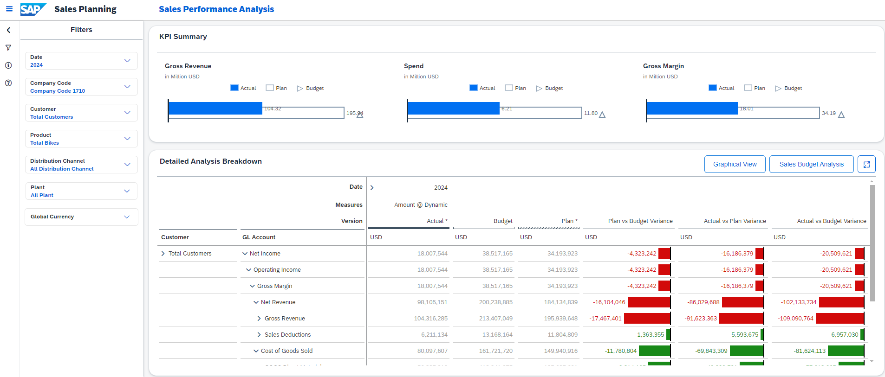

    - The tabular view shows you **Amount** per **Customer** and **GL Account** for the versions **Actual**, **Budget** and **Plan**. Additionally, the table provides you with color-coded variances for **Plan vs Actual**, **Plan vs Budget** and **Actual vs Budget**.

    You have successfully understood the capabilities of the **Sales Performance Analysis** (`SAP_SD_SalesPerformanceAnalysis`) application.

### Final Remarks

Congratulations! You have finished the introduction tutorial and are now able to use the Sales Planning module of the **SAP Commercial Planning (CX)** content package.

- [xP&A Commercial Planning - Get to know the Marketing Planning module](xpa-sac-cxmp-marketingplanning-gettoknow)
- [xP&A Commercial Planning - Get to know the Portfolio Planning module](xpa-sac-cxpp-portfolioplanning-gettoknow)

If you want to customize the content and adjust it according to your own business requirements, the following resources might be helpful: 

- [xP&A Commercial Planning - Introduction to the Data Model](xpa-sac-cxmp-datamodelfundamentals)
- [xP&A Commercial Planning - Understanding the technical structure of Stories](xpa-sac-cx-technical-structure-stories)
- [xP&A Commercial Planning - Data Integration](xpa-sac-cx-data-integration-setup)
- [xP&A Commercial Planning - Manage data loads](xpa-sac-cx-manage-data-loads)
- [xP&A Commercial Planning - Add additional sections to a story](xpa-sac-cx-add-new-sections)
- [xP&A Commercial Planning - Add an additional story to the Navigation Menu](xpa-sac-cx-add-story-navmenu)
- [xP&A Commercial Planning - Customize Default Settings](xpa-sac-cx-customize-default-settings)
- [xP&A Commercial Planning - Customize Table Settings Dialogue](xpa-sac-cx-customize-tablesettings-dialogue)
- [xP&A Commercial Planning (Marketing) - Add a new Driver](xpa-sac-cxmp-add-new-driver)
- [xP&A Commercial Planning (Marketing) - Add a new Version](xpa-sac-cxmp-add-new-version)
- [xP&A Commercial Planning (Marketing) - Extend activity spend dates](xpa-sac-cxmp-extend-activity-dates)
- [xP&A Commercial Planning (Sales) - Add a new Version](xpa-sac-cxsp-add-new-version)
- [xP&A Commercial Planning (Sales) - Add a new Spend Type](xpa-sac-cxsp-add-new-spendtype)
- [xP&A Commercial Planning (Sales) - Add a new Tactic](xpa-sac-cxsp-add-new-tactic)

For the full xP&A experience and to complement the commercial planning process with a dedicated revenue planning process, make sure to check out the [SAP Consensus Net Revenue Planning](https://help.sap.com/docs/SAP_ANALYTICS_CLOUD/42093f14b43c485fbe3adbbe81eff6c8/778ddfa3a6b74c1793804d07fc64de17.html) content package as well! More details about this content package can be found in the [xP&A Consensus Net Revenue - Get to know the Consensus Net Revenue Planning Content part of the xP&A Content Suite](xpa-sac-cnr-gettoknow) introduction tutorial.

Interested in more xP&A topics and related business content packages? Visit our community page [Extended Planning & Analysis Business Content](https://community.sap.com/topics/cloud-analytics/planning/content?source=social-Global-SAP+Analytics-YOUTUBE-MarketingCampaign-Analytics-Analytics-spr-5330779922).
