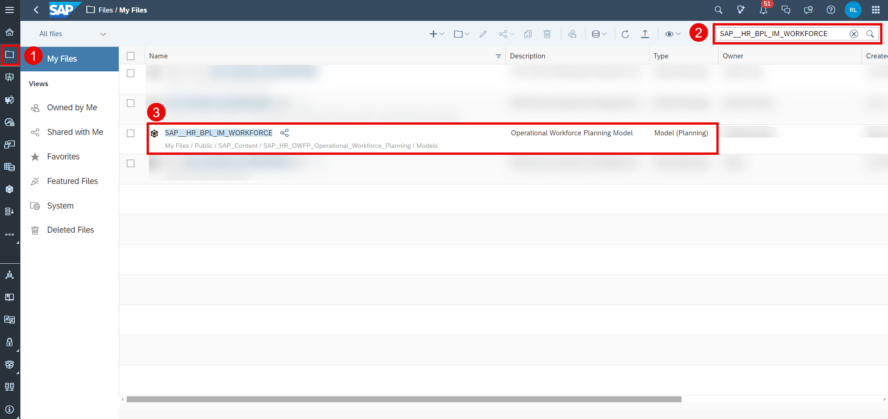
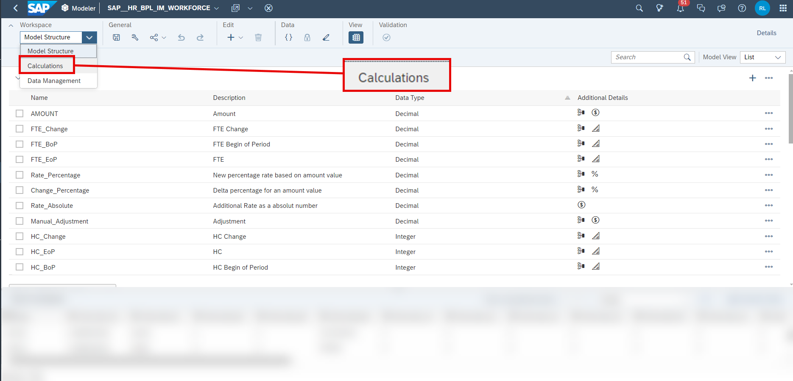
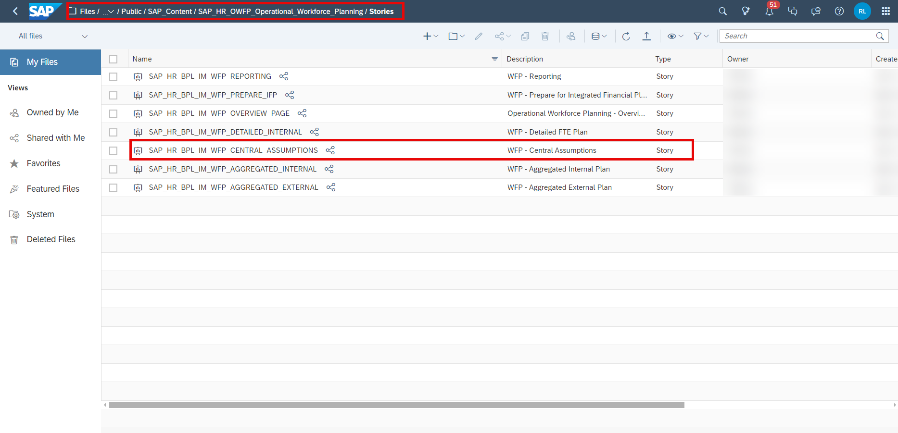
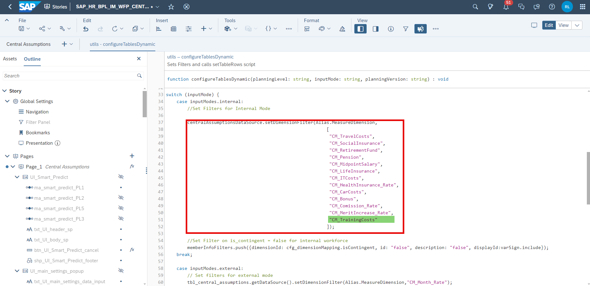
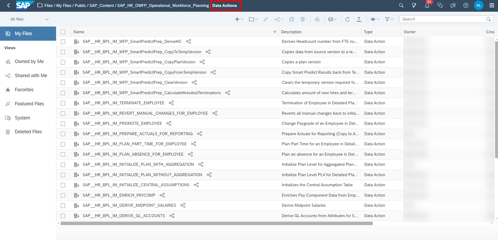

## You will learn
- The meaning of the term **Cost Type** in the context of the **xP&A - Operational Workforce Planning** content package for SAP Analytics Cloud
- Which steps are required in order to add a new Cost Type
- This includes...
    -modifying dimensions in the data model
    -adjusting scripts in the planning applications
    -adjusting all affected Data Actions

## Intro
In this tutorial you will learn how to add a new Cost Type to the application.

In case you have any questions or require further support, please use the [SAP Question Form](https://community.sap.com/t5/forums/postpage/choose-node/true/product-id/bcbf0782-ce74-43b8-b695-dafd7c1ff1c1/board-id/technology-questions).

If you have a specific request to our team in regards to the business content, you may also submit a request using the [SAP Influence Platform](https://influence.sap.com/sap/ino/#/idea-create?campaign=884&title=Extended%20Planning%20and%20Analysis%3A%20content&tags=Extended%20Planning%20and%20Analysis&RespList=cust.ino.config.SAP_ANALYTICS_CLOUD_SAP_DIGITAL_BOARDROOM.BIZ_CONTENT).

If you are interested in more xP&A topics, related business content packages, or videos showing the content in action, feel free to check out our community page [Extended Planning & Analysis Business Content](https://community.sap.com/topics/cloud-analytics/planning/content).

## Prerequisites
- You are familiar with the **xP&A - Operational Workforce Planning** content from the xP&A Business Content Suite. Reference: [Getting Started tutorial](xpa-sac-hxm-workforceplanning-gettoknow)
- You have installed the **xP&A - Operational Workforce Planning** content in an SAP Analytics Cloud tenant. Reference: [Business Content Installation Guide](https://help.sap.com/docs/SAP_ANALYTICS_CLOUD/00f68c2e08b941f081002fd3691d86a7/078868f57f3346a98c3233207bd211c7.html), [Content Package User Guide](https://help.sap.com/docs/SAP_ANALYTICS_CLOUD/42093f14b43c485fbe3adbbe81eff6c8/7032f23e00b34a7ab6d79af20a8792a7.html)  


### Understanding the term Cost Type
In the scope of the [Operational Workforce Planning Content Package for SAP Analytics Cloud](https://help.sap.com/docs/SAP_ANALYTICS_CLOUD/42093f14b43c485fbe3adbbe81eff6c8/7032f23e00b34a7ab6d79af20a8792a7.html), the term **Cost Type** is used to categorize a cost-related measure and describe it in more detail. By combining the information of both the measure and the cost type dimension, an account model is created and the planner can analyze the specific sources of incurred costs.

For instance: the content comes with a pre-defined measure which is called `Rate_Absolute`. This measure represents an absolute monthly rate for one headcount (HC). Such an absolute rate can be used to plan travel costs for example. In order to do so, you can simply use the measure `Rate_Absolute` and make your planning assumptions on the cost type `TRAVEL_COSTS`.

In the following exercise, you will learn how to add a new cost type which enables you to plan costs for training activities.

### Add new Member to Cost Type Dimension
In the first step, it is necessary to add a new member to the `SAP_HR_COSTTYPE` dimension.

1. In the SAP Analytics Cloud Menu, navigate to the **Files** section..

2. Search for the `SAP__HR_BPL_IM_WORKFORCE` data model and open it.

    <!-- border; size:540px -->

3. Open the dimension `SAP_HR_COSTTYPE`.

    <!-- border; size:540px -->

4. Add a new member with the respective attributes to the cost type dimension.

    In this example, the cost type `TRAINING_COSTS` representing training-related costs per headcount is added.

    - Use `TRAINING_COSTS` as your `Member ID`.
    - Provide a valid description to the new cost type. For instance, you can describe the new member as **Costs for Training Activities**.
    - Assign the new member `TRAINING_COSTS` to the respective hierarchy node. In this example, the `HC_COSTS` hierarchy node is selected.
    - Optionally, provide a `GL_Account` number to the new member `TRAINING_COSTS` in the `GL_Account` column. This is required in case you wish to have your planning results transferred to the [Integrated Financial Planning for SAP S/4HANA and SAP S/4HANA Cloud](https://help.sap.com/docs/SAP_ANALYTICS_CLOUD/42093f14b43c485fbe3adbbe81eff6c8/7b8caa06f850453fab8d570be92f4c99.html) data model. If this attribute is not maintained, a cross model copy for this specific member cannot be performed.

    |  Column             | Value                           | Comment                                                                                                   |
    |  :----------------- | ------------------------------- | ----------------------------------------------------------------------------------------------------------|
    |  `Member ID`        | `TRAINING_COSTS`                | Mandatory ID field
    |  `Description `     | `Costs for Training Activities` | Description of the new cost type member
    |  `Hierarchy`        | `HC_COSTS`                      | Mandatory field. Indicates under which hierarchy node the member will be displayed.
    |  `GL_Account`       |                                 | Optional field. Shows to which GL account member the cost type will translate in a cross model copy scenario.
    |  `Row_Source`       | `SAC`                           | Optional field. Shows, whether this cost type comes from SuccessFactors or whether it was manually added in SAP Analytics Cloud.

    <!-- border; size:540px -->

4. Save your changes.

### Add Calculated Measure
In the next step, a new calculated measure must be added.

This is necessary not only for the correct initialization of the tables used in the different planning applications of this content package, but also to make your planning assumptions on the correct combination of members of the measure version and cost type version.

In this example, you will create a new calculated measure called `CM_TrainingCosts` which restricts the measure `Rate_Absolute` to the cost type `TRAINING_COSTS`.

1. Navigate to the **Calculation Management** menu by switching the **Workspace** on the top left corner via the drop down menu.

    <!-- border; size:540px -->

2. Click on the **plus** UI element in order to add a new calculated measure

3. Provide the formula for the new calculated measure. In this example, you may use the following formula in order to restrict the `Rate_Absolute` measure to the `TRAINING_COSTS` cost type:

    ```
    RESTRICT ([Rate_Absolute], [d/SAP_HR_COSTTYPE] = "TRAINING_COSTS" )
    ```

4. Provide a valid name for your calculated measure. In this example, you want to call it `CM_TrainingCosts`.

5. Set the aggregation type to `SUM`.

6. Set the scale to `Thousand`.

7. Set the amount of decimal places to `2`.

8. Save your changes.

<!-- border; size:540px -->

>IMPORTANT:
>
- If you plan your new cost type to be an absolute rate which adds up to the personnel costs, please use the measure `Rate_Absolute` in your `RESTRICT` formula. In this case, always set the aggregation type to **SUM**, scale to **Thousand** and decimal places to **2** on the right hand menu in order to be consistent with the other measures.
- If you plan your new cost type to be a percentage rate which applies to the base salary, please use the measure `Rate_Percentage` in your `RESTRICT` formula. In this case, leave the aggregation type blank, set the scale to **Percent** and Decimal Places to **1**.


### Adjust Central Assumptions Story
In the next step, the Central Assumptions (`SAP_HR_BPL_IM_WFP_CENTRAL_ASSUMPTIONS`) story must be modified in order for the table to initialize correctly.

1. Navigate through the file explorer and open the planning application `SAP__HR_BPL_IM_WFP_CENTRAL_ASSUMPTIONS` in **edit mode**.

    <!-- border; size:540px -->

2. Open the script object `configureTablesDynamic` while in **edit mode** of the application.

    <!-- border; size:540px -->

3. Search for the line with the comment **//Set Filters for Internal Mode**. Add your new calculated measure to the predefined array by complementing it with the keyword `CM_TrainingCosts` as shown in the following screenshot.

    <!-- border; size:540px -->

    ```
    switch (inputMode) {
    	case "Internal":
    		//Set Filters for Internal Mode
    		centralAssumptionsDataSource.setDimensionFilter(Alias.MeasureDimension,["CM_TravelCosts","CM_SocialInsurance","CM_RetirementFund","CM_Pension","CM_MidpointSalary","CM_LifeInsurance","CM_ITCosts","CM_HealthInsurance_Rate","CM_CarCosts","CM_Bonus","CM_Comission_Rate","CM_MeritIncrease_Rate","CM_TrainingCosts"]);
    ```

4. Save your planning application.

### Adjust Data Actions
Additionally, it is necessary to complement the Data Actions with a new calculation logic for the newly created cost type.

By doing this, you will ensure that whenever a cost calculation takes place, costs for the new cost type will be calculated as well. Such calculations occur in the process of the seeding of the plan versions for instance, or when making your planning assumptions (i.e. changing headcount values) and re-calculating your total costs.

1. In the SAP Analytics Cloud menu, navigate to the **Data Actions** folder inside the `SAP_HR_OWFP_Operational_Workforce_Planning` content folder.

    <!-- border; size:540px -->

2. Open the `SAP__HR_BPL_IM_CALCULATE_COSTS` Data Action.

    >INFORMATION:
    >
    - This Data Action is responsible for the (re-)calculation of your costs in the **aggregated planning** scenario. Whenever you change your planning assumptions (i.e. headcount values) in your planning application, you can run a cost calculation which takes into consideration your new entries.

3. Scroll down until you find the code block **//Initialize CAR Costs for Internal Workforce**

4. Copy the whole code block as indicated in the following snapshot and paste it right below

5. Adjust the pasted code block according to the new cost type properties
    - Change the naming in the commented header line from `CAR COSTS` to `TRAINING COSTS`
    - Change the **RESULTLOOKUP** and **DATA** member for the dimension `SAP_HR_COSTTYPE` from `CAR_COSTS` to `TRAINING_COSTS`

    <!-- border; size:540px -->

    >GENERAL INFORMATION:
    >
    - Depending on whether you created the new calculated measure based on `Rate_Absolute` or `Rate_Percentage`, you can use any other calculation block as template for the new cost type.
     - If for instance you created a calculated measure based on the measure `Rate_Absolute`, you may simply copy the block **//Initialize CAR Costs for Internal Workforce**
     - If you created a calculated measure based on the measure `Rate_Percentage`on the other hand, you may simply copy the block **//Initialize BONUS Costs for Internal Workforce**

6. Save your changes.

7. Navigate back to the Data Action menu and open the `SAP__HR_BPL_IM_CALCULATE_COSTS_DETAILED` Data Action.

    >INFORMATION:
    >
    - This Data Action is responsible for the (re-)calculation of your costs in the **detailed planning** scenario. Whenever you change your planning assumptions (i.e. FTE values) in your planning application, you can run a cost calculation which takes into consideration your new entries.

8. Repeat the same activity as described in steps 4 and 5.

    - Use any fitting code block as template, copy and paste it, adjust the header comment above the code block and change the cost type in the **RESULTLOOKUP** and **DATA** statement to the new cost type.

    <!-- border; size:540px -->

    <!-- border; size:540px -->

9. Save your changes.

10. Navigate back to the Data Action menu and open the `SAP__HR_BPL_IM_INITIALIZE_PLAN_WITH_AGGREGATION` Data Action.

    >INFORMATION:
    >
    - This Data Action is responsible for the calculation of your costs in the **aggregated planning** scenario. It comes into action in case you decide to pre-populate your plan version based on historical values.

11. Open step 5 **Initialize Cost Types excluding Merit** of the Data Action and repeat the same activity as described in steps 4 and 5.

    - Use any fitting code block as template, copy and paste it, adjust the header comment above the code block and change the cost type in the **RESULTLOOKUP** and **DATA** statement to the new cost type.

    <!-- border; size:540px -->

12. Save your changes.

13. Navigate back to the Data Action menu and open the `SAP__HR_BPL_IM_INITIALIZE_PLAN_WITHOUT_AGGREGATION` Data Action.

    >INFORMATION:
    >
    - This Data Action is responsible for the calculation of your costs in the **detailed planning** scenario. It comes into action in case you decide to pre-populate your plan version based on historical values.

14. Open step 4 **Initialize Cost Types excluding Merit** of the Data Action and repeat the same activity as described in steps 4 and 5.

    - Use any fitting code block as template, copy and paste it, adjust the header comment above the code block and change the cost type in the **RESULTLOOKUP** and **DATA** statement to the new cost type.

    <!-- border; size:540px -->

    <!-- border; size:540px -->

15. Save your changes. 

### Maintain Central Assumptions for new Cost Type
Lastly you need to maintain **Central Assumptions** for the new cost type `TRAINING_COSTS`.

Here you can access the tutorial [xP&A Operational Workforce Planning - Create and Upload Central Assumptions](xpa-sac-hxm-maintain-central-assumptions) in order to learn what Central Assumptions are for, how to upload them and how maintain these cost parameters.

### Final Remarks
Congratulations! You have now successfully created a new cost type and embedded it into the stories and Data Actions.

If you want to learn more about the **SAP xP&A Operational Workforce Planning** content package, customize the content and adjust it according to your own business requirements, the following resources might be helpful:

- [xP&A Operational Workforce Planning - Get to know the Operational Workforce Planning Content](xpa-sac-hxm-workforceplanning-gettoknow)
- [xP&A Operational Workforce Planning - Create and Upload Central Assumptions](xpa-sac-hxm-maintain-central-assumptions)
- [xP&A Operational Workforce Planning - Add a new Plan Level](xpa-sac-hxm-add-plan-level)
- [xP&A Operational Workforce Planning - Add a new Cost Type](xpa-sac-hxm-add-cost-type)
- [xP&A Operational Workforce Planning - Add a new Version](xpa-sac-hxm-add-new-version)
- [xP&A Operational Workforce Planning - Create Predictive Scenario](xpa-sac-hxm-create-predictive-scenario)
- [xP&A Operational Workforce Planning - Write back plan positions to SAP SuccessFactors](xpa-sac-hxm-successfactors-writeback)

If you want to get an overview of the entire xP&A Operational Workforce Planning content package, make sure to check out the [Mission](https://developers.sap.com/mission.hxm-workforce-planning.html).

Interested in more xP&A topics and related business content packages? Visit our community page [Extended Planning & Analysis Business Content](https://community.sap.com/topics/cloud-analytics/planning/content).
