## Prerequisites
- You are familiar with the **xP&A - Operational Workforce Planning** content from the xP&A Business Content Suite. Reference: [Getting Started tutorial](xpa-sac-hxm-workforceplanning-gettoknow)
- You have installed the **xP&A - Operational Workforce Planning** content in an SAP Analytics Cloud tenant. Reference: [Business Content Installation Guide](https://help.sap.com/docs/SAP_ANALYTICS_CLOUD/00f68c2e08b941f081002fd3691d86a7/078868f57f3346a98c3233207bd211c7.html), [Content Package User Guide](https://help.sap.com/docs/SAP_ANALYTICS_CLOUD/42093f14b43c485fbe3adbbe81eff6c8/7032f23e00b34a7ab6d79af20a8792a7.html)  

## You will learn
- Which steps are required in order to add and use a new version
- This includes...
  -adding a new version via the version management function
  -which options are available to use the new version for your planning activities

## Intro
The xP&A Operational Workforce Planning content package comes with a number of pre-defined versions which can be used for your planning activities. Nevertheless you might wand to add more versions according to your own business needs. In this case, you would need to adjust the planning applications as well as the reporting stories, so the planning grids and objects initialize with the correct version member.

In this tutorial, you will learn how to add a new version and how to make it available in the planning applications and reporting stories of this content package.

In case you have any questions or require further support, please use the [SAP Question Form](https://community.sap.com/t5/forums/postpage/choose-node/true/product-id/bcbf0782-ce74-43b8-b695-dafd7c1ff1c1/board-id/technology-questions).

If you have a specific request to our team in regards to the business content, you may also submit a request using the [SAP Influence Platform](https://influence.sap.com/sap/ino/#/idea-create?campaign=884&title=Extended%20Planning%20and%20Analysis%3A%20content&tags=Extended%20Planning%20and%20Analysis&RespList=cust.ino.config.SAP_ANALYTICS_CLOUD_SAP_DIGITAL_BOARDROOM.BIZ_CONTENT).

If you are interested in more xP&A topics, related business content packages, or videos showing the content in action, feel free to check out our community page [Extended Planning & Analysis Business Content](https://community.sap.com/topics/cloud-analytics/planning/content).

### Enter Version Management section
In the first step, it is necessary to add a new member to the `Version` dimension. In order to do so, you need to enter the **Version Management** section.

1. In the SAP Analytics Cloud Menu, navigate to the **Stories** section.

2. Select **Canvas** in order to create a new canvas story.

    <!-- border; size:540px -->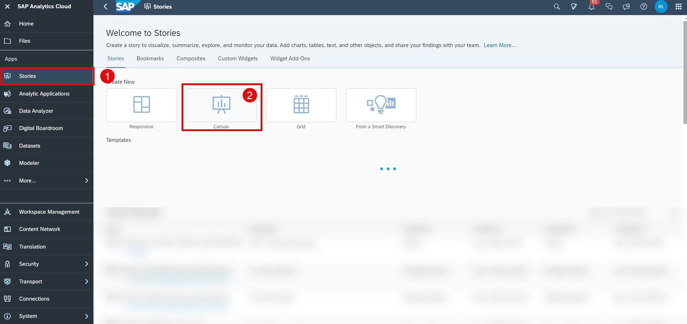

3. Drag and drop a table object onto the canvas board.

    <!-- border; size:540px -->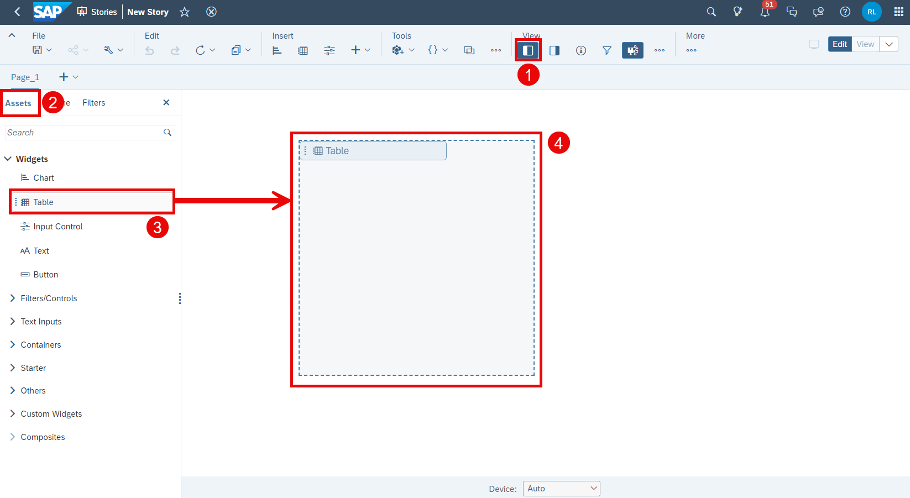

4. Select the `SAP__HR_BPL_IM_WORKFORCE` data model as your data source.

    A new dialogue pops up. Select the option **Existing Model** and click on **Select other model...**

    <!-- border; size:540px -->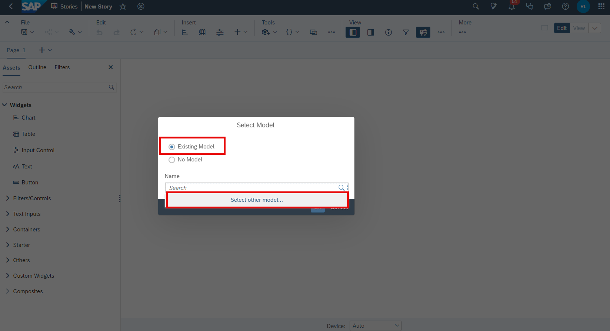

    You can find the data model by searching for the technical name via the search function.

    <!-- border; size:540px -->

5. Click on the table and open the **Version Management** section.

    <!-- border; size:540px -->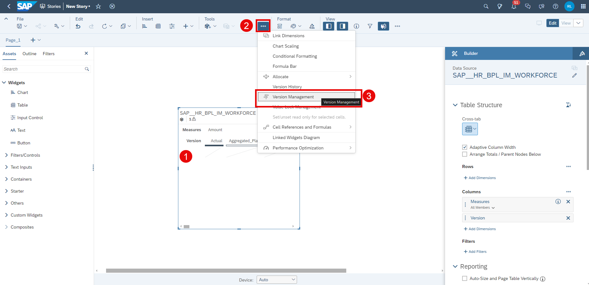

### Create new Version

After clicking on the **Version Management** icon, a new section on the right-hand side expands, where all public and private versions are visible. In this step, you will add a new public version to the data model.

1. Duplicate an existing version.

    - Choose a version and click on the **copy** icon next to it. In this example, you will create a copy of the version `public.Aggregated_Plan`.

      <!-- border; size:250px -->

2. Define the version properties.

    - Choose a valid name for your new version. In this example we will call it `Baseline`.
    - Ensure to choose **Planning** as your version category.
    - Choose one of the options provided for your copy operation. In this example, we will copy all data from the `public.Aggregated_Plan` version to the new version.

      <!-- border; size:540px -->

    - Click on **OK** to create the copy.

### Publish new Version

Now that you have created the new version, you need to publish it as it is initially created as a private version.

1. Click on the **Publish** icon next to your new version.

    <!-- border; size:250px -->

2. Select the option **Publish As**.

    <!-- border; size:250px -->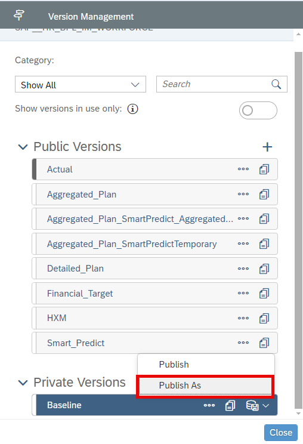

3. Specify the version properties.

    - Specify the version name once more. In this example, we will stick to the name `Baseline`.
    - Specify the version category once more. Ensure to select **Planning**.
    - Click on the **Publish** button when done.

      <!-- border; size:250px -->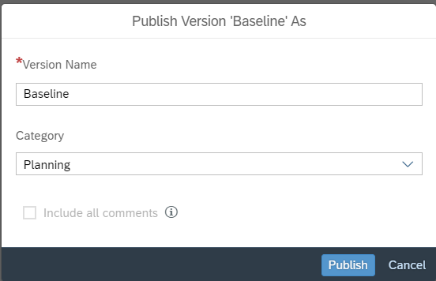

4. Close your story.

    - You may now close your story.
    - There is no need to save it as it only served as an entry point for the version management section. 
    - Alternatively, you can also just use an existing story of this content package to enter the version management section.

### Adjust Version Properties
Now that you created your new version, you can make a couple of adjustments which are relevant for the planning activities. This includes changing the plan horizon or the reference period for instance.

1. In the SAP Analytics Cloud Menu, navigate to the **Files** section.

2. Search for the `SAP__HR_BPL_IM_WORKFORCE` data model and open it.

    <!-- border; size:540px -->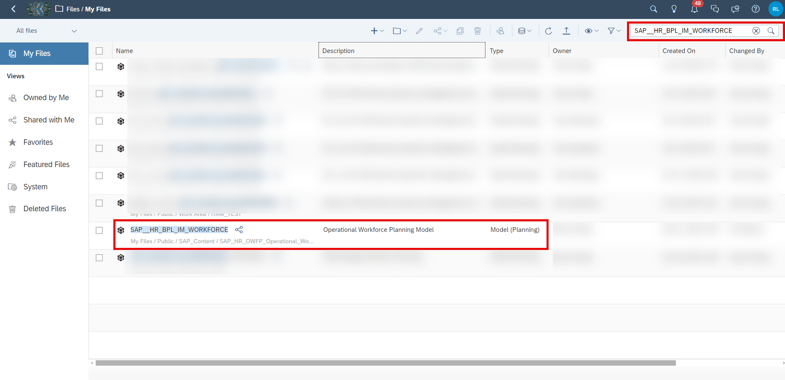

3. Open on the dimension `Version`.

    <!-- border; size:540px -->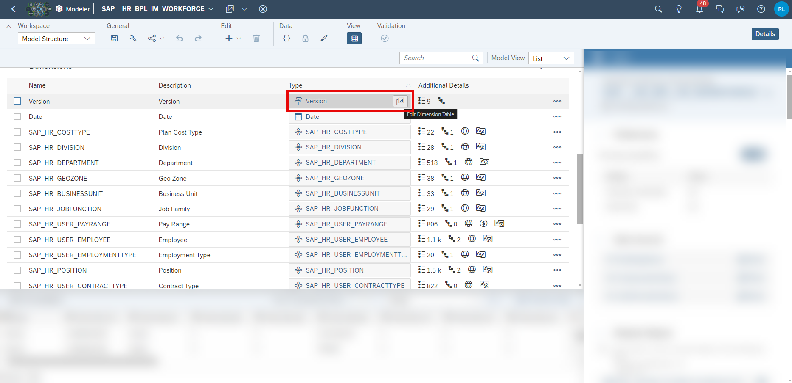

4. Adjust the version properties.

    - As your new version `Baseline` was created based on a copy of the version `Aggregated_Plan`, all properties were copied.
    - In case you want to adjust some of the properties, you can do it here.

      <!-- border; size:540px -->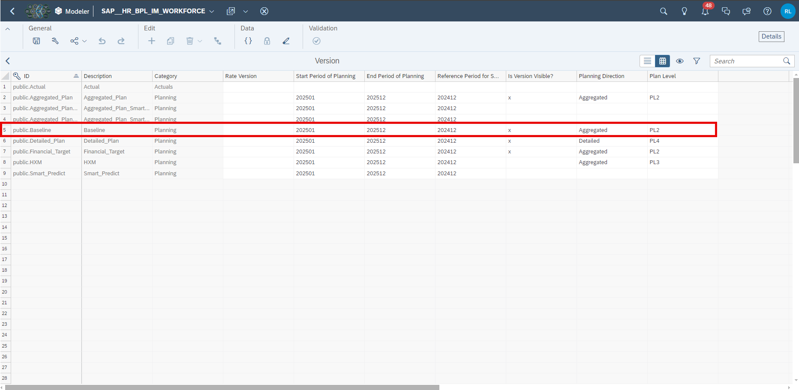

    The below table offers an overview on the different properties and their impact.

    |  Column                       | Explanation                                                                             
    |  :----------------------------| :-----------------------------------------------------------------------------------------------------------
    |  ID                           | Not editable. Displays the ID of the version member.
    |  Description                  | Not editable. Represents the description of the version member.
    |  Category                     | Not editable. Defines the category of the version member.
    |  Start Period of Planning     | Mandatory field. Defines the start period of the plan horizon in a `YYYYMM` format.¹
    |  End Period of Planning       | Mandatory field. Defines the end period of the plan horizon in a `YYYYMM` format.¹
    |  Reference Period for Seeding | Mandatory field. Defines the reference period for the built-in seeding functionality in a `YYYYMM` format.²
    |  Is Version Visible?          | Mandatory field. Indicates, whether the version is loaded by the planning applications or not.³
    |  Planning Direction           | Mandatory field. Shows whether this Plan Level is applied to the aggregated or detailed planning scenario.⁴
    |  Plan Level                   | Mandatory field. Defines the Plan Level which will be applied in the initialization process of the planning applications.⁵

      ¹The properties **Start Period of Planning** and **End Period of Planning** define the plan horizon for your planning activities.

      - The plan horizon must always cover a multiple of 12 periods. This means, you can define your plan horizon over a range of 12, 24, 36 etc. periods.
      - The start and the end period must always be entered in a `YYYYMM` format.

      ²The property **Reference Period for Seeding** defines the reference period which is used for the built-in seeding functionality of the application `SAP__HR_BPL_IM_WFP_CENTRAL_ASSUMPTIONS`.

      - Only one period can be selected as reference period.
      - The reference period must always be entered in a `YYYYMM` format.
      - If for instance your define your reference period as `202412` and make use of the pre-seeding functionality provided by the story `SAP__HR_BPL_IM_WFP_CENTRAL_ASSUMPTIONS`, your plan version would be pre-populated with the values from the period `202412`. Those values are copied over to the periods of your defined plan horizon, which in this example ranges from period 1 of the plan year 2025 to period 12 of the plan year 2025 (defined by the properties **Start Period of Planning** and **End Period of Planning**).

      ³The property **Is Version Visible** indicates whether a version can be initialized by the planning applications or not.

      - The value `x` indicates that the version must be initialized.
      - If this field is left blank, the version will be ignored in the initialization process.

      ⁴The property **Planning Direction** shows whether the version is used for the aggregated or the detailed planning scenario.

      - Allowed entries for the **Planning Direction** column are only the values `Aggregated` or `Detailed`.
      - Other keywords will not be recognized by the planning applications.

      ⁵The property **Plan Level** defines the default Plan Level of the version.

      - Each version can only have one Plan Level. The Plan Level must not be changed during the whole planning process. If the Plan Level is changed during the planning process, issues such as duplicated numbers may occur.
      - The Plan Level specified in this column defines the table structure in the planning applications. Find out more about the term Plan Level and its role in the context of this content package in **step 1** of the tutorial [xP&A Operational Workforce Planning - Add a new Plan Level](xpa-sac-hxm-add-plan-level).
      - Allowed entries for the column **Plan Level** are only the members maintained in the `Plan_Level` dimension, which per default are `PL1`, `PL2`, `PL3`, `PL4` and `PL5`.

5. Save your changes in case you have done any.

### Initialize Objects in Stories with new Version
Lastly, you need to make some final adjustments in order for the stories to initialize all objects with the new version.

In order to do so, there are three possible ways. You can check them out by switching the tabs in this step.

[OPTION BEGIN [Adjust Initialization Script]]
This option provides guidance on how to set the new version as the default version for the initialization of the objects used in the planning applications by adjusting the initialization script.

1. In the SAP Analytics Cloud Menu, navigate to the **Files** section.

2. Search for the affected story in which you want the objects to be initialized with new version. In this example, we will look for the `SAP_HR_BPL_IM_WFP_AGGREGATED_INTERNAL` story and open it in **edit mode**.

    <!-- border; size:540px -->

    >INFORMATION:
    >
    Please note that the procedure is the exact same for any other stories. Possible applications are where the plan version can be changed are:
    >
    - `SAP_HR_BPL_IM_WFP_OVERVIEW_PAGE`
    - `SAP_HR_BPL_IM_WFP_AGGREGATED_INTERNAL`
    - `SAP_HR_BPL_IM_WFP_AGGREGATED_EXTERNAL`
    - `SAP_HR_BPL_IM_WFP_CENTRAL_ASSUMPTIONS`
    - `SAP_HR_BPL_IM_WFP_PREPARE_IFP`
    - `SAP_HR_BPL_IM_WFP_DETAILED_INTERNAL`

3. In the **Outline** section, scroll down to the **Script Objects** and click on the script `getCustomizing`.

    <!-- border; size:540px -->

4. Set the variable inside the script to your new version.

    Look for a code line which looks something like the one shown in the following image and set the variable to your new version `public.Baseline`

    <!-- border -->

    >INFORMATION:
    >
    Please note that this line will only work if there is no default value set for your `cfg_planVersion` variable located under the **Script Variables** section.
    >
    Please also note that in the application `SAP__HR_BPL_IM_WFP_DETAILED_INTERNAL`, the script does not contain an if-condition as shown in the image above, but rather looks like this:
    >
    <!-- border -->
    >
    Please also note that in the application `SAP__HR_BPL_IM_WFP_PREPARE_IFP`, the variable inside the script is called `cfg_planVersionSource` instead of `cfg_planVersion`:
    >
    <!-- border -->

5. Save your changes.

[OPTION END]

[OPTION BEGIN [Set Default Parameter]]
This option provides guidance on how to set the new version as the default version for the initialization of the objects used in the stories by providing a default value for the version variable.

>INFORMATION:
>
Please note that this option does not work for the detailed planning application `SAP_HR_BPL_IM_WFP_DETAILED_INTERNAL`. It can only be applied to the following applications:
>
  - `SAP_HR_BPL_IM_WFP_OVERVIEW_PAGE`
  - `SAP_HR_BPL_IM_WFP_AGGREGATED_INTERNAL`
  - `SAP_HR_BPL_IM_WFP_AGGREGATED_EXTERNAL`
  - `SAP_HR_BPL_IM_WFP_CENTRAL_ASSUMPTIONS`
  - `SAP_HR_BPL_IM_WFP_PREPARE_IFP`

1. In the SAP Analytics Cloud Menu, navigate to the **Files** section.

2. Search for one of the above mentioned stories. In this example, we will look for the `SAP_HR_BPL_IM_WFP_AGGREGATED_INTERNAL` story and open it in **edit mode**.

    <!-- border; size:540px -->

    >INFORMATION:
    >
    - Please note that the procedure is the exact same for any other stories of this content package.

3. In the **Outline** section, scroll down to the **Script Variables** section and click on the variable `cfg_planVersion`.

    <!-- border; size:540px -->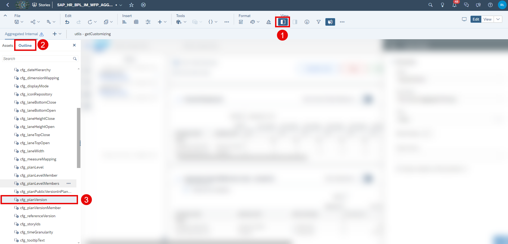

    >INFORMATION:
    >
    >Please note that in the application `SAP__HR_BPL_IM_WFP_PREPARE_IFP`, the variable is called `cfg_planVersionSource`.

4. Enter as your default value for the `cfg_planVersion` variable the new version name, which in this example is `public.Baseline`. Click on **Done** afterwards.

    <!-- border; size:250px -->

5. Save your changes.

6. Repeat the same steps for the remaining planning applications which are affected by that change.

[OPTION END]

[OPTION BEGIN [Pass URL Parameter]]
This option provides guidance on how to set the new version as the default version for the initialization of the objects used in the planning applications by passing a URL parameter.

>INFORMATION:
>
Please note that this option does not work for the detailed planning application `SAP_HR_BPL_IM_WFP_DETAILED_INTERNAL`. It can only be applied to the following applications:
>
  - `SAP_HR_BPL_IM_WFP_OVERVIEW_PAGE`
  - `SAP_HR_BPL_IM_WFP_AGGREGATED_INTERNAL`
  - `SAP_HR_BPL_IM_WFP_AGGREGATED_EXTERNAL`
  - `SAP_HR_BPL_IM_WFP_CENTRAL_ASSUMPTIONS`
  - `SAP_HR_BPL_IM_WFP_PREPARE_IFP`

1. Generate the link to your story.

    - In order to do so, simply open one of the stories.
    - You can find the link to the story in your address bar inside your web browser.
    - Typically, the link looks like this: `https://<YourTenant>/<YourAppID>/`

2. Complement the link with the URL parameter for your new version.

    - Copy the following block and paste it at the end of your link: `?p_cfg_planVersion=public.Baseline`
    - Your link should now look like this: `https://<YourTenant>/<YourAppID>/?p_cfg_planVersion=public.Baseline`

    <!-- border -->

    >INFORMATION:
    >
    In case your link already contains a URL parameter, complement it with `&p_cfg_planVersion=public.Baseline` instead of `?p_cfg_planVersion=public.Baseline`, so your result looks like this: `https://<YourTenant>/<YourAppID>/?p_toggleIsPredictiveEnabled=true&p_cfg_planVersion=public.Baseline`
    >
    <!-- border -->

3. Open the link.

    - Press **Enter** to open the link.
    - Your story now initializes with your new version.

[OPTION END]

### Adjust Version in Story
Lastly, you need to make the new version available for the filter widgets inside the reporting stories.

1. Head back to the **Files** section in the SAP Analytics Cloud Menu and look for the reporting story `SAP_HR_BPL_IM_WFP_REPORTING`.

    Open the story in edit mode.

    <!-- border; size:540px -->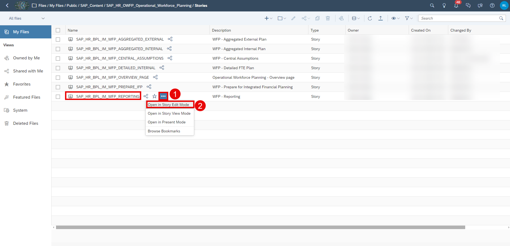

2. Edit the input controls in the **Progress Overview** story tab.

    Right-click on one of the input controls `Progress_Version1` and `Progress_Version2` and click on **Edit Input Control**.

    <!-- border; size:540px -->

3. Click on the **Values** bar to open the version selection menu.

    <!-- border; size:540px -->

4. Add the version `Baseline` to the selection and click on **OK** when done.

    <!-- border; size:540px -->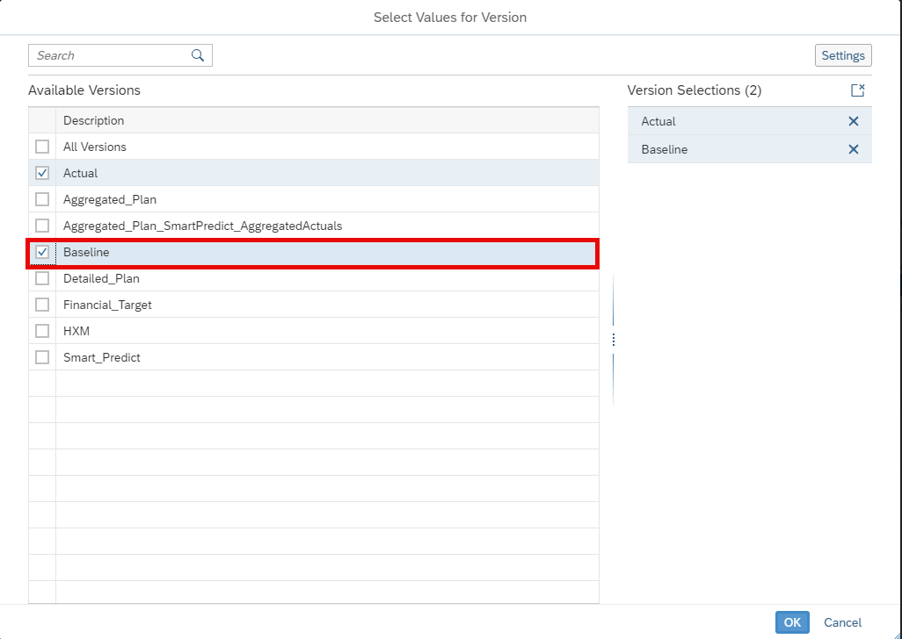

5. Repeat this exercise for both of the widgets.

### Final Remarks
Congratulations! You have now successfully created a new version and embedded it into the stories!

If you want to learn more about the **SAP xP&A Operational Workforce Planning** content package, customize the content and adjust it according to your own business requirements, the following resources might be helpful:

- [xP&A Operational Workforce Planning - Get to know the Operational Workforce Planning Content](xpa-sac-hxm-workforceplanning-gettoknow)
- [xP&A Operational Workforce Planning - Create and Upload Central Assumptions](xpa-sac-hxm-maintain-central-assumptions)
- [xP&A Operational Workforce Planning - Add a new Plan Level](xpa-sac-hxm-add-plan-level)
- [xP&A Operational Workforce Planning - Add a new Cost Type](xpa-sac-hxm-add-cost-type)
- [xP&A Operational Workforce Planning - Add a new Version](xpa-sac-hxm-add-new-version)
- [xP&A Operational Workforce Planning - Create Predictive Scenario](xpa-sac-hxm-create-predictive-scenario)
- [xP&A Operational Workforce Planning - Write back plan positions to SAP SuccessFactors](xpa-sac-hxm-successfactors-writeback)

If you want to get an overview of the entire xP&A Operational Workforce Planning content package, make sure to check out the [Mission](https://developers.sap.com/mission.hxm-workforce-planning.html).

Interested in more xP&A topics and related business content packages? Visit our community page [Extended Planning & Analysis Business Content](https://community.sap.com/topics/cloud-analytics/planning/content).
