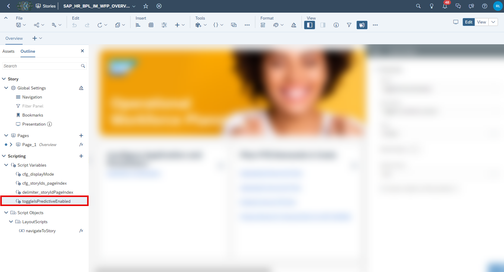
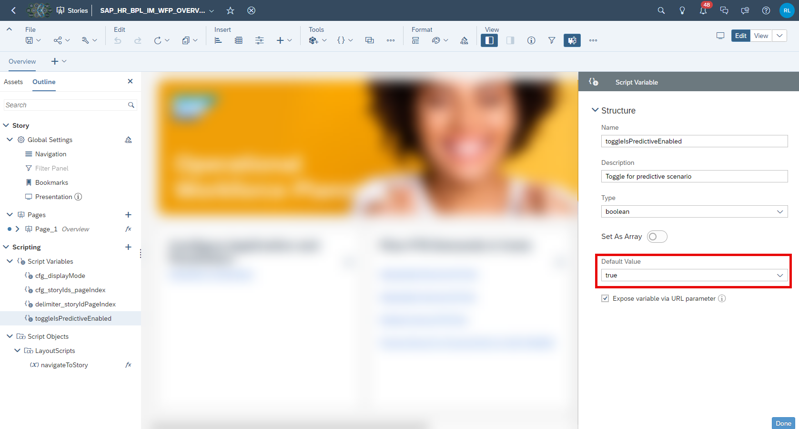
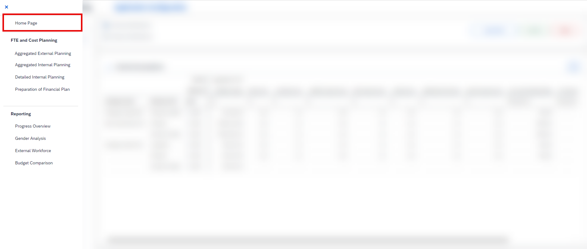
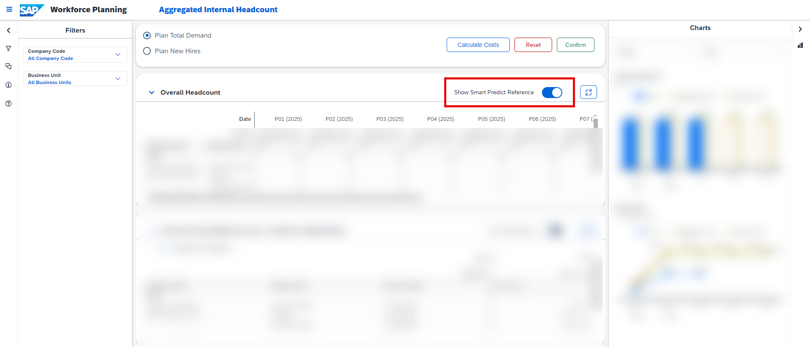

## Prerequisites
- You are familiar with the **xP&A - Operational Workforce Planning** content from the xP&A Business Content Suite. Reference: [Getting Started tutorial](xpa-sac-hxm-workforceplanning-gettoknow)
- You have installed the **xP&A - Operational Workforce Planning** content in an SAP Analytics Cloud tenant. Reference: [Business Content Installation Guide](https://help.sap.com/docs/SAP_ANALYTICS_CLOUD/00f68c2e08b941f081002fd3691d86a7/078868f57f3346a98c3233207bd211c7.html), [Content Package User Guide](https://help.sap.com/docs/SAP_ANALYTICS_CLOUD/42093f14b43c485fbe3adbbe81eff6c8/7032f23e00b34a7ab6d79af20a8792a7.html)  

## You will learn
- The benefits of using **Smart Predict** capabilities in the context of the xP&A Operational Workforce Planning content package for SAP Analytics Cloud
- Which steps are required in order to make Smart Predict work
- This includes...
  -creating and setting up Predictive Scenarios
  -embedding Predictive Scenarios into Multi Actions
  -adjusting the planning applications to enable Smart Predict 

## Intro
In this tutorial you will learn how to create and embed a predictive scenario.

In case you have any questions or require further support, please use the [SAP Question Form](https://community.sap.com/t5/forums/postpage/choose-node/true/product-id/bcbf0782-ce74-43b8-b695-dafd7c1ff1c1/board-id/technology-questions).

If you have a specific request to our team in regards to the business content, you may also submit a request using the [SAP Influence Platform](https://influence.sap.com/sap/ino/#/idea-create?campaign=884&title=Extended%20Planning%20and%20Analysis%3A%20content&tags=Extended%20Planning%20and%20Analysis&RespList=cust.ino.config.SAP_ANALYTICS_CLOUD_SAP_DIGITAL_BOARDROOM.BIZ_CONTENT).

If you are interested in more xP&A topics, related business content packages, or videos showing the content in action, feel free to check out our community page [Extended Planning & Analysis Business Content](https://community.sap.com/topics/cloud-analytics/planning/content).

### Understanding the term Smart Predict
To quote SAP's official definition, [Smart Predict](https://help.sap.com/docs/SAP_ANALYTICS_CLOUD/92a4a76cf6ae454cbf55b73df1cc2f3d/ccf8379080ff443ea20106fb0b95e6e7.html) describes the use of SAP machine learning algorithms to explore relationships in your dataset and build a formula – a Predictive Scenario – to predict future events or trends. Currently, three types of Predictive Scenarios are available in Smart Predict: classification, regression, and time series Predictive Scenarios.

In the context of the [xP&A Operational Workforce Planning Content Package for SAP Analytics Cloud](https://help.sap.com/docs/SAP_ANALYTICS_CLOUD/42093f14b43c485fbe3adbbe81eff6c8/7032f23e00b34a7ab6d79af20a8792a7.html), it is possible to make use of the **time series** Predictive Scenario to pre-populate future planning periods with planning values. In contrast to the standard pre-population functionality which is offered, where all values from one single historical period are copied and pasted to the periods of the plan horizon, the machine learning based algorithm is able to detect patterns in historical data and make more precise and realistic assumptions about what the future could look like. This includes mirroring seasonal cycles, upward or downward trends, fluctuations and much more.  

In the following exercise, you will learn which steps are required in order to create a time series forecast scenario and how to enable Smart Predict capabilities within your planning applications.

>INFORMATION
>
- All of the applications delivered with this content package are already prepared in a way so that you can quickly make use of the Smart Predict capabilities. This also includes the [Multi Actions](https://help.sap.com/docs/SAP_ANALYTICS_CLOUD/00f68c2e08b941f081002fd3691d86a7/69a370e6cfd84315973101389baacde0.html), which are used to start the data preparation for the machine learning algorithm and the time series forecast itself.
- What it left for you to do is to create a **Predictive Scenario** and embed it into the prepared Multi Actions.  
- Please note that a time series forecast can only be performed when enough historical data for training the algorithm is available. 5:1 is a good ratio to estimate the horizon and get predictions with relevant confidence intervals.
- Learn more about time series forecasting in SAP Analytics Cloud in the blog post [Time Series Forecasting in SAP Analytics Cloud Smart Predict and Predictive Planning in Detail](https://blogs.sap.com/2019/10/07/time-series-forecasting-in-sap-analytics-cloud-in-detail/).
- Please also note that the time series forecasting method in the context of this content package can only be used for the aggregated planning scenario.

### Create Predictive Scenario
In the first step, it is necessary to create a new **Predictive Scenario**.

1. In the SAP Analytics Cloud menu, navigate to the **Predictive Scenario** section.

    <!-- border; size:120px -->

2. Select the **Time Series Forecast** predictive model.

    <!-- border; size:400px -->

3. Store your **Predictive Scenario** in the folder where your content package is located or any other location of your choice.

    According to the naming convention, you can call your scenario `SAP__HR_BPL_IM_PredictiveScenario` for instance.

    <!-- border; size:400px -->

### Set Up Predictive Scenario
After saving your Predictive Scenario, a new menu opens up where you can configure your forecast models. Alternatively, you can also find the Predictive Scenario by navigating to the Predictive Scenario menu as shown in the screenshot in step 1 of this tutorial.

Now that the Predictive Scenario object has been created, you need to set it up and make some configurations. Every Plan Level of your data model requires a different set-up. In this step, you will learn how to configure the predictive models for **each of the pre-defined Plan Levels**. Find out more about the term Plan Level in **step 1** of the tutorial [xP&A HXM Workforce Planning - Add a new Plan Level](xpa-sac-hxm-add-plan-level).

1. Create the Predictive Scenario for the Plan Level `PL1` (representing a `CompanyCode`, `Business Unit` and `Division` point of view).

    In order to do so please enter the term `PL1` into the description window and select the `SAP__HR_BPL_IM_WORKFORCE` data model as your time series data source.

    <!-- border; size:300px -->

    After specifying your time series data source, the menu on the right hand side expands.

2. Set up your predictive model for Plan Level **PL1**.

    Please use the following settings in order to setup the forecast model for the Plan Level **PL1**.

    |  Setting                                 | Selection                         |                
    |  :-------------------------------------- | --------------------------------- |
    |  `Description`                           | `PL1`                         
    |  `Time Series Data Source`               | `SAP__HR_BPL_IM_WORKFORCE`      
    |  `Target Measure`                        | `FTE`                  
    |  `Date`                                  | `Date`
    |  `Time Granularity`                      | `by month`
    |  `Number of Forecast Periods`            | `12`
    |  `Entity`                                | `CompanyCode`, `BusinessUnit`, `Division`, `Location`                     
    |  `Filter`                                | `None`                                                
    |  `Train Using`                           | `All observations`                     
    |  `Until`                                 | `Last Observation`                     
    |  `Convert negative values to zero`       | `True`                       
    |  `Influencers`                           | `None`                     

    <!-- border; size:250px -->

3. Save your Predictive Scenario.

    <!-- border; size:300px -->

    Your predictive model for the Plan Level **PL1** has now been created.

    In order to create the predictive models for the remaining Plan Levels, you can use the predictive model of the Plan Level **PL1** as a template.

4. Duplicate the predictive model for Plan Level **PL1**.

    - In order to do so, expand the predictive models menu which is located at the bottom of the page.

    - Click on the **three dots** and duplicate your predictive model

    <!-- border; size:540px -->

5. Select the duplicated model in the menu at the bottom of the page and rename the description of the predictive model from `Based on Predictive Model 1` to `PL2`

    <!-- border; size:300px -->

6. Adjust the configuration of this predictive model according to the definition of Plan Level **PL2**.

    - Change the entities to `Company Code`, `Business Unit` and `Location` only as Plan Level **PL2** represents a  `Company Code`, `Business Unit` (and `Location` in case of external workers) point of view.

    <!-- border; size:250px -->

7. Save your Predictive Scenario.

    <!-- border; size:300px -->

    Your predictive model for the Plan Level **PL2** has now been created.

8. Duplicate the predictive model for Plan Level **PL1** or Plan Level **PL2**.

    - In order to do so, expand the predictive models menu which is located at the bottom of the page.

    - Click on the **three dots** and duplicate your predictive model

9. Select the duplicated model in the menu at the bottom of the page and rename the description of the predictive model to `PL3`

10. Adjust the configuration of this predictive model according to the definition of Plan Level **PL3**.

    - Change the entities to `Company Code`, `Cost Center` and `Location` as Plan Level **PL3** represents a  `Company Code`, `Cost Center` (and `Location` in case of external workers) point of view.

11. Save your Predictive Scenario.

    <!-- border; size:300px -->

    Your predictive model for the Plan Level **PL3** has now been created.

12. Duplicate the predictive model for Plan Level **PL1**, Plan Level **PL2** or Plan Level **PL3**.

    - In order to do so, expand the predictive models menu which is located at the bottom of the page.

    - Click on the **three dots** and duplicate your predictive model

13. Select the duplicated model in the menu at the bottom of the page and rename the description of the predictive model to `PL5`

14. Adjust the configuration of this predictive model according to the definition of Plan Level **PL5**.

    - Change the entities to `Company Code`, `Business Unit`, `JobFamily` and `Location` as Plan Level **PL5** represents a  `Company Code`, `Business Unit`, `JobFamily` (and `Location` in case of external workers) point of view.

15. Save your Predictive Scenario.

    <!-- border; size:300px -->

    Your predictive model for the Plan Level **PL5** has now been created.

### Integrate Predictive Scenarios into Multi Actions
Now that the Predictive Scenario and the different predictive models have been created, the objects need to be integrated into the Multi Actions which are triggered from inside the planning applications.

>INFORMATION:
>
- In contrast to ordinary Data Actions, Multi Actions are capable of performing a chain of activities across various Versions and Data Models
- Generally, Multi Actions can be seen as a sequence of Data Actions, version management steps and predictive steps
- Learn more about [Multi Actions in the SAP Help Portal](https://help.sap.com/docs/SAP_ANALYTICS_CLOUD/00f68c2e08b941f081002fd3691d86a7/69a370e6cfd84315973101389baacde0.html)

1. In the SAP Analytics Cloud Menu, navigate to the **Multi Actions** section.

    <!-- border; size:120px -->

2. Search for the Multi Action `SAP__HR_BPL_IM_WFP_SmartPredict_PL1` and open it.

3. In the next step, add a new Predictive Scenario to the Multi Action by clicking on the binocular icon on the top lane.

    <!-- border; size:300px -->

    The new step will be added at the very bottom of the Multi Action chain.

4. Click on the new Multi Action step and apply the following settings to it:

    |  Setting                                 | Selection                         |                
    |  :-------------------------------------- | --------------------------------- |
    |  `Step Name`                             | `Forecast PL1 FTE`                         
    |  `Predictive Scenario`                   | `SAP__HR_BPL_IM_WFP_PredictiveScenarioHC`      
    |  `Predictive Model`                      | `PL1`                  
    |  `Predictive Action`                     | `Train & Forecast`
    |  `Corresponding Planning Model`          | `SAP__HR_BPL_IM_WORKFORCE`
    |  `Version to save Forecast`              | `Aggregated_Plan_SmartPredictTemporary`

    <!-- border; size:250px -->

5. Duplicate the newly created step by hovering over the predictive step and clicking on the thee dots.

    <!-- border; size:300px -->

6. Rename the description of the new step to `Forecast PL1 FTE (external)`

7. Move both of the newly created Predictive Scenario steps to their correct location inside the Multi Action chain.

    - In order to do so, use the **Move up** function
    - Place the `Forecast PL1 FTE` step in **third** order of the Multi Action chain and the `Forecast PL1 FTE (external)` step in **ninth** order.

    <!-- border; size:120px -->

8. Save your changes.

9. Navigate back to the **Multi Actions** section and open the Multi Action `SAP__HR_BPL_IM_WFP_SmartPredict_PL2`.

    - Repeat **Sub-Step 3** to **Sub-Step 8** of this Step.
    - Please note that you now have to select `PL2` as your predictive model when creating the predictive steps.

      <!-- border; size:300px -->

10. Repeat **Sub-Step 3** to **Sub-Step 8** for the Multi Actions `SAP__HR_BPL_IM_WFP_SmartPredict_PL3` and `SAP__HR_BPL_IM_WFP_SmartPredict_PL5`.

    - For the Multi Action `SAP__HR_BPL_IM_WFP_SmartPredict_PL3` choose `PL3` as your predictive model in your predictive step
    - For the Multi Action `SAP__HR_BPL_IM_WFP_SmartPredict_PL5` choose `PL5` as your predictive model in your predictive step

### Activate Smart Predict in Planning Application
Now that everything has been set up, you need to activate the Smart Predict capabilities inside your planning applications.

Per default, Smart Predict is turned off and thus cannot be triggered when pre-populating the plan version.

1. Open the `SAP_HR_BPL_IM_WFP_OVERVIEW_PAGE` story in **edit mode**.

2. In the **Outline** section on the left-hand side of your development environment, click on the variable `toggleIsPredictiveEnabled`

    <!-- border; size:540px -->

3. Set the default value to `true` as shown in the screenshot and save your changes.

    <!-- border; size:400px -->

    >INFORMATION:
    >
    - If you want to disable the option to pre-populate the planning versions using Smart Predict, set the default value to `false`

### Run the Predictive Algorithm and Review Results
Now that you have set up the Predictive Scenario and activated the Smart Predict capabilities, you can run the predictive algorithm for pre-populating your plan version.

1. Open the `SAP_HR_BPL_IM_WFP_OVERVIEW_PAGE` story.

    >INFORMATION
    >
    It is important to open the `SAP_HR_BPL_IM_WFP_OVERVIEW_PAGE` story first instead of directly jumping to the `SAP_HR_BPL_IM_WFP_CENTRAL_ASSUMPTIONS` story as the parameter you changed in the previous step is transmitted via the overview application. If you opened the central assumptions applications directly, smart predict capabilities would not be activated.

2. Enter the **Application Configuration** story.

    <!-- border; size:540px -->

3. Click on the **Confirm** button and activate the toggle **Initialize Plan Data After Publish**. A new toggle **Use Predictive** will appear below. Activate this toggle and hit the **OK** button in order to run your Predictive Scenario.

    <!-- border; size:540px -->

    >INFORMATION
    >
    Both the traditional pre-population and the Smart Predict based pre-population take place now. The traditional pre-population, where values from one reference period are copied over to the periods of the plan horizon, are written on the `Aggregated_Plan` version as usual. The Smart Predict values on the other hand are written on the `Smart_Predict` version. This way, you will be able to use the values from the `Smart_Predict` version as a reference for your planning assumptions made on the `Aggregated_Plan` version.

4. After the prediction has run through successfully, click on the **Home Page** button in the navigation menu to get back to the overview story.

    <!-- border; size:540px -->

5. Open either the **Aggregated External HC Plan** or the **Aggregated Internal HC Plan** application. In this example, the **Aggregated Internal HC Plan** application is opened.

6. Activate the toggle **Show Smart Predict Reference**.

    <!-- border; size:540px -->

    You are now able to see the results of the time series forecast under the `Smart_Predict` plan version.

### Final Remarks
Congratulations! You have now successfully created a predictive scenario.

If you want to learn more about the **SAP xP&A Operational Workforce Planning** content package, customize the content and adjust it according to your own business requirements, the following resources might be helpful:

- [xP&A Operational Workforce Planning - Get to know the Operational Workforce Planning Content](xpa-sac-hxm-workforceplanning-gettoknow)
- [xP&A Operational Workforce Planning - Create and Upload Central Assumptions](xpa-sac-hxm-maintain-central-assumptions)
- [xP&A Operational Workforce Planning - Add a new Plan Level](xpa-sac-hxm-add-plan-level)
- [xP&A Operational Workforce Planning - Add a new Cost Type](xpa-sac-hxm-add-cost-type)
- [xP&A Operational Workforce Planning - Add a new Version](xpa-sac-hxm-add-new-version)
- [xP&A Operational Workforce Planning - Create Predictive Scenario](xpa-sac-hxm-create-predictive-scenario)
- [xP&A Operational Workforce Planning - Write back plan positions to SAP SuccessFactors](xpa-sac-hxm-successfactors-writeback)

If you want to get an overview of the entire xP&A Operational Workforce Planning content package, make sure to check out the [Mission](https://developers.sap.com/mission.hxm-workforce-planning.html).

Interested in more xP&A topics and related business content packages? Visit our community page [Extended Planning & Analysis Business Content](https://community.sap.com/topics/cloud-analytics/planning/content).
