## Prerequisites
- You have an SAP Analytics Cloud tenant. If this is not the case, get started by requesting a free [SAP Analytics Cloud trial](https://www.sap.com/products/technology-platform/cloud-analytics/trial.html) tenant.
- You have installed the **xP&A - Operational Workforce Planning** content in an SAP Analytics Cloud tenant. Reference: [Business Content Installation Guide](https://help.sap.com/docs/SAP_ANALYTICS_CLOUD/00f68c2e08b941f081002fd3691d86a7/078868f57f3346a98c3233207bd211c7.html), [Content Package User Guide](https://help.sap.com/docs/SAP_ANALYTICS_CLOUD/42093f14b43c485fbe3adbbe81eff6c8/7032f23e00b34a7ab6d79af20a8792a7.html)

## You will learn
- all basics of xP&A Operational Workforce Planning content package for SAP Analytics Cloud 
- how to define the plan horizon, the reference period for the seeding algorithms and the dimensions you want to plan on (step 5)
- how to set up central cost parameters, how to prepare your data for the planning process and how to pre-populate different planning versions using the **Application Configuration** planning story (step 6)
- how to enter your planning assumptions on an aggregated level for internal and external workforce by using the **Aggregated Planning** planning story (steps 7 and 8)
- how to enter your planning assumptions on an employee level for internal workforce using the **Detailed Planning** planning story (step 9)
- how to prepare your plan data for its transfer to the integrated financial planning by using the **Prepare Results for Financial Plan For SAP S/4HANA** planning story (step 10)
- how to check your actual and plan data by investigating your target state and comparing different versions by using the **Reporting** story (step 11)

## Intro
A detailed documentation can be found in our [Content Package User Guide](https://help.sap.com/docs/SAP_ANALYTICS_CLOUD/42093f14b43c485fbe3adbbe81eff6c8/7032f23e00b34a7ab6d79af20a8792a7.html).

In case you have any questions or require further support, please use the [SAP Question Form](https://community.sap.com/t5/forums/postpage/choose-node/true/product-id/bcbf0782-ce74-43b8-b695-dafd7c1ff1c1/board-id/technology-questions).

If you have a specific request to our team in regards to the business content, you may also submit a request using the [SAP Influence Platform](https://influence.sap.com/sap/ino/#/idea-create?campaign=884&title=Extended%20Planning%20and%20Analysis%3A%20content&tags=Extended%20Planning%20and%20Analysis&RespList=cust.ino.config.SAP_ANALYTICS_CLOUD_SAP_DIGITAL_BOARDROOM.BIZ_CONTENT).

If you are interested in more xP&A topics, related business content packages, or videos showing the content in action, feel free to check out our community page [Extended Planning & Analysis Business Content](https://community.sap.com/topics/cloud-analytics/planning/content).

### Access SAC Contents
In this step you will learn how to navigate to the folder which contains all SAP Analytic Cloud content packages.

1. Login to your SAP Analytics Cloud tenant using **Google Chrome**. 

    >INFORMATION:
    >
    In order to get the best experience, it is recommended to use **Google Chrome** as it offers the best compatibility with SAC.
    >
    Other browsers can be used as well but are not supported by SAP.

2. In the SAP Analytics Cloud Menu, navigate to the **Files** section.

    <!-- border; size:300px-->

3. Access the content package folder.

    - You can access the content package folder by either navigating to the `Public` folder first and looking for a folder named `SAP_CONTENT`, or by using the **search function** in the top-right corner.
    - In case you want to make use of the search function, simply enter the term `SAP_CONTENT` into the search bar.

    <!-- border; size:540px -->

    - The folder `SAP_CONTENT` contains all objects required to run SAC content. Here you can find your installed content from the content network provided by SAP.

    <!-- border; size:540px -->

### Access Workforce Planning Content
Now that you learned where all the SAP Analytics Cloud content packages are stored, you need to find the **SAP Human Experience Management (Operational) Workforce Planning** content.

1. Look for the **xP&A Operational Workforce Planning** content package by using the search bar.

    - In order to do so, please use the keyword `xP&A` or `OWFP`
    - In the result list, click on the folder `SAP_HR_OWFP_Operational_Workforce_Planning` with the description `xP&A – Operational Workforce Planning`

    <!-- border; size:540px -->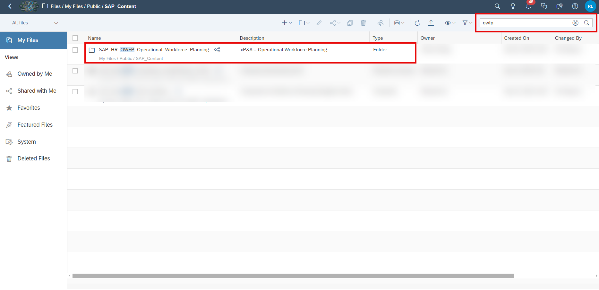

2. Run the Workforce Planning content package.

    - The folder `SAP_HR_OWFP_Operational_Workforce_Planning` contains all objects related to the content package, such as the data model, the stories and all Data Actions.
    - To run the Workforce Planning content, navigate to the **Stories** folder and click on the story called **Operational Workforce Planning - Overview Page** (`SAP_HR_BPL_IM_WFP_OVERVIEW_PAGE`).

    <!-- border; size:540px -->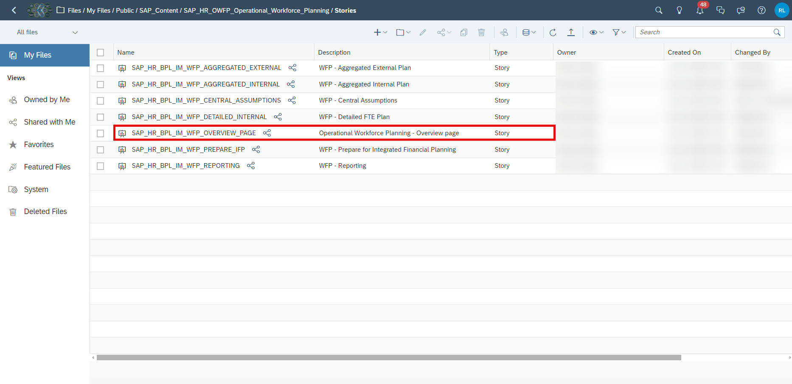

    >INFORMATION:
    >
    - The story `SAP_HR_BPL_IM_WFP_OVERVIEW_PAGE` serves as a starting point and allows you to access all of the other resources during run time.
    - In other words, you do not need to access the remaining stories by manually launching them from the **Files** section. Instead, you can open them from inside the `SAP_HR_BPL_IM_WFP_OVERVIEW_PAGE` story.

### Workforce Planning Content Overview
Before jumping into the different st which are accessible through the landing page of this content package, it is necessary to understand what the individual stories are for and which use cases they cover.

1. **Overview Page**

    <!-- border; size:540px -->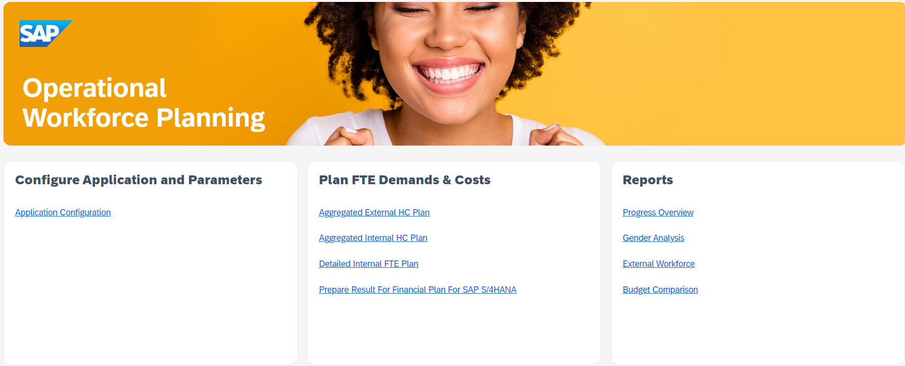

    - By having opened the story **Operational Workforce Planning - Overview Page** (`SAP_HR_BPL_IM_WFP_OVERVIEW_PAGE`), you entered the **Home Screen** of the Workforce Planning content package.
    - The overview story serves as the central entry point for all personas and helps to navigate through the content package.
    - In the lower half of the story, you can see three sections which cluster the different components of the story.
    - Those sections contain hyperlinks, which redirect the responsible persona (e.g. the controller, the HR business partners, the cost center manager or anyone from the finance department) to the relevant story.
    - In addition, this story also provides a high level reporting section in the top-left corner where you see the number of existing headcount, planned hires and the estimated costs for a given year.

2. **Configure Application and Parameters**

    <!-- border; size:540px -->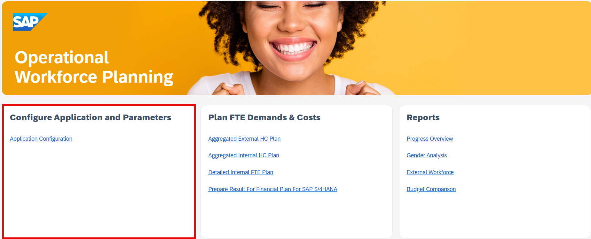

    - The section **Configure Application and Parameters** contains a link to the planning story **Application Configuration** (`SAP_HR_BPL_IM_WFP_CENTRAL_ASSUMPTIONS`)
    - This story marks the start of the planning process and allows you to set up all central cost parameters and assumptions for a plan version of your choice
    - The cost parameters maintained in this story are required for all of the cost calculations which happen in the course of the planning process
    - This story is designed for the controller persona

3. **Plan FTE Demands and Costs**

    <!-- border; size:540px -->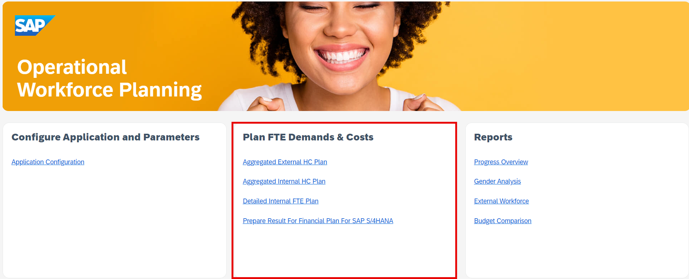

    - The section **Plan FTE Demands and Costs** provides access to different stories which allow you to perform planning activities in the different scenarios.
    - The stories **Aggregated Internal HC Plan** (`SAP_HR_BPL_IM_WFP_AGGREGATED_INTERNAL`) and **Aggregated External HC Plan** (`SAP_HR_BPL_IM_WFP_AGGREGATED_EXTERNAL`) allow you to plan on an aggregated level. These stories are covering use cases of an the HR business partner persona.
    - The story **Detailed Internal FTE Plan** (`SAP_HR_BPL_IM_WFP_DETAILED_INTERNAL`) allows you to plan on an employee level. This story is covering the use cases of a cost center manager persona.
    - Furthermore you can also find a link to the story **Prepare Results For Financial Plan For SAP S/4HANA** (`SAP__HR_BPL_IM_WFP_PREPARE_IFP`) which enables you to prepare your planning results for an integration into the IFP data model part of the [Integrated Financial Planning for SAP S/4HANA (xP&A - Integrated Financial Planning for SAP S/4HANA and S/4HANA Cloud)](https://help.sap.com/docs/SAP_S4HANA_ON-PREMISE/48f4b4785b8e45938ac44a67be8032d9/7ce894bc95f449779fa19d076e67c925.html) content package in order to round up the xP&A scenario. This story is designed to support the tasks of a financial planner responsible for reconciling and integrating the workforce planning process with the integrated financial planning process.

4. **Reporting**

    <!-- border; size:540px -->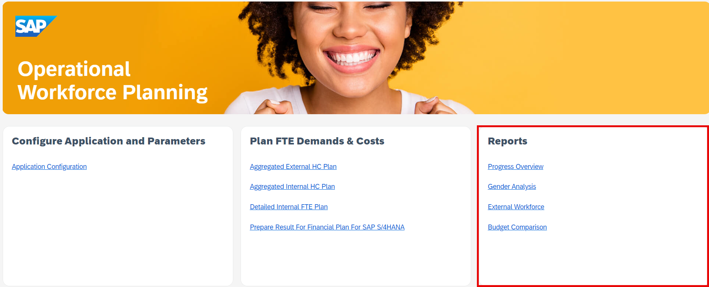

    - The section **Reporting** contains links to different parts of the reporting story `SAP__HR_BPL_IM_WFP_REPORTING`.
    - The reporting story provides standard reports to compare different plans and to provide other valuable insights.

5. **Introduction Video**

    Additionally, you can also check out our two-minute introduction video below to understand the content package better and get a glimpse into the stories.

    

### Navigation Concepts within the Content
As a last preparation step, it is required to understand the navigation concept of the content package in order for you to use it properly. In this step, you will learn about the meaning and the functionality of all the buttons as well as other UI elements.

1. **Navigation Menu** button

    <!-- border; size:540px -->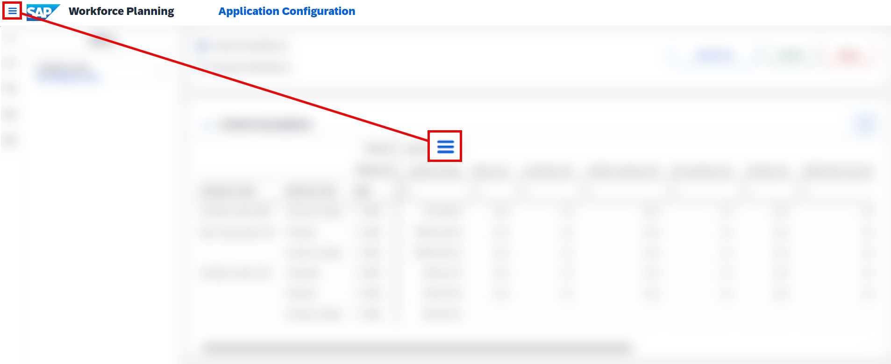

    - Each story apart from the Overview Page (`SAP_HR_BPL_IM_WFP_OVERVIEW_PAGE`) has a **Navigation Menu** button located on the top-left corner
    - By clicking on the **Navigation Menu** button, you can open a menu which contains multiple buttons or hyperlinks. Each of those buttons redirects you to another story of this content package, so you do not necessarily have to always go back to the **Home Page** first.
    
    <!-- border; size:540px -->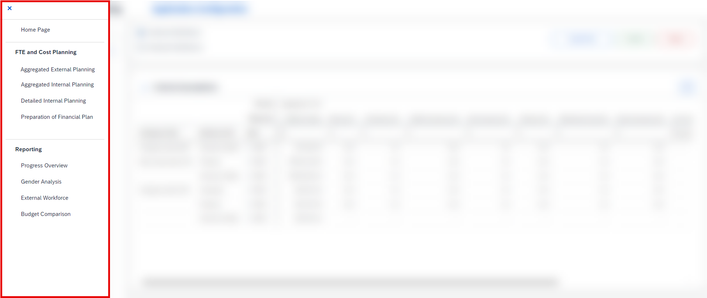

2. **Filter** section

    <!-- border; size:540px -->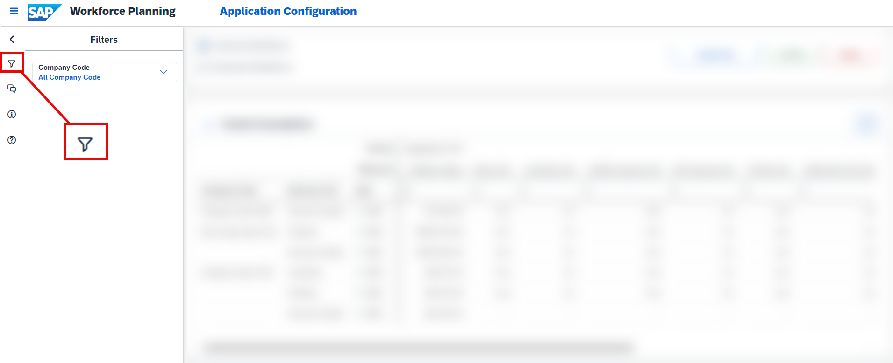

    - This section can be found in all stories apart from the Overview Page (`SAP_HR_BPL_IM_WFP_OVERVIEW_PAGE`) of this content package and can be accessed via the left-side panel. It is indicated by the filter icon.
    - By pressing on the filter button, you can open a filter section which contains input control widgets. These widgets allow you to filter all tables and charts down to specific members of the given dimensions for an eased data entry and reporting.

   - By clicking on the little **arrow icon**, you can collapse the side panel in order to create more space for your planning tables or charts. 

    <!-- border; size:540px -->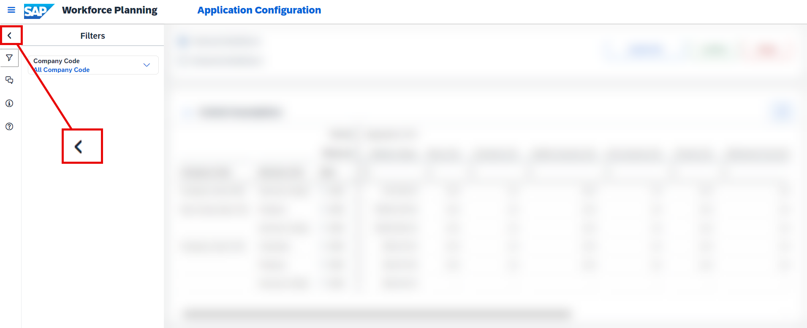

    - You can then reopen the side panel by clicking on the **reversed arrow icon**.

    <!-- border; size:540px -->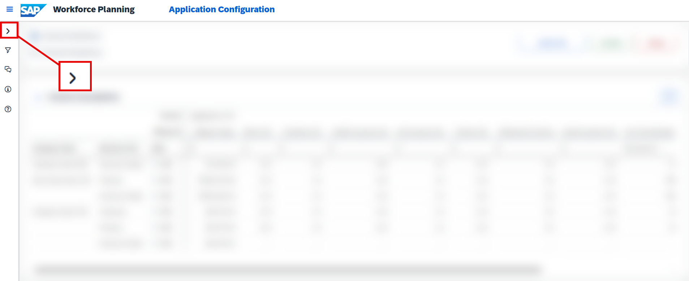

    >INFORMATION:
    >
    - Please note that expanding and collapsing the left-side panel is a feature which is not exclusive to the filter section, but works for all of the functions of the panel. 
  
3. **Instructions** section

    <!-- border; size:540px -->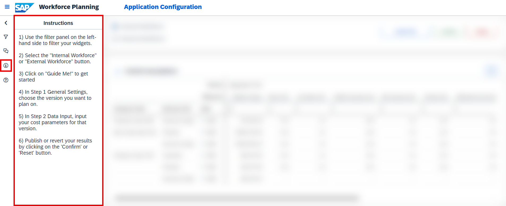

    - This section can be found in all stories apart from the Overview Page (`SAP_HR_BPL_IM_WFP_OVERVIEW_PAGE`) of this content package and can be accessed via the left-side panel. It is indicated by the information icon.
    - The instructions section serves as a rough guideline and describes the intended user workflow within each of the planning and reporting stories.

4.  **Comment** section

    <!-- border; size:540px -->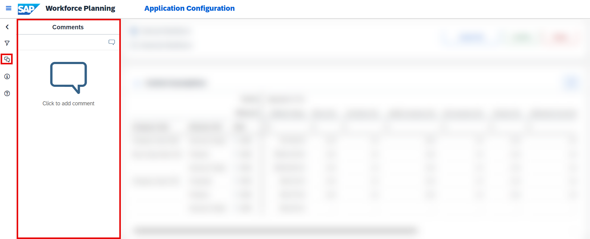

    - This section can be found in all stories apart from the Overview Page (`SAP_HR_BPL_IM_WFP_OVERVIEW_PAGE`) of this content package and can be accessed via the left-side panel. It is indicated by the comment icon.
    - By clicking on the comment icon, the comment panel is opened where you can leave comments for yourself or the other planners. 

5.  **Help** section

    <!-- border; size:540px -->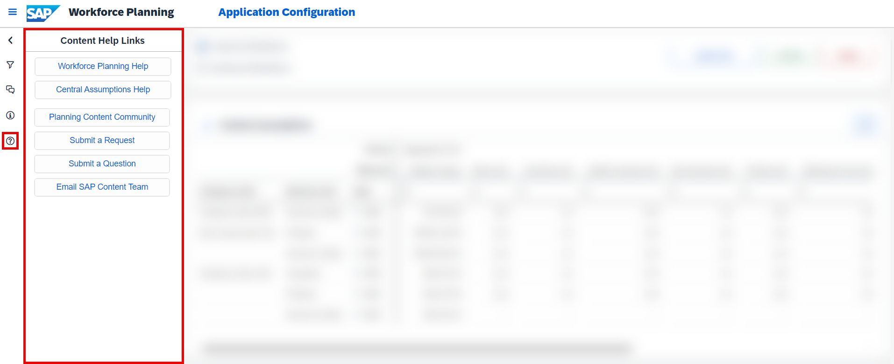

    - This section can be found in all stories apart from the Overview Page (`SAP_HR_BPL_IM_WFP_OVERVIEW_PAGE`) of this content package and can be accessed via the left-side panel. It is indicated by the question mark icon.
    - By clicking on the question mark icon, the help section is opened where you can find useful links related to the content package, such as links to the documentation or links which let you get in contact with the developers of this application. 

6. **Expand / Collapse Section** button

    - These buttons can be found in all stories apart from the Overview Page (`SAP_HR_BPL_IM_WFP_OVERVIEW_PAGE`) and are located at the top-right corner of each available section.
    - The **Expand Section** button (with the arrows pointing to the outside) enlarges a specific section and hides the remaining sections, which is quite useful in case you require more space for the planning tables or reports.

    <!-- border; size:540px -->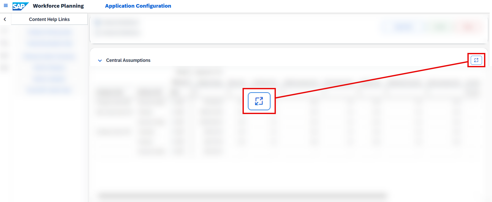

    - The **Expand Section** button changes to a **Collapse Section** button (with the arrows pointing to the center) after entering full screen mode. By pressing the **Collapse Section** button, you can unhide the remaining sections again and return to the default view mode.

    <!-- border; size:540px -->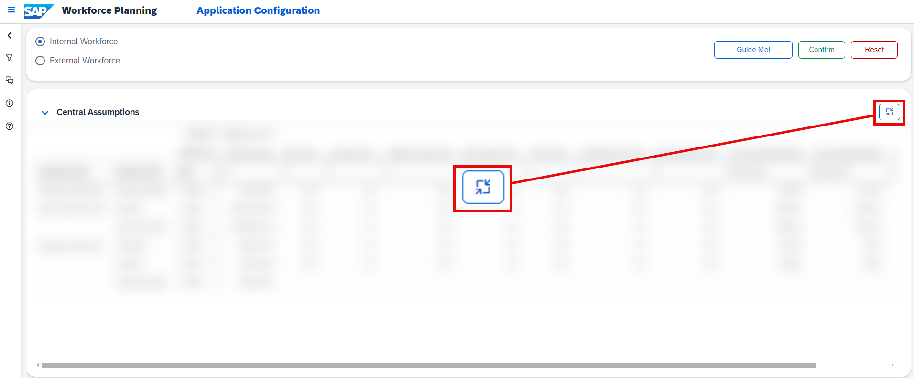

7. **Hide Section / Unhide Section** button

    <!-- border; size:540px -->

    - In case a story contains multiple sections, you can choose to hide specific parts of the story by using the **Hide Section** button or respectively unhide the section by using the **Unhide Section** button. 
    - Both of these buttons can be found on the top left corner of each section.

8. **Confirm** button

    - The **Confirm** button can be found in all planning stories is located at the top-right corner above the tables.
    - The **Confirm** button lets you publish your changes into the public version.

    <!-- border; size:540px -->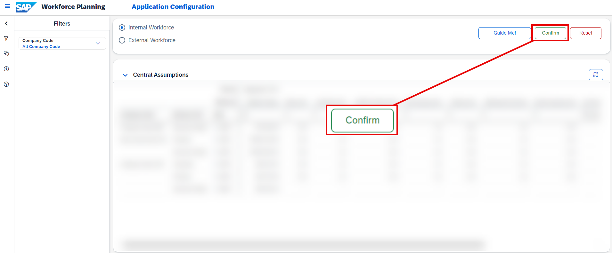

    - Prior to publishing the version you will receive the following pop-up:

    <!-- border; size:200px -->

    >INFORMATION:
    >
    The dialogue in the **Central Assumptions** story may differ a little bit when pressing the **Confirm** button. More details about this can be found in the next step of this tutorial. 

9. **Reset** button
    
    - The **Reset** button can be found in all planning stories is located at the top-right corner above the tables.
    - The **Reset** button lets you revert all unpublished changes of a specific version.
  
    <!-- border; size:540px -->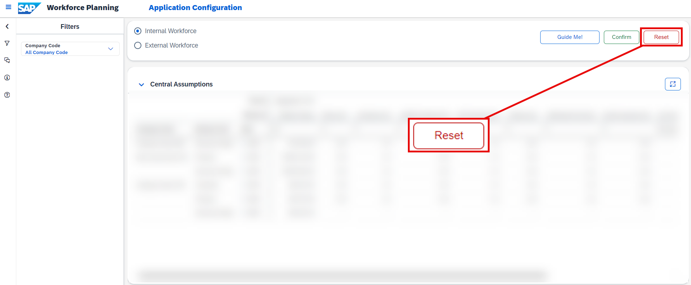

    - Prior to reverting the plan version you will receive the following pop-up:

    <!-- border; size:200px -->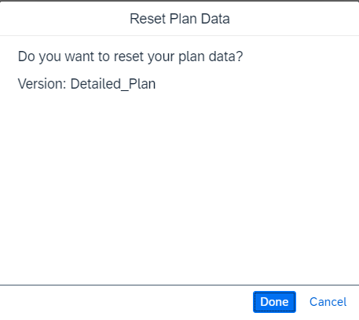

10. **Guide Me** button

    <!-- border; size:200px -->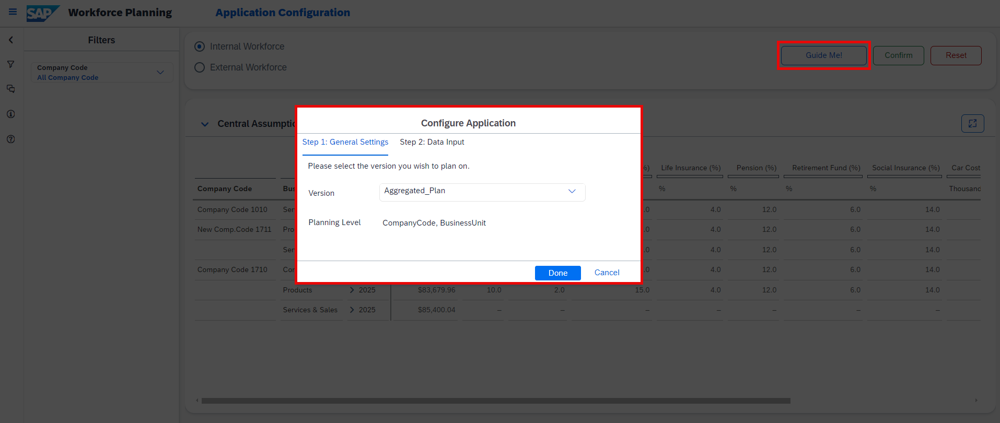

    - The **Guide Me** button can be found in the **Application Configuration** story.
    - By pressing on this button, a dialogue is opened which guides you through all the mandatory the configuration steps. 

11. **Show adjustment** toggle switch

    <!-- border; size:540px -->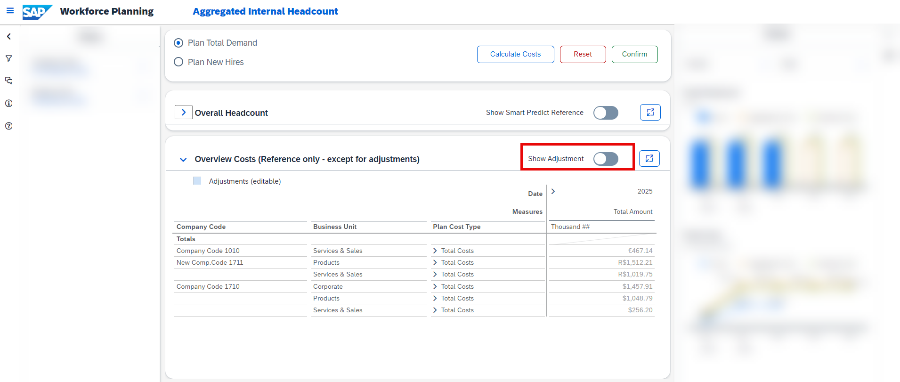

    - This switch can be found in all planning stories located in the **Plan FTE Demands and Costs** section of the `SAP_HR_BPL_IM_WFP_OVERVIEW_PAGE` story and is located next to the cost table
    - By enabling this switch, you can show or hide the additional adjustment column inside the cost table
    - The background color of the cell is indicating whether a certain cell is input enabled (blue) or read only (white)

    >INFORMATION:
    >
    - The **Amount** measure (read only) shows the calculated costs based on the planned HC/FTE values and the cost drivers maintained in the in the central assumptions.
    - On the **Adjustment** measure (input ready) you can enter manual adjustments which are added to the calculated costs.
    - The **Total Amount** measure (read only) shows the sum of the measures **Amount** and **Adjustment**

12. **Calculate Costs** button

    <!-- border; size:540px -->

    - This button can be found in all planning stories which have a cost table and is always located in the header section above the tables.
    - By pressing this button, a recalculation of costs is started. This is necessary when you adjust your headcount or FTE numbers as costs do not automatically refresh after adjusting the headcount or FTE values.

13. **Charts** section

    <!-- border; size:540px -->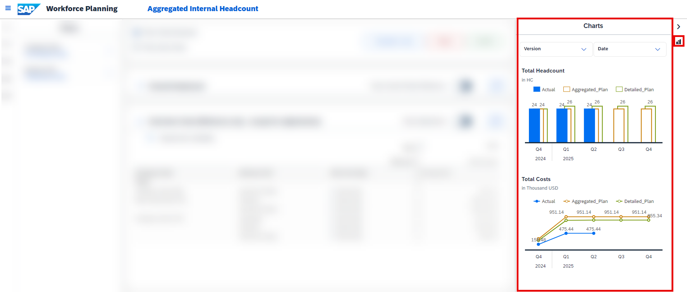

    - Some of the stories have a right-side panel which contain a charts button indicated by a chart icon. 
    - By pressing on this button, you can open an additional section which contains reporting charts that provide you with additional information during your planning activities.

14. **Select Action** drop down

    <!-- border; size:540px -->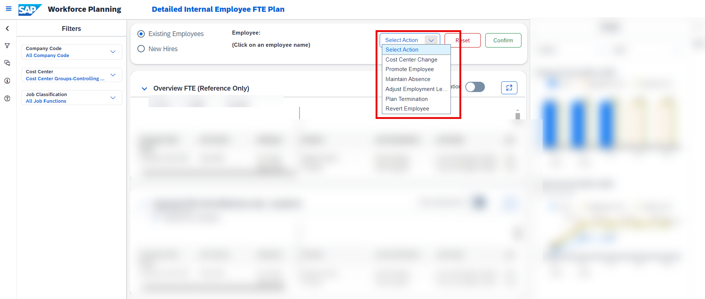

    - This button can exclusively be found in the **WFP - Detailed FTE Plan** story.
    - By pressing on this button, you can select a pre-defined planning activity.

### Pre-configuration of Planning Stories
Before going into the planning stories, you need to make some foundational settings required for the planning activities in the data modeler first.

This is because some of the properties maintained in the data modeler are used for the correct initialization of the planning stories and the widgets inside of them. Making these settings beforehand is highly recommended, so your planning process will not be disrupted by jumping back and forth between the stories and the data modeler.

In this step you will learn which settings must be configured outside the stories in case you do not want to go with the default settings and how this is done. This includes changing the span of the plan horizon (Tab 1), defining the reference period used for the data seeding algorithms (Tab 2), changing the Plan Level (Tab 3) and other possible modifications (Tab 4).

[OPTION BEGIN [Define Planning Horizon]]
Currently, you have opened the tab **Define Planning Horizon**. This tab provides guidance on how to change or define the periods you want to do your planning on.

>INFORMATION:
>
- The term **planning horizon** describes the amount of periods you want to look into the future when preparing your operational plan.
- Per default, the planning horizon is configured to range over a span of 12 periods, starting from period `01.2025` up until period `12.2025`.
- If you want to change the configuration of the planning horizon (for instance because you want to plan more than 12 periods to the future), you can accomplish it by making some slight modifications in the properties of the **Version** dimension.
- By doing that, all the planning tables inside the different planning stories will initialize according to your new definition.

1. Open the Operational Workforce Planning data model

    - In the SAP Analytics Cloud menu, navigate to the **Files** section
    - Look for the Operational Workforce Planning data model by entering the term `SAP__HR_BPL_IM_WORKFORCE` into the search bar
    - Click on the file to open the data model

    <!-- border; size:540px -->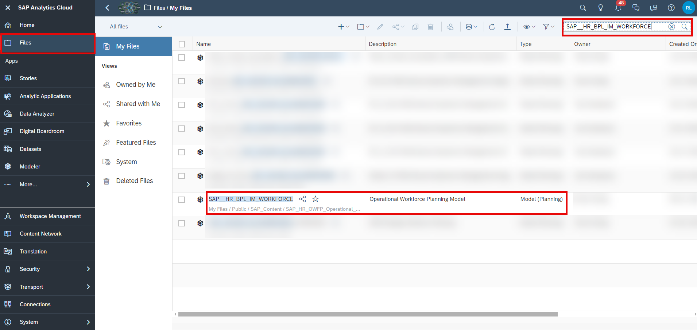

2. Open the **Version** dimension

    - In the data modeler, scroll down to the dimension list and click on the dimension **Version** to modify it

    <!-- border; size:540px -->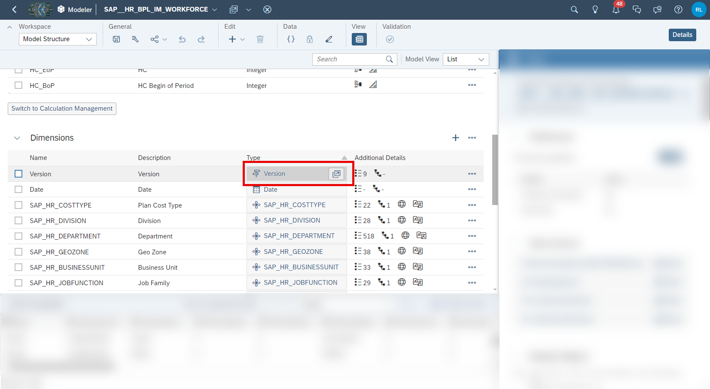

3. Adjust your planning horizon by changing the properties

    - The planning horizon for the different versions is defined by the properties **Start Period of Planning** and **End Period of Planning**.
    - The property **Start Period of Planning** defines the first period of the planning horizon, while the property **End Period of Planning** defines the last period of the planning horizon.
    - In the screenshot shown below, the planning horizon for each of the versions ranges from the period `01.2025` to `12.2025` for instance. As a result, all planning tables inside the planning stories will range from period `01.2025` to period `12.2025`.
    - If you intend to change the span of the planning horizon, please make sure to enter the new period values in a `YYYYMM` format.
    - Please note that the planning horizon must always be a multiple of 12 (for instance ranging over 12,24,36 periods etc.)

    <!-- border; size:540px -->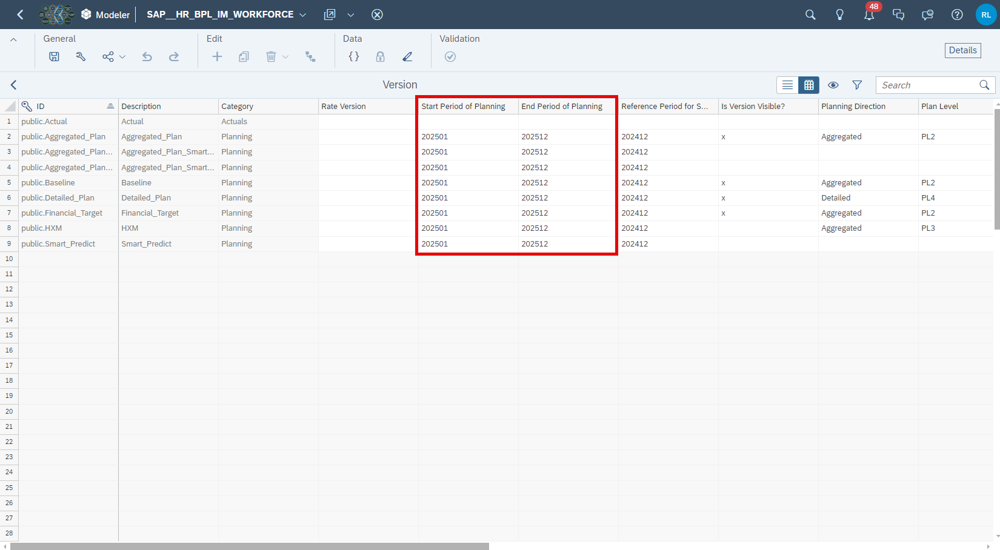

    >INFORMATION:
    >
    - In this tutorial, the planning horizon will not be changed and all upcoming steps are based on the default configuration shown in the above screenshot
    - If you still want to change the planning horizon, please do so for the versions `public.Aggregated_Plan` and `public.Detailed_Plan` as these versions are set as the default plan versions for the stories.

4. Save your changes

[OPTION END]

[OPTION BEGIN [Define Reference Period]]
Currently, you have opened the tab **Define Reference Period**. This tab provides guidance on how to define the reference period used for your data seeding algorithms.

>INFORMATION:
>
- The **reference period** represents one specific period containing historical actual data, which is used by different data seeding algorithms
- In the scope of this content package, there are two data seeding algorithms which are based on this reference period. One of the algorithms is used to derive midpoint salaries, while the other one is used to pre-fill the plan versions with headcount data. Both of the algorithms take the actual data from the reference period and perform data preparation steps on it. More information about these algorithms can be found in the step **Application Configuration**.
- Per default, the reference period is set to the period `12.2024`. This means that your midpoint salaries will be derived based on your `12.2024` actual salary data or respectively that the periods of your planning horizon will be populated based on your `12.2024` headcount data
- If you want to change the configuration of the reference period (for instance because you want to use another period as a baseline), you can do so by modifying a property in the **Version** dimension
- By doing that, the seeding algorithms will use your newly defined reference period as a baseline for pre-populating the affected tables

1. Open the Operational Workforce Planning data model

    - In the SAP Analytics Cloud menu, navigate to the **Files** section
    - Look for the Operational Workforce Planning data model by entering the term `SAP__HR_BPL_IM_WORKFORCE` into the search bar
    - Click on the file to open the data model 

    <!-- border; size:540px -->

2. Open the **Version** dimension

    - In the data modeler, scroll down to the dimension list and click on the dimension **Version** to modify it

    <!-- border; size:540px -->

3. Adjust your reference period by changing the property

    - The reference period used for the seeding algorithms is defined by the property **Reference Period for Seeding**.
    - In the screenshot shown below, the reference period for each of the versions is set to the period `12.2024`. As a result, the seeding algorithms based on this property will take the actual data of the period `12.2024` as a baseline.
    - If you intend to change the reference period, please make sure to enter the new period value in a `YYYYMM` format.
    - Please note that the reference period must contain actual data.

    <!-- border; size:540px -->

    >INFORMATION:
    >
    - In this tutorial, the reference period will not be changed and all upcoming steps are based on the default configuration shown in the above screenshot
    - If you still want to change the reference period, please do so for the versions `public.Aggregated_Plan` and `public.Detailed_Plan` as these versions are set as the default plan versions for the stories

4. Save your changes

[OPTION END]

[OPTION BEGIN [Define Plan Level]]
Currently, you have opened the tab **Define Plan Level**. This tab provides guidance on how to select the Plan Level used for your planning activities.

>INFORMATION:
>
In the scope of this content package, the term **Plan Level** describes the high level point of view which is used by the planner for the planning activities.
>
Per default, the content package comes with five pre-defined Plan Levels, between which you can choose.
>
- The pre-defined Plan Level **PL1** enables the planner to perform planning activities on a `Company Code + Business Unit` aggregation level and is meant to be used in the aggregated planning scenario.
- The pre-defined Plan Level **PL2** enables the planner to perform planning activities on a `Company Code + Business Unit + Division` aggregation level and is meant to be used in the aggregated planning scenario.
- The pre-defined Plan Levels **PL3** and **PL4** enable the planner to perform planning activities on a `Company Code + Cost Center` aggregation level. While Plan Level **PL3** and Plan Level **PL4** provide the same point of view, **PL3** is used for the aggregated planning scenario while **PL4** is used for the detailed planning scenario.
- The pre-defined Plan Level **PL5** enables the planner to perform planning activities on a `Company Code + Business Unit + Job Family` aggregation level and is meant to be used in the aggregated planning scenario.
>
Throughout the entire planning process, planning can only be done on one Plan Level. Thus you need to decide carefully on which dimensions you want to enter your planning assumptions on.
>
If you decide to do your planning on a `Company Code + Business Unit` level for example, you would need to configure the Plan Level **PL1** as your default Plan Level in the **Version** dimension.
>
By doing that, all the planning tables inside the different stories will initialize according to your settings.
>
For more information about the term **Plan Level**, how to create and use new ones, or how to adjust existing ones, please check out the tutorial [xP&A Operational Workforce Planning - Add a new Plan Level](xpa-sac-hxm-add-plan-level)

1. Open the Operational Workforce Planning data model

    - In the SAP Analytics Cloud menu, navigate to the **Files** section
    - Look for the Operational Workforce Planning data model by entering the term `SAP__HR_BPL_IM_WORKFORCE` into the search bar
    - Click on the file to open the data model

    <!-- border; size:540px -->

2. Open the **Version** dimension

    - In the data modeler, scroll down to the dimension list and click on the dimension **Version** to modify it

    <!-- border; size:540px -->

3. Adjust your Plan Level by changing the property

    - The Plan Level configured for the different versions is defined by the property **Plan Level**.
    - In the screenshot shown below, the Plan Level for the version `public.Aggregated_Plan` for instance is set to `PL2`. As a result, all tables of the planning stories using this version will allow you to make entries on a `Company Code + Business Unit` level.
    - If you wanted to do your planning on a `Company Code + Cost Center` level, you would need to change the property from `PL2` to `PL3`
    - Please make sure to enter the technical ID of a valid member of the **Plan Level** dimension when changing the Plan Level (e.g. `PL1`, `PL2`, etc.).

    <!-- border; size:540px -->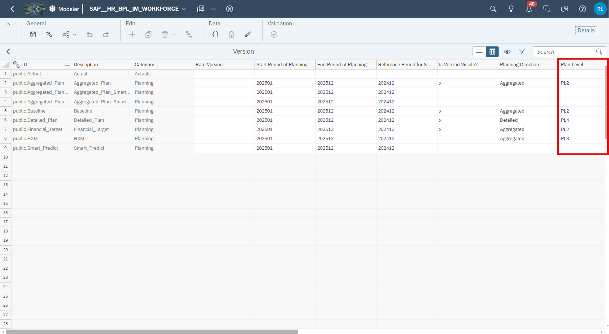

    >INFORMATION:
    >
    - In this tutorial, the Plan Level will not be changed and all upcoming steps are based on the default configuration shown in the above screenshot
    - If you still want to change the Plan Level, please do so for the versions `public.Aggregated_Plan` and `public.Detailed_Plan` as these versions are set as the default plan versions for the stories.

4. Save your changes

[OPTION END]

[OPTION BEGIN [Other Modifications]]
Currently, you have opened the tab **Other Modifications**. This tab provides information about additional customization options.

1. **Visibility of Versions inside the Stories**

    >INFORMATION:
    >
    - Some of the planning stories, such as the **Application Configuration** (`SAP_HR_BPL_IM_WFP_CENTRAL_ASSUMPTIONS`) allow you to select the version you want to work on from inside the story by using a drop down window
    - The versions you can select inside the stories are not selectable per default though. In order to make the versions selectable, you need to mark them inside the data modeler.
    - This can be very useful if you want to deliberately hide certain versions from being modified or if you create your own versions

    - In order to define which version you want to make selectable, enter the **Version** dimension inside the data modeler and modify the property **Is Version Visible?**
    - An `x` indicates that the version will be added to the selection drop down inside the planning stories. A blank cell indicates that the version will not be added to the selection widgets.

    <!-- border; size:540px -->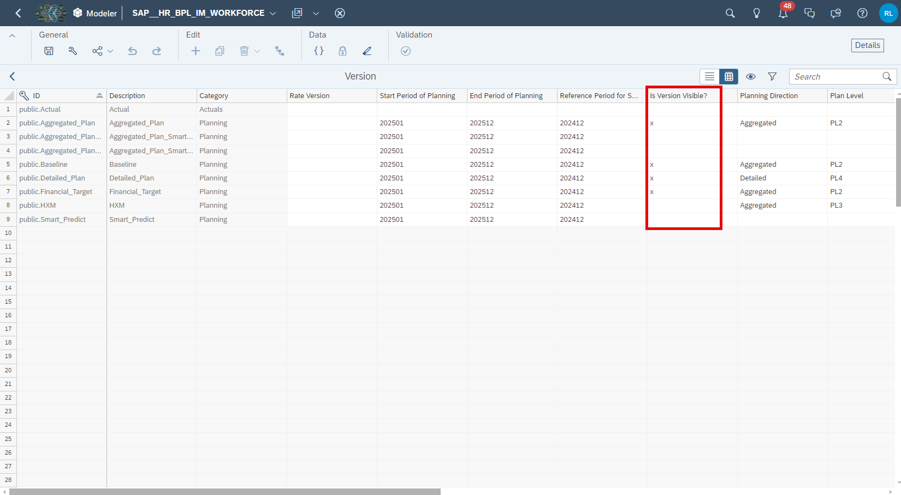

2. **Planning Direction of Versions**

    >INFORMATION:
    >
    - You may have noticed that the **Version** dimension contains one last property called **Planning Direction**
    - This property indicates whether the version is used for the aggregated planning scenario or the detailed planning scenario
    - The aggregated planning scenario is covered by the stories **Aggregated Internal HC Plan** (`SAP_HR_BPL_IM_WFP_AGGREGATED_INTERNAL`) and **Aggregated External HC Plan** (`SAP_HR_BPL_IM_WFP_AGGREGATED_EXTERNAL`), while the detailed planning scenario is covered by the story **Detailed Internal FTE Plan** (`SAP_HR_BPL_IM_WFP_DETAILED_INTERNAL`)
    - This property needs to be maintained in order to initialize the planning stories correctly

    - In order to define which version represents which planning scenario, enter the **Version** dimension inside the data modeler and modify the property **Planning Direction**
    - Allowed entries are `Aggregated`, `Detailed` or blank.
    - The property `Aggregated` indicates that the version is used for the aggregated planning scenario, while `Detailed` is used for the detailed planning scenario. A blank cell indicates that this version is not relevant for any of those scenarios, i.e. because it is just a backup version or a temporary version for any kind of activity.

    <!-- border; size:540px -->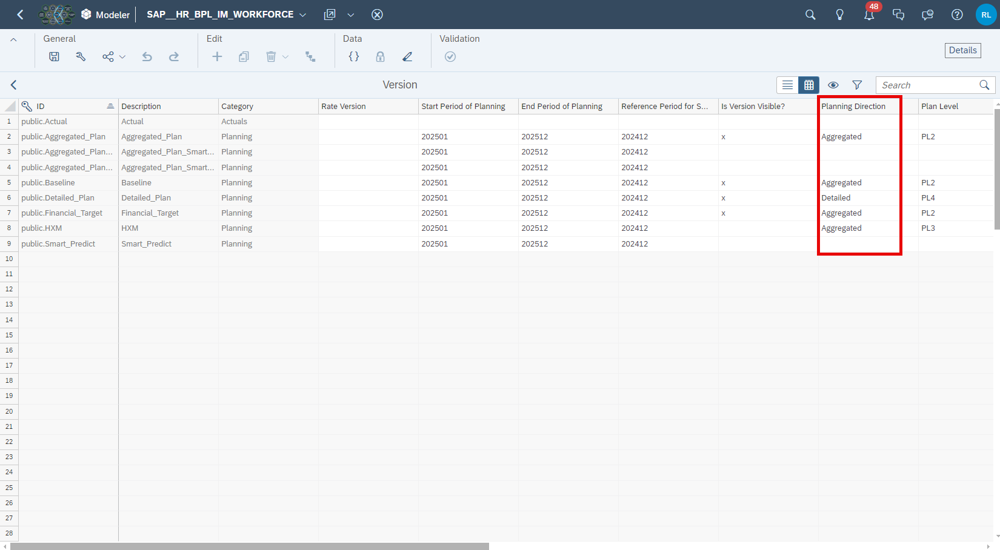

3. **Planning Direction of Plan Levels**

    >INFORMATION:
    >
    - Similar to the **Version** dimension, the **Plan Level** dimension also contains a property called **Planning Direction**
    - This property indicates whether the Plan Level is used for the aggregated planning scenario or the detailed planning scenario
    - As per default definition, you can see that all pre-defined Plan Levels apart from `PL4` are categorized as `Aggregated` while `PL4` itself is categorized as `Detailed`
    - This property needs to be maintained in case you want to change the definition of the Plan Levels or when you add new ones

    - In order to map the Plan Levels to the aggregated planning scenario or the detailed planning scenario, enter the **Plan Level** dimension inside the data modeler and modify the property **Planning Direction**
    - Make sure to enter either the value `Detailed` or `Aggregated` for each of the members

    <!-- border; size:540px -->

4. **Definition of Plan Levels**

    >INFORMATION:
    >
    - In the **Plan Level** dimension, you can find a property called **Plan Dimensions**
    - This property defines which dimensions are covered by the different Plan Levels
    - Per default, each Plan Level contains the **Company Code** dimension automatically. Thus it must not be specified here.
    - If you wanted to do your planning on a `Company Code + Cost Center` level, you would need to add the term `costCenter` into the **Plan Dimensions** property of the respective Plan Level, as it is the case for the Element-ID `PL3`.

    - In order to learn how to maintain this property correctly and how to change or create a new Plan Level, check out the tutorial [xP&A Operational Workforce Planning - Add a new Plan Level](xpa-sac-hxm-add-plan-level)

    <!-- border; size:540px -->

5. **Maintenance of G/L Accounts for Financial Integration**

    >INFORMATION:
    >
    - In order to integrate the final results from your workforce plan into your financial plans, you need to establish a mapping between the members of the **Cost Type** dimension and the members of the **G/L Account** dimension.
    - This can be done by modifying the `GL_Account` property of the **Cost Type** dimension
    - If you do not maintain a valid mapping between those two entities, you will not be able to transfer your results to your financial plan

    - Enter the **Cost Type** dimension (`SAP_HR_COSTTYPE`) inside the data modeler
    - For each leaf member of the dimension, enter a valid G/L account number into the GL account property (`GL_Account`)
    - Make sure that the G/L account number you enter is a valid member of the public G/L account dimension `SAP_FI_IFP_GLACCOUNT`

    <!-- border; size:540px -->

6. **Creation and Usage of own Versions**

    >INFORMATION:
    >
    - This content packages comes with a couple of pre-defined plan versions
    - Per default, the version `public.Aggregated_Plan` is utilized in the stories **Aggregated Internal HC Plan** (`SAP_HR_BPL_IM_WFP_AGGREGATED_INTERNAL`) and **Aggregated External HC Plan** (`SAP_HR_BPL_IM_WFP_AGGREGATED_EXTERNAL`) representing the aggregated planning scenario
    - The version `public.Detailed_Plan` is used in the story **Detailed Internal FTE Plan** (`SAP_HR_BPL_IM_WFP_DETAILED_INTERNAL`) representing the bottom-up planning scenario
    - The other stories allow you to select between one of these pre-defined versions
    - If you want to use your own version, you need to create one beforehand

    - Find out how to create a new version in the tutorial [xP&A Operational Workforce Planning - Add a new Version](xpa-sac-hxm-add-new-version)

[OPTION END]

### Application Configuration
Now that you are familiar with the basics and the navigation concept, you will learn in more detail how to use the different planning stories.

This step focuses on the **Application Configuration** (`SAP_HR_BPL_IM_WFP_CENTRAL_ASSUMPTIONS`) story.

You will learn how to open the story (Tab 1), how to setup the parameters and the planning baseline (Tab 2) and how to populate the pre-delivered versions with plan data (Tab 3).

If you are interested in a short demo visualizing all of this, please check out the following video **Operational Workforce Planning: Configuration**:

[OPTION BEGIN [Open Application]]
Currently, you have opened the tab **Open Application**. This tab provides guidance on how to open the **Application Configuration** (`SAP_HR_BPL_IM_WFP_CENTRAL_ASSUMPTIONS`) story.

1. In the **Overview Page** story, click on the **Application Configuration** link

    <!-- border; size:540px -->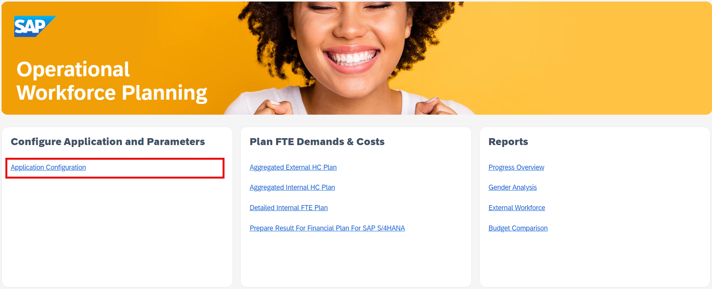

    >INFORMATION:
    >
    - The **Application Configuration** planning story serves as a central place to set up cost parameters for each of the pre-defined cost types and versions
    - Maintaining those cost parameters is an important part of the planning process as all cost estimations are based on the entries made inside the story
    - Furthermore it provides you with the possibility to pre-populate and initialize the plan versions with headcount and cost data
    - In order to do so, you can choose between two seeding algorithms. You can either select one period and use this period as a reference for populating all plan periods, or run a machine learning algorithm based on historical data for a more dynamic approach

2. Get an overview of the story

    <!-- border; size:540px -->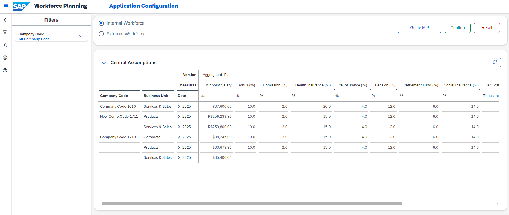

    - Make yourself familiar with the story
    - Try to identity the different buttons and elements presented in the previous step

3. Check the **Instructions** section

    <!-- border; size:540px -->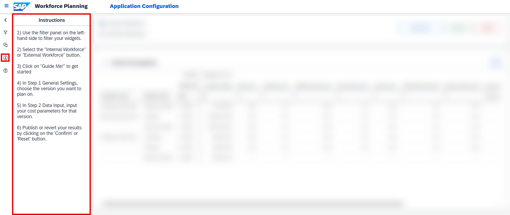

    - All planning stories provide a short in-built step by step guide which helps you to use the corresponding story correctly
    - Before using the story, make sure to check the **Steps** description field to understand the intended workflow

You may now switch to the second tab **Setup Application**.

[OPTION END]

[OPTION BEGIN [Setup Application]]
Currently, you have opened the tab **Setup Application**. This tab provides guidance on how to setup the planning baseline and the cost parameters.

1. Click on the **Guide Me!** button to start with the planning process

    <!-- border; size:540px -->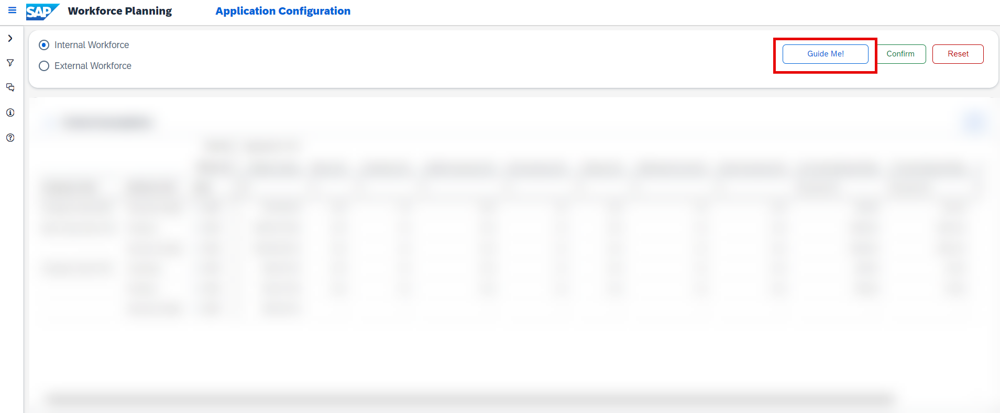

    - As suggested in the **Steps** description field, start the planning process by pressing on the **Guide Me!** button
    - This button opens a pop-up which guides you through the setup process and helps you to decide between different options to maintain your cost parameters

2. Select the version you want to plan on

    <!-- border; size:350px -->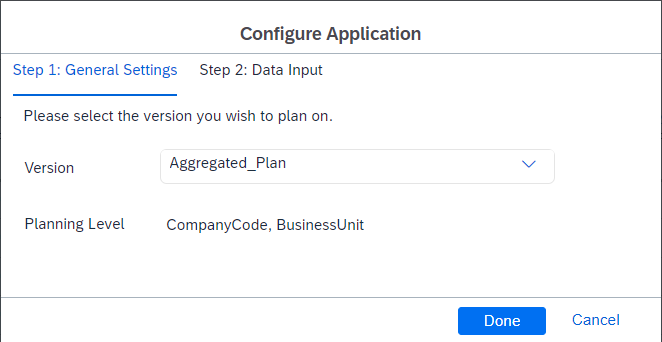

    - In the tab **Step 1: General Settings** of the pop-up, you can decide which version you want to do your planning on
    - Choose either the version `Aggregated_Plan` if you want to plan on an aggregated level or `Detailed_Plan` if you want to plan on an employee level

    >INFORMATION:
    >
    - Per default, the version `Aggregated_Plan` is utilized in the stories **Aggregated Internal HC Plan** (`SAP_HR_BPL_IM_WFP_AGGREGATED_INTERNAL`) and **Aggregated External HC Plan** (`SAP_HR_BPL_IM_WFP_AGGREGATED_EXTERNAL`), while the version `Detailed_Plan` is used in the story **Detailed Internal FTE Plan** (`SAP_HR_BPL_IM_WFP_DETAILED_INTERNAL`)
    - If you want to use your own version, you need to create one beforehand. Find out how to create a new version in the tutorial [xP&A Operational Workforce Planning - Add a new Version](xpa-sac-hxm-add-new-version)

3. Change the Plan Level if required

    - Furthermore you can see which **Plan Level** is currently configured in the same tab inside the pop-up
    - In this specific example, the Plan Level is set to `Company Code + Business Unit`, which means that you will do your planning on a company code and business unit level
    - If you want to change your Plan Level, you can do so by modifying the **Plan Level** property of the **Version** dimension inside the data modeler. Please refer to the step **Pre-configuration of Planning Applications** in order to look up how to change the Plan Level.

4. Decide for a method to load the data in

    <!-- border; size:350px -->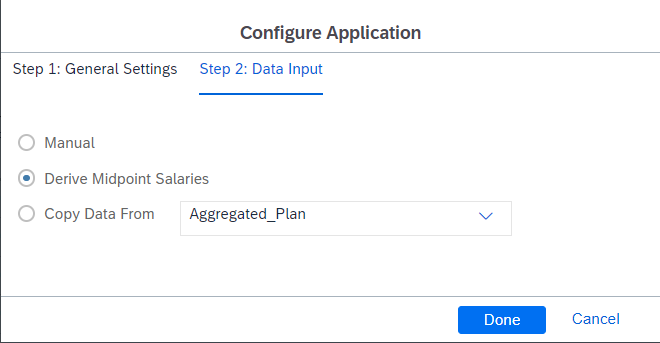

    - Switch over to the second tab **Step 2: Data Input** of the pop-up
    - Here you can select between three different modes to load your central assumptions
    - The mode **Manual** will not perform any calculation as it indicates that you want to upload the data manually. In the tutorial [xP&A Operational Workforce Planning - Create and Upload Central Assumptions](xpa-sac-hxm-maintain-central-assumptions) you can learn how to manually create and upload these cost parameters.
    - The mode **Derive Midpoint Salaries** will derive the midpoint salaries based on a reference period. The remaining cost parameters, such as the bonus rate, travel costs etc. must be entered manually afterwards.
    - The mode **Copy Data From** allows you to copy central assumptions from another version. This is useful in case you have already maintained your central assumptions on another version.
    - Click `Done` to close the dialogue

    >INFORMATION:
    >
    - When deriving midpoint salaries, make sure you have a reference period maintained in the **Reference Period for Seeding** property of the **Version** dimension for your specific version
    - Also make sure you have your plan horizon set up correctly. You can do so by modifying the properties **Start Period of Planning** and **End Period of Planning** for your specific version inside the **Version** dimension.
    - This seeding algorithm will take the base salaries of the defined reference period, aggregate them to the dimensions of the specified Plan Level and form an average to derive the midpoint salaries for each existing combination of `Company Code` and `Cost Center` (representing Plan Level `PL3`).
    - Afterwards this result will be used to pre-populate the midpoint salary measure for your central assumptions, while the results are written to the periods covered by your defined plan horizon

    - You can now also perform changes on your data inside the planning table

    <!-- border; size:540px -->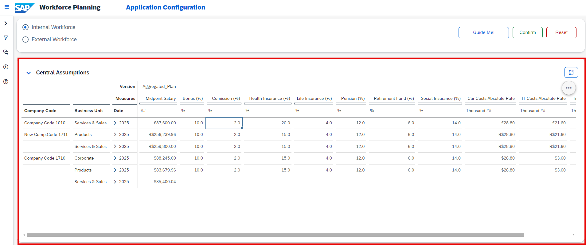

    >INFORMATION:
    >
    - There are three kind of measures that are maintained in the Central Assumptions
    - The midpoint salary represents the average salary for a new hire. Thus, please make sure to enter an absolute value here.
    - Percent rates like the **Bonus (%)** or the **Health Insurance (%)** represent percentage values. These are multiplied with the monthly salary of an existing employee or the midpoint salary in case of a new hire.
    - Absolute rates like **travel costs** are absolute per capita rates and are added to the total costs during the cost calculations. Please make sure to provide an absolute value here as well.

5. Change the planning mode from **Internal Workforce** to **External Workforce**

    The content package provides you with the opportunity to not only plan costs for internal workforce, but also for external workforce.

    As the input table for external workforce is structured slightly different from the one used for internal workforce, you need to change the input mode inside the story.

    <!-- border; size:540px -->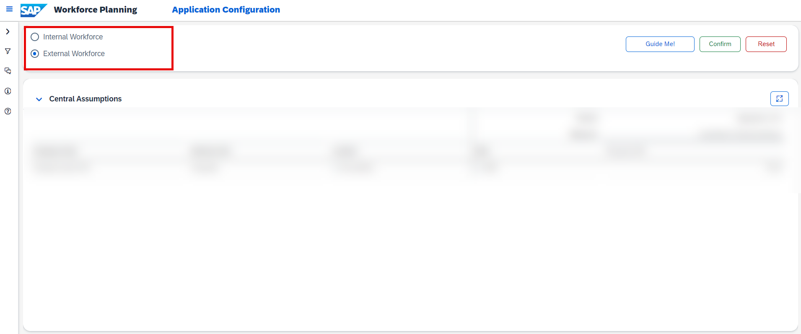

    - Change the toggle in the header section to **External Workforce**
    - The story will now restructure the layout and the planning table accordingly

 6. Set up parameters for external workforce

    - In general, the maintenance of cost parameters for external workforce is the same as for internal workforce
    - The only difference is that for external workforce, only one cost parameter is available, which is the monthly average cost rate `Cost Rate For External Workers`. Make sure to enter an absolute value here.
    - Furthermore, the location dimension as mandatory dimension for external workforce is automatically added in addition to the dimensions defined by the Plan Level

    <!-- border; size:540px -->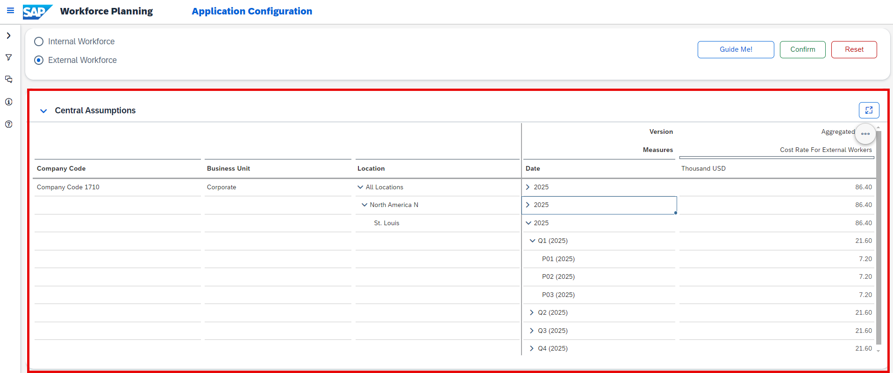

Now that you have set everything up, you can publish your data and pre-populate your plan version with plan data. You can now switch to the tab **Publish and Populate Version**.

[OPTION END]

[OPTION BEGIN [Publish and Populate Version]]
Currently, you have opened the tab **Publish and Populate Version**. This tab provides guidance on how to publish your entries and pre-populate your plan version.

1. Press on the **Confirm** button

    <!-- border; size:540px -->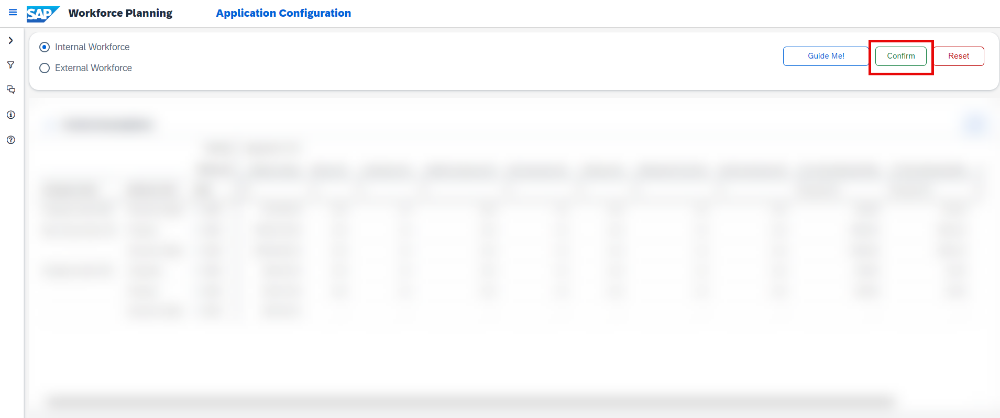

    - If you have finished maintaining the cost parameters and would like to publish them, you can do so by pressing on the **Confirm** button.
    - Hitting this button also provides you with the possibility to initialize your plan version and pre-populate the plan periods with headcount and cost data.

    >INFORMATION:
    >
    - By publishing the version, all other users will be able to see your edits in the version you were working on (in case they have sufficient rights to view the respective data slices of course)
    - As soon as you start editing a public version, a private version is created in the background, which only you can see. All edits you do, are done on this private version. Thus your work-in-progress is only visible to you.
    - It is possible to leave the story and resume your work on another day without losing your progress
    - Only after publishing the version, your changes will be written to the public version and will be visible to all other users
    - Not publishing your data would result in other users not being able to retrieve the cost parameters for their cost calculations in this scenario.  
    - Learn more about the concept of planning on public versions in our [SAP Help Portal](https://help.sap.com/docs/SAP_ANALYTICS_CLOUD/00f68c2e08b941f081002fd3691d86a7/b6e3d093988e4c3eba7eb6c1c110e954.html?q=version)

2. Check your selection for correctness
    - In the pop-up, check whether your current selection is correct
    - If this is the case, your data will be published on the displayed version and Plan Level.

3. Enable the toggle switch **Initialize Plan Data After Publish**

    <!-- border; size:300px -->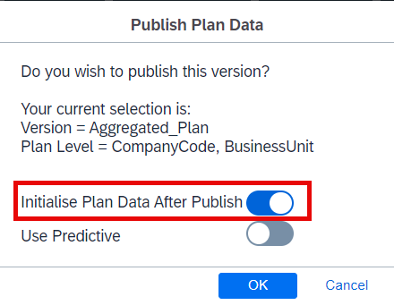

    - By enabling the toggle switch `Initialize Plan Data After Publish`, your plan version will also be pre-populated with headcount and cost data (in case central assumptions for the given plan level are maintained). The headcount and cost data will be visible in the tables of the other planning stories, which will be introduced in the next steps of this tutorial.
    - If you do not enable this toggle switch, only your edits for the central assumptions will be made visible. The headcount and cost planning tables inside the other planning stories will not be filled with data.

    >INFORMATION:
    >
    - Disabling the toggle switch generally only makes sense if you have already started with your planning but need to adjust a cost rate for a specific company code mid planning for example. This way, your progress will not be overwritten when publishing your changes in the central assumptions.
    - When initially starting the planning process on the other hand, is recommended to enable the toggle switch. By doing so, you will already have pre-filled planning tables where you only need to make some slight adjustments instead of filling it with data manually from scratch.
    - The pre-population algorithm for the initialization takes the actual headcount data from the defined **reference period**, aggregates it to the dimensions of the selected **Plan Level** and copies the results to the periods of the defined **planning horizon**. For the cost estimation, the cost parameters from the central assumptions are taken. Please note that for existing headcount, the actual base salary is taken for the calculation of the salaries, while for new headcount the midpoint salaries are taken as a baseline
    - Both the reference period as well as the planning horizon can be modified by changing the properties of the **Version** dimension in the data modeler
    - Please note that the pre-population should only be executed on one combination of **Version** and **Plan Level** as otherwise, values will be duplicated in the comparison charts and reporting stories

4. Enable the toggle switch **Use Predictive**

    <!-- border; size:300px -->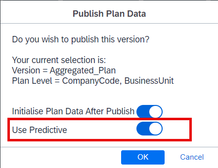

    - By turning on this switch, a machine learning algorithm will be executed in addition to the reference period based pre-population algorithm, which will write the results on a pre-defined version called `Smart_Predict`
    - This version can later be displayed in the planning stories and used as a reference when entering your planning assumptions

    >INFORMATION:
    >
    - Please note that this function is only available for the aggregated planning scenario
    - In order to be able to use this function, you must furthermore enable the Smart Predict capabilities beforehand
    - Please check out the tutorial [xP&A Operational Workforce Planning - Create Predictive Scenario](xpa-sac-hxm-create-predictive-scenario) to learn how to enable those capabilities.

5. Confirm your selection

    - In the pop-up, press on the button `OK`
    - Click on the Multi Action trigger to start the pre-population process

    <!-- border; size:300px -->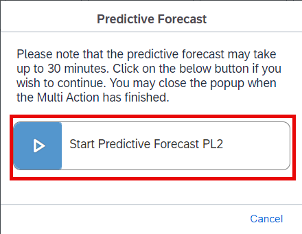

    >INFORMATION:
    >
    If the toggle **Use Predictive** is disabled, the pre-population will start immediately after clicking on the `OK` button of the pop-up

[OPTION END]

### Aggregated Internal HC Plan
As you have now maintained all relevant cost parameters and pre-populated the plan version with plan data, you can continue with the actual planning activities.

In this step, the **Aggregated Internal HC Plan** story of this content package is introduced.

You will learn how to open the planning story (Tab 1) and how to maintain plan values for your internal workforce by entering the total headcount demand (Tab 2) or alternatively by planning the amount of hires and terminations (Tab 3).

If you are interested in a short video demonstrating all of this, please check out the following content:

[OPTION BEGIN [Open Application]]
Currently, you have opened the tab **Open Application**. This tab provides guidance on how to open the **Aggregated Internal HC Plan** (`SAP_HR_BPL_IM_WFP_AGGREGATED_INTERNAL`) story.

1. Navigate back to the overview story `SAP_HR_BPL_IM_WFP_OVERVIEW_PAGE` by using the **Navigation Menu**.

2. Click on the link **Aggregated Internal HC Plan** located inside the **Plan FTE Demands and Costs** section

    <!-- border; size:540px -->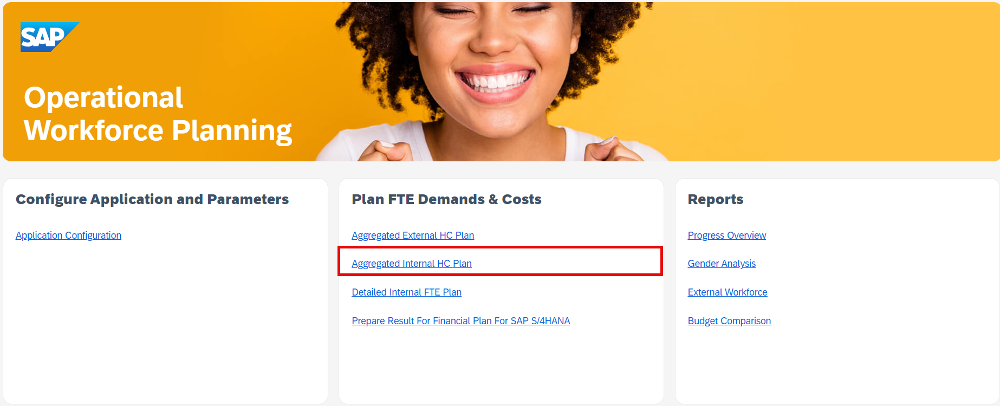

    >INFORMATION:
    >
    - This story allows you to perform planning activities on an aggregated level for internal workforce.
    - You can either plan the total headcount (amount of hires and terminations will then be automatically calculated), or plan the amount of new hires and terminations (total headcount will then be automatically calculated)

3. Get an overview of the story

    <!-- border; size:540px -->

    - The story consists three sections. In the top section (header section), you can find a high level reporting area where you can compare your current plan version with other versions.
    - In the middle of the screen, you can see the headcount planning table. Here you can enter headcount values on an aggregated level.
    - In the lower section you can find a cost table where you can view the calculated costs as well as make manual adjustments.
    - The tables initialize automatically based on the configuration of the **Plan Level** property of the **Version** dimension.

You may now switch to the second tab **Enter Plan Data : Total Headcount** or to the third tab **Enter Plan Data : Delta Headcount** to learn how to enter your planning assumptions.

[OPTION END]

[OPTION BEGIN [Enter Plan Data : Total Headcount]]
Currently, you have opened the tab **Enter Plan Data : Total Headcount**. This tab provides guidance on how to plan headcount values (by entering the total headcount), how to calculate and adjust costs and how to use the version management.

1. Adjust headcount values in the headcount planning table

    - According to the **Instructions** section, start your activities by adjusting your headcount values
    - You may adjust the headcount values separately in each cell, or make use of the drag and drop functionality in order to speed up your process

    <!-- border; size:540px -->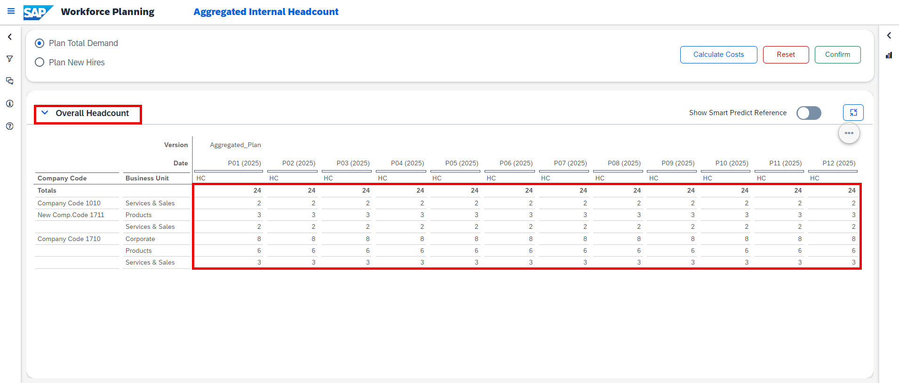

    >INFORMATION:
    >
    - The headcount values shown in the table are calculated by the pre-population algorithm which was triggered in the **Application Configuration** story
    - If you additionally enabled the Smart Predict based pre-population in the seeding step, you can also display the machine learning results by enabling the toggle switch **Show Smart Predict Reference** located on the top-right corner of the planning table. Please note that this toggle switch will only be visible, if Smart Predict capabilities have been activated.

    - In case Smart Predict capabilities have been activated, enable the toggle switch **Show Smart Predict Reference** to display the machine learning based results. These can be taken as a reference for your planning assumptions.

    <!-- border; size:540px -->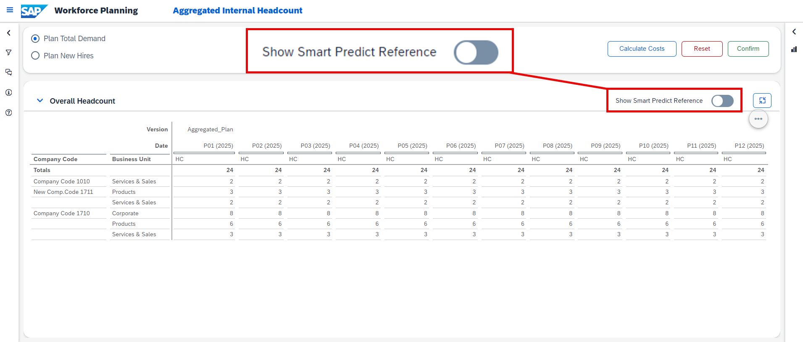

2. Recalculate costs

    - Click on the button **Calculate Costs** located on the top-right corner of the cost table

    >INFORMATION:
    >
    - As you changed your headcount values, the pre-calculated costs in the lower table do not match with the planned headcount values anymore
    - Thus you need to trigger a recalculation in order to refresh the numbers.

3. Enter additional costs for the internal workforce

    - Click on the toggle switch **Show Adjustment**
    - Enter additional costs in the `Adjustment` column

    <!-- border; size:540px -->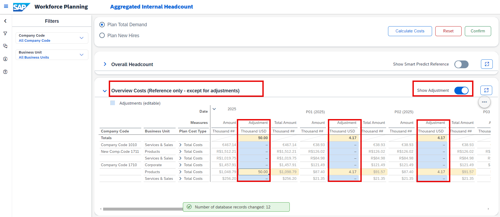

    >INFORMATION:
    >
    - By enabling the toggle switch **Show Adjustment**, you can display an additional column for entering manual adjustments which are added on top to the calculated costs
    - This is useful as the calculated costs are based on the maintained central assumptions and thus only represent a rough estimation of expected costs

4. Publish or revert your version

    - Click on the **Confirm** or **Reset** button in order to publish or revert your plan data

>INFORMATION:
>
- This tab provided guidance on how to plan your headcount by entering the total headcount, while the tab **Enter Plan Data : Delta Headcount** shows how to plan headcount by planning the amount of hires and terminations.
- During the planning process, you can switch back and forth between the different entry modes
- Be aware that the respective measures such as the delta hires and terminations or respectively the end of period headcount values need to be re-calculated when switching the modes. This happens automatically.

[OPTION END]

[OPTION BEGIN [Enter Plan Data : Delta Headcount]]
Currently, you have opened the tab **Enter Plan Data : Delta Headcount**. This tab provides guidance on how to plan headcount values (by planning the amount of new hires and terminations), how to calculate and adjust costs and how to use the version management.

1. Enter the mode for the delta planning

    - Activate the toggle **Plan New Hires** located on the top-left corner of the story **Aggregated Internal HC Plan**

    <!-- border; size:540px -->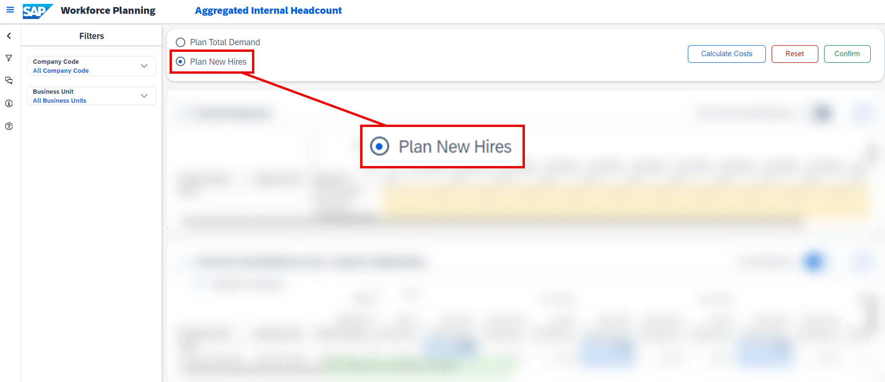

    >INFORMATION:
    >
    - The table layout changes accordingly so you can enter the amount of new hires and terminations instead of entering the total headcount amount

2. Enter or adjust the pre-calculated amount of hires and terminations

    - Enter your desired delta values in the rows **Hires (HC)** and **Terminations (HC)** for a particular period

    >INFORMATION:
    >
    - In the delta planning mode, please enter the values only into the period in which a hiring or termination should take place
    - The story automatically recalculates the total headcount for this period (see next sub-step) and carries forward the result until the end of the defined plan horizon
    - Thus you do not need to maintain the values in each period, but only in the periods in which the hiring or termination occurs
    - Please note that when entering a termination, it does not matter whether the algebraic sign used is positive or negative. That means you can enter a termination as `-1` or as `1`.

    <!-- border; size:540px -->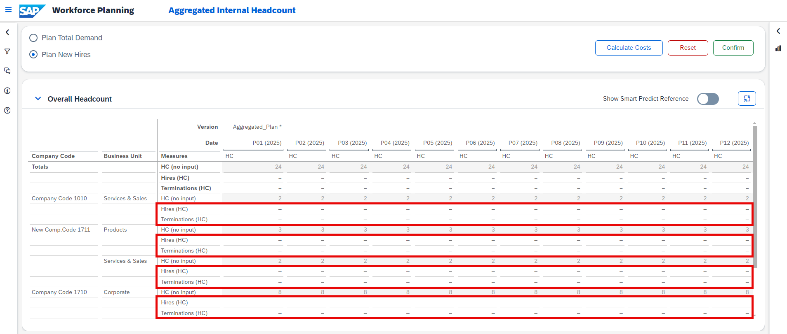

    >INFORMATION:
    >
    - The headcount values shown in the table are calculated by the pre-population algorithm which was triggered in the **Application Configuration** story
    - If you additionally enabled the Smart Predict based pre-population in the seeding step, you can also display the machine learning results by enabling the toggle switch **Show Smart Predict Reference** located on the top-right corner of the planning table. Please note that this toggle switch will only be visible, if Smart Predict capabilities have been activated.

    - In case Smart Predict capabilities have been activated, enable the toggle switch **Show Smart Predict Reference** to display the machine learning based results. These can be taken as a reference for your planning assumptions.

    <!-- border; size:540px -->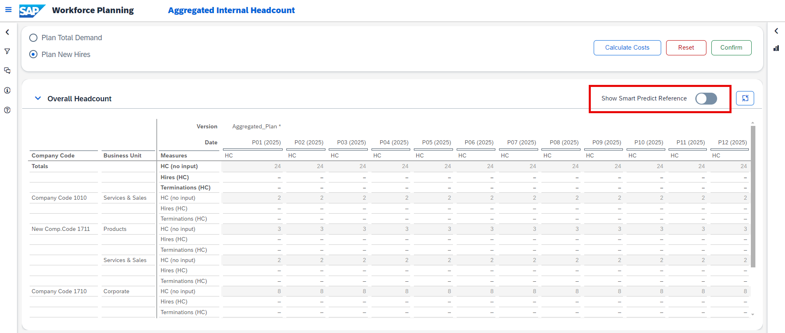

3. Recalculate costs and total headcount values

    - Click on the button **Calculate Costs** located on the top-right corner of the cost table

    >INFORMATION:
    >
    - As you entered new hires and terminations in your headcount table, the total headcount number does not match anymore
    - Also, the pre-calculated costs in the lower table do not match with the planned headcount values
    - Thus you need to trigger a recalculation in order to refresh the numbers. You can do so by pressing on the **Calculate Costs** button located on the top-right corner of the cost table.
    - This will refresh the measure **HC (no input)** as well as the costs accordingly.

4. Enter additional costs for the internal workforce

    >INFORMATION:
    >
    - By enabling the toggle switch **Show Adjustment**, you can display an additional column for entering manual adjustments which are added on top to the calculated costs
    - This is useful as the calculated costs are based on the maintained central assumptions and thus only represent a rough estimation of expected costs

    - Click on the toggle switch **Show Adjustment**
    - Enter additional costs in the `Adjustment` column

    <!-- border; size:540px -->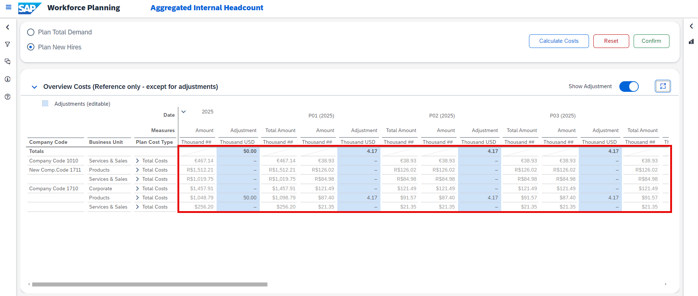

5. Click on the **Confirm** or **Reset** button to publish or revert your plan data

>INFORMATION:
>
- This tab provided guidance on how to plan your headcount by entering values for the amount of new hires and terminations, while the tab **Enter Plan Data : Total Headcount** shows how to plan headcount by planning the total amount.
- During the planning process, you can switch back and forth between the different entry modes
- Be aware that the respective measures such as the delta hires and terminations or respectively the end of period headcount values need to be re-calculated when switching the modes.

[OPTION END]

### Aggregated External HC Plan
In the next step, you will learn how to operate the **Aggregated External HC Plan** story.

This includes opening the planning story (Tab 1) and maintaining plan values for your external workforce (Tab 2).

[OPTION BEGIN [Open Application]]
Currently, you have opened the tab **Open Application**. This tab provides guidance on how to open the **Aggregated External HC Plan** (`SAP_HR_BPL_IM_WFP_AGGREGATED_EXTERNAL`) story.

1. Navigate back to the overview story `SAP_HR_BPL_IM_WFP_OVERVIEW_PAGE` by using the **Navigation Menu**.

2. Click on the link **Aggregated External HC Plan** located inside the **Plan FTE Demands and Costs** section

    <!-- border; size:540px -->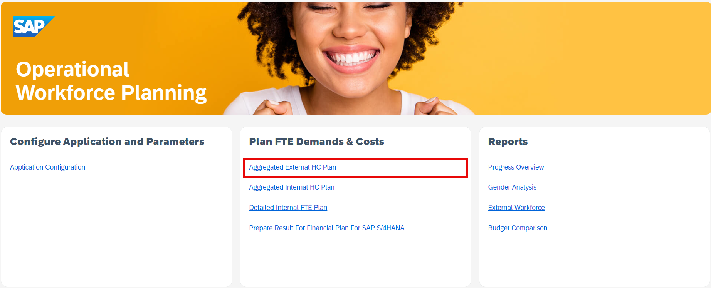

    >INFORMATION:
    >
    - This story allows you to perform planning activities on an aggregated level for external workforce

3. Get an overview of the story

    <!-- border; size:540px -->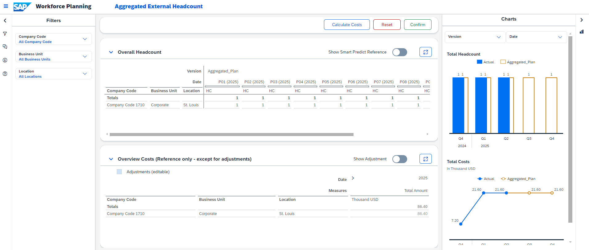

    - The story consists of three sections. In the top section (header section), you can find a high level reporting area where you can compare your current plan version with other versions.
    - In the middle of the screen, you can see the headcount planning table. Here you can enter headcount values on an aggregated level.
    - In the lower section you can find a cost table where you can view the calculated costs as well as make manual adjustments.
    - The tables initialize automatically based on the configuration of the **Plan Level** property of the **Version** dimension. In addition to the dimensions derived from the Plan Level, the location dimension is always added on top as this is a mandatory dimension for external workforce

You may now switch to the second tab **Enter Plan Data** to learn how to enter your planning assumptions.

[OPTION END]

[OPTION BEGIN [Enter Plan Data]]
Currently, you have opened the tab **Enter Plan Data**. This tab provides guidance on how to enter headcount values, how to calculate and adjust costs and how to use the version management.

1. Adjust headcount values in the headcount planning table

    - According the **Steps** description field, start your activities by adjusting your headcount values
    - You may adjust the headcount values separately in each cell, or make use of the drag and drop functionality in order to speed up your process

    <!-- border; size:540px -->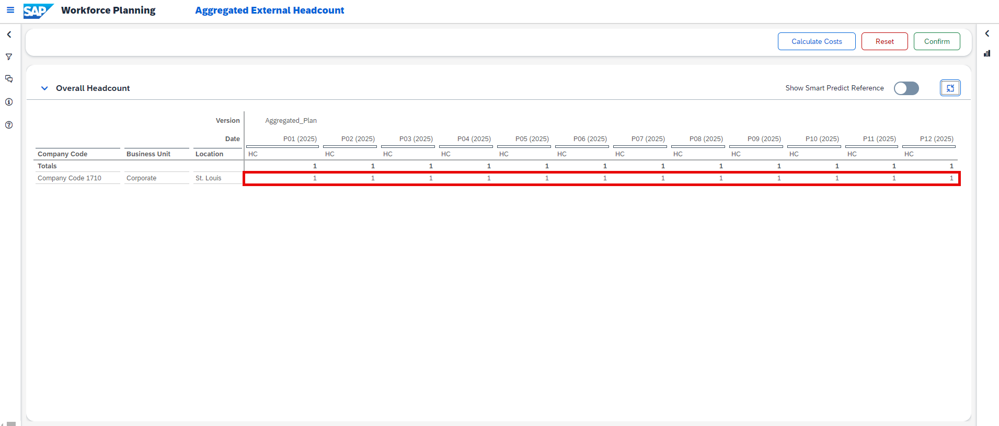

    >INFORMATION:
    >
    - The headcount values shown in the table are calculated by the pre-population algorithm which was triggered in the **Application Configuration** story
    - If you additionally enabled the Smart Predict based pre-population in the seeding step, you can also display the machine learning results by enabling the toggle switch **Show Smart Predict Reference** located on the top-right corner of the planning table. Please note that this toggle switch will only be visible, if Smart Predict capabilities have been activated.

    - In case Smart Predict capabilities have been activated, enable the toggle switch **Show Smart Predict Reference** to display the machine learning based results. These can be taken as a reference for your planning assumptions.

    <!-- border; size:540px -->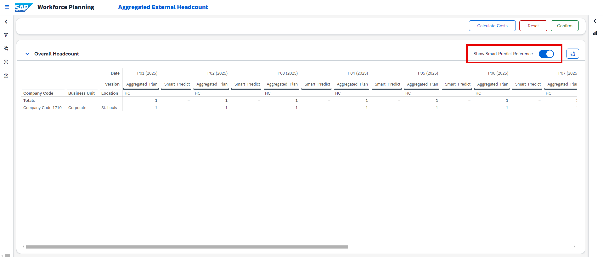

2. Recalculate the costs

    - Click on the button **Calculate Costs** located on the top-right corner of the cost table

    >INFORMATION:
    >
    - As you changed your headcount values, the pre-calculated costs in the lower table do not match with the planned headcount values anymore
    - Thus you need to trigger a re-calculation. You can do so by pressing on the **Calculate Costs** button located on the top-right corner of the cost table

3. Enter additional costs for the external workforce

    - Click on the toggle switch **Show Adjustment**
    - Enter additional costs in the `Adjustment` column

    <!-- border; size:540px -->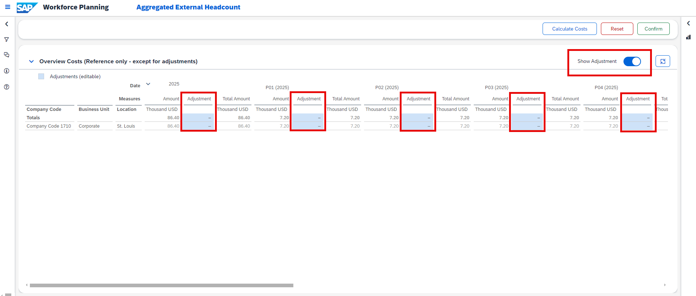

    >INFORMATION:
    >
    - By enabling the toggle switch **Show Adjustment**, you can display an additional column for entering manual adjustments which are added on top to the calculated costs
    - This is useful as the calculated costs are based on the maintained central assumptions and thus only represent a rough estimation of expected costs

4. Publish or revert your version

    - Click on the **Confirm** or **Reset** button in order to publish or revert your plan data

[OPTION END]

### Detailed Internal FTE Plan
In the next step, the **Detailed Internal FTE Plan** story is introduced.

Here you will learn how to open the planning story (Tab 1), how to maintain FTE and cost values for your individual employees, how to plan events such as absences or promotions (Tab 2) and lastly how to create new positions (Tab 3).

If you are interested in a short video showing all of this in action, you can check it out here:

[OPTION BEGIN [Open Application]]
Currently, you have opened the tab **Open Application**. This tab provides guidance on how to open the **Detailed Internal FTE Plan** (`SAP_HR_BPL_IM_WFP_DETAILED_INTERNAL`) story.

1. Navigate back to the overview story `SAP_HR_BPL_IM_WFP_OVERVIEW_PAGE` by using the **Navigation Menu**.

2. Click on the **Detailed Internal FTE Plan** located inside the **Plan FTE Demands and Costs** section

    <!-- border; size:540px -->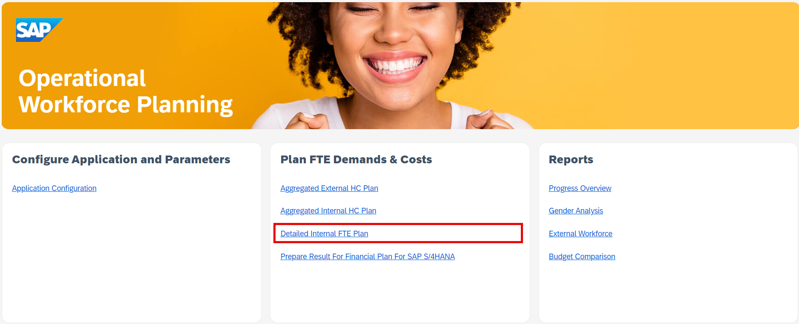

    >INFORMATION:
    >
    - This story enables you to perform planning activities for your internal workforce on an employee level.  

3. Get an overview of the story

    <!-- border; size:540px -->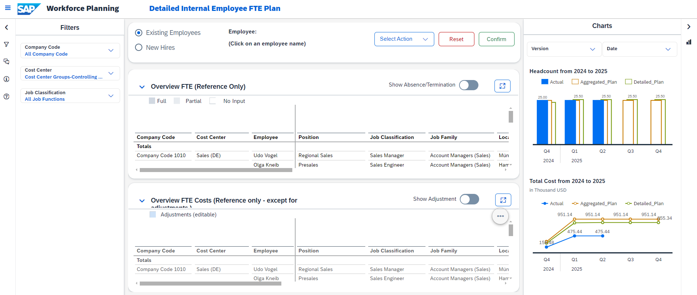

    - The story consists of three sections. In the top section (header section), you can find a high level reporting area where you can compare your current plan version with other versions.
    - In the middle of the screen, you can see the FTE planning table. Here you can enter FTE values on an employee level.
    - In the lower section you can find a cost table where you can view the calculated costs as well as make manual adjustments.
    - Different from the previously presented planning stories, you can perform different pre-defined actions on an employee level, such as planning promotions, terminations, absences etc.
    - Furthermore the story offers two different entry modes, called **Absence & Movement** and **New Hires**. The first mode is used for existing employees, while the latter mode is used to create new positions with no employee mapping.

You may now switch to the second tab **Enter Plan Data : Absence & Movement** or to the third tab **Enter Plan Data : New Hires** to learn how to enter your planning assumptions.

[OPTION END]

[OPTION BEGIN [Enter Plan Data : Absence & Movement]]
Currently, you have opened the tab **Enter Plan Data : Absence & Movement**. This tab provides guidance on how to plan FTE values and events , how to calculate and adjust costs and how to use the version management.

1. Select an employee you want to perform an action on

    - Click on any cell in the FTE table to select and focus an employee
    - The currently focused employee will be shown above the planning table

    <!-- border; size:540px -->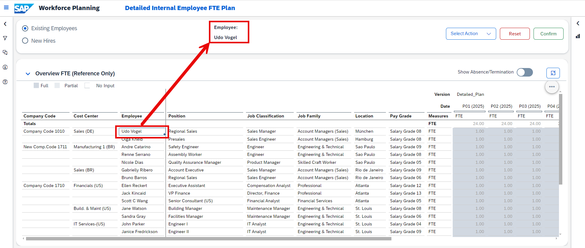

2. Choose an action from the action menu

    - By focusing an employee in the table and then using the dropdown shown in the above screenshot, different planning activities can be performed
    - Click on any action you want to perform. In this example, the employment level (FTE value) will be adjusted

      <!-- border; size:540px -->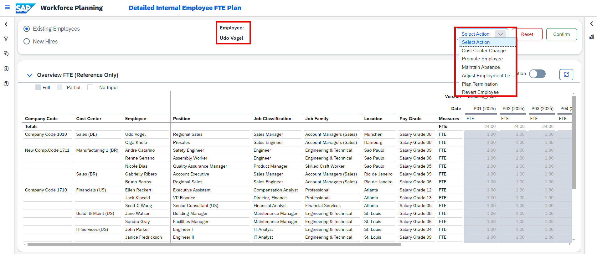

3. Fill out the required parameters for the employee action

    - After selecting an action from the drop-down window, a pop-up is displayed in which you need to enter all mandatory information
    - In this example ( **Adjust Employment Level** ), the new FTE value as well as the start and the end date must be maintained

    <!-- border; size:300px -->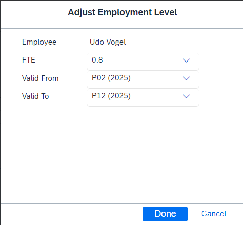

4. Confirm your selection

    - Press on the **Done** button
    - The popup disappears and the respective data action is triggered in the backend
    - After the execution of the data action, the FTE table displays the updated records
    - Costs for the selected employee are being recalculated as well
    - Cost related data actions can be customized accordingly, (e.g. paid leave vs. unpaid leave in case of absence)

      <!-- border; size:540px -->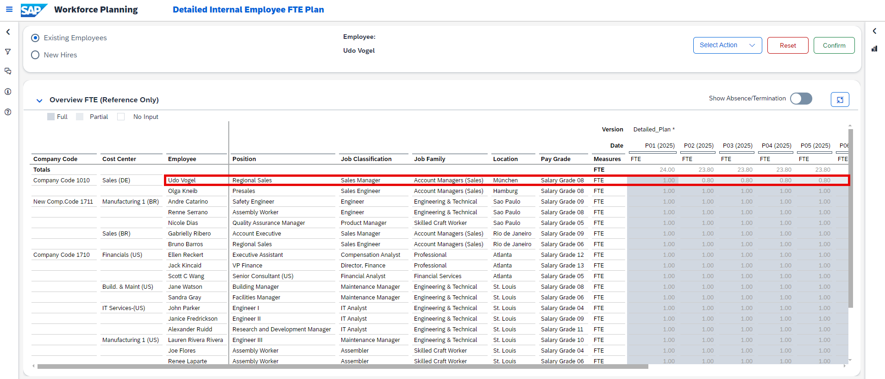

5. Display absences and terminations

    - Enable the toggle switch **Show Absence / Termination** located on the top-right corner of the story

    >INFORMATION:
    >
    - This toggle allows you to explore two more detailed measures, **Absence** and **Terminations**
    - These measures are automatically calculated after planning a termination or absence via the action drop-down and serve for exploration purposes only

    <!-- border; size:540px -->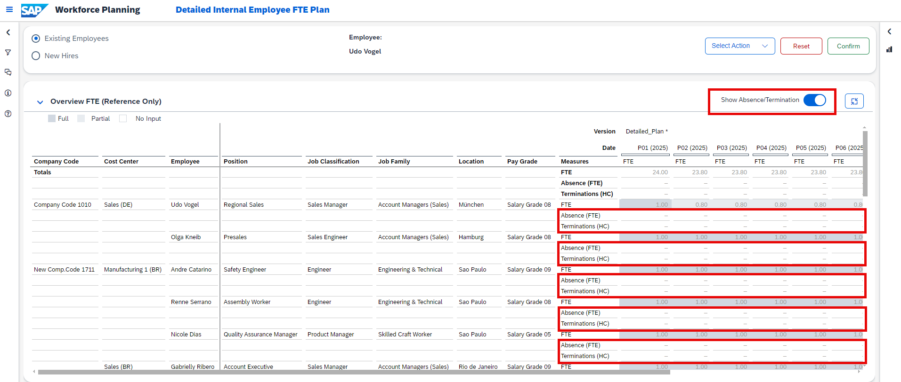

6. Enter additional costs for your employees

    - Click on the triangle icon next to the cost table description in order to view the cost table
    - Click on the toggle switch **Show Adjustment**

    >INFORMATION:
    >
    - By enabling the toggle switch **Show Adjustment**, you can display an additional column for entering manual adjustments which are added on top to the calculated costs
    - This is useful as the calculated costs are based on the maintained central assumptions and thus only represent a rough estimation of expected costs

    - Enter additional costs in the `Adjustment` column

    <!-- border; size:540px -->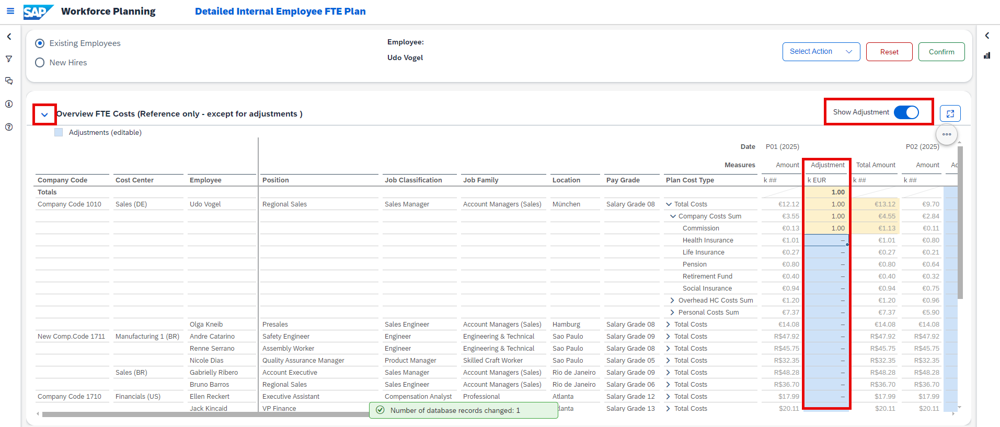

    >INFORMATION:
    >
    - You can do so by drilling down along the plan cost type hierarchy and then entering numbers for a specific cost type

7. Confirm or revert your changes

    - Click on the **Confirm** button if you want to publish your entries.
    - In case you want to get back to the latest state, hit the **Reset** button and select one of the two options offered

    <!-- border; size:300px -->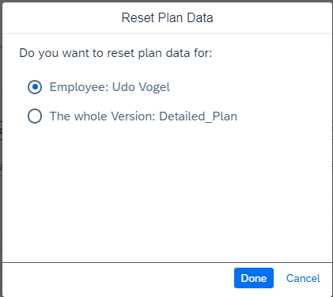

    >INFORMATION:
    >
    - Please note that you can decide between reverting your whole version or only the changes of the selected employee
    - Reverting plan data of an individual employee will re-initialize the FTE as well as the cost data for this specific employee based on the data stored inside the reference period in your actual data and the central assumptions maintained
    - Reverting the whole version will reset the version to the last published state

8. Close the popup

    - Press **Done** to close the popup

[OPTION END]

[OPTION BEGIN [Enter Plan Data : New Hires]]
Currently, you have opened the tab **Enter Plan Data : New Hires**. This tab provides guidance on how to create new positions, how to calculate and adjust costs and how to use the version management.

1. Enter the mode for creating new positions

    - Activate the toggle **New Hires** located on the top-left corner of the planning story

    <!-- border; size:540px -->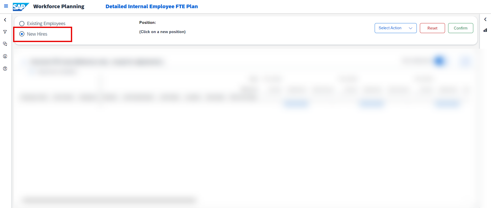

    - The table changes accordingly and only new positions are displayed
    - Initially both the FTE and the cost table are empty

    <!-- border; size:540px -->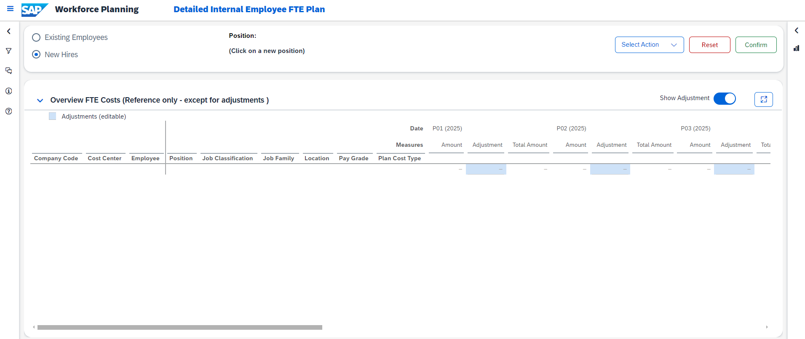

2. Open the dialogue to create a new position

    - Click on the button **Select Action** and select the option **Create Position**
    - A Popup will open in which you need to maintain parameters for the new position. All parameters are mandatory.

    <!-- border; size:540px -->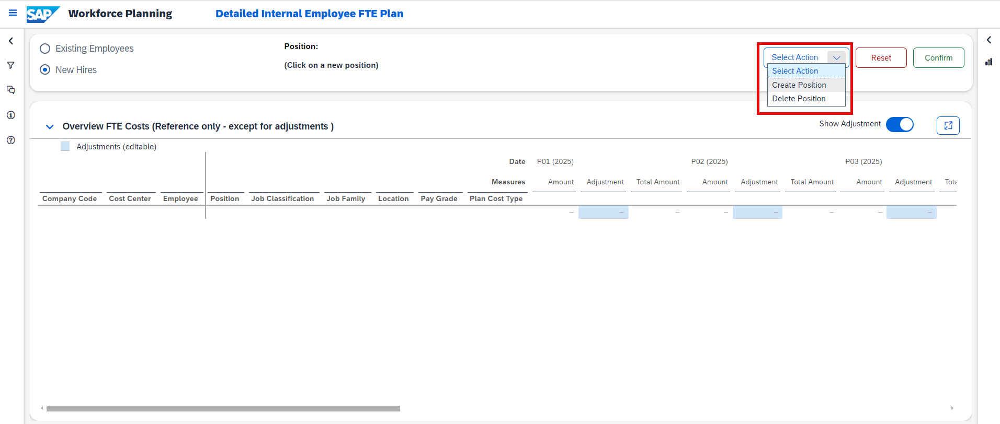

3. Fill out the required information

    <!-- border; size:540px -->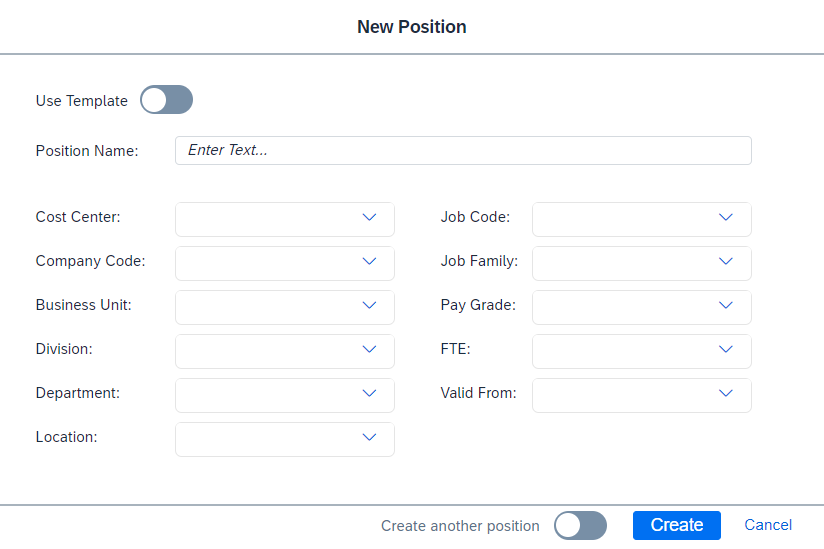

    - Hit the **Create** button when done

    >INFORMATION:
    >
    - After pressing **Create**, a new position with according FTE values will be created for the specified plan periods and the respective costs will be calculated.
    - For the cost calculation, the midpoint salaries and cost rates from the central assumptions are taken into account.
    - If no midpoint salary and other cost types are maintained for the specific combination of company code and cost center, the cost calculation cannot be performed

4. Use the template function to create a new position

    - Re-open the dialogue and this time enable the toggle switch **Use Template**
    - Select an existing position from the drop down list in order to use this as the template
    - Adjust the position description and if required the remaining specifications

    <!-- border; size:540px -->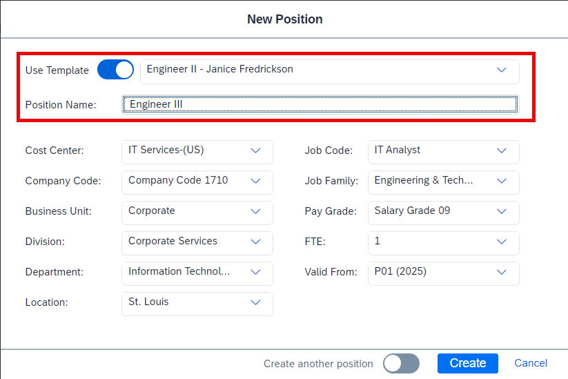

    - Click on the **Create** button when done. Your new position is now visible in the FTE and the cost table.

    <!-- border; size:540px -->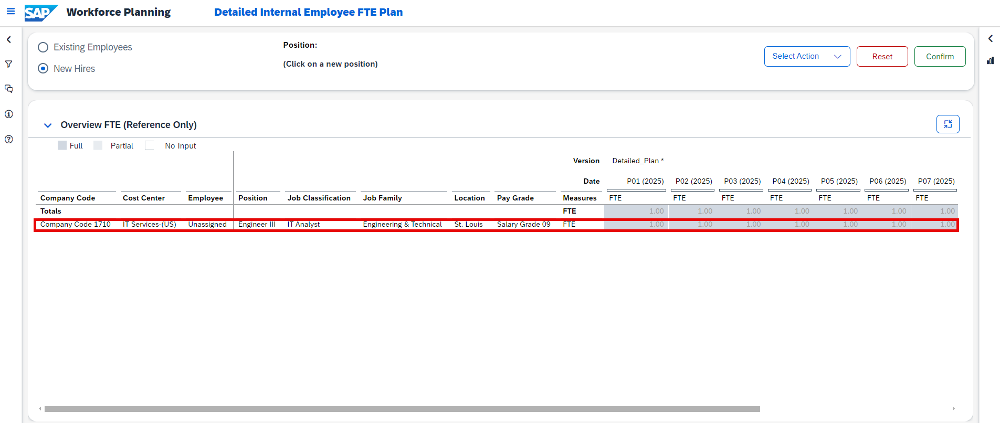

    - Re-open the dialogue in case you want to create another position
    - Enable the toggle switch **Create another position** if you plan to create multiple positions. This will leave the window open after creating the position for quick creation of additional positions.

    <!-- border; size:540px -->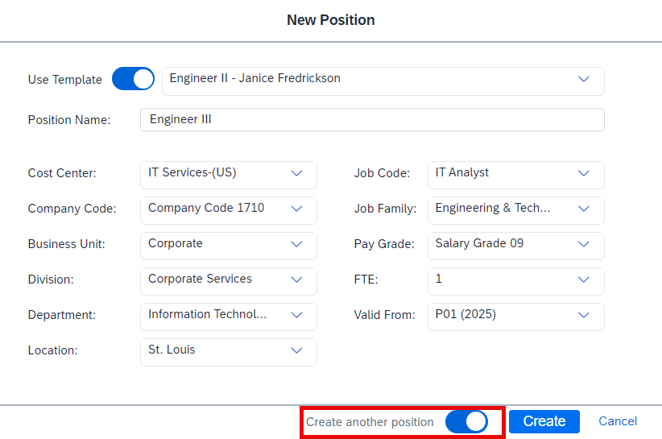

5. Enter additional costs for your new position(s)

    - Click on the triangle icon next to the cost table description in order to view the cost table
    - Click on the toggle switch **Show Adjustment**

    >INFORMATION:
    >
    - By enabling the toggle switch **Show Adjustment**, you can display an additional column for entering manual adjustments which are added on top to the calculated costs
    - This is useful as the calculated costs are based on the maintained central assumptions and thus only represent a rough estimation of expected costs

    - Enter additional costs in the `Adjustment` column

    <!-- border; size:540px -->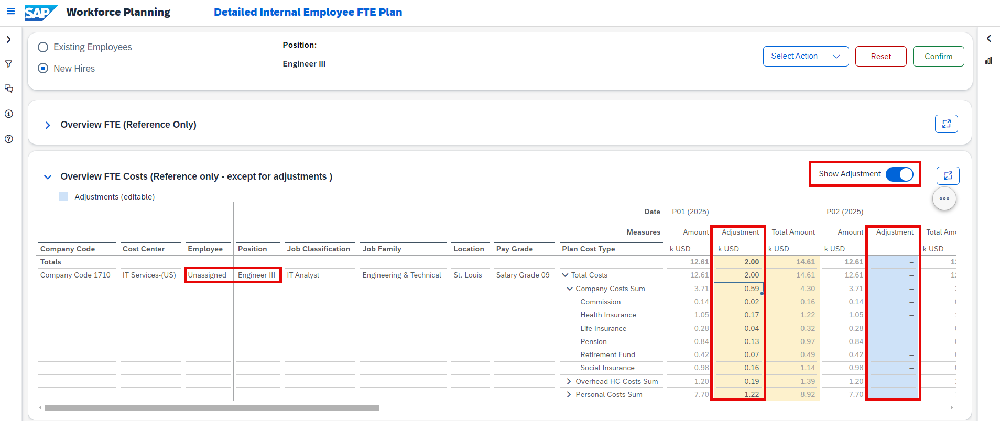

    >INFORMATION:
    >
    - You can do so by drilling down along the plan cost type hierarchy and then entering numbers for a specific cost type

6. Delete the new position if required

    - Select a newly planned position in the **Overview FTE** table by clicking on it
    - Click on the button **Delete Position** inside the **Select Action** drop down

    <!-- border; size:540px -->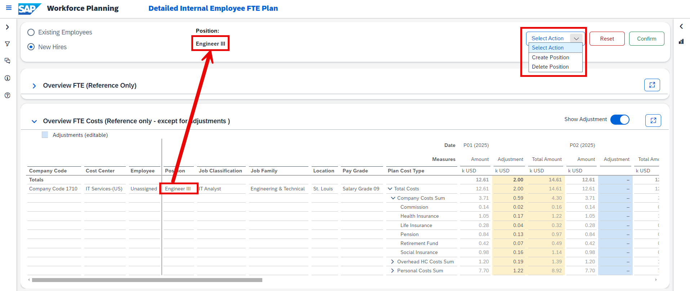

    - Confirm the **Delete Position** dialogue. As a result the planned position and its costs are deleted.

    <!-- border; size:300px -->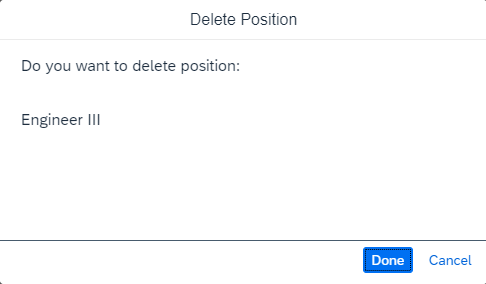

7. Confirm or revert your changes

    - Click on the **Confirm** button if you want to publish your entries.
    - In case you want to get back to the latest state, hit the **Reset** button.

>INFORMATION:
>
This content package also offers a write back function to SuccessFactors. In order to learn how to perform a write back, please check out the tutorial [xP&A Operational Workforce Planning - Write back plan positions to SAP SuccessFactors](xpa-sac-hxm-successfactors-writeback)

[OPTION END]

### Prepare Result for Financial Plan for SAP S/4HANA
After you have completed your workforce planning, you can extend the value of this xP&A scenario by integrating the results into your financial plans.

In this step, you will learn how to open the financial integration preparation story (Tab 1), how to prepare your data for the financial integration (Tab 2) and how to transfer the costs into the **Operating Expense** data model from the [Integrated Financial Planning content package](https://help.sap.com/docs/SAP_ANALYTICS_CLOUD/21868089d6ae4c5ab55f599c691726be/7b8caa06f850453fab8d570be92f4c99.html?locale=en-US) (Tab 3).

[OPTION BEGIN [Open Application]]
Currently, you have opened the tab **Open Application**. This tab provides guidance on how to open the **Prepare Result for Financial Plan for SAP S/4HANA** (`SAP__HR_BPL_IM_WFP_PREPARE_IFP`) story.

1. Navigate back to the overview story `SAP_HR_BPL_IM_WFP_OVERVIEW_PAGE` by using the **Navigation Menu**.

2. Click on the **Prepare Result For Financial Plan For SAP S/4HANA** link located inside the **Plan FTE Demands & Costs** section

    <!-- border; size:540px -->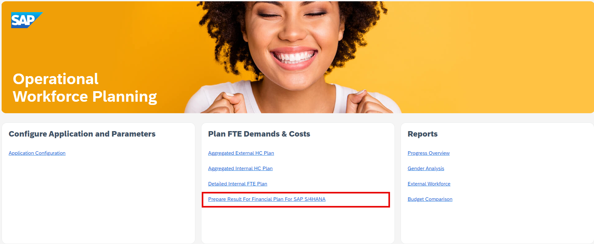

    >INFORMATION:
    >
    - This story helps you to prepare your plan data for the financial integration into the **Operating Expense** data model. For more information please relate to the [Integrated Financial Planning for SAP S/4HANA and S/4HANA Cloud](https://help.sap.com/docs/SAP_ANALYTICS_CLOUD/21868089d6ae4c5ab55f599c691726be/7b8caa06f850453fab8d570be92f4c99.html?locale=en-US) section in our help portal.
    - In order to prepare the data for the integration, the costs maintained on the different cost types need to be written to their corresponding G/L accounts. This happens via a Data Action, while the results are stored on a separate version called `Operational`.

3. Get an overview of the story

    <!-- border; size:540px -->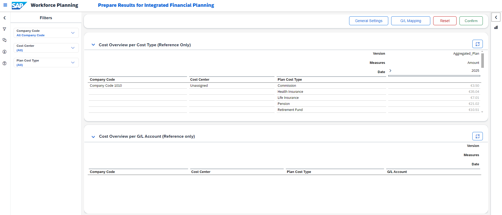

    - In general the story consists of two sections. In the upper table, you can find your original plan version with all your plan data.
    - In the lower table, you can find the results after having mapped the costs from the cost types to the G/L accounts.
    - In order to ensure a successful derivation of G/L accounts, please maintain the corresponding account numbers in the property `GL_Account` inside the dimension **Plan Cost Type** (`SAP_HR_COSTTYPE`) in the data model as described in the step **Pre-configuration of Planning Applications** of this tutorial.
    - Please note that independent of the Plan Level selected, both of the tables will show your data on a `CompanyCode + CostCenter` level. This is because the **Operating Expense** data model does not have any SuccessFactors specific dimensions such as the **Business Unit** or **Division** dimension. If you did your planning on a `CompanyCode + BusinessUnit` level for instance (not covering the cost center perspective), your costs will be mapped to unassigned member of the **Cost Center** dimension. In order to establish a mapping or distribution to existing cost centers, you must create a suitable derivation logic by yourself in this case.

You may now switch to the second tab **Prepare Data** to learn how to prepare your plan data for the financial integration.

[OPTION END]

[OPTION BEGIN [Prepare Data]]
Currently, you have opened the tab **Prepare Data**. This tab provides guidance on how to prepare your plan data for the financial integration and how to use the version management.

1. Select your plan version you maintained your planning assumptions on

    - Click on the **General Settings** button to open the version selection dialogue

    <!-- border; size:540px -->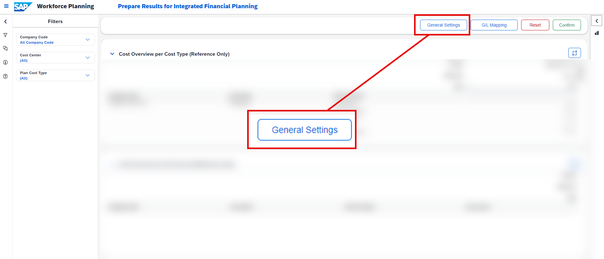

    - Choose the version `Aggregated_Plan` or `Detailed_Plan`, depending on which version contains your final workforce plan you wish to transfer to finance
    - Click on **OK** to save your selection and close the dialogue

    <!-- border; size:300px -->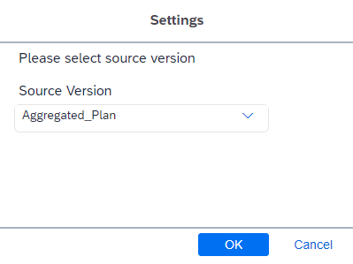

2. Map your costs maintained on the cost types to their respective G/L accounts

    - Click on the button **G/L Mapping**

    <!-- border; size:540px -->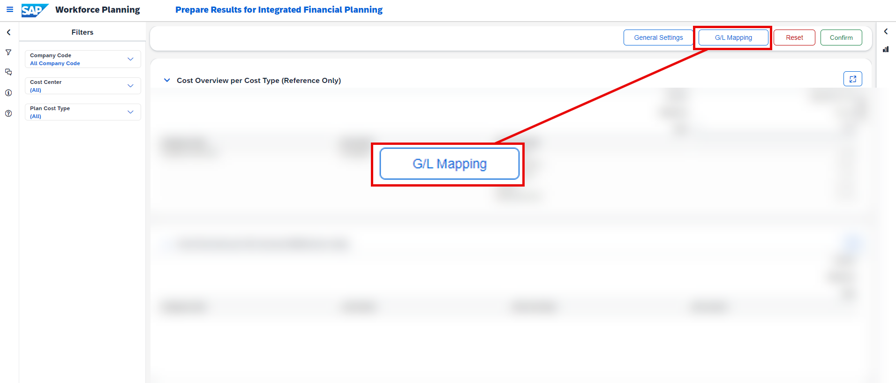

    - Confirm your selection by pressing the **OK** button

    <!-- border; size:300px -->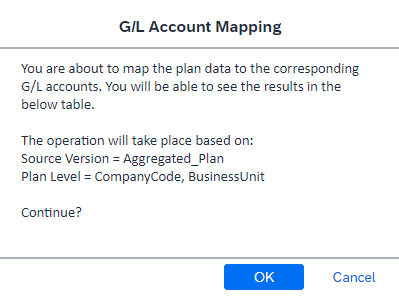

    - After hitting the **OK** button, a Data Action will be executed which transfers the cost data from your selected source version to the version `Operational`. Simultaneously, the costs are copied from the cost types to their respective G/L accounts.

    <!-- border; size:540px -->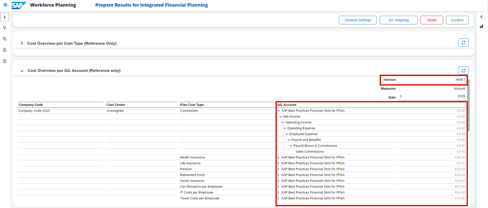

3. Confirm or revert your version

    - Press on the **Confirm** button to publish the `Operational` version or the **Reset** button in case you are unsatisfied with the result

You may now switch to the tab **Transfer Costs** to learn how to transfer the costs to the **Operating Expense** data model.
[OPTION END]

[OPTION BEGIN [Transfer Costs]]
Currently, you have opened the tab **Transfer Costs**. This tab provides guidance on how to transfer the costs to the **Operating Expense** data model.

1. Open the **Integration Story** (`SAP_FI_IFP_IM_Addon_WFPIntegration`) from the [Cross-Model Add-Ons for Integrated Financial Planning](https://help.sap.com/docs/SAP_S4HANA_CLOUD/1cbcff7ccd35405ab445b223c1ab1588/3cd3304902394102adc3c6dc08ced5bc.html)

    - In the **Instructions** section, click on the hyperlink **Workforce Panning Integration Story**

    <!-- border; size:540px -->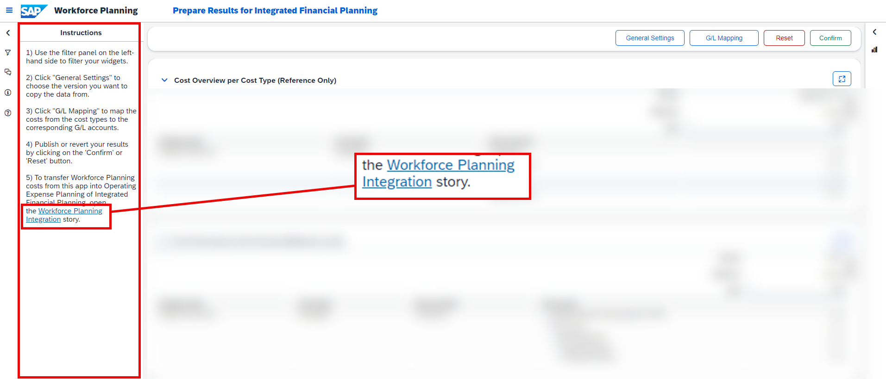

    >INFORMATION:
    >
    - The packages [Cross-Model Add-Ons for Integrated Financial Planning for SAP S/4HANA and Integrated Financial Planning for SAP S/4HANA](https://help.sap.com/docs/SAP_S4HANA_CLOUD/1cbcff7ccd35405ab445b223c1ab1588/3cd3304902394102adc3c6dc08ced5bc.html) must be imported before!  
    - The **Workforce Planning Integration** story will open and lets you transfer the costs into the **Operating Expense** data model.

2. Transfer the costs to the **Operating Expense** data model.

    - Hit the Data Action trigger **Copy Employee Expenses** to transfer the costs

    <!-- border; size:540px -->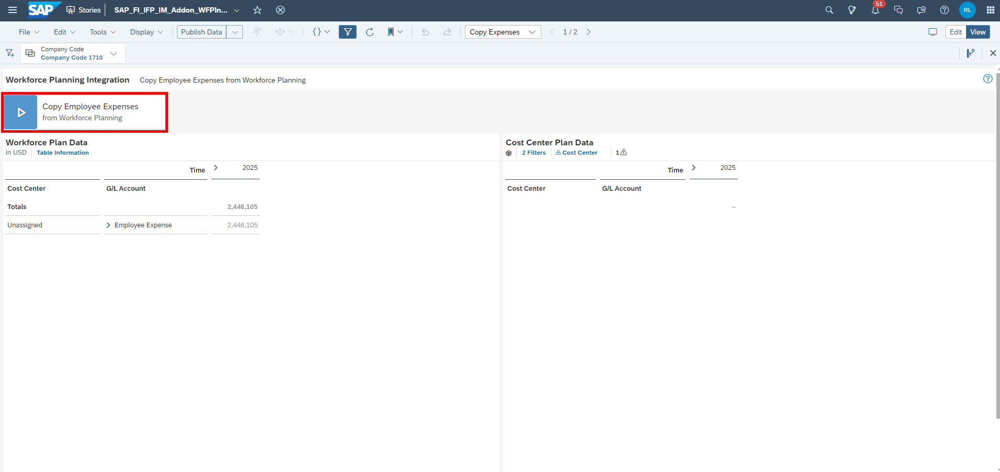

    >INFORMATION:
    >
    This Data Action transfers the employee expenses maintained on the version `public.Operational` from the workforce planning model `SAP__HR_BPL_IM_WORKFORCE` to the target model `SAP_FI_IFP_IM_OPEX`

[OPTION END]

### Reports
In this step, the reporting section will be introduced to you.

Here you will learn how to open the reports (Tab 1) and how to leverage the different reports to get an overview about your resources, your actual data compared to your plan data and other insights (Tab 2).

If you are interested in a short video showing all of this in action, you can check it out here:

[OPTION BEGIN [Open Reports]]
Currently, you have opened the tab **Open Reports**. This tab provides guidance on how to open the different pages of the story `SAP__HR_BPL_IM_WFP_REPORTING`.

1. Navigate back to the overview story `SAP_HR_BPL_IM_WFP_OVERVIEW_PAGE`.

2. Click on the one of the links located inside the **Reports** section, for example on the **Progress Overview** link

    <!-- border; size:540px -->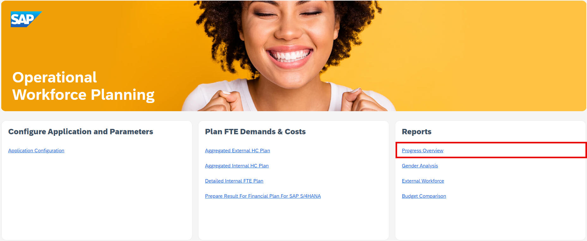

    >INFORMATION:
    >
    - The report allows you to track your progress from different points of view.
    - The story itself consists of four pages, called **Progress Overview**, **Gender Analysis**, **External Workforce** and **Budget Comparison**

    - Switch to the tab **Reporting** in order to learn more about the different stories

[OPTION END]

[OPTION BEGIN [Reporting]]
Currently, you have opened the tab **Reporting**. This tab provides information about the navigation concept of the stories and the reported data throughout the different story pages.

1. Navigation concept of the stories

    - Basically, all stories provide the same user interface and buttons and thus work the same
    - In the left-side panel, you can find two version selectors which allow you to define which versions you want to compare (e.g. `Detailed_Plan` vs. `Aggregated_Plan`)

    <!-- border; size:540px -->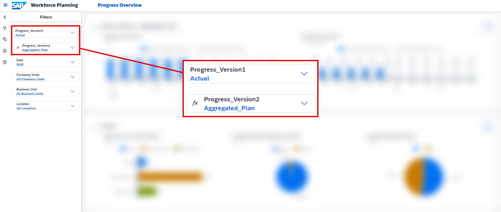

    - You can select the versions by clicking on the selector and choosing between different version from the dropdown

    <!-- border; size:200px -->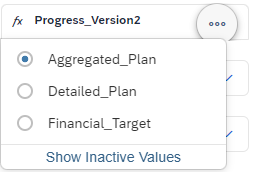

    - In the filter section, you can furthermore find filter functions in order to drill down or up according to your reporting needs

    <!-- border; size:540px -->

    - In order to switch between the different story pages, you can either return to the **Overview Application** or use the **Navigation Menu**

    <!-- border; size:540px -->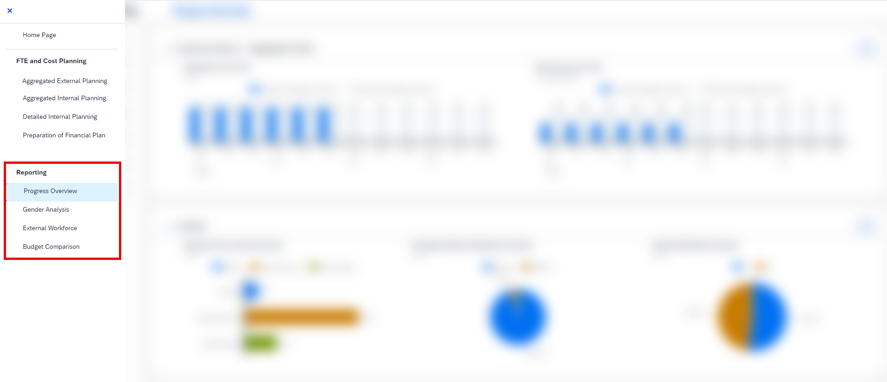

2. **Progress Overview** story

    - By clicking on the **Progress Overview** link inside the **Overview Application** (`SAP_HR_BPL_IM_WFP_OVERVIEW_PAGE`), you will jump to the respective story page
    - The **Progress Overview** story page offers an actuals vs. plan comparison based on different dimensions and also provides you with a high level overview on your workforce composition.

    <!-- border; size:540px -->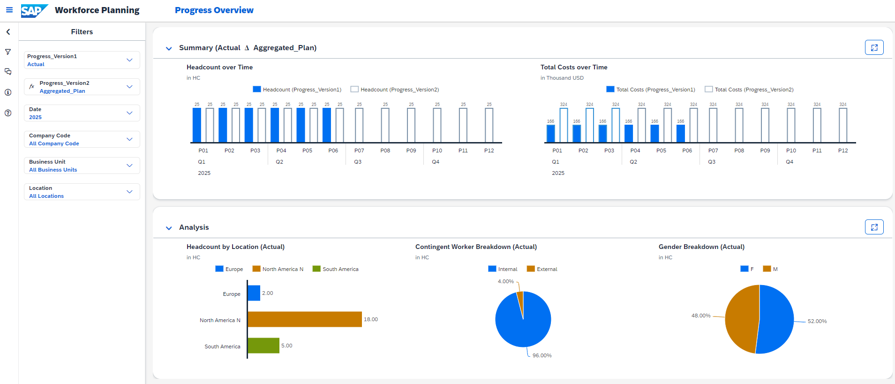

3. **Gender Analysis** story

    - Navigate to the **Gender Analysis** story by either going back to the **Overview Application** (`SAP_HR_BPL_IM_WFP_OVERVIEW_PAGE`) and clicking on the **Gender Analysis** link or by using the navigation menu
    - The **Gender Analysis** story page offers an in depth analysis on the gender distribution across various dimensions

    <!-- border; size:540px -->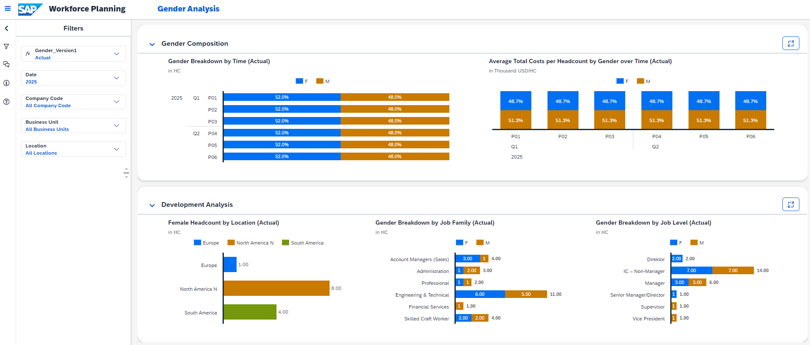

4. **External Workforce** story

    - Navigate to the **External Workforce** story by either going back to the **Overview Application** (`SAP_HR_BPL_IM_WFP_OVERVIEW_PAGE`) and clicking on the **External Workforce** link or by using the navigation menu
    - The **External Workforce** story pages offers an overview on the ratio between internal and external workforce across various dimensions

    <!-- border; size:540px -->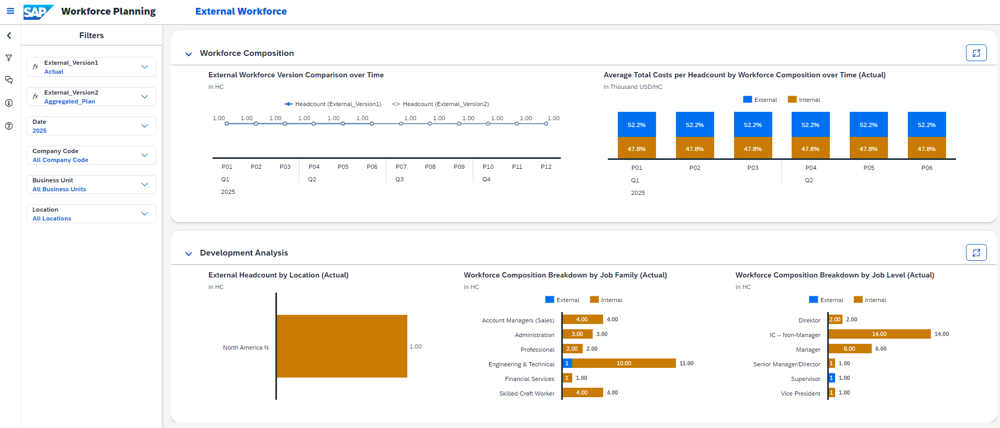

5. **Budget Comparison** story

    - Navigate to the **Budget Comparison** story by either going back to the **Overview Application** (`SAP_HR_BPL_IM_WFP_OVERVIEW_PAGE`) and clicking on the **Budget Comparison** link or by using the navigation menu
    - The **Budget Comparison** story page offers a comparison between planned and budgeted headcount as well as costs across various dimensions

    <!-- border; size:540px -->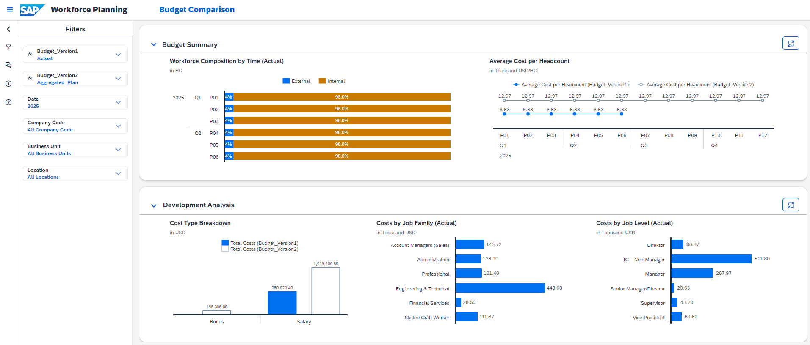

[OPTION END]

### Final Remarks
Congratulations! You have finished the introduction tutorial and are now able to use the **SAP Human Experience Management (Operational) Workforce Planning** content like an expert.

If you want to customize the content and adjust it according to your own business requirements, the following resources might be helpful:

- [xP&A Operational Workforce Planning - Create and Upload Central Assumptions](xpa-sac-hxm-maintain-central-assumptions)
- [xP&A Operational Workforce Planning - Add a new Cost Type](xpa-sac-hxm-add-cost-type)
- [xP&A Operational Workforce Planning - Add a new Version](xpa-sac-hxm-add-new-version)
- [xP&A Operational Workforce Planning - Add a new Plan Level](xpa-sac-hxm-add-plan-level)
- [xP&A Operational Workforce Planning - Create Predictive Scenario](xpa-sac-hxm-create-predictive-scenario)
- [xP&A Operational Workforce Planning - Write back plan positions to SAP SuccessFactors](xpa-sac-hxm-successfactors-writeback)

Interested in more xP&A topics and related business content packages? Visit our community page [Extended Planning & Analysis Business Content](https://community.sap.com/topics/cloud-analytics/planning/content?source=social-Global-SAP+Analytics-YOUTUBE-MarketingCampaign-Analytics-Analytics-spr-5330779922).
