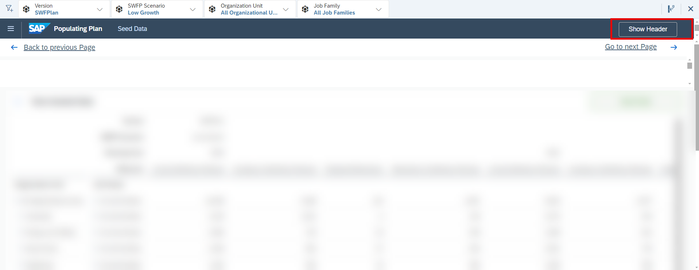
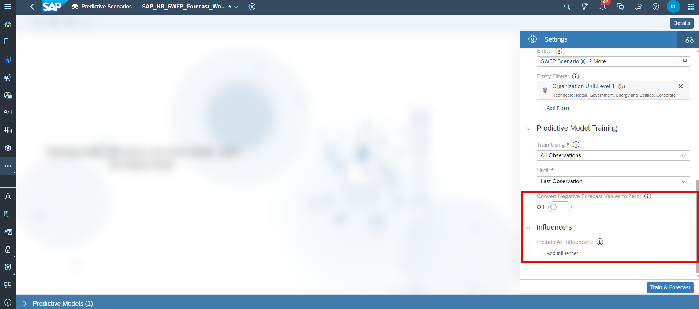
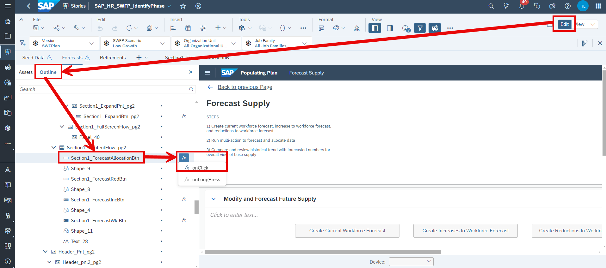
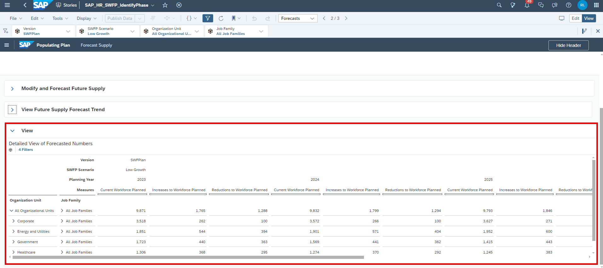
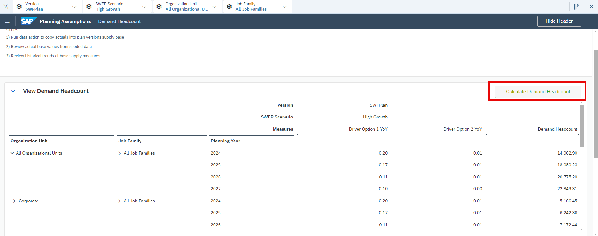
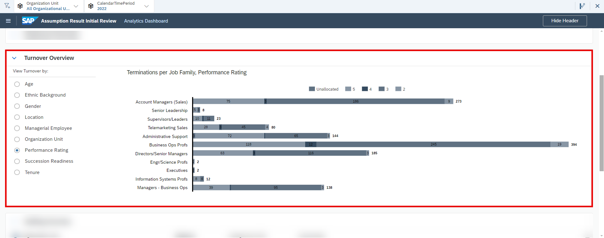

## Prerequisites
- You have an SAP Analytics Cloud tenant. If this is not the case, get started by requesting a free [SAP Analytics Cloud trial](https://www.sap.com/products/technology-platform/cloud-analytics/trial.html) tenant.
- You have installed the **SAP Strategic Workforce Planning** content in an SAP Analytics Cloud tenant. Reference: [Business Content Installation Guide](https://help.sap.com/docs/SAP_ANALYTICS_CLOUD/00f68c2e08b941f081002fd3691d86a7/078868f57f3346a98c3233207bd211c7.html), [Content Package User Guide](https://help.sap.com/docs/SAP_ANALYTICS_CLOUD/42093f14b43c485fbe3adbbe81eff6c8/4d75077c28314f5398eeb78dfcb5b1ff.html)
- You have optionally installed the **SAP Operational Workforce Planning** content in an SAP Analytics Cloud tenant. Reference: [Content Package User Guide](https://help.sap.com/docs/SAP_ANALYTICS_CLOUD/42093f14b43c485fbe3adbbe81eff6c8/7032f23e00b34a7ab6d79af20a8792a7.html). This is only required if you wish to integrate your final planning results into this content package.

## You will learn
- all basics of the **SAP Strategic Workforce Planning** content package for SAP Analytics Cloud 
- how to integrate data into your planning data model
- how to prepare your versions for the planning activities
- how to get an understanding of your current workforce composition
- how to plan the workforce supply and make an estimation about the future workforce demand
- how to identify gaps between your planned supply headcount and your estimated demand headcount and how to derive strategies to close the gap
- how to track your performance using the reporting stories

## Intro
In this tutorial you will learn all basics about the **Strategic Workforce Planning** content package. 

A detailed documentation about the **Strategic Workforce Planning** can be found in our [Content Package User Guide](https://help.sap.com/docs/SAP_ANALYTICS_CLOUD/42093f14b43c485fbe3adbbe81eff6c8/4d75077c28314f5398eeb78dfcb5b1ff.html).

In case you have any questions or require further support, please use the [SAP Question Form](https://community.sap.com/t5/forums/postpage/choose-node/true/product-id/bcbf0782-ce74-43b8-b695-dafd7c1ff1c1/board-id/technology-questions).

If you have a specific request to our team in regards to the business content, you may also submit a request using the [SAP Influence Platform](https://influence.sap.com/sap/ino/#/idea-create?campaign=884&title=Extended%20Planning%20and%20Analysis%3A%20content&tags=Extended%20Planning%20and%20Analysis&RespList=cust.ino.config.SAP_ANALYTICS_CLOUD_SAP_DIGITAL_BOARDROOM.BIZ_CONTENT).

### Access SAP Analytics Cloud Contents
In this step you will learn how to navigate to the folder which contains all SAP Analytic Cloud content packages.

1. Login to your SAP Analytics Cloud tenant using **Google Chrome**.

    >INFORMATION:
    >
    In order to get the best experience, it is recommended to use **Google Chrome** as it offers the best compatibility with SAP Analytics Cloud (SAC).
    >
    Other browsers can be used as well but are not supported by SAP.

2. In the SAP Analytics Cloud Menu, navigate to the **Files** section.

    <!-- border; size:300px-->

3. Access the content package folder.

    - You can access the content package folder by either navigating to the `Public` folder first and looking for a folder named `SAP_CONTENT`, or by using the **search function** in the top-right corner.
    - In case you want to make use of the search function, simply enter the term `SAP_CONTENT` into the search bar.

    <!-- border; size:540px -->

    - The folder `SAP_CONTENT` contains all objects required to run SAC content. Here you can find your installed content from the content network provided by SAP.

    <!-- border; size:540px -->

### Access Strategic Workforce Planning Content
Now that you have learned where all the SAP Analytics Cloud content packages are stored, you need to find the **SAP Strategic Workforce Planning** content.

1. Look for the **SAP Strategic Workforce Planning** content package by using the search bar.

    - In order to do so, please use the keyword `SWFP`
    - In the result list, click on the folder `SAP_HR_SWFP_Strategic_Workforce_Planning` with the description `SAP Human Resources: Strategic Workforce Planning`

    <!-- border; size:540px -->

2. Run the Strategic Workforce Planning content package.

    - The folder `SAP_HR_SWFP_Strategic_Workforce_Planning` contains all stories and objects which are related to the content package. 
    - To run the **Strategic Workforce Planning** content, please navigate to the folder `Stories` and click on the story called **Strategic Workforce Planning Overview** (`SAP_HR_SWFP_LandingPage`).

    >INFORMATION:
    >
    - The story **Strategic Workforce Planning Overview** (`SAP_HR_SWFP_LandingPage`) serves as a starting point and allows you to access all other stories during run time.
    - In other words, you do not need to access the remaining stories by manually launching them from the **Files** section. Instead, you can conveniently open them from inside the **Strategic Workforce Planning Overview** (`SAP_HR_SWFP_LandingPage`) story.

    <!-- border; size:540px -->

### Strategic Workforce Planning Overview
Before jumping into the individual stories of the **Strategic Workforce Planning** content package, it is necessary to understand what the stories are for and which use cases they cover.

1. **Strategic Workforce Overview**

    <!-- border; size:540px -->

    - By having opened the story **Strategic Workforce Planning Overview** (`SAP_HR_SWFP_LandingPage`), you entered the **Home Screen** of the **Strategic Workforce Planning** content package.
    - This overview story serves as the central entry point for all personas and helps you to navigate through the content package.
    - In the lower half of the story, you can see five sections which cluster the application into different components or process steps.
    - Those sections contain hyperlinks which redirect the responsible persona (e.g. the technical administrator or the headcount planner) to the respective story.

2. **Before You Plan**

    <!-- border; size:540px -->

    - The section **Before You Plan** contains two links, both leading to the story **Review Current Workforce** (`SAP_HR_SWFP_KnowYourWorkforce`) while each of the links opens a different page of the two-page story.
    - The **Review Current Workforce** (`SAP_HR_SWFP_KnowYourWorkforce`) story marks the start of the process and allows you to consume various reports to get an understanding about your current workforce composition. 
    - Among other available things this also includes a deeper analysis of influencers on the retirement by running classification algorithms.
    - In this story, the reporting model **Analytics Model SWFP** (`SAP_HR_SWFP_ANALYTICS`) is used as the data source for the reports while the classification algorithms are run on the Dataset `SAP_HR_SWFP_TERMINATIONS_DATASET`. 

    >INFORMATION:
    >
    In order to set up the classification algorithms, please follow the instructions as described in the [official documentation](https://help.sap.com/docs/SAP_ANALYTICS_CLOUD/42093f14b43c485fbe3adbbe81eff6c8/ffe9140bf890441d9642fa69ebc6f9e0.html).

3. **Populating Plan**

    <!-- border; size:540px -->

    - The section **Populating Plan** provides access to the story **Initialize the Plan** (`SAP_HR_SWFP_IdentifyPhase`). As the title of the section indicates, this story focusses on populating your plan version with data. 
    - This story consists of three different pages and allows you to upload historical data into your planning model **Strategic Workforce Planning Model** (`SAP_HR_SWFP_STRATEGIC`), seed data into the future periods by using the time series forecast mechanisms of SAC and lastly to modify retirement probabilities by making use of the information provided by the **Review Current Workforce** (`SAP_HR_SWFP_KnowYourWorkforce`) story.

4. **Planning Assumptions**

    <!-- border; size:540px -->

    - The section **Planning Assumptions** provides access the story **Supply and Demand Planning** (`SAP_HR_SWFP_PlanPhase`), which consists of five pages and focusses on the actual planning activities.
    - In specific, this story allows you to plan your headcount supply and to make an estimation about the future headcount demand 
    - Lastly this story also provides you with a gap analysis report in order to understand the deviation between the headcount supply and headcount demand. 

5. **Assumption Result Initial Review**

    <!-- border; size:540px -->

    - The section **Assumption Result Initial Review** provides access the story **Scenario and Version Comparisons** (`SAP_HR_SWFP_ValidatePhase`), which consists of two pages.
    - This story provides you with various reports which help you to analyze and compare different scenarios and versions. 

6. **Intervention Design and Modelling**

    <!-- border; size:540px -->

    - The section **Intervention Design and Modelling** provides access the story **Response Strategy Modelling** (`SAP_HR_SWFP_StrategizePhase`), which consists of three pages pages.
    - This story marks the final step of the planning process and allows you to define a response strategy to close potential headcount gaps and to make cost estimations for the respective strategies.
    - Optionally you can also push your final planning results to the planning model of the **SAP Operational Workforce Planning** content package from this story, where the results are stored on a dedicated version which on the other hand can then be used as a reference for the operational workforce planning activities. 

### Navigation Concept within the Content
As a last preparation step, it is required to understand the navigation concept of the content package in order for you to use it properly. In this step, you will learn about the meaning and the functionality of all the buttons as well as other UI elements.

1. **Main Navigation** button

    <!-- border; size:540px -->

    - The **Main Navigation** button can be found in each story apart from the landing page story **Strategic Workforce Planning Overview** (`SAP_HR_SWFP_LandingPage`) and is located at the top left corner.
    - By clicking on this button, a navigation menu opens with contains various hyperlinks.
    - By clicking on the hyperlinks, you can jump to any story and story page of this content package. 

2. **Show/Hide Header** button

    <!-- border; size:540px -->

    <!-- border; size:540px -->

    - These buttons can be found in each story of this content package (apart from the landing page story **Strategic Workforce Planning Overview** (`SAP_HR_SWFP_LandingPage`)) and are located at the top-right corner.
    - The **Hide Header** button hides the complete header section, which is useful in case you require more space for the planning tables.
    - The **Hide Header** button changes to a **Show Header** button after its activation. By pressing the **Show Header** button, you can unhide the header section again.

3. **Back to previous Page** and **Go to next Page** buttons

    <!-- border; size:540px -->

    - These buttons can be found in each story apart from the landing page story **Strategic Workforce Planning Overview** (`SAP_HR_SWFP_LandingPage`) and are located at the top-left and top-right corners.
    - By clicking on these buttons, you will be redirected to the previous or respectively to the next story page according to the pre-defined user workflow.

4. **Steps** description field

    <!-- border; size:540px -->

    - Such a text field can be found in each story of this content package (apart from the landing page story **Strategic Workforce Planning Overview** (`SAP_HR_SWFP_LandingPage`)) and is located at the top-left corner.
    - This description field serves as a rough guideline and describes the intended workflow within each of the stories.

5. **Filter** section

    <!-- border; size:540px -->

    - This section can be found in each story of this content package (apart from the landing page story **Strategic Workforce Planning Overview** (`SAP_HR_SWFP_LandingPage`)) and is located in the header above the shell bar.
    - By using this function, you can filter all tables and charts down to specific members of the given dimensions for an eased data entry and reporting.

6. **View Classification Predictions** button

    <!-- border; size:540px -->

    - This button can be found on the **Understand Influencers** page of the **Review Current Workforce** (`SAP_HR_SWFP_KnowYourWorkforce`) story.
    - By pressing this button, you will be redirected to the predictive scenario where you can view the detailed results from the classification algorithm.

7. **Seed Data** button

    <!-- border; size:540px -->

    - This button can be found on the **Seed Data** page of the **Initialize the Plan** (`SAP_HR_SWFP_IdentifyPhase`) story.
    - By pressing this button, a pop-up window is opened in which you can select the measures you want to import into your planning data model from the data source **SAP SuccessFactors Workforce Analytics**.

8. **Create Current Workforce Forecast** button

    <!-- border; size:540px -->

    - This button can be found on the **Forecasts** page of the **Initialize the Plan** (`SAP_HR_SWFP_IdentifyPhase`) story.
    - By pressing this button, you will be redirected to the predictive scenario where you can consume your detailed time series forecast report for the end of period headcount measure.

    >INFORMATION:
    >
    - In this content package the end of period headcount is represented by the measure **Current Workforce Planned** (`Plan_Headcount`).

9.  **Create Increases to Workforce Forecast** button

    <!-- border; size:540px -->

    - This button can be found on the **Forecasts** page of the **Initialize the Plan** (`SAP_HR_SWFP_IdentifyPhase`) story.
    - By pressing this button, you will be redirected to the predictive scenario where you can consume your detailed time series forecast report for the measure representing the increases to your workforce.

    >INFORMATION:
    >
    In this content package the increased headcount is represented by the measure **Increases to Workforce Planned** (`Plan_Increases`).

10. **Create Reductions to Workforce Forecast** button

    <!-- border; size:540px -->

    - This button can be found on the **Forecasts** page of the **Initialize the Plan** (`SAP_HR_SWFP_IdentifyPhase`) story.
    - By pressing this button, you will be redirected to the predictive scenario where you can consume your detailed time series forecast report for the measure representing the reductions to your workforce.

    >INFORMATION:
    >
    In this content package the reduced headcount is represented by the measure **Reductions to Workforce Planned** (`Plan_Reductions`).

11. **Run Forecasts and Allocations** button

    <!-- border; size:540px -->

    - This button can be found on the **Forecasts** page of the **Initialize the Plan** (`SAP_HR_SWFP_IdentifyPhase`) story.
    - By pressing this button, a Multi Action is executed which runs all times series predictions for the three measures **Current Workforce Planned**, **Increases to Workforce Planned** and **Reductions to Workforce Planned**.

12. **Calculate Future Retirements** button

    <!-- border; size:540px -->

    - This button can be found on the **Retirements** page of the **Initialize the Plan** (`SAP_HR_SWFP_IdentifyPhase`) story.
    - By pressing on this button, a Data Action is executed which calculates the future retirements based on maintained retirement probabilities. 

13. **Calculate Supply** button

    <!-- border; size:540px -->

    - This button can be found on the **Supply Headcount** page of the **Supply and Demand Planning** (`SAP_HR_SWFP_PlanPhase`) story.
    - By pressing on this button, a Data Action is executed which recalculates the measure representing the measure **Headcount Supply** (`Supply_Headcount`).

14. **Calculate Year over Year %** button

    <!-- border; size:540px -->

    - This button can be found on the **Demand Drivers** page of the **Supply and Demand Planning** (`SAP_HR_SWFP_PlanPhase`) story.
    - By pressing on this button, a Data Action is executed which recalculates the over year growth for the measure **Headcount Demand** (`Demand_Headcount`).

15. **Calculate Demand Headcount** button

    <!-- border; size:540px -->

    - This button can be found on the **Demand Headcount** page of the **Supply and Demand Planning** (`SAP_HR_SWFP_PlanPhase`) story.
    - By pressing on this button, a Data Action is executed which recalculates the measure representing the **Headcount Demand** (`Demand_Headcount`)

16. **Calculate Gap** button

    <!-- border; size:540px -->

    - This button can be found on the **Gap** page of the **Supply and Demand Planning** (`SAP_HR_SWFP_StrategizePhase`) story.
    - By pressing on this button, a Data Action is executed which recalculates the deviation between the headcount demand and the headcount supply. The result is persisted on the measure **Gap Headcount** (`Gap_Headcount`).

17. **Choose a Strategy** button

    <!-- border; size:540px -->

    - This button can be found on the **Response Strategy** page of the **Response Strategy Modelling** (`SAP_HR_SWFP_PlanPhase`) story.
    - By pressing on this button, a pop-up is opened where you can choose between a variety of pre-defined strategies to close the headcount 

18. **Carry over Strategy** button

    <!-- border; size:540px -->

    - This button can be found on the **Response Strategy** page of the **Response Strategy Modelling** (`SAP_HR_SWFP_PlanPhase`) story.
    - By pressing on this button, a Data Action is executed which carries over the chosen strategy to the remaining planning years.

19. **Initialize Data to Operational Plan** button

    <!-- border; size:540px -->

    - This button can be found on the **Push to Operational** page of the **Response Strategy Modelling** (`SAP_HR_SWFP_PlanPhase`) story.
    - This button is without function and serves as a placeholder only.

20. **Go to Operational Plan** button

    <!-- border; size:540px -->

    - This button can be found on the **Push to Operational** page of the **Response Strategy Modelling** (`SAP_HR_SWFP_PlanPhase`) story.
    - This button redirects you to the **SAP Operational Workforce Planning** content package.

### Review Current Workforce
Now that you are familiar with the basics and the navigation concept, you will learn in more detail how to use the different stories.

This step focuses on the story **Review Current Workforce** (`SAP_HR_SWFP_KnowYourWorkforce`).

You will learn how to open the story (Tab 1), how to consume the different reports (Tab 2) and lastly how to execute the classification algorithm in order to understand the influencers on the retirements (Tab 3).

[OPTION BEGIN [Open Story]]
Currently, you have opened the tab **Open Story**. This tab provides guidance on how to open the **Review Current Workforce** (`SAP_HR_SWFP_KnowYourWorkforce`).

1. In the **Strategic Workforce Planning Overview** (`SAP_HR_SWFP_LandingPage`) story, click on the **Know Your Workforce** link.

    <!-- border; size:540px -->

    >INFORMATION:
    >
    - The **Review Current Workforce** (`SAP_HR_SWFP_KnowYourWorkforce`) story serves as the starting point for the planning process.
    - The story focusses on understanding your current workforce composition and allows you to run classification algorithms to gain deeper insights in regards to terminations and retirements. 

2. Get an overview of the story.

    <!-- border; size:540px -->

    - Make yourself familiar with the story.
    - Try to identity the different sections and use cases. Do not execute anything yet, we will go through this step by step. 

3. Check out the **Steps** section

    <!-- border; size:540px -->

    - As mentioned in the previous chapter, all stories provide a short in-built step by step guide which helps you to use the corresponding story correctly.
    - Before using the story, make sure to check the instructions to understand the intended user workflow.

You may now switch to the second tab **Consume Reports**.

[OPTION END]

[OPTION BEGIN [Consume Reports]]
Currently, you have opened the tab **Consume Reports**. This tab provides an overview on available reports of this story.

>INFORMATION:
>
- All reports are based on the reporting data model **Analytics Model SWFP** (`SAP_HR_SWFP_Analytics`) which contains Actual data from the source system **SAP SuccessFactors Workforce Analytics**.

1. Inspect your current workforce by year and one dimension of your choice.

    <!-- border; size:540px -->

    - The section **Current Workforce** provides you with an overview on your workforce by year and any dimension of your choice.
    - The displayed numbers represent the respective headcount value. 
    - In order to change the reporting dimension or dimensional breakdown, simply use the radio button section left to the chart. 

    <!-- border; size:540px -->

2. Get an understanding of the amount of retirements and terminations by year and any dimension of your choice. 

    <!-- border; size:540px -->
    
    - Scroll down until you find the second section called **Retirements and Terminations**.
    - Expand this section by using the **Expand Section** button as described in the previous chapter.
    - Here you can analyze your retirements per year by any dimension of your choice.
    - The displayed numbers represent the amount of occurred terminations. 

3. Get an understanding of the amount of hires by year and any dimension of your choice.

    <!-- border; size:540px -->
    
    - Scroll down until you find the second section called **Hires**.
    - Expand this section by using the **Expand Section** button as described in the previous chapter.
    - Here you can analyze your hires per year and quarter by any dimension of your choice.
    - The displayed numbers represent the amount of occurred hires. 

4. Switch to the next story page **Understand Influencers**

    - As mentioned previously, the story **Review Current Workforce** (`SAP_HR_SWFP_KnowYourWorkforce`) consists of two pages.
    - Right now, we only have observed the first page of the story.
    - In order to navigate to the next page, you can either return to the landing page **Strategic Workforce Planning Overview** (`SAP_HR_SWFP_LandingPage`) and enter the second story page from there, or you can navigate there by using the **Main Menu** and clicking on **Understand Influencers**. As a third option, you can also click on the button **Go to next Page** located on the top right corner of the story to jump to the second page.

    - Option 1: Return to the landing page and enter the story **Understand Influencers** from there:

    <!-- border; size:540px -->

    - Option 2: Enter the story from within the **Main Menu**:

    <!-- border; size:540px -->

    - Option 3: Enter the story by using the **Go to next page** button:

    <!-- border; size:540px -->

5. Analyze the retirement factors by consuming the heat maps.

    - In the upper section **Review Retirement Factors**, you can analyze your workforce (i.e. Headcount) and your terminations by two different dimensions of your choice.
    - The displayed numbers represent the amount of headcount or respectively terminations and the color represents the intensity of the relationship between the dimensions. 
    - To analyze the relationship between different dimensions, simply use the radio button widgets provided on the left side this section.

    <!-- border; size:540px -->

6. Get an understanding of the flight risk factors.

    - Scroll down until you find the second section of this page called **Review Flight Risk Factors**

    <!-- border; size:540px -->

    - Similar to the reports of the first page of this story, this section lets you analyze the headcount at risk per year and any dimension of your choice. 
    - The number represents the amount of headcount which is very likely to leave the company.

You may now switch to the third tab **Classification Algorithm**.

[OPTION END]

[OPTION BEGIN [Classification Algorithm]]
Currently, you have opened the tab **Classification Algorithm**. This tab provides guidance on how to set up and run your classification algorithms in order to analyze the top influencers related to retirements in the past. 

1. Create a Predictive Scenario for classifications

    - Before you can continue your journey in the story, you have to create a predictive scenario first.
  
    - In order to create a new predictive scenario for classifications, open the SAC Menu and navigate to the **Predictive Scenarios** section.

    <!-- border; size:540px -->

    - In the upper menu, click on the button **Classification**

    <!-- border; size:540px -->

    - Provide a fitting name for the Predictive Scenario and select a suitable location to store it.

    <!-- border; size:540px -->

2. Configure the Predictive Scenario

    - Once created and saved, open the Predictive Scenario if that has not happened automatically already.
  
    - In the Predictive Scenario configuration screen, select the Dataset `SAP_HR_SWFP_TERMINATIONS_DATASET` as the training data source.

    <!-- border; size:540px -->

    >INFORMATION:
    >
    Classification algorithms can only be run on data sets, not on data models.  

    - As the Target, select the dimension `RetDim` which is representative for the retirements. 
  
    - Optionally, you can also select Influencers which you would like to exclude from your algorithm. In this example, we will not exclude any dimensions. 
  
    - Click on the button **Train** once you have set everything up.

    <!-- border; size:540px -->

3. Check your results. 

    - Once the model has been trained successfully, you can view the results in detail.
  
    - Verify your results by using the different sections of the Predictive Scenario located in the upper part of the screen.

    <!-- border; size:540px -->

4. Incorporate the Predictive Scenario report into your story.

    - Now that your Predictive Scenario has run through, you can integrate it into your story.
   
    - In order to do so, please copy the hyperlink of your scenario which you can find in your URL bar in your browser.

    <!-- border; size:540px -->

    - Return to the **Understand Influencers** page of the **Review Current Workforce** (`SAP_HR_SWFP_KnowYourWorkforce`) story and go into edit mode.

    <!-- border; size:540px -->

    - Open the `onClick` event script of the button `Btn_Classification`.

    <!-- border; size:540px -->

    - Modify your the script according to the provided comment. Remove the code in lines 2 and 4, remove the comment indicator (`//`) in line 7 and provide as first argument the hyperlink as String.

    <!-- border; size:540px -->

    - Save your story and return to view mode. 

    <!-- border; size:540px -->

    - You are now able to access the Predictive Scenario report by clicking on the button **View Classification Predictions**.

    <!-- border; size:540px -->
[OPTION END]

### Initialize the Plan Version
Now that you have acquired a good understanding of your current workforce, you can proceed with the next step which focusses on initializing the plan version by using the story **Initialize Plan** (`SAP_HR_SWFP_IdentifyPhase`).

In this step you will learn how to open the story (Tab 1), how to integrate historical data into your planning model (Tab 2), how to configure and run the time series forecasts in order to populate future planning years (Tab 3) and finally how to enter retirement assumptions based on the knowledge you had gained in the previous process step (Tab 4). 

[OPTION BEGIN [Open Story]]
Currently, you have opened the tab **Open Story**. This tab provides guidance on how to open the **Revenue Scenario Planning** (`SAP_X_CNR_RevenueScenarioPlanning`) story.

1. Click on the burger menu located on the top left corner of the **Review Current Workforce** (`SAP_HR_SWFP_KnowYourWorkforce`) from the previous step.

2. Now click on either **Home Page** to jump back to the **Strategic Workforce Planning Overview** (`SAP_HR_SWFP_LandingPage`) or on **Seed Data** to directly access the first page of the **Initialize Plan** (`SAP_HR_SWFP_IdentifyPhase`) story.

    <!-- border; size:540px -->
   
    In this particular case, we will go back to the **Strategic Workforce Planning Overview** (`SAP_HR_SWFP_LandingPage`) by clicking on the **Home Page** button.

3. Click on the link **Seed Data** to enter the first page of the story.

    <!-- border; size:540px -->

4. Get an overview of the **Seed Data** story page.

    <!-- border; size:540px -->

    - Generally, this story page consists of two sections.

    - The upper section called **View Seeded Data** provides you with a tabular overview on the imported historical data. 
    - In addition to that, you can also find the button to start the import job inside this section.
    - The imported data can be viewed by year, scenario, organizational unit and job family.

    >INFORMATION:
    >
    - The different measures in the table represent the absolute amount of headcount. 
    - The measure **Current Workforce Planned** represents the so called **End of Period Headcount**.
    - The measures **Increases to Workforce Planned** and **Reductions to Workforce Planned** represents the events known as hires and terminations. 
    - The measure **Projected Retirements** represents the amount of headcount which is most likely to retire. 

    - In the lower section called **View Trends of Seeded Data** you can inspect the measures **Current Workforce Planned**, **Increases to Workforce Planned** and **Reductions to Workforce Planned** per organizational unit and year in a graphical fashion.
  
You may now switch to the second tab **Import Data** to learn how to integrate historical data into your planning model.

[OPTION END]

[OPTION BEGIN [Import Data]]
Currently you have opened the tab **Import Data**. This tab provides guidance on how to import historical data into your planning model **Strategic Workforce Planning Model** (`SAP_HR_SWFP_STRATEGIC`). 

>INFORMATION:
>
- Please note that you may skip this step in case you want to go with the provided demo data first. This step will only become necessary once you decide to use your own systems as data source. 

1. Click on any cell in the table located in the **View Seeded Data** section so the application can retrieve the context (version) for which the seeding should occur.

    - Please note that you can change the context (or to be specific, the version) by using the story filter on the top of the page.
    - If you would like to seed data for another planning version, you can configure that by changing the respective filter first and then clicking on any cell in the table.
    - As the content only comes with one pre-defined plan version, you would need to create a second version via the version management first.

    <!-- border; size:540px -->

2. Click on the button **Seed Data** located in the top right corner of the **View Seeded Data** section.

    <!-- border; size:540px -->

3. In the dialogue, select the measures which you want to import and click on **Run Seed Data** when done.

    <!-- border; size:540px -->

    - The first selection **Choose Supply Headcount Measure** refers to the end of period headcount, where you can choose between the option to only integrate data for employees or employees and contractors.
    - The second selection **Choose Increases to Workforce** lets you decide if you want to integrate only hires, internal movements, or both.
    - The third selection **Choose Reductions to Workforce** lets you decide if you want to integrate only voluntary leaves, internal movements, or both. 
    - The chosen version at the bottom is retrieved automatically from the application based on your selection in the filter panel of the story. 

Congratulations! You have now successfully imported historical data into your planning model. You may now switch to the tab **Forecast Data** to learn how to execute the time series forecast algorithms in order to populate future years with data.
[OPTION END]

[OPTION BEGIN [Forecast Data]]
Currently, you have opened the tab **Forecast Data**. This tab provides guidance on how to perform a time series forecast in order to pre-populate future planning periods by using the freshly integrated historical data as a baseline.

>INFORMATION:
>
- Please note that you may skip this step in case you want to go with the provided demo data first. This step will only become necessary once you decide to use your own systems as data source. 

1. In the SAC menu, navigate to the **Predictive Scenarios** section

    <!-- border; size:540px -->

    - Before executing the time series forecast, you must first create a predictive scenario and integrate it into the respective Multi Action, so you can trigger it from within the application.

2. In the upper menu, click on **Time Series Forecast**

    <!-- border; size:540px -->

    - Provide a proper name for your Predictive Scenario and save it anywhere you like.

3. Set up your Predictive Scenario for the measure **Current Workforce Planned**

    >INFORMATION:
    >
    - As a Predictive Scenario can only forecast one measure, you must create multiple Predictive Scenarios.
    - The first scenario is designed to forecast the measure **Current Workforce Planned**, which represents the end of period headcount
    - The second scenario is designed to forecast the terminations
    - The third scenario is designed to forecast the hires

    - As the Time Series Data Source, specify the planning model `SAP_HR_SWFP_STRATEGIC`
    - As the Version, specify the planning version on which you want to perform your forecast. If you go with the default settings of the content package, select the version `SWFP_Plan`.

    <!-- border; size:540px -->

    - As the target measure, select the measure **Current Workforce Planned**
    - As the date, select the option **Planning Year**. Per default, this is the only selection available.
    - For the number of periods to forecast, specify any number you like. In this example, we want to create a five-year forecast, thus we specify **5**. 
    - As the forecast entities, select the most relevant dimensions only as time series forecasts can only run on a small set of dimensions. In this example, we will select the entities **SWFP Scenario**, **Job Family** and **Organization Unit Level 1**.

    <!-- border; size:540px -->

    - Perform additional filter settings for your forecast. In this example, we want to exclude the organizational unit **Unknown** from the forecast. 

    <!-- border; size:540px -->

    - As the training data source, specify the time frame which should be used for training the model. In this example, we choose all observations up until the last observation.
    - For the conversion of negative forecast values and the influencers, we will go with the default settings. 

    <!-- border; size:540px -->

4. Save your Predictive Scenario.

5. Set up your Predictive Scenario for the measure **Increases to Workforce Planned**

    - Repeat all steps from sub-step (3) but as the target measure, select the measure **Increases to Workforce Planned** instead of **Current Workforce Planned** to create a Predictive Scenario for hires.

    <!-- border; size:540px -->

6. Set up your Predictive Scenario for the measure **Reductions to Workforce Planned**

    - Repeat all steps from sub-step (3) but as the target measure, select the measure **Reductions to Workforce Planned** instead of **Current Workforce Planned** to create a predictive scenario for terminations.

    <!-- border; size:540px -->

7. Integrate all three Predictive Scenarios into the respective Multi Action responsible for running all time series forecasts

    - Navigate to the **Data Actions** folder of the content package and open the Multi Action **Forecast and Allocate Supply** (`SAP_HR_SWFP_FORECAST_ALLOCATION`).

    <!-- border; size:540px -->

    - Add three Predictive Steps to the Multi Action with each step calling one of the previously created Predictive Scenarios.

    <!-- border; size:540px -->

    - Make sure to set **Train and Forecast** as the predictive action for each of the steps.

    - Save your changes.

8. Enter the **Forecasts** page of the **Initialize Plan** (`SAP_HR_SWFP_IdentifyPhase`) story.

    - If you still have the **Seed Data** page of the **Initialize Plan** (`SAP_HR_SWFP_IdentifyPhase`) story open, click on the button **Go to next Page** to switch to the **Forecasts** page.

    <!-- border; size:540px -->

    - Alternatively, you can also navigate to the second page of the **Initialize Plan** (`SAP_HR_SWFP_IdentifyPhase`) story by using the **Main Menu** or by clicking on the **Forecasts** link in the **Strategic Workforce Planning Overview** (`SAP_HR_SWFP_LandingPage`) story.

9. Go into **Edit mode** of the **Forecasts** page of the story **Initialize Plan** (`SAP_HR_SWFP_IdentifyPhase`).

10. Open the `onClick` event script of the button `Section1_ForecastAllocationBtn`.

    <!-- border; size:540px -->

11. According to the comments provided in the script, deactivate the message in lines 3 to 4 and activate the script from lines 9 to 24

    <!-- border; size:540px -->

12. Save your changes.

13. Go into view mode of the story.

    <!-- border; size:540px -->

14. In the **Modify and Forecast Future Supply** section, click on the button **Run Forecast Allocations**

    <!-- border; size:540px -->

    - Now that you have configured all Predictive Scenarios and set up you Multi Action, you can execute the Time Series Forecast by clicking on the button **Run Forecast Allocations**

15. Integrate your detailed prediction report into the button **Create Current Workforce Forecast**

    - You may have noticed that the section **Modify and Forecast Future Supply** contains three more buttons as can be seen in the screenshot:
    
    <!-- border; size:540px -->
    
    - Similar to the classification algorithm, these buttons are designed to redirect the user to the detailed prediction reports which can be accessed once the time series forecasts have run through

    - Go back to each of your Predictive Scenarios and bookmark the hyperlinks.

    <!-- border; size:540px -->

    - Go back to the **Forecasts** page of the **Initialize Plan** (`SAP_HR_SWFP_IdentifyPhase`) story and enter the edit mode.

    - Open the `onClick` event script of the button `Section1_ForecastWkfBtn` **Create Current Workforce Forecast**, `Section1_ForecastIncBtn` **Create Increases to Workforce Forecast** and `Section1_ForecastRedBtn`**Create Reductions to Workforce Forecast**

    - According to the comments provided in the respective scripts, edit the scripts as shown exemplary in the following screenshot:

    <!-- border; size:540px -->

    - Please ensure to include the hyperlink for the Predictive Scenario with the target measure **Current Workforce Planned** into the script of the button `Section1_ForecastWkfBtn` **Create Current Workforce Forecast**, the hyperlink for the Predictive Scenario with the target measure **Current Increased Planned** into the script of the button `Section1_ForecastIncBtn` **Create Increases to Workforce Forecast** and the hyperlink for the Predictive Scenario with the target measure **Current Reductions Planned** into the script of the button `Section1_ForecastRedBtn` **Create Reductions to Workforce Forecast**

    - Save your story

16. Reopen the story in **View Mode**

17. Enter the prediction summaries by clicking on the **Create Workforce Forecast**, **Create Increases to Workforce Forecast** or the **Create Reductions to Workforce Forecast** button located in the **Modify and Forecast Future Supply** section

18. Consume your final forecasted results in the **View Future Supply Forecast Trend** section located on the **Forecasts** page of the **Initialize Plan** (`SAP_HR_SWFP_IdentifyPhase`) story.

    - Here you can inspect your imported historical data as well as your predicted values per measure and time in a graphical fashion.

    <!-- border; size:540px -->

19. Consume your final forecasted results in the **View** section of the **Forecasts** page of the **Initialize Plan** (`SAP_HR_SWFP_IdentifyPhase`) story.

    - Here you can inspect your imported historical data as well as your predicted values per measure, organizational unit, job family, version and scenario over time in a tabular fashion, allowing you to gain deeper insights into your past and future workforce composition.

    <!-- border; size:540px -->

You may now switch to the tab **Plan Retirements**.
[OPTION END]

[OPTION BEGIN [Plan Retirements]]
Currently, you have opened the tab **Plan Retirements**. This tab provides guidance on how to maintain retirement assumptions in your plan after having performed the time series forecast.

1. If you are still located on the **Forecasts** page of the **Initialize Plan** (`SAP_HR_SWFP_IdentifyPhase`) story, click on the button **Go to next Page** on the top right corner of the story.

    <!-- border; size:540px -->

    - Alternatively, you can also navigate to the third page of the **Initialize Plan** (`SAP_HR_SWFP_IdentifyPhase`) story by using the **Main Menu** and clicking on **Plan Retirements** or by clicking on the **Plan Retirements** link in the **Strategic Workforce Planning Overview** (`SAP_HR_SWFP_LandingPage`) story.

2. According to the Steps description, begin your activities by checking out the section **View Retirement Trends**

    <!-- border; size:540px -->

    - This section provides an overview about the historical retirement of your workforce, while the numbers represent the retirement likelihood grouped by retirement eligibility. 

3. Scroll down to the next section called **View Trends & Modify Retirement Probabilities**

    <!-- border; size:540px -->

    - This section consists of two parts.
    - In the table on the left-hand side, you can see how many people are eligible for retirement per year, allowing you to derive a rough trend for your retirement planning activities. 
    - In the table on the right-hand side, you have an input table, where you can enter how many people of those who are eligible for retirement will actually retire. 

4. Maintain your planning assumption for the retirements.

    <!-- border; size:540px -->

    - Maintain your retirement probabilities for the workforce eligible to retire into the right table of the **View Trends & Modify Retirement Probabilities** section.
    - In this example, we assume that `90 %` of all people who are eligible for retirement today will actually retire. 

5. Calculate your future retirements.

    <!-- border; size:540px -->

    - Scroll down to the section **Review Calculated Retirements** and click on the button **Calculate Future Retirements** located on the top right corner of the section.

6. Review your calculated retirements
   
    <!-- border; size:540px -->

    - Once the respective Data Action has run through, you can inspect the calculated retirements for your selected planning context in the table inside the **Review Calculated Retirements** section
    - The measure **Current Workforce Planned** represents the end of period headcount, while the measure **Projected Retirements** shows the amount of headcount which is planned to retire.
    - The measure **Retirement %** is a calculated story measure which divides the projected retirement headcount by the end of period headcount and shows how much percent of the workforce is going to retire.

[OPTION END]

### Headcount Planning
As you have now passed all preparation steps, you can continue with the actual headcount supply and headcount demand planning activities.

In this step, the **Supply and Demand Planning** (`SAP_HR_SWFP_PlanPhase`) story of this content package is introduced.

You will learn how to open the story (Tab 1), how to adjust your supply assumptions (Tab 2), how to make an estimation about the demand headcount (Tab 3) and how to consume the gap analysis report (Tab 4).

[OPTION BEGIN [Open Story]]
Currently, you have opened the tab **Open Story**. This tab provides guidance on how to open the **Supply and Demand Planning** (`SAP_HR_SWFP_PlanPhase`) story.

1. If you are still located on the **Retirements** page of the **Initialize Plan** (`SAP_HR_SWFP_IdentifyPhase`) story, click on the button **Go to next Page** on the top right corner of the story.

    <!-- border; size:540px -->

    - Alternatively, you can also navigate to the first page of the **Supply and Demand Planning** (`SAP_HR_SWFP_PlanPhase`) story by using the **Main Menu** and clicking on **Supply Assumptions** or by clicking on the **Supply Assumptions** link in the **Strategic Workforce Planning Overview** (`SAP_HR_SWFP_LandingPage`) story.

2. Get an overview of the story

    <!-- border; size:540px -->

    - Generally the story consists of two sections
    - The upper section **View Supply Assumptions** functions as a purely informational section and provides you with an overview over your planned end of period headcount, your planned increases and reductions to the workforce
    - The lower section **Modify Supply Assumptions** contains a table where you can manipulate your planning assumptions on a detailed level. In this section, you can modify your planned increases and reductions to your workforce as well as the projected retirements.
    - All of the charts take into consideration the filter settings from the story filter panel.
  
You may now switch to the second tab **Enter Supply Assumptions** to learn how to enter your planning assumptions for the headcount supply.

[OPTION END]

[OPTION BEGIN [Enter Supply Assumptions]]
Currently, you have opened the tab **Enter Supply Assumptions**. This tab provides guidance on how to modify the projected headcount supply measures.

1. Review your supply predictions for the increases and reductions to your workforce as well as the projected retirements.
   
    - According to the **Steps** instructions field, start your planning activities by first reviewing your projected headcount measures in the **View Supply Assumptions** section.
    - Here you can see your projected increases, reductions and the projected retirements in a graphical fashion by planning year.
    - If you wish to change the planning context, make use of the story filters located in the header section of the story.

    <!-- border; size:540px -->

2. Adjust your headcount supply measures.

    - Scroll down to the section **Modify Supply Assumptions** and manipulate the forecasted data according to your needs
    - To edit values, simply click on any editable cell and change the numbers.

    <!-- border; size:540px -->

3. Switch to the next page of the story by clicking on the button **Go to next Page**

    <!-- border; size:540px -->

    - You will now be redirected to the second page of the story **Supply Headcount**

4. Get an overview of the second page of the story.

    <!-- border; size:540px -->

    - The **Supply Headcount** page consists of two sections.
    - The upper section **View Supply Headcount** provides you with a graphical overview on your total headcount per planning year. Additionally, you can recalculate your supply based on the assumptions that you have maintained in the previous page.
    - The lower section **View Details behind Supply Headcount** provides you with a final overview on your headcount planning assumptions. In this place, you can make some final adjustments to your projected increases, reductions, projected retirements and to your total headcount supply. 

5. In the upper section **View supply Headcount**, click on the button **Calculate Supply** in order to refresh your projected headcount supply.

    <!-- border; size:540px -->

6. In the lower section **View Details Behind Supply Headcount**, check your estimated numbers and make some final adjustments if required.

    <!-- border; size:540px -->

    - If you decide to adjust the values, make sure to rerun the supply calculation by clicking on the **Calculate Supply** button in the section **View Supply Headcount**

7. Click on the button **Go to next Page** in order to proceed with the demand planning activities.

    <!-- border; size:540px -->

    - Alternatively, you can also navigate to the third page of the **Supply and Demand Planning** (`SAP_HR_SWFP_PlanPhase`)  story by using the **Main Menu** and clicking on **Demand Drivers** or by clicking on the **Demand Drivers** link in the **Strategic Workforce Planning Overview** (`SAP_HR_SWFP_LandingPage`) story.

You may now switch to the tab **Enter Demand Assumptions**.
[OPTION END]

[OPTION BEGIN [Enter Demand Assumptions]]
Currently, you have opened the tab **Enter Demand Assumptions**. This tab provides guidance on how to create your headcount demand estimation.

1. Get an overview of the page **Demand Drivers**

    <!-- border; size:540px -->

    - This story page contains only one major section which is the **Modify Demand Drivers** section.
    - The table located inside this section takes into consideration the filter settings from the story filter panel.
    - Both tables inside the section are identical apart from the measures used. While the left table is designed to focus on the input for the measure called `Driver A`, the second table focusses on `Driver B`.

2. Modify the demand drivers in the **Modify Demand Drivers** section

    - You can either adjust the drivers by manipulating the absolute numbers or you can directly change the year over year value in the table.
    - If you decide to adjust your drivers by changing the absolute values, make sure to click on the **Calculate Year over Year %** button located on the top-right corner of the section to calculate the year over year change percentage required for the headcount demand calculation.

    <!-- border; size:540px -->

3. Click on the button **Go to next Page** in order to jump to the next page of the story.

    <!-- border; size:540px -->

    - Alternatively, you can also navigate to the fourth page of the **Supply and Demand Planning** (`SAP_HR_SWFP_PlanPhase`)  story by using the **Main Menu** and clicking on **Demand Headcount** or by clicking on the **Demand Headcount** link in the **Strategic Workforce Planning Overview** (`SAP_HR_SWFP_LandingPage`) story.

4. Get an overview of the page **Demand Headcount**

    <!-- border; size:540px -->
    
    - This page consists of two sections.
    - The upper section **View Demand Headcount** provides a button to calculate the demand headcount based on the drivers maintained in the previous page. In addition, you can inspect the drivers as well as the estimated demand headcount in the table of this section.
    - The lower section **View Demand Headcount compared to Forecasted Supply Headcount** provides a graphical comparison between the estimated demand headcount and the planned supply headcount per planning year.

5. Calculate your demand headcount

    - In the **View Demand Headcount** section, click on the button **Calculate Demand Headcount** in order to create an estimation for the headcount demand.

    <!-- border; size:540px -->

6. Readjust your drivers if required and recalculate the headcount demand

    - In case you want to readjust the demand headcount, you can adjust the respective drivers directly in the table and recalculate the demand by pressing on the **Calculate Demand Headcount** button again

    <!-- border; size:540px -->

7. Review your final results in the **View Demand Headcount compared to Forecasted Supply Headcount** section

    <!-- border; size:540px -->

8. Click on the button **Go to next Page** in order to jump to the next page of the story.

    <!-- border; size:540px -->

    - Alternatively, you can also navigate to the last page of the **Supply and Demand Planning** (`SAP_HR_SWFP_PlanPhase`) story by using the **Main Menu** and clicking on **Gap** or by clicking on the **Gap** link in the **Strategic Workforce Planning Overview** (`SAP_HR_SWFP_LandingPage`) story.

You may now switch to the tab **Gap Analysis** to learn how to analyze your gap between projected headcount demand and planned headcount supply.
[OPTION END]

[OPTION BEGIN [Gap Analysis]]
Currently, you have opened the tab **Gap Analysis**. In this section you will learn how to calculate and review the gap between supply and demand headcount.

1. Get an overview of the page **Gap**

    <!-- border; size:540px -->

    - This story page consists of two sections.
    - The upper section **View Gap** provides graphical insights on your gap between your projected headcount demand and your planned headcount supply. In addition to that it provides a button to calculate the deviation between those two measures.
    - The lower section **View Gap Details** shows the supply headcount, the demand headcount a well as the calculated gap in a tabular fashion. 
    - Both sections take into account the filter settings from the story filter panel. 

2. Click on the **Calculate Gap** button located in the **View Gap** section in order to derive the gap between the headcount demand and the headcount supply.

    <!-- border; size:540px -->

3. Review the demand headcount, the supply headcount as well as the deviation in the chart inside the **View Gap** section.

    <!-- border; size:540px -->

    - You can see the headcount demand and the headcount supply depicted as a bar chart in the lower half of the chart.
    - In the upper half of the chart you can see the deviation between these two measures.

4. Review the demand headcount, the supply headcount as well as the deviation in the table inside the **View Gap Details** section.

    <!-- border; size:540px -->

    - This table provides identical information in a tabular fashion.

    >INFORMATION:
    >
    - Please do not make any adjustments in this table.
    - If you want to adjust your headcount supply or demand, return to the previous stories and after that, come back to the **Gap** page and click on the button **Calculate Gap** to rerun the gap calculation.

[OPTION END]

### Scenario Comparison
In this step the **Scenario and Version Comparisons** (`SAP_HR_SWFP_ValidatePhase`) story of this content package is introduced. 

Here you will learn how to open the story (Tab 1) and how to consume the different reports to get an overview on planning assumptions (Tab 2).

[OPTION BEGIN [Open Story]]
Currently, you have opened the tab **Open Story**. This tab provides guidance on how to open the **Scenario and Version Comparisons** (`SAP_HR_SWFP_ValidatePhase`) story.

1. If you still have the **Supply and Demand Planning** (`SAP_HR_SWFP_PlanPhase`) story opened from the previous step, click on the burger menu located on the top left corner to open the navigation panel.

2. Now click on either **Home Page** to jump back to the **Strategic Workforce Planning Overview** (`SAP_HR_SWFP_LandingPage`) or on **Validation Phase** to directly access the **Scenario and Version Comparisons** (`SAP_HR_SWFP_ValidatePhase`) story or use the button **Go to next Page** in order to jump to the next story. 

    <!-- border; size:540px -->
    
    In this particular case, we will go back to the **Strategic Workforce Planning Overview** (`SAP_HR_SWFP_LandingPage`) by clicking on the **Home Page** button.

3. Click on the link **Version and Scenario Comparisons** to enter the **Scenario and Version Comparisons** (`SAP_HR_SWFP_ValidatePhase`) story.

    <!-- border; size:540px -->

    >INFORMATION:
    >
    - Please note that the **Scenario and Version Comparisons** (`SAP_HR_SWFP_ValidatePhase`) story consists of two story pages.
    - While you can enter the individual stories from within the main menu of the other applications, the landing page does not provide separate access to the pages but only one hyperlink redirecting you to the first page of the story. 

You may now switch to the tab **Reporting** in order to learn more about the available reports. 
[OPTION END]

[OPTION BEGIN [Reporting]]
Currently, you have opened the tab **Reporting**. This tab provides information about the available reports of this story.

1. Get an overview of the page **Version Comparison**

    <!-- border; size:540px -->

    - This story consists of only one major section, which is the **Compare Different Versions** section.
    - Here you can view in a graphical fashion your demand headcount, your supply headcount as well as the gap per planning year, scenario and version. 
    - In order to change the reporting context, please use the check box widget on the left-hand side of the section.

    >INFORMATION:
    >
    - This report is only relevant if you have more than one planning version as the chart is designed to compare versions only. 

2. Click on the button **Go to Next Page** in order to enter the second page **Scenario Comparison** of this story.

    <!-- border; size:540px -->

3. Get an overview of the page **Scenario Comparison**

    <!-- border; size:540px -->

    - This report is identical to the report located in the **Version Comparison** page.
    - The major difference is that the bar chart also breaks down the inspected versions by scenario, allowing you to identify the best possible scenario more easily.

[OPTION END]

### Analytics
In this step the **Analytics Dashboard** (`SAP_HR_SWFP_AnalyticsDashboard`) story of this content package is introduced. 

Here you will learn how to open the story (Tab 1) and how to consume the different reports which will help you to derive actions in order to close the headcount gaps (Tab 2).

[OPTION BEGIN [Open Story]]
Currently, you have opened the tab **Open Story**. This tab provides guidance on how to open the **Analytics Dashboard** (`SAP_HR_SWFP_AnalyticsDashboard`) story.

1. If you still have the **Scenario and Version Comparisons** (`SAP_HR_SWFP_ValidatePhase`) story opened from the previous step, click on the burger menu located on the top left corner to open the navigation panel.

2. Now click on either **Home Page** to jump back to the **Strategic Workforce Planning Overview** (`SAP_HR_SWFP_LandingPage`) or on **Analytics Dashboard** to directly access the **Analytics Dashboard** (`SAP_HR_SWFP_AnalyticsDashboard`) story or use the button **Go to next Page** in order to jump to the next story. 

    <!-- border; size:540px -->
    
    In this particular case, we will use the **Go to next Page** button to jump to the **Analytics Dashboard** (`SAP_HR_SWFP_AnalyticsDashboard`) story.

You may now switch to the tab **Reporting** in order to learn more about the available reports. 
[OPTION END]

[OPTION BEGIN [Reporting]]
Currently, you have opened the tab **Reporting**. This tab provides information about the available reports of this story.

1. Get an overview of story

    <!-- border; size:540px -->

    - This story consists of three sections.
    - The **Headcount Overview** section provides an overview on the total headcount by dimension of your choice.
    - The **Turnover Overview** provides an overview on the amount of terminations by dimension of your choice.
    - The **Staffing Overview** provides information on measures such as the average time to fill a position and the net hire ratio per organizational unit.

    >INFORMATION:
    >
    - The Analytics Dashboard does not focus on your planning, but is completely based on the reporting model, thus focussing on historical data.

2. Scroll down to the section **Headcount Overview**

    <!-- border; size:540px -->

    - This report provides you with an overview on your end of period headcount by selected dimension and job family.
    - In order to change the dimensional breakdown, use the radio button widget located on the left-hand side of the section.
    - In order to change the reporting context in regards to organizational unit and reporting year, use the story filter panel at the top of the story.

3. Scroll down to the section **Turnover Overview**

    <!-- border; size:540px -->

    - This report shows the amount of terminations by selected dimension and job family.
    - In order to change the dimensional breakdown, use the radio button widget located on the left-hand side of the section.
    - In order to change the reporting context in regards to organizational unit and reporting year, use the story filter panel at the top of the story.

4. Scroll down to the section **Staffing Overview**

    <!-- border; size:540px -->

    - This report contains two graphs.
    - On the left-hand side, you can see a table with the average time to fill and the net hire ratio per year. 
    - On the right-hand side, you can see the net hire ratio per job family. The colored numbers next to the net hire ratio measure represent the year over year change of the particular measure.
    - In order to change the reporting context in regards to organizational unit and reporting year, use the story filter panel at the top of the story.
    - Alternatively, you can modify the organizational unit break down by using the checkbox widget on the left-hand side of the section.

    >INFORMATION:
    >
    - The average time to fill is a measure which tells how many days it takes to fill a position on average. 
    - The net hire ratio is a measure which represents the number of new hires for every termination in the reporting period. An exemplary value of `0.8` would mean that 80 % of all positions with a termination are refilled by new hires. 

[OPTION END]

### Derive Headcount Strategy
In this step the **Response Strategy Modelling** (`SAP_HR_SWFP_StrategizePhase`) story of this content package is introduced. 

Here you will learn how to open the story (Tab 1), how to come up with a headcount strategy and close the headcount gap (Tab 2) and lastly how to prepare and integrate your final planning results into the **SAP Operational Workforce Planning** content package (Tab 3).

[OPTION BEGIN [Open Story]]
Currently, you have opened the tab **Open Story**. This tab provides guidance on how to open the **Response Strategy Modelling** (`SAP_HR_SWFP_StrategizePhase`) story.

1. If you still have the **Analytics Dashboard** (`SAP_HR_SWFP_AnalyticsDashboard`) story opened from the previous step, click on the burger menu located on the top left corner to open the navigation panel.

2. Now click on either **Home Page** to jump back to the **Strategic Workforce Planning Overview** (`SAP_HR_SWFP_LandingPage`) or on **Response Strategy** to directly access the **Response Strategy Modelling** (`SAP_HR_SWFP_StrategizePhase`) story or use the button **Go to next Page** in order to jump to the next story. 

    <!-- border; size:540px -->
    
    In this particular case, we will click on the **Analytics Dashboard** button in the main menu to jump to the **Response Strategy Modelling** (`SAP_HR_SWFP_StrategizePhase`) story.

You may now switch to the tab **Derive Strategy** in order to learn more about the available reports. 
[OPTION END]

[OPTION BEGIN [Derive Strategy]]
Currently, you have opened the tab **Derive Strategy**. In this tab you will learn how to define a headcount strategy.

1. Get an overview of the page **Response Strategy**

    <!-- border; size:540px -->

    - This story consists of three sections.
    - The **Modify External Cost** section provides input tables where you can maintain different cost rates in order to come up with a cost estimation once you derived a headcount strategy.
    - The **Modify Strategy Actions - Option 1** section provides an input table where you can enter headcount values to close the headcount gap. In addition to that you can see the respective costs based on your input on the left-hand side of the section.
    - The **Modify Strategy Actions - Option 2** section is identical to the **Modify Strategy Actions - Option 1** section and allows you to define an alternative strategy. 

2. Maintain your cost parameters

    <!-- border; size:540px -->

    - In the **Modify External Cost** section you can maintain different cost parameters and weights in order to provide a foundation for the cost calculation for your strategy.
    - The table on the left-hand side lets you define the average training and recruiting costs per organizational unit. 
    - The table on the right-hand side lets you define cost weightings while the numbers represent percentage values.

3. Define a headcount strategy

    <!-- border; size:540px -->

    - In the table inside this section, you can see the gap headcount as well as the adjusted gap per planning year.
    - The green cells represent input cells. This is the place where you want to enter your headcount deltas in order to close the gap. Every entry is reflected in the adjusted gap measure in real time.
    - You can either enter the values manually into the cells or use the **Choose a Strategy** button in order to let a pre-defined algorithm close the calculated gap. 
    - In order to automatically close the gap, click on any cell in the table and hit the **Choose a Strategy** button.

    <!-- border; size:540px -->

    - In the dropdown selection, you can now choose between different strategies.
    - The **Attract - Buy** strategy fills the gap by allocating 10 % of the gap headcount to contractors and 80 % to external hires.
    - The **Attract - Borrow** strategy fills the gap by allocating 70 % of the gap headcount to contractors and 10 % to external hires.
    - The **Develop** strategy fills the gap by allocating 70 % of the gap headcount to internal movements.
    - The **Retrain** strategy fills the gap by allocating 65 % of the gap headcount to attrition reductions and 10 % to restructuring activities.
    - The **Redesign** strategy fills the gap by allocating 30 % of the gap headcount to internal movements and 45 % to restructuring activities.

    - If you want to change the weights or if you want to define your own strategies, you can do so by entering the planning data model `SAP_HR_STRATEGIC_WFP` and going into the dimension `SAP_SWFP_STRATEGY_OPT`.
    - Here you can change the respective attributes to modify the weights per strategy. 
    
    <!-- border; size:540px -->

    - Once you completed planning the first year, you can make use of the carry forward function to carry over the strategy to the remaining planning periods by clicking on the **Carry Over Strategy** button.

    <!-- border; size:540px -->

    - In parallel you can always track your estimated strategy costs in the table on left-hand side of the section.

4. Create an alternative strategy

    <!-- border; size:540px -->

    - Create an alternative strategy if desired to compare multiple strategy opportunities and the associated costs.
    - To do so, repeat the exercise from the previous sub-step in the section **Modify Strategy Actions - Option 2**.

5. Click on the button **Go to next Page** in order to jump to the next page of the story.

    <!-- border; size:540px -->

    - Alternatively, you can also navigate to the second page of the **Response Strategy Modelling** (`SAP_HR_SWFP_StrategizePhase`) story by using the **Main Menu** and clicking on **Response Dashboard** or by clicking on the **Response Dashboard** link in the **Strategic Workforce Planning Overview** (`SAP_HR_SWFP_LandingPage`) story.

You may now switch to the tab **Dashboard Summary**.
[OPTION END]

[OPTION BEGIN [Dashboard Summary]]
Currently, you have opened the tab **Dashboard Summary**. In this section you will learn how to consume the summary report. 

1. Get an overview of the page **Response Dashboard**

    <!-- border; size:540px -->

    - This story page consists of three sections.
    - The upper section **View Do Nothing Scenario Compared to Response Strategy** compares the headcount of your selected strategy with the initially planned headcount supply measures. 
    - The middle section **View Strategy Action Plan** shows your workforce composition for your selected strategy per year.
    - The lower section **View Strategy Costs** depicts the associated costs that come with your strategy based on the cost parameters maintained in the previous story.
    - All sections take into account the filter settings from the story filter panel. 

2. Scroll down to the **View Do Nothing Scenario Compared to Response Strategy** section.

    <!-- border; size:540px -->

    - In this section you can see your initially planned headcount compared to your final headcount per planning year and version.
    - In the upper half of the chart you can see the deviation between these two headcount values. A negative value indicates that the initially planned headcount is lower than the newly planned headcount.

3. Scroll down to the **View Strategy Action Plan** section.

    <!-- border; size:540px -->

    - In this section you can analyze your workforce composition in more detail.
    - Here you can see per planning year how many contractors, external hires, internal movements, attrition reductions and restructuring headcount you have planned to close the gap.
    - On the right-hand side of the story, you can see the headcount supply and demand, together with the initial gap and the adjusted gap as well as the other components contributing to closing the gap.

4. Scroll down to the **View Strategy Cost** section.

    <!-- border; size:540px -->

    - In this section you can see the associated costs that come with the individual actions.
    - On the right-hand side of the section, you can also see the average costs per action. 

5. Click on the button **Go to next Page** in order to jump to the next page of the story.

    <!-- border; size:540px -->

    - Alternatively, you can also navigate to the second page of the **Response Strategy Modelling** (`SAP_HR_SWFP_StrategizePhase`) story by using the **Main Menu** and clicking on **Response Dashboard** or by clicking on the **Response Dashboard** link in the **Strategic Workforce Planning Overview** (`SAP_HR_SWFP_LandingPage`) story.

You may now switch to the tab **Integrate Results**.

[OPTION END]

[OPTION BEGIN [Integrate Results]]
Currently, you have opened the tab **Integrate Results**. In this section you will learn how to prepare and integrate your results into the **SAP Operational Workforce Planning** content package.

- This story page consists of only one section **Initialize Data to Operational Planning**

    <!-- border; size:540px -->

- The button **Initialize Data to Operational Plan** is a placeholder with no function provided by the content package. 
- As the logic may vary significantly per customer, it is required to first create a data action in order to prepare your data for the integration into the **SAP Operational Workforce Planning** content package as the data structures in this content are different from the ones in this content package.
- Once this data action is created, it can be integrated into this button.
- The button **Go to Operational Plan** redirects the user to the respective content package. 

[OPTION END]

### Final Remarks
Congratulations! You have finished the introduction tutorial and are now able to use the **Strategic Workforce Planning** content like an expert.

Interested in more xP&A topics and related business content packages? Visit our community page [Extended Planning & Analysis Business Content](https://pages.community.sap.com/topics/cloud-analytics/planning/content).